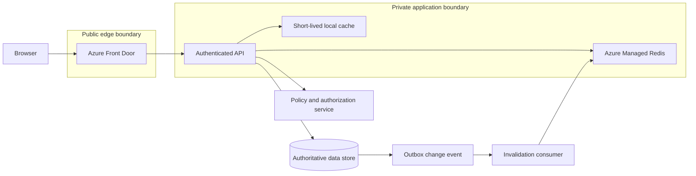
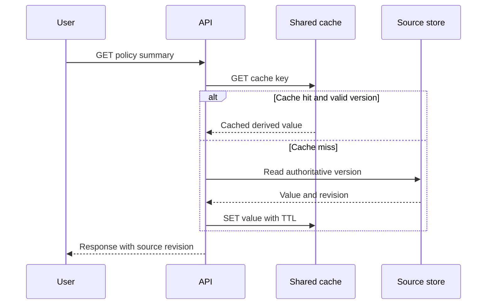
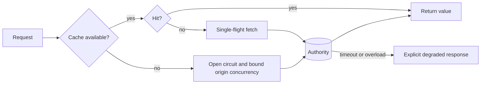

# Caching and content delivery

A cache is a derived, disposable copy of data placed closer to its readers. It can reduce origin load and latency, but it also creates another version of data with its own freshness, isolation, and failure behavior. A design is incomplete until it says which data may be stale, which readers can share a value, and what happens when the cache disappears.

This chapter uses a policy-answer API. The authoritative policy document and its access control list (ACL) live in durable stores. The application caches rendered public assets, derived policy summaries, and bounded query results. It never treats a cache as the source of truth for authorization or audit data.

## Learning objectives

After this chapter, you should be able to:

- decide whether data belongs in a browser, edge, process, or distributed cache;
- define a cache key as a data-isolation contract;
- select a freshness policy and invalidation flow;
- prevent cache failures from becoming an origin outage; and
- measure cache value using user latency and protected-origin load.

## What a cache can and cannot promise

Caching is effective for data that is read frequently, changes infrequently, is expensive to compute or fetch, and can tolerate bounded staleness. It is a poor fit for the only copy of valuable data, highly sensitive authorization decisions, or a workload whose reads rarely hit the same keys. [Azure caching guidance](https://learn.microsoft.com/azure/architecture/best-practices/caching#decide-when-to-cache-data)

The core invariants are:

1. The authoritative store accepts and records business writes.
2. A cache entry is safe to delete at any time.
3. A key contains every identity and version dimension that changes the permitted result.
4. A cache failure is bounded by timeouts and concurrency limits before traffic reaches the origin.
5. An answer that requires current authorization reads authorization from its authority, or it fails closed.

## Requirements and cache classes

| Data | Reader | Freshness rule | Cache decision |
|---|---|---|---|
| Versioned public course image | anonymous browser | immutable after publish | browser and edge cache |
| Tenant policy summary | authenticated tenant user | up to 5 minutes if ACL revision matches | distributed cache |
| Permission decision | API authorization layer | must reflect revocation | authoritative policy service |
| Search retrieval result | authenticated tenant user | bounded by source/index version | tenant-scoped distributed cache |
| Model answer | tenant user | only if evidence, prompt, model, and ACL scope match | normally bypass; evaluate cautiously |
| Audit event | operations or compliance | durable and complete | never cache as authority |

Do not begin with a technology choice. Begin with the read path, change rate, permitted staleness, data classification, and cost of an origin miss.

## A layered topology



The browser and Front Door serve only public, versioned objects. The application controls tenant-specific cache keys. The policy service remains the authority for a decision that changes whether a user may see data.

Private process caches are fast but each replica can hold a different snapshot. A shared cache lets instances see a common cached value, but adds a dependency and network hop. Use a small local cache only for immutable configuration or as a carefully bounded layer in front of a shared cache. [Private and shared cache trade-offs](https://learn.microsoft.com/azure/architecture/best-practices/caching#caching-in-distributed-applications)

## Cache-aside read path

Cache-aside loads a value only after a miss. The application checks the cache, reads the authority on a miss, stores a derived entry with a time-to-live (TTL), and returns the result. It works well where reads dominate writes and the application owns cache behavior. [Cache-aside pattern](https://learn.microsoft.com/azure/architecture/patterns/cache-aside)



The cache record must describe its own validity:

```json
{
  "key": "policy-summary:tenant-42:document-17:acl-19:source-7:renderer-3",
  "sourceVersion": 7,
  "aclRevision": 19,
  "createdAt": "2026-08-12T10:00:00Z",
  "expiresAt": "2026-08-12T10:05:00Z",
  "value": {"summary": "..."}
}
```

The cache key does not need to expose raw user content. Hash an unbounded query after normalizing it, and keep tenant, permission revision, source version, locale, renderer version, and model version as separate, inspectable dimensions when they change the result.

## Freshness and write paths

Cache-aside does not guarantee that cache and authority are consistent. A reader can see a cache miss or briefly stale data after a write. [Cache-aside consistency limits](https://learn.microsoft.com/azure/architecture/patterns/cache-aside#problems-and-considerations)

### Invalidate after durable write

For a policy summary that tolerates a short miss after update:

1. Validate identity, authorization, and optimistic version at the API.
2. Commit the new source record and an outbox event in the authoritative transaction boundary.
3. Publish the event to the invalidation consumer.
4. Delete cache keys for the affected source version and ACL revision.
5. Populate a new value only on a later read.

Write the authority before deleting the cache entry. Deleting first allows a concurrent reader to fetch the still-old source and repopulate the stale value. [Correct invalidation order](https://learn.microsoft.com/azure/architecture/patterns/cache-aside#example)

### Write-through only for a narrow case

Write-through updates the authority and cache before it reports success. It is appropriate for a read-heavy path that requires immediate read-after-write behavior. It costs more coordination and write latency. For constantly changing values or values rarely read after a write, invalidate or bypass the cache instead. [Write consistency choices](https://learn.microsoft.com/azure/architecture/best-practices/caching#keep-the-cache-consistent-on-writes)

Do not use a cache write as a substitute for a durable business transaction. If the application cannot atomically update the authority and publish an invalidation, use an outbox and idempotent consumer. The TTL is a backstop, not the primary correctness mechanism.

## Choosing a TTL from a risk budget

TTL is a business decision expressed in time. A short TTL reduces stale exposure but increases misses and origin load. A long TTL improves hit rate but widens the stale window.

| Object | Example TTL | Why |
|---|---:|---|
| Fingerprinted static asset | 1 year or immutable policy | URL changes on content change |
| Public documentation page | minutes to hours | publication may tolerate edge propagation |
| Tenant policy summary | 5 minutes plus revision invalidation | bounded convenience data |
| Authorization result | 0 seconds unless policy permits bounded staleness | revocation risk outweighs cache value |
| Negative lookup | seconds | avoids repeated misses without hiding newly created data for long |

Measure hit rate by key class. A 90% global hit rate can hide a critical tenant path with no reuse. Also measure origin QPS, cache miss latency, eviction rate, value size, and cache error rate. TTL cannot be chosen from a generic best-practice number.

## Edge caching and HTTP behavior

Azure Front Door caches only `GET` requests. It evaluates cache duration from `s-maxage`, then `max-age`, then `Expires`. Responses marked `private`, `no-cache`, or `no-store` are not cached even if a rule otherwise enables caching. [Front Door cache expiration](https://learn.microsoft.com/azure/frontdoor/front-door-caching#cache-expiration)

Use separate routes for public static assets and authenticated application traffic. Microsoft warns that caching dynamic authenticated responses can leak user-specific content if routes are misconfigured. [Front Door route isolation guidance](https://learn.microsoft.com/azure/frontdoor/front-door-caching)

```http
GET /assets/diagram.8f3a.png HTTP/1.1

HTTP/1.1 200 OK
Cache-Control: public, max-age=31536000, immutable
```

```http
GET /api/policies/document-17 HTTP/1.1
Authorization: Bearer <token>

HTTP/1.1 200 OK
Cache-Control: private, no-store
```

Version public asset URLs at publication time. Purge is an emergency operation, not the normal release mechanism. Front Door documentation recommends publishing updated assets at new URLs so clients fetch the new version immediately. [Front Door purge guidance](https://learn.microsoft.com/azure/frontdoor/front-door-caching#cache-purge)

Query strings are part of cache-key design. If a query string controls language, image width, or content version, it must be included. If it contains a tracking field, exclude it deliberately only after proving it cannot change the representation or authorization result.

## Cache failure is an origin-protection problem

When a cache fails, all miss traffic can reach the origin at once. A cache fallback without a circuit breaker is a thundering herd generator.



Use short cache timeouts. Coalesce concurrent misses for the same key when safe, so one origin fetch serves many waiting callers. Add bounded TTL jitter to reduce synchronized expiration. Cap origin fallback concurrency separately from normal API concurrency. For cache classes that allow it, serve stale content only with a stated maximum staleness and visible version metadata.

Applications must be able to fall back to the source store when a shared cache is unavailable, but that fallback can overload the source. Microsoft recommends circuit breaking and, where useful, a bounded local cache layer to protect the recovery path. [Cache failure guidance](https://learn.microsoft.com/azure/architecture/best-practices/caching#implement-high-availability-and-scalability-and-improve-performance)

## Security and network isolation

A cache is not a free-for-all internal service. Treat it as a data store with its own identity, network, key-space, and audit requirements.

- Use Microsoft Entra ID authentication and least-privilege roles for Azure Managed Redis clients. [Redis identity guidance](https://learn.microsoft.com/azure/architecture/best-practices/caching#protect-cached-data-in-azure-managed-redis)
- Use private endpoints and TLS so cache traffic does not traverse the public internet. [Redis network guidance](https://learn.microsoft.com/azure/architecture/best-practices/caching#protect-cached-data-in-azure-managed-redis)
- Do not place access tokens, passwords, raw prompts, or unredacted confidential documents in values merely to speed a request.
- Separate tenants by key prefix at minimum; for stricter isolation, use separate caches or encryption boundaries when a compromised cache credential must not expose every tenant.
- Log key class, tenant pseudonym, TTL, hit or miss, cache outcome, source version, and correlation ID. Do not log full values.

Azure Managed Redis supports private endpoints, Entra-based authentication, replication and failover across its current tiers, but cache durability does not remove the need for an authoritative source. [Azure Managed Redis capabilities](https://learn.microsoft.com/azure/redis/overview)

## Capacity and cost model

Size a cache from working set, not total database size.

$$
\text{cache bytes} = \text{hot keys} \times (\text{mean value bytes} + \text{metadata overhead}) \times \text{headroom}
$$

Suppose 2 million hot summaries average 12 KiB serialized, with a 1.4 headroom factor:

$$
2{,}000{,}000 \times 12\ \text{KiB} \times 1.4 \approx 32.0\ \text{GiB}
$$

This is only a planning number. Measure serialized size, TTL distribution, eviction, connections, command latency, bandwidth, and p95 miss cost under representative load. Azure Managed Redis tiers trade memory capacity, compute, and throughput; memory saturation and network bandwidth can both produce timeouts. [Redis tier and bandwidth considerations](https://learn.microsoft.com/azure/redis/overview#choosing-the-right-tier)

## What not to cache

- An authorization grant whose revocation must take effect immediately.
- A financial balance or mutable inventory as the only response source.
- A cross-tenant semantic answer without a tenant and permission boundary.
- A huge one-time result with no measured reuse.
- A response whose cache key is unknown or cannot be audited.

Semantic caching is especially risky. Similar wording does not imply interchangeable answers. Microsoft recommends using it only when semantic equivalence is safe and data is not private or sensitive. [Semantic cache constraints](https://learn.microsoft.com/azure/architecture/patterns/cache-aside#problems-and-considerations)

## Operational playbook

| Symptom | Likely cause | Immediate action | Follow-up evidence |
|---|---|---|---|
| Hit rate drops after release | key version changed or TTL shortened | inspect key cardinality and deploy diff | compare per-key-class hit rate |
| Origin latency spikes | cache outage or synchronized expiry | open circuit and reduce origin concurrency | cache availability and miss burst trace |
| Tenant sees unexpected result | incomplete key or invalidation defect | disable affected cache class and investigate | source, ACL, key dimensions, correlation ID |
| Evictions increase | working set exceeds memory | reduce value size or resize after measurement | eviction, memory, TTL, and size histograms |
| Stale policy after update | outbox or invalidator failed | bypass affected class and replay event | event status and source revision |

## Review checklist

- Which data store is authoritative for every cached value?
- Can the key be read aloud as an authorization and versioning rule?
- What staleness is permitted, for whom, and why?
- Is the write order authority first, then invalidation or explicit write-through?
- Does a cache failure have bounded timeouts, request coalescing, and origin protection?
- Are edge routes separated from authenticated dynamic routes?
- Are access tokens, confidential content, and audit records excluded from cache values?
- Which metrics demonstrate that the cache improves the user flow rather than moving load elsewhere?

## Hands-on exercise

Design a cache plan for a policy-answer API. Define three key schemas, their TTLs, the authority for each value, invalidation events, stale-read policy, a Front Door route policy, a cache-outage response, and dashboards for hit rate, source QPS, evictions, and per-tenant cache reuse. Include a test proving that an ACL revision change cannot return a previously permitted value.
