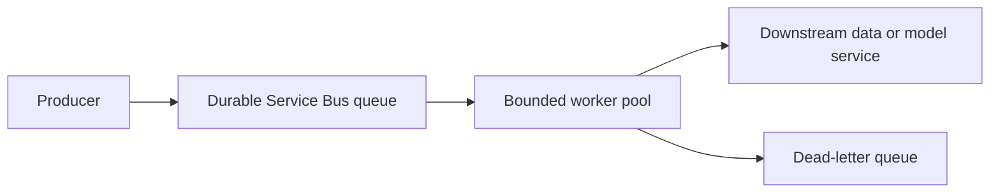
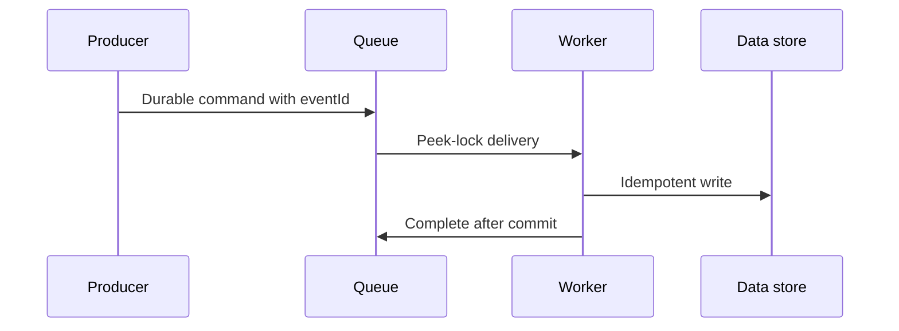
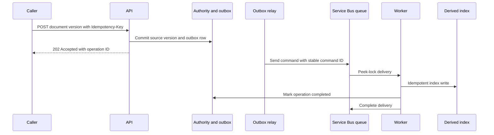

# Messaging, events, and backpressure

Messaging separates the rate at which work arrives from the rate at which a downstream system can safely process it. It does not make work disappear. A queue whose producer rate stays above consumer rate is an expanding latency backlog.

## 1. Choose broker semantics

| Need | Azure service | Key model |
|---|---|---|
| Business command, workflow, ordering, dead-lettering, transactions | Azure Service Bus | Queue or topic/subscription |
| High-throughput telemetry, logs, replayable event stream | Azure Event Hubs | Partitioned append-only event log |

Azure Service Bus is an enterprise broker with queues, publish-subscribe topics, sessions, transactions, duplicate detection, and dead-letter queues. [Service Bus overview](https://learn.microsoft.com/azure/service-bus-messaging/service-bus-messaging-overview) Event Hubs is an event-streaming platform whose consumers track offsets independently in partitions. [Event Hubs overview](https://learn.microsoft.com/azure/event-hubs/event-hubs-about)

## 2. Queue flow and backpressure



Use a queue when a caller can accept `202 Accepted` and processing can occur later. Limit worker concurrency according to downstream capacity. Queue-based load leveling protects a dependency from burst traffic, but unlimited worker autoscale only transfers the overload downstream. [Queue-Based Load Leveling](https://learn.microsoft.com/azure/architecture/patterns/queue-based-load-leveling)

$$
\text{backlog growth per second} = \lambda_{producer} - \mu_{consumer}
$$

If this value remains positive, scale consumers within the target's safe rate or shed lower-priority work at the producer.

## 3. Message contract

```json
{
  "eventId": "evt_01J...",
  "eventType": "document.index.requested.v1",
  "occurredAt": "2026-08-12T10:00:00Z",
  "tenantId": "tenant-42",
  "documentId": "doc_01",
  "versionId": "v7",
  "traceparent": "00-..."
}
```

Keep messages small and immutable. Put a durable resource ID in the message, not a large document or secret. Consumers validate schema version, authorize the action, make processing idempotent, then settle the message only after the durable result commits.

## 4. Dead-letter operations

Service Bus provides a dead-letter subqueue for each queue and subscription. It has no automatic cleanup, so teams must inspect, classify, correct, replay, or explicitly discard messages. [Service Bus dead-letter queues](https://learn.microsoft.com/azure/service-bus-messaging/service-bus-dead-letter-queues)

Alert on DLQ depth and oldest message age. Store a safe reason code such as `unsupported_schema` or `source_deleted`; do not put raw confidential payloads or stack traces in a message description.

## Exercise

Design a document-indexing event flow. Define the command queue, notification topic, idempotency key, session key if ordering is required, retry count, DLQ policy, and consumer concurrency cap.

## Message lifecycle



Service Bus queues support competing consumers; topics copy events to independent subscriptions. Use sessions only when ordering by a key is a requirement, because ordering constrains parallelism. [Service Bus concepts](https://learn.microsoft.com/azure/service-bus-messaging/service-bus-messaging-overview)

## Broker selection and recovery

Use Event Hubs for replayable, partitioned telemetry streams where consumers checkpoint offsets. Use Service Bus for commands requiring delivery workflows, sessions, transactions, and dead-letter operations. [Event Hubs versus Service Bus](https://learn.microsoft.com/azure/event-hubs/event-hubs-about#choosing-between-azure-messaging-services)

Each dead-letter queue needs a triage owner, reason taxonomy, retention policy, and replay procedure. DLQs do not clean themselves automatically. [Dead-letter queues](https://learn.microsoft.com/azure/service-bus-messaging/service-bus-dead-letter-queues)

## A message is a contract, not a background HTTP request

A producer has completed its responsibility only after the broker durably accepts a valid message. A consumer owns the business work only after it validates the schema, performs the durable side effect, and settles the broker delivery. These are separate state transitions.

| Term | Meaning | Design consequence |
|---|---|---|
| Command | A request to do one thing | One responsible consumer and an idempotency rule |
| Event | A statement that something happened | Many independent subscribers may react |
| Queue | Point-to-point work buffer | Competing consumers share work |
| Topic and subscription | Publish-subscribe distribution | Each subscription gets its own delivery and DLQ state |
| Delivery | One broker attempt to hand work to a consumer | It can repeat after a crash or lock loss |
| Settlement | Complete, abandon, defer, or dead-letter a delivery | Do it only after the required durable outcome |

Service Bus queues store work until a receiver is available; topics copy matching messages to independent subscriptions. Service Bus sessions provide FIFO processing only when ordering is a requirement and a session key is present. [Service Bus concepts](https://learn.microsoft.com/azure/service-bus-messaging/service-bus-messaging-overview)

## Command, event, and stream selection

Do not call every asynchronous record an event. Choose the contract from the consumer's responsibility.

| Workload | Correct primitive | Why |
|---|---|---|
| `document.index.requested` | Service Bus queue | One worker fleet must complete a business command |
| `document.indexed` | Service Bus topic | Audit, notification, and analytics subscribers act independently |
| Application traces or device readings | Event Hubs stream | Consumers independently read a partitioned append-only log using offsets |
| One lightweight resource-change notification | Event Grid or equivalent routing | Push notification, not workflow ownership |

Event Hubs is a streaming platform. Producers append events to partitions; each consumer group independently tracks its position. Partition ordering applies within a partition, not across the entire hub. [Event Hubs core model](https://learn.microsoft.com/azure/event-hubs/event-hubs-about#how-it-works)

## The durable command flow



The outbox prevents the dual-write failure in which a database write succeeds but publishing the corresponding command fails. The relay can retry sending the same command ID. The consumer's unique write key, for example `(documentId, versionId, chunkId)`, makes a repeated delivery harmless.

## Locks, redelivery, and idempotency

In peek-lock delivery, the worker receives exclusive temporary ownership. It must settle before the lock expires and before its receiver closes. If it crashes after the index write but before `Complete`, Service Bus can redeliver the message. That is expected behavior, not evidence that the broker duplicated a business command.

Implement idempotency at the target authority, not only in worker memory:

```sql
create table ProcessedCommand (
  command_id varchar(80) primary key,
  completed_at_utc timestamp not null,
  outcome varchar(32) not null
);
```

Within the same durable transaction boundary, insert `command_id` and apply the side effect. A duplicate-key result means the worker should return the recorded outcome and settle the delivery. Do not settle before this boundary commits.

Service Bus increments delivery count when a peek-lock message is abandoned or its lock expires; once maximum delivery is exceeded, it moves to the DLQ. [Service Bus delivery and lock behavior](https://learn.microsoft.com/azure/service-bus-messaging/service-bus-dead-letter-queues#maximum-delivery-count)

## Ordering is a cost

Parallel consumers improve throughput but do not preserve a global sequence. Most designs do not need global ordering. They need per-entity ordering, such as a single document version or account. Use an explicit session or partition key only after naming that entity.

```json
{
  "messageId": "idx:doc-01:v7",
  "correlationId": "op-01J...",
  "subject": "document/doc-01/version/v7",
  "sessionId": "doc-01",
  "type": "document.index.requested.v1",
  "data": {"documentId": "doc-01", "versionId": "v7"}
}
```

The session key serializes work for `doc-01`; it must not be `tenantId` if one large tenant would serialize all of its documents. Ordering is a throughput trade-off, so test the largest key, not only average traffic.

## Backpressure is an admission decision

The producer rate is $\lambda$ messages per second and the safe consumer completion rate is $\mu$. Queue growth is:

$$
\frac{d\,backlog}{dt} = \lambda - \mu
$$

If $\lambda > \mu$ for a sustained period, more backlog means more delay, not more capacity. Estimate the delay for a stable backlog as:

$$
	ext{queue delay} \approx \frac{\text{ready messages}}{\mu}
$$

For example, 18,000 ready messages at a safe completion rate of 30 per second imply about 10 minutes before a newly arrived item begins processing. This may violate a 5-minute indexing objective even if the API returns `202` successfully.

Set consumer concurrency from the downstream safe rate:

```text
max worker concurrency = floor(downstream_safe_RPS * mean_work_seconds)
```

When age or depth crosses a policy threshold, increase consumers only while target throttling remains below its limit. Otherwise shed low-priority intake, delay scheduled work, reject new asynchronous requests with a retry contract, or give customers a visible delayed state. Azure warns that unbounded consumer autoscaling simply transfers overload to downstream dependencies. [Queue-based load-leveling constraints](https://learn.microsoft.com/azure/architecture/patterns/queue-based-load-leveling#problems-and-considerations)

## Dead-letter queues are an operational work queue

A DLQ is not a garbage bin and it does not clean itself. Each queue and topic subscription has its own DLQ; messages remain there until a consumer explicitly handles them. [Service Bus DLQ lifecycle](https://learn.microsoft.com/azure/service-bus-messaging/service-bus-dead-letter-queues#the-dead-letter-queue)

| Reason class | Example action | Replay rule |
|---|---|---|
| Malformed or unsupported schema | Fix producer or transform with approval | Replay only after a compatible handler exists |
| Missing source version | Restore source or discard as obsolete | Never fabricate the missing authority |
| Transient dependency exhaustion | Correct capacity or outage | Replay with the same message ID |
| Permanent authorization denial | Investigate policy or sender identity | Do not replay until authorization is corrected |
| Repeated business validation failure | Expose a failed operation to the caller | Require a new corrected command |

Store a short reason code and sanitized diagnostic metadata. Do not place raw documents, secrets, tokens, or full stack traces in dead-letter descriptions. Service Bus records system reasons such as `TTLExpiredException` and `MaxDeliveryCountExceeded`, which should drive a specific runbook. [Dead-letter reasons](https://learn.microsoft.com/azure/service-bus-messaging/service-bus-dead-letter-queues#moving-messages-to-the-dlq)

## Identity, network, and audit boundaries

Give the API sender only send permission to the required queue or topic. Give a worker only receive and settle permission to its entity. A notification service should receive from its subscription, not from every business queue. Use workload identity and least-privilege roles rather than connection strings where supported. [Identity and least-privilege guidance](https://learn.microsoft.com/azure/well-architected/security/identity-access)

Private connectivity limits reachable network paths, but it does not decide which identity may send, receive, dead-letter, or replay a message. Audit message type, ID, correlation ID, tenant pseudonym, producer version, consumer version, settlement outcome, delivery count, and DLQ reason. Do not log confidential payloads by default.

## Observability and recovery

Monitor ready and active message counts, oldest-message age, completion rate, abandonment, lock loss, delivery count, DLQ depth and age, dependency throttle rate, and end-to-end operation completion time. Event Hubs monitoring also needs partition lag and checkpoint progress because each consumer group advances independently. [Event Hubs monitoring model](https://learn.microsoft.com/azure/event-hubs/event-hubs-about#key-capabilities)

Recovery drill: stop a worker after it writes derived data but before settlement; verify that redelivery does not duplicate results. Then exhaust a downstream quota; verify worker concurrency falls, queue age alerts, the API returns a documented delayed state, and operators can classify and replay a DLQ item safely.

## Design review checklist

- Is this record a command, an event, or a stream, and who owns each outcome?
- What durable boundary proves accepted work will not vanish?
- What message ID and target uniqueness rule make redelivery safe?
- What entity requires ordering, and what throughput is sacrificed to preserve it?
- What producer-admission action occurs when backlog age reaches the user objective?
- Who owns each DLQ, how long are messages retained, and how is replay authorized?
- Which identity can send, receive, and replay, and which network paths are allowed?
- Can traces follow one request from API acceptance to business completion?
