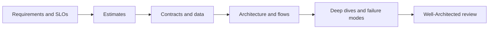

# The system design method

A design interview and a production architecture review use the same discipline: make requirements explicit, estimate the workload, define contracts and data, draw the critical paths, then defend trade-offs under failure and scale.

## 1. Scope before architecture

Ask what must be true for users, operators, and security reviewers. For an AI assistant, clarify data classification, tenants, retrieval sources, model ownership, tool authority, acceptable wrong answers, latency, retention, budget, geography, and human approval.

Write assumptions where the prompt is silent. A stated assumption can be revised. An unstated assumption becomes a hidden defect.

## 2. Work through five passes



1. Define functional and nonfunctional requirements plus exclusions.
2. Estimate peak rate, storage, bandwidth, tokens, and recovery objectives.
3. Define APIs, events, identities, authoritative data, retention, and idempotency.
4. Draw read, write, asynchronous, deployment, and recovery flows.
5. Deep dive into the components that determine feasibility, then review reliability, security, cost, operations, and performance.

Azure architecture guidance recommends aligning applications to organizational standards, applying the Well-Architected Framework, selecting an architecture style and data model deliberately, using design patterns for known trade-offs, and reviewing service-specific guidance. [Azure application architecture fundamentals](https://learn.microsoft.com/azure/architecture/guide/)

## 3. Make decisions reviewable

For each meaningful choice, record the context, alternatives, decision, consequence, owner, and revisit trigger.

```text
Decision: queue document extraction rather than perform it synchronously.
Reason: extraction duration is unbounded relative to API latency objective.
Consequence: operation state, idempotency, DLQ, and worker observability are required.
Revisit when: p95 extraction time remains below synchronous budget at expected peak.
```

The Well-Architected Framework treats the five pillars as trade-off lenses, not a checklist to optimize independently. Use its checklists and service guides iteratively as the workload matures. [How to use the Well-Architected Framework](https://learn.microsoft.com/azure/well-architected/what-is-well-architected-framework)

## Exercise

Apply the five passes to an enterprise knowledge assistant. Produce one page each for requirements, estimates, contracts, architecture, and top five risks. Include one deliberate trade-off where you choose lower cost over faster recovery.

## Required design artifacts

| Artifact | Decision it forces |
|---|---|
| Requirements table | What is in and out of scope |
| Capacity sheet | Which limit fails first |
| API and event contracts | Idempotency, ownership, error semantics |
| Data model | Authority, partition, retention, access control |
| Architecture and sequences | Trust boundary, async path, failure domain |
| Failure-mode table | Detection, containment, recovery, evidence |
| Decision log | Alternatives, consequences, revisit condition |

Review every architecture against reliability, security, cost, operations, and performance together. The Well-Architected Framework treats these as trade-off lenses that evolve with the workload. [Well-Architected review method](https://learn.microsoft.com/azure/well-architected/what-is-well-architected-framework)

## Interview and production distinction

An interview requires defensible assumptions. Production requires measured limits, tested recovery, access reviews, and deployment evidence. Keep the same reasoning order, but replace assumptions with telemetry and drills before release.
