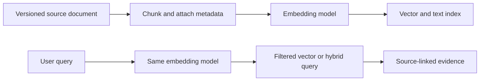
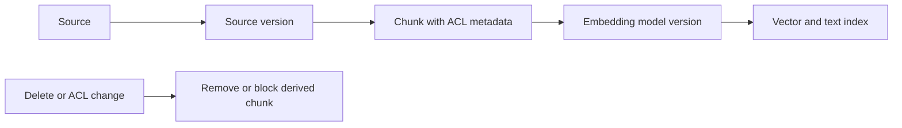
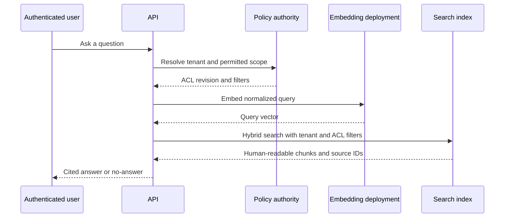

# Embeddings and vector similarity

Embeddings turn content into numeric vectors so a system can retrieve semantic neighbors. They do not verify facts, grant access, or replace keyword search. A vector score is a ranking signal that must be combined with metadata filters, source provenance, and evaluation.


## 1. Vector representation

An embedding is a vector of floating-point numbers whose geometry represents semantic relationships learned by a model. Similar content tends to have nearby vectors. Azure OpenAI documentation describes cosine similarity as a common way to compare embedding vectors. [Embeddings and cosine similarity](https://learn.microsoft.com/azure/foundry-classic/openai/concepts/understand-embeddings)

$$
\operatorname{cosine}(q,d) = \frac{q \cdot d}{\lVert q \rVert\lVert d \rVert}
$$

Cosine similarity measures angle, not truth. A passage can be semantically close but outdated, unauthorized, or missing the required exception.

## 2. Ingestion and query consistency



Use the same embedding model for indexed content and query text. Azure AI Search explicitly recommends model consistency between source-document embeddings and query embeddings. [Vector query guidance](https://learn.microsoft.com/azure/search/vector-search-how-to-query#convert-a-query-string-input-into-a-vector)

Every vector record needs tenant, document ID, source version, ACL or permission revision, source location, language, and deletion state. Filter on access boundaries before content reaches a prompt.

## 3. Vector-only is rarely enough

Azure AI Search can run vector and keyword search in parallel as hybrid search, then merge results. This helps when exact terms, serial numbers, legal clauses, or product identifiers matter as much as semantic meaning. [Vector and hybrid search](https://learn.microsoft.com/azure/search/vector-search-overview)

Vector queries return nearest neighbors up to `k`, even when the matches are weak. Do not assume a nonempty result proves relevance. Use thresholds only after evaluating score distributions, and use a no-answer path when retrieval has insufficient evidence. [Vector result behavior](https://learn.microsoft.com/azure/search/vector-search-how-to-query#number-of-ranked-results-in-a-vector-query-response)

## 4. Evaluation

Build a retrieval test set with representative questions, expected documents, no-answer questions, permission changes, exact-keyword queries, multilingual content, and stale versions. Measure recall at $k$, mean reciprocal rank, citation correctness, retrieval latency, filter denials, and index freshness. Re-embed all content when changing embedding model or dimension; mixing vector spaces makes scores meaningless.

## Exercise

Define an embedding record for an internal policy corpus. Specify chunk identity, vector field, metadata filters, model version, deletion event, and the test cases that prove an unauthorized document cannot be retrieved.

## Embedding lifecycle



Changing the embedding model or dimension creates a new vector space. Re-embed the corpus and query with the matching model; do not compare vectors from incompatible spaces. Azure AI Search requires vector field dimensions to match embedding output and recommends the same model for documents and queries. [Vector index requirements](https://learn.microsoft.com/azure/search/vector-search-how-to-create-index)

## Evaluation set

Measure recall at $k$, mean reciprocal rank, permission-filter accuracy, source freshness, no-answer precision, and latency. Include exact identifiers, synonyms, multilingual queries, stale documents, and queries where the answer must be denied.

## What an embedding represents

An embedding model maps text to a fixed-length ordered list of numbers. The numbers do not contain a human-readable definition per position. Their useful property is relational: inputs the model considers semantically similar tend to have vectors that are close under a selected similarity metric. Azure describes embeddings as dense representations of semantic meaning and cosine similarity as a common comparison for Azure OpenAI embeddings. [Embedding concepts](https://learn.microsoft.com/azure/foundry-classic/openai/concepts/understand-embeddings)

The important boundary is the **embedding space**. A vector has meaning only relative to the model, dimensions, preprocessing, and similarity metric that produced the index. Changing any of those can make a score incomparable with older vectors.

| Component | Must be versioned | Why |
|---|---|---|
| Source | document ID and immutable version | proves what was embedded |
| Chunker | strategy, size, overlap, parser version | changes text representation |
| Embedding | deployment, model, dimensions | defines vector space |
| Index | schema and vector profile | changes retrieval behavior |
| Query | embedding deployment and normalization | must be compatible with indexed vectors |

## Similarity is not relevance or truth

Cosine similarity compares the angle between vectors:

$$
\operatorname{cosine}(q,d) = \frac{q \cdot d}{\lVert q \rVert\lVert d \rVert}
$$

A high score means that the query and chunk are close in the model's vector space. It does not prove that the chunk is current, authorized, complete, or factually sufficient. A policy exception can be semantically close to the question while applying to the wrong jurisdiction. This is why a production retrieval system combines vector ranking with source version, metadata filters, keyword retrieval, and an explicit no-answer path.

## Record design and lifecycle

```json
{
    "id": "tenant-42:policy-17:v9:chunk-03",
    "tenantId": "tenant-42",
    "documentId": "policy-17",
    "sourceVersion": 9,
    "chunkOrdinal": 3,
    "content": "...",
    "sourceLocation": {"page": 4, "heading": "Eligibility"},
    "aclRevision": 21,
    "embeddingModel": "text-embedding-3-large",
    "embeddingDimensions": 1536,
    "active": true
}
```

The vector is derived state. The authoritative document and ACL system own deletion and access decisions. On a source update, index the new version, validate it, then change the active version. On an ACL revocation, stop returning affected records at query time before asynchronous cleanup completes. On deletion, tombstone the source and derived records, then verify that neither keyword nor vector retrieval returns it.

## Query path and access boundary



Authorization is evaluated before selected chunks reach a model prompt. A model instruction such as "only use permitted documents" is not an authorization mechanism. Azure AI Search supports vector fields together with filterable nonvector fields; vector fields themselves are not filterable. [Vector field and filter design](https://learn.microsoft.com/azure/search/vector-search-how-to-create-index#add-a-vector-field-to-the-fields-collection)

## Capacity and quality decisions

Embedding cost and throughput depend on input tokens, not document count. Estimate ingestion work as:

$$
	ext{embedding tokens/day} = \text{documents/day} \times \text{chunks/document} \times \text{tokens/chunk}
$$

If 100,000 documents produce 40 chunks of 450 tokens, the pipeline submits about 1.8 billion embedding tokens per day. That number drives quota, queue sizing, retry budget, and rollout duration. Do not re-embed a corpus during business peak without admission control and a plan for dual-index reads.

Evaluate with fixed questions and expected evidence. Report recall at $k$, mean reciprocal rank, filter-denial correctness, freshness lag, citation correctness, p95 retrieval latency, and no-answer precision. Split results by tenant, language, document type, and query class. A global average can hide failure for exact identifiers, low-resource languages, or large tenants.

## Re-embedding migration

1. Create a new index or new vector field with the target dimensions and profile.
2. Reprocess immutable source versions with the new chunker and embedding deployment.
3. Run the evaluation set against both retrieval paths.
4. Verify ACL filtering, deletion behavior, source citations, and latency under peak-like load.
5. Shift a measured percentage of reads to the new index.
6. Retire the old index only after rollback and retention requirements expire.

Azure AI Search requires vectors in a field to match the field dimensions, and vector profile choices define the algorithm and compression used for retrieval. [Vector index compatibility](https://learn.microsoft.com/azure/search/vector-search-how-to-create-index)

## Review checklist

- Can every returned chunk be traced to an active source version and location?
- Is the same embedding space used for indexed and query vectors?
- Are tenant, ACL revision, source state, and language represented as query-time metadata?
- Does a high similarity score ever bypass authorization or citation validation?
- Has the team measured quality by query class rather than one aggregate score?
- Can a new embedding model be introduced and rolled back without mixing vector spaces?
