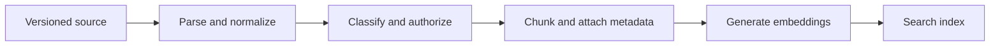

# Document ingestion and chunking

Ingestion turns an authoritative source document into derived, searchable chunks. It must preserve source version, ACL, heading path, language, and deletion lineage. Without those fields, a RAG system cannot cite, revoke, or rebuild safely.


## Pipeline



Azure AI Search supports fixed, structure-aware, semantic, and custom chunking through indexers and skillsets. Chunking is needed both for model input limits and for representing multi-topic documents at a useful retrieval granularity. [Azure AI Search chunking guidance](https://learn.microsoft.com/azure/search/vector-search-how-to-chunk-documents)

## Chunk record

```json
{"id":"doc-7:v3:c12","documentId":"doc-7","version":3,"text":"...","headingPath":["Benefits","Leave"],"aclRevision":19,"sourceOffset":{"page":8},"contentHash":"..."}
```

Start with a measured baseline. Microsoft suggests 512 tokens with 25% overlap as an initial experiment, not a universal default. [Chunk overlap guidance](https://learn.microsoft.com/azure/search/vector-search-how-to-chunk-documents#content-overlap-considerations)

## Failure handling

Use immutable source versions, idempotent chunk IDs, an outbox event, and tombstones. On ACL change, filter immediately at query time and asynchronously update derived records. On delete, block retrieval before lifecycle deletion removes source bytes.

## Source authority and derived state

The document repository owns the original bytes, source version, retention policy, and access-control decision. The extraction output, chunks, embeddings, and search index are derived state. They exist to make retrieval fast, not to replace the source. This distinction makes deletion, correction, and rebuild possible.

| Record | Owner | Required identity | Recovery approach |
|---|---|---|---|
| Original document | source repository | document ID and immutable version | restore under source retention policy |
| Parsed representation | ingestion pipeline | parser version and source hash | regenerate from source version |
| Chunk | ingestion pipeline | source version and ordinal | regenerate deterministically |
| Embedding | embedding pipeline | model and dimension version | re-embed chunk |
| Search record | search index | chunk ID and index version | rebuild from manifest |

Azure AI Search can use integrated chunking and vectorization through indexers and skillsets, or an application can generate chunks and vectors externally and push them into an index. The choice changes operational ownership, not the requirement to preserve source lineage. [Azure AI Search vectorization paths](https://learn.microsoft.com/azure/search/vector-search-overview)

## Ingestion contract

```json
{
    "eventId": "ingest:policy-17:v9",
    "eventType": "document.version.created.v1",
    "tenantId": "tenant-42",
    "documentId": "policy-17",
    "sourceVersion": 9,
    "contentHash": "sha256:...",
    "classification": "internal",
    "aclRevision": 21,
    "occurredAt": "2026-08-12T10:00:00Z"
}
```

The producer writes the authoritative version and an outbox event together. A relay can retry publication without creating a second version because `eventId` is stable. A worker records an ingestion manifest before it reports a version searchable.

## Chunking is a retrieval decision

A chunk should express one retrievable idea with enough surrounding context to be interpreted. A chunk that is too small loses the exception or subject. A chunk that is too large mixes unrelated ideas, raises embedding cost, and consumes prompt budget. Azure suggests starting experiments at 512 tokens with 25% overlap, but the correct value depends on document shape, query behavior, and the models used. [Chunking and overlap guidance](https://learn.microsoft.com/azure/search/vector-search-how-to-chunk-documents#content-overlap-considerations)

| Content shape | Starting strategy | Risk to test |
|---|---|---|
| Policy with headings and exceptions | heading-aware, variable length | exception separated from rule |
| Narrative manual | token-bounded chunks with overlap | context loss at boundaries |
| Table-heavy report | preserve table, headers, and page location | row meaning lost without column headers |
| Short independent records | one record per chunk | unnecessary duplication |

Every chunk needs a human-readable citation location. A page number alone is insufficient for HTML or changing documents; preserve heading path, source offset, and source version.

## Idempotent processing and lifecycle

Use a chunk ID that is a pure function of tenant, document, source version, and ordinal:

```text
chunkId = tenantId + ':' + documentId + ':v' + sourceVersion + ':c' + ordinal
```

Processing order:

1. Validate the source event and tenant boundary.
2. Fetch the immutable source version using workload identity.
3. Parse layout, headings, tables, language, and classification.
4. Produce chunks with deterministic IDs and evidence locations.
5. Generate embeddings with a versioned deployment.
6. Upsert chunks and vectors into a staging index or inactive source version.
7. Run count, schema, ACL, and sample-query validation.
8. Mark the source version active and publish the ingestion manifest.

If a worker dies after an index upsert but before completion, retrying the same chunk IDs converges on the intended state. Do not activate a partly indexed version merely because some chunks succeeded.

## Access control and deletion

Apply authorization during query, not only during ingestion. An ACL can change after a chunk was indexed. Store tenant, source state, ACL revision, classification, and permitted principals or groups as filterable metadata, then validate current policy before chunks enter model context.

On deletion: revoke retrieval first, tombstone the source version and derived records, remove index entries, then delete source bytes according to the authoritative retention policy. A background cleanup delay must not expose a deleted document because query-time filters see the tombstone immediately.

Use managed identities and least-privilege Azure AI Search data-plane roles for ingestion and query components. Search service administration, document upload, and query-only access are distinct permissions. [Azure AI Search RBAC roles](https://learn.microsoft.com/azure/search/search-security-rbac)

## Capacity, backpressure, and observability

Estimate the ingestion queue from source arrival rate and completion time:

$$
	ext{chunk rate} = \text{documents/sec} \times \text{mean chunks/document}
$$

At 10 documents per second and 40 chunks per document, the pipeline creates 400 chunks per second before retries. Each stage has a different safe rate: parsing CPU, embedding tokens, index writes, and source-store reads. Bound worker concurrency by the slowest downstream dependency. Queue age is a better customer-facing signal than queue depth because document sizes vary.

Monitor source-to-searchable latency, parser failures by file type, chunks per document, token distribution, embedding errors, index success rate, inactive-version count, deletion lag, ACL-filter rejection rate, and source/index version mismatch. Alert when the oldest accepted document exceeds its indexing objective.

## Recovery table

| Failure | Safe behavior | Recovery evidence |
|---|---|---|
| Parser cannot read source | mark operation failed; do not index partial text | source ID, parser version, safe error code |
| Embedding service throttles | pause or bound workers; retain queued work | queue age and retry budget stay within objective |
| Index write partially succeeds | keep version inactive | manifest reconciliation matches expected chunk count |
| ACL is revoked | filter result immediately | unauthorized synthetic query returns no content |
| Source is deleted | tombstone before cleanup | keyword and vector queries return no chunk |

## Review checklist

- Can every chunk be traced to an immutable source version and location?
- Is the chunk strategy measured against the actual question set, tables, and exceptions?
- Does one retry converge to one chunk record and one manifest result?
- Which stage owns the active-version switch?
- Can an ACL revocation block retrieval before background index cleanup completes?
- Can operators rebuild a search index without recovering it as the only copy of data?

## Exercise

Design chunking for a policy manual containing tables, exceptions, and appendices. Define chunk parent-child keys, overlap policy, citation representation, source-version change event, and test queries.
