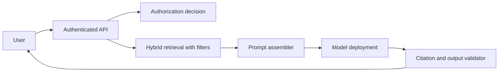
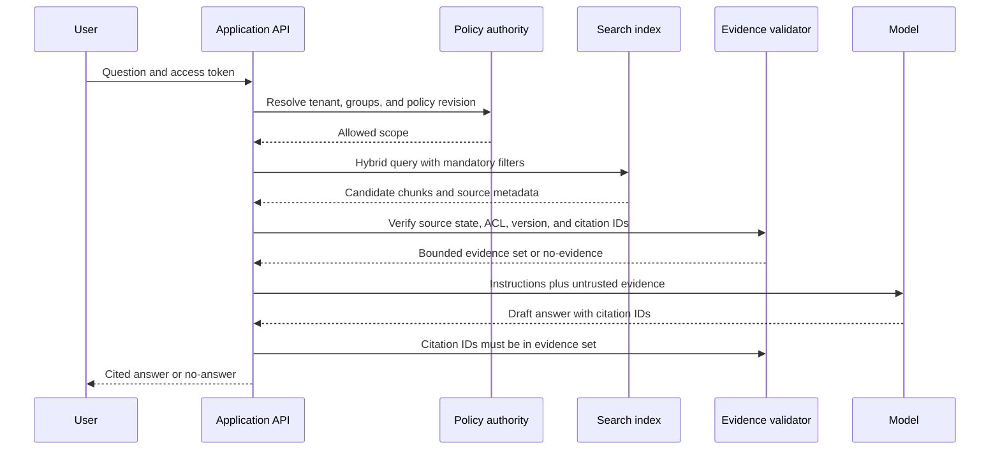

# Enterprise RAG architecture

Retrieval-augmented generation grounds a model in approved content, but only when ingestion, access control, retrieval, prompt assembly, and citation validation form one system.

## Architecture



Azure AI Search supports classic RAG using hybrid search and semantic ranking, and agentic retrieval for more complex multi-source planning. Choose classic RAG when simplicity and query control matter; choose agentic retrieval when evaluated conversational complexity justifies additional orchestration. [RAG approaches](https://learn.microsoft.com/azure/search/retrieval-augmented-generation-overview)


## Security invariant

Authorization occurs before a chunk is placed in the model context. Search metadata supports filtering, but the application's policy authority remains authoritative. A citation must identify the actual retrieved document version and chunk. Never cache an answer across tenants without tenant and permission-revision isolation.

## Query policy

1. Normalize user query and resolve identity.
2. Apply tenant and document filters.
3. Run keyword and vector retrieval in parallel.
4. Rerank and trim evidence to a token budget.
5. Build prompt with evidence marked as untrusted data.
6. Validate cited IDs against the retrieval set.
7. Log model, index, prompt, source versions, latency, and outcome.

## Evaluation

Evaluate retrieval recall, citation correctness, groundedness, no-answer behavior, access-control denial, latency, and cost. Include indirect prompt injection content in the corpus and verify that tool instructions remain outside retrieved data.

## Exercise

Design a RAG assistant for 100 million documents with tenant ACLs. Define ingestion partitions, index refresh strategy, query filters, prompt budget, deletion SLA, evaluation set, and degraded behavior when retrieval is unavailable.

## RAG is a data system with a model at the end

Retrieval-augmented generation has two different jobs. Retrieval selects authorized evidence from a derived index. Generation expresses an answer constrained by that evidence. The model is not the authority for document access, freshness, citations, or a business action.

The central invariant is simple: an unauthorized, inactive, or unsupported chunk never enters the model context. This must remain true when an index lags, a cache is stale, a query returns weak neighbors, or a user crafts a malicious instruction in a document.

## Requirements before model selection

| Requirement | Design implication |
|---|---|
| Answer only from approved documents | evidence set and citations are mandatory |
| Tenant and document access isolation | user scope is applied before retrieval |
| Newly uploaded content may take minutes to appear | answer surfaces source freshness or operation state |
| Policy revocation must block access immediately | policy authority or query filter overrides stale index content |
| A question with no evidence must not be invented | explicit abstention contract and evaluation set |
| Prompt injection exists in retrieved text | treat documents as data, not system instructions |

Azure identifies query understanding, multiple sources, token constraints, response time, and access control as the core RAG problems. [Azure AI Search RAG challenges](https://learn.microsoft.com/azure/search/retrieval-augmented-generation-overview)

## Secure query flow



The application applies filters and passes only selected text. The model gets evidence labelled as untrusted content, with a separate system instruction that prohibits following instructions inside retrieved documents. A citation validator rejects an answer that references a chunk not present in the actual evidence set.

## Retrieval contract and token budget

```json
{
    "queryId": "q-01J...",
    "tenantId": "tenant-42",
    "policyRevision": 21,
    "filters": {"active": true, "classificationMax": "internal"},
    "retrieval": {"keywordTop": 50, "vectorTop": 50, "evidenceLimit": 8},
    "budget": {"contextTokens": 6000, "outputTokens": 700},
    "requiredCitationFields": ["chunkId", "documentId", "sourceVersion", "location"]
}
```

Calculate prompt budget before calling the model:

$$
	ext{evidence budget} = \text{context limit} - \text{system instructions} - \text{conversation} - \text{output reserve}
$$

For example, with a 16,000-token context, 1,200 tokens of instructions, 3,000 tokens of conversation, and a 700-token output reserve, retrieval has 11,100 tokens available. The assembler must trim deterministically by relevance, diversity, source authority, and duplication. It must not let the prompt overflow and silently truncate the final evidence.

## Retrieval approaches and trade-offs

Classic RAG sends one application-controlled query to Search and then passes the selected result set to a model. It is usually simpler, faster, and easier to debug. Agentic retrieval can decompose a complex question into focused subqueries, execute them in parallel, and return structured citations and query metadata. It has more components, more latency, and more evaluation surface. [Classic and agentic retrieval](https://learn.microsoft.com/azure/search/retrieval-augmented-generation-overview)

| Choice | Prefer when | Cost |
|---|---|---|
| Keyword only | exact identifiers and low ambiguity | misses terminology mismatch |
| Vector only | semantic similarity dominates | weak at exact clauses and can return poor neighbors |
| Hybrid RAG | enterprise documents mix concepts and identifiers | relevance must be tuned and evaluated |
| Classic RAG | fixed query pipeline and low latency | application owns orchestration |
| Agentic retrieval | evaluated multi-source, conversational questions | planning complexity and expanded failure modes |

## Authorization and document-level access

Use the authorization model appropriate to the source. Security filters work with custom identity models. Azure AI Search also documents native document-level approaches for supported ACL, RBAC, SharePoint, and Purview scenarios, some of which are preview and depend on permission metadata synchronization. [Document-level access-control options](https://learn.microsoft.com/azure/search/search-document-level-access-overview)

No option removes the application's responsibility to understand freshness. If an ACL change has not synchronized into the index, the application must fail closed for high-risk content or consult the policy authority. Never treat a source indexer's last successful run as proof that a revocation is already visible.

## Evaluation is a release gate

Build a versioned evaluation set containing:

- answerable questions with required source chunks;
- questions that must return no answer;
- exact identifiers and legal clauses;
- ambiguous, multilingual, and multi-document questions;
- revoked-access and cross-tenant attempts;
- stale, deleted, and contradictory source versions; and
- injected instructions embedded in a document.

Measure retrieval recall at $k$, citation precision, citation coverage, grounded answer accuracy, no-answer precision, unauthorized retrieval rate, p95 end-to-end latency, token usage, and cost per successful answer. Report results by tenant and document class. A model quality score without access-control tests is not a production evaluation.

## Failure and degraded behavior

| Failure | User-safe behavior | Operator evidence |
|---|---|---|
| Policy authority unavailable | deny protected retrieval | dependency trace and decision ID |
| Search unavailable | return source search link or unavailable state, never invented answer | search health and circuit status |
| Retrieval returns weak evidence | no-answer with suggested refinement | score distribution and query trace |
| Model unavailable | return evidence list only if policy permits | model deployment error and correlation ID |
| Citation validation fails | block answer and record draft as invalid | evidence IDs and rejected citations |
| Index freshness lag | disclose freshness or wait for operation completion | source and index version comparison |

Use bounded retries only for transient, idempotent calls. A retry must retain the same user scope and must not reuse an answer cache across tenant or policy revisions.

## Observability, identity, and network boundaries

Trace query ID, tenant pseudonym, policy revision, index version, retrieval configuration, selected chunk IDs, model deployment, token count, latency per stage, citation validation outcome, and user-visible result. Do not log raw confidential evidence or prompts by default.

The application workload identity needs only the data-plane role required to query the index. Azure distinguishes search object administration from index-content read and write roles. [Azure AI Search RBAC](https://learn.microsoft.com/azure/search/search-security-rbac) Use private connectivity and private DNS where the deployment's data classification requires it, but still require identity-based access at each service boundary.

## Production review checklist

- Can an operator reproduce an answer from its query, policy, index, evidence, model, and prompt versions?
- Does every retrieved chunk pass current authorization before prompt assembly?
- What concrete condition produces a no-answer rather than a weakly grounded answer?
- Are citations validated against the actual retrieved evidence set?
- Does the prompt reserve output and safety budget before evidence is selected?
- Are deleted and revoked documents blocked before asynchronous cleanup completes?
- Has the evaluation set tested prompt injection and cross-tenant retrieval?