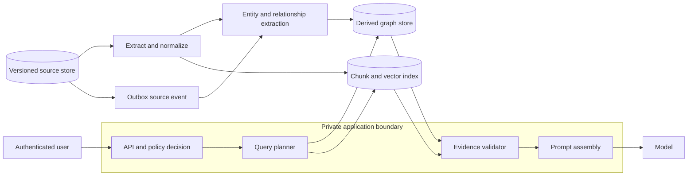
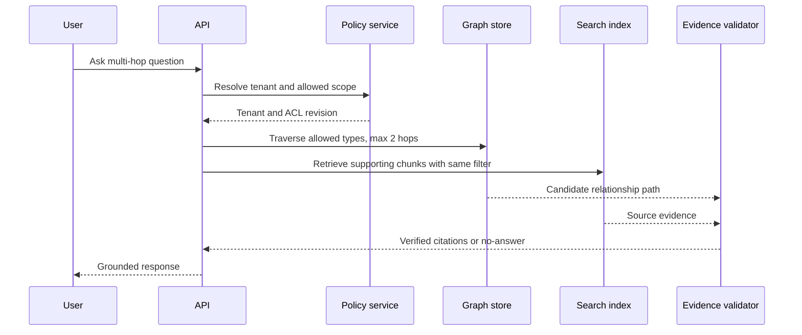

# Knowledge graphs and GraphRAG

A retrieval system fails on a multi-hop question when no single chunk contains the complete answer. A policy may name an exception in one document, define the eligibility condition in another, and identify the responsible team in a third. Keyword and vector retrieval can return relevant fragments, but neither representation makes the relationship itself a first-class object.

A knowledge graph models entities and relationships explicitly. Graph retrieval can then begin from an identified entity, follow permitted relationship types for a bounded number of hops, and return evidence with its source. GraphRAG is a retrieval architecture that combines this structured relationship path with text evidence; it is not a reason to replace source documents, access control, or evaluation.

## Learning objectives

After this chapter, you should be able to:

- decide when a graph adds value beyond chunk and vector retrieval;
- define entity, relationship, source, version, and ACL invariants;
- design a graph extraction and query path that remains rebuildable;
- keep graph traversal within tenant and authorization boundaries; and
- evaluate multi-hop correctness, freshness, and cost.

## When a graph is the right retrieval structure

A graph is useful when the request needs a relationship that is not reliably expressed in one text span: ownership, dependency, eligibility, delegation, product compatibility, regulatory control mapping, or lineage. It is not automatically useful for simple fact lookup, broad semantic exploration, or a corpus with unreliable entity identifiers.

Use the least complicated retrieval path that meets the evidence requirement:

| Query type | Primary retrieval | Why |
|---|---|---|
| Exact policy number or product code | keyword or structured field | exact term matters |
| Natural-language question answered by one passage | hybrid chunk retrieval | text is the evidence |
| "Who owns a control required by this service?" | graph traversal plus source chunks | relationship is the evidence |
| "What changed because this policy was revised?" | version lineage graph plus source versions | change path must be explicit |

Azure AI Search supports vector and keyword search in the same request, runs the two forms in parallel, and merges their results. Treat this hybrid retrieval layer as the evidence store for text; a graph adds a distinct relationship index when multi-hop reasoning is measurable and needed. [Azure AI Search vector and hybrid search](https://learn.microsoft.com/azure/search/vector-search-overview)

## Requirements and invariants

Consider a tenant-isolated governance assistant. It must answer questions about controls, services, owners, and documents.

| Requirement | Design consequence |
|---|---|
| A user may retrieve only authorized tenant evidence | tenant and ACL revision are attached to every graph and chunk record |
| Every relationship must be explainable | edge carries source document, version, extractor, and confidence |
| Source deletion must stop answers promptly | query path checks active source and ACL state before traversal results enter a prompt |
| Re-extraction must be repeatable | graph is derived from immutable source versions and deterministic record IDs |
| A relationship can be disputed | retain extraction run and supporting text span |

The source document remains authoritative. A graph node or edge is a derived assertion. Deleting a graph edge must never delete the policy or document that produced it.

## Architecture and trust boundaries



The planner is not allowed to retrieve a graph path first and authorize it later. It resolves user identity and tenant scope before it queries derived stores. A returned edge is useful only when its supporting source version is active and visible to that identity.

## Graph data model

Use stable, opaque IDs for entities. Do not use a display name as an identity because names change and can collide.

```json
{
  "nodeId": "tenant-42:service:payments-api",
  "tenantId": "tenant-42",
  "type": "service",
  "canonicalName": "payments-api",
  "sourceVersion": "catalog-188",
  "aclRevision": 24,
  "active": true
}
```

```json
{
  "edgeId": "rel:control-91:requires:payments-api:catalog-188",
  "tenantId": "tenant-42",
  "from": "tenant-42:control:control-91",
  "type": "REQUIRES",
  "to": "tenant-42:service:payments-api",
  "source": {"documentId": "catalog", "version": 188, "chunkId": "catalog:188:42"},
  "extractorVersion": "relation-extractor-3",
  "confidence": 0.91,
  "active": true
}
```

Keep relationship type names constrained, such as `OWNS`, `REQUIRES`, `DEPENDS_ON`, `SUPERSEDES`, and `APPLIES_TO`. A free-form relation label makes traversal and evaluation ambiguous. Store confidence as an extraction signal, not as proof that the relation is true.

## Build path: source version to graph

1. Persist the source version and an outbox event in the authority boundary.
2. Parse text, tables, headings, and stable source offsets.
3. Detect candidate entities using controlled identifiers where possible.
4. Resolve candidates against a tenant-scoped canonical entity registry.
5. Extract candidate relationships with the supporting text span.
6. Validate schema, tenant, source version, and relationship type.
7. Upsert the derived nodes and edges idempotently.
8. Publish an ingestion manifest with counts, failures, and extractor version.

Use an idempotency key such as `sourceVersion:extractorVersion:sourceOffset`. This allows retries after a worker crash without duplicating graph edges. On a new source version, create new derived records; deactivate earlier ones only after the new version has passed validation. This preserves a recovery path if extraction fails.

## Entity resolution is the difficult part

Entity extraction asks, "Which string might name something?" Entity resolution asks, "Does this string refer to this canonical object?" The second question is more dangerous. Incorrectly merging two people, services, or controls creates a false path that can look convincing in an answer.

Use a hierarchy of evidence:

1. A durable source identifier is the strongest match.
2. A tenant-local normalized canonical name can be acceptable when it is unique.
3. An alias table requires ownership and expiry.
4. A model-suggested match without corroborating fields remains a candidate for review.

Never resolve across tenants solely from a shared display name. Put a manual-review queue around low-confidence or high-impact mappings, and keep the original source span for every decision.

## Query path and bounded traversal

A graph query should have an explicit traversal contract. Unbounded expansion is a latency, cost, and data-exposure risk.



For a request such as "Which team owns the service required by control C-91?", the planner can constrain the traversal to:

```text
start: tenant-42:control:C-91
allowed edge types: REQUIRES then OWNS
maximum depth: 2
maximum returned paths: 5
required source state: active
required ACL revision: current
```

Run graph traversal and text retrieval independently where possible, then intersect them in the evidence validator. A model should receive source citations and a readable path, not an opaque graph score alone.

## Applying authorization filters

For an Azure AI Search index, model tenant, source state, and access metadata as filterable nonvector fields. Send them with the retrieval request, not as an instruction in the prompt. Azure AI Search supports filtered vector search; filters use text or numeric fields and can be processed before or after vector execution. [Filtered vector search](https://learn.microsoft.com/azure/search/vector-search-overview)

For example, use a bounded, programmatically generated filter:

```odata
TenantId eq 'tenant-42' and Active eq true and AclRevision le 24
```

Do not concatenate untrusted user input directly into an OData expression. Azure AI Search documents limits on filter size and complexity; use bounded groups and `search.in` rather than emitting unbounded equality clauses. [OData filter limits](https://learn.microsoft.com/azure/search/search-query-odata-filter#filter-size-limitations)

A graph store needs the equivalent filter at every node and edge access. Enforce policy in the application or graph query layer, then verify source visibility before prompt assembly. Metadata filters narrow a search result; they do not replace the application policy authority.

## Capacity and latency budget

Graph queries can expand quickly. If each node has average fan-out $f$ and the traversal depth is $d$, a naive expansion can approach:

$$
1 + f + f^2 + \ldots + f^d
$$

With $f=20$ and $d=3$, that is 8,421 candidate nodes before filters. A two-hop limit with relationship-type allowlists and per-stage result caps is not arbitrary conservatism. It is what keeps a query predictable.

| Stage | p95 budget | Bound |
|---|---:|---|
| Identity and policy | 75 ms | one policy decision |
| Entity resolution | 50 ms | exact or cached canonical lookup |
| Graph traversal | 150 ms | two hops, five paths |
| Hybrid source retrieval | 350 ms | tenant and source filters |
| Evidence validation | 100 ms | source/version checks |
| Prompt assembly | 75 ms | fixed token budget |

Measure fan-out, path count, traversal latency, unresolved entity rate, evidence-validation rejection rate, source freshness lag, and answer abstention. If a graph path repeatedly lacks supporting source evidence, fix extraction or remove the relationship from production retrieval.

## Failure handling and recovery

| Failure | Detection | Safe response | Recovery |
|---|---|---|---|
| Graph store unavailable | dependency timeout | use hybrid chunk retrieval only, or return no answer | rebuild derived graph from source manifest |
| Extraction run fails | missing manifest completion | do not activate new graph version | retry idempotently from source event |
| Entity ambiguity | resolution confidence below threshold | omit path and return a cited no-answer | review alias or canonical record |
| ACL update lag | revision mismatch | reject derived result | read policy authority and reindex affected records |
| Cyclic traversal | repeated node or depth limit | terminate path | inspect relationship schema |
| Model invents a link | citation fails validation | block response or remove unsupported claim | log trace and improve evidence validator |

The recovery objective for the graph should be derived from source versions, not a backup of the graph alone. Retain the source ingestion manifest, extractor configuration, entity registry version, and output counts so that a new graph can be compared with the prior one.

## Security, privacy, and audit

- Separate entity types that contain personal, regulated, or confidential data from public catalog entities.
- Apply tenant scope before entity resolution and before every traversal hop.
- Store only the minimum source excerpt required to explain an edge. Use a pointer to the authoritative content for full text.
- Treat model-generated entity and relationship suggestions as untrusted until validation.
- Audit source version, graph version, policy revision, query plan, returned edge IDs, citation IDs, and decision outcome.
- Do not let an answer cache cross an ACL revision or tenant boundary.

## Alternatives and trade-offs

| Design | Choose it when | Cost or limitation |
|---|---|---|
| Hybrid chunk retrieval only | questions are mostly single-hop | weak at explicit relationship traversal |
| Relational joins | relations are fixed and strongly structured | schema evolution can be expensive |
| Knowledge graph plus hybrid search | multi-hop evidence is measured as a product need | extraction, entity resolution, and graph freshness add operations |
| Agentic multi-query retrieval | conversational decomposition improves recall | additional planning latency and complexity |

Azure AI Search offers classic RAG and agentic retrieval. Classic RAG keeps a single query pipeline and gives an application more direct control; agentic retrieval can plan focused subqueries in parallel and return structured citations. Choose based on evaluated query complexity and operational needs, not because one label sounds more advanced. [Azure AI Search RAG approaches](https://learn.microsoft.com/azure/search/retrieval-augmented-generation-overview)

## Review checklist

- Is every node and edge derived from a versioned, authoritative source?
- Does every edge carry an evidence pointer and extractor version?
- Are entity IDs stable, tenant scoped, and distinct from display names?
- Is traversal constrained by relationship type, depth, path count, and timeout?
- Does authorization apply before graph and chunk retrieval?
- Can the system rebuild a graph version from an ingestion manifest?
- Are unsupported paths rejected before reaching the model context?
- Do evaluation data include ambiguous names, stale sources, revoked access, cycles, and multi-hop questions?

## Hands-on exercise

Design a graph-enhanced retrieval path for a control catalog. Define node and edge schemas, entity-resolution rules, a two-hop traversal contract, source citation representation, ACL filter, rebuild procedure, and an evaluation set containing 30 single-hop questions, 30 multi-hop questions, 10 ambiguous entities, 10 revoked-access cases, and 10 questions that must produce a no-answer.
