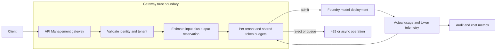

# Token-aware rate limiting

A conventional API rate limit counts requests. That is useful when each request has similar cost. A language-model request does not: one request can contain a short question and another can reserve tens of thousands of input and output tokens. A gateway that allows both because they count as one request can exhaust a shared model quota, raise latency for every tenant, and create a retry storm.

Token-aware rate limiting treats a request as a reservation against a finite model budget. It combines identity, tenant policy, prompt-size estimates, concurrent streams, and the actual token usage returned by the model.

## Learning objectives

After this chapter, you should be able to define separate request, token, concurrency, and long-period budgets; admit work fairly across tenants; explain the difference between gateway limits and Foundry quota; and design a safe response to overload.

## The limits that must not be confused

| Limit | Protects | Unit | Typical owner |
|---|---|---|---|
| Request rate | gateway, application CPU, abuse surface | requests per second or minute | API gateway |
| Token rate | model throughput and cost | tokens per minute | AI gateway and model platform |
| Concurrent streams | connection and model-slot pressure | in-flight requests | application or gateway |
| Usage quota | commercial or tenant plan | tokens or requests per day or month | product billing policy |
| Foundry quota | shared provider capacity | RPM and TPM | subscription administrator |

These limits answer different questions. Request rate asks how frequently a caller starts work. Token rate asks how much model capacity that work might consume. Concurrency asks how much state the system must hold at the same moment. A monthly product allowance answers what a customer has purchased. Provider quota is an external capacity constraint that the product must respect even when its own tenants have unused entitlement.

For example, a client can remain below ten requests per minute while sending ten maximum-context prompts. A request-only gateway sees a calm client. The model deployment sees a burst of prefill work, memory pressure, and output reservations. Conversely, a client generating many short classifications can fit a token budget but overwhelm connection pools or application workers. A production policy needs all relevant limits because no single unit represents the whole cost of inference.

Microsoft Foundry quota is scoped at the subscription level. Depending on deployment type and model version, deployments can share quota pools across regions or a data zone. A second endpoint does not automatically create independent token capacity. [Foundry quota scope](https://learn.microsoft.com/azure/foundry/openai/quotas-limits#subscription-level-quota-management)

### How the budgets work together

Think of admission as a series of gates, not one counter. The gateway first proves who is calling and which tenant policy applies. It estimates the request cost. It then checks the narrowest applicable budget: user stream slots, tenant burst allowance, tenant baseline, shared safe capacity, and any long-period entitlement. The request is admitted only when every required gate has enough remaining capacity.

The order matters operationally. Rejecting an invalid identity before tokenization avoids spending work on an unauthenticated client. Checking a per-user stream limit before a shared model ledger prevents one browser from opening hundreds of long-lived streams. Reserving from both tenant and shared budgets before the model call prevents a race in which multiple requests each observe the same apparently available shared balance.

An accepted reservation is provisional. It is an accounting promise that protects capacity while the request is running; it is not a claim that the model has already consumed those tokens. When the request completes, cancellation arrives, or a terminal failure occurs, the system records a terminal outcome and reconciles the reservation exactly once. This lifecycle is why an admission ID and an idempotent reconciliation operation belong in the design.

## Requirements and invariants

Assume a multi-tenant assistant has a 2 million tokens-per-minute (TPM) assigned model budget. Its product policy reserves 20% for operational headroom and admits no request whose estimated token reservation would exceed the remaining safe budget.

The invariants are:

1. A tenant cannot consume another tenant's reserved minimum.
2. The gateway does not admit a request solely because request count is below limit.
3. Actual usage reconciles the initial token reservation after completion.
4. A throttled request receives a machine-readable retry response, not an ambiguous timeout.
5. A token limit does not replace authorization, content validation, or model-output safety checks.

These invariants make failure behavior testable. If a gateway process restarts after it admits a request, an operator must be able to determine whether the reservation remains active, was reconciled, or is eligible for expiry. If it cannot, the counter eventually becomes either too permissive or permanently full. The ledger must therefore store a reservation identifier, tenant and model keys, reserved amount, creation time, expiry, terminal state, and the actual-usage reference when one exists.

The safe default for an uncertain request is conservative but bounded. Hold its reservation until the configured maximum execution time plus a small reporting grace period. Then mark it expired only after checking whether a completion record arrived. An indefinitely held reservation is a slow denial of service; immediate release after an ambiguous network failure can oversubscribe the model. The expiry policy is part of capacity correctness, not a background cleanup detail.

## Admission architecture



The estimate occurs before model invocation. The reconciliation occurs afterward because the final completion may use fewer tokens than the configured maximum. Keep both records: admission explains why a request was allowed, and actual usage explains cost and model capacity consumed.

### An admission transaction in practice

Suppose a tenant has 12,000 tokens left in its minute budget and the shared ledger has 45,000 tokens left. A request reserves 3,300 tokens. The gateway must deduct or reserve 3,300 from both ledgers as one logical decision. If it changes the tenant record but fails before changing the shared record, later requests can observe inconsistent capacity. If it checks both ledgers and writes neither before dispatching, concurrent requests can all pass the same stale check.

An implementation can use a single strongly consistent store for the relevant counters, or a carefully bounded allocation system. In the allocation design, each regional gateway receives a small share of the shared budget and enforces locally. That reduces cross-region coordination but deliberately leaves unused safety margin so the sum of regional allocations cannot exceed the safe global budget. The correct choice depends on whether the limit protects a commercial entitlement, a provider quota, or merely a best-effort fairness target.

Record the policy version in the same decision. Without it, a later operator cannot distinguish a request rejected because the tenant exhausted a 50,000 TPM baseline from one rejected after the plan changed to 30,000 TPM. Versioned decisions also make a canary policy rollout reversible: new requests use the new version, while reservations made under the old version keep their original accounting interpretation.

### Choosing a rate algorithm

A fixed window counts usage between clock boundaries, such as 12:00:00 through 12:00:59. It is simple, but a client can spend its entire allowance at the end of one minute and again at the beginning of the next. The short interval between those bursts can be far above the intended sustained rate.

A sliding window considers recent history continuously. It smooths the boundary effect, but exact implementations retain more state or perform more counter work. A token bucket stores accumulated allowance up to a maximum burst size and refills at a defined rate. It permits short, intentional bursts while preserving a long-run average. For interactive model traffic, a token bucket is often a useful local admission model because an occasional larger prompt can proceed without allowing unbounded accumulated debt.

The algorithm does not remove the need for reservations. A bucket that deducts only estimated input tokens can approve many requests whose configured outputs collectively exceed capacity. Charge the reservation at admission, refund the unused portion at reconciliation, and document whether the bucket is based on wall-clock refill, a rolling provider interval, or both. An operator must be able to map the product policy to the provider behavior it is intended to protect.

## Token reservation math


For input estimate $T_i$, maximum output $T_o$, and safety margin $m$:

$$
T_{reserve} = (T_i + T_o) \times (1 + m)
$$

If a request has 2,400 estimated input tokens, a 600-token output ceiling, and 10% margin, reserve 3,300 tokens. If the model reports 2,850 actual tokens, return 450 tokens to the shared and tenant ledgers. The safety margin absorbs tokenizer estimation differences and system-prompt growth; it must be measured and adjusted from production telemetry.

For a shared 2,000,000 TPM allocation with 20% headroom:

$$
T_{admissible} = 2{,}000{,}000 \times 0.8 = 1{,}600{,}000\ \text{TPM}
$$

Do not configure the gateway to target 100% of a provider quota. Retries, control traffic, other deployments, and quota measurement variation need room.

The headroom is an explicit reliability budget. A 20 percent reserve does not mean the system expects to waste 20 percent of capacity. It means that normal uncertainty has somewhere to go without turning every small accounting error into a provider-side throttle. The appropriate value should be derived from observed estimation error, model-reporting delay, retry behavior, deployment sharing, and the largest permitted burst, then reviewed as those inputs change.

### Estimating before the model responds

Input estimation should use the tokenizer and message construction that the serving route actually uses whenever possible. Count the system prompt, user message, retrieval context, tool definitions, prior conversation, and any structured-output instructions. Counting only the visible user question creates a systematic underestimation error because hidden application context can be much larger.

Maximum output is a policy value as well as a model parameter. A support summarizer may need 400 output tokens; an analysis workflow may need 4,000. Giving every route the model's largest possible output cap transfers one tenant's uncertainty into every other tenant's queue. Set route-specific output ceilings, reject or asynchronously handle work that requires a larger response, and measure whether users actually receive the reserved output range.

Actual usage can arrive in a response body, stream-final event, or provider telemetry path. Treat delayed usage telemetry as an asynchronous reconciliation signal, not a reason to discard the admission record. If the service cannot obtain actual usage for a completed request, retain the full reservation and label the result as unreconciled. That policy is stricter than reality, but it prevents missing telemetry from becoming free capacity.

## Fairness policy

A global counter protects the model but does not prevent a large tenant from monopolizing it. Use at least two counters:

```text
shared admissible TPM: 1,600,000
per-tenant baseline TPM: 50,000
per-tenant burst TPM: 100,000
per-user concurrent streams: 4
```

The exact policy depends on the commercial contract. A fair-share system may lend unused capacity temporarily, but it must reclaim it when a tenant with a reserved baseline arrives. Track tenant identity from a validated token claim, not an untrusted request header.

Fairness is visible over time, not in one accepted request. Assume Tenant A is idle, Tenant B borrows unused shared capacity, and Tenant A then sends an urgent request. The policy must reserve enough shared capacity, or reclaim future burst eligibility quickly enough, that Tenant A can still receive its contracted baseline. Reclaiming does not mean interrupting an already running generation. It means that new borrowed work stops receiving the extra capacity until the baseline pressure passes.

This distinction helps choose queue behavior. A short internal batch job can wait for borrowed capacity to return. A human waiting on an interactive chat response usually should receive a deterministic 429 or a deliberately designed asynchronous operation instead of an opaque queue. The product contract decides which caller experience is correct; the rate limiter enforces the corresponding capacity boundary.

Azure API Management supports custom key-based rate and quota policies and can derive a key from a validated JWT subject. It also exposes an `llm-token-limit` policy for limiting tokens per calculated key. [API Management throttling options](https://learn.microsoft.com/azure/api-management/api-management-sample-flexible-throttling)

## Gateway policy shape

The following is illustrative policy structure. Values must be established from the actual tier, model quota, and tenant contract.

```xml
<inbound>
  <validate-jwt header-name="Authorization" />
  <set-variable name="tenantId" value="@(context.Request.Headers.GetValueOrDefault(&quot;x-tenant-id&quot;))" />
  <llm-token-limit counter-key="@((string)context.Variables[&quot;tenantId&quot;])"
                   tokens-per-minute="100000"
                   token-quota="2000000"
                   token-quota-period="86400" />
  <limit-concurrency key="@((string)context.Variables[&quot;tenantId&quot;])" max-count="20" />
</inbound>
```

Do not copy this example without validating the identity claim and policy support for the selected APIM tier. Key-based policies and LLM token limiting are not available in every tier; Microsoft documents tier-specific policy support. [API Management policy availability](https://learn.microsoft.com/azure/api-management/api-management-policies)

The illustrative policy deliberately exposes a design problem: it reads `x-tenant-id` while the prose requires a validated identity claim. In production, derive the key from a claim that `validate-jwt` has accepted, or map the authenticated subject to a tenant in an application-owned identity service. A caller-controlled header can be useful for routing diagnostics, but it must never choose the billing, authorization, or fairness principal.

Gateway policy is also only one layer. It can enforce edge decisions close to the caller, but it may not own the authoritative commercial ledger, model route, or asynchronous worker queue. Document which component owns each counter and require a correlation identifier on the gateway request, application reservation, provider request, and final usage event. That trace explains whether a rejection came from edge policy, product policy, or provider throttling.

## Distributed counters and regional behavior

A distributed gateway cannot promise a perfectly exact global rate. Microsoft documents that throttling is not completely accurate because counters are distributed, and APIM rate-limit counters are enforced per gateway in multi-region deployments. Long-period APIM quotas are global at the APIM instance level. [APIM counter behavior](https://learn.microsoft.com/azure/api-management/api-management-sample-flexible-throttling)

Therefore, a global tenant budget needs a conservative gateway allocation, regional headroom, or an application-owned strongly coordinated ledger when strict commercial enforcement is required. Do not claim that a regional token bucket is a subscription-wide quota authority.

Consider two regions that each receive 800,000 TPM of a 1,600,000 TPM safe budget. They can operate without a cross-region round trip, but neither region can spend the other region's unused allocation in the moment. That is the price of availability and low latency. If the product promises one global 1,600,000 TPM tenant entitlement, a coordinated ledger or a deliberately smaller regional allocation is required. The architecture must state which promise it makes.

During a regional failure, do not immediately double the surviving region's local rate. First establish which in-flight reservations in the failed region might still reach the model or report usage. A failover policy can temporarily preserve the failed region's allocation, release it after an evidence-based timeout, or use a pre-reserved disaster budget. Each choice trades temporary underuse against the risk of briefly exceeding provider quota.

## Overload and retry behavior

Return `429 Too Many Requests` when a request is rejected before model work begins. Include a stable error code and `Retry-After` only when a retry is meaningful.

```http
HTTP/1.1 429 Too Many Requests
Retry-After: 20
Content-Type: application/json

{"code":"tenant_token_budget_exhausted","scope":"tenant","retryAfterSeconds":20}
```

For an accepted asynchronous workload, return `202 Accepted` and an operation resource. Do not queue interactive chat indefinitely: it consumes user patience and connection resources. A caller that retries must reuse an idempotency key for side-effecting operations, apply jitter, and stop after a bounded deadline.

`Retry-After` is a promise about when retry may be useful, not a decorative header. Calculate it from the earliest plausible bucket refill, queue admission slot, or documented provider recovery interval. Omit it when the condition requires a user action, such as a monthly entitlement exhaustion or an invalid tenant policy. Clients should distinguish `tenant_token_budget_exhausted`, `shared_model_capacity_exhausted`, and `concurrent_stream_limit_exhausted`, because their recovery actions differ.

An interactive client should treat a 429 as a completed response with a clear next action. It should not issue immediate parallel retries through multiple browser tabs or SDK layers. A background worker may instead persist its job, wait until a scheduled retry time, and resume with the same idempotency key. These are application semantics layered on the same admission signal.

## Observability and audit

Measure requested input tokens, reserved tokens, actual input and output tokens, cancellation rate, token reconciliation delta, 429 rate by tenant and model, concurrent streams, time to first token, completion latency, and model 429s. The gateway should emit a correlation ID shared with model and application traces.

APIM provides policies to emit token metrics for LLM APIs. Pair gateway metrics with model-platform quota measurements and application-level user outcome metrics. [APIM LLM token metrics](https://learn.microsoft.com/azure/api-management/api-management-policies)

Treat usage telemetry as sensitive operational data. It can reveal user activity patterns, prompt sizes, and tenant demand. Restrict access, retain only the needed fields, and avoid logging raw prompts or tokens.

### Turning telemetry into policy changes

Start with a dashboard that compares reserved tokens with actual tokens by route, model, tenant class, and outcome. A consistent positive delta means the safety margin or output ceiling may be too large, which wastes capacity. A consistent negative delta means requests can spend more than they reserved, which is a quota-risk signal. Do not tune on one aggregate average: a long-context or tool-heavy route can have a very different error distribution from a short chat route.

Alert separately on gateway rejections and provider throttles. Rising gateway 429s with no provider 429s can indicate that product policy is deliberately restrictive or incorrectly configured. Provider 429s despite low gateway admission indicate a missing traffic path, shared quota consumer, inaccurate reservation, or changed provider allocation. The operational response is to identify the mismatch, not to raise every local limit.

Review cancellation and disconnect rates with token reconciliation. A client that disconnects after prefill may consume substantial capacity while receiving no completed answer. The gateway should release local stream concurrency promptly, but token accounting must follow actual provider usage where available. This prevents cancellations from becoming an unmeasured way to evade a tenant budget.

## Failure modes

| Failure | Safe behavior | Evidence |
|---|---|---|
| Token estimate undercounts | margin and output ceiling limit exposure | reservation versus actual usage delta |
| Gateway counter unavailable | fail closed for protected model budget or use documented degraded allocation | counter health and admission decision |
| Foundry returns 429 | reduce admission, classify transient retry, avoid herd retries | provider status and correlation ID |
| One tenant bursts | enforce tenant burst cap before shared budget depletes | tenant usage time series |
| Client opens many streams | enforce concurrent-stream limit and cancellation | active stream count and disconnect rate |
| Regional split exceeds plan | use conservative regional allocation | per-region counters and shared usage reports |

## Review checklist

- Which limit protects requests, tokens, concurrency, product entitlement, and provider quota?
- How is the tenant identity obtained and protected from spoofing?
- What formula reserves tokens before a model call, and how is it reconciled afterward?
- What headroom protects shared quota from retries and measurement variation?
- Are multi-region counters treated as separate gateway counters?
- Does every 429 response give a deterministic client action?
- Can operators identify the tenant, model, policy version, reservation, actual usage, and outcome without reading prompt content?

## Hands-on exercise

Design an admission policy for three tenants sharing 1,000,000 TPM. Give each a guaranteed baseline, a temporary burst allowance, a maximum output policy, and a per-user stream limit. Simulate a 20-minute spike from one tenant and show which requests are admitted, queued, or rejected. Then define the dashboards and alerts that prove the policy is fair and protects the Foundry quota.
