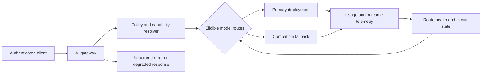
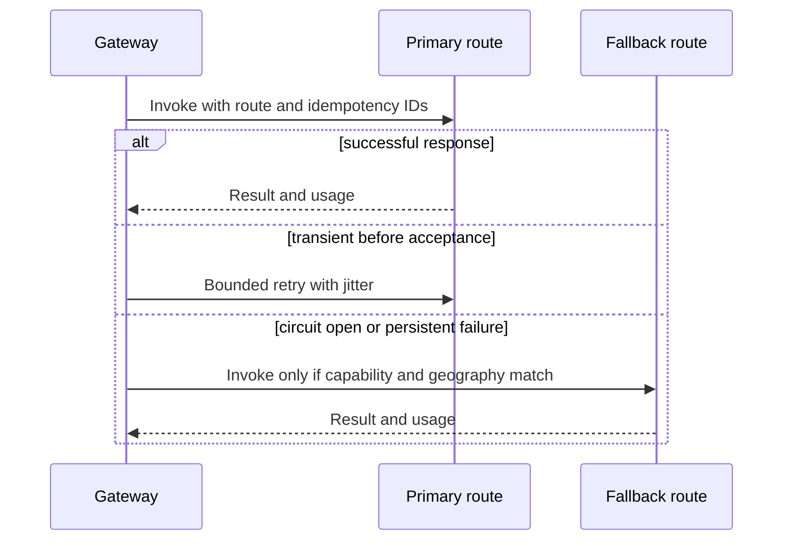

# Model routing, retries, and failover

A model router decides which compatible inference deployment handles a request. It is not a random load balancer and it is not a blind fallback loop. A safe router understands the request contract, the tenant's data boundary, model capability, quota, latency objective, and the effect of retrying an already-started generation.

## First principles: what routing decides

An **endpoint** is a network address that accepts a model request. A **deployment** is a configured model serving target behind an endpoint. A **route** is application policy that says when one deployment is eligible for a particular request. A **fallback** is a second eligible route used only after a classified failure. These are different things.

For example, an application can have two endpoints that both point to the same shared quota pool. Network-level load balancing can distribute connections, but it cannot decide whether a smaller model can safely replace a tool-capable model, whether a request may leave a geography, or whether the user has already seen a partial answer. Those are routing decisions.

The router is therefore a control-plane component. It does not generate the answer. It validates a request contract, selects an allowed serving path, records the decision, and protects every model route from overload caused by clients or other routes.

This changes what the router is allowed to optimize. A network load balancer can choose a reachable target from connection information. A model router must reason from application facts: whether the request contains regulated data, whether a tool is required, whether a response must validate against a schema, and whether partial output is already visible to the caller. The router therefore needs a typed request intent, not only an opaque HTTP body.

Routing is not permission to change product behavior. Sending a long-context request to a smaller deployment, silently dropping a required tool, or moving data to an unapproved region can make a dashboard look healthy while breaking the contract. A deterministic unavailable response is safer than an apparently successful result from an ineligible route.

## Requirements and invariants

A routing decision must preserve these invariants:

1. The selected model can satisfy the required modality, context, tool, and structured-output contract.
2. A failover does not cross a tenant's approved geography or data-residency boundary.
3. A retry cannot repeat an external tool side effect.
4. The user or caller can identify which model and policy version produced the result.
5. A failing deployment is isolated before it exhausts gateway threads, quota, or retry budget.

Microsoft Foundry quotas are subscription scoped and deployments can share quota pools by deployment type and model version. Adding a fallback endpoint is not evidence that it has independent capacity. [Foundry quota scope](https://learn.microsoft.com/azure/foundry/openai/quotas-limits#subscription-level-quota-management)

### Route eligibility is a predicate

Treat eligibility as a predicate that returns either an explicit rejection reason or a route with known limits. Its inputs normally include tenant geography, data classification, required modality, context length, output format, tool contract, latency objective, token budget, and health. This makes a routing decision inspectable rather than a sequence of implicit conditional statements.

Separate hard requirements from preferences. Geography, authorization, mandatory tool support, and structured-output compatibility are hard requirements that remove a route. Lower cost or lower median latency is a preference used only after eligibility is established. This prevents an optimizer from selecting a fast but forbidden deployment because it scored well on one operational metric.

The predicate should produce durable reason codes such as `fallback_context_limit_too_small`, `region_not_approved`, or `shared_token_budget_exhausted`. Those codes support caller handling, capacity planning, and incident investigation without exposing prompt content.

## Routing architecture



A route is eligible only after the policy resolver checks tenant geography, data classification, required features, maximum context, response schema, safety controls, and budget. Health is a routing input, but it cannot override policy.

Health needs a definition that matches the route's role. A TCP probe can show that an endpoint is reachable while model requests still throttle, time out, or violate a first-token objective. Measure a small set of route signals such as accepted-request errors, provider throttles, latency percentile, timeout rate, and explicit deployment health where available. One slow request is not enough evidence to declare a route unhealthy.

Health data is delayed and noisy. A circuit needs a bounded observation window, a failure threshold, a cool-down interval, and limited half-open probes. These are workload assumptions to test under load. Their purpose is to contain a failing dependency while collecting enough evidence to recognize genuine recovery.

## Route contract


Credits: Hazem Ali

```json
{
  "routeId": "support-primary-us-v4",
  "tenantClass": "regulated-us",
  "modelDeployment": "assistant-primary",
  "allowedRegions": ["US"],
  "capabilities": {"tools": true, "jsonSchema": true, "vision": false},
  "maxInputTokens": 12000,
  "fallbackRouteId": "support-secondary-us-v3",
  "promptVersion": "support-v14",
  "evaluationSet": "support-2026-08"
}
```

Store this contract as versioned configuration. A fallback may be faster or cheaper but still incompatible: it might have a different context limit, safety behavior, response schema, tool support, or regional processing boundary.

The contract should state which transformations are allowed. Summarization, image downscaling, or a shift from synchronous to asynchronous processing can make a request fit another route, but each changes the original request. Treat such a change as a named workflow with its own authorization, evaluation, provenance, and failure behavior. The router must not invent a transformation merely because no deployment accepts the original request.

Store the route contract version with every decision. A later trace can then distinguish a model regression from a routing-policy change and can show which candidates were excluded. This is essential for a reversible rollout: new requests can use a new route version while completed requests retain their original explanation.

### Worked route selection

Consider an employee-support request with 9,000 input tokens, JSON output, and a read-only retrieval tool. The tenant allows United States processing only. The router evaluates in this order:

1. Is the user authorized to use this agent and tool class?
2. Does the tenant policy allow the requested data class and region?
3. Does the primary route support 9,000 input tokens, structured output, and the required tool contract?
4. Does the tenant and shared token budget have capacity for the reservation?
5. Is the route circuit closed and within latency and error objectives?
6. If not, is there a fallback that passes exactly the same policy and capability checks?

If the fallback has a smaller context limit, the correct action is not to truncate the request silently. The router returns a policy-aware error or invokes an explicitly designed summarization path that has its own evaluation and source-preservation contract.

Build the candidate set in a fixed order. First remove routes that fail static policy. Then apply dynamic checks such as circuit state, remaining token capacity, and remaining request deadline. Finally rank the eligible routes by declared preference. Persist the selection before invoking the upstream deployment. This sequence prevents a late primary failure from revealing that the fallback was never able to honor the original request.

The caller's deadline must travel with every attempt. A fallback does not help if starting it cannot complete within the remaining time. Reserve time to classify the earlier attempt, propagate cancellation where supported, and return a deterministic outcome. Without one shared deadline, each retry layer can behave reasonably in isolation while the user experiences an unbounded wait.

## Retry classification

Retry only an operation that is safe to repeat and plausibly transient. A connection failure before the upstream accepts a request differs from a timeout after the model began streaming. For side-effecting tool workflows, obtain operation status using a stable idempotency key instead of repeating the whole agent run.

| Result | Router action | Why |
|---|---|---|
| Invalid request or policy denial | do not retry | retry cannot correct caller input or authorization |
| Token or request throttling | bounded retry or route only if policy permits | avoid synchronized retry surge |
| Short transport failure before acceptance | one bounded retry | transient path may recover |
| Timeout after output starts | do not replay generation automatically | caller may have seen partial result |
| Tool side effect uncertain | read operation state | avoid duplicate real-world action |
| Persistent deployment errors | open circuit and use compatible route | protect the failing dependency |

A circuit breaker moves from closed to open after a failure threshold, fails fast while open, and permits limited probes in half-open recovery. It complements retry; it does not replace exception classification. [Circuit Breaker pattern](https://learn.microsoft.com/azure/architecture/patterns/circuit-breaker)

Retries and failover solve different problems. A retry tests whether the same eligible dependency recovered from a short transient fault. Failover changes the dependency, so all capability, geography, quota, and health predicates must run again. Treating failover as merely another retry hides this policy decision.

Before retrying, establish what the upstream accepted. A connection failure before bytes leave the gateway differs from a timeout after the provider accepted a stream. Provider request IDs, response headers, streaming events, and an application operation record help classify ambiguous cases. When evidence is absent, status lookup or an explicit incomplete outcome is safer than a second speculative generation.

### Retry budget

A retry consumes time, tokens in some failure cases, and capacity that another user might need. Give a request one overall deadline and a small retry budget, rather than letting the API, gateway, SDK, and application each retry independently.

```text
interactive deadline: 12 seconds
primary attempt:      up to 8 seconds
one retry:            only if no upstream acceptance evidence exists
fallback attempt:     only if compatible route passes health and quota checks
after deadline:       return a deterministic unavailable or delayed response
```

Retry with exponential backoff and jitter for transient, idempotent operations. Stop retrying if the circuit is open, the client cancels, the route's quota is exhausted, or the request has crossed its deadline. A chain of independent automatic retries is a common cause of overload amplification.

Budget retries at the logical-request level. If an SDK, gateway, application, and tool runner each retry twice, one user request can become many upstream calls. Pass remaining deadline and attempt budget through every layer, decrement them when an attempt begins, and record the result at the logical-operation level. Jitter reduces synchronized recovery bursts, but only admission control decides whether fresh work may enter.

## Circuit and failover flow



Use a circuit breaker per meaningful failure domain, such as model deployment and region, not one global breaker for every model. A failing route must not block a healthy independent route. Record breaker transitions and route selection in traces.

## Streaming and cancellation

Streaming changes retry semantics. Once first token is sent, the user may have consumed part of the answer. A client cancellation should propagate to the gateway and model request where supported, release local concurrency accounting, and preserve the trace as cancelled rather than failed. Do not automatically route a cancelled stream to another model.

Separate time-to-first-token and total-generation deadlines. A route that has good completion throughput but poor first-token latency may violate an interactive objective even if it eventually succeeds.

### Partial-output rule

Once a client receives tokens, the response has an externally visible side effect. Store the stream outcome as `completed`, `cancelled`, or `interrupted`; do not replay its text automatically on a fallback route. For structured output, validate only after the final response is complete. If the stream ends before a valid object is produced, return an explicit incomplete-result status rather than inventing missing fields.

Tool calls make the rule stricter. A model can emit a tool request before a stream ends. The tool gateway must write a stable operation ID and the router must inspect that operation's state on retry. It must never run a second refund, ticket creation, or external update because a generation connection timed out.

## Security and observability

The public API validates caller identity. The router uses a workload identity to call model deployments. Model routes, prompts, tool schemas, and evaluation sets are deployment artifacts and require change control. Do not embed model keys in client code or prompt templates.

Emit route ID, deployment ID, region, policy version, prompt version, token reservation, actual usage, first-token latency, completion latency, retry count, breaker state, fallback reason, and outcome. Do not log confidential prompt or response text by default.

Azure API Management offers routing, circuit-breaker configuration for backend pools, rate limits, and token metrics policies. Treat gateway configuration as part of the same release boundary as model and prompt changes. [API Management routing and AI gateway policies](https://learn.microsoft.com/azure/api-management/api-management-policies)

## Deployment, evaluation, and rollback

Route configuration is released like code. Test each candidate model against the same representative evaluation set before making it eligible. The set must include structured-output validation, retrieval grounding, tool selection, refusal behavior, multilingual requests, long context, cancellation, and expected no-answer cases.

Use a controlled rollout:

1. Register the deployment with no production traffic.
2. Verify capability probes and authentication from the router identity.
3. Run offline evaluation and load tests using policy-valid synthetic data.
4. Route a small, observable cohort through an explicit route version.
5. Compare latency, token use, safety, tool errors, and user outcome with the current route.
6. Promote only if guardrail metrics pass; otherwise remove eligibility and retain the trace evidence.

Rollback changes the route version, not the historical trace. Keep enough version metadata to explain which model, prompt, tool schema, and retrieval index produced every answer during the rollout.

## Operational drill

Run this failure exercise before relying on a fallback route:

1. Force the primary deployment to return throttling responses.
2. Verify that the breaker opens at the configured threshold and that only limited half-open probes run later.
3. Verify the fallback passes capability, region, and token-budget checks.
4. Send a streamed request and disconnect the client after first token; verify no automatic replay occurs.
5. Send a tool-using request and inject a timeout after tool acceptance; verify status lookup prevents duplicate work.
6. Confirm the trace contains route choice, rejection reason, breaker transition, model deployment, and final user outcome.

## Review checklist

- Is every fallback compatible with the original request contract and data boundary?
- Does a route decision use current quota and health without assuming deployment independence?
- Which failures retry, which read operation state, and which fail immediately?
- Are circuit breakers scoped by model and region rather than globally?
- Can a streamed or tool-using request ever be replayed automatically after partial acceptance?
- Can an operator reconstruct the route, model, policy, and version for a user-visible answer?

## Hands-on exercise

Design primary and fallback routes for a regulated support assistant. Define capability predicates, regional constraints, per-route token budgets, retry classifications, breaker thresholds, stream-cancellation behavior, evaluation gate, and the response shown when no compatible route remains.
