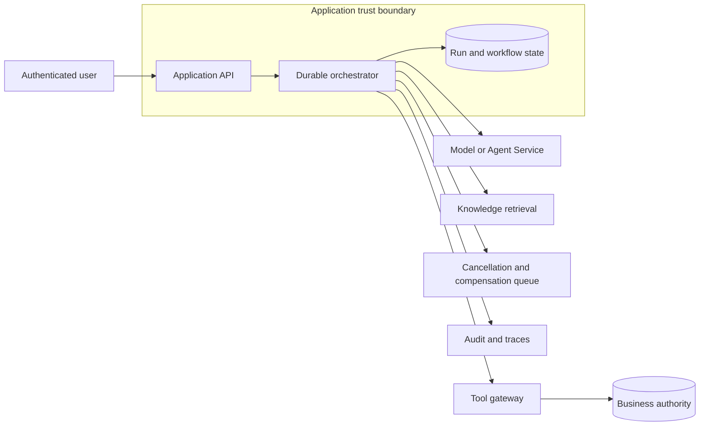
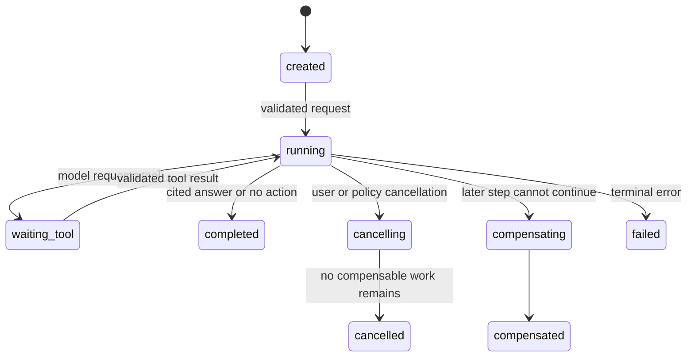

# Stateful agent orchestration

An agent is a workflow that combines a model, instructions, tools, and state across more than one step. State makes the interaction useful, but it creates recovery, privacy, concurrency, and authorization obligations. A chat transcript is not a durable workflow record, and a model response is not permission to perform a tool action.

## First principles: conversation is not workflow

A conversation answers, "What messages did the user and assistant exchange?" A workflow answers, "What work was accepted, which steps completed, which business actions are pending, and what can safely happen after a crash?" Keeping only a transcript loses the second answer.

For example, a user can ask an agent to open a support ticket. The model might produce a tool call, the tool might create the ticket, and the network might fail before the agent receives the tool response. The next run must discover whether the ticket already exists. It cannot infer that fact from prose in a transcript.

This is the central difference between conversational state and durable workflow state. Conversation helps a later model understand intent. Workflow state lets a later worker prove what happened at an external boundary. The first may be summarized, redacted, or deleted under a retention policy. The second needs stable identifiers, terminal states, and an authoritative relationship to the business system.

A model is useful for proposing the next step, but it is not a transaction coordinator. It cannot reliably remember whether a previous process crashed, whether a network timeout followed a commit, or whether an approval expired. The orchestrator supplies those deterministic guarantees around the probabilistic model call.

## State categories

| State | Owner | Lifetime | Example |
|---|---|---|---|
| Request state | API | seconds | trace ID, deadline, user identity |
| Conversation state | session store or agent platform | minutes to days | messages, summary, memory policy |
| Workflow state | orchestrator | until terminal outcome | run status, step attempts, cancellation |
| Business state | authoritative domain service | policy-defined | order, ticket, account update |
| Derived state | cache or retrieval index | disposable | retrieval result, tool result cache |

Microsoft Foundry Agent Service provides managed agent runtimes, tools, model access, identity, observability, and agent lifecycle features. A Hosted agent can use session-level state persistence, while application teams still choose the business authority and retention boundary. [Foundry Agent Service overview](https://learn.microsoft.com/azure/foundry/agents/overview)

## Architecture and trust boundaries



The orchestrator owns the workflow state machine. The tool gateway owns tool-schema validation and authorization. The domain service owns the business record. This separation prevents an agent transcript from becoming the only evidence of an irreversible action.

Ownership answers a practical recovery question: which component is allowed to decide the truth after disagreement? If the transcript says a ticket was created but the domain service has no record for the idempotency key, the domain service is authoritative. If the domain service reports a completed ticket but the orchestrator did not receive the response, the run must record that fact rather than repeat the tool call. Naming ownership prevents a model response, cache entry, or trace from accidentally becoming the source of truth.

The boundaries also reduce the blast radius of a defect. A prompt change can affect the model's proposal, but it cannot bypass domain authorization. A transient failure in conversation storage can affect continuity, but it should not alter an already committed business record. Design each store with the lifetime and correctness requirement of the state it owns.

## Run state machine


Credits: Hazem Ali



Store the current state, step ID, attempt count, input and output references, tool authorization decision, and correlation ID after every durable boundary. A worker restart can then resume or safely conclude a run without replaying completed actions.

Persist before an external side effect, not after it. The stored intent identifies the exact step that may be attempted and creates the stable idempotency key. After the call, persist the observed outcome or the fact that the outcome is uncertain. This two-record pattern makes a crash understandable: recovery either finds a completed result, resumes a pending non-effectful step, or asks the domain authority for status.

State names should describe externally meaningful progress. `waiting_tool` means a tool step has been recorded but not yet returned a validated outcome. It does not mean the model is thinking. `compensating` means the workflow is attempting a defined business correction, not simply retrying an error. Clear states allow operators to distinguish normal waiting from a run that needs intervention.

### One run, step by step

1. The API validates the caller, tenant, request size, and conversation version.
2. It creates `runId`, records `created`, and returns an operation resource if execution is asynchronous.
3. The orchestrator changes the run to `running`, loads the permitted conversation context, and calls retrieval or a model.
4. If the model requests a tool, the orchestrator persists the intended tool step before any external call.
5. The tool gateway validates schema, reauthorizes the user action, and calls the business authority with an idempotency key.
6. The durable tool outcome moves the run back to `running` or to a terminal state.
7. The final answer is saved with citations and model version, then the run becomes `completed`.

Every transition is recorded before the next component can create an irreversible effect. This is the difference between recoverable orchestration and a sequence of in-memory function calls.

The resulting workflow is usually eventually consistent. A ticket can be committed before the orchestrator observes its result, and a cancellation can arrive while a model request is still draining. The invariant is not that every component changes at one instant. It is that each transition has enough durable evidence to converge on one safe terminal interpretation without duplicating a business action.

Use compare-and-set or optimistic versioning when workers update the same run. A worker reads the current run version, validates that its expected transition is still allowed, and writes the next version only if no other worker changed it. A conflict causes a reload and decision, not a blind merge of two mutable histories.

## Tool invocation contract

```json
{
  "runId": "run-01J...",
  "stepId": "step-04",
  "tool": "create-support-ticket.v2",
  "idempotencyKey": "run-01J...:step-04",
  "actor": {"userId": "user-17", "tenantId": "tenant-42"},
  "arguments": {"category": "access", "summary": "..."},
  "approval": "required"
}
```

Validate JSON schema before execution. Independently authorize the user and the workload identity. For an irreversible action, require a business confirmation or human approval before the tool runs. Record the request and result reference, not unnecessary confidential payloads.

## Cancellation and compensation

Cancellation has stages. Before a tool starts, mark the step cancelled and stop future work. During a cancellable model stream, propagate cancellation and release concurrency. After a tool commits, cancellation may require a domain-specific compensating action, such as closing a newly created ticket or reversing a temporary reservation.

A compensating transaction records completed steps and their undo operations. It must be resumable and idempotent because compensation can fail too. It does not always restore the exact prior state; it applies business rules to reach a valid state. [Compensating Transaction pattern](https://learn.microsoft.com/azure/architecture/patterns/compensating-transaction)

Compensation is not an automatic undo button. A submitted external ticket may be closed or annotated, but a completed refund may require a separate approved reversal. Some outcomes cannot be reversed at all, such as an email already read by a recipient. Identify this point of no return before exposing a tool, then use confirmation, approval, or a safer proposal workflow when the ordinary retry model is insufficient.

| Step | Forward action | Compensation | Point of no return |
|---|---|---|---|
| Retrieve policy | read source | none | never |
| Draft ticket | create draft | delete draft | before submission |
| Submit external ticket | external side effect | close or annotate ticket | after external acceptance |
| Issue refund | financial action | domain-specific reversal | requires approval |

## Concurrency and idempotency

Two user messages can arrive for the same conversation at once. Define whether the system serializes runs per conversation, allows parallel read-only runs, or uses optimistic version checks. Do not let two tool-using runs assume that the same prior state is still current.

Each tool step needs a stable idempotency key. On retry, the domain service returns the prior result or operation status. A model can ask for the same tool twice; the gateway must not execute a second business action merely because the model generated a second request.

### Concurrent user messages

Choose a concurrency contract for each conversation:

| Contract | Behavior | Best fit |
|---|---|---|
| Serialize by conversation | One mutable run at a time | tool-using or approval workflows |
| Optimistic version | Run includes expected conversation version and conflicts retry | short read-only interactions |
| Parallel read-only runs | Multiple retrieval or summarization tasks allowed | background analysis without shared mutation |

Do not silently merge two tool-using turns. If `run-1` changes a ticket and `run-2` relies on the old ticket state, the orchestrator must re-read the authority or reject one run as stale.

Serializing every conversation is the simplest correctness model, but it can reduce responsiveness for independent read-only work. Optimistic concurrency permits more parallelism when conflicts are rare and easy to detect. The right contract depends on the state being changed, not on whether the interaction is called a chat. A retrieval-only question can often run concurrently; an approval or external update usually cannot.

## Identity, network, and audit

Use user identity for user authorization, a workload or agent identity for service-to-service calls, and a separate operator identity for manual intervention. Foundry supports Microsoft Entra identity, RBAC, tool authentication options, and private networking capabilities, but tool permissions remain a workload design decision. [Foundry enterprise capabilities](https://learn.microsoft.com/azure/foundry/agents/overview)

Audit run ID, tenant pseudonym, agent version, model deployment, prompt version, tool name, authorization decision, approval record, idempotency key, state transitions, citations, and terminal outcome. Keep conversation retention separate from audit retention. A user request to delete history must follow the documented data lifecycle without erasing legally required audit evidence.

## Failure handling

| Failure | Safe action | Recovery |
|---|---|---|
| Model timeout before tool | retry only under request deadline | resume from durable step |
| Tool timeout after acceptance uncertain | read operation status with idempotency key | do not replay blindly |
| Orchestrator restarts | load run and last durable step | resume or mark for review |
| Policy changes mid-run | reauthorize before each tool action | cancel or compensate unauthorized pending work |
| Compensation fails | keep workflow in compensating state | retry idempotently or escalate to operator |
| Agent version regression | stop rollout and route to known version | compare traces and evaluation results |

## Managed service versus application ownership

Foundry Agent Service can provide a managed runtime, tools, agent identity, tracing, and state features. It reduces platform work, but it does not make the agent the authority for a company's orders, cases, approvals, retention schedule, or legal audit trail. [Foundry Agent Service capabilities](https://learn.microsoft.com/azure/foundry/agents/overview)

| Responsibility | Managed platform may help | Application must still decide |
|---|---|---|
| Conversation memory | session storage and lifecycle | retention, tenant isolation, deletion policy |
| Tool connection | authentication and configuration | business authorization, approval, idempotency |
| Model execution | scaling and model access | route policy, prompt version, evaluation gate |
| Tracing | spans and metrics | audit record, sensitive-field redaction, incident procedure |
| Agent version | snapshots and publishing | promotion criteria and rollback policy |

The workload architecture should expose only the intelligence API publicly. Orchestration, model, knowledge, and tool layers are internal dependencies with separate state and security boundaries. [Azure AI workload architecture](https://learn.microsoft.com/azure/well-architected/ai/architecture-pattern)

## Capacity and retention reasoning

Conversation state grows with active users, messages per conversation, and bytes per message. A simple planning estimate is:

$$
	ext{session storage} = \text{active sessions} \times \text{messages per session} \times \text{mean retained bytes}
$$

Retention is a product and privacy choice, not an implementation default. Longer memory can improve continuity but raises storage cost, retrieval latency, and exposure of sensitive data. Separate a compact, redacted conversation summary from immutable audit evidence. Define deletion behavior for each record type and prove it with a test.

## Operational drill

Test a ticket-creation agent with these failures:

1. Stop the orchestrator after persisting a tool intent but before calling the tool.
2. Stop it after the tool accepts the idempotency key but before the result reaches the orchestrator.
3. Revoke user authorization while a run waits for approval.
4. Cancel a run while retrieval is running and while a model stream is active.
5. Force a compensation step to fail twice and verify escalation carries the run, step, operation, and correlation IDs.
6. Restore a prior agent version and verify new runs use it while completed runs retain their historical version references.

## Review checklist

- Which state is authoritative, derived, session-scoped, or audit-only?
- Can each tool action be traced to a user, policy decision, approval, and idempotency key?
- What happens when a run is cancelled before, during, and after a side effect?
- Which steps are compensable and which require a human decision?
- Can a restart resume without repeating an action?
- Are conversation, business, and audit retention policies separated?

## Hands-on exercise

Design a stateful agent that retrieves a policy and can create a support ticket. Define the run state machine, tool schema, idempotency keys, cancellation behavior, approval point, compensation rule, audit event, and the recovery process after an orchestrator restart.
