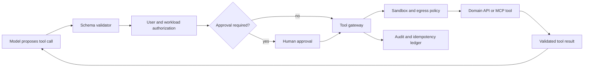

# Tool contracts and sandboxing

A tool turns model text into a request to another system. That boundary is where an assistant can read records, create tickets, send messages, change infrastructure, or move money. Treating a tool call as trusted because it is valid JSON is a security defect. The model proposes an action. The tool gateway validates, authorizes, constrains, records, and executes it.

## First principles

A **tool schema** describes the shape of allowed input. An **authorization policy** decides whether the user and workload identity may perform the requested action. An **idempotency key** lets a retry return an existing outcome rather than repeating a side effect. A **sandbox** limits what code or a tool can reach if its input is malicious or it fails.

These controls address different risks. JSON schema prevents an unknown field from being accepted. It does not prove the user may approve a refund. Network isolation prevents a tool from reaching arbitrary internal hosts. It does not make the returned data safe to place in a prompt.

This separation is the reason a single “tool safety” check is not credible. A perfectly valid request can still target another tenant's record. A correctly authorized request can still contain a hostile URL that causes server-side request forgery. A sandboxed tool can still return misleading data that influences the next model call. Each control constrains a different transition, so the design must retain all of them.

The model is an untrusted planner at this boundary. It can select from the tool vocabulary and fill a typed proposal, but it cannot establish the caller's identity, grant itself a role, or decide that a side effect is acceptable. The gateway translates a proposal into an application decision using facts outside the prompt: authenticated principal, tenant, current business state, policy revision, and approval record.

## Requirements and invariants

1. A tool receives only validated parameters from an allowlisted schema version.
2. A model cannot increase the user's authority or the tool's workload authority.
3. Every side effect has an idempotency key and an audit event.
4. Tool output is untrusted data until the application validates it.
5. A failing or compromised tool cannot consume every agent connection, token, or worker slot.

Foundry recommends treating tool outputs as untrusted input, limiting transmitted data, avoiding credentials in prompts, and reviewing tool traces. [Foundry tool security guidance](https://learn.microsoft.com/azure/foundry/agents/concepts/tool-best-practice)

### From proposal to effect

A safe tool invocation has two distinct records. The first is the proposed operation: tool name, schema version, normalized arguments, actor, and policy decision. The second is the authoritative effect or outcome returned by the domain system. Keeping them separate lets an operator see whether a denial occurred before execution, whether an approval expired, or whether a network failure left the business outcome uncertain.

The gateway should create its idempotency key from stable workflow identity, such as run and step identifiers, rather than from model text. The same semantic action can be phrased differently in two model calls. A deterministic key binds retries to one intended effect. The domain service, not the model, decides whether that key represents a prior completed operation.

## Architecture



The model never calls the domain API directly. A gateway owns input validation, policy evaluation, rate and concurrency limits, outbound network allowlists, and trace correlation. For a high-impact action, the tool gateway records a pending operation before human approval and execution.

This architecture also makes failure handling less ambiguous. A tool runner can time out after transmitting a request; the gateway must not guess whether the downstream system committed it. It queries the authoritative operation status with the idempotency key, records the answer, and only then decides whether a new attempt is legal. A transport retry is not a business retry.

## A typed tool contract

```json
{
  "name": "create_support_ticket",
  "version": "2",
  "description": "Create a nonfinancial customer support ticket after approval.",
  "inputSchema": {
    "type": "object",
    "required": ["category", "summary", "customerId"],
    "additionalProperties": false,
    "properties": {
      "category": {"enum": ["access", "billing_question", "technical"]},
      "summary": {"type": "string", "maxLength": 1000},
      "customerId": {"type": "string", "pattern": "^cust_[A-Za-z0-9]+$"}
    }
  }
}
```

Keep descriptions precise. A vague tool such as `manage_customer` makes selection, audit, and authorization ambiguous. Foundry supports `tool_choice` settings when the application needs deterministic control over whether an agent can call tools. [Tool-choice guidance](https://learn.microsoft.com/azure/foundry/agents/concepts/tool-best-practice)

## Authorization is separate from selection

```text
model selected: create_support_ticket
schema valid:   yes
authorization:  user may create ticket for customer in tenant
approval:       required for billing category
workload role:  tool gateway may POST only to ticket API
outcome:        execute or deny
```

Use delegated user authorization when the action must reflect the user's own permissions. Use a workload or agent identity for unattended jobs with a narrowly scoped service role. Microsoft Foundry agent identities obtain tokens scoped to the downstream service audience and the target service checks the agent identity's RBAC role. [Agent identity token exchange](https://learn.microsoft.com/azure/foundry/agents/concepts/agent-identity)

## Sandboxing and egress

A sandbox is an execution environment with constrained compute, filesystem, process, identity, and network reach. Use it for code execution, document transforms, browsing, or tools that process untrusted input.

| Boundary | Control | Example |
|---|---|---|
| Network | allowlisted DNS names, private endpoints, egress firewall | tool cannot call arbitrary URLs from prompt text |
| Identity | per-tool managed or agent identity | search tool cannot write ticket data |
| Compute | CPU, memory, process, and wall-clock limits | infinite loop is terminated |
| Filesystem | temporary isolated workspace | tool cannot read host secrets |
| Concurrency | separate pools per tool class | failed browser tool does not block payment tool |

Use bulkheads for high-risk or noisy dependencies. Isolated pools prevent a failing tool from exhausting resources required by other tools or users. [Bulkhead pattern](https://learn.microsoft.com/azure/architecture/patterns/bulkhead)

## Safe execution sequence

1. Persist `runId`, `toolCallId`, schema version, and proposed arguments.
2. Validate types, required fields, size limits, and allowlists.
3. Resolve user, tenant, policy, and approval requirements.
4. Create an idempotency key and check for an existing domain outcome.
5. Execute in the tool's sandbox with deadline and resource limits.
6. Validate the domain response against an output schema.
7. Store a redacted audit event and return only the minimum result to the model.
8. If execution is uncertain, query operation status. Do not issue a blind retry.

## Output is untrusted input

A retrieved web page, MCP response, or tool error can include instructions that attempt to redirect the agent. Keep tool outputs in a distinct data channel. Do not concatenate them into system instructions. Validate identifiers and values before a later tool uses them, and require confirmation before sensitive external effects.

## Threat model the tool boundary

Before registering a tool, write down what an attacker, faulty model, compromised dependency, or mistaken operator could cause. Tool safety is not only prompt injection defense.

| Threat | Example | Required control |
|---|---|---|
| Confused deputy | user asks agent to read another tenant's invoice | authorize user and tenant at the domain API, not in prompt text |
| Parameter smuggling | model adds `admin=true` or an unexpected URL | `additionalProperties: false`, enum allowlists, schema version |
| Indirect prompt injection | search result tells agent to export secrets | treat results as data; do not let tool output alter authority |
| Server-side request forgery | model supplies `http://169.254...` or internal host | egress allowlist, URL parser, private-network policy |
| Duplicate side effect | timeout after payment or ticket creation | idempotency key plus status lookup |
| Excessive resource use | model repeatedly calls expensive report tool | per-tool token, concurrency, time, and call budgets |
| Privilege persistence | broad project identity accesses every tool | per-agent or per-tool least privilege, access review |

The first question is not "Can the model call it?" It is "What exact action can happen if every generated argument is hostile?" This produces controls that still work when the model is wrong.

Threat modeling the concrete effect forces useful questions. Which identifier could cross a tenant boundary? Which field determines a money amount, a deployment target, or an email recipient? Which response can influence a later action? What is the narrowest identity and egress path needed? The answers become schema constraints, policy predicates, approval rules, and sandbox limits that can be tested without relying on model judgment.

## Policy decision record

Make authorization inspectable. A policy engine should return a decision record rather than a Boolean hidden in application code.

```json
{
  "decisionId": "dec-01J...",
  "subject": {"userId": "usr-91", "tenantId": "tenant-42"},
  "action": "ticket.create",
  "resource": "customer:cust_A7",
  "toolVersion": "create_support_ticket.v2",
  "effect": "allow_with_approval",
  "constraints": {"maxPriority": "normal", "approvedCategories": ["access", "technical"]},
  "policyRevision": 48
}
```

Bind approval to this decision ID, argument hash, policy revision, and expiry. An approval for a technical ticket cannot be reused after the model changes the customer ID, category, or summary. The tool gateway rechecks authorization immediately before execution because a user's role can change while an agent waits for review.

## MCP, OpenAPI, and direct domain APIs

Tool protocols solve connectivity, not business safety.

| Interface | What it standardizes | What the application still owns |
|---|---|---|
| MCP server | tool discovery and invocation transport | scope, data classification, output validation, egress and audit |
| OpenAPI operation | HTTP request/response schema | authorization, idempotency, business errors, approval |
| Direct domain SDK | language-level calls | same controls, plus dependency-version management |

For all three, expose a narrow facade. Prefer `get_customer_case(caseId)` over `run_query(sql)`, and `create_refund_proposal` over `issue_refund`. The narrow facade makes an allowlist, approval rule, and evaluation set possible.

A narrow facade is a product decision as much as a security decision. It gives the model an operation with a stable business meaning, lets the gateway validate a small argument space, and makes the audit record readable to an operator. A generic administrative interface delegates too much interpretation to a probabilistic caller and makes it difficult to specify what a successful or safe outcome means.

## Sandbox execution profile

Write sandbox limits as configuration, not informal convention:

```yaml
tool: document-transform
network:
  allowedHosts: ["storage.private.example", "search.private.example"]
runtime:
  cpu: "1"
  memory: "512Mi"
  wallClockSeconds: 30
  maxChildProcesses: 4
filesystem:
  writablePaths: ["/workspace"]
  readOnlyPaths: ["/runtime"]
identity:
  role: "Storage Blob Data Reader"
```

An actual implementation differs by platform, but the design must name its resource and reach boundaries. Test denied egress, oversized input, infinite loop, malicious archive, expired credential, and tool dependency outage. A sandbox that has never rejected these cases is only a diagram.

## Tool evaluation set

Test tools with more than happy-path prompts:

1. Correct request with authorized user.
2. Correct request with unauthorized user.
3. Missing and extra fields.
4. Cross-tenant resource identifier.
5. Tool output containing a malicious instruction.
6. Duplicate call with same idempotency key.
7. Timeout after domain acceptance.
8. Approval requested, changed arguments, then approval replay.
9. Dependency `429` and circuit-open behavior.
10. Cancellation before and after irreversible work.

Record pass criteria in terms of domain outcome, audit record, and no secret exposure, not only whether the model selected the expected tool.

## Failure and recovery

| Failure | Safe action | Recovery |
|---|---|---|
| Schema invalid | reject before tool call | return validation error to orchestration |
| Authorization denied | do not reveal protected detail | audit denial and request clarification |
| Deadline exceeded | cancel sandbox work | inspect idempotency status before retry |
| Tool returns malformed data | quarantine result | alert tool owner and fail run safely |
| Approval expires | do not execute | create a new approved request |
| Tool dependency fails | open scoped circuit | use allowed fallback or report unavailable |

## Review checklist

- Does every tool have a narrow name, typed schema, version, and explicit output contract?
- Is user authorization evaluated independently from model tool selection?
- Which actions require human approval, and where is approval bound to the exact arguments?
- Are credentials excluded from prompts, logs, and tool results?
- What egress destinations, identities, CPU, memory, and time limits apply to the tool?
- Can retries discover the original outcome through an idempotency key?
- Are tool outputs treated as untrusted before reuse?

## Hands-on exercise

Design a `refund_payment` tool. Define the input and output JSON schemas, refund limit, delegated-user requirement, approver rule, idempotency key, cancellation behavior, audit fields, sandbox egress rule, and the compensation action for a failed downstream notification.
