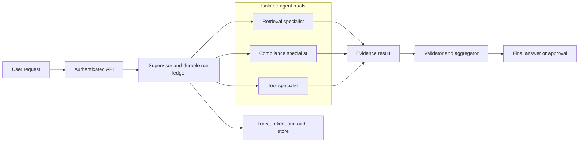

# Multi-agent topologies

A multi-agent system is a distributed workflow whose workers happen to use models. Adding agents does not automatically improve an answer. It adds model calls, context transfer, routing decisions, token cost, failure modes, security boundaries, and termination problems. Start with one direct model call or one tool-using agent. Add agents only when specialization, isolation, or parallel work produces a measured benefit.

## First principles

An **agent** has a model, instructions, tools, and a bounded responsibility. An **orchestrator** chooses which agent runs, what context it receives, when to stop, and how to combine results. A **handoff** transfers control to one specialist. **Fan-out/fan-in** runs independent specialists in parallel and aggregates their results. A **ledger** is durable workflow state that records tasks, outcomes, and approvals.

The invariant is that no agent gains authority merely because another agent passed it text. Each agent receives the minimum context, identity, tools, and token budget needed for its task.

This is an authority boundary, not only an optimization. A retrieval specialist may be allowed to read a narrowly filtered corpus, while a tool specialist may be allowed to propose a ticket action. Passing a retrieved paragraph to the tool specialist does not transfer retrieval credentials, and passing a tool proposal to the supervisor does not authorize execution. Every recipient must evaluate its own permissions against the authenticated user and current policy.

Specialization earns its cost only when it changes a measurable outcome. A separate reviewer can provide an independently validated compliance artifact. Parallel retrieval can reduce latency when sources are independent. A browser or code-execution task may require an isolated runtime. If the second agent merely repeats the first agent's reasoning with the same context and tools, it adds token cost and new failure modes without a defensible system benefit.

## Choose the lowest-complexity topology

| Topology | Best for | Main risk |
|---|---|---|
| Direct model call | one-step generation or classification | forcing a model to act like a workflow |
| Single agent with tools | one domain with dynamic lookup or action | tool overload and uncontrolled loops |
| Sequential pipeline | deterministic draft-review-transform steps | early error propagates downstream |
| Fan-out/fan-in | independent analysis with aggregation | token spikes and conflicting results |
| Handoff | specialist is discovered while processing | bouncing between agents |
| Group chat or maker-checker | review, debate, or quality gate | unbounded conversation loops |
| Dynamic ledger manager | open-ended work with explicit plan | cost and termination uncertainty |

Microsoft recommends choosing the lowest complexity that meets the requirement. A single agent with tools is often the enterprise default; multi-agent coordination needs a clear specialization, security, or parallelism justification. [Azure agent orchestration patterns](https://learn.microsoft.com/azure/architecture/ai-ml/guide/ai-agent-design-patterns)

### A topology is a control-flow choice

Choose a sequential pipeline when one artifact is a prerequisite for the next. A parser must produce structured fields before a classifier can assess them. Choose fan-out only when branches can use the same stable input without changing one another's task. A handoff is useful when the first agent discovers which specialist owns the problem, but it needs a hop limit because discovery can oscillate.

The orchestrator is responsible for making this choice at runtime. A model can recommend that another specialist run, but the supervisor decides whether the proposed task has valid inputs, remaining budget, approved tools, and a route to a terminal state. This separates probabilistic planning from deterministic admission and prevents an agent network from expanding its own scope.

## Supervisor architecture



The supervisor owns the run, budget, allowed-agent list, termination rule, and final response. Specialists return typed artifacts, not unrestricted chat text. The tool specialist is the only component allowed to propose actions, and the tool gateway still reauthorizes every action.

Typed artifacts make failure explicit. A retrieval agent can return `evidence-set.v1` with document references and a completeness status. A compliance agent can return `review.v1` with blocking findings. The aggregator should reject an artifact whose schema, source scope, or policy revision does not match the current run rather than asking another model to silently repair it. This preserves the difference between a supported result and a fluent reconstruction.

## Typed handoff and result contracts

```json
{
  "runId": "run-01J...",
  "taskId": "task-03",
  "agent": "compliance-reviewer.v2",
  "goal": "Check proposed answer against policy evidence.",
  "inputReferences": ["evidence-set-71"],
  "maxTokens": 1800,
  "deadlineUtc": "2026-08-12T10:00:12Z",
  "allowedTools": ["policy-search"],
  "expectedOutput": "compliance-review.v1"
}
```

```json
{
  "type": "compliance-review.v1",
  "status": "pass",
  "findings": [],
  "evidenceIds": ["chunk-19", "chunk-32"],
  "confidence": "supported",
  "nextAction": "aggregate"
}
```

Schemas limit context ambiguity and make it possible to validate an agent before its result influences another agent. Reject malformed, unsupported, or unauthorized outputs instead of asking another model to repair them silently.

The schema is also a budget boundary. A handoff with a 1,800-token allowance and a defined output type is easier to schedule and audit than an open chat channel. Use references to durable artifacts for large evidence sets and keep only task-specific summaries in the next context package. The receiving agent needs enough information to perform its role, not every message and tool trace that led there.

## Context is a budget

Every agent adds instructions, input, retrieved evidence, tool results, and output. Without limits, a multi-agent workflow repeats the same context until it hits model limits or becomes unaffordable.

$$
\text{run tokens} = \sum_{agent=1}^{n}(\text{instructions} + \text{input} + \text{tools} + \text{output})
$$

Give each handoff a purpose-specific context package. A compliance reviewer might need the proposed answer and cited policy chunks, not the entire user transcript and all tool traces. Use summaries or references for prior work, and preserve raw evidence in the durable ledger for audit and recovery.

Azure notes that context grows rapidly across agent transitions and recommends compaction, selective pruning, and external durable state for long-running work. [Multi-agent context guidance](https://learn.microsoft.com/azure/architecture/ai-ml/guide/ai-agent-design-patterns)

## Termination and human gates

Every topology needs an explicit stop condition:

```text
complete when: required artifacts validate and final answer has citations
stop when:    token budget, iteration count, or wall-clock deadline is exhausted
escalate when: confidence is insufficient, specialist results conflict, or action is high impact
cancel when:  user revokes request or policy no longer permits the work
```

A maker-checker loop requires acceptance criteria and a maximum iteration count. Handoff requires a maximum hop count and a rule that forbids returning to a previously visited agent without new evidence. Dynamic planning requires a maximum task count and a human approval point before irreversible actions. Azure specifically warns that group chat and handoff patterns can loop without objective completion criteria. [Termination considerations](https://learn.microsoft.com/azure/architecture/ai-ml/guide/ai-agent-design-patterns)

### Termination policy example

```json
{
  "maxAgentCalls": 8,
  "maxHandoffs": 3,
  "maxReviewerIterations": 2,
  "maxRunTokens": 12000,
  "deadlineSeconds": 45,
  "stopWhen": ["validated_answer", "human_escalation", "budget_exhausted"],
  "escalateWhen": ["conflicting_policy_findings", "missing_evidence", "high_impact_tool"]
}
```

The supervisor evaluates these rules after every result, not only after an agent claims completion. A model saying "task complete" is untrusted unless the required artifact validates.

Termination is a correctness property. Without a deadline, maximum calls, and a definition of sufficient evidence, a maker-checker pair can consume capacity while producing increasingly similar text. Without a conflict rule, two agents can return incompatible policy conclusions and leave the aggregator to choose the more persuasive wording. State these decisions in policy before dispatching work, then record which condition ended the run.

## Parallelism and conflict resolution

Fan-out only work that is independent. If a security reviewer, factual retriever, and style checker analyze the same draft, they can run concurrently. If one agent's output changes the task for the next, use a sequence.

Define aggregation before launch:

| Result type | Aggregation rule |
|---|---|
| Classification | majority or weighted vote with tie escalation |
| Evidence retrieval | union then deduplicate by source and version |
| Policy review | any blocking finding fails closed |
| Recommendations | typed ranking with rationale and source evidence |
| Tool actions | never vote; require deterministic authorization and approval |

Concurrent agents multiply token and model quota demand. Reserve a run-level token budget and per-agent budgets before fan-out. If one specialist fails, decide whether its result is optional, retryable, or a reason to halt the whole workflow.

## Isolation, identity, and tools

Use bulkheads for specialists with different risk or resource profiles. A browser or code-execution agent should not share unrestricted concurrency, filesystem, network access, or credentials with a policy-reading agent. The Bulkhead pattern isolates a failing dependency or consumer pool so it does not cause a cascading failure. [Bulkhead pattern](https://learn.microsoft.com/azure/architecture/patterns/bulkhead)

Give each published agent a distinct identity when its permissions or audit requirements diverge. Foundry agent identities can obtain scoped downstream tokens, and published agents receive distinct identities that need their own role assignments. [Foundry agent identity](https://learn.microsoft.com/azure/foundry/agents/concepts/agent-identity)

Apply user permission trimming at every retrieval agent. A supervisor cannot safely give a specialist broad source access and hope that the final aggregator removes protected content.

## The run ledger is the coordination protocol

Agents should exchange references to durable artifacts instead of repeatedly pasting long transcripts. A ledger record turns a nondeterministic agent network into an inspectable workflow.

```json
{
  "runId": "run-01J...",
  "runVersion": 7,
  "goal": "Answer policy question with evidence",
  "budget": {"reservedTokens": 12000, "usedTokens": 5350},
  "tasks": [
    {"id": "retrieve", "agent": "retrieval.v2", "state": "completed", "artifact": "evidence-set-9"},
    {"id": "review", "agent": "compliance.v1", "state": "completed", "artifact": "review-3"},
    {"id": "aggregate", "agent": "answer.v4", "state": "running"}
  ],
  "policyRevision": 48,
  "terminalReason": null
}
```

Use optimistic concurrency on `runVersion`: a worker reads version 7 and updates to version 8 only if no other worker changed it. If the update conflicts, reload the ledger and re-evaluate rather than merging mutable state from two agents blindly.

The ledger is not a transcript. It is the coordination record that answers which task owns a result, which budgets remain, which policy version governed a decision, and whether an action is pending or complete. A worker restart can reload this record and either resume a valid pending task or safely stop it. Persisting only agent messages loses those operational facts and makes duplicate dispatch likely.

## Supervisor decision algorithm

```text
while run is not terminal:
    load current ledger and policy revision
    if deadline, token, call, or hop limit is reached: stop or escalate
    choose only agents whose typed input artifacts validate
    reserve per-agent token and concurrency budget
    dispatch independent read-only tasks in parallel
    validate returned artifact schema, source evidence, and authorization scope
    write result atomically to ledger
    if an action is requested: require tool policy and approval before dispatch
```

This algorithm separates deterministic control flow from probabilistic model output. The model can recommend a next task; the supervisor decides whether it is allowed, affordable, and useful.

## Context compaction example

Do not pass a 20-message transcript, all agent deliberations, and raw tool payloads to every specialist. Create a purpose-specific packet:

```json
{
  "task": "review answer for policy compliance",
  "userQuestion": "Can remote staff carry leave forward?",
  "proposedAnswer": "...",
  "evidence": [{"chunkId": "c-18", "text": "...", "sourceVersion": 9}],
  "excluded": ["tool traces", "unrelated conversation", "raw authentication claims"]
}
```

The ledger retains raw artifacts with access control. The reviewer receives only what it needs. This reduces token cost, model distraction, and accidental disclosure.

## Topology selection worked example

For an internal policy assistant, use a single retrieval-and-answer agent if the request is read-only and one evidence set is sufficient. Add a compliance reviewer only when regulatory policy requires an independent validation artifact. Do not add a debate agent merely to make answers sound more thoughtful.

For a document-processing workflow, use a deterministic sequence when parsing must finish before classification and indexing. Use fan-out only for independent enrichments such as language detection, PII classification, and section extraction. Use a handoff only when the required specialist cannot be identified until the request is analyzed. These decisions make latency and failure behavior predictable.

## Multi-agent evaluation

Evaluate each agent separately, then the composed workflow:

| Layer | Tests |
|---|---|
| Agent | typed input/output, tool selection, refusal, token budget |
| Handoff | allowed destinations, hop cap, context minimization |
| Aggregation | conflict rule, citation preservation, no-answer behavior |
| Workflow | restart, duplicate dispatch, timeout, cancellation, policy change |
| Security | cross-tenant evidence, prompt injection propagation, unauthorized tool request |

Collect task success rate, loop rate, handoff count, context tokens per task, invalid artifact rate, escalation rate, p95 run latency, per-agent cost, and user outcome. A high final-answer score can conceal unsafe intermediate tool attempts or costly repeated loops.

## Reliability and recovery

Persist the run ledger after task creation, dispatch, result validation, approval, and terminal transition. A restart can then resume a pending task or mark it failed without repeating a completed tool action.

| Failure | Containment | Recovery |
|---|---|---|
| Specialist times out | cancel its task and preserve budget | retry only if classified transient |
| Agent returns malformed result | reject before aggregation | request bounded correction or escalate |
| Shared model route throttles | pause new dispatches and apply route policy | resume when quota and breaker permit |
| Handoff loop detected | stop at hop limit | return best supported result or escalate |
| Aggregator cannot resolve conflict | fail closed for policy findings | human review with source artifacts |
| Tool action uncertain | inspect idempotency status | never ask another agent to repeat it |

Instrument every dispatch, handoff, token reservation, model call, tool call, context size, validation outcome, and stop reason. Test agents individually and test complete workflows with rubrics because model outputs are nondeterministic. [Multi-agent reliability and testing guidance](https://learn.microsoft.com/azure/architecture/ai-ml/guide/ai-agent-design-patterns)

## Review checklist

- Why cannot one agent or deterministic workflow solve this task?
- What typed input, output, tool, token, and deadline contract does each agent have?
- Which state is shared, durable, and mutable, and who owns it?
- What is the exact termination, escalation, cancellation, and handoff-hop rule?
- Which agents can run concurrently, and how are conflicts resolved?
- Which agent identities, tool scopes, network paths, and bulkheads isolate high-risk work?
- Can an operator reconstruct the plan, every handoff, evidence set, budget decision, and terminal outcome?

## Hands-on exercise

Design a three-agent policy assistant: retrieval, compliance review, and answer aggregation. Define the typed contracts, context packages, token budgets, fan-out decision, conflict rule, iteration and handoff limits, retrieval permissions, approval gate, trace schema, and response when compliance and retrieval evidence conflict.
