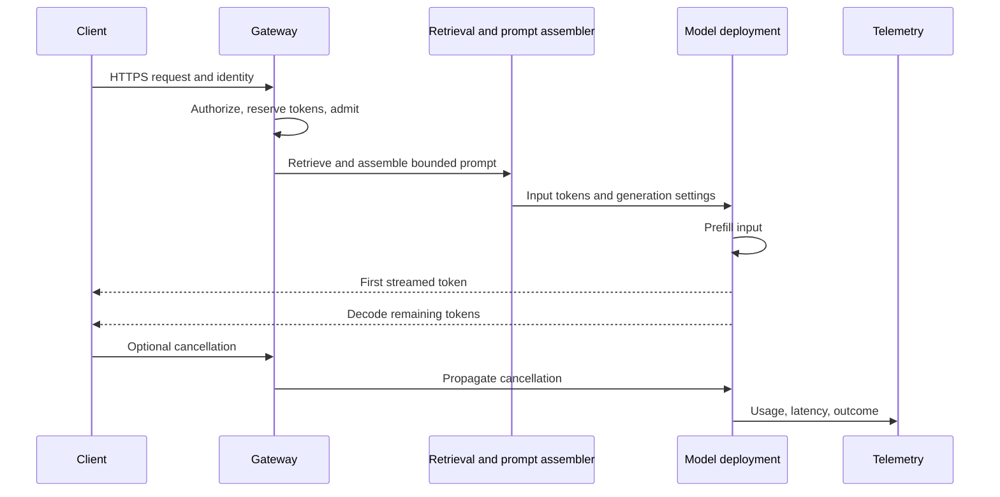

# Anatomy of an inference request

An inference request consumes different resources at different times. Retrieval and prompt assembly consume application work before the model starts, prefill consumes a burst of model computation for the complete input, and decode holds stream, scheduler, and attention state until completion. Separating those stages lets the system assign a meaningful latency budget and reject work before it harms unrelated users.

Inference is the process of applying a deployed model to new input and returning output. For a language model, the request is not one uniform computation. It has an admission stage, prompt preparation, prefill, token-by-token decoding, streaming, cancellation, accounting, and audit boundaries. Understanding this path explains why a long prompt can delay every user even when request-per-minute traffic is low.

## Core terms

- **Prefill** processes the input tokens and creates attention state for the request.
- **Decode** produces output one token at a time from that state.
- **Time to first token (TTFT)** is user-perceived delay before streaming begins.
- **Time per output token (TPOT)** is the interval between later generated tokens.
- **KV cache** stores model attention state during generation; lesson 23 examines its memory cost.

## Request architecture



The gateway rejects over-budget work before expensive processing. Retrieval selects authorized evidence before prompt assembly. The model receives a bounded request and streams output. A cancellation is useful only when it releases the stream, local concurrency, and model work as early as the serving API permits.

Each stage owns a different form of work. Authentication establishes who may request service. Retrieval decides which external facts may enter the prompt. Prompt assembly turns those facts into a bounded model input. Prefill creates model state, while decode consumes that state over time. Treating these as one opaque "model call" hides where latency, cost, and failures actually originate.

This separation makes a failure response meaningful. A retrieval authorization denial should not look like a model timeout. A queue delay that would violate the user objective should be rejected before prefill begins. A client disconnect after first token is not evidence that the model never consumed capacity. The request lifecycle is the contract that lets the system account for each case correctly.

## Latency budget

$$
TTFT = t_{edge} + t_{auth} + t_{retrieve} + t_{assemble} + t_{queue} + t_{prefill}
$$

$$
T_{total} = TTFT + outputTokens \times TPOT
$$

A system with 300 ms retrieval, 1,200 ms prefill, and 35 ms TPOT produces a 400-token answer in roughly $1.5 + 14 = 15.5$ seconds. Streaming improves perceived responsiveness after TTFT, but it does not remove output compute, quota consumption, or connection occupancy.

## Requirements and invariants

| Requirement | Design choice |
|---|---|
| Interactive p95 first token below 3 seconds | separate TTFT budget and prompt-size controls |
| No tenant exhausts shared capacity | token and concurrent-stream admission |
| Retrieval evidence stays authorized | policy check before prompt assembly |
| Cancelled streams do not keep consuming local resources | cancellation propagation and final state event |
| Output is auditable | record model, prompt, index, token, latency, and policy versions |

Foundry quota is subscription-scoped and model usage is constrained by request and token limits that vary by deployment type and model. Plan with the actual allocated quota rather than an assumed per-endpoint limit. [Foundry quotas and limits](https://learn.microsoft.com/azure/foundry/openai/quotas-limits)

## Prompt assembly is an admission control input

A prompt contains system instructions, user message, conversation summary, retrieved evidence, tool results, and output reservation. Assemble it deterministically:

```json
{"systemVersion":"support-v14","conversationTokens":1200,"evidenceTokens":5000,"outputReserve":700,"maxInputTokens":9000}
```

If evidence exceeds budget, trim by source authority, relevance, diversity, and duplicate removal. Never silently remove a policy constraint or the citation metadata that explains an answer.

Prompt assembly is a constrained packing problem. The model context window and serving budget are finite, so adding one document necessarily excludes another or reduces available output. The assembler should make those trade-offs using stable, inspectable rules rather than whichever snippets happen to arrive last. Record selected and excluded evidence references so an evaluator can distinguish retrieval failure from a deliberate context-budget decision.

## Streaming contract

Use a request ID and terminal event. The client must distinguish a completed response from a network interruption:

```text
event: token
data: {"requestId":"req-1","text":"..."}

event: completed
data: {"requestId":"req-1","usage":{"input":3200,"output":410}}
```

Do not automatically replay an interrupted stream after visible tokens have been delivered. For a structured response, validate only at the terminal event and return an explicit incomplete result when the stream ends early.

## Admission, failure, and recovery

| Condition | Action |
|---|---|
| Token reservation unavailable | reject with 429 and retry guidance |
| Retrieval unavailable | return no-answer or degraded source-search path |
| Model queue delay exceeds TTFT budget | reject, queue explicitly, or route to compatible deployment |
| Client cancels | stop forwarding tokens and release tracked concurrency |
| Model returns transient error before acceptance | one bounded retry if request is idempotent |
| Output violates schema or safety rule | block response and record validation outcome |

## Observability

Trace each stage with one activity ID. Measure p50/p95/p99 TTFT, TPOT, prompt tokens, output tokens, queue delay, cancellations, model 429s, retrieval latency, schema failures, and per-tenant usage. Correlated dependency timing is required to identify whether TTFT rose because of retrieval, queueing, or prefill. [Monitoring and correlation guidance](https://learn.microsoft.com/azure/architecture/best-practices/monitoring)

## Review checklist

- What consumes the first-token budget, and which stage owns each millisecond?
- Is prompt size bounded before model admission?
- Is cancellation observable and does it release capacity?
- Can a partial stream be distinguished from a completed answer?
- Do output schema and safety checks occur before terminal success?

## Exercise

Design a streamed policy-answer endpoint with a 2.5-second p95 TTFT objective and 800-token maximum output. Allocate the latency budget, define token reservation, cancellation behavior, terminal stream event, failure responses, and required traces.

## What prefill and decode actually do


Credits: Hazem Ali

Prefill processes the complete input sequence through model layers and builds the request's attention state. Its cost grows with prompt length, retrieved evidence, conversation history, and tool results. Decode then generates one next token at a time from that state. Decode is sequential: each output token changes the next-token distribution. This is why long completions consume serving capacity even after a fast first token.

The practical consequence is that an API cannot optimize inference with one generic latency number. It must track queue time, prefill time, time to first token, time per output token, total stream duration, cancellation, and validation independently.

## What happens before the model call

1. Validate caller identity, tenant, payload size, and idempotency key.
2. Resolve the conversation version and authorized retrieval scope.
3. Retrieve evidence under a strict token budget.
4. Compute input tokens plus output reserve and attempt admission.
5. Bind the request to model, prompt, retrieval-index, and policy versions.
6. Invoke inference only after the shared and tenant budgets accept the request.

This order prevents a request from performing expensive retrieval or model work before the system knows it can serve the response. It also lets an operator reconstruct why a request was rejected, delayed, or routed.

## Queueing and backpressure

Queue time is part of TTFT. Little's Law relates average in-flight work $L$, arrival rate $\lambda$, and time in system $W$:

$$
L = \lambda W
$$

When requests arrive faster than prefill and decode complete, the service can reject, offer an explicit asynchronous operation, reduce allowable output, or shed lower-priority work. It must not hold an unbounded interactive connection and pretend the request is progressing.

## Stream correctness rules

Once output reaches the client, an automatic retry might duplicate visible text or a tool action. Mark streams as `completed`, `cancelled`, or `interrupted`. Validate a structured response at the terminal event, not after the first fragment. A cancellation must release API concurrency and propagate downstream where supported; otherwise capacity accounting remains wrong.

## Operational drill

Load test short and long prompts separately. Force a retrieval timeout, model throttling response, client disconnect after first token, and invalid final JSON. For each case, verify the user result, trace status, token accounting, and released concurrency match the contract.

## Ownership map

| Concern | Authority | Why |
|---|---|---|
| User identity and tenant | identity provider and API | model input cannot prove identity |
| Conversation record | conversation service | allows retry and deletion policy |
| Retrieved source and ACL | source system and policy service | search result is derived evidence |
| Prompt composition | application | defines what the model sees |
| Token reservation | gateway admission service | protects shared quota before invoke |
| Generated text | model deployment | probabilistic output, never business authority |
| Business action | tool/domain API | must independently authorize and audit |

## Request state record

```json
{"requestId":"req-1","tenantId":"tenant-42","state":"admitted","promptVersion":"v14","modelRoute":"primary-us","inputReservation":4200,"outputLimit":700,"indexVersion":"policies-v9","policyRevision":48}
```

Persist the state before an asynchronous handoff or tool action. This allows a retry to find the original outcome instead of submitting duplicate work. The record must not contain raw private prompt text unless a retention and access policy explicitly permits it.

## Failure matrix

| Boundary | Detection | User response | Operator action |
|---|---|---|---|
| Authentication | invalid or expired token | 401 or 403 | audit attempt |
| Admission | token or concurrency budget exhausted | 429 with retry guidance | inspect tenant and shared budget |
| Retrieval | timeout or unauthorized source | cited no-answer or unavailable | trace dependency and ACL filter |
| Prefill | model queue or provider throttle | overload response before stream | reduce admission or route compatible work |
| Decode | model error after stream starts | interrupted terminal event | do not replay visible content |
| Validation | invalid JSON or unsafe output | explicit failure, no partial business action | inspect model and schema version |

## Deployment and recovery

Treat model deployment, prompt template, retrieval index, safety policy, and gateway limit as one tested release tuple. Roll back by selecting a prior approved tuple, not by changing a single model name while retaining incompatible prompt or schema assumptions. Test direct invocation, stream cancellation, schema validation, quota exhaustion, retrieval denial, and the rollback route before release.

## Capacity worksheet

For each request class, record p50, p95, and p99 input tokens, output tokens, TTFT, TPOT, active streams, and cancellation rate. Then calculate:

$$
	ext{output duration} = \text{output tokens} \times TPOT
$$

$$
	ext{concurrent streams} \approx \text{arrival rate} \times \text{mean stream duration}
$$

Use the p95 prompt and output distribution for admission planning. An average-only plan underestimates long prompts and long streams, which are often the capacity drivers.

## Security review

- Restrict model invocation to the gateway or orchestrator workload identity.
- Keep model and retrieval dependencies private when classification requires it; DNS and private routing must be tested from each caller network.
- Redact prompts, retrieved evidence, and output from general telemetry; retain only approved diagnostic fields.
- Validate every retrieved source before prompt assembly and every tool action after generation.
- Separate operational traces from immutable audit records because their retention and access needs differ.

## Hands-on build prompt

Write an API sequence for an internal assistant that receives a question, retrieves policy evidence, streams a response, and lets the user cancel. Define the request object, state record, token reservation, SSE terminal events, p95 latency budget, failure matrix, trace fields, and rollback tuple. Explain why each state boundary exists.

## Evidence selection is a serving concern

Inference quality depends on what reaches the model. A retrieval system can return 50 candidates, but a context window has room for only a small evidence set after instructions, conversation, and output reserve. Prompt assembly must decide which candidates become model input.

Use a deterministic selection policy:

1. Reject candidates outside tenant, ACL, source-state, or classification policy.
2. Remove candidates from inactive or superseded source versions.
3. Deduplicate chunks that overlap heavily or repeat the same passage.
4. Keep required exact-match evidence, such as policy IDs or contract clauses.
5. Rank remaining candidates by retrieval score, source authority, freshness, and diversity.
6. Stop before the evidence budget is exceeded.
7. Attach a citation record for every selected chunk.

The model should not be allowed to decide which hidden candidates it receives. The application has access to policy metadata and source lineage that a generated answer cannot safely infer.

### Prompt package

```json
{
    "requestId": "req-01J",
    "systemInstructions": {"version": "policy-answer-v14", "tokens": 850},
    "conversationSummary": {"version": 3, "tokens": 600},
    "evidence": [
        {"chunkId": "policy-17:v9:c03", "tokens": 410, "sourceVersion": 9, "location": "Leave > Carry forward"}
    ],
    "generation": {"maxOutputTokens": 700, "temperature": 0},
    "citationsRequired": true
}
```

This package has explicit versions because a changed prompt, summary algorithm, or citation rule can change output behavior even if the model deployment stays the same.

## Conversation state and prompt freshness

Do not append a full transcript forever. Long conversation history increases cost, delays prefill, and can repeat outdated user facts. Store the authoritative messages in a retention-controlled conversation system. Create a compact summary only when policy permits, version it, and regenerate it when the conversation changes materially.

| State | Authority | Prompt use | Deletion rule |
|---|---|---|---|
| Raw messages | conversation store | selected recent turns | product and privacy retention |
| Summary | derived conversation state | bounded context replacement | regenerate or delete with source |
| Retrieved evidence | source and index | one request only | recompute every request |
| Model output | response record | never trusted as authority | retention by product policy |

Never use the previous model answer as factual evidence without retrieving and validating its sources again. A fluent earlier answer can be wrong, stale, or authorized for a different conversation state.

## Idempotency and reconnect behavior

An idempotency key protects request acceptance, not a partially streamed response. The server associates the key with the canonical request hash and state record.

```text
same key + same request hash + completed response: return stored terminal outcome
same key + same request hash + running response: return status or reconnect token
same key + different request hash: reject conflict
new key: create new request state
```

For a reconnecting client, expose a status resource or resumable event position only if the infrastructure can guarantee it. Otherwise state clearly that the stream was interrupted and let the user request a new answer. Do not rerun a tool-using request merely because a browser refreshes.

## Retrieval and model timeouts

Every dependency call needs a timeout that is shorter than the request deadline. A timeout is not a retry policy.

| Call | Example timeout | Reason |
|---|---:|---|
| Policy decision | 100 ms | fail closed before evidence selection |
| Retrieval query | 400 ms | preserve TTFT budget |
| Prompt assembly | 100 ms | local work must remain bounded |
| Model first token | 1,800 ms | leave time for gateway and stream setup |
| Full generation | request-specific | depends on output ceiling and TPOT |

Classify failures before retrying. A network reset before upstream acceptance may have one bounded retry. A provider `429` should trigger admission reduction or a compatible route decision. A timeout after streaming begins must not replay visible text. A tool action with uncertain acceptance must query its domain operation status using an idempotency key.

## Example response contracts

For a synchronous rejection:

```http
HTTP/1.1 429 Too Many Requests
Retry-After: 15
Content-Type: application/json

{"code":"model_capacity_unavailable","requestId":"req-01J","retryAfterSeconds":15}
```

For accepted background processing:

```http
HTTP/1.1 202 Accepted
Location: /v1/operations/op-01J

{"operationId":"op-01J","state":"queued","requestId":"req-01J"}
```

For a completed stream, include usage and outcome without exposing hidden reasoning:

```json
{"requestId":"req-01J","state":"completed","citations":["policy-17:v9:c03"],"usage":{"inputTokens":2850,"outputTokens":392}}
```

## Telemetry schema

Instrumentation must let an operator follow one request across gateway, retrieval, model, and validation. Azure monitoring guidance recommends a unique activity ID propagated through a request and structured, correlated telemetry. [Correlation and instrumentation guidance](https://learn.microsoft.com/azure/architecture/best-practices/monitoring#information-for-correlating-data)

```json
{
    "traceId": "00-...",
    "requestId": "req-01J",
    "tenantPseudonym": "t-42",
    "event": "inference.completed",
    "modelRoute": "primary-us-v4",
    "promptVersion": "policy-answer-v14",
    "indexVersion": "policies-v9",
    "ttftMs": 1640,
    "tpotMs": 31,
    "inputTokens": 2850,
    "outputTokens": 392,
    "outcome": "completed"
}
```

Keep audit events separate from debug traces. Audit records need durable, access-controlled evidence of user, policy, source, and action. Debug traces need enough timing and dependency detail to diagnose latency. Combining them usually creates either excessive retention of sensitive data or insufficient forensic evidence.

## Dashboard and alert design

Use a request-level dashboard for p50, p95, and p99 TTFT; output duration; interrupted streams; schema-validation failures; and user-visible error rate. Use dependency dashboards for retrieval duration, model `429` responses, token reservation, queue age, and stream concurrency. Use an admission dashboard for per-tenant budget, noisy-neighbor events, and rejected request reasons.

Alert on sustained conditions with context. For example, alert when p95 TTFT exceeds the objective for 10 minutes and model queue delay is the dominant span. Do not page an operator for every client cancellation or individual malformed prompt. Monitoring should identify the failing stage and the affected user flow, not only that the API returned an error. [Performance monitoring principles](https://learn.microsoft.com/azure/architecture/best-practices/monitoring#performance-monitoring)

## Worked capacity scenario

Assume the service admits 25 requests per second at peak. Its p95 request uses 2,500 input tokens and reserves 600 output tokens. Peak reserved token rate is:

$$
25 \times 60 \times (2{,}500 + 600) = 4{,}650{,}000\ \text{tokens/minute}
$$

If the deployment budget is 5 million TPM, this leaves only 350,000 TPM before safety headroom, retries, and other workloads. The design is not ready. The team can lower prompt size, reduce peak admission, allocate more capacity, enforce a tenant fair-share policy, or make some requests asynchronous. Adding API replicas changes none of these token calculations.

Assume 500-token output and 35 ms TPOT. Output alone consumes about 17.5 seconds after TTFT. An interactive product might lower the maximum output, stream partial sections, or offer an explicit "expand answer" follow-up. This is product design coupled to serving physics.

## Deployment probes and release gates

Before routing live traffic to a changed model or prompt tuple, run probes for:

- identity and authorization denial;
- retrieval filter enforcement for a revoked document;
- valid stream start, cancellation, and terminal completion;
- structured-output valid and invalid cases;
- no-answer behavior with irrelevant query;
- p95 TTFT and TPOT under representative concurrency;
- token-accounting reconciliation; and
- rollback to the prior tuple.

Record results with the exact model deployment, prompt version, retrieval index, gateway policy, and evaluation dataset revision. A deployment that returns `200` is not necessarily ready for production.

## Final design review

- Can a reader trace one request from identity through final terminal event?
- Does every cost-driving token source have a budget and owner?
- Is source authority distinct from model output, caches, and summaries?
- Which failures reject, retry, degrade, or require status lookup?
- Can the system explain why a user received no answer, overload, partial stream, or a cited result?
- Can an operator reproduce a response from versioned artifacts without reading confidential prompt text?
