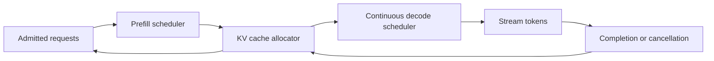
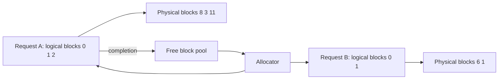

# KV cache and continuous batching

A language model repeatedly attends to earlier tokens while producing new ones. Recomputing all prior attention for every output token would be wasteful, so serving systems retain key-value (KV) attention state for each active request. This cache makes decoding practical, but turns context length and concurrency into a memory-admission problem.

## The memory model

KV cache grows approximately with layers, hidden dimensions, sequence length, bytes per value, and active requests:

$$
KV\ bytes \approx 2 \times layers \times hiddenSize \times tokens \times bytesPerValue
$$

The factor $2$ represents key and value tensors. Exact layouts vary by architecture, grouped-query attention, precision, and serving engine, so this formula is a planning model, not a capacity guarantee. Doubling context or active requests can exhaust memory even if requests per second remain unchanged.

This explains why request rate is not enough to predict serving pressure. A few long-running conversations can reserve large attention histories for many seconds, while a much higher rate of short requests can finish quickly and occupy less total cache. Capacity planning must measure active token state, not only completed requests per minute.

The cache is allocated before the system knows exactly how many tokens the model will generate. Output ceilings are therefore memory policy, not only response-format preference. Reserving the maximum allowed output prevents an accepted request from growing into memory already promised to another active sequence.

## Why batching changes during generation

Prefill benefits from batching similarly sized input work. Decode has a different shape: each active request needs one next token at a time, and requests finish or arrive continuously. **Continuous batching** schedules work at token boundaries, admitting new requests and removing completed ones without waiting for a fixed batch to drain.



## Admission policy

Reserve memory and token budget before prefill. A request must declare maximum context and output limits. Reject or reduce work when safe memory headroom is insufficient; swapping arbitrary active context is usually worse than a clear overload response.

```text
if requested_context + reserved_output > tenant_context_limit: reject
if free_kv_blocks < request_reservation: queue or reject
if model_TPM_budget unavailable: reject before prefill
otherwise admit and allocate request blocks
```

## Fairness and fragmentation

Long-context requests can monopolize cache blocks. Separate pools by model, tenant tier, or context class when one workload must not degrade another. Use a maximum context policy, per-tenant concurrent streams, cancellation propagation, and bounded queue age. These are bulkhead decisions, not merely optimizer settings.

## Metrics

Measure cache utilization, allocated blocks, allocation failures, active sequences, prompt length distribution, output length distribution, queue age, TTFT, TPOT, cancellations, prefill throughput, decode throughput, and model 429s. Correlate metrics with model and deployment version. Azure monitoring guidance recommends request, concurrency, response time, dependency, and error correlation rather than averages alone. [Monitoring guidance](https://learn.microsoft.com/azure/architecture/best-practices/monitoring)

## Failure cases

| Failure | Safe response |
|---|---|
| KV allocation fails | reject before expensive prefill with retry guidance |
| Client disconnects | free reservation and stop stream promptly |
| Long request exceeds policy | summarize or require an explicit asynchronous workflow |
| Decode queue grows | reduce admissions; do not increase active context without memory headroom |
| One tenant dominates | apply tenant stream and context caps |

Foundry quota controls token and request capacity at the service boundary; local serving memory controls whether an admitted workload can execute efficiently. Both must be modeled. [Foundry quota scope](https://learn.microsoft.com/azure/foundry/openai/quotas-limits)

## Review checklist

- What maximum input and output lengths are admitted per tenant?
- How is KV memory estimated, reserved, observed, and released?
- Which workloads may share a batch and which need bulkheads?
- Do cancellation and completion return cache capacity immediately?
- Are TTFT and TPOT measured separately by prompt-length class?

## Exercise

For a model service with a fixed memory budget, design three context tiers, their concurrent-stream caps, queue policy, cancellation path, and alerts for allocation failures and queue age.

## Why KV cache exists


Credits: Hazem Ali

Each new token must attend to prior tokens. Recomputing all prior attention for every decode step would repeat expensive work. The KV cache keeps the already-computed key and value tensors for each active sequence. It improves decode speed but consumes accelerator memory until the request finishes or is cancelled.

The cache makes context length a capacity dimension. A system cannot offer unlimited context, unlimited output, and unlimited active streams on fixed memory. Product context limits are therefore serving decisions, not only model documentation.

## Worked admission decision

Suppose measured serving telemetry estimates 400 MiB of cache for one 16,000-token request. A 24 GiB usable cache pool cannot safely admit 61 such requests because model weights, scheduler overhead, fragmentation, and headroom also need memory. Measure actual allocator behavior, reserve margin, then admit only the number of requests that fits the intended failure policy.

For an over-limit request, choose explicitly: summarize with source citations, move to asynchronous processing, offer a paid long-context tier, or reject with a clear limit. Do not silently discard earlier conversation or evidence.

## Scheduler policy is fairness policy

| Policy | Benefit | Risk |
|---|---|---|
| First come, first served | simple | long prompts delay short interactive work |
| Tenant fair queue | noisy-neighbor protection | accounting complexity |
| Context-class pools | isolates long-context work | unused capacity can be stranded |
| Priority queue | protects critical paths | priority must be authorized and audited |

Continuous batching admits and removes sequences at token boundaries. It does not mean unlimited batching. The scheduler must reserve cache blocks, cap concurrent sequences, and release blocks immediately after completion or cancellation.

## Failure drill

Force a cache-allocation failure, a tenant burst of long prompts, and a client disconnect. Confirm the service rejects before costly prefill when needed, no tenant consumes another tenant's reserved pool, and cancellation frees the same blocks counted at admission.

## From attention to cached state

At each transformer layer, attention projects token representations into queries, keys, and values. During generation, the query for the newest token changes, but the keys and values for earlier tokens do not. The serving engine stores those earlier keys and values and appends state for each newly generated token.

This state belongs to one model version, one sequence, and one serving request. It is not an application cache that can be shared by arbitrary users. Reusing KV state is valid only when the prefix tokens, model weights, tokenizer, positional encoding, and relevant generation setup are compatible.

### Architectural caveats

The simplified memory equation uses `hiddenSize`, but actual cache shape depends on the number of KV heads and per-head dimension. Multi-query attention (MQA) and grouped-query attention (GQA) use fewer KV heads than ordinary multi-head attention, which can reduce cache size. Tensor parallelism can shard cache state across accelerators. Quantized caches can reduce bytes per element. Measure the actual serving runtime instead of converting one formula into a procurement number.

For a model with $L$ layers, $H_{kv}$ KV heads, head dimension $D$, sequence length $S$, and $B$ bytes per element, a more explicit estimate per sequence is:

$$
KV_{sequence} \approx 2 \times L \times H_{kv} \times D \times S \times B
$$

The result excludes allocator metadata, padding, fragmentation, temporary tensors, communication buffers, and model weights.

## Block-based allocation

A naive allocator reserves one contiguous memory region for each request's maximum sequence. This wastes memory when output stops early and makes it difficult to find a large contiguous region despite free space elsewhere.

Block-based allocators divide cache memory into fixed-size token blocks. A request owns a logical list of blocks. The engine maps that list to physical blocks, appends blocks as the sequence grows, and returns them when the request ends.



This reduces external fragmentation and permits memory to be allocated as sequences grow. It does not eliminate internal waste inside the final partially filled block. Smaller blocks reduce that waste but add block-table and scheduling overhead. Block size is therefore an engine benchmark parameter.

## Prefix reuse and its security boundary

Some serving systems can reuse cached state for identical prefixes, such as a long shared system prompt. The cache key must include all inputs that make the prefix computation valid:

```text
model checksum + tokenizer version + exact token IDs + positional settings + adapter ID
```

Do not reuse a prefix merely because two prompts look similar as text. Whitespace, role tokens, tool definitions, adapters, or hidden policy instructions can change token IDs and model state.

Cross-tenant prefix reuse deserves a threat review. The implementation must not expose cache existence, timing, or content in a way that leaks whether another tenant used a sensitive prefix. A conservative enterprise design reuses only public immutable prefixes or scopes reuse by tenant and policy version.

## Prefill scheduling

Prefill work varies with prompt length. Putting one 64,000-token prompt in the same prefill batch as several 1,000-token prompts can raise latency for all of them. The scheduler can bucket prompts by length, cap total batch tokens, or split long prefill into chunks.

### Chunked prefill

Chunked prefill processes a long prompt in bounded portions so decode work from active interactive requests can continue between chunks. It can improve fairness, but introduces scheduler complexity and can increase the long request's own TTFT.

Choose the policy from service objectives:

| Objective | Possible policy |
|---|---|
| Lowest TTFT for short chat | separate short-context queue and cap long prefill |
| High aggregate throughput | fill batches up to safe total tokens |
| Predictable premium long context | dedicated long-context pool |
| Mixed interactive and batch | reserve decode slots for interactive work |

## Decode scheduling

Each decode iteration selects active sequences, reads their KV blocks, runs the model, samples next tokens, streams results, and updates sequence state. Requests leave the active set on end-of-sequence, output limit, cancellation, timeout, or failure.

The scheduler needs a preemption policy when memory becomes scarce. Options include pausing a sequence, recomputing state later, swapping state to slower memory, or rejecting new work. Each has a latency and operational cost. Do not enable preemption without measuring p95 and p99 behavior under overload.

## Admission record

```json
{
    "requestId": "req-01J",
    "tenantId": "tenant-42",
    "modelDeployment": "model-x-v8",
    "adapterId": null,
    "promptTokens": 7900,
    "maxOutputTokens": 900,
    "reservedKvBlocks": 138,
    "queueClass": "interactive-medium",
    "deadlineUtc": "2026-08-12T10:00:20Z"
}
```

The record supports release accounting. On completion, cancellation, or admission rollback, the allocator returns exactly the blocks owned by the request. An orphan detector can compare active scheduler sequences with allocator ownership to detect leaked reservations.

## Worked capacity model

Assume measured cache consumption is 48 KiB per token for the selected model, precision, and runtime. A request with 8,000 prompt tokens and 1,000 reserved output tokens needs approximately:

$$
9{,}000 \times 48\ KiB = 421.9\ MiB
$$

If the measured usable cache pool is 32 GiB after weights and runtime buffers, and the design reserves 20% headroom:

$$
	ext{admission pool} = 32\ GiB \times 0.8 = 25.6\ GiB
$$

At most about 62 such reservations fit in the arithmetic model. The production cap should be lower until allocator fragmentation, batch buffers, and cancellation lag are load-tested.

Now add a tenant rule: no tenant may reserve more than 20% of the pool. A single tenant can hold at most about 5.12 GiB, or 12 of the example requests. The remaining capacity stays available to others.

## Output reservation strategy

Reserving the full maximum output protects memory but can underutilize capacity because many responses stop early. Reserving too little risks allocation failure during decode.

Options include:

- reserve full output for strict predictability;
- reserve a percentile output length and keep emergency headroom;
- grow reservations incrementally with an enforced hard ceiling;
- separate workloads by output-length policy.

If incremental growth fails, the service must not truncate silently. It can stop with an explicit length reason, queue growth before generation, or reject admission. The output contract must tell the caller which behavior applies.

## Continuous batching and latency

Batch size improves device utilization until memory bandwidth, kernel overhead, or sequence diversity reduces the gain. Aggregate tokens per second can rise while individual TPOT worsens. Therefore, optimize both throughput and user latency.

Track these dimensions together:

| Metric | Question answered |
|---|---|
| Prefill tokens/second | How fast are prompts processed? |
| Decode tokens/second | What aggregate generation rate is achieved? |
| Per-request TPOT | Does batching slow individual users? |
| Batch active sequences | How much concurrency is scheduled? |
| Batch token count | How much actual token work is performed? |
| Cache occupancy | Is memory, rather than compute, limiting admission? |

## Autoscaling limits

Adding replicas can increase total serving capacity, but scale-out is not instantaneous. New instances must provision, load model weights, initialize runtime state, pass health probes, and warm caches. Autoscale based only on GPU utilization may react too late because queue age and allocation failures already affect users.

Use leading signals such as admitted queue age, rejected reservations, active sequences, and sustained cache occupancy. Set maximum replicas from quota and cost limits. Keep enough minimum capacity to meet the first-token objective during ordinary bursts.

Azure Machine Learning managed online endpoints support manual and metric-based autoscaling, monitoring, identity, and network isolation for applicable self-hosted model deployments. The workload still owns model-specific cache admission and scheduler policy. [Azure ML managed online endpoint capabilities](https://learn.microsoft.com/azure/machine-learning/concept-endpoints-online)

## Cancellation path

Cancellation is a distributed signal:

1. The client closes the stream or calls a cancellation endpoint.
2. The gateway marks the request cancelling and stops buffering output.
3. The serving scheduler removes the sequence at a safe scheduling boundary.
4. The allocator releases cache blocks.
5. Token and concurrency ledgers reconcile actual usage.
6. Telemetry records cancellation source and release delay.

Measure cancellation-to-release latency. If disconnected clients remain active for seconds or minutes, memory accounting and cost projections will be wrong.

## Failure and recovery runbook

| Symptom | Likely cause | Immediate response | Evidence |
|---|---|---|---|
| Allocation failures with free bytes | fragmentation or wrong block accounting | reduce admission and inspect allocator | block map and ownership |
| Rising TTFT, stable TPOT | prefill queue saturation | cap long prompts or add prefill capacity | queue age by context class |
| Stable TTFT, rising TPOT | decode batch saturation | lower active sequences or add decode capacity | TPOT by batch size |
| Memory not released after cancel | orphaned sequence | isolate instance and reconcile allocator | request and block ownership |
| One tenant dominates | missing fair-share enforcement | throttle tenant reservations | per-tenant allocated blocks |

Recovery must protect active requests. Do not restart every replica simultaneously to clear a cache leak. Drain one instance, stop new admissions, allow bounded completion, terminate remaining sequences with explicit status, restart, validate, then rotate through the pool.

## Security and privacy

KV state is derived from prompt and generated tokens. Treat its memory as sensitive even though it is not human-readable. Prevent cross-process or cross-tenant memory exposure, zero or release buffers according to runtime guarantees, isolate untrusted custom model code, and restrict administrative diagnostics that can dump device memory.

Do not log raw token IDs, cache tensors, or prompts to ordinary metrics. Store request IDs, sizes, allocation classes, and outcomes. Debug captures require a separate approval and retention process.

## Deployment testing

Before promoting a serving-engine or model change:

1. Verify cache size across short, medium, and maximum contexts.
2. Compare allocator occupancy with expected reservations.
3. Run mixed prompt and output distributions, not uniform synthetic requests.
4. Test disconnect storms and cancellation release.
5. Test tenant fair-share limits and priority authorization.
6. Force memory pressure and verify explicit rejection instead of process failure.
7. Compare p50, p95, and p99 TTFT and TPOT with the current deployment.
8. Verify rollback restores the prior model, runtime, allocator, and scheduler tuple.

## Configuration example

```yaml
servingPolicy:
    modelDeployment: model-x-v8
    maxContextTokens: 32768
    maxOutputTokens: 2048
    cacheHeadroomPercent: 20
    queues:
        short: {maxPromptTokens: 4096, maxWaitMs: 500}
        medium: {maxPromptTokens: 16384, maxWaitMs: 2000}
        long: {maxPromptTokens: 32768, maxWaitMs: 10000}
    tenantMaxCachePercent: 20
    cancellationReleaseTargetMs: 250
```

The values are workload assumptions, not universal recommendations. Version the policy and include its version in every trace.

## Final design review

- Does the memory formula reflect the actual model's KV heads and precision?
- Does measured usable memory exclude weights, runtime buffers, and safety headroom?
- Is admission based on prompt plus output reservation, not current prompt only?
- What scheduler policy protects short requests and tenant fairness?
- Can cache blocks be traced from allocation to release for every terminal state?
- Does autoscale account for model load time and provider quota?
- Are cache tensors treated as sensitive derived data?
- Has the team tested fragmentation, cancellation storms, and rolling recovery?

## Extended exercise

Design a continuous-batching service for three tenants. Tenant A sends short interactive prompts, tenant B sends long analysis prompts, and tenant C has a premium priority tier. Given a measured cache-per-token value and 48 GiB usable pool, calculate reservations, context queues, per-tenant caps, headroom, and maximum active sequences. Define the prefill scheduler, decode scheduler, cancellation target, autoscale signals, and failure drill. Explain why each choice protects user latency or memory safety.
