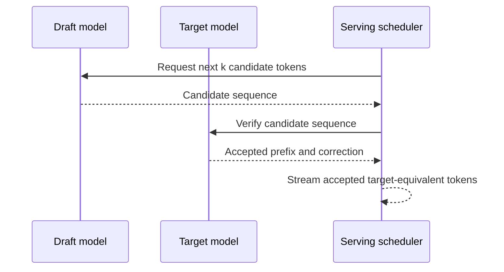
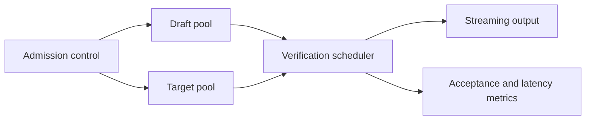
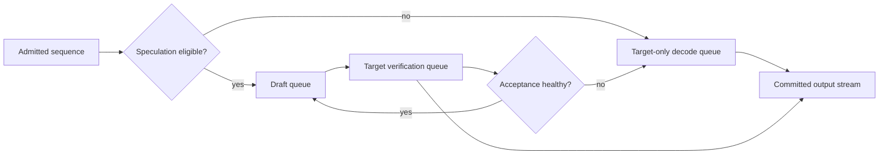

# Speculative decoding

The draft model is an optimization dependency, not an authority. It proposes work that may save serial target-model decode steps, but the target validates every token before emission. This preserves target-model behavior while making performance depend on measurable acceptance rate, draft cost, and verification overhead.

Speculative decoding reduces generation latency by using a cheaper draft model to propose several next tokens and a stronger target model to verify them. The target remains the authority for output. It accepts a prefix of draft tokens that match its own distribution and corrects the first token that does not.

## Mechanism


Credits: Hazem Ali



The output distribution is determined by the target verifier, not by trusting the draft. The gain depends on how often the target accepts draft proposals, draft-model cost, verification batching, and the workload's output length.

Speculation changes scheduling, not the authority of the answer. The draft is useful because it cheaply predicts tokens the target would have selected anyway. The target still applies the decoding rule and final probability judgment before anything reaches the client. This permits a performance experiment without silently substituting a lower-quality model.

An accepted prefix is useful work; a rejected suffix is overhead. The system benefits only when accepted work avoids enough serial target decode steps to pay for draft execution, verification, memory, and coordination. That balance differs by prompt, output length, language, and serving engine.

## Requirements and invariants

1. The target model is authoritative for every emitted token.
2. Draft and target use compatible tokenization and request settings.
3. A lower acceptance rate cannot silently reduce answer quality; it reduces or eliminates speed benefit.
4. Token, memory, and concurrency budgets include both draft and target work.
5. Cancellation stops draft generation and target verification.

## Latency reasoning

Without speculation, a request generates one target token per decode step. With speculation, $k$ draft candidates can be checked by the target in a verification step. Let $a$ be the accepted fraction. The useful accepted tokens per verification depends on $a$ and $k$; high acceptance is required to offset draft work and scheduling overhead.

Do not promise a fixed speedup. Benchmark p50 and p95 TTFT, TPOT, accepted-token rate, draft-token waste, target verification time, and end-to-end cost for representative prompts. A short answer or a poor draft-target pairing can be slower than normal decoding.

For a short answer, setup and one verification round can cost more than the target-only decode steps they replace. For a mismatched draft, the target rejects candidates often and still performs correction work. Enable speculation only for traffic where measured end-to-end latency and quality improve within the capacity budget.

## Serving architecture



Keep the draft and target as separately observable dependencies. A draft outage should fall back to ordinary target decoding if target capacity remains healthy. A target outage cannot safely return draft output as a substitute.

## Workload fit

| Workload | Fit | Reason |
|---|---|---|
| Long predictable code or text generation | evaluate | more decode work can amortize verification |
| Short classification output | usually weak | overhead dominates few output tokens |
| Highly constrained structured output | benchmark carefully | correction and schema validation still required |
| Safety-critical decision | target only unless evaluation proves equivalence | operational complexity may exceed latency benefit |

## Capacity, security, and release

Admission control must reserve target capacity first. Draft capacity is an optimization and must not starve the authoritative model. Version draft and target together with tokenizer, decoding parameters, safety filters, and evaluation set. A change to either can change acceptance and latency.

The inference layer should remain internal, accessible only to the orchestrator and authorized operators, with deployment versions and output validation recorded for every release. [Azure AI workload architecture](https://learn.microsoft.com/azure/well-architected/ai/architecture-pattern)

## Failure and observability

| Signal | Meaning | Action |
|---|---|---|
| Acceptance rate drops | draft no longer predicts target well | disable speculation or investigate versions |
| Target 429 or high latency | authority is saturated | reduce admission; do not use draft-only output |
| Draft error | optimization unavailable | continue standard target decode |
| Verification mismatch spike | incompatibility or decoding change | halt rollout and compare evaluation traces |

Foundry quota limits and usage tiers can affect latency and throttling under sustained or bursty load; monitor actual deployment behavior rather than assuming a model label guarantees performance. [Foundry usage and quotas](https://learn.microsoft.com/azure/foundry/openai/quotas-limits)

## Review checklist

- Is target verification authoritative for every streamed token?
- Which request settings and tokenizer versions must match?
- Has acceptance, latency, cost, and quality been measured by workload class?
- Can the service fall back safely when the draft fails?
- Does target admission remain protected from draft optimization traffic?

## Exercise

Design an experiment comparing normal and speculative decoding for 50-, 300-, and 1,000-token outputs. Define candidate length, acceptance metrics, p95 latency, cost, quality checks, rollback condition, and the fallback when the draft deployment fails.

## How verification preserves target behavior

The draft model proposes candidate tokens because it is cheaper to run. The target model verifies those candidates against its own decoding rule and accepts only the matching prefix. At the first mismatch, the target emits its own correction. The target model is authoritative for every emitted token.

This is not a fallback model. If the target is unavailable, draft output must not be returned as though it were verified. That would be a different model route with separate quality, safety, and governance requirements.

## Worked acceptance example

The draft proposes `the policy applies to remote`. The target accepts `the policy applies` but chooses `only` as the next token instead of `to`. The server emits the accepted prefix and the target correction, then begins the next round. A low acceptance rate wastes draft work and reduces speed benefit; it does not justify changing target output.

## Evaluation and rollback

Compare normal and speculative decoding by prompt length, output length, language, structured-output mode, and tenant tier. Record TTFT, TPOT, acceptance rate, discarded draft tokens, target utilization, schema-valid rate, safety outcome, p95 latency, and cost per completed request. Disable speculation when target p95, quality, or structured-output validity regresses beyond the approved threshold.

## Baseline decoding before speculation

In ordinary autoregressive decoding, the target model produces one probability distribution for the next token, the serving system selects a token, appends it to the sequence, and repeats. Even when a batch contains many requests, each individual sequence advances one dependent step at a time.

The target model frequently moves large weights and attention state to produce one token per active sequence. Speculation tries to obtain more than one accepted output token per expensive target verification step.

Speculation does not eliminate prefill. The target still processes the prompt and owns its attention state. The optimization applies mainly to decode, so workloads dominated by retrieval or prefill may show little end-to-end improvement.

## Draft and target compatibility

The draft path must produce candidate token IDs the target can interpret. Compatibility includes:

- tokenizer vocabulary and special-token semantics;
- chat template and role-token formatting;
- maximum sequence and positional behavior;
- adapter or tenant configuration where it affects token probabilities;
- decoding settings such as temperature, top-p, stop sequences, and penalties; and
- safety and structured-output constraints enforced around generation.

Two models from the same family are not automatically compatible. Verify the exact serving implementation and token mapping. If the tokenizer differs, a text-level proposal can require retokenization and may lose the intended speed or correctness property.

## Greedy verification

For greedy decoding, the target chooses the highest-probability token at each position. Let the draft propose $d_1, d_2, \ldots, d_k$. The target evaluates the candidate positions in a verification pass.

The verifier accepts the longest prefix where:

$$
d_i = \arg\max_x P_T(x \mid prefix, d_1, \ldots, d_{i-1})
$$

At the first mismatch, the target emits its own selected token. If all $k$ draft tokens match, the target can also provide the following target token depending on the algorithm and implementation.

The service must stream only tokens committed by the target verifier. Draft tokens are internal candidates and must not reach the client before verification.

## Sampled verification

Sampling is more complex because the target does not always choose its maximum-probability token. Correct speculative sampling uses an acceptance rule derived from draft and target distributions and samples from a corrected residual distribution after a rejection. A naive rule that accepts only exact sampled matches can change output distribution or erase the performance benefit.

Do not implement sampled speculation from intuition. Use a serving engine whose algorithm is tested for distributional equivalence, and verify it against the target-only baseline with statistical tests. The course does not prescribe one implementation because algorithms and runtime support evolve.

## Acceptance metrics

Define metrics precisely:

| Metric | Definition | Why it matters |
|---|---|---|
| Candidate length | draft tokens proposed per round | controls draft work and target verification size |
| Accepted prefix length | draft tokens committed per round | direct useful work |
| Token acceptance rate | accepted draft tokens / proposed draft tokens | pairing quality |
| Round efficiency | emitted output tokens / target verification rounds | target-step reduction |
| Draft waste | rejected candidate tokens | wasted draft compute |
| Fallback rate | requests served with target-only decode | operational stability |

Report distributions rather than only averages. An 80% average acceptance rate can hide one language or structured-output class with near-zero acceptance.

## Simplified speed model

Let:

- $C_T$ be cost of one target decode step;
- $C_D(k)$ be cost of drafting $k$ tokens;
- $C_V(k)$ be cost of target verification for $k$ candidates; and
- $E[A_k]$ be expected output tokens emitted in a round.

A simplified speculative cost per emitted token is:

$$
C_{spec/token} \approx \frac{C_D(k) + C_V(k)}{E[A_k]}
$$

The target-only baseline is approximately $C_T$ per token. Speculation helps only when the ratio is lower after scheduler overhead, communication, and memory effects are included.

This equation explains why a very large $k$ can hurt. The draft proposes more tokens, target verification gets larger, and low acceptance discards more work. Candidate length should be tuned by workload and may be adapted from recent acceptance history.

## Worked scenarios

### High-acceptance sequence

The draft proposes five tokens. The target accepts four and corrects the fifth. The round emits five target-authorized tokens with one verification operation. If draft and verification overhead are small enough, the target performs fewer sequential rounds.

### Low-acceptance sequence

The draft proposes five tokens but the first token mismatches. The target emits one correction. Drafting four later candidates was wasted because they depended on a rejected prefix. Repeated behavior of this kind makes target-only decode preferable.

### Short output

A classification emits three tokens. Draft startup, scheduling, and verification can exceed the saved target work. Disable speculation for this request class unless measurements prove otherwise.

## Serving scheduler integration

Speculation introduces at least two forms of work:

1. draft generation for candidate sequences; and
2. target verification that can process more positions than ordinary decode.

The scheduler decides whether draft and target share hardware, use separate pools, or use different execution streams. Separate pools isolate draft failures but add communication and capacity planning. Shared hardware avoids network transfer but competes with target work.



Reserve target capacity before draft capacity. If target verification is saturated, stop admitting speculative work and protect ordinary decode. A draft pool must not generate candidates faster than the target can verify them.

## Eligibility policy

```yaml
speculationPolicy:
    enabledRequestClasses: ["long-form", "code-completion"]
    minimumExpectedOutputTokens: 128
    maximumCandidateTokens: 6
    minimumRollingAcceptanceRate: 0.55
    fallbackOnDraftFailure: true
    targetQueueHighWatermark: 0.75
```

These values are illustrative assumptions. The policy version belongs in request traces. Eligibility can depend on model pair, language, prompt class, output format, tenant tier, target queue health, and draft availability.

Do not dynamically disable speculation based on user content categories unless the classification itself is authorized, tested, and observable. A simpler request-class policy is easier to explain and operate.

## KV cache implications

The target owns the authoritative sequence state. The draft also needs context state to produce candidates. Depending on the implementation, draft and target caches can increase memory pressure even while target rounds decrease.

Account for:

- target KV cache for prompt and committed output;
- draft KV cache for prompt and speculative candidates;
- temporary target verification tensors;
- candidate token buffers; and
- rollback or correction state after rejection.

Speculation can improve decode latency while lowering maximum concurrency because of extra memory. Measure both. Lesson 23's admission and block-accounting rules still apply.

## Streaming semantics

The server must not stream unverified draft tokens and later retract them. Retraction complicates clients, audit, safety validation, and structured output. Buffer one speculative round internally, commit the target-approved prefix, then stream committed tokens.

This can make token delivery burstier: several tokens arrive after each verification instead of one after every target step. Measure inter-token jitter as well as average TPOT. A user interface may perceive pauses and bursts differently from steady streaming.

## Structured output and stop conditions

Tool calls and JSON schemas can constrain valid next tokens. The draft and target must use compatible constraints. Stop sequences, end-of-sequence tokens, maximum output, and cancellation must terminate both paths consistently.

When the target accepts a stop token, cancel remaining draft work and finalize the stream. When the client cancels, stop drafting and verification, release both caches, reconcile usage, and record the last committed target token.

## Safety controls

Run safety and output validation on committed target output. A draft proposal can contain unsafe text that is rejected before streaming; avoid logging it broadly. Draft buffers and traces should follow the same sensitive-data controls as model prompts and outputs.

If safety classifiers inspect streaming chunks, define chunk boundaries after target commitment. Do not classify and stream draft candidates before verification.

## Deployment artifact tuple

```json
{
    "targetModel":"target-x:8",
    "draftModel":"draft-x:3",
    "targetTokenizer":"tok-x:5",
    "draftTokenizer":"tok-x:5",
    "servingRuntime":"engine:2.4",
    "speculationPolicy":"spec-policy:6",
    "safetyPolicy":"safety:11",
    "evaluationSet":"generation-eval:2026-08"
}
```

Promote and roll back this tuple together. Changing the target without reevaluating the draft can collapse acceptance. Changing tokenizer or runtime can break compatibility. Changing the policy can alter latency and cost even when model files remain unchanged.

## Experiment matrix

Use representative combinations:

| Dimension | Classes |
|---|---|
| Prompt length | short, medium, maximum policy |
| Output length | 50, 300, 1,000 tokens |
| Language | top production languages plus low-volume cases |
| Output | prose, code, JSON, tool call |
| Sampling | deterministic and approved sampled settings |
| Load | idle, normal, peak, overload |
| Cancellation | before draft, during verify, after stream |

Run the same inputs on target-only and speculative paths. Compare output distribution as appropriate, exact deterministic output where applicable, schema validity, safety outcomes, latency percentiles, cost, memory, and target throughput.

## Statistical interpretation

Avoid conclusions from a handful of prompts. Report confidence intervals or repeated-run distributions for latency and acceptance. Separate warm and cold deployment results. Exclude neither failures nor fallbacks from aggregate metrics; otherwise the optimization looks faster by ignoring requests it could not serve.

For sampled output, compare task metrics and distributional properties rather than exact strings. For deterministic settings, any output difference requires investigation because the target-only and correctly verified speculative paths should agree under the same decoding rule.

## Observability schema

```json
{
    "requestId":"req-01J",
    "targetDeployment":"target-x-8",
    "draftDeployment":"draft-x-3",
    "candidateTokens":420,
    "acceptedDraftTokens":315,
    "verificationRounds":94,
    "fallbackToTargetOnly":false,
    "ttftMs":1180,
    "tpotMs":19,
    "outputTokens":402,
    "terminalState":"completed"
}
```

Create dashboards for acceptance by request class, target queue, draft queue, verification latency, fallback rate, memory use, p95 TPOT, and cost per completed output token. Alert when acceptance collapses after a deployment change or target latency regresses despite stable load.

## Failure matrix

| Failure | Containment | User behavior | Recovery |
|---|---|---|---|
| Draft unavailable | bypass speculation | target-only output | restore draft independently |
| Target unavailable | stop generation | unavailable or compatible routed target | never stream draft-only output |
| Tokenizer mismatch | reject deployment tuple | no live traffic | rebuild compatible pair |
| Acceptance collapse | disable policy for class | target-only decode | inspect model or workload shift |
| Verification timeout | stop or use target-only from committed state if supported | explicit latency or failure result | protect target queue |
| Client cancellation | stop both paths | cancelled terminal event | release both caches |

## Rollout sequence

1. Register target, draft, tokenizer, runtime, and policy versions.
2. Run compatibility and deterministic equivalence tests.
3. Run offline quality, safety, and performance evaluation.
4. Deploy with speculation disabled for live users.
5. Shadow or canary an approved cohort.
6. Compare target-only and speculative metrics under equal workload.
7. Promote request classes independently.
8. Keep an immediate switch to target-only decode.

If Azure Machine Learning managed online endpoints are used for self-hosted model components, blue-green and mirrored-traffic mechanisms can support controlled deployment testing. The serving application still owns speculative pairing and verification correctness. [Azure ML safe rollout](https://learn.microsoft.com/azure/machine-learning/how-to-safely-rollout-online-endpoints)

## Security and isolation

Keep draft and target deployments internal. Use workload identity for invocation. Restrict deployment changes to the release pipeline. Verify artifact checksums and container provenance. Isolate draft capacity so a compromised or overloaded draft does not starve target-only service.

Do not expose draft identity, acceptance details, or hidden candidate text to clients unless the product has a clear need. These are implementation details and may reveal model behavior or sensitive prompt-derived content.

## Cost model

Include both paths:

$$
	ext{cost/request} = \text{draft compute} + \text{target verification compute} + \text{serving overhead}
$$

Lower latency does not guarantee lower cost. A poor pair can run two models and discard most draft work. Report cost per completed request and per accepted output token, not draft throughput alone.

## Operational drill

Force the draft deployment offline and verify target-only continuity. Deploy an intentionally incompatible tokenizer in a test environment and verify release gates block it. Shift workload to a low-acceptance language and verify automatic class-level disablement. Cancel during verification and confirm neither path leaks cache reservations. Finally, roll back the full artifact tuple and compare traces.

## Final design review

- What exact algorithm proves target-equivalent output under each decoding mode?
- Which tokenizer, template, adapter, and decoding settings must match?
- What request classes have measured positive benefit?
- Is target capacity reserved before draft work begins?
- Are unverified tokens prevented from reaching streams, logs, and tools?
- Does the service measure acceptance, memory, jitter, fallback, quality, and cost together?
- Can speculation be disabled immediately without changing the public API?

## Extended exercise

Select a hypothetical draft-target pair for code completion. Design deterministic and sampled verification tests, candidate-length experiments, KV memory accounting, scheduler queues, eligibility rules, dashboards, and rollback. Calculate the expected cost per emitted token for three acceptance rates and explain at which rate target-only decoding becomes preferable.
