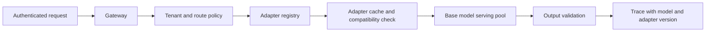
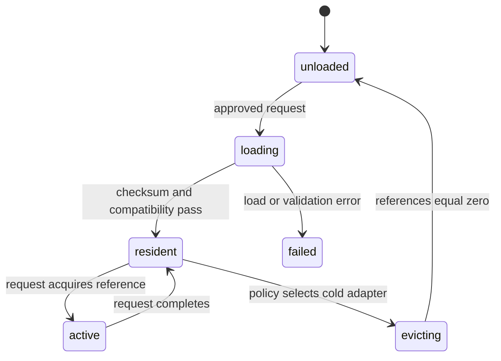

# Multi-tenant adapters and LoRA

A multi-tenant model service must decide whether tenants share one base model, receive separate fine-tuned models, or attach small tenant-specific adapters at inference time. This is a capacity, isolation, rollout, and evaluation decision. It is not only a way to reduce GPU cost.

## What an adapter is

A base model contains the common learned parameters. A low-rank adaptation (LoRA) adapter stores a small learned update to selected model weights. At serving time, an engine can apply the adapter for a request or loaded tenant group rather than loading a complete independent model for every tenant.

This can reduce duplicated model memory, but it introduces an adapter registry, compatibility rules, cache pressure, and new failure modes. A tenant adapter changes behavior, so it is a versioned inference artifact with the same evaluation and rollback requirements as a model release.

The key distinction is between behavioral specialization and data isolation. An adapter can teach a base model a domain style or task pattern, but it cannot prove a request is authorized to see a tenant record. Retrieval filters, tool authorization, identity, and network boundaries still enforce those guarantees. Treating an adapter as a security boundary creates an opaque access-control mechanism.

Serving also creates a shared-resource problem. Many tenants may share base weights while competing for adapter memory and KV cache. A design that saves base-model memory can still fail its latency objective if cold adapter loading blocks the accelerator resources needed by active streams.

## Requirements and invariants

1. A request uses only the adapter version approved for its tenant and route.
2. An adapter cannot change tenant data access, tool authority, or system policy.
3. A missing adapter never silently selects another tenant's adapter.
4. Adapter load or eviction cannot exhaust base-model memory needed by other tenants.
5. Every output can be traced to base model, adapter, prompt, retrieval, and safety versions.

## Serving topology


Credits: Hazem Ali



The gateway resolves tenant identity before adapter lookup. The registry returns a signed adapter ID, base-model compatibility range, evaluation status, and rollout state. The serving engine loads only approved adapters. The output validator still applies safety and schema controls because an adapter does not inherit correctness from the base model.

The registry is the policy bridge between tenant identity and model behavior. It must resolve one approved artifact for the authenticated tenant, route, and rollout cohort, then bind that result to the request trace. A display name, caller-provided adapter ID, or cache hit alone is not enough evidence. Explicit resolution prevents accidental cross-tenant selection and makes rollback a configuration decision instead of emergency artifact deletion.

## Adapter record

```json
{
  "adapterId":"tenant-42-support-v7",
  "tenantId":"tenant-42",
  "baseModel":"model-family-x",
  "baseModelVersion":"2026-08",
  "format":"lora",
  "rank":16,
  "evaluationSet":"support-tenant-42-v3",
  "rollout":"canary",
  "state":"approved"
}
```

Do not key adapters by display name. Use a stable tenant ID and an explicit version. Reject a request when the adapter's base model, tokenizer, context policy, or serving format is incompatible.

## Capacity and cache policy

Adapter capacity is not free. The server holds base weights, KV cache for active requests, adapter weights or merged representations, scheduler overhead, and safety margin. Plan adapter loading separately from context memory.

$$
\text{adapter cache pressure} = \sum \text{loaded adapter bytes} + \text{base model bytes} + \text{KV cache bytes}
$$

Choose an explicit cache policy. Keep frequently used adapters resident, load cold adapters asynchronously or reject until ready, and evict only inactive adapters. Never evict an adapter backing an active stream. Track hit rate, load latency, eviction, memory headroom, tenant queue age, and adapter-version errors.

## Isolation and security

An adapter must not become a data boundary. Tenant data isolation still relies on user authorization, retrieval filters, tool policy, network controls, and workload identities. Restrict registry write access to the release pipeline. Serving identities read approved adapter artifacts only. Store adapter packages with checksums and immutable version paths.

Azure AI workload guidance separates inference from knowledge and tools layers because each has distinct security and lifecycle responsibilities. [Azure AI workload architecture](https://learn.microsoft.com/azure/well-architected/ai/architecture-pattern)

## Rollout and rollback

1. Register adapter artifact, checksum, base-model compatibility, and evaluation set.
2. Run offline tests against base and candidate adapter behavior.
3. Load candidate in an isolated serving deployment with no customer traffic.
4. Send a small authorized canary cohort and compare quality, latency, memory, and safety metrics.
5. Promote by tenant route only after thresholds pass.
6. Roll back by selecting the previous adapter route; retain traces and artifacts.

Managed online endpoints support multiple deployments, traffic splits, and mirrored traffic for safe rollout. Use these mechanisms where the serving platform fits the workload; never expose a candidate adapter to all tenants without evaluation. [Azure ML safe rollout](https://learn.microsoft.com/azure/machine-learning/how-to-safely-rollout-online-endpoints)

## Failure modes

| Failure | Safe action |
|---|---|
| Adapter missing | fail request or route to approved base-only behavior if product policy permits |
| Incompatible base model | reject before load |
| Adapter load latency spike | queue with deadline or reject; do not block all tenants |
| Cache exhaustion | preserve active requests; shed cold admissions |
| Quality regression | disable route and restore approved version |
| Cross-tenant mapping defect | halt adapter routing and investigate audit records |

## Review checklist

- What tenant, base-model, and adapter versions are bound to every request?
- How does the engine prevent a fallback from using the wrong adapter?
- What is the measured adapter load and eviction effect on p95 latency?
- Which evaluations prove tenant quality and safety before rollout?
- Can the route revert without deleting artifacts or losing traceability?

## Exercise

Design adapter routing for 500 tenants, 20 hot tenants, and a shared base model. Define registry schema, adapter cache tiers, memory headroom, canary policy, tenant isolation tests, and rollback conditions.

## Why low-rank adaptation is smaller

A dense model layer contains a weight matrix $W$. Full fine-tuning updates every selected value in $W$. LoRA freezes the base matrix and learns a low-rank update represented by two smaller matrices:

$$
W' = W + \Delta W
$$

$$
\Delta W = B A
$$

If $W$ has shape $d_{out} \times d_{in}$, matrix $A$ can have shape $r \times d_{in}$ and $B$ can have shape $d_{out} \times r$, where rank $r$ is much smaller than $d_{in}$ and $d_{out}$. The adapter stores the smaller learned matrices instead of a complete copy of $W$.

The memory saving depends on which layers receive adapters, selected rank, storage precision, scaling metadata, and serving representation. Do not estimate adapter size only from the word "LoRA." Inspect the artifact.

## What an adapter changes

An adapter modifies model behavior for the layers it targets. It can improve a domain task, style, terminology, or instruction following. It can also degrade general reasoning, safety refusal, structured output, or another language. An adapter is not a database of tenant facts, and it should not be used to encode frequently changing private knowledge that belongs in a governed retrieval system.

Use retrieval for current authoritative data. Use an adapter when evaluation shows that changing model behavior is the right mechanism. This distinction keeps deletion, access control, and source freshness outside the opaque model artifact.

## Training-to-serving lineage

The serving registry must link the adapter to its production evidence:

```json
{
  "adapterId": "tenant-42-support-v7",
  "artifactUri": "models/tenant-42/support/v7/adapter.safetensors",
  "checksum": "sha256:...",
  "baseModelChecksum": "sha256:...",
  "tokenizerVersion": "tok-x:5",
  "targetModules": ["q_proj", "v_proj"],
  "rank": 16,
  "alpha": 32,
  "trainingDatasetVersion": "tenant-42-support-2026-07",
  "evaluationReport": "eval/tenant-42/support-v7.json",
  "approval": "approved-for-canary"
}
```

The training dataset must have ownership, consent, retention, and deletion rules. Record preprocessing, base model, random seed where relevant, hyperparameters, code, environment, and evaluation output. Without this lineage, an operator cannot reproduce or investigate behavior.

## Adapter compatibility gate

Before load, validate:

1. Base model identity and checksum match.
2. Tokenizer and chat template are approved for the route.
3. Target module names and tensor shapes exist.
4. Adapter rank and runtime format are supported.
5. Artifact checksum and signature are valid.
6. Tenant ID in route, registry, and request agree.
7. Adapter state is approved for the requested environment.

Reject the load on any mismatch. Do not try to coerce tensor shapes or attach an adapter to a "similar" base model.

## Dynamic versus merged serving

Two broad serving approaches exist.

| Approach | Mechanism | Benefit | Cost |
|---|---|---|---|
| Dynamic adapter | runtime applies adapter per request | many adapters share one base pool | routing, cache, and kernel complexity |
| Merged model | adapter update is merged into a model artifact | simpler dedicated serving path | complete artifact and deployment per adapter |

Dynamic serving fits many low-volume tenants when the runtime supports efficient adapter switching. Merged serving fits high-volume or strongly isolated tenants that justify dedicated capacity. A hybrid design can keep hot strategic tenants on dedicated merged deployments and cold tenants on a shared dynamic pool.

## Tenant-routing interface

The public client should not choose an arbitrary adapter ID. The trusted gateway derives the tenant from validated identity and resolves the allowed adapter route.

```http
POST /v1/tenant-assistant/responses HTTP/1.1
Authorization: Bearer <user-token>
Content-Type: application/json

{"question":"...","maxOutputTokens":600}
```

Internally, the gateway sends a signed route context:

```json
{
  "tenantId":"tenant-42",
  "baseDeployment":"base-x-v8",
  "adapterId":"tenant-42-support-v7",
  "routePolicy":"tenant-adapter-policy-v4",
  "requestId":"req-01J"
}
```

Ignore or reject client-supplied adapter headers unless a trusted administrative testing path explicitly permits them.

## Adapter cache lifecycle

Adapter serving has states:



Use reference counts or equivalent ownership so an adapter is not evicted while an active request uses it. Failed loads need a cooldown to prevent every waiting request from retrying the same corrupt artifact.

## Hot, warm, and cold tiers

| Tier | State | Request behavior |
|---|---|---|
| Hot | adapter resident on serving workers | immediate admission if other budgets pass |
| Warm | artifact local or fast cache, not active | bounded load before admission |
| Cold | artifact in registry storage | asynchronous warm-up or explicit delay |

Promote and demote from measured usage, not a permanent manual list. Keep a tenant's minimum service objective in mind: eviction may be acceptable for a monthly user but not for a latency-sensitive production integration.

## Capacity worksheet

Assume:

- base model and runtime consume 38 GiB;
- usable accelerator memory is 80 GiB;
- 22 GiB is reserved for KV cache and temporary buffers;
- safety headroom is 8 GiB; and
- each resident adapter consumes 180 MiB in the measured runtime representation.

Remaining adapter capacity is:

$$
80 - 38 - 22 - 8 = 12\ GiB
$$

Approximate maximum resident adapters is:

$$
\frac{12 \times 1024}{180} \approx 68
$$

Do not configure 68 immediately. Allocator fragmentation, per-adapter metadata, load spikes, and runtime workspaces require measurement. A conservative initial cap might be lower and raised after load testing.

## Batch compatibility

Serving engines differ in whether one batch can contain multiple adapters efficiently. If requests with different adapters cannot share kernels or batch operations, tenant diversity reduces throughput. Measure:

- active adapters per batch;
- tokens per second as adapter diversity rises;
- adapter-switch overhead;
- p95 TTFT on cache hits and misses;
- KV cache pressure by tenant; and
- queue age by adapter tier.

An architecture that fits hundreds of adapter files may still fail the latency objective when every request uses a different adapter.

## Noisy-neighbor controls

Apply independent limits to:

- requests and tokens per tenant;
- active streams per tenant;
- resident adapter memory per pool;
- concurrent cold loads;
- queue age by service tier; and
- total distinct adapters active in a scheduling interval.

A tenant that cycles through many adapter versions can cause cache thrashing. Restrict production routes to one approved version plus a bounded canary version. Administrative testing uses a separate pool.

## Isolation threat model

| Threat | Example | Control |
|---|---|---|
| Route confusion | tenant A receives tenant B adapter | derive tenant from token and validate registry tuple |
| Artifact substitution | storage object replaced | immutable URI, checksum, signature |
| Training-data leakage | adapter memorizes private samples | data minimization and extraction/memorization evaluation |
| Cache timing leak | load latency reveals another tenant's use | tenant-scoped policy or timing-risk assessment |
| Broad registry role | serving identity can overwrite adapters | read-only serving identity, pipeline-only writes |
| Cross-tenant batch defect | adapter state applied to wrong sequence | runtime isolation tests and request-level tracing |

The adapter is derived from tenant data and may itself be sensitive intellectual property. Encrypt at rest and in transit, restrict export, and audit artifact access.

## Knowledge, adapter, and prompt boundaries

Use each mechanism for its actual responsibility:

| Mechanism | Appropriate responsibility |
|---|---|
| Retrieval | current facts, documents, ACL-filtered evidence |
| Adapter | learned behavioral specialization |
| System prompt | explicit instructions and policy constraints |
| Tool | authorized action or live data operation |

Do not train an adapter to replace revocable document access. Do not put secrets into a system prompt. Do not grant tools based on adapter identity alone.

## Evaluation design

Evaluate the base route and adapter route on:

- target tenant task success;
- general regression outside the specialization;
- refusal and safety behavior;
- structured output and tool selection;
- multilingual and long-context cases;
- memorization and extraction probes;
- retrieval citation correctness; and
- latency on adapter hit, warm load, and cold load.

Include negative cases where the adapter should not change the answer. Compare against a prompt-only and retrieval-only baseline to prove the adapter adds value.

## Canary by tenant, not random global traffic

A tenant-specific adapter should canary only within the authorized tenant. Route a controlled percentage of that tenant's eligible traffic or an explicit cohort. Global random canary can expose other tenants to an incompatible adapter.

Azure Machine Learning online endpoints support multiple deployments, direct deployment invocation, mirrored traffic, and traffic allocation for safe rollout of applicable self-hosted deployments. Mirror data only when privacy policy allows the candidate deployment to process it. [Azure ML safe rollout](https://learn.microsoft.com/azure/machine-learning/how-to-safely-rollout-online-endpoints)

## Rollout record

```json
{
  "rolloutId":"rollout-77",
  "tenantId":"tenant-42",
  "candidateAdapter":"support-v7",
  "baselineAdapter":"support-v6",
  "trafficPercent":5,
  "startTime":"2026-08-12T10:00:00Z",
  "qualityGate":0.92,
  "p95TtftGateMs":2200,
  "rollbackOnCrossTenantError":true
}
```

Any cross-tenant mismatch is an immediate rollback and security incident. Quality and latency gates can use bounded observation windows. Keep the baseline adapter resident during canary so rollback does not require a cold load.

## Deployment artifacts

Version these together:

- base model and checksum;
- adapter and checksum;
- tokenizer and chat template;
- serving runtime and kernels;
- adapter cache policy;
- prompt and retrieval versions;
- safety policy; and
- evaluation report.

Azure Machine Learning online endpoints distinguish a stable endpoint from underlying deployments and support model, code, environment, instance, monitoring, identity, and network configuration. This separation supports controlled rollout but does not define adapter compatibility for the serving engine. [Azure ML online endpoint concepts](https://learn.microsoft.com/azure/machine-learning/concept-endpoints-online)

## Observability schema

```json
{
  "requestId":"req-01J",
  "tenantPseudonym":"t-42",
  "baseModel":"base-x-v8",
  "adapterId":"support-v7",
  "adapterCache":"hit",
  "adapterLoadMs":0,
  "activeAdapterCount":21,
  "ttftMs":1430,
  "tpotMs":28,
  "inputTokens":3200,
  "outputTokens":410,
  "outcome":"completed"
}
```

Dashboards need cache hit rate, cold-load latency, failed loads, resident bytes, adapter evictions, active references, per-tenant queue age, base-model saturation, KV occupancy, and quality outcome by adapter version.

High-cardinality tenant IDs can make metrics expensive and expose customer identity. Use protected traces or pseudonymous dimensions and aggregate ordinary dashboards by service tier and adapter state.

## Failure and recovery runbook

| Symptom | Containment | Recovery evidence |
|---|---|---|
| Checksum failure | quarantine artifact and block version | registry and storage audit |
| Cross-tenant adapter mapping | halt dynamic routing pool | request traces and route policy diff |
| Repeated cold-load timeout | stop retries with cooldown | artifact availability and load logs |
| Cache thrashing | cap distinct active adapters | hit rate, eviction, and tenant usage |
| Base upgrade breaks adapters | retain prior base pool | compatibility evaluation by adapter |
| Adapter quality regression | route tenant to prior approved version | canary evaluation and user outcomes |

For a base-model upgrade, do not assume all adapters migrate together. Build a compatibility matrix and canary each high-value adapter. Run the prior and candidate base pools side by side until migration and rollback objectives are met.

## Disaster recovery

The registry and artifact store are authoritative for adapter deployment state. A worker's local adapter cache is disposable. Recovery recreates the base serving pool, verifies registry and artifact access, warms the minimum hot set, runs synthetic tenant probes, and only then accepts traffic.

Document recovery time for base-model load and hot-adapter warm-up. A regional failover that starts with hundreds of cold adapters may meet infrastructure availability while failing user latency objectives.

## Operational drill

1. Route a test request with a forged adapter header and verify rejection.
2. Corrupt a candidate checksum and verify quarantine before load.
3. Fill the adapter cache, then send cold requests from many tenants and verify bounded load concurrency.
4. Cancel an active stream during adapter use and verify reference release.
5. Upgrade the base model with one incompatible adapter and verify only that route remains on the prior pool.
6. Trigger canary quality regression and verify immediate tenant-specific rollback.
7. Recreate an empty serving worker and measure hot-set warm-up.

## Configuration example

```yaml
adapterServing:
  baseModel: base-x-v8
  maxResidentAdapters: 48
  maxConcurrentLoads: 2
  loadTimeoutSeconds: 20
  failedLoadCooldownSeconds: 120
  hotSetRefreshMinutes: 5
  tenantMaxActiveStreams: 8
  allowBaseOnlyFallback: false
  requireArtifactChecksum: true
```

The values are workload-specific assumptions. Version this policy and attach it to every route trace.

## Cost reasoning

Compare dynamic adapters with dedicated deployments:

$$
	ext{dynamic cost} = \text{shared base capacity} + \text{adapter storage} + \text{load overhead}
$$

$$
	ext{dedicated cost} = \sum \text{tenant deployment capacity}
$$

Dynamic serving usually improves utilization for sparse tenants, but high cache miss rates and incompatible batching can erase the gain. Calculate cost per successful tenant request, including cold-load delay and wasted reserved capacity.

## Final design review

- Is an adapter justified by measured behavior improvement over retrieval and prompting?
- Can every route prove tenant, base model, adapter, tokenizer, and policy compatibility?
- Is adapter memory separated from KV and runtime headroom?
- Does cache eviction respect active references and service tiers?
- Are cross-tenant mapping and batch-isolation tests release blockers?
- Can a base upgrade migrate adapters independently?
- Does regional recovery include hot-adapter warm-up?
- Can operators roll back one tenant without affecting others?

## Extended exercise

Design a shared LoRA platform for 2,000 tenants. Fifty tenants are active every minute, 300 daily, and the remainder rarely. Define hot, warm, and cold adapter tiers; registry schema; checksum and signing; base compatibility matrix; memory budget; batch-diversity benchmark; per-tenant quotas; canary strategy; and regional recovery. Compare cost and isolation with dedicated merged deployments for the top ten tenants.
