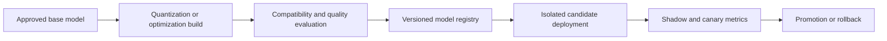

# Quantization and model optimization

Quantization represents model values with fewer bits than the original precision. It can reduce memory use, data movement, and sometimes latency, allowing a model to fit on less expensive hardware. It can also change numerical behavior, output quality, safety behavior, and supported kernels. Quantization is an evaluated deployment change, not a formatting conversion.

## First principles

A floating-point weight uses a representation with a sign, exponent, and mantissa. Lower precision reduces the number of representable values. A quantizer maps a range of original values to a smaller set of values, often using scale factors and zero points. The runtime then uses kernels compatible with the selected format and hardware.

| Change | Potential benefit | Risk |
|---|---|---|
| Lower weight precision | less model memory | accuracy loss or unsupported kernel |
| Lower activation precision | less compute and memory bandwidth | numerical instability on hard inputs |
| Quantized KV cache | more active context | degraded long-context quality |
| Pruning or distillation | smaller or faster model | behavior changes requiring new evaluation |

## Decision architecture


Credits: Hazem Ali



The original model, calibration set, quantization method, runtime, kernel version, hardware target, and evaluation results form one deployment artifact. A file named `model-int4` without that lineage is not reproducible.

Reducing bit width changes where the system spends error. A small rounding difference in one weight may be harmless, while clipping an outlier activation can change a difficult answer, a schema boundary, or a safety refusal. The effect emerges from many operations across the model, so a successful file conversion cannot establish behavioral equivalence.

Quantization also changes the physical execution path. If the selected accelerator lacks an efficient kernel, the runtime may dequantize values repeatedly or select a slower fallback. The artifact can be smaller yet increase latency and cost. Quality evaluation and hardware benchmarking are independent gates.

## What to measure

Do not declare an optimization successful because it loads. Compare original and candidate by task:

```text
quality: grounded answer accuracy, retrieval citation correctness, structured-output validity
safety: refusal behavior, content-filter outcomes, prompt-injection resilience
performance: TTFT, TPOT, throughput, memory use, active sequences
operations: startup time, error rate, kernel failures, rollback time
cost: accelerator hours per successful request
```

Use difficult prompts, long contexts, multilingual requests, tool schemas, and no-answer cases. Small average-quality changes can conceal unacceptable regressions in a regulated or high-value class.

Evaluation must retain slices that make the deployment valuable or risky. A global average can conceal failure on long-context requests, uncommon languages, strict JSON output, or safety-sensitive prompts. Compare the candidate with the original on the same cases, preserve row-level output and version lineage, and make a failed critical slice a release decision rather than a number averaged away.

## Hardware compatibility

A precision format is useful only when the selected accelerator and serving runtime provide efficient supported kernels. A smaller artifact can be slower if conversion, dequantization, or unsupported operations dominate execution. Benchmark the exact model, sequence distribution, hardware, driver, and runtime version intended for production.

For self-hosted models, Azure Machine Learning managed online endpoints separate endpoint interface from deployments and support deployment-level monitoring, scaling, managed identity, private networking, and controlled traffic rollout. [Azure ML online endpoints](https://learn.microsoft.com/azure/machine-learning/concept-endpoints-online)

## Safe rollout

1. Preserve the original registered model and environment.
2. Build a candidate with checksums, calibration lineage, and target hardware metadata.
3. Run offline evaluation and load test before deployment.
4. Deploy candidate with zero live traffic and invoke it directly.
5. Mirror or canary traffic while measuring quality and latency.
6. Promote only if error, quality, safety, and cost thresholds pass.
7. Keep the previous deployment routable for rollback.

Azure ML supports blue-green traffic allocation and mirrored traffic for managed online endpoints, allowing a candidate to receive production-like traffic without changing client responses during shadow testing. [Azure ML safe rollout](https://learn.microsoft.com/azure/machine-learning/how-to-safely-rollout-online-endpoints)

## Memory reasoning

A simplified weight estimate is:

$$
\text{weight bytes} = \text{parameter count} \times \text{bytes per parameter}
$$

A 7-billion-parameter model at 16 bits has roughly 14 GB of raw weights before runtime overhead. At 4 bits it has roughly 3.5 GB of raw encoded weights, but scales, metadata, activations, KV cache, and serving overhead remain. This estimate decides whether a model might fit; a benchmark decides whether it serves well.

## Security and operations

Use immutable model and environment versions. Restrict model-registry writes, scan container images, authenticate deployment identities, and keep inference endpoints internal where possible. Record model checksum, quantization configuration, hardware, runtime, prompt version, and evaluation report with each release.

Azure ML managed endpoints can use Microsoft Entra authentication, managed identity, network isolation, Azure Monitor, and deployment-level traffic controls. These platform controls do not replace model-specific evaluation or application authorization. [Managed endpoint capabilities](https://learn.microsoft.com/azure/machine-learning/concept-endpoints-online)

## Failure modes

| Failure | Response |
|---|---|
| Kernel unsupported | reject candidate before traffic |
| Memory allocation failure | reduce batch or context policy; do not silently swap model |
| Quality regression | rollback route to prior approved deployment |
| Candidate error spike | stop canary and inspect deployment traces |
| Artifact checksum mismatch | halt deployment and investigate supply chain |

## Review checklist

- Which precision changes weights, activations, or KV cache?
- Which hardware and runtime kernels are verified for the exact artifact?
- What quality, safety, latency, memory, and cost thresholds gate promotion?
- Can a user-visible request be tied to the exact optimized artifact and environment?
- Is rollback a route change to a retained approved deployment?

## Exercise

Evaluate a 16-bit and 4-bit deployment for a support assistant. Define the calibration or test corpus, task and safety metrics, p95 latency target, memory limit, canary percentage, rollback threshold, and artifact metadata required for audit.

## Numeric representation and error

Quantization maps a high-precision value $x$ into an integer $q$ using a scale $s$ and zero point $z$:

$$
q = \operatorname{round}\left(\frac{x}{s}\right) + z
$$

The runtime reconstructs an approximation:

$$
\hat{x} = s(q-z)
$$

The difference $x-\hat{x}$ is quantization error. Values outside the represented range are clipped, which can create much larger error than ordinary rounding. Calibration and range selection decide where precision is spent.

ONNX Runtime documents the equivalent affine relation as `val_fp32 = scale * (val_quantized - zero_point)` for 8-bit linear quantization. [ONNX Runtime quantization overview](https://onnxruntime.ai/docs/performance/model-optimizations/quantization.html)

## Symmetric and asymmetric ranges

Symmetric quantization centers the represented range around zero. It often uses a zero point of zero and a scale derived from the largest absolute magnitude. This simplifies some kernels and is common for weights whose distributions are approximately balanced.

Asymmetric quantization uses both observed minimum and maximum values and a nonzero zero point. It can represent a shifted activation distribution more efficiently, but kernel support and overhead differ.

| Choice | Potential fit | Risk |
|---|---|---|
| Symmetric per-tensor | simple weight quantization | outliers set scale for entire tensor |
| Asymmetric per-tensor | shifted activation ranges | extra zero-point handling |
| Per-channel weight | channels have different ranges | more scales and kernel requirements |
| Block-wise weight | large matrix with local range variation | block metadata and runtime compatibility |

## Granularity matters

Per-tensor quantization uses one scale for a whole tensor. A single outlier can force a broad range and waste most integer levels on values that occur rarely. Per-channel or block-wise quantization assigns separate parameters to smaller groups, often preserving quality at the cost of metadata and more specialized kernels.

Do not assume more granular is always faster. The accelerator must load and apply additional scales. Benchmark the exact operator and runtime.

## Weights, activations, and KV cache are different

Weight-only quantization reduces persistent model weight memory and weight bandwidth. Activations may remain at higher precision. Weight-and-activation quantization can reduce more compute and memory traffic, but activation ranges depend on inputs and are often harder to calibrate.

KV cache quantization affects the attention state of active sequences. It can increase context concurrency, but error accumulates across long contexts and decode steps. Evaluate long-context retrieval, instruction retention, and generation quality separately from short prompts.

| Target | Lifetime | Primary value | Evaluation emphasis |
|---|---|---|---|
| Weights | deployment lifetime | model footprint and bandwidth | broad task quality |
| Activations | one forward pass | kernel throughput and memory | calibration coverage and outliers |
| KV cache | request lifetime | active contexts and decode memory | long-context and generation stability |

## Post-training quantization

Post-training quantization (PTQ) transforms a trained model without retraining its weights. It is operationally attractive because it begins from an approved model, but quality depends on the chosen method and calibration data.

### Dynamic quantization

Dynamic quantization computes some activation quantization parameters at runtime for each input or invocation. It can adapt to changing ranges and preserve quality, but adds runtime parameter-computation overhead.

### Static quantization

Static quantization runs representative calibration data in advance, records activation ranges, and stores quantization parameters with the model. It can reduce runtime overhead, but a poor calibration set creates poor ranges for unseen production inputs.

ONNX Runtime distinguishes dynamic and static quantization by whether activation scale and zero point are computed online or offline from calibration data. It supports calibration approaches including MinMax, Entropy, and Percentile for static quantization. [ONNX Runtime quantization methods](https://onnxruntime.ai/docs/performance/model-optimizations/quantization.html)

## Quantization-aware training

Quantization-aware training simulates low-precision effects during training or fine-tuning so the model can adapt its weights. It can recover quality when PTQ fails, but reopens the training-data, lineage, compute, and approval lifecycle. It is not a deployment-only optimization.

Use QAT only when the business benefit justifies training ownership and the team can reproduce and evaluate the resulting model.

## Calibration corpus design

Calibration data should represent the distributions the quantized operations see in production. It is not necessarily the same as a model-quality evaluation set.

Include:

- short and long inputs;
- common and rare languages;
- structured output and tool schemas;
- representative retrieval evidence lengths;
- edge cases with large numeric or embedding values where applicable;
- approved safety and refusal prompts; and
- production-like preprocessing and tokenization.

Separate calibration from evaluation. If the same small corpus tunes ranges and proves quality, the result can overfit the measurement.

## Outliers and clipping

Outlier values widen the represented range. A wide scale increases rounding error for common small values. Percentile calibration can clip rare extremes to preserve precision in the dense region, but clipped cases may regress badly.

Inspect tensor distributions and task-level failures together. Excluding one sensitive layer from quantization can be a better trade-off than changing the whole model precision.

## Computation graph representation

ONNX quantized graphs commonly use:

- **QOperator**, where operators such as quantized matrix multiplication have dedicated quantized forms; or
- **QDQ**, where `QuantizeLinear` and `DequantizeLinear` nodes make quantization boundaries explicit around ordinary operations.

Runtime and hardware providers differ in which representation and operators they optimize. A graph that is technically valid can fall back to slower kernels. Inspect runtime profiling rather than assuming every quantized node uses the intended accelerator path. [ONNX quantization formats](https://onnxruntime.ai/docs/performance/model-optimizations/quantization.html)

## Preprocessing before quantization

Shape inference and graph optimization can expose tensor shapes, fuse supported patterns, and remove redundant operations. Perform graph optimization as a separately versioned step so quantization debugging can compare corresponding tensors between original and candidate graphs.

ONNX Runtime recommends preprocessing before quantization and notes that mixing optimization into quantization can make loss debugging harder because the computation graph changes substantially. [ONNX Runtime preprocessing guidance](https://onnxruntime.ai/docs/performance/model-optimizations/quantization.html)

## Weight-only 4-bit quantization

Weight-only INT4 or UINT4 commonly quantizes constant matrices in matrix multiplication using blocks. Activations remain at higher precision, and the runtime dequantizes or uses specialized low-bit kernels during computation.

The raw memory reduction can be large, but block scales, packing, metadata, and unsupported operations remain. ONNX Runtime documents block-wise 4-bit support for selected constant-input operators and requires compatible opset and runtime versions. [ONNX Runtime INT4 and UINT4 guidance](https://onnxruntime.ai/docs/performance/model-optimizations/quantization.html)

## Mixed precision as a design tool

A model does not need one precision everywhere. Keep sensitive layers, embeddings, normalization, logits, or outlier-heavy operations at higher precision while quantizing large matrix weights. The correct boundary comes from tensor debugging and end-to-end evaluation.

Record exceptions explicitly:

```json
{
    "weightFormat":"int4-blockwise",
    "activationFormat":"fp16",
    "excludedNodes":["lm_head", "layer_0.attention"],
    "blockSize":128,
    "calibration":"calibration-2026-08-v3"
}
```

## Hardware kernels determine real performance

Quantization improves performance only when hardware and runtime execute efficient low-precision kernels. Otherwise dequantization, conversion, graph fallback, or small batch sizes can make the candidate slower.

Benchmark:

1. exact accelerator or CPU architecture;
2. driver and runtime version;
3. prompt and output length distribution;
4. batch and concurrency policy;
5. cold and warm model state;
6. supported and fallback operators; and
7. memory, power, latency, and throughput.

ONNX Runtime notes that hardware support is necessary for quantization speedups and that quantize/dequantize overhead can produce worse performance on unsupported or older devices. [ONNX Runtime hardware considerations](https://onnxruntime.ai/docs/performance/model-optimizations/quantization.html)

## Worked memory model

Assume a 13-billion-parameter model.

Raw weight estimates:

$$
FP16 = 13 \times 10^9 \times 2\ bytes \approx 24.2\ GiB
$$

$$
INT8 = 13 \times 10^9 \times 1\ byte \approx 12.1\ GiB
$$

$$
INT4 = 13 \times 10^9 \times 0.5\ bytes \approx 6.1\ GiB
$$

These are lower-bound weight estimates. Add scales, zero points, packing alignment, runtime workspace, activations, KV cache, tokenizer, container memory, and safety headroom. Measure resident device memory after model initialization.

## Capacity consequence

If weight reduction frees 18 GiB on a device, the team can use it for larger batches, longer contexts, more KV cache, or a smaller accelerator. These are different objectives. Choose one before benchmarking.

For example, using all freed memory for concurrency can worsen TPOT if decode batches saturate memory bandwidth. Capacity gains need a scheduler and latency evaluation, not only a successful model load.

## Quality evaluation layers

### Tensor-level comparison

Match original and candidate weights or activations to find layers with large error. This helps select exclusions, granularity, or calibration changes. ONNX Runtime provides APIs for matching weights and collecting corresponding activation tensors for quantization debugging. [ONNX Runtime quantization debugging](https://onnxruntime.ai/docs/performance/model-optimizations/quantization.html)

### Model-level evaluation

Measure language-model quality on representative prompts, perplexity or task metrics where appropriate, structured-output validity, tool selection, and retrieval-grounded answer accuracy.

### Product-level evaluation

Measure successful user tasks, no-answer behavior, safety refusals, latency, cost, and operator error rate. A small numerical regression can become a large workflow regression if it affects a frequently used JSON field or safety decision.

## Rare-class analysis

Always segment evaluation by classes that averages hide:

- long context;
- low-volume language;
- exact numeric reasoning;
- code syntax;
- uncommon tool schemas;
- safety boundary prompts;
- highly repetitive text; and
- documents with unusual Unicode or formatting.

Set per-class gates for regulated or high-value cases. Do not allow a global average to offset a complete failure in one mandatory class.

## Evaluation matrix

| Dimension | Baseline | Candidate | Gate |
|---|---:|---:|---:|
| Grounded answer accuracy | measured | measured | no material regression |
| JSON schema validity | measured | measured | explicit minimum |
| Safety refusal recall | measured | measured | explicit minimum |
| p95 TTFT | measured | measured | target improvement or no regression |
| p95 TPOT | measured | measured | target improvement |
| Peak memory | measured | measured | required fit margin |
| Cost per successful request | measured | measured | business target |

Use actual thresholds approved for the workload. Do not copy illustrative values from another model.

## Quantization debugging workflow

1. Reproduce the regression with a stable input and deterministic settings where possible.
2. Confirm preprocessing, tokenizer, and runtime match the baseline.
3. Compare output before and after graph optimization.
4. Match high-error weights and activations.
5. Exclude or raise precision for sensitive nodes.
6. Rebuild the candidate with one controlled change.
7. Rerun the full evaluation, not only the failing sample.

This isolates numerical error from unrelated environment or model changes.

## Artifact manifest

```json
{
    "artifactId":"support-model-int4-v5",
    "sourceModel":"support-model-fp16-v12",
    "sourceChecksum":"sha256:...",
    "quantization":{"method":"weight-only","format":"int4","blockSize":128},
    "calibration":"calibration-2026-08-v3",
    "excludedNodes":["lm_head"],
    "runtime":"onnxruntime-genai-x.y",
    "hardware":"approved-gpu-family",
    "evaluation":"eval-2026-08-12",
    "candidateChecksum":"sha256:..."
}
```

Use immutable storage and signed release metadata. The deployment pipeline verifies checksums before registering or loading the candidate.

## Build pipeline

```text
approved source model
    -> graph and shape validation
    -> separate graph optimization
    -> calibration or weight-only transform
    -> artifact checksum and manifest
    -> tensor-level debugging
    -> offline task and safety evaluation
    -> hardware benchmark
    -> isolated deployment
    -> shadow and canary
    -> promotion or rollback
```

Each stage emits an artifact and a pass/fail decision. Do not permit a notebook-only conversion with manually copied files into production.

## Serving configuration example

```yaml
deployment:
    model: support-model-int4-v5
    environment: inference-runtime-v9
    hardwareClass: approved-gpu-family
    minInstances: 3
    maxInstances: 12
    contextLimit: 16384
    outputLimit: 1024
    rollout:
        mirrorPercent: 5
        canaryPercent: 2
```

The values are workload assumptions. Version the configuration and include it in traces.

## Shadow testing caveats

Mirrored traffic lets a candidate process production-like requests without returning candidate output to users. It still processes user data and consumes capacity. Confirm privacy, residency, consent, and cost policy before mirroring.

Azure Machine Learning documents managed online endpoint blue-green rollout, direct candidate invocation, mirrored traffic, limited live canary traffic, full promotion, and removal of the old deployment. [Azure ML safe rollout sequence](https://learn.microsoft.com/azure/machine-learning/how-to-safely-rollout-online-endpoints)

## Canary policy

Start with a cohort whose request classes are represented in the evaluation set. Compare baseline and candidate on user-visible outcome, safety, latency, memory, and errors. Stop immediately on schema corruption, cross-tenant errors, safety regression, artifact mismatch, or kernel failures.

Do not delete the baseline when traffic reaches 100%. Keep it deployable until rollback and retention objectives expire. Azure ML separates a stable endpoint from its underlying deployments, enabling controlled traffic routing for applicable workloads. [Azure ML endpoint and deployment model](https://learn.microsoft.com/azure/machine-learning/concept-endpoints-online)

## Autoscaling after optimization

An optimized model changes per-instance throughput and memory, so old autoscale thresholds may no longer fit. Recalculate minimum instances, target utilization, queue-age thresholds, and scale-out delay. Account for model download and initialization time.

For Azure ML managed endpoints, the platform supports autoscaling and monitoring, but the workload team must select signals and bounds appropriate for the optimized model. [Azure ML endpoint capabilities](https://learn.microsoft.com/azure/machine-learning/concept-endpoints-online)

## Security and supply chain

- Restrict source and candidate model registry writes to release identities.
- Verify model and container checksums at build and deployment.
- Scan containers and pin runtime dependencies.
- Use managed identity for registry and storage access where supported.
- Keep model endpoints private when classification requires it.
- Audit artifact download, deployment, traffic change, and rollback.
- Do not embed production secrets in model files, calibration data, or containers.

Calibration and evaluation corpora can contain sensitive prompts. Apply the same data classification, access control, retention, and regional processing policy used for production data.

## Observability schema

```json
{
    "requestId":"req-01J",
    "deployment":"green-int4-v5",
    "modelChecksum":"sha256:...",
    "runtime":"runtime-v9",
    "hardwareClass":"gpu-family",
    "ttftMs":1320,
    "tpotMs":24,
    "peakMemoryMiB":24100,
    "schemaValid":true,
    "safetyOutcome":"pass",
    "terminalState":"completed"
}
```

Dashboards compare baseline and candidate by request class. Track load failures, fallback operators, kernel errors, device memory, batch size, TTFT, TPOT, tokens per second, output validity, safety outcome, and cost per successful request.

## Failure and rollback runbook

| Symptom | Immediate action | Evidence |
|---|---|---|
| Candidate cannot load | keep zero traffic | container and model initialization logs |
| Unsupported operator fallback | halt rollout if latency gate fails | runtime operator profile |
| Memory allocation failure | reduce admission or rollback | device memory and context distribution |
| Quality class regression | stop canary for affected class or all traffic | versioned evaluation and live outcomes |
| Artifact checksum mismatch | quarantine and investigate | registry and pipeline audit |
| Safety regression | immediate full rollback | safety traces and candidate version |

Rollback changes traffic to the retained baseline deployment. Then preserve candidate logs and artifacts for investigation. Do not overwrite the candidate in place; create a new version after correction.

## Disaster recovery

Store source model, optimized artifact, manifest, calibration references, runtime image, and infrastructure configuration in recoverable versioned systems. Recovery creates the endpoint and deployment from code, verifies private connectivity and identity, runs synthetic probes, and then accepts traffic.

A local optimized file on one serving VM is not a recoverable model lifecycle.

## Operational drill

1. Deploy a candidate with an intentionally unsupported operator and verify profiling detects fallback.
2. Inject a checksum mismatch and verify deployment halts.
3. Send long-context and rare-language canary cases and inspect segmented quality.
4. Force memory pressure and verify explicit admission control rather than process crash.
5. Trigger a safety-gate regression and verify immediate traffic rollback.
6. Recreate the baseline and candidate from manifests in a clean environment.
7. Confirm every request trace identifies the exact artifact and runtime.

## Alternatives

| Alternative | Choose when | Trade-off |
|---|---|---|
| Keep original precision | quality or kernel support dominates | higher memory and cost |
| Weight-only quantization | weight bandwidth is limiting | activations and KV remain large |
| Weight plus activation quantization | hardware supports efficient kernels and calibration passes | higher quality risk |
| Smaller distilled model | dedicated smaller behavior is acceptable | full model evaluation and route change |
| More capable hardware | engineering simplicity is valuable | higher infrastructure cost |

Optimization should begin with the actual bottleneck. Quantization does not fix retrieval latency, network delay, poor batching, or oversized prompts.

## Final design review

- Which numeric tensors are changed, at what granularity, and with which ranges?
- Is calibration separate from quality evaluation?
- Which operators use optimized kernels on the exact production hardware?
- Are fallback operators visible in profiling?
- What rare classes have independent quality and safety gates?
- Can every candidate be reproduced from an immutable manifest?
- Does shadow traffic comply with privacy and regional policy?
- Is baseline rollback retained and rehearsed?
- Did the optimization improve cost per successful request rather than only file size?

## Extended exercise

Design an INT8 or INT4 optimization program for a 13-billion-parameter support model. Choose quantization target, granularity, calibration data, excluded layers, hardware, runtime, and serving policy. Calculate raw weight memory, define tensor-, model-, and product-level evaluations, create a blue-green rollout, and write rollback criteria. Include long context, multilingual, JSON, tool, safety, and no-answer test classes.
