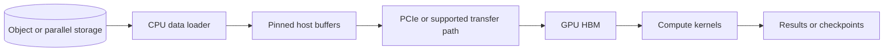

# GPU architecture and memory

A graphics processing unit (GPU) accelerates work that can run as many similar numeric operations in parallel.

AI workloads use GPUs because matrix multiplication, attention, convolution, and vector operations expose this parallelism.

The useful design question is not whether a GPU is fast in isolation. It is whether the complete path can keep its arithmetic units supplied with data and can hold the model, active state, and temporary buffers in the right memory tier. A workload can have a powerful accelerator yet remain slow because storage, CPU preparation, host-to-device transfer, or memory capacity becomes the limiting stage.

A GPU does not make every program faster.

Control-heavy code, small batches, serial dependencies, data loading, and network waits can leave the device idle.

This chapter explains what executes on a GPU, why memory often limits AI, and how to select and operate Azure GPU compute.

## Learning objectives

After this chapter, you should be able to:

- distinguish CPU and GPU responsibilities;
- explain streaming multiprocessors, warps, tensor cores, and kernels;
- trace data through registers, shared memory, cache, HBM, system RAM, and storage;
- calculate model, optimizer, activation, and KV-cache memory;
- identify compute-bound, memory-bound, and transfer-bound workloads;
- choose an Azure GPU family from workload requirements;
- design monitoring, security, failure recovery, and benchmarks.

## Why GPU systems fail despite expensive hardware

Buying a larger GPU does not fix an input pipeline that cannot feed it.

Adding GPUs does not fix communication that grows faster than computation.

A model that fits in aggregate GPU memory can still fail if one unsharded tensor must fit on one device.

High reported GPU utilization can hide poor useful throughput if kernels repeatedly recompute discarded work.

Low utilization can be correct for latency-sensitive traffic with small batches.

The system objective is successful work per unit time and cost, not a single utilization percentage.

## CPU and GPU responsibilities

The CPU runs the operating system, network stack, request parsing, scheduling, and much application logic.

The GPU runs kernels submitted by a CPU process through a runtime such as CUDA or ROCm.

A kernel is a compiled function executed by many GPU threads.

The CPU prepares inputs, allocates device memory, launches kernels, and handles results.

The launch is asynchronous in many runtimes, so explicit synchronization changes measured latency.

A benchmark that synchronizes after every kernel can understate achievable throughput.

A benchmark that never synchronizes can report work before it finishes.

## Memory and execution hierarchy


Credits: Hazem Ali

The image separates host memory from device memory.

PCI Express (PCIe) carries data between the host and accelerator unless another supported path applies.

High-bandwidth memory (HBM) is device memory attached close to the GPU package.

HBM provides much higher bandwidth than ordinary host transfer paths, but its capacity is limited.

Registers are private, very fast storage used by active threads.

Shared memory is an explicitly managed low-latency memory visible to threads in one thread block.

L1 and L2 caches reduce repeated device-memory access when locality exists.

HBM holds model weights, activations, optimizer state, communication buffers, and KV cache.

Every movement between levels consumes bandwidth and energy.

## Streaming multiprocessors

A GPU contains multiple streaming multiprocessors (SMs), or analogous compute units on other architectures.

An SM schedules groups of threads and contains execution units, registers, shared memory, and instruction machinery.

Threads execute in fixed-size groups commonly called warps on NVIDIA architectures.

Threads in one warp execute the same instruction stream over different data lanes.

If lanes take different branches, the warp can serialize paths, which is called divergence.

Divergence reduces parallel efficiency but is not automatically avoidable.

The useful question is whether divergence materially limits the measured kernel.

## Occupancy

Occupancy describes how many warps are active relative to the hardware limit.

Higher occupancy can hide memory and instruction latency by scheduling another ready warp.

Occupancy is constrained by registers, shared memory, block size, and hardware limits.

Maximum occupancy does not guarantee maximum performance.

A kernel using more registers can run faster despite lower occupancy if it avoids spills or extra memory traffic.

Profile before changing launch configuration.

## Tensor cores

Tensor cores are specialized units for matrix operations at supported numeric formats.

Deep-learning frameworks use optimized libraries to map matrix multiplication onto these units.

The dimensions, layout, precision, and alignment must fit supported kernels.

A model advertised as FP8 or INT8 can fall back to slower paths for unsupported operations.

Measure operator-level execution on the intended hardware and runtime.

## Compute-bound and memory-bound work

A compute-bound kernel spends most time performing arithmetic.

A memory-bound kernel spends most time moving data to execution units.

Arithmetic intensity is operations performed per byte moved.

$$
\text{arithmetic intensity} = \frac{\text{floating-point operations}}{\text{bytes transferred}}
$$

High arithmetic intensity is more likely to use compute capacity effectively.

Low arithmetic intensity is more likely to hit a memory-bandwidth ceiling.

Transformer prefill often exposes more parallel matrix work than one-token decode.

Decode frequently streams large weights to produce relatively few output tokens.

This helps explain why batching improves decode throughput until memory or scheduler pressure dominates.

## Roofline reasoning

The roofline model compares peak compute with memory bandwidth.

The attainable performance is bounded by the lower of compute peak and bandwidth times arithmetic intensity.

$$
P_{attainable} \le \min(P_{compute},\ bandwidth \times arithmeticIntensity)
$$

Vendor peak numbers are ceilings under specific operations and precisions.

Application throughput depends on kernels, shapes, batching, communication, and data movement.

Use roofline reasoning to identify which optimization category is plausible.

Quantizing weights may help a bandwidth-bound model by moving fewer bytes.

It may not help a kernel already limited by unsupported control flow.

## Model weight memory

A lower-bound weight estimate is:

$$
\text{weight bytes} = \text{parameter count} \times \text{bytes per parameter}
$$

A 7-billion-parameter model at FP16 needs roughly 14 GB of raw weights.

The same parameter count at one byte per weight needs roughly 7 GB before metadata.

Runtime buffers, allocator fragmentation, activations, and cache require additional memory.

A model that barely fits cannot necessarily serve a useful batch.

## Training memory

Training retains more state than inference.

A common training footprint includes parameters, gradients, optimizer states, activations, and communication buffers.

Adam-like optimizers can retain first and second moments for each trained parameter.

Mixed precision can retain a higher-precision master weight copy.

Activation memory grows with batch, sequence length, hidden dimensions, and layer choices.

Checkpointing activations trades additional recomputation for lower retained activation memory.

Distributed sharding can partition parameters, gradients, or optimizer state across devices.

No one multiplier accurately estimates every training configuration.

Build a table from the exact optimizer, precision, parallelism, and framework.

## Inference memory

Inference retains model weights, runtime workspaces, input and output activations, and KV cache.

KV cache grows with active sequences and tokens.

Long contexts can consume more memory than model weights at high concurrency.

Output reservations matter because each generated token extends request state.

Admission must consider prompt plus output ceiling, not prompt length alone.

Lesson 23 develops KV-cache and continuous-batching mechanics in detail.

## Fragmentation and allocator behavior

Free memory can exist in pieces that do not satisfy a large allocation.

Framework allocators often reserve pools and reuse blocks to reduce allocation overhead.

A process monitor can report reserved memory that is not currently used by tensors.

Distinguish allocated, reserved, cached, and physically free memory.

Repeated variable-size allocations can create fragmentation.

Stable block allocators and shape bucketing can improve predictability.

A process restart clears allocator state but is not a sustainable capacity strategy.

## Host-to-device transfer

Input data commonly begins in object storage, a file system, or host RAM.

The CPU decodes, tokenizes, or preprocesses data before transfer.

Pinned host memory can support efficient asynchronous device transfers.

Double buffering can overlap transfer of the next batch with compute on the current batch.

Overlapping works only when dependencies and hardware paths permit concurrency.

Small synchronous copies can dominate latency.

Large copies can saturate PCIe and leave compute units idle.

Profile transfer time separately from kernel time.

## Data pipeline path



The storage, CPU, memory, transfer, and GPU stages form one pipeline.

Throughput is constrained by the slowest sustained stage.

Increasing GPU count can worsen starvation if storage and preprocessing do not scale.

## Training versus inference selection

Training benefits from high aggregate compute, HBM capacity, fast GPU-to-GPU links, and scale-out communication.

Real-time inference prioritizes model fit, TTFT, TPOT, availability, and cost per request.

Batch inference prioritizes throughput and data feeding.

Development can prioritize interactive access and lower minimum cost.

One VM family is not optimal for all four.

## Azure GPU VM families

Azure NC-family VMs target GPU compute workloads including training, inference, analytics, simulation, and visualization, with specific series differing by accelerator, memory, CPU, storage, and network. [Azure NC family](https://learn.microsoft.com/azure/virtual-machines/sizes/gpu-accelerated/nc-family)

Azure ND-family VMs target demanding deep-learning and tightly coupled scale-up and scale-out workloads, with selected series offering multiple GPUs, NVLink, and InfiniBand connectivity. [Azure ND family](https://learn.microsoft.com/azure/virtual-machines/sizes/gpu-accelerated/nd-family)

Do not select from family name alone.

Check current regional availability, subscription quota, accelerator count, HBM per GPU, CPU memory, local NVMe, network, and interconnect.

Product availability and specifications can change, so re-fetch the exact series page during design.

## VM selection worksheet

| Requirement | Unit | Why it matters |
|---|---:|---|
| Model or shard size | GiB per GPU | must fit with runtime headroom |
| KV or activation budget | GiB per GPU | determines concurrency or batch |
| Target precision | FP16, BF16, FP8, INT8 | determines kernels and memory |
| Intra-node traffic | GB/s | affects tensor and pipeline parallelism |
| Inter-node traffic | Gb/s | affects distributed collectives |
| Host preprocessing | CPU cores and RAM | prevents GPU starvation |
| Local staging | GiB and GB/s | supports datasets and checkpoints |
| Regional capacity | GPU count | determines whether cluster can launch |

## Worked inference sizing

Assume raw weights consume 28 GiB.

Assume runtime and temporary buffers consume 8 GiB.

Assume KV cache target is 24 GiB.

Assume safety headroom is 10 GiB.

The design needs at least:

$$
28 + 8 + 24 + 10 = 70\ GiB
$$

A nominal 80-GB GPU might fit this plan.

The plan still requires load testing because allocator behavior and peak workspaces can exceed assumptions.

If one request reserves 400 MiB of KV cache, the 24-GiB pool holds at most about 61 arithmetic reservations.

Apply tenant limits and additional fragmentation margin before setting production concurrency.

## Worked training sizing

Assume a model cannot fit training state on one GPU.

First calculate weights, gradients, optimizer state, and retained activations.

Then choose data, tensor, pipeline, and state-sharding strategies.

The choice changes communication volume and failure recovery.

Aggregate memory across eight GPUs is not one flat address space.

A tensor assigned to one rank must fit that rank's memory unless explicitly partitioned.

Lessons 32 and 33 cover parallelism and ZeRO-style state partitioning.

## Utilization metrics

GPU utilization is the fraction of sampling intervals with active kernels.

It does not report whether the kernels are useful or efficient.

Memory utilization can mean bytes allocated or memory-controller activity depending on the metric source.

Monitor accelerator memory allocated, reserved, and free.

Monitor memory bandwidth and PCIe or interconnect transfer.

Monitor tensor-core and general compute activity where profilers expose them.

Monitor power, clocks, temperature, and throttling.

Monitor application tokens, samples, or jobs per second.

Correlate device metrics with queue age and request latency.

## Interpreting common patterns

High GPU utilization plus low throughput can indicate inefficient kernels or recomputation.

Low utilization plus high PCIe traffic can indicate transfer starvation.

Sawtooth utilization can indicate input stalls between batches.

High memory occupancy plus low compute can indicate oversized cache reservations.

One hot GPU in a multi-GPU job can indicate uneven sharding.

Periodic drops can align with checkpoints or evaluation jobs.

Use a timeline profiler before changing infrastructure.

## Benchmark design

Benchmark the real request or training distribution.

Include warm-up before steady-state measurement.

Separate model-load time from request latency.

Measure p50, p95, and p99, not only average.

Measure output quality when precision changes.

Measure cost per successful request or training step.

Record hardware SKU, region, driver, firmware, framework, runtime, model checksum, precision, and batch policy.

Repeat measurements to expose variance.

## Microbenchmark versus end-to-end benchmark

A matrix-multiplication microbenchmark tests a kernel and shape.

It does not include tokenization, retrieval, network, scheduler, or storage.

An end-to-end benchmark includes user-visible and pipeline stages.

Use microbenchmarks to diagnose a bottleneck identified by end-to-end evidence.

Do not choose a VM from theoretical FLOPS alone.

## Failure modes

| Failure | Detection | Safe response |
|---|---|---|
| Out of memory | allocator failure | reject or reduce admitted work; do not loop retries |
| GPU reset | device and process errors | remove instance, fail request explicitly, recreate worker |
| Thermal or power throttling | clock and temperature telemetry | inspect host and sustained workload |
| Input starvation | low compute with transfer gaps | scale storage, loaders, and preprocessing |
| One rank fails | distributed job error | stop coordinated job and resume from checkpoint |
| Driver mismatch | initialization or kernel error | block incompatible image at release gate |

The responses differ because each failure invalidates a different kind of state. An allocation failure means the proposed working set cannot coexist in device memory, so repeating the same request preserves the condition that caused it. By contrast, a device reset destroys the worker's local execution state, which makes replacement meaningful only after the caller has received a clear failure or the distributed job has restored a durable checkpoint. The table therefore separates capacity admission, worker replacement, and coordinated recovery rather than treating every error as a retry signal.

## OOM prevention

Reserve model and runtime memory before accepting traffic.

Set prompt, output, batch, and concurrent-sequence limits.

Use measured peak workspace, not idle memory.

Leave headroom for driver and allocator variation.

Reject before prefill when the reservation cannot fit.

Track leaks by request ownership and terminal state.

Test cancellation and error paths for memory release.

## Training recovery

Distributed training is a coordinated job.

One failed rank usually invalidates the current collective operation.

Store versioned checkpoints in durable storage.

Include model, optimizer, scheduler, random state, data position, and topology metadata required to resume.

Validate checkpoint integrity before deleting the previous checkpoint.

Measure checkpoint time and storage bandwidth.

Do not checkpoint so frequently that I/O starves GPUs.

Checkpoint frequency is a trade-off between work that may be lost and time spent not training. A checkpoint is useful for recovery only after all state needed to reconstruct a consistent step is durable and identifiable as one generation. Keeping the previous validated generation until the newer one passes integrity checks avoids replacing a known recovery point with a partial or unreadable one. Measuring the write path exposes whether the chosen interval protects progress without moving the storage bottleneck into every training step.

## Security boundaries

GPU workers process model weights, prompts, training data, and intermediate state.

Restrict administrative access and debug dumps.

Use workload identities rather than embedded storage keys.

Control outbound network paths from training and serving workers.

Pin and scan container images and drivers.

Audit model and data artifact access.

Separate development jobs from regulated production data.

Treat local NVMe as temporary sensitive storage and define cleanup behavior.

## Network isolation

Private networking limits public reachability but does not grant data authorization.

Workers still require least-privilege identities for storage, registry, and telemetry.

Private DNS must resolve storage and management endpoints from the compute network.

Egress policy must allow required package, registry, storage, and monitoring paths or provide private alternatives.

Test denied public paths and allowed private paths before production.

## Azure HPC composition

Azure HPC architecture combines compute, high-performance storage, networking, and a workload manager.

Azure documents GPU VM options, storage choices including Azure Managed Lustre, and management choices such as Azure Batch and CycleCloud. [HPC on Azure](https://learn.microsoft.com/azure/architecture/guide/compute/high-performance-computing)

The GPU is one stage in this system.

Storage and network architecture must match the job's data and communication shape.

## Cost reasoning

GPU cost is paid while the VM or managed compute is allocated according to the service model.

Idle time from data starvation is paid capacity without useful work.

Low batch size can be correct for latency but increases cost per token.

Higher batch size can improve throughput but harm user latency.

Calculate cost per completed and quality-valid unit of work.

For training, use cost per successful training step or completed run.

For inference, use cost per successful request or million output tokens under the service objective.

## Capacity and quota

GPU VM families can have regional and subscription quota constraints.

Request quota before the planned deployment window.

Quota does not guarantee physical capacity at a particular time.

Plan acceptable regions, sizes, and recovery alternatives without violating data residency.

Do not silently substitute a different accelerator without compatibility and performance evaluation.

## Deployment record

```json
{
  "vmSize":"approved-gpu-sku",
  "region":"approved-region",
  "gpuCount":8,
  "modelChecksum":"sha256:...",
  "containerDigest":"sha256:...",
  "driverVersion":"approved-version",
  "runtimeVersion":"framework-version",
  "precision":"bf16",
  "benchmarkReport":"bench-2026-08"
}
```

Keep this record with release and incident evidence.

## Operational runbook

When throughput falls, first classify compute, memory, transfer, storage, network, or scheduler limitation.

Check queue age and application throughput.

Check GPU compute and memory activity.

Check HBM occupancy and allocation failures.

Check PCIe and interconnect traffic.

Check CPU loader utilization and storage throughput.

Check clocks, temperature, and errors.

Compare with the last known healthy deployment tuple.

Change one variable and rerun a representative benchmark.

## Release gates

- Model and container checksums verified.
- Driver and runtime compatible with hardware.
- Memory fits at maximum approved context or batch.
- OOM path rejects safely.
- Cancellation frees memory.
- Input pipeline sustains target throughput.
- p95 latency and cost meet objectives.
- Quality and safety match approved baseline.
- Private network and identity probes pass.
- Rollback image and configuration remain available.

## Design alternatives

Use CPUs when the model is small, latency permits it, or GPU kernels do not accelerate the operation.

Use one large GPU when model fit and operational simplicity dominate.

Use multiple GPUs when partitioning and communication have measured benefit.

Use managed endpoints when managed serving, identity, monitoring, and rollout fit requirements.

Use raw VMs or orchestrated clusters when the team needs control over runtimes, topology, and distributed execution.

Every added layer increases operational ownership.

## Review checklist

- What is the workload's parallel computation?
- What bytes move for each unit of useful work?
- Is the workload compute-, memory-, transfer-, storage-, or network-bound?
- Do weights, activations, cache, and headroom fit per device?
- Does the input pipeline sustain the target rate?
- Is the selected Azure SKU available with quota in an approved region?
- Which metrics prove useful throughput rather than activity?
- Can the job or service recover from one GPU or worker failure?
- Are data, model, local disk, and debug access controlled?
- Has cost been measured per valid outcome?

## Hands-on exercise

Design GPU infrastructure for a 13-billion-parameter model.

Support interactive inference and nightly batch evaluation.

Calculate weight, runtime, KV-cache, and headroom memory.

Choose separate or shared pools.

Define context, output, batch, and concurrency limits.

Design storage-to-GPU data flow.

Select metrics that distinguish compute from transfer starvation.

Specify an Azure VM family evaluation, quota plan, benchmark matrix, security boundary, and failure runbook.

Explain every trade-off and the evidence that would change your choice.
