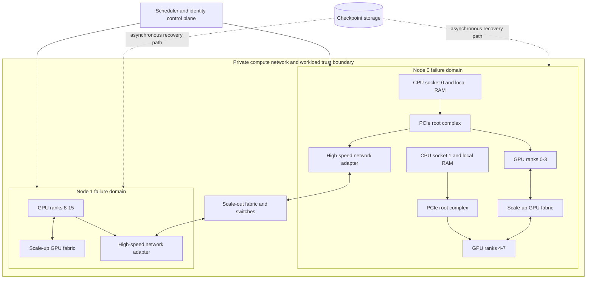

# Cluster topologies and interconnects

A GPU cluster is not a uniform collection of processors.

It is a hierarchy of links with different bandwidth, latency, failure, and sharing properties.

A training process that ignores this hierarchy can move its largest tensors over its slowest path.

Topology therefore becomes part of the application design rather than an infrastructure footnote. Parallelism determines which ranks exchange tensors, while physical placement determines the links and switches those tensors cross. Mapping frequent communication onto local high-bandwidth paths can change step time substantially even when GPU count and model code stay unchanged.

That mistake can leave expensive accelerators waiting even when every model shard fits in memory.

This chapter builds a topology model from one CPU socket to a multi-rack cluster.

It then turns that model into placement, benchmarking, reliability, and Azure design decisions.

## Learning objectives

After this chapter, you should be able to:

- distinguish scale-up links from scale-out links;
- explain PCI Express, NUMA, GPU root complexes, and peer access;
- reason about NVLink, NVSwitch, and AMD Infinity Fabric without treating them as interchangeable;
- map data, tensor, and pipeline parallel communication onto a physical topology;
- discover and validate the topology seen by a runtime;
- define placement invariants and failure domains;
- benchmark useful collective performance rather than rely on link specifications;
- map these decisions to current Azure ND-family virtual machines.

## Why topology becomes application behavior

Suppose eight GPUs share one server.

The model framework may label them ranks 0 through 7.

Those rank numbers say nothing about physical distance.

Two GPUs might communicate through a direct accelerator link.

Another pair might traverse PCI Express (PCIe), a CPU input/output die, and a second PCIe switch.

Traffic between servers adds network adapters, switches, routing, and congestion.

The same collective operation can therefore have different completion times for different rank layouts.

Distributed training advances at the pace of the slowest participating rank.

Topology is consequently part of application correctness for deadlines and capacity plans.

## First principles: nodes, links, and paths

A node is one operating-system instance with processors, memory, and attached devices.

A link carries data between two endpoints.

Bandwidth is the amount of data transferred per unit time, commonly GB/s or Gb/s.

Latency is the elapsed time before a small transfer completes, commonly microseconds for cluster communication.

Because $8$ bits equal $1$ byte, a nominal $400\ Gbit/s$ link has a raw ceiling of $50\ GB/s$.

Protocol overhead, encoding, contention, and software reduce application throughput below that ceiling.

A path is the sequence of links and switches between endpoints.

Its useful bandwidth is bounded by its narrowest active link.

Its latency includes every traversal plus software and synchronization overhead.

Bidirectional specifications must not be mistaken for one-direction application throughput.

Aggregate chassis bandwidth must not be assigned independently to every simultaneous transfer.

## The hierarchy inside one server

The central processing unit (CPU) executes the operating system and launches accelerator work.

Modern servers often contain two CPU sockets.

Each socket has local memory controllers, memory channels, and PCIe root complexes.

A root complex connects the CPU memory system to one or more PCIe trees.

PCIe switches can fan one upstream connection out to several devices.

The links still share upstream capacity when traffic leaves that switch.

The operating system exposes this hierarchy as a non-uniform memory access (NUMA) system.

NUMA means a CPU core reaches memory attached to its own socket with different cost than remote-socket memory.

An inter-socket fabric carries remote memory traffic.

That fabric is useful but finite and shared.

## PCIe transactions and locality

PCIe transports commands and data between CPUs, GPUs, network adapters, and storage devices.

A GPU attached beneath socket 0 should normally be fed by CPU cores and memory on socket 0.

If its process allocates buffers on socket 1, input data can cross the socket fabric before reaching the GPU.

If its network adapter is under another root complex, network traffic can take the same detour.

These transfers compete with unrelated memory and device traffic.

Locality is therefore a three-way relationship among CPU cores, host memory, and devices.

CPU affinity pins a process or thread to selected cores.

Memory affinity influences the NUMA node from which host pages are allocated.

Device affinity selects the GPU and network interface used by that process.

All three must agree.

## Peer-to-peer GPU access

GPU peer-to-peer access allows one GPU to address or transfer to another without staging through an application buffer in ordinary host memory.

Support depends on hardware topology, firmware, input-output memory management, drivers, and runtime policy.

Peer access does not guarantee a dedicated path.

Two peers might still share a PCIe switch uplink.

A topology tool can report reachability while a benchmark reveals the actual rate.

Treat capability discovery and performance validation as separate checks.

## Scale up and scale out

Scale up adds or uses accelerators within one node or tightly integrated system.

Scale out adds nodes connected by a network.

Scale-up fabrics usually offer lower latency and higher accelerator-to-accelerator bandwidth.

Scale-out fabrics cover more devices and larger failure domains.

The terms describe communication boundaries, not a claim that one is always better.

A model that fits and finishes on one node avoids network coordination.

A model that does not fit must cross the node boundary or use a larger node type.

## Accelerator fabrics

NVLink is an NVIDIA point-to-point accelerator interconnect.

Its generation, lane count, and wiring determine which paths exist and at what nominal rate.

NVSwitch is a switch fabric that connects multiple NVIDIA GPUs within a system.

It can provide more uniform reachability than a sparse mesh, but applications still need measured collective results.

AMD Infinity Fabric is a family of interconnect technologies used within AMD processors and accelerator systems.

Its exact role and bandwidth depend on the product topology.

These names do not define a universal performance tier.

Compare the concrete node diagram, supported peer paths, and benchmark results for the selected hardware.

## A hierarchical cluster



The diagram separates the control plane from the data plane.

The scheduler assigns ranks and resources but does not carry collective tensor traffic.

The scale-up fabric carries local GPU communication.

The scale-out fabric carries communication that crosses nodes.

Checkpoint storage is outside the synchronous collective path.

One node is a failure domain because a host, power, kernel, or fabric fault can remove all of its ranks together.

## Requirements and assumptions

Consider training a model on $32$ GPUs across four eight-GPU nodes.

The functional requirements are:

- launch exactly one process per GPU;
- preserve a stable global rank assignment for one attempt;
- keep tensor-parallel groups within a node;
- synchronize data-parallel gradients across nodes;
- write restartable checkpoints to durable storage;
- reject a node whose topology or fabric health fails validation.

The nonfunctional targets are:

- at least $85\%$ of the validated single-node samples-per-second rate after scaling efficiency is applied;
- collective timeout below $120\ s$ with a coordinated job failure rather than indefinite waiting;
- checkpoint recovery point objective (RPO) of $15\ min$;
- job restart time objective of $30\ min$ after replacement capacity is available;
- no public ingress to compute nodes;
- per-job cost and useful GPU-hour attribution.

These values are design assumptions, not Azure service guarantees.

## Invariants

An invariant states what must remain true during failure and retry.

Every logical rank belongs to exactly one live process in an attempt.

Every collective uses the same membership and operation order on all ranks.

Tensor-parallel peers remain within one validated scale-up domain.

No completed checkpoint becomes visible until its manifest and all referenced shards are durable.

A replacement attempt never appends to an incomplete prior checkpoint directory.

Compute nodes accept management and workload traffic only from approved private network paths.

Logs identify job, attempt, node, local rank, global rank, and topology fingerprint.

## Mapping parallelism onto topology

Data parallelism replicates the model and assigns different samples to each replica.

Its dominant communication is usually gradient reduction or parameter synchronization.

Tensor parallelism partitions operations or tensors within a layer.

It can require collectives several times per layer, so it is sensitive to latency and bandwidth.

Pipeline parallelism assigns consecutive layer groups to stages.

It transfers activations and gradients between neighboring stages.

Place the most communication-intensive dimension on the fastest fabric.

For many transformer workloads, tensor-parallel groups fit best within one node.

Data-parallel groups can span nodes because they communicate less frequently than tensor-parallel operators.

Pipeline neighbors should use direct or low-contention paths when activation transfers are large.

This is a starting hypothesis that a workload benchmark must test.

## Rank layout example

For four nodes with eight GPUs each, choose tensor parallel degree $T=8$ and data parallel degree $D=4$.

Each node becomes one tensor-parallel group.

Corresponding local ranks across nodes form data-parallel groups.

```text
node-0: global ranks  0.. 7, tensor group 0
node-1: global ranks  8..15, tensor group 1
node-2: global ranks 16..23, tensor group 2
node-3: global ranks 24..31, tensor group 3

data group for local rank 0: [0, 8, 16, 24]
data group for local rank 1: [1, 9, 17, 25]
...
data group for local rank 7: [7, 15, 23, 31]
```

This layout confines layer-level tensor collectives to a node.

It sends the less frequent data-parallel reduction across nodes.

Changing framework rank enumeration without updating these groups can reverse that decision.

## Communication calculations

Let $M$ be model parameter bytes participating in a data-parallel gradient reduction.

For a ring all-reduce over $D$ replicas, each rank transfers approximately:

$$
V_{rank} = 2 \times \frac{D-1}{D} \times M
$$

For $M=14\ GB$ and $D=4$:

$$
V_{rank} = 2 \times \frac{3}{4} \times 14 = 21\ GB
$$

At an effective $35\ GB/s$, the bandwidth-only lower bound is:

$$
t = \frac{21\ GB}{35\ GB/s} = 0.6\ s
$$

The measured time also includes chunk scheduling, protocol work, contention, and stragglers.

If useful compute per step takes $2.4\ s$, the simple communication fraction is $0.6/(2.4+0.6)=20\%$.

Overlap can hide part of that time only when dependencies and kernels permit it.

## Pipeline transfer calculation

Assume each pipeline boundary sends an activation tensor of $512\ MiB$ per microbatch.

At an effective $40\ GB/s$, one direction has a bandwidth floor near:

$$
\frac{0.5\ GiB}{40\ GB/s} \approx 12.5\ ms
$$

Eight microbatches send at least $4\ GiB$ forward, plus backward gradient traffic.

If a boundary crosses a slower oversubscribed network, stage idle time can dominate.

Pipeline placement must consider boundary tensor size, not merely equal layer counts.

## Topology discovery

Inspect the operating system before trusting framework defaults.

```bash
lscpu
numactl --hardware
lspci -tv
nvidia-smi topo -m
ip -br link
```

On AMD accelerator systems, use the vendor runtime and topology tools supplied with the validated image.

Record tool versions with output because labels can change across releases.

```bash
uname -r
nvidia-smi --query-gpu=name,pci.bus_id,driver_version --format=csv
```

The inventory should map each GPU to its PCIe bus, NUMA node, network adapter, and scale-up peers.

Hash a normalized inventory into a topology fingerprint.

Reject heterogeneous fingerprints unless the job explicitly supports them.

## Placement configuration

A scheduler request should describe whole topology units rather than an arbitrary GPU count.

The following generic YAML expresses intent rather than a specific scheduler API.

```yaml
job:
  nodes: 4
  processesPerNode: 8
  acceleratorsPerNode: 8
  exclusiveNodes: true
  placement:
    tensorParallel: within-node
    dataParallel: across-nodes
    requireUniformTopology: true
  affinity:
    cpu: local-to-gpu
    memory: local-to-gpu
    networkDevice: local-to-gpu
  recovery:
    checkpointIntervalMinutes: 15
    maxAttempts: 3
```

The admission controller must translate these intentions into scheduler-specific constraints.

It must fail closed when a required label is absent.

Silently placing a tightly coupled job on mixed nodes produces hard-to-explain variance.

## Topology-aware launch

At process start, derive local rank from the scheduler, not from hostname parsing.

Bind the process to the selected GPU.

Bind CPU threads and host allocations to the GPU's NUMA node.

Select the network interface validated for that GPU path.

Initialize collectives only after every rank passes local health checks.

Write the complete rank map to an immutable attempt record.

Never change membership inside a conventional synchronous collective job.

Terminate and restart the attempt when membership changes.

## Azure ND-family mapping

Azure describes ND-family virtual machines as GPU-accelerated sizes for deep learning, AI research, and HPC workloads.[^nd]

The exact topology differs by series, so an architecture must name a series rather than say only “ND.”

NDv2 provides eight NVLink-connected V100 GPUs and a 100-Gigabit InfiniBand EDR back-end network.[^nd]

ND A100 v4 and NDm A100 v4 provide eight A100 GPUs, NVLink 3.0 within the VM, and dedicated 200 GB/s HDR InfiniBand connections per GPU according to the current size documentation.[^nd]

The same documentation states that these connections support GPUDirect RDMA between VMs in the same virtual machine scale set.[^nd]

ND H100 v5 provides eight H100 GPUs, NVLink 4.0, and documents 3.2 Tbps of interconnect bandwidth per VM with dedicated 400 Gbps InfiniBand per GPU.[^nd]

ND MI300X v5 uses eight AMD MI300X GPUs connected through fourth-generation AMD Infinity Fabric and documents GPUDirect RDMA over its scale-out InfiniBand connections.[^nd]

These are product specifications, not a promise that one application reaches line rate.

Region availability, quota, image support, and current size details must be verified during deployment.

Azure’s HPC guidance recommends choosing compute, storage, networking, management, optimization, and security as one system rather than selecting compute alone.[^hpc]

## Benchmark plan

Begin with a topology inventory and link health test.

Measure host memory bandwidth per NUMA node.

Measure GPU-to-GPU unidirectional and bidirectional bandwidth for every meaningful pair.

Measure GPU-to-host transfer with local and remote CPU placement.

Measure network latency for small messages.

Measure network bandwidth for large messages.

Run collective microbenchmarks for all-reduce, all-gather, reduce-scatter, and send/receive.

Test one node, two nodes, and the intended production size.

Finally run a representative model step with the intended precision, tensor shapes, and checkpoint cadence.

Synthetic bandwidth is a diagnostic baseline, not the workload acceptance criterion.

## Benchmark controls

Pin software versions and container digests.

Warm up kernels before sampling steady state.

Synchronize at timing boundaries.

Report message sizes, rank count, algorithm, and environment variables.

Capture median, p95, and worst-rank latency.

Repeat at different times to detect shared-fabric variance.

Run isolated and with expected storage traffic.

Store raw results, not only dashboard aggregates.

Compare against a versioned baseline for the same VM series and image.

## Scaling efficiency

Let $X_1$ be throughput on one node and $X_N$ throughput on $N$ nodes.

$$
\text{scaling efficiency} = \frac{X_N}{N \times X_1}
$$

If one node produces $120$ samples/s and four nodes produce $408$ samples/s:

$$
\frac{408}{4 \times 120} = 0.85 = 85\%
$$

The cluster adds $288$ samples/s beyond the first node, not the ideal $360$.

Use useful completed samples, tokens, or simulation steps rather than GPU utilization as the numerator.

## Cost reasoning

Let node price be $P$ dollars per node-hour, node count $N$, and runtime $T$ hours.

$$
\text{compute cost} = P \times N \times T
$$

If four nodes halve runtime compared with two nodes, compute cost is unchanged before other charges.

If four nodes reduce runtime by only $30\%$, compute cost increases.

Add storage capacity-hours, storage operations, data transfer, image distribution, and idle allocation.

Cost per successful training token or completed simulation is more comparable than hourly price.

Failed runs must be charged to the experiment or platform that caused them.

## Congestion and oversubscription

An oversubscribed fabric has less aggregate capacity upstream than its endpoints could demand simultaneously.

Oversubscription is an economic design choice, not inherently a defect.

It becomes a problem when synchronized jobs require concurrent peak bandwidth through the same uplinks.

Placement should avoid splitting one collective across distant or congested failure domains when locality controls exist.

Admission control can limit concurrent communication-heavy jobs.

Traffic telemetry should correlate switch or adapter counters with collective stalls.

Congestion becomes visible to the application when many ranks enter a communication phase together and contend for the same shared links. The slowest transfer delays the collective, so the step time reflects queueing and imbalance even when no individual link has failed. Local placement and admission limits work by reducing the number of peak transfers that must share an uplink at the same time. Counter correlation distinguishes this shared-path effect from a slow kernel or a rank that was delayed before the collective began.

## Failure modes

A GPU can fail while its host remains reachable.

A PCIe link can down-train to a slower width without removing the device.

A scale-up link can report errors and force traffic onto another path.

A network adapter can remain up while packet loss or congestion destroys collective progress.

A CPU affinity mistake can send every data loader across a NUMA boundary.

One rank can enter a different collective order and deadlock all peers.

A scheduler can place the replacement attempt on a different topology.

A host fault removes all local ranks, so process-level retry on the same membership is insufficient.

## Failure response

Set collective timeouts long enough for known slow operations but finite enough to meet recovery objectives.

On timeout, capture rank stacks, adapter counters, GPU health, and the topology fingerprint.

Cancel the entire attempt.

Quarantine a node that fails link or accelerator diagnostics.

Allocate a fresh homogeneous set of nodes.

Restore only a committed checkpoint.

Use a new attempt identifier and output prefix.

Do not let two attempts publish the same final artifact.

Coordinated termination is a recovery mechanism, not merely a response to a timeout. Once ranks have observed different communication progress, one surviving process cannot safely infer the state of tensors held by peers that stopped, restarted, or timed out. A fresh membership reconstructs one agreed rank layout, while a committed checkpoint supplies the only shared application state from which that layout can resume. Separating attempt identifiers and output prefixes prevents delayed writes from the failed attempt from being mistaken for results produced by its replacement.

## Checkpoint atomicity

Each rank writes a shard under a unique temporary attempt path.

Ranks report shard size and checksum to a coordinator.

The coordinator verifies the expected shard set.

It writes a manifest that names model version, parallel layout, framework version, and every shard checksum.

The coordinator commits the manifest last.

Readers treat a checkpoint as valid only when that commit marker exists.

Retention keeps enough prior checkpoints to survive latent corruption.

Periodic restore tests prove recoverability.

## Observability

Collect GPU compute, memory, temperature, power, and correctable error metrics.

Collect PCIe replay, link width, and link-generation state where supported.

Collect scale-up fabric error and throughput counters.

Collect network retransmission, congestion, discard, and port state metrics.

Collect collective duration by operation and message-size bucket.

Collect step time, data wait, compute time, exposed communication time, and checkpoint pause.

Tag every metric with VM series, image, driver, runtime, job, attempt, node, and rank.

Alert on deviation from a topology-specific baseline rather than one global threshold.

## Security boundaries

Accelerator links are data-plane paths inside the allocated compute system.

The scheduler and cloud management APIs are control-plane paths.

Separate their identities, permissions, and logs.

Place compute nodes on private subnets without direct public ingress.

Restrict management access through approved administration paths.

Use workload identity for storage and control-plane access where the platform supports it.

Do not place storage credentials in job scripts, images, or environment dumps.

Authorize users to submit jobs without granting permission to alter network or cluster policy.

## Data classification and isolation

Classify model weights, training data, checkpoints, logs, and crash dumps independently.

GPU memory and local disks can retain sensitive workload data until reset or deletion procedures complete.

Use exclusive nodes when the threat model or performance model requires it.

Sanitize local scratch space between allocations.

Limit telemetry fields so prompts, samples, secrets, and model contents are not exported accidentally.

Encrypt durable data and management traffic.

Record who submitted, approved, modified, and terminated each job.

Retain audit events according to policy.

## Disaster recovery

The cluster itself is replaceable compute.

Recovery depends on durable source data, images, configuration, topology policy, and checkpoints.

Store infrastructure definitions and scheduler policy in version control.

Replicate durable artifacts according to the required regional recovery strategy.

Document capacity dependencies because a second region might not have the same accelerator series or quota.

Test restoring onto an approved alternative topology.

A changed topology can require a checkpoint resharding procedure.

Measure recovery time from incident declaration to resumed useful steps.

## Alternatives and trade-offs

A single large node minimizes scale-out communication but caps total accelerator count.

Many small nodes can improve allocation flexibility but increase network participation.

Data parallelism is simple when the model fits per replica but duplicates model memory.

Tensor parallelism reduces per-GPU model memory but introduces frequent collectives.

Pipeline parallelism reduces per-stage model memory but creates bubbles and boundary transfers.

Manual process pinning offers control but is error-prone at scale.

Scheduler-enforced topology labels improve consistency but require maintained inventory and policy.

The selected design should minimize total time and cost under memory, deadline, availability, and security constraints.

## Review checklist

- Is the exact node and accelerator series named?
- Is the CPU socket, NUMA, PCIe, GPU, and network-adapter topology recorded?
- Are rank groups mapped to physical links?
- Does the most frequent large collective use the fastest feasible fabric?
- Are CPU, memory, GPU, and network affinities aligned?
- Is homogeneous topology enforced at admission?
- Are effective bandwidth and latency measured for representative message sizes?
- Are worst-rank and p95 collective times retained?
- Is scaling efficiency calculated from useful throughput?
- Are topology fingerprints attached to every attempt?
- Are link degradation and node-health failures tested?
- Are collective timeouts and coordinated cancellation configured?
- Are checkpoints committed atomically and restore-tested?
- Are private networking and least privilege enforced?
- Are secrets absent from images, scripts, logs, and environment captures?
- Are model, data, checkpoint, and telemetry classifications documented?
- Does cost reporting include failed and idle GPU-hours?
- Can the workload recover on an approved alternate topology?

## Hands-on exercise

Choose a two-node or larger accelerator environment available to you.

Draw its CPU socket, NUMA, PCIe, GPU, and network-adapter topology.

Run the available topology inventory commands and compare observed paths with your drawing.

Measure GPU pair bandwidth for at least three path classes.

Measure a small-message collective and a large-message collective.

Create two rank maps: one topology-aware and one intentionally poor.

Run the same representative training step under both maps.

Record step time, exposed communication time, worst-rank time, and useful throughput.

Calculate scaling efficiency and cost per completed sample.

Inject one failure by stopping a rank or making a node unavailable in a nonproduction environment.

Verify coordinated termination, checkpoint selection, replacement placement, and attempt isolation.

Write a short decision record explaining which parallel dimension you placed within a node and why.

## Chapter summary

A cluster is a hierarchy, not a flat pool of GPUs.

PCIe roots, NUMA placement, scale-up fabrics, network adapters, and scale-out switches all affect tensor movement.

Topology-aware rank placement keeps frequent communication on faster, less contended paths.

Discovery proves what hardware and software expose.

Benchmarks prove what the workload can use.

Failure handling treats a node and its local ranks as one replaceable failure domain.

Security separates scheduler authority, workload identity, private data paths, and durable artifacts.

Azure ND series provide different concrete topologies, so validate the selected series and current regional deployment conditions rather than designing against the family name alone.

[^nd]: [Microsoft Learn, ND family virtual machine size series](https://learn.microsoft.com/azure/virtual-machines/sizes/gpu-accelerated/nd-family)
[^hpc]: [Microsoft Learn, High-performance computing on Azure](https://learn.microsoft.com/azure/architecture/guide/compute/high-performance-computing)