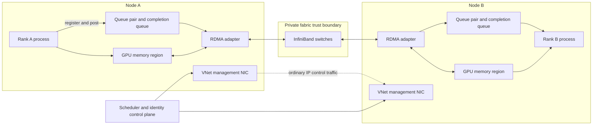

# RDMA and InfiniBand networking

Distributed GPU work is often a networked memory-movement problem.

Every rank can execute quickly and still spend most of a step waiting for remote tensors.

Ordinary sockets are suitable for many applications, but tightly coupled jobs need lower software overhead, predictable latency, and high bandwidth.

The distinction matters because distributed work advances only when all participating ranks reach the next synchronization point. A few microseconds of added latency can dominate many small collective messages, while insufficient sustained bandwidth can delay large tensor transfers. RDMA changes the data path, but it does not remove the need to manage buffer lifetime, membership, congestion, and application-level recovery.

Remote direct memory access (RDMA) addresses that need by allowing an adapter to transfer directly between registered memory regions.

InfiniBand is one network architecture that exposes RDMA semantics.

This chapter explains the mechanism before applying it to collectives, operations, security, and Azure ND-family clusters.

## Learning objectives

After this chapter, you should be able to:

- trace a message through a conventional TCP/IP path;
- explain RDMA registration, queue pairs, work requests, and completion queues;
- distinguish Ethernet, RDMA over Converged Ethernet, and InfiniBand;
- explain GPUDirect RDMA without assuming that every transfer bypasses the CPU;
- calculate collective transfer volume and lower-bound completion time;
- reason about congestion, oversubscription, and synchronized traffic;
- define fabric security and isolation requirements;
- diagnose link, transport, collective, and application failures;
- validate Azure InfiniBand support and drivers for a selected VM series.

## The network stack problem

A conventional socket send begins in application memory.

The application calls a networking API.

The operating-system kernel validates the operation and processes transport state.

Data may be copied, segmented, checksummed, queued, and passed to a network interface card (NIC).

The receiving kernel reverses the process and wakes the receiving application.

Modern kernels and NIC offloads reduce this work, but system calls, copies, interrupts, and scheduling can remain visible for small frequent messages.

TCP provides ordered, reliable byte streams and congestion control.

Those properties make it a strong default for general services.

They do not make TCP the lowest-overhead option for a controlled cluster fabric.

## Latency, bandwidth, and message rate

Latency dominates when messages are small.

Bandwidth dominates when messages are large.

Message rate matters when an application submits many small operations per second.

A simple transfer model is:

$$
T(n) = L + \frac{n}{B}
$$

Here $L$ is fixed end-to-end latency, $n$ is payload bytes, and $B$ is effective bandwidth.

For a $4\ KiB$ message, reducing latency can matter more than doubling bandwidth.

For a $4\ GiB$ tensor, sustained bandwidth dominates.

Collectives include both effects because they divide tensors into chunks and coordinate multiple peers.

## Ethernet and InfiniBand

Ethernet defines widely deployed link and frame technologies.

IP commonly provides addressing and routing above Ethernet.

TCP or UDP commonly provides transport semantics above IP.

InfiniBand defines a switched fabric, addressing, transport services, and a verbs programming model designed for low-latency data movement.

RDMA is a capability, not a synonym for InfiniBand.

RDMA over Converged Ethernet (RoCE) carries RDMA semantics over Ethernet.

Internet Wide-area RDMA Protocol (iWARP) carries RDMA over TCP.

InfiniBand carries native InfiniBand transports.

The operational controls, congestion behavior, and tooling differ among them.

## RDMA from first principles

Direct memory access lets a device read or write memory without the CPU copying each byte.

RDMA extends that model across hosts.

The sending adapter moves data from a local registered region.

The receiving adapter places it into an authorized remote registered region.

The CPUs still create resources, post work, handle completions, and run the application.

“Zero copy” means avoiding particular intermediate copies, not eliminating all CPU and memory-system involvement.

Correctness depends on memory lifetime, permissions, ordering, and completion handling.

## Memory registration

An adapter cannot safely access arbitrary process memory.

The process registers a memory region with the RDMA subsystem.

Registration pins or otherwise prepares pages so their mapping remains valid for device access.

The subsystem returns keys that authorize local or remote operations according to requested permissions.

A local key identifies access for local work requests.

A remote key can authorize a peer to read or write the region, depending on registration and transport semantics.

Keys are capabilities and must be scoped and protected.

Registration has setup cost and can consume pinned-memory resources.

Long-lived buffer pools often amortize that cost.

Unbounded registration can starve the host of pageable memory.

## Queue pairs

Applications submit RDMA work through queues.

A queue pair conceptually contains a send queue and a receive queue.

The application posts work requests that describe buffers, lengths, operation types, and signaling choices.

The adapter consumes these requests asynchronously.

Different transport types provide different reliability and connection semantics.

Reliable connected transport is common for tightly coupled collectives.

Every peer relationship need not map to one physical wire.

The fabric routes packets across shared links and switches.

## Completion queues

Completion does not mean the same thing for every operation.

A completion queue reports that posted work reached a defined local completion state or failed.

The application polls or receives notifications for completion entries.

It must associate each completion with the correct buffer lifetime.

Reusing a buffer before completion can corrupt an in-flight transfer.

Failing to drain completions can exhaust queue resources.

Unsignaled operations reduce completion overhead but require a disciplined signaling cadence.

Error handling must move the queue pair and application state into a known recovery path.

## One-sided and two-sided operations

Send and receive are two-sided because both peers post matching intent.

RDMA write places local bytes into an authorized remote region.

RDMA read fetches bytes from an authorized remote region.

Atomic operations can update limited remote values when supported.

One-sided operations reduce remote application involvement in each transfer.

They increase the need for explicit metadata, synchronization, and access discipline.

A remote write can complete without the remote application having consumed the new value.

Data visibility and application-level readiness are separate events.

## GPUDirect RDMA

Traditional GPU network transfer can stage data through host memory.

The GPU copies to a host buffer.

The NIC transmits the host buffer.

The receiver stages into host memory and then copies to its GPU.

GPUDirect RDMA enables a supported NIC to access registered GPU memory through a supported hardware and driver path.

This can remove host staging and reduce latency and host-memory bandwidth consumption.

It still requires compatible GPUs, NICs, PCIe topology, drivers, runtime libraries, and permissions.

The collective library may choose different paths for different peers or message sizes.

Measure the path rather than infer it from feature names.

## Data and control paths



The diagram separates ordinary IP control traffic from high-speed collective traffic.

The process authorizes buffers and posts work.

The adapters move payload over the private fabric.

The scheduler controls membership but should not carry tensor payloads.

Security review must cover both paths because controls on one do not automatically describe the other.

## Functional requirements

Consider a synchronous training job with $64$ GPUs.

The system must:

- establish one consistent rank membership per attempt;
- select a validated RDMA device for every rank;
- register bounded communication buffers;
- execute all-reduce, all-gather, reduce-scatter, and point-to-point operations;
- detect transport and collective failure within a finite timeout;
- preserve a committed checkpoint before retry;
- isolate one tenant’s processes and memory capabilities from another tenant.

## Nonfunctional requirements

Assume the following targets:

- large-message all-reduce bus bandwidth of at least $80\%$ of the established cluster baseline;
- p99 small-message latency no more than $25\%$ above the approved image baseline;
- collective timeout of $120\ s$;
- job recovery point objective of $10\ min$;
- no public ingress to worker nodes;
- complete audit records for job membership and privileged fabric changes;
- less than $5\%$ run-to-run throughput coefficient of variation under reserved test conditions.

These are workload assumptions, not Azure guarantees.

## Invariants

All ranks execute collectives in the same order.

Every posted buffer remains valid until its completion rule is satisfied.

Remote keys are disclosed only to authorized peers in the same job attempt.

No rank joins or leaves an active synchronous collective group.

Every attempt uses one approved driver, firmware, runtime, and collective-library matrix.

A transport error fails the whole attempt unless the framework explicitly supports membership repair.

Only committed checkpoints are eligible for restart.

RDMA data traffic remains on approved private fabric endpoints.

## Collective communication

A collective is an operation involving a defined group of ranks.

All-reduce combines values from every rank and returns the combined result to every rank.

Training commonly uses a sum reduction for gradients.

All-gather collects distinct shards and makes the concatenated result available to every rank.

Reduce-scatter combines values and leaves each rank with one reduced shard.

Broadcast sends one rank’s data to all peers.

Send and receive connect selected peers and are common between pipeline stages.

Libraries such as NCCL or RCCL select algorithms, protocols, channels, and transport paths.

Selection depends on topology, message size, rank count, and software version.

## Ring all-reduce

A ring all-reduce can be decomposed into reduce-scatter followed by all-gather.

For $P$ ranks and tensor size $M$, each rank transfers approximately:

$$
V_{rank}=2\frac{P-1}{P}M
$$

As $P$ grows, per-rank volume approaches $2M$.

The algorithm uses bandwidth efficiently for large messages.

Its step count grows with rank count.

Latency therefore matters more for smaller chunks or large groups.

## Tree and hierarchical collectives

A tree reduction can reduce the number of sequential communication rounds.

It may use links less uniformly than a ring.

A hierarchical collective first reduces within a node, then across nodes, then distributes locally.

This approach matches clusters where scale-up links are faster than scale-out links.

It can reduce network payload and participants.

It also depends on accurate topology detection.

No algorithm is universally best across message sizes and topologies.

Benchmark the library’s actual choices and supported tuning controls.

## All-gather and reduce-scatter volume

For a evenly sharded tensor with total size $M$ over $P$ ranks, a ring all-gather transfers approximately:

$$
V_{rank}=\frac{P-1}{P}M
$$

Reduce-scatter has a similar per-rank payload before protocol overhead.

Tensor parallelism can invoke these collectives multiple times per layer.

Even a modest tensor becomes significant when multiplied by layers, microbatches, and directions.

Count operations from a framework trace rather than estimating from one tensor alone.

## Bandwidth calculation

Assume a nominal $400\ Gbit/s$ adapter path.

The byte-rate ceiling is:

$$
\frac{400\ Gbit/s}{8}=50\ GB/s
$$

Assume measured effective one-direction bandwidth is $42\ GB/s$.

For $P=8$ and $M=8\ GB$, ring all-reduce moves per rank:

$$
2\times\frac{7}{8}\times8=14\ GB
$$

The bandwidth-only floor is:

$$
\frac{14\ GB}{42\ GB/s}=0.333\ s
$$

Real completion time includes synchronization, chunk latency, contention, and slow ranks.

## Overlap with computation

Frameworks can launch gradient reductions as backward computation produces buckets.

This overlaps network work with remaining gradient computation.

Overlap hides only communication that finishes before its dependency barrier.

Large first buckets can start late.

Small buckets increase launch and latency overhead.

Network kernels and compute kernels can compete for GPU execution or memory bandwidth.

Measure exposed communication on the critical path, not total communication activity alone.

## Congestion

Congestion occurs when offered traffic exceeds a link, queue, or receiver’s service rate.

Queues grow and latency rises.

Buffers can fill, causing backpressure, marking, or loss depending on the fabric and transport.

Synchronous collectives can create incast, where many senders converge on fewer links or endpoints.

They can also create periodic bursts aligned across jobs.

Average utilization can look safe while short synchronized bursts stall steps.

Use percentile latency and port counters alongside average throughput.

## Oversubscription

A non-oversubscribed fabric provides enough bisection bandwidth for its intended simultaneous traffic pattern.

An oversubscribed fabric shares narrower upstream capacity among endpoints.

Oversubscription reduces infrastructure cost when not all endpoints peak together.

It damages predictable collective performance when they do.

Azure documents InfiniBand-enabled HB and N-series VMs as connected through a non-blocking fat tree with a low-diameter design.[^azure-ib]

That statement describes the Azure RDMA fabric design for capable sizes, not the application’s measured efficiency.

The job must still validate image, placement, libraries, and workload behavior.

## Backpressure

Posting work faster than queues and receivers complete it consumes finite descriptors and buffers.

Collective libraries manage internal credits and chunking, but applications still influence concurrency.

Limit simultaneous collectives when they compete for the same path.

Bound registered buffer pools.

Use completion progress to release buffers.

Do not respond to congestion by adding unbounded application queues.

That moves waiting into memory and delays failure detection.

## Azure InfiniBand enablement

Azure states that RDMA-capable HB-series and N-series VMs use a low-latency, high-bandwidth InfiniBand network.[^azure-ib]

Supported Azure Marketplace HPC images can include InfiniBand drivers, and the current guidance identifies Ubuntu-HPC and AlmaLinux-HPC images as straightforward starting points.[^azure-ib]

Azure also provides InfiniBand driver VM extensions for supported Linux and Windows configurations.[^azure-ib]

Driver support depends on the selected VM series, operating system, kernel, and SR-IOV mode.

Pin an approved image rather than installing an unverified driver during every job start.

The Azure guidance notes that MPI usually uses the verbs interface directly and does not require IP over InfiniBand unless the application specifically needs TCP/IP over that interface.[^azure-ib]

## Azure ND mapping

NDv2 documents a 100-Gigabit InfiniBand EDR back-end network and support for protocols used by NCCL2.[^nd]

ND A100 v4 and NDm A100 v4 document dedicated 200 GB/s HDR InfiniBand connectivity per GPU and GPUDirect RDMA between VMs in the same virtual machine scale set.[^nd]

ND H100 v5 documents dedicated 400 Gbps InfiniBand per GPU, 3.2 Tbps aggregate interconnect bandwidth per VM, and GPUDirect RDMA.[^nd]

ND MI300X v5 documents corresponding scale-out InfiniBand connectivity and RCCL-oriented support for AMD accelerators.[^nd]

These series differ in GPU memory, local fabric, CPU, storage, and software stack.

Do not mix series within one tightly coupled attempt unless the framework and benchmark explicitly support heterogeneity.

Confirm current regional availability and quota before scheduling a deadline.

## Runtime configuration example

The following generic environment illustrates explicit interface selection.

Names and variables must be validated against the installed collective-library version.

```bash
export MASTER_ADDR="10.20.0.10"
export MASTER_PORT="29500"
export WORLD_SIZE="64"
export RANK="${SCHEDULER_GLOBAL_RANK}"
export LOCAL_RANK="${SCHEDULER_LOCAL_RANK}"
export NCCL_IB_DISABLE="0"
export NCCL_SOCKET_IFNAME="eth0"
export NCCL_DEBUG="INFO"
export NCCL_DEBUG_SUBSYS="INIT,NET,COLL"
exec ./train --rank "$RANK" --local-rank "$LOCAL_RANK"
```

The management interface carries rendezvous traffic in this example.

The collective library discovers the RDMA transport separately.

Never copy tuning variables from another cluster without testing their semantics and effect.

## Fabric inventory

Capture the adapter, port, link, and driver state before launching the full job.

```bash
ibv_devices
ibv_devinfo
ibstat
rdma link show
ip -br address
lspci -nn
```

On GPU nodes, correlate adapter and GPU PCIe locations.

```bash
nvidia-smi topo -m
nvidia-smi --query-gpu=pci.bus_id,name,driver_version --format=csv
```

Tool availability varies by approved image.

Fail admission when the required device, active port, or expected link properties are absent.

## Diagnostic ladder

Start below the application.

Verify the device exists and the driver loaded.

Verify the port is active and reports the expected link state.

Verify addressing and peer reachability for the selected transport.

Run a two-peer latency test.

Run a two-peer bandwidth test at several message sizes.

Run a collective test on one node.

Run the same collective across two nodes.

Increase to production rank count.

Only then diagnose model-level overlap, bucketing, and stragglers.

## Benchmark matrix

Test bytes from tiny control messages through model-sized tensors.

Record one-way latency when the tool defines it clearly.

Record unidirectional and bidirectional bandwidth separately.

Record algorithm bandwidth and bus-bandwidth metrics with their definitions.

Test all-reduce, all-gather, reduce-scatter, and point-to-point operations.

Test one rank per node and all intended ranks per node.

Test isolated and concurrent jobs.

Repeat after driver, firmware, kernel, collective-library, or image changes.

Preserve raw output and topology metadata.

## Failure modes

A port can be down or initialize at an unexpected state.

The wrong driver can expose the device but fail under load.

The runtime can fall back to sockets, producing correct but much slower execution.

GPUDirect can be unavailable and force host staging.

A remote key can reference a deregistered or incorrectly sized region.

A completion queue can overflow or stop progressing.

One rank can crash while peers wait in a collective.

Different ranks can call different collective operations.

Congestion can raise latency enough to trigger timeouts without a hard link failure.

A slow GPU kernel can appear as a network straggler at the barrier.

These symptoms overlap because a collective exposes only that one or more peers did not reach the next synchronization point in time. Link state and transport errors identify whether the fabric can move work, while queue progress and application traces identify whether the right work was posted and consumed. A healthy port does not rule out congestion, memory-registration mistakes, or a rank delayed in computation. Diagnosis therefore proceeds from physical reachability through transport progress to collective order and kernel timing, rather than assigning every timeout to the network.

## Retry and recovery

Transport operations are not application transactions.

Do not retry an individual collective independently after membership state diverges.

Fail the coordinated attempt.

Capture diagnostics before resources disappear.

Revoke or destroy queue pairs and registered-memory authority.

Quarantine nodes that fail repeated fabric checks.

Allocate a fresh membership.

Restore from the latest committed checkpoint.

Publish outputs under a new attempt identifier.

Make final artifact publication idempotent through a manifest or conditional commit.

The recovery boundary is the coordinated application attempt because RDMA completion only describes transport work, not a durable application result. After a membership failure, buffer contents and collective ordering can no longer be assumed to match across ranks, even if some adapters remain usable. Destroying the old authority and rebuilding membership prevents later work from the failed attempt from accessing state intended for its replacement. A manifest or conditional commit then makes publication depend on one verified result set instead of on the arrival order of independent writes.

## Observability

Collect link state, rate, width, errors, discards, and congestion indicators exposed by the platform.

Collect queue and completion errors from the RDMA stack.

Collect collective duration by operation, bytes, group, and rank.

Collect transport selection so socket fallback is visible.

Collect GPU direct-path or host-staging evidence where supported.

Collect CPU utilization and host-memory bandwidth to detect staging overhead.

Collect per-step compute, communication, overlap, and barrier wait.

Correlate all telemetry with job, attempt, node, rank, image, driver, and topology fingerprint.

Avoid high-cardinality labels that contain raw user data.

## Private networking

Place management NICs in private Azure Virtual Network subnets.

Azure Virtual Network supports private communication, routing, traffic filtering, and integration with services.[^vnet]

Network security groups filter ordinary VNet traffic by source, destination, port, protocol, and direction.[^nsg]

Default NSG rules allow VirtualNetwork traffic and outbound internet traffic unless higher-priority rules override them.[^nsg]

Therefore a newly attached NSG is not automatically least privilege.

Define explicit inbound and outbound policy for scheduler, identity, storage, monitoring, package sources, and administration.

Validate separately how the selected Azure RDMA fabric is provisioned and isolated.

Do not claim that an IP firewall rule inspects native InfiniBand verbs traffic unless current platform documentation explicitly states it.

## Identity and authorization

The process that submits a job should not administer fabric infrastructure.

The node identity should read only required images, data, and secrets.

The scheduler should distribute rank membership through authenticated control paths.

Remote-memory keys should exist only for the lifetime and peers of one attempt.

Never write keys, tokens, or complete environment blocks to shared logs.

Restrict privileged device access and container capabilities.

Use separate identities for infrastructure deployment, node bootstrap, job execution, and observability export.

Audit role assignments and privileged changes.

## Data classification

RDMA payloads can contain model weights, gradients, activations, optimizer state, or sensitive samples.

Classify the payload even when it is transient.

Registered memory can remain readable until deregistration and process cleanup complete.

Crash dumps can capture payloads and keys.

Debug logs can expose hostnames, topology, file paths, and environment values.

Set dump, core, and telemetry policies according to data classification.

Use dedicated nodes when tenant isolation requirements exceed the supported shared boundary.

Document whether link encryption is required and supported for the selected fabric.

Do not infer encryption from private addressing.

## Audit requirements

Record who created or modified the cluster.

Record the VM series, image digest, driver versions, and deployment topology.

Record who submitted and canceled each job.

Record rank membership and node allocation per attempt.

Record changes to NSGs, routes, identities, and privileged device policy.

Record health-check failures and quarantine actions.

Protect audit storage from workload modification.

Use synchronized time so events can be ordered across nodes.

## Cost reasoning

Network inefficiency turns directly into accelerator cost.

If $64$ GPUs cost an assumed $C$ dollars per GPU-hour and exposed communication adds $0.4$ hours, the added compute cost is:

$$
64\times C\times0.4=25.6C
$$

At an illustrative $C=4$, that is $102.40$ per run.

The price is an assumption, not an Azure quote.

Multiply by retries and experiments to expose the operational impact.

Compare tuning work against reduced cost per successful token or simulation step.

## Capacity planning

Estimate bytes per collective from tensor shapes and precision.

Multiply by operations per layer, layers, microbatches, and steps per second.

Separate intra-node from inter-node traffic according to rank groups.

Add checkpoint and data traffic that can share host or network resources.

Apply measured protocol efficiency rather than raw line rate.

Reserve headroom for variance and failure recovery.

Validate the complete communication schedule with a framework trace.

A mean bandwidth estimate alone cannot predict synchronized queue peaks.

## Disaster recovery

RDMA state is ephemeral and should not be recovered in place.

Rebuild queue pairs, registrations, and rank membership after replacement.

Keep approved images and configuration reproducible.

Keep durable checkpoints outside the cluster failure domain.

Verify accelerator and InfiniBand capacity in the recovery location before declaring an objective achievable.

Document a slower fallback topology only if the deadline and checkpoint format support it.

Test restart with changed hostnames and rank assignment.

Measure time to provision, validate, restore, and resume useful work.

## Alternatives and trade-offs

TCP sockets maximize portability and simplify many operational paths.

They can be sufficient for loosely coupled or small workloads.

InfiniBand RDMA reduces transfer overhead and supports tightly coupled scaling, but requires compatible hardware and software.

RoCE can use Ethernet infrastructure but requires a design that controls congestion and loss behavior.

Host-staged GPU communication is broadly compatible but consumes CPU and memory bandwidth.

GPUDirect RDMA can improve the path but tightens topology and driver dependencies.

Ring collectives favor large-message bandwidth.

Tree or hierarchical algorithms can favor latency or topology structure.

Choose from measured application behavior, not protocol reputation.

## Review checklist

- Is the transport requirement derived from message sizes and frequency?
- Are latency, effective bandwidth, and message rate measured?
- Is RDMA memory registration bounded and lifecycle-managed?
- Are remote keys scoped to one authorized attempt?
- Are queue and completion resources monitored?
- Is buffer reuse prevented before completion?
- Is GPUDirect RDMA verified rather than assumed?
- Is the selected collective algorithm measured at production rank count?
- Are all-reduce, all-gather, and reduce-scatter volumes calculated?
- Is socket fallback detected?
- Are congestion and worst-rank latency visible?
- Are driver, firmware, kernel, image, and library versions pinned?
- Are ordinary VNet and RDMA fabric security reviewed separately?
- Is public ingress absent from workers?
- Are outbound paths explicitly controlled?
- Are secrets and RDMA capabilities absent from logs?
- Does a transport failure terminate the coordinated attempt?
- Are checkpoints committed and restore-tested?
- Is recovery capacity validated?
- Is cost measured per successful workload unit?

## Hands-on exercise

Inventory a two-node RDMA-capable test environment.

Record VM or host type, NIC, driver, firmware, kernel, and collective-library versions.

Draw the ordinary IP control path and RDMA data path.

Run adapter and port diagnostics.

Measure two-peer latency for small messages.

Measure bandwidth across increasing message sizes.

Run all-reduce, all-gather, and reduce-scatter at one node and two nodes.

Calculate expected ring payload for one large test tensor.

Compare the measured time with the bandwidth-only lower bound.

Force a supported socket-only mode and measure the difference.

Stop one rank in a nonproduction run and verify finite timeout plus coordinated cancellation.

Inspect logs for secrets, remote keys, and sensitive payloads.

Write a decision record that states when the complexity of RDMA is justified for this workload.

## Chapter summary

RDMA moves data between registered memory regions with adapter-driven work queues and explicit completion semantics.

InfiniBand provides a switched fabric and verbs path suited to tightly coupled workloads.

GPUDirect RDMA can remove host staging when the complete hardware and software path supports it.

Collective behavior depends on payload, algorithm, topology, congestion, and the slowest rank.

Security depends on scoped memory authority, private fabric membership, ordinary network controls, identity separation, and auditable configuration.

Azure offers InfiniBand on specific capable HB and N-series sizes, with concrete ND series documenting different rates and GPU direct paths.

Validate the exact series, image, drivers, runtime, and measured workload before treating a specification as available application bandwidth.

[^azure-ib]: [Microsoft Learn, Enable InfiniBand on HPC VMs](https://learn.microsoft.com/azure/virtual-machines/extensions/enable-infiniband)
[^nd]: [Microsoft Learn, ND family virtual machine size series](https://learn.microsoft.com/azure/virtual-machines/sizes/gpu-accelerated/nd-family)
[^vnet]: [Microsoft Learn, What is Azure Virtual Network?](https://learn.microsoft.com/azure/virtual-network/virtual-networks-overview)
[^nsg]: [Microsoft Learn, Azure network security groups overview](https://learn.microsoft.com/azure/virtual-network/network-security-groups-overview)