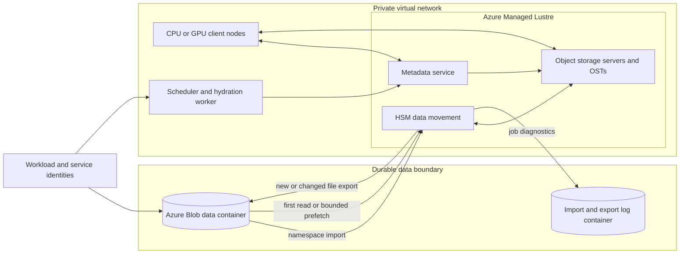

# Data hydration with Azure Managed Lustre

Accelerators cannot process data that storage cannot deliver.

Storage performance is not one number. Namespace operations determine how quickly workers discover files, data throughput determines how quickly they read bytes, and hydration determines whether requested content is already local to the active tier. A design that measures only aggregate capacity can therefore allocate expensive compute that waits on metadata lookups or first-read retrieval.

A cluster can have enough aggregate storage capacity and still stall on metadata lookup, small-file access, or first-read hydration.

Parallel file systems address concurrent data access by distributing metadata and file content across specialized servers and targets.

Azure Managed Lustre adds a managed Lustre service and integration with Azure Blob Storage.

That integration separates a durable object-storage namespace from a high-throughput working set.

This chapter explains the storage hierarchy, Lustre mechanisms, hydration workflow, checkpoint export, security, and failure operations required to use that separation safely.

## Learning objectives

After this chapter, you should be able to:

- distinguish object, block, local, and parallel file storage;
- explain Portable Operating System Interface (POSIX) namespace semantics;
- separate Lustre metadata from file-data paths;
- explain metadata servers, object storage servers, and object storage targets;
- reason about striping, small files, and concurrent clients;
- design Blob-to-Lustre import, lazy hydration, bounded prefetch, and export;
- calculate hydration, checkpoint, and steady-state throughput requirements;
- define safe deletion and disaster-recovery invariants;
- configure private networking, identity, authorization, and audit boundaries;
- benchmark and operate Azure Managed Lustre without treating it as the sole durable copy.

## Why storage becomes the bottleneck

Training and simulation workloads often read many files in parallel.

Thousands of workers can open files at nearly the same moment.

Every open requires path lookup and permission checks before bytes are read.

Large files stress data bandwidth.

Millions of small files stress metadata operations.

Checkpointing reverses the flow and creates a burst of writes.

If all ranks checkpoint together, storage sees synchronized allocation, metadata, and data traffic.

Average daily throughput does not describe these peaks.

The design must model namespace operations, data bandwidth, concurrency, and durability separately.

## The storage hierarchy

GPU high-bandwidth memory is closest to compute and has limited capacity.

Host memory feeds accelerators and caches application data.

Local NVMe storage offers node-local scratch capacity.

A parallel file system provides a shared POSIX namespace across nodes.

Object storage provides durable, scalable objects addressed by container and object name.

Archive or lower-cost object tiers can reduce retention cost with retrieval trade-offs.

No one tier is optimal for every phase.

A common pattern keeps the active working set on the parallel file system and durable source or output data in object storage.

## POSIX namespace concepts

A POSIX-style file system presents directories, paths, files, permissions, owners, groups, and file descriptors.

Applications can traverse directories and open paths without knowing which storage target holds the bytes.

Rename can be used as an atomic publication primitive within the supported file-system boundary.

Hard links allow multiple directory entries to reference one inode.

Permissions are evaluated against numeric user and group identities.

Object storage has different semantics.

An object name can contain slash characters without necessarily being a true directory hierarchy.

Object stores do not generally reproduce every POSIX operation or metadata field directly.

Translation between these models needs explicit rules.

## Metadata and data paths

Metadata answers questions about names and files.

Examples include path lookup, create, unlink, permission check, and file-layout discovery.

File data is the byte content read or written by clients.

Lustre separates metadata service from object data service.

A metadata server manages namespace and file metadata.

An object storage server serves one or more object storage targets (OSTs).

An OST stores file objects on backing storage.

After obtaining layout information, clients can transfer file data directly with the relevant object storage servers.

This separation allows parallel data movement without routing every byte through one metadata server.

## Striping

Striping divides a file across multiple OSTs.

Stripe count is the number of targets used by a file.

Stripe size is the amount placed on one target before advancing through the layout.

A wide stripe can improve throughput for a large file read by many clients.

It also consumes resources on more targets and can amplify contention.

A tiny file gains little from wide striping because metadata and setup dominate.

One default stripe policy rarely fits datasets, checkpoints, logs, and temporary files equally.

Choose layout by access pattern and validate with representative concurrency.

## Small-file pressure

Suppose a dataset contains $100$ million files averaging $32\ KiB$.

Its payload is about $3.05\ TiB$, but opening every file requires $100$ million namespace operations.

At an effective $50{,}000$ opens/s, one complete open pass takes:

$$
\frac{100{,}000{,}000}{50{,}000}=2{,}000\ s\approx33.3\ min
$$

That estimate excludes reads and contention.

Packing samples into larger shards can reduce metadata work.

Packing reduces random per-sample updates and changes failure granularity.

The data format is therefore part of storage architecture.

## Azure Managed Lustre architecture



The metadata path makes imported names visible.

The hydration path retrieves content when clients first access a file or when an operator prefetches it.

The export path moves new or changed content back to Blob Storage.

The log container is separate from the data container.

Compute, Lustre, and Blob Storage form different failure and cost domains.

## Azure service behavior

Azure Managed Lustre is a managed parallel file system intended for high-throughput, low-latency HPC workloads that need Lustre compatibility.[^overview]

The service uses managed disks as OST data disks.[^overview]

Current durable file-system types use Premium SSD locally redundant storage (LRS), which keeps three copies within one datacenter.[^overview]

That local redundancy does not provide regional recovery.

Microsoft recommends Blob integration and an appropriate Blob redundancy option when regional or global data redundancy is required.[^overview]

Treat the Lustre file system as an active tier whose durable external copy is governed explicitly.

## Hierarchical storage management

Hierarchical storage management (HSM) tracks data between a faster file-system tier and a backing archive tier.

With Azure Managed Lustre Blob integration, an import first brings file names and metadata into the Lustre namespace.[^blob]

File content is retrieved when a client first accesses the file.[^blob]

This is lazy hydration.

It avoids copying an entire dataset when a job needs only a subset.

It also shifts retrieval latency into the first access unless the working set is prefetched.

The scheduler must know whether “namespace ready” or “content ready” is the admission condition.

## File states

Conceptually, an imported file can be namespace-only, restoring, resident, dirty, archived, or released.

Namespace-only means metadata is visible but content is not resident in the working tier.

Restoring means HSM is retrieving content.

Resident means content is available from Lustre storage.

Dirty means the working copy changed after its archived state.

Archived means an HSM-managed backing copy exists according to tracked state.

Released means local content is absent while the archive reference remains.

Exact state output depends on the Lustre tools and service behavior.

An HSM state is operational metadata, not a cryptographic content comparison.

## Functional requirements

Consider a $120\ TiB$ training corpus with a $24\ TiB$ hot subset.

The system must:

- import selected namespace prefixes from Blob Storage;
- prefetch the hot subset before accelerator admission;
- expose one shared POSIX mount to all workers;
- sustain concurrent training reads;
- write checkpoint generations without overwriting committed generations;
- export final and checkpoint artifacts to Blob Storage;
- verify exported manifests before deleting the file system;
- preserve import and export diagnostics independently from workload data.

## Nonfunctional requirements

Assume these design targets:

- hydrate $24\ TiB$ within $75\ min$;
- sustain $80\ GiB/s$ aggregate sequential reads after warm-up;
- complete a $4\ TiB$ checkpoint within $90\ s$;
- keep accelerator input-wait below $5\%$ of step time;
- recovery point objective of $15\ min$ for training state;
- regional recovery point objective of $1\ h$ after verified Blob export;
- no public client access to the Lustre mount;
- audited privileged HSM and export operations.

These are workload assumptions, not service guarantees.

## Invariants

Blob source objects are immutable for the duration of a versioned training run.

Every dataset version has a manifest of paths, sizes, and checksums.

Namespace import completion does not imply content hydration completion.

Compute starts only after its declared working set meets the hydration gate.

Checkpoint readers consume only generations with a committed manifest.

An export job success is not accepted until expected artifacts are verified in Blob Storage.

The Lustre file system is never deleted while unexported authoritative data exists.

No workload identity can change network, storage-role, or encryption policy.

## Import workflow

Create or select the Blob storage account and containers.

Use a versioned data prefix such as `/datasets/corpus/v17/`.

Create a separate logging container for import and export logs.

Grant only the documented service access required for Blob integration.

Provision the virtual network and subnet with sufficient address space.

Create Azure Managed Lustre with Blob integration.

Start the initial import or a later import job for nonoverlapping prefixes.

Monitor the import job rather than relying only on cluster deployment completion.

Validate the visible namespace against the source manifest.

Then begin bounded content hydration.

## Prefix behavior

Azure Managed Lustre permits import prefixes that select Blob names to expose.[^blob]

The default prefix `/` imports the entire container namespace.[^blob]

Multiple prefixes in one import request must not overlap.[^blob]

On hierarchical-namespace accounts, a prefix behaves like a path selection.[^blob]

On flat-namespace accounts, it matches the beginning of Blob names, with slash characters becoming Lustre directory delimiters.[^blob]

Review prefix selection before import because an unintended root import can create unnecessary metadata load.

Version prefixes instead of mutating a shared dataset path during active runs.

## Conflict handling

Later import jobs can encounter a path that already exists in Lustre.

Azure documents `fail`, `skip`, `overwrite-dirty`, and `overwrite-always` conflict modes.[^blob]

`fail` is the safest default when an unexpected collision indicates a versioning defect.

`skip` preserves the local path but can create a mixed-version view.

`overwrite-dirty` consults HSM state and can replace content not considered clean and archived.[^blob]

`overwrite-always` favors alignment with Blob content but can release or reimport already restored files and carries higher cost.[^blob]

Do not use overwrite modes as a substitute for immutable versioned prefixes.

## Hydration workflow

Build the hot-set file list from a versioned manifest.

Partition the list into bounded batches.

Submit HSM restore requests from an authorized mounted client.

Azure documents `lfs hsm_restore` for prefetch and requires `sudo` capability on the mounted client.[^blob]

Track state until each batch is resident or failed.

Record bytes, files, elapsed time, and errors.

Retry transient failures with bounded attempts and jitter.

Quarantine missing or checksum-mismatched files.

Release the compute allocation only after the admission threshold is met.

This workflow separates making a namespace visible from proving that the bytes required by a job are available. Batching constrains the number of outstanding restore operations, so the control process can observe progress and stop before a broad failure turns into an unbounded metadata backlog. The admission threshold turns those observations into a scheduling decision: accelerators begin only when the required working set has reached the agreed resident state. Quarantining incorrect paths keeps a partial data condition explicit instead of allowing workers to discover it independently during expensive execution.

## Bounded restore example

The following pseudocode shows the control pattern without copying the service documentation’s implementation.

```text
for batch in manifest.paths.chunked(max_items=2000):
    for path in batch:
        submit("lfs hsm_restore", path)

    deadline = now() + batch_timeout
    while now() < deadline:
        states = inspect_hsm_states(batch)
        if every_path_resident_or_failed(states):
            break
        wait_with_jitter()

    retry_transient_failures_with_limit()
    fail_dataset_gate_on_permanent_error()
```

Azure warns that unbounded asynchronous restore requests can overwhelm the metadata server and recommends batching requests, with current guidance suggesting batches of $1{,}000$ to $5{,}000$.[^blob]

The chosen value must be benchmarked against file count, size, and concurrent workload.

## Hydration throughput

The required average rate for $24\ TiB$ in $75\ min$ is:

$$
\frac{24\times1024\ GiB}{75\times60\ s}=5.46\ GiB/s
$$

Current Microsoft documentation states that Azure Managed Lustre restores from Blob Storage at a maximum rate of approximately $7.5\ GiB/s$.[^blob]

That documented maximum is a service ceiling, not a guaranteed run rate.

The target leaves only about $2.04\ GiB/s$ of headroom below that ceiling.

Small files, Blob tier, contention, and metadata pressure can make the objective infeasible.

The design should either hydrate less data, allow more time, or validate a sustained rate above $5.46\ GiB/s$.

## Steady-state read calculation

Assume $512$ workers each need $160\ MiB/s$.

The aggregate demand is:

$$
512\times160\ MiB/s=81{,}920\ MiB/s=80\ GiB/s
$$

Add headroom for skew and checkpoint traffic.

At $25\%$ headroom, plan and benchmark for $100\ GiB/s$.

If files are compressed, distinguish storage bytes from decoded bytes.

If workers reread data, page cache can change observed demand.

Measure cold, warm, and mixed-cache behavior separately.

## Stripe reasoning

Assume a $1\ TiB$ checkpoint shard must be read in $32\ s$.

It needs $32\ GiB/s$ effective throughput.

If one OST provides an illustrative measured $4\ GiB/s$ for that pattern, at least eight equally effective targets are needed before overhead.

Ten targets provide $25\%$ nominal headroom.

This calculation is illustrative because actual Azure Managed Lustre layouts and rates depend on configured SKU, capacity, and workload.

Measure rather than manually force a stripe policy that the managed service or application does not support.

Avoid giving every small file the widest layout.

## Checkpoint design

Each checkpoint generation uses a unique directory.

Every rank writes a uniquely named shard.

Shards include checksums and logical ownership metadata.

A coordinator verifies the complete expected shard set.

It writes the manifest last.

The manifest includes model version, step, parallel layout, shard paths, sizes, checksums, and framework version.

Readers ignore generations without a committed manifest.

Export policy prioritizes committed generations, not temporary shards.

A checkpoint directory is not recoverable merely because it contains files. The manifest defines the complete generation by connecting each shard to its owner, expected size, checksum, and parallel layout. Writing it last creates a publication boundary: a reader can reject every preceding directory state without guessing whether more writes are still in progress. Prioritizing committed generations for export preserves that same boundary when the working tier is later removed or recreated.

## Checkpoint bandwidth

A $4\ TiB$ checkpoint written in $90\ s$ requires:

$$
\frac{4096\ GiB}{90\ s}=45.5\ GiB/s
$$

That is aggregate payload throughput before metadata and replication overhead.

If $512$ ranks each write one shard, the mean shard size is $8\ GiB$.

Synchronized creation produces at least $512$ creates plus directory and manifest operations.

Staggering or aggregating shards can smooth metadata load.

Aggregation increases failure impact and memory requirements.

Benchmark the exact checkpoint library and shard count.

## Export workflow

Quiesce or snapshot application-level output before final export.

Commit the checkpoint or result manifest.

Start an export job for the relevant prefix.

Azure export jobs copy new files and files whose contents changed to the integrated Blob container.[^blob]

Metadata-only changes and deletions are not propagated as equivalent Blob changes.[^blob]

Monitor completion and inspect the logging container.

Retry failed export jobs; Azure documents that a retry copies files not copied by the prior job.[^export]

Verify expected Blob objects, sizes, and checksums.

Only then mark the generation durable outside Lustre.

## Active-file export risk

Files changing during an export can cause failure status.[^blob]

Repeated writes can make repeated exports fail.

Use immutable checkpoint generations instead of exporting files that remain open for mutation.

For final decommission export, stop all I/O before starting the job, as Microsoft’s guidance recommends.[^blob]

One import or export action can run at a time on the integrated file system.[^blob]

Schedule the data-movement queue as a serialized resource.

Expose waiting time so operators do not mistake queueing for a stalled service.

## Deletion semantics

Deleting a file in Lustre does not delete the original Blob during export.[^blob]

This protects the source from accidental propagation but means cleanup policies differ between tiers.

A renamed file is a metadata change; export behavior must be reviewed because metadata-only changes are not copied as content updates.[^blob]

Hard links are exported as separate Blob objects and reimport as independent files.[^blob]

Applications that depend on hard-link identity need a different archival representation.

Never infer that a directory tree is synchronized merely because an export succeeded.

Compare versioned manifests.

## Network prerequisites

You provide the virtual network and subnet used by Azure Managed Lustre.[^prereq]

The service accepts IPv4 and currently does not support IPv6.[^prereq]

Subnet size depends on capacity and enabled service nodes, and Azure reserves five addresses in every subnet.[^prereq]

Microsoft provides `az amlfs get-subnets-size` to calculate required subnet size for a SKU and capacity.[^prereq]

```bash
az amlfs get-subnets-size \
  --sku AMLFS-Durable-Premium-250 \
  --storage-capacity 122880
```

The values are illustrative and must be replaced with a supported current SKU and capacity.

Leave address headroom for growth and clients.

The file system cannot be moved to another network or subnet after creation.[^prereq]

## Mount and port requirements

Clients need a compatible Lustre client and network path to the mount endpoint.

Azure Managed Lustre requires bidirectional TCP port $988$ and ports $1019$ through $1023$ between client subnets and the service subnet.[^prereq]

No other client service should reserve those ports.[^prereq]

DNS must resolve required service names.

Custom DNS requires explicit validation.

Test mount, create, read, write, rename, and delete behavior from every compute subnet.

Do not expose the mount through a public endpoint.

Keep the service network interfaces under service control; Microsoft warns that disabling accelerated networking on generated `amlfs-*-snic` interfaces degrades performance.[^prereq]

## Blob prerequisites

Blob integration requires a supported storage account, data container, and separate log container.[^prereq]

The two containers must be in the same storage account.[^blob]

The storage account must be reachable from the Managed Lustre subnet.[^prereq]

When a private endpoint is used, current guidance requires integration with a private DNS zone so the storage account name resolves correctly.[^prereq]

Azure documents required Storage Account Contributor and Storage Blob Data Contributor assignments for the HPC Cache Resource Provider service principal before file-system creation.[^prereq]

Role propagation can take time, and creation can fail when the service cannot access the container.[^prereq]

Verify current role requirements and scope them to the required storage account.

## Identity and authorization

Separate infrastructure deployment identity from workload identity.

Only the deployment identity should create the file system, subnet policy, or role assignments.

Hydration workers need mount access and the minimum privilege required for HSM operations.

Ordinary training processes should not receive unrestricted `sudo` merely to read files.

Map numeric user and group identifiers consistently across clients.

Use directory ownership and mode bits to isolate job paths.

Use Azure role-based access control for management and Blob authorization.

Do not put storage account keys in scripts, images, or scheduler metadata.

## Encryption and data classification

Azure Managed Lustre data is encrypted at rest with Azure-managed keys by default.[^overview]

The service also documents host encryption for managed disks and support for an additional customer-managed-key configuration.[^overview]

Classify source data, hydrated working data, checkpoints, logs, and temporary files separately.

Import and export logs can disclose paths and failures even when they do not contain file payloads.

Limit access and retention accordingly.

Document in-transit protection requirements for client and Blob paths.

Private addressing is not itself proof of encryption.

## Resilience limits

LRS protects against certain local disk and rack failures but not a regional outage.[^overview]

Blob integration can place exported data in storage configured with zonal or geo redundancy supported by the selected account type.[^overview]

Unexported dirty files remain dependent on the Lustre failure domain.

A namespace import is not a backup of Blob content because Blob remains the source.

An HSM archived state should not replace end-to-end manifest verification.

Recovery objectives must state the maximum unexported interval.

Test full reconstruction from Blob into a newly created file system.

## Failure modes

The subnet can run out of addresses during deployment or growth.

DNS can resolve the Blob account publicly or fail to resolve its private endpoint.

Required ports can be blocked between clients and Lustre.

Role propagation can lag file-system creation.

An import can finish partially when errors are allowed.

A namespace can be visible while content remains cold.

Unbounded restore requests can overload metadata processing.

A hot OST or poor file layout can create skew.

Active files can repeatedly fail export.

A successful export can omit metadata-only changes or deletions by design.

Deletion can destroy the only copy of dirty data.

## Retry and idempotency

Use immutable dataset and checkpoint prefixes.

Give every import, hydration, checkpoint, and export attempt an identifier.

Record expected and observed file manifests.

Retry transient hydration failures with a bound.

Use `fail` conflict behavior unless a reviewed reconciliation policy says otherwise.

Retry an export by creating a new export job after reviewing logs.

Make verification repeatable and side-effect free.

Make final publication conditional on a matching manifest.

Never make cluster deletion the implicit “cleanup” step of an uncertain export.

## Backpressure

Limit concurrent metadata walks.

Limit HSM restore requests in flight.

Limit checkpoint generations pending export.

Pause new checkpoint publication when the export backlog threatens capacity.

Reject new jobs when free space cannot cover their declared output plus safety margin.

Throttle data loaders when storage latency rises rather than allowing unbounded prefetch queues.

Surface queue depth and oldest-item age.

Backpressure should protect metadata, capacity, and durable-export objectives.

## Observability

Measure metadata operations per second and latency by operation.

Measure client read and write bytes, operations, and latency.

Measure per-target utilization and skew where service telemetry exposes it.

Measure hydration files, bytes, errors, queue depth, and effective GiB/s.

Measure resident versus namespace-only working-set progress.

Measure checkpoint bytes, duration, shard count, and pause time.

Measure import and export state, age, files, bytes, conflicts, and errors.

Measure free capacity and growth rate.

Correlate storage metrics with accelerator input wait and job step time.

## Benchmark plan

Begin with mount and metadata correctness.

Benchmark file create, stat, open, close, rename, and unlink rates.

Test small files and large sequential files separately.

Test one client, increasing clients, and production concurrency.

Test cold hydration from Blob.

Test bounded prefetch at several batch sizes.

Test warm steady-state reads.

Test checkpoint writes and simultaneous training reads.

Test export after quiescing immutable outputs.

Repeat after client, image, SKU, capacity, or dataset-layout changes.

## Cost model

Separate Blob capacity, Managed Lustre capacity-hours, data operations, compute wait, and data-movement cost.

Let active-tier price be $P_L$ dollars per TiB-hour, provisioned capacity $C_L$, and lifetime $H$ hours.

$$
Cost_L=P_L\times C_L\times H
$$

Provisioning before hydration and retaining after verified export both add idle cost.

Lazy hydration reduces copied bytes but can increase accelerator wait.

Prefetch reduces first-read stalls but can hydrate unused content.

Compare total workflow cost, not storage price alone.

Include failed exports and delayed decommissioning.

## Disaster-recovery runbook

Stop writers and commit the final checkpoint manifest.

Start export for all authoritative prefixes.

Wait for job completion and inspect logs.

Verify Blob objects against manifests and checksums.

Record the last durable step and export timestamp.

Provision a new virtual network and Managed Lustre file system in the recovery location if capacity exists.

Import the versioned prefixes.

Hydrate the minimum restart working set.

Mount clients and validate identity mapping.

Restore the checkpoint and run a correctness probe before full scale.

## Alternatives and trade-offs

Local NVMe offers high node-local bandwidth but no shared namespace and weak node-failure durability.

Direct Blob reads avoid a parallel file-system tier but require object-aware applications and can expose request and latency limits.

Azure Files provides shared file protocols for other workload classes but should be benchmarked rather than assumed equivalent to Lustre for HPC.

Azure NetApp Files offers managed file storage with different protocols, features, and performance choices.

A self-managed Lustre deployment provides deep control but adds server, patching, failover, and scaling operations.

Azure Managed Lustre reduces that operational burden while retaining network, client, data-lifecycle, and cost responsibilities.

Choose from access semantics, throughput, metadata rate, capacity duration, recovery, and operational skill.

## Review checklist

- Is the authoritative copy for every data class identified?
- Are Blob objects and dataset prefixes versioned?
- Is namespace import distinguished from content hydration?
- Is the hot working set explicitly defined?
- Is HSM prefetch bounded and monitored?
- Are metadata and data throughput modeled separately?
- Is the small-file count known?
- Are stripe and shard choices benchmarked?
- Is checkpoint publication atomic through a manifest?
- Are active files quiesced before final export?
- Are export omissions for metadata changes and deletions understood?
- Are Blob results verified before Lustre deletion?
- Is subnet sizing calculated with headroom?
- Are mount ports and DNS paths validated?
- Are service and workload identities separated?
- Are privileged HSM operations limited?
- Are encryption and data classifications documented?
- Is regional recovery based on verified Blob data?
- Are hydration, storage, and accelerator-wait costs combined?
- Has a full rebuild from Blob been tested?

## Hands-on exercise

Create a design for a $40\ TiB$ dataset with a $6\ TiB$ hot working set.

Define immutable Blob prefixes and a manifest format.

Calculate the required hydration rate for a $45\ min$ preparation window.

Compare it with the current documented restore ceiling and add headroom.

Estimate metadata load for one million files and for one thousand packed shards.

Draw the private network, client subnets, Lustre subnet, Blob endpoint, DNS, and identity paths.

Write pseudocode for bounded restore and a compute admission gate.

Define a checkpoint directory and commit manifest.

Write an export verification procedure that accounts for deleted and renamed files.

Inject a failed restore and a changed-during-export file in a nonproduction test.

Measure cold-read, warm-read, checkpoint, and export behavior.

Produce a decommission approval record proving that no authoritative dirty data remains.

## Chapter summary

Parallel file systems separate namespace work from distributed file-data transfers.

Striping and concurrent clients can deliver high throughput, while small files and synchronized checkpoints can overload metadata.

Azure Managed Lustre integrates a POSIX working tier with Azure Blob Storage through HSM.

Import makes names visible before content is resident.

Bounded hydration makes the required working set resident without flooding metadata service.

Export moves new or changed content to Blob, but it does not mirror every POSIX metadata change or deletion.

Safe operation depends on immutable versions, manifests, verified exports, private networking, least privilege, and tested reconstruction.

The file system may be temporary; the data-lifecycle proof cannot be.

[^overview]: [Microsoft Learn, What is Azure Managed Lustre?](https://learn.microsoft.com/azure/azure-managed-lustre/amlfs-overview)
[^blob]: [Microsoft Learn, Use Azure Blob Storage with Azure Managed Lustre](https://learn.microsoft.com/azure/azure-managed-lustre/blob-integration)
[^prereq]: [Microsoft Learn, Prerequisites for Azure Managed Lustre file systems](https://learn.microsoft.com/azure/azure-managed-lustre/amlfs-prerequisites)
[^export]: [Microsoft Learn, Use export jobs to export data from Azure Managed Lustre](https://learn.microsoft.com/azure/azure-managed-lustre/export-with-archive-jobs)