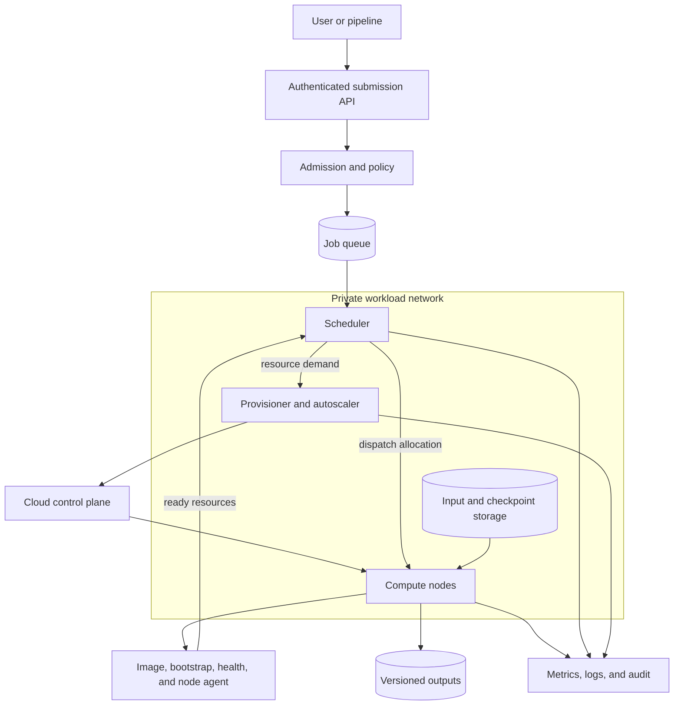

# Batch and cluster orchestration

Compute hardware does not decide which work should run next.

An orchestration system turns user requests into admitted jobs, allocated nodes, launched processes, durable outputs, and accountable cost.

Each transition has a different owner and failure mode. Admission determines whether a request is feasible and permitted, scheduling selects available resources, provisioning creates supply, and the application commits its own durable output. Treating these as one opaque job launch makes queue delay, failed bootstrap, interrupted work, and duplicate publication difficult to diagnose or recover safely.

That system includes more than a scheduler.

It also includes images, bootstrap, identity, networking, data staging, health, scaling, retry, and deallocation.

Azure Batch and Azure CycleCloud address different ownership models within this system.

This chapter builds the scheduling mechanisms first, then maps them to Azure Batch, Slurm-style clusters, and CycleCloud.

## Learning objectives

After this chapter, you should be able to:

- distinguish a queue, scheduler, resource manager, provisioner, and node agent;
- explain admission, placement, dispatch, and requeue;
- model queue delay separately from provisioning and runtime;
- explain Azure Batch pools, jobs, tasks, and special tasks;
- explain Slurm-style partitions, nodes, jobs, steps, and allocations;
- distinguish CycleCloud infrastructure orchestration from scheduler policy;
- design image and bootstrap workflows;
- use checkpointing and idempotency to survive node loss;
- evaluate dedicated versus Spot capacity;
- choose Batch, CycleCloud plus a scheduler, or another orchestrator from workload requirements.

## The control problem

Users submit more work than can run immediately.

Jobs request different CPU, GPU, memory, network, storage, time, and software resources.

Some jobs are independent task arrays.

Others require many nodes at the same time.

Priorities and quotas prevent one user from consuming every resource.

Nodes take time to provision and prepare.

Nodes can fail or disappear while work is active.

An orchestrator must convert changing demand and supply into bounded, observable decisions.

## Vocabulary

A job is a user-visible unit of requested work.

A task is a schedulable unit within a job.

A queue is an ordered or policy-governed set of waiting work.

A scheduler decides which eligible work receives which available resources.

A resource manager tracks allocatable CPUs, GPUs, memory, and node state.

A provisioner creates or removes infrastructure.

A node agent prepares a node, launches work, reports status, and performs cleanup.

Admission control rejects or delays work that violates policy or cannot be safely placed.

Placement maps accepted work onto concrete nodes.

Dispatch starts the process after prerequisites pass.

## Scheduler versus provisioner

The scheduler reasons about jobs and resource requests.

The provisioner reasons about cloud instances, quotas, images, networks, and capacity.

On a fixed cluster, the scheduler chooses only among existing nodes.

On an elastic cluster, queued demand can trigger the provisioner to add nodes.

Provisioning success does not guarantee scheduler readiness.

The node must boot, configure, mount storage, validate accelerators, and register.

Removing a node also requires scheduler drain and cleanup before cloud deletion.

Conflating these roles makes failures difficult to locate.

## Queueing from first principles

A job’s turnaround time is:

$$
T_{turnaround}=T_{queue}+T_{provision}+T_{bootstrap}+T_{stage}+T_{run}+T_{publish}
$$

Queue time is waiting for policy and resources.

Provision time is waiting for infrastructure allocation.

Bootstrap time prepares the node.

Stage time makes code and input data ready.

Run time performs the computation.

Publish time commits outputs and logs.

Optimizing only runtime can leave user-visible turnaround unchanged.

## Admission control

Admission validates that a job is syntactically and operationally feasible.

It verifies image digest, resource shape, wall-clock limit, data location, identity, and output destination.

It checks quotas and policy.

It can reject an eight-GPU job from a four-GPU-only partition before it waits indefinitely.

It can require checkpointing before allowing long work on interruptible nodes.

It can bound total retries and maximum cost.

Admission should return a durable reason code.

Silent indefinite queueing is not a useful rejection mechanism.

## Placement and fragmentation

Placement can pack work tightly or spread it.

Packing preserves empty nodes for large future jobs and can reduce idle cost.

Spreading can reduce contention and failure correlation.

Resource fragmentation occurs when free resources exist but not in the shape a waiting job needs.

Four nodes with one free GPU each cannot place a job needing four GPUs on one node.

Gang scheduling reserves all resources for a multi-node job before launching any rank.

Without gang placement, early ranks can occupy resources while waiting for ranks that never start.

## Fairness and priority

First-in-first-out ordering is simple but can let one large blocked job delay small jobs.

Backfilling runs shorter jobs when they do not delay a reserved high-priority job.

Fair-share policy accounts for historical resource use.

Priority can combine age, user share, project, deadline, and administrator policy.

Preemption stops or suspends lower-priority work to free resources.

Preemption is safe only when the workload can resume or restart within policy.

Every priority rule should be explainable from audit data.

## End-to-end architecture



The submission API authenticates intent.

Admission converts policy into an accepted resource contract.

The scheduler owns job ordering and placement.

The provisioner changes infrastructure supply.

The node reports ready only after bootstrap and health validation.

Storage and observability remain outside ephemeral node lifetime.

## Functional requirements

Consider an engineering platform serving independent simulations and distributed GPU jobs.

The system must:

- submit, cancel, query, and prioritize jobs;
- run task arrays and gang-scheduled multi-node jobs;
- enforce project quotas and approved VM shapes;
- provision and remove nodes from queue demand;
- prepare nodes from versioned images and bootstrap artifacts;
- stage inputs and publish outputs idempotently;
- checkpoint and requeue recoverable jobs;
- quarantine unhealthy nodes;
- attribute cost to project, job, attempt, and user.

## Nonfunctional requirements

Assume these targets:

- submission API availability of $99.9\%$ monthly;
- p95 admission decision below $2\ s$ without provisioning;
- warm-pool dispatch below $30\ s$ p95;
- cold capacity ready within $15\ min$ p95 for standard CPU nodes;
- scheduling decision below $5\ s$ for $100{,}000$ queued tasks;
- no more than $10\ min$ lost work after interruption;
- no public ingress to compute nodes;
- immutable audit history for one year;
- $95\%$ of completed jobs within their declared cost ceiling.

These values are design assumptions, not Azure guarantees.

## Invariants

Every accepted job has one immutable specification version.

Every execution has a unique attempt identifier.

One task attempt owns one output prefix.

Only a committed manifest publishes final output.

A node is schedulable only after bootstrap and health checks succeed.

A drained node receives no new work.

Scale-in never deletes a node with uncommitted authoritative output.

A retry never assumes local scratch survived.

Users can submit work without receiving infrastructure-administrator permissions.

## Azure Batch resource model

Azure Batch is a platform service that creates and manages compute pools, installs applications, and schedules jobs and tasks without requiring users to operate separate scheduler software.[^batch-overview]

A Batch pool is a collection of compute nodes.[^batch-pools]

A Batch job is a collection of tasks associated with a pool.[^batch-jobs]

A Batch task runs one or more programs or scripts on a node.[^batch-jobs]

Batch can run independent tasks and also supports tightly coupled multi-node work through multi-instance tasks.[^batch-overview]

Use Batch when the application can integrate with Batch APIs and its resource model.

Do not describe a Batch task as a durable transaction unless the application implements durable publication.

## Batch pools

Pool configuration selects operating system, image, VM size, node agent, scale policy, task scheduling, networking, and startup behavior.[^batch-pools]

VM size is fixed when a pool is created; changing size requires another pool.[^batch-pools]

Nodes are ephemeral from the application’s perspective.

When a node leaves a pool, local changes and files are lost.[^batch-pools]

Use local disk only for reconstructable scratch, caches, and in-progress attempt data.

Keep inputs, checkpoints, outputs, and provenance in durable external storage.

Choose one pool per isolation boundary, software stack, or VM shape when shared-pool complexity outweighs warm capacity savings.

## Batch jobs and tasks

Jobs can set priority, wall-clock constraints, and task retry constraints.[^batch-jobs]

Within one pool, higher-priority jobs receive scheduling precedence, but already running lower-priority tasks are not automatically preempted.[^batch-jobs]

Tasks can declare resource files, environment values, application packages, containers, runtime limits, retry limits, and retained-file duration.[^batch-jobs]

The task command line is not automatically interpreted by a shell.[^batch-jobs]

Invoke a shell explicitly when expansion, pipes, or redirection are required.

Keep the task command deterministic and make exit codes meaningful.

Do not pass secrets in command-line arguments or ordinary environment values that management APIs can retrieve.

## Batch special tasks

A start task prepares every node when it joins, restarts, or is reimaged.[^batch-jobs]

It can install software or start background services.

If a required start task fails, the node is not assigned tasks.[^batch-jobs]

A job preparation task runs on nodes before that job’s tasks.

A job release task performs post-job cleanup on nodes that ran work.[^batch-jobs]

A job manager task can create and monitor tasks for a job.[^batch-jobs]

A multi-instance task coordinates one task across multiple nodes for workloads such as Message Passing Interface (MPI).[^batch-jobs]

Use each hook for its ownership level rather than one oversized start script.

## Batch workflow example

```json
{
  "jobId": "risk-2026-08-12-v3",
  "poolId": "cpu-sim-v17",
  "priority": 200,
  "maxWallClock": "PT6H",
  "taskRetryLimit": 2,
  "tasks": [
    {
      "id": "partition-00042",
      "command": ["/opt/app/run", "--partition", "42"],
      "inputManifest": "datasets/risk/v9/part-42.json",
      "outputPrefix": "results/risk-2026-08-12-v3/partition-00042/attempt-1/"
    }
  ]
}
```

This is application-level illustrative JSON, not a literal Azure Batch API schema.

The immutable IDs make retries and output ownership explicit.

The client translates the specification into current Batch SDK or REST resources.

## Slurm concepts

Slurm is one example of a traditional HPC workload manager.

A partition groups nodes and policy into a schedulable queue-like resource set.

A node advertises CPUs, memory, generic resources such as GPUs, features, and state.

A job requests resources and time.

An allocation reserves nodes or resource slices for that job.

A job step launches work within an allocation.

The controller maintains scheduling state while node daemons launch and report processes.

Exact configuration depends on Slurm version and site policy.

## Slurm-style submission example

```bash
#!/usr/bin/env bash
#SBATCH --job-name=train-v17
#SBATCH --partition=gpu
#SBATCH --nodes=4
#SBATCH --gres=gpu:8
#SBATCH --ntasks-per-node=8
#SBATCH --time=06:00:00
#SBATCH --signal=B:USR1@180
#SBATCH --requeue

set -euo pipefail
trap './checkpoint.sh --reason preemption' USR1
srun ./train --config configs/train-v17.yaml
```

This example requests whole nodes and GPUs, receives a signal before a site-defined termination event, checkpoints, and allows requeue.

Signal behavior and cloud interruption notice must be validated in the deployed integration.

`--requeue` does not make application state recoverable by itself.

The restarted script must discover and validate a committed checkpoint.

## CycleCloud’s role

Azure CycleCloud deploys and manages HPC environments with supported schedulers such as Slurm, PBS Professional, LSF, Grid Engine, and HTCondor.[^cycle]

CycleCloud is not itself the job scheduler.[^cycle-scheduling]

Its scheduler adapters aggregate queue demand and translate it into Azure allocation requests under quota and topology constraints.[^cycle-scheduling]

Its node allocator provisions Azure resources and returns nodes to the scheduler integration.[^cycle-scheduling]

CycleCloud templates can define scheduler head nodes, compute nodes, storage, networking, and supporting services.[^cycle]

Use CycleCloud when preserving scheduler semantics and administrator control is a requirement.

The scheduler remains responsible for job priority, placement, and queue policy.

## CycleCloud control flow

A user submits a job to Slurm or another configured scheduler.

The scheduler evaluates eligibility and resource demand.

The CycleCloud adapter reads queued demand.

It converts demand into candidate Azure VM allocations.

The CycleCloud monitor provides subscription capacity information.

The node allocator requests infrastructure.

New nodes run image and project initialization.

They register with the scheduler.

The scheduler dispatches the job only after resources become ready.

Scale-in drains and removes idle nodes according to policy.

## Queueing and autoscaling delay

Elasticity does not make capacity instantaneous.

Let queue observation take $T_o$, scale decision $T_d$, allocation $T_a$, boot $T_b$, bootstrap $T_s$, and scheduler registration $T_r$.

$$
T_{ready}=T_o+T_d+T_a+T_b+T_s+T_r
$$

With $30\ s$, $10\ s$, $6\ min$, $3\ min$, $4\ min$, and $30\ s$ respectively:

$$
T_{ready}=14\ min\ 10\ s
$$

A five-minute job should not wait fourteen minutes for a new one-job cluster if warm capacity is economical.

## Batch autoscaling

Batch evaluates an autoscale formula periodically and sets target dedicated and Spot node counts.[^batch-scale]

Target is not a guarantee because quota and capacity can prevent the pool reaching it.[^batch-scale]

The default evaluation interval is currently $15\ min$, configurable from $5\ min$ to $168\ h$.[^batch-scale]

Autoscaling is intended for gradual adjustment, not subminute response.[^batch-scale]

Metric samples are recorded every $30\ s$ but can arrive late or be missing.[^batch-scale]

Use a time window and sample-availability threshold rather than relying on one potentially stale sample.

## Autoscale formula example

```text
$samplePct = $ActiveTasks.GetSamplePercent(TimeInterval_Minute * 15);
$queued = $samplePct < 70 ?
    max(0, $ActiveTasks.GetSample(1)) :
    max($ActiveTasks.GetSample(1), avg($ActiveTasks.GetSample(TimeInterval_Minute * 15)));
$needed = ceil($queued / $TaskSlotsPerNode);
$TargetDedicatedNodes = max(2, min(100, $needed));
$NodeDeallocationOption = taskcompletion;
```

This illustrative formula maintains two warm nodes, caps growth, and lets active tasks finish before scale-in.

Evaluate a formula before applying it and monitor each autoscale run.[^batch-scale]

Account for stale queued tasks and service-specific metric definitions.

## Bootstrap design

Build slow, stable dependencies into a versioned image.

Use bootstrap for environment-specific configuration and short validation.

Pin packages, containers, drivers, and configuration by immutable version or digest.

Verify checksums before execution.

Make bootstrap idempotent because nodes restart and tasks rerun.

Set a finite timeout.

Emit structured phase timings.

Fail the node closed when required storage, accelerator, network, or identity checks fail.

Do not make every node compile a large software stack from the internet at boot.

The image and bootstrap split exists because their failures have different scope. A versioned image captures slow dependencies that should behave the same on every node, while bootstrap binds that image to the current network, identity, storage, and scheduler context. Idempotence lets the node repeat preparation after a restart without creating conflicting local state. Failing closed prevents the scheduler from interpreting a partially prepared node as usable capacity and moving the resulting error into a running job.

## Node health lifecycle

A new node begins provisioning.

After boot, it enters bootstrap.

After validation, it becomes ready.

The scheduler allocates only ready nodes.

Health degradation moves a node to drain.

Drain prevents new work and lets policy decide whether current work completes or checkpoints.

Repeated or severe failures move the node to quarantine.

Quarantined nodes preserve diagnostics long enough for collection, then terminate.

Health state transitions must be idempotent and auditable.

## Data staging

Inputs can be downloaded per task, prepared per job, mounted from shared storage, or baked into an image when small and immutable.

Per-task download isolates work but repeats transfer.

Per-node cache reduces transfer but needs validation and eviction.

Shared storage reduces copies but can bottleneck at synchronized start.

Hydration should complete before expensive accelerators are admitted when possible.

Outputs go to attempt-specific paths.

A final manifest publishes only validated outputs.

Local files are never the only copy of a completed result.

## Retry semantics

A process retry repeats a failed command on the same or another node.

A task retry creates another attempt for one logical task.

A job retry can repeat a coordinated multi-task workflow.

Infrastructure retry creates replacement capacity.

Retries must not duplicate external side effects.

Use idempotency keys for databases, messages, and publication APIs.

Use conditional creation or manifests for object outputs.

Classify exit codes into retryable, permanent, canceled, and preempted outcomes.

Bound attempts and total wall-clock time.

Retries are only safe when the system can distinguish a repeated execution from a repeated effect. An attempt identifier provides that distinction for logs, resource use, and output ownership, while conditional output creation or a manifest provides it at the publication boundary. Exit-code classification prevents a permanent input or policy error from consuming capacity through repeated attempts. The time and attempt limits turn retry from an open-ended hope into a bounded recovery policy that the scheduler can account for.

## Checkpoint and requeue

Long work periodically writes a checkpoint to durable storage.

The checkpoint uses a new generation path.

Workers write shards and checksums.

A coordinator commits the manifest last.

On interruption, the process attempts a final checkpoint only if time permits.

The scheduler or Batch requeues the task or job.

The next attempt selects the newest complete compatible checkpoint.

It never trusts local scratch from the previous node.

Restore tests verify that checkpoint success means recoverable state.

## Spot capacity

Azure Batch pools can combine dedicated and Spot VMs.[^batch-spot]

Spot VMs use surplus capacity, have no availability guarantee, and can be preempted at any time.[^batch-spot]

Batch requeues interrupted tasks, but the application must implement checkpointing to preserve progress.[^batch-spot]

Local data on an evicted Spot node is lost.[^batch-spot]

Short independent tasks are strong candidates.

Long multi-node MPI jobs are weak candidates because one eviction can invalidate the whole coordinated job, a limitation Microsoft calls out explicitly.[^batch-spot]

Use dedicated baseline capacity when progress or deadlines require it.

## Expected interruption waste

If checkpoints occur every $I$ minutes and interruptions are uniformly distributed, expected lost compute is approximately $I/2$.

For $I=10\ min$, expected loss per interruption is $5\ min$.

Add checkpoint duration $C$ incurred each interval.

For runtime $R$, approximate checkpoint overhead is:

$$
T_{checkpoint}=\frac{R}{I}\times C
$$

Shortening $I$ reduces interruption loss but increases checkpoint traffic.

Select the interval from interruption rate, checkpoint cost, recovery objective, and storage capacity.

## Cost calculation

Assume $100$ dedicated nodes cost $P_d$ per hour and $300$ Spot nodes cost $P_s$ per hour.

For a $4$-hour run with $12\%$ Spot work replay:

$$
Cost=4(100P_d+300P_s)+0.12\times4\times300P_s
$$

This excludes storage, networking, licenses, idle warm capacity, and failed dedicated work.

Compare cost per completed task or simulation, not requested node-hour alone.

Include queue-delay business cost when deadlines matter.

Use current Azure pricing for the actual region and VM size during planning.

## Capacity and throughput

For $N$ independent tasks, mean runtime $t$, and $W$ task slots, the ideal service time is:

$$
T_{ideal}=\frac{N\times t}{W}
$$

With $20{,}000$ tasks, $12\ min$ each, and $1{,}000$ slots:

$$
T_{ideal}=240\ min=4\ h
$$

Add provisioning, staging, skew, retries, and publication.

If p99 task runtime is twice the mean, the final wave can dominate completion.

Split overly coarse work only when setup and output overhead remain acceptable.

## Backpressure

Bound accepted queued work per tenant.

Bound task creation rate to scheduler and API capacity.

Bound concurrent data staging against storage throughput.

Bound node provisioning to quota and cost policy.

Pause admission when output publication falls behind.

Use queue age and estimated start time to inform users.

Do not let retries outrun fresh work indefinitely.

Use a dead-letter or failed-job state for exhausted attempts.

## Failure modes

Quota can prevent target capacity.

A VM SKU can be unavailable in the selected region or zone.

Image pull or package installation can fail.

A start task can leave a Batch node unusable.

A scheduler head node can fail.

Clock or identity drift can break node registration.

Storage mount failure can make healthy compute unsafe to schedule.

Spot eviction can remove local progress.

Scale-in can terminate work when deallocation policy is wrong.

A task can remain reported running after its node becomes unusable, a known Batch condition that monitoring must detect.[^batch-jobs]

## Failure runbook

Identify whether failure is admission, scheduling, provisioning, bootstrap, staging, runtime, or publication.

Stop automatic retry storms.

Preserve job and node diagnostics.

Drain or quarantine affected nodes.

Verify durable checkpoint and output state.

Replace infrastructure rather than repair opaque ephemeral state indefinitely.

Requeue with a new attempt identifier.

Verify progress after restart.

Record root cause, lost work, cost, and corrective policy.

## Observability

Measure submissions, admissions, rejections, and reason codes.

Measure queue depth and age by partition, project, priority, and resource shape.

Measure scheduling cycle duration and placement failures.

Measure requested, target, provisioning, ready, allocated, draining, and failed nodes.

Measure bootstrap phase duration and failure.

Measure task runtime, exit category, retries, and checkpoint age.

Measure Spot preemptions and replayed work.

Measure staging and publication throughput.

Measure idle, useful, failed, and stranded node-hours.

## Security boundaries

Authenticate submission through Microsoft Entra ID or another approved identity provider.

Authorize by project, queue, VM shape, data classification, and cost ceiling.

Separate scheduler administration from job submission.

Separate cloud provisioning identity from compute workload identity.

Place head and compute nodes on private subnets.

Use controlled administration paths rather than public SSH or RDP.

Restrict outbound traffic to required package, identity, storage, monitoring, and control endpoints.

Use managed identity or short-lived credentials where supported.

Never bake secrets into images or bootstrap artifacts.

## Data and audit

Classify inputs, local scratch, checkpoints, outputs, logs, and core dumps.

Encrypt durable data and management traffic.

Sanitize or discard local disks when nodes leave according to the platform and policy.

Keep command lines and environment dumps free of secrets.

Record submitter, approver, specification digest, image digest, resources, placement, attempts, cancellation, and publication.

Record role, network, image, quota, and autoscale-policy changes.

Use immutable or access-controlled audit storage.

Synchronize time across control and compute components.

## Disaster recovery

Treat compute nodes as replaceable.

Back up scheduler configuration, queue policy, templates, images, and bootstrap artifacts.

Protect scheduler state according to the chosen product’s supported recovery model.

Keep job specifications and checkpoints in durable regional or cross-region storage according to objectives.

Verify VM quota and product availability in the recovery region.

Recreate a minimal cluster from infrastructure definitions.

Submit a restore validation job.

Measure time from control-plane loss to resumed useful work.

## Decision matrix

| Requirement | Azure Batch | CycleCloud plus scheduler | Kubernetes-style orchestrator |
|---|---|---|---|
| Primary interface | Batch API, SDK, CLI | Existing scheduler commands and APIs | Pod, job, and custom-resource APIs |
| Scheduler ownership | Managed Batch scheduling | Customer operates scheduler policy | Cluster scheduler plus extensions |
| Independent task arrays | Strong fit | Supported through scheduler | Strong fit |
| Traditional HPC queues | Different model | Strong fit | Requires adaptation |
| Tightly coupled MPI | Multi-instance task support | Native scheduler pattern | Requires topology-aware setup |
| Custom scheduler policy | Limited to Batch model | High control | Extensible but operationally complex |
| Infrastructure autoscaling | Batch pool scaling | CycleCloud adapters and allocator | Cluster autoscaler mechanisms |
| Operational burden | Lower scheduler burden | Higher scheduler administration | Higher platform administration |

The table is a design aid, not a universal ranking.

Validate product behavior and workload integration at the current version.

## Selection trade-offs

Choose Azure Batch when application developers want a managed batch scheduling model and can express work as pools, jobs, and tasks.

Choose CycleCloud with Slurm or another supported scheduler when existing HPC commands, policies, plugins, and administrator workflows are requirements.

Choose a Kubernetes-oriented design when the broader platform standard, service composition, and container control plane outweigh HPC scheduler familiarity.

A static cluster reduces cold-start delay but pays for idle capacity.

An elastic cluster reduces idle cost but adds queue and provisioning variance.

A shared pool improves utilization but expands isolation and dependency complexity.

A per-job pool improves isolation but repeats provisioning and bootstrap.

## Review checklist

- Are scheduler and provisioner responsibilities distinct?
- Is turnaround decomposed into queue, provision, bootstrap, stage, run, and publish?
- Does admission reject impossible resource shapes?
- Are project quotas and priorities documented?
- Do tightly coupled jobs receive gang placement?
- Are image and bootstrap artifacts immutable and verified?
- Is bootstrap idempotent and timed?
- Is node readiness based on health checks?
- Is local disk treated as ephemeral?
- Are output paths attempt-specific?
- Are checkpoints committed and restore-tested?
- Are retries bounded and side effects idempotent?
- Does scale-in drain safely?
- Is autoscale metric staleness handled?
- Is cold-start latency included in service objectives?
- Are Spot workloads short, restartable, or checkpointed?
- Are scheduler, provisioner, and workload identities separated?
- Are compute nodes private with controlled egress?
- Are idle, failed, and replayed costs attributed?
- Is the recovery cluster tested under real quota constraints?

## Hands-on exercise

Design an orchestration platform for $50{,}000$ daily independent CPU tasks and ten weekly $32$-GPU jobs.

Define two queues or pools and their admission rules.

Calculate ideal task throughput and cold-start contribution.

Choose a warm-capacity floor.

Write one Batch-style task specification and one Slurm-style job script.

Define a versioned image and idempotent bootstrap contract.

Model a Spot interruption rate and select a checkpoint interval.

Calculate expected lost work and checkpoint overhead.

Draw identity, private network, storage, scheduler, and provisioning boundaries.

Inject a bootstrap failure and verify node quarantine.

Inject a node interruption and verify requeue from a committed checkpoint.

Write a decision record choosing Batch or CycleCloud plus a scheduler for each workload class.

## Chapter summary

Orchestration converts queued intent into validated, placed, executed, and published work.

The scheduler controls job policy and placement.

The provisioner changes cloud capacity.

Images, bootstrap, data staging, checkpointing, node health, identity, and audit connect those roles into a production system.

Azure Batch provides managed pools, jobs, and tasks for API-integrated batch applications.

Azure CycleCloud deploys and scales HPC infrastructure around a scheduler but does not replace that scheduler.

Elasticity introduces provisioning delay and target-capacity uncertainty.

Spot capacity reduces price only when interruption and replay are designed into the workload.

The correct choice follows from job semantics, scheduler ownership, deadline, isolation, and operational skill.

[^batch-overview]: [Microsoft Learn, Azure Batch technical overview](https://learn.microsoft.com/azure/batch/batch-technical-overview)
[^batch-pools]: [Microsoft Learn, Nodes and pools in Azure Batch](https://learn.microsoft.com/azure/batch/nodes-and-pools)
[^batch-jobs]: [Microsoft Learn, Jobs and tasks in Azure Batch](https://learn.microsoft.com/azure/batch/jobs-and-tasks)
[^batch-scale]: [Microsoft Learn, Autoscale compute nodes in an Azure Batch pool](https://learn.microsoft.com/azure/batch/batch-automatic-scaling)
[^batch-spot]: [Microsoft Learn, Run Batch workloads on Spot VMs](https://learn.microsoft.com/azure/batch/batch-spot-vms)
[^cycle]: [Microsoft Learn, Azure CycleCloud overview](https://learn.microsoft.com/azure/cyclecloud/overview)
[^cycle-scheduling]: [Microsoft Learn, Azure CycleCloud scheduling concepts](https://learn.microsoft.com/azure/cyclecloud/concepts/scheduling)