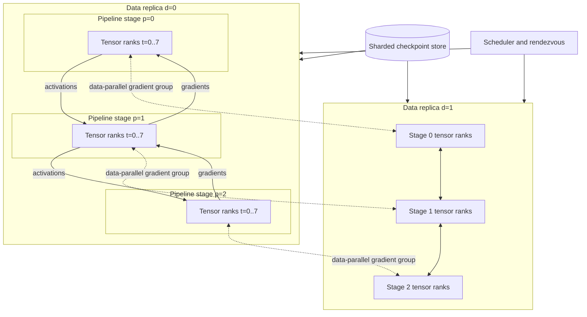

# Three-dimensional parallelism

A model can exceed one GPU’s memory before it exceeds the aggregate memory of a cluster.

Adding GPUs does not automatically divide the model or its work.

The training program must decide which samples, tensors, and layers each process owns.

Three-dimensional parallelism composes data, tensor, and pipeline parallelism.

Each dimension solves a different memory or throughput constraint and introduces a different communication pattern.

Parallelism is therefore a placement decision before it is a scaling decision. Splitting samples changes where gradients synchronize, splitting tensors changes communication inside a layer, and splitting layers changes where activations move between stages. The job succeeds only when the chosen ownership model fits per-GPU memory and maps its most frequent traffic onto links that can sustain it.

This chapter derives those patterns, maps them to physical topology, and designs checkpoint and recovery behavior for a production training system.

## Learning objectives

After this chapter, you should be able to:

- derive data-parallel batch and gradient behavior;
- explain column-wise and row-wise tensor partitioning;
- calculate all-reduce, all-gather, and reduce-scatter volume;
- explain pipeline stages, microbatches, schedules, and bubbles;
- compose data, tensor, and pipeline degrees into a world size;
- estimate per-GPU model-state and activation memory;
- map communication groups onto scale-up and scale-out fabrics;
- design sharded checkpoints that survive rank and topology changes;
- evaluate throughput, scaling efficiency, convergence, and recovery;
- map a framework-defined distributed job onto Azure Machine Learning without inventing service behavior.

## Why one parallel dimension is not enough

Data parallelism increases throughput but keeps a model replica on every worker.

Tensor parallelism splits individual layer operations but communicates inside many layers.

Pipeline parallelism splits layers but introduces stage imbalance and bubbles.

A very large model can need tensor and pipeline partitioning simply to fit.

The resulting model replica can then be copied across data-parallel groups to raise throughput.

The design objective is not the largest possible GPU count.

It is the lowest time and cost to a validated model under memory, deadline, and recovery constraints.

## Training state from first principles

A training step reads a batch of samples.

The forward pass computes layer activations and loss.

The backward pass computes activation gradients and parameter gradients.

The optimizer updates parameters using gradients and optimizer state.

Training memory can include parameters, gradients, optimizer moments, master weights, activations, temporary workspaces, and communication buffers.

Some state persists across steps.

Activations are usually retained only until their backward computation, unless recomputed.

Every parallel strategy changes the ownership and lifetime of this state.

## Processes, ranks, and groups

A distributed training process commonly owns one GPU.

World size is the total process count.

Global rank uniquely identifies one process in the world.

Local rank identifies the process within one node.

A process group is a subset of ranks that participate in selected collectives.

Three-dimensional parallelism creates separate data, tensor, and pipeline groups.

Every rank belongs to exactly one group along each dimension.

Group construction must be identical on every rank.

## Data parallelism

Data parallelism creates multiple logical model replicas.

Each replica processes different samples.

After backward computation, replicas combine gradients so corresponding parameters remain consistent.

Classic distributed data parallelism retains full parameters, gradients, and optimizer state per replica.

Sharded data-parallel variants can partition some of that state across the data group.

Data parallelism is effective when one model replica fits and the local batch provides enough compute.

It does not by itself make an oversized layer fit on one GPU.

## Global and microbatch size

Let data-parallel degree be $D$.

Let microbatch size per pipeline injection be $b$ samples.

Let gradient accumulation steps be $A$.

The global batch size is:

$$
B_{global}=D\times b\times A
$$

Tensor and pipeline degrees do not multiply the sample count because their ranks cooperate on the same samples.

For $D=16$, $b=2$, and $A=8$:

$$
B_{global}=16\times2\times8=256
$$

Changing $D$ without adjusting $b$ or $A$ changes optimization behavior.

## Gradient synchronization

Suppose each replica produces a gradient tensor of $M$ bytes.

A ring all-reduce transfers approximately this volume per rank:

$$
V_{allreduce}=2\frac{D-1}{D}M
$$

At $D=16$ and $M=20\ GB$:

$$
V_{allreduce}=2\times\frac{15}{16}\times20=37.5\ GB
$$

Gradient bucketing starts reduction before backward computation finishes.

Only communication completed before its dependency is hidden.

The last exposed bucket often determines the step barrier.

## Sharded data parallelism

Full replication can make optimizer state dominate memory.

A sharded approach can partition optimizer state across $D$ ranks.

More aggressive stages can partition gradients and parameters as well.

Parameter sharding requires gathering parameters before their computation and releasing or repartitioning them later.

This saves memory at the cost of additional communication and lifecycle complexity.

The exact behavior depends on the selected framework.

Capacity planning must use that framework’s actual state ownership rather than a generic label.

## Tensor parallelism

Tensor parallelism divides a layer’s tensors or matrix operations across $T$ ranks.

Consider matrix multiplication:

$$
Y=XW
$$

$X$ is the input activation and $W$ is the weight matrix.

Partitioning $W$ by columns gives each rank a subset of output features.

Each rank computes a shard of $Y$.

If the next operation can consume that sharded form, no immediate gather is needed.

If the next operation needs complete $Y$, ranks perform an all-gather.

## Column-parallel layer

Split $W$ into $T$ column blocks:

$$
W=[W_0,W_1,\ldots,W_{T-1}]
$$

Rank $i$ computes:

$$
Y_i=XW_i
$$

The concatenation of all $Y_i$ equals $Y$.

Each rank stores roughly $1/T$ of the weight matrix.

Every rank needs the input $X$ unless $X$ is already partitioned compatibly.

The output remains sharded or is gathered depending on the following operator.

## Row-parallel layer

Split $W$ by rows and split $X$ across its matching feature dimension:

$$
X=[X_0,X_1,\ldots,X_{T-1}]
$$

Each rank computes a partial result:

$$
Z_i=X_iW_i
$$

The complete output is:

$$
Y=\sum_{i=0}^{T-1}Z_i
$$

Ranks therefore reduce partial outputs.

A reduce-scatter can keep the result sharded when the next operation supports it.

An all-reduce replicates the complete result.

## Tensor communication cost

Let activation tensor size be $H$ bytes across a tensor group of size $T$.

A ring all-gather or reduce-scatter transfers approximately:

$$
V=\frac{T-1}{T}H
$$

For $T=8$ and $H=1\ GiB$:

$$
V=\frac{7}{8}\times1=0.875\ GiB
$$

If two such collectives occur per layer across $96$ layers, per-rank volume is approximately $168\ GiB$ per microbatch before backward-specific differences.

Tensor communication is frequent.

Place tensor groups on the fastest available scale-up fabric whenever feasible.

## Pipeline parallelism

Pipeline parallelism divides consecutive model layers into $P$ stages.

Stage 0 receives input tokens and sends boundary activations to stage 1.

The last stage computes the loss.

Backward gradients flow in the reverse direction.

One full batch executed serially would leave most stages idle.

Microbatching divides the batch so different stages process different microbatches concurrently.

The schedule determines when each stage performs forward and backward work.

## Pipeline schedule

A simple fill-drain schedule runs all forward microbatches and then all backward microbatches.

A one-forward-one-backward schedule interleaves forward and backward work after warm-up.

Interleaving can reduce activation lifetime and idle time.

It increases scheduling complexity and can require virtual stage assignment.

Pipeline communication is point-to-point between neighboring stages.

Its payload is boundary activations in forward and activation gradients in backward.

Stage boundaries should avoid unusually large tensors when layer balance permits.

## Pipeline bubble

For a simplified pipeline with $P$ stages and $m$ microbatches, a common lower-order bubble fraction estimate is:

$$
f_{bubble}\approx\frac{P-1}{m+P-1}
$$

For $P=8$ and $m=32$:

$$
f_{bubble}\approx\frac{7}{39}=17.9\%
$$

Increasing microbatches reduces the bubble.

It can increase activation memory, scheduling overhead, or effective batch size.

Real schedules and imbalance change the result.

Use a timeline trace to measure actual idle periods.

## Stage balance

Equal layer counts do not guarantee equal stage time.

Embedding, attention, mixture-of-experts, loss, and output layers have different cost.

Activation sizes also vary by boundary.

Profile layer compute and memory at representative shapes.

Partition stages to minimize the slowest stage time subject to memory limits.

The pipeline cycle time is bounded by the slowest stage after warm-up.

A $20\%$ slower stage can idle every other stage repeatedly.

Balance both forward and backward execution.

## Composing three dimensions

Let data degree be $D$, tensor degree be $T$, and pipeline degree be $P$.

The required world size is:

$$
W=D\times T\times P
$$

For $D=16$, $T=8$, and $P=4$:

$$
W=16\times8\times4=512\ GPUs
$$

Each pipeline replica contains $T\times P=32$ GPUs.

There are $D=16$ such replicas processing different samples.

Every rank has coordinates $(d,t,p)$.

## Rank coordinate mapping

One possible linearization is:

$$
rank=((d\times P)+p)\times T+t
$$

Then:

```text
tensor group(d,p)   = ranks with fixed d,p and varying t
pipeline group(d,t) = ranks with fixed d,t and varying p
data group(p,t)     = ranks with fixed p,t and varying d
```

Frameworks can use another ordering.

The ordering is correct only when every process constructs identical groups and topology placement matches the intent.

Persist the coordinate map in job and checkpoint metadata.

## Three-dimensional architecture



Tensor groups communicate repeatedly within each stage.

Pipeline groups exchange boundary tensors between stages.

Data groups synchronize corresponding model shards across replicas.

Checkpoint storage contains all logical shards independent of one live process.

## Functional requirements

Consider pretraining a model whose full training state cannot fit on one node.

The system must:

- launch exactly one process per GPU;
- construct deterministic data, tensor, and pipeline groups;
- partition model state according to a versioned plan;
- preserve a fixed global batch size across approved scale changes;
- checkpoint every logical model and optimizer shard;
- restart after node loss from a committed checkpoint;
- evaluate model convergence against a single-GPU or smaller trusted baseline;
- publish complete topology and software provenance.

## Nonfunctional requirements

Assume these targets:

- model-state memory below $70\%$ of GPU capacity before activations and buffers;
- peak allocated memory below $90\%$ of GPU capacity;
- scaling efficiency above $75\%$ from $128$ to $512$ GPUs;
- p95 step-time variation below $5\%$ after warm-up;
- checkpoint interval of $15\ min$;
- checkpoint completion within $4\ min$ asynchronously or within the declared pause budget;
- restart within $45\ min$ after replacement capacity exists;
- no public ingress to workers;
- auditable dataset, code, image, topology, and checkpoint versions.

These are design assumptions, not Azure service guarantees.

## Invariants

$W=D\times T\times P$ for every attempt.

Every rank belongs to one group along each dimension.

Every collective group executes operations in identical order.

Every sample is assigned to exactly one data replica per optimizer step.

All data replicas apply the same logical optimizer update.

The global batch remains the declared value unless the experiment version changes.

Only committed checkpoint manifests are restartable.

No checkpoint is complete until every logical shard and required random-number-generator state is durable.

## Memory model

Let parameter count be $N$, parameter bytes $b_p$, gradient bytes $b_g$, and optimizer bytes per parameter $b_o$.

Without sharded data state, model-state bytes per tensor-pipeline rank are approximately:

$$
M_{state}\approx\frac{N(b_p+b_g+b_o)}{T\times P}
$$

This assumes balanced layer partitioning and ignores replicated metadata and buffers.

If optimizer state is also sharded across data degree $D$, its term can approach $Nb_o/(T P D)$ under an applicable framework strategy.

Do not divide parameters by $D$ for classic data parallelism because replicas each own a model copy.

## Worked memory estimate

Assume $N=70$ billion parameters.

Assume $2$ bytes for parameters, $2$ bytes for gradients, and $12$ optimizer-related bytes per parameter.

Total model state is:

$$
70\times10^9\times(2+2+12)=1.12\times10^{12}\ bytes\approx1.02\ TiB
$$

With $T=8$ and $P=4$, an unsharded-data estimate is about:

$$
\frac{1.02\ TiB}{32}\approx32.6\ GiB\ per\ GPU
$$

Activations, workspaces, communication buffers, fragmentation, and imbalance remain outside that value.

The division is an ownership estimate rather than an allocation schedule. A tensor-parallel rank can own only its parameter slice while still needing temporary inputs, outputs, and collective buffers at the same time as neighboring operators. Consequently, a partition plan that appears to fit from persistent-state arithmetic can still fail at the peak forward or backward layer. The memory budget therefore needs to preserve headroom for the largest concurrent live set, not merely make the average state per rank smaller.

## Activation memory

Activation memory grows with microbatch, sequence length, hidden width, layers per stage, and retained intermediates.

A rough lower-order activation tensor size is:

$$
M_{activation}=b\times s\times h\times bytes
$$

For $b=2$, sequence $s=8192$, hidden size $h=8192$, and $2$ bytes:

$$
M_{activation}=256\ MiB
$$

One layer stores multiple tensors, so actual retained memory is much larger.

Activation checkpointing discards selected intermediates and recomputes them during backward.

It trades compute and step time for memory.

## Communication schedule

Tensor groups communicate inside many layer operations.

Pipeline neighbors communicate once or more per stage boundary per microbatch and direction.

Data groups communicate gradients or sharded parameters around the backward and optimizer phases.

Checkpoint workers communicate or write state at lower frequency but high volume.

These flows can overlap and contend for accelerator, PCIe, and network bandwidth.

Create a communication table with operation, bytes, frequency, group size, path, and dependency.

The table is useful because the dependency determines whether a transfer is visible in step time. A gradient collective can be hidden only while later backward work remains independent; a pipeline-boundary activation must arrive before the next stage can execute its microbatch. When a rank fails or becomes slow, the same dependencies turn the group barrier into a recovery boundary: ranks must either complete one coherent step or discard its partial work and restore a checkpoint whose model, optimizer, and data position agree. Treating these paths separately avoids selecting a topology from aggregate bandwidth while missing the latency-sensitive operation that actually stalls training.

Optimize exposed critical-path time first.

## Topology mapping

Tensor groups usually deserve the fastest local fabric because they communicate most frequently.

Keep $T$ within the GPUs of one node when the node size and memory permit.

Place pipeline neighbors on direct or high-bandwidth paths because activation transfer is latency-sensitive at every microbatch.

Data groups can span nodes when their reductions occur less frequently.

A common mapping for eight-GPU nodes uses $T=8$ within each node.

Pipeline stages then occupy nodes, and data replicas span repeated sets of those nodes.

This is a hypothesis to benchmark, not a universal rule.

## Communication lower bound

Assume one tensor group performs an all-gather of $2\ GiB$ over $T=8$ ranks.

Per-rank payload is approximately:

$$
\frac{7}{8}\times2=1.75\ GiB
$$

At measured $200\ GB/s$ effective local bandwidth, the bandwidth floor is about $8.75\ ms$.

If the same operation crosses a measured $40\ GB/s$ scale-out path, the floor is $43.75\ ms$.

Repeated $192$ times per step, the difference can dominate even with overlap.

This is why topology-aware group construction matters.

## Pipeline boundary calculation

Assume a boundary activation is $512\ MiB$ per microbatch.

With $m=32$ microbatches, one forward direction sends $16\ GiB$ per step.

Backward sends a comparable order of activation-gradient data.

At $40\ GB/s$, the bandwidth-only total for $32\ GiB$ is $0.8\ s$.

Stage computation can overlap some transfers.

Serialization, latency, contention, and stage imbalance add exposed time.

Measure each boundary independently because tensor size can differ by stage.

## Batch and learning-rate semantics

Increasing data degree can increase global batch if local batch and accumulation stay fixed.

That changes the number of optimizer updates per sample.

It can require learning-rate and warm-up changes.

The change can alter convergence even when throughput improves.

Preserve global batch during infrastructure comparisons unless optimization behavior is the experiment.

Record sample order, random seeds, dropped samples, and gradient-accumulation semantics.

Performance validation without convergence validation is incomplete.

## Partition plan

A partition plan names every layer, stage, tensor axis, and replication rule.

```yaml
parallelism:
  data: 16
  tensor: 8
  pipeline: 4
  microbatches: 32
  microbatchSize: 2
  gradientAccumulation: 8
placement:
  tensorGroup: within-node
  pipelineNeighbors: adjacent-nodes
  requireHomogeneousNodes: true
checkpoint:
  formatVersion: 3
  intervalMinutes: 15
  includeOptimizer: true
  includeRngState: true
```

This is framework-neutral illustrative configuration.

The training program must validate divisibility and supported combinations before allocating GPUs.

## Validation before launch

Verify $W=DTP$.

Verify world size equals scheduler process count.

Verify one visible GPU per local process assignment.

Verify hidden dimensions and attention heads are divisible by the tensor degree where required.

Verify layer partitioning covers every layer exactly once.

Verify every stage fits memory with headroom.

Verify microbatch count supports the selected pipeline schedule.

Verify dataset shard count and sampler semantics support data degree.

Fail before loading full model state when any condition is false.

## Checkpoint logical layout

A checkpoint should describe logical state rather than only process file names.

```text
checkpoint/step-00420000/
  manifest.json
  model/stage-00/tensor-00-of-08.bin
  model/stage-00/tensor-01-of-08.bin
  ...
  optimizer/stage-00/tensor-00/data-00-of-16.bin
  rng/data-00/tensor-00/pipeline-00.json
  dataloader/data-00.json
```

The exact layout depends on framework state ownership.

The manifest maps logical shards to objects, sizes, checksums, and serialization versions.

Temporary attempt files live outside the committed generation namespace.

## Checkpoint manifest

```json
{
  "formatVersion": 3,
  "step": 420000,
  "modelId": "foundation-v17",
  "parallelism": {"data": 16, "tensor": 8, "pipeline": 4},
  "globalBatch": 256,
  "framework": "pinned-by-environment-digest",
  "datasetManifest": "corpus-v9-sha256:...",
  "shards": [
    {"logicalId": "model/p0/t0", "path": "...", "bytes": 35000000000, "sha256": "..."}
  ],
  "committed": true
}
```

The example is conceptual.

The commit marker becomes visible only after every referenced shard is durable.

## Checkpoint bandwidth

Assume one complete checkpoint is $2.4\ TiB$ and the pause budget is $240\ s$.

Required aggregate payload bandwidth is:

$$
\frac{2.4\times1024\ GiB}{240\ s}=10.24\ GiB/s
$$

Storage metadata, checksums, temporary files, and contention add overhead.

Asynchronous checkpointing can reduce pause but needs extra host or device memory and consistent state capture.

Incremental checkpointing reduces bytes but lengthens the dependency chain.

Retain periodic full checkpoints to bound restore complexity.

## Resharding

A checkpoint written at $(D,T,P)$ may not load directly at another layout.

Changing $D$ is often easier when model shards are independent of data replicas.

Changing $T$ requires concatenating and repartitioning tensor axes correctly.

Changing $P$ moves layer ownership among stages.

Optimizer and random state must follow the corresponding logical parameters and replicas.

Implement resharding as an offline, versioned transformation when possible.

Verify checksums and numerical equivalence on a small model.

Never discover format incompatibility during an incident for the first time.

## Failure model

One GPU process can fail.

One node can remove several tensor ranks at once.

A network fault can leave peers blocked in different collectives.

A stage can run out of memory only for a rare long sequence.

A data loader can stall one replica and delay all data groups.

A corrupted checkpoint shard can invalidate the whole generation.

A replacement allocation can have a different topology or software image.

Most synchronous frameworks cannot continue with a missing rank.

Treat membership loss as an attempt failure unless elastic semantics are explicitly supported and tested.

## Recovery flow

Set finite collective and heartbeat timeouts.

On failure, stop all ranks in the attempt.

Capture rank logs, topology, GPU health, network counters, and last completed step.

Quarantine suspect nodes when policy indicates hardware or fabric failure.

Allocate a complete compatible world.

Reconstruct groups from the versioned partition plan.

Load the newest committed compatible checkpoint.

Restore optimizer, scheduler, scaler, random, and data-loader state.

Run a short numerical and throughput probe before resuming full production.

## Idempotency

Every attempt writes logs and temporary checkpoints under its own prefix.

Only one coordinator can commit a checkpoint step through conditional publication.

Metric ingestion deduplicates by job, attempt, rank, step, and metric name.

Evaluation artifacts include the checkpoint digest.

Model registration uses an idempotency key derived from the committed artifact.

A retried finalization never creates a second logical model version.

Data sampling state prevents silent repeat or omission beyond declared semantics.

External notifications occur after durable commit.

## Backpressure

Admission rejects worlds larger than quota or validated topology.

Input queues bound prefetched batches in host memory.

Checkpoint writers bound outstanding buffers and pending generations.

Training pauses or extends checkpoint interval under a reviewed policy when durable storage falls behind.

Evaluation consumes only committed checkpoints.

Model registration waits for evaluation and provenance gates.

Do not let asynchronous checkpoint or logging queues grow without limit.

Queue depth and oldest-item age must be observable.

## Azure Machine Learning mapping

Azure Machine Learning documentation distinguishes data parallelism, which replicates a model across workers, from model parallelism, which divides a model among workers.[^aml-concept]

Azure Machine Learning supports distributed jobs through framework integrations including PyTorch and TensorFlow.[^aml-concept]

For PyTorch jobs, the current SDK v2 guidance uses `instance_count` for nodes and `process_count_per_instance` for processes on each node.[^aml-guide]

The guidance says process count per instance typically equals GPUs per node; if omitted, one process per node is launched.[^aml-guide]

Azure Machine Learning sets rendezvous and rank environment variables including `MASTER_ADDR`, `MASTER_PORT`, `WORLD_SIZE`, `NODE_RANK`, `RANK`, and `LOCAL_RANK` for that launch mode.[^aml-guide]

The training framework and code still construct the process groups and implement the 3D partition plan.

Do not claim that Azure Machine Learning automatically chooses tensor or pipeline partitions.

## Azure job example

```python
from azure.ai.ml import command

job = command(
    code="./src",
    command="python train.py --config configs/3d-512.yaml",
    environment="azureml:training-env@17",
    compute="gpu-cluster",
    instance_count=64,
    distribution={
        "type": "PyTorch",
        "process_count_per_instance": 8,
    },
)
```

This follows the documented shape of an Azure Machine Learning PyTorch distributed command.[^aml-guide]

It launches $64\times8=512$ processes.

The referenced training code must validate and construct $D=16$, $T=8$, and $P=4$ groups.

Use pinned environment versions rather than a moving tag in a production implementation.

## Azure topology mapping

Azure ND series differ materially in GPU memory and local and scale-out interconnects.[^nd]

ND H100 v5 documents eight H100 GPUs with NVLink 4.0 and dedicated $400\ Gbit/s$ InfiniBand per GPU.[^nd]

ND A100 v4 and NDm A100 v4 document eight A100 GPUs, NVLink 3.0, and GPUDirect RDMA-capable scale-out connections.[^nd]

ND MI300X v5 documents eight MI300X GPUs connected by AMD Infinity Fabric with scale-out InfiniBand and RCCL-oriented support.[^nd]

For an eight-GPU node, $T=8$ is a natural topology hypothesis.

Benchmark collective paths and verify the exact selected series, region, quota, image, and framework stack.

## Security and identity

Use an authenticated submission identity with permission to create training jobs, not infrastructure-wide administration.

Use a distinct workload identity for dataset, checkpoint, registry, and telemetry access.

Grant read access to versioned inputs and write access only to job-specific output prefixes.

Place compute on private networking with no direct public ingress.

Restrict outbound traffic to required identity, storage, registry, monitoring, and control endpoints.

Do not pass storage keys or tokens through command lines, configuration files, or environment logs.

Pin and scan container or environment artifacts.

Audit role assignments and privileged changes.

## Data classification

Training samples can contain regulated or confidential information.

Model weights can encode proprietary investment and may expose memorized data.

Gradients and activations are transient but still sensitive.

Checkpoints include weights, optimizer state, and sometimes data-loader position.

Logs can contain samples, paths, prompts, environment values, and stack traces.

Classify each artifact and assign retention, encryption, access, and deletion policy.

Limit debug tensor dumps to controlled nonproduction data.

Protect checkpoint manifests from unauthorized replacement.

## Observability

Measure step time and samples or tokens per second.

Break step time into data wait, forward, backward, optimizer, tensor communication, pipeline wait, data communication, and checkpoint overhead.

Measure per-stage forward and backward duration.

Measure pipeline bubble and stage idle time.

Measure collective duration by group, operation, bytes, and rank.

Measure peak allocated and reserved GPU memory per rank.

Measure input throughput and long-sequence distribution.

Measure checkpoint bytes, pause, asynchronous backlog, and restore duration.

Tag telemetry with $(D,T,P)$, global batch, image, code, dataset, and topology versions.

## Performance evaluation

Start with a single GPU or smallest feasible trusted configuration.

Validate loss and gradients on a tiny deterministic batch.

Add tensor parallelism and compare outputs within numeric tolerance.

Add pipeline parallelism and verify schedule correctness.

Add data parallelism while preserving global batch.

Measure one node, two nodes, and target scale.

Capture warm-up separately.

Report median, p95, and worst-rank step time.

Run long enough to expose checkpointing and rare sequence shapes.

## Scaling efficiency

Let $X_n$ be useful throughput at $n$ GPUs and $X_b$ throughput at baseline $b$ GPUs.

$$
E=\frac{X_n}{(n/b)X_b}
$$

If $128$ GPUs produce $24{,}000$ tokens/s and $512$ GPUs produce $76{,}800$ tokens/s:

$$
E=\frac{76{,}800}{4\times24{,}000}=0.80
$$

The larger run achieves $80\%$ scaling efficiency.

Report global batch and sequence mix so throughput remains comparable.

## Model-quality evaluation

Compare training loss at matched consumed tokens.

Compare gradient norms and overflow events.

Compare held-out task metrics at matched checkpoints.

Verify sample coverage and duplication.

Test restart equivalence by comparing uninterrupted and checkpoint-restored trajectories within expected numeric variance.

Run the same release evaluation and safety gates used for non-distributed training.

Performance tuning that changes precision, batch, sequence packing, or reduction order can alter numerics.

Document those changes as model experiments, not infrastructure-only changes.

## Cost model

Let GPU count be $G$, hourly GPU-node allocation cost normalized per GPU be $P_g$, and runtime be $H$.

$$
Cost_{compute}=G\times P_g\times H
$$

If $512$ GPUs run for $100\ h$, the job consumes $51{,}200$ GPU-hours.

At an illustrative $P_g=4$ dollars per GPU-hour, compute is $204{,}800$ dollars.

This is not an Azure quote.

Add storage, checkpoint operations, networking, failed runs, idle allocation, and evaluation.

Optimize cost per validated training token or accepted model, not cost per raw hour.

## Failure cost

With a $15\ min$ checkpoint interval, expected lost work under uniformly timed failure is about $7.5\ min$.

At $512$ GPUs, that is:

$$
512\times\frac{7.5}{60}=64\ GPU-hours
$$

Add checkpoint restore and capacity reacquisition.

Frequent failures can justify shorter intervals despite higher storage overhead.

Use observed failure and checkpoint rates to choose the interval.

Include failed GPU-hours in experiment and platform cost reports.

## Disaster recovery

Keep code, environment definitions, partition plans, datasets, and checkpoint manifests versioned outside the cluster.

Replicate checkpoints according to regional recovery objectives.

Validate compatible GPU capacity and quota in the recovery region.

Prepare an approved alternate $(D,T,P)$ only if checkpoint resharding is tested.

Recreate private networking and identity before compute launch.

Restore a checkpoint into a small validation job.

Verify model state, optimizer step, data position, and evaluation metrics.

Measure time to resumed useful tokens, not merely infrastructure deployment.

## Alternatives and trade-offs

Pure data parallelism is simplest when a model replica fits.

Sharded data parallelism reduces replicated state but adds parameter or gradient communication.

Tensor parallelism makes wide layers fit but introduces frequent collectives.

Pipeline parallelism makes deep models fit but introduces bubbles and stage balancing.

Activation checkpointing saves memory but adds recomputation.

Increasing microbatches reduces pipeline bubbles but can increase memory or alter batch semantics.

Larger tensor degree saves memory but can move frequent collectives onto slower links.

Fewer, larger checkpoints simplify recovery but increase lost work.

Choose the smallest combination that satisfies memory and deadline targets.

## Review checklist

- Is world size exactly $DTP$?
- Is global batch calculated from data degree, microbatch, and accumulation?
- Are optimization changes separated from infrastructure comparisons?
- Does every rank build identical process groups?
- Are tensor groups mapped to the fastest feasible links?
- Are pipeline stages balanced by measured time and memory?
- Are boundary activation sizes measured?
- Are collective bytes and frequency calculated?
- Does every GPU retain memory headroom for activations and buffers?
- Are rare long sequences included in memory tests?
- Is checkpoint state complete for model, optimizer, RNG, and data loader?
- Is the checkpoint manifest committed last?
- Is resharding tested before changing topology?
- Does rank loss terminate the coordinated attempt safely?
- Are retries isolated by attempt identifier?
- Are dataset, code, image, and topology versions auditable?
- Are workers private and identities least privileged?
- Are convergence and restart equivalence tested?
- Is scaling efficiency based on useful comparable throughput?
- Does cost include checkpoints, failures, and evaluation?

## Hands-on exercise

Choose a model shape and training-state precision.

Estimate total parameter, gradient, optimizer, and master-weight memory.

Select $(D,T,P)$ for $64$ GPUs arranged as eight eight-GPU nodes.

Calculate global batch from local microbatch and accumulation.

Define rank coordinates and list one group along each dimension.

Estimate one tensor collective’s per-rank volume.

Estimate pipeline bubble for two microbatch counts.

Partition layers into stages using measured or assumed per-layer times.

Draw the node and fabric mapping.

Design a logical checkpoint layout and manifest.

Inject one rank failure in a nonproduction run.

Verify coordinated cancellation, checkpoint selection, group reconstruction, and numerical restart validation.

## Chapter summary

Data parallelism divides samples and synchronizes corresponding model state.

Tensor parallelism divides layer tensors and communicates inside layer execution.

Pipeline parallelism divides layers and streams microbatches between stages.

Three-dimensional parallelism composes these dimensions so world size is $DTP$.

The composition is useful only when memory ownership, batch semantics, process groups, topology, and checkpoint layout are explicit.

Frequent tensor communication belongs on the fastest fabric available.

Pipeline schedules must control bubbles and stage imbalance.

Checkpoints must describe logical state independently from one failed rank assignment.

Azure Machine Learning can launch and rendezvous framework processes, while the training code remains responsible for the 3D partition strategy.

Evaluate throughput, convergence, restart correctness, security, and total cost together.

[^aml-concept]: [Microsoft Learn, What is distributed training in Azure Machine Learning?](https://learn.microsoft.com/azure/machine-learning/concept-distributed-training)
[^aml-guide]: [Microsoft Learn, Distributed GPU training guide for Azure Machine Learning SDK v2](https://learn.microsoft.com/azure/machine-learning/how-to-train-distributed-gpu)
[^nd]: [Microsoft Learn, ND family virtual machine size series](https://learn.microsoft.com/azure/virtual-machines/sizes/gpu-accelerated/nd-family)