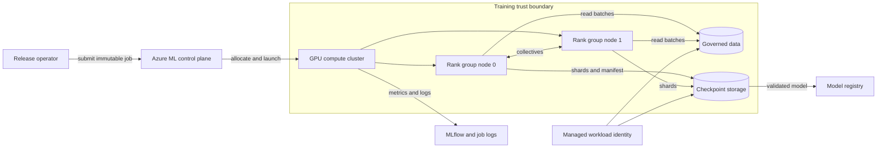

# ZeRO memory optimization

Training can fail before the first optimizer step even when a cluster has enough aggregate memory.

The failure occurs because ordinary data parallelism places a complete copy of model state on every GPU.

Adding replicas increases aggregate memory but does not make that memory available to one replica.

Zero Redundancy Optimizer (ZeRO) changes ownership of training state inside a data-parallel group.

It partitions optimizer state, gradients, and eventually parameters instead of replicating all three.

The result is a memory and communication design, not a switch that removes every bottleneck.

ZeRO makes training state available by changing who owns it, not by making the state disappear. When a rank needs a partition it does not own, the system must communicate or materialize that state at a defined point in the training step. The useful design trade-off is therefore between per-rank memory relief, collective bandwidth, temporary buffers, and recovery complexity.

This chapter derives the memory model, explains each ZeRO stage, and designs a recoverable production job.

## Learning objectives

After this chapter, you should be able to:

- account for parameters, gradients, optimizer state, activations, and buffers;
- derive approximate per-rank memory for ZeRO stages 1, 2, and 3;
- explain reduce-scatter, all-gather, and parameter materialization;
- select a stage from measured memory and communication constraints;
- reason about CPU and NVMe offload as bandwidth systems;
- tune buckets without hiding an out-of-memory condition;
- map data-parallel groups onto a physical network topology;
- design sharded checkpoints, restart, and consolidation;
- distinguish DeepSpeed framework behavior from Azure orchestration;
- secure and observe a distributed training job.

## The costly failure

Assume a team reserves 64 GPUs for a multi-day run.

The model initializes, but Adam state allocation causes an out-of-memory error.

The team reduces sequence length until the model fits.

That workaround changes the workload and may defeat the training objective.

A second team enables stage 3 without measuring communication.

The model fits, but parameter gathers cross a slow inter-node link on nearly every layer.

GPU utilization falls and cost per trained token rises.

Both teams treated aggregate GPU memory as if it were a single pool.

Distributed memory is useful only when ownership and transfer schedules make it reachable in time.

## Vocabulary

A **parameter** is a learned tensor updated by the optimizer.

A **gradient** is the derivative of loss with respect to a parameter.

An **optimizer state** is persistent state used to compute an update.

Adam commonly maintains first and second moment estimates for every parameter.

A **master weight** is a higher-precision parameter copy used by some mixed-precision implementations.

An **activation** is an intermediate forward-pass value needed by backward computation.

A **rank** is one distributed process, commonly bound to one GPU.

A **data-parallel group** is the set of ranks that process different samples for one logical model replica.

A **collective** is a coordinated communication operation involving every rank in a process group.

A **shard** is the subset of a tensor or state owned by one rank.

**Offload** moves selected state or computation from GPU memory to CPU memory or NVMe storage.

## System invariants

State these invariants before selecting a framework configuration.

After every committed optimizer step, all ranks represent the same logical model version.

Every parameter has exactly one authoritative optimizer-state owner within its data-parallel group.

A rank never computes with a partial parameter when an operator requires the complete parameter.

A failed step is either replayed from its beginning or excluded from the committed step count.

A published checkpoint contains one mutually consistent model, optimizer, scheduler, and data position.

A checkpoint is not restorable until every required shard and its checksum appear in a committed manifest.

Secrets and storage credentials never enter model files, framework configuration, or logs.

Changing world size never silently changes global batch size or the data sample order.

## Requirements for the worked system

The worked design trains a 20-billion-parameter dense transformer.

Parameters and gradients use 16-bit storage where the framework permits it.

Adam moments and master weights use 32-bit storage in the planning model.

The job uses 32 GPUs arranged as four eight-GPU nodes.

The global batch is 512 sequences.

The target is at least 45 percent model floating-point utilization after warm-up.

The job must survive loss of one worker by restarting from a checkpoint less than 20 minutes old.

Checkpoint publication must complete within 5 minutes without corrupting a previous checkpoint.

The recovery point objective (RPO) is 20 minutes of training progress.

The recovery time objective (RTO) is 30 minutes from failure detection to resumed steps.

Only the training identity may read governed data and write checkpoint objects.

Operators may inspect metrics but may not read restricted training records.

## Baseline training memory

Let $P$ be the parameter count.

Let $b_p$, $b_g$, and $b_o$ be bytes per parameter for parameters, gradients, and optimizer-related state.

Ignoring activations and temporary buffers, replicated model-state memory is:

$$
M_{state}=P(b_p+b_g+b_o)
$$

For a common mixed-precision planning model:

- 16-bit parameter: 2 bytes;
- 16-bit gradient: 2 bytes;
- 32-bit master parameter: 4 bytes;
- 32-bit Adam first moment: 4 bytes;
- 32-bit Adam second moment: 4 bytes.

This gives $b_o=12$ bytes and approximately 16 bytes per parameter.

For $P=20$ billion:

$$
M_{state}=20\times10^9\times16=320\ GB
$$

This is a decimal capacity estimate, not an allocator guarantee.

Framework choices can omit a master copy, use different precision, or add metadata.

Measure the actual implementation before procurement.

## Memory beyond model state

Model-state arithmetic is only the lower bound.

Activations depend on microbatch size, sequence length, hidden width, layer count, and checkpointing policy.

Attention can create sequence-length-sensitive intermediates.

Fused kernels reserve workspaces.

Collectives use communication buckets.

The caching allocator can hold reserved but currently unused blocks.

Fragmentation can prevent one large allocation despite adequate total free bytes.

Plan a headroom fraction $h$:

$$
M_{required}=M_{state}+M_{activation}+M_{temporary}+M_{communication}+h
$$

A useful acceptance test records both allocated and reserved memory at the peak layer.

## Why data parallelism alone does not help

Classic distributed data parallelism copies the complete model onto each rank.

Each rank computes gradients from different samples.

The ranks synchronize gradients before applying equivalent updates.

Azure Machine Learning describes this replica behavior and notes that the complete model must fit on each worker in ordinary data parallelism ([Microsoft Learn](https://learn.microsoft.com/azure/machine-learning/concept-distributed-training)).

Thirty-two replicas therefore provide throughput, not 32 times the memory for one replica.

ZeRO keeps data-parallel computation but partitions redundant state.

## ZeRO stage 1

Stage 1 partitions optimizer state across $D$ data-parallel ranks.

Parameters and gradients remain replicated.

Each rank updates only its owned parameter partition.

Updated parameter partitions must then become visible to every replica.

DeepSpeed defines stage 1 as partitioning Adam moments and 32-bit weights across processes ([DeepSpeed ZeRO tutorial](https://www.deepspeed.ai/tutorials/zero/)).

The approximate per-rank model-state memory is:

$$
M_{Z1}=P\left(b_p+b_g+\frac{b_o}{D}\right)
$$

With $D=32$ and the 16-byte planning model:

$$
M_{Z1}=20\times10^9\left(2+2+\frac{12}{32}\right)=87.5\ GB
$$

Stage 1 does not fit this example on an 80 GB GPU before activations.

It may still be the best stage for a smaller model because it changes less communication behavior.

## ZeRO stage 2

Stage 2 partitions optimizer state and reduced gradients.

Parameters remain replicated.

A reduce-scatter combines gradient contributions while delivering only each owner's gradient shard.

The owner applies the optimizer update to its parameter shard.

The updated parameter shards are shared so replicas begin the next step consistently.

DeepSpeed specifies that stage 2 retains only gradients corresponding to each process's optimizer partition ([DeepSpeed ZeRO tutorial](https://www.deepspeed.ai/tutorials/zero/)).

Approximate per-rank state memory becomes:

$$
M_{Z2}=P\left(b_p+\frac{b_g+b_o}{D}\right)
$$

For the worked model:

$$
M_{Z2}=20\times10^9\left(2+\frac{2+12}{32}\right)=48.75\ GB
$$

That leaves about 31.25 GB on an 80 GB device for activations, buffers, and headroom.

Stage 2 is therefore the first plausible candidate for this workload.

## ZeRO stage 3

Stage 3 partitions parameters, gradients, and optimizer state.

No rank permanently owns a complete parameter set.

Before a module computes, ranks gather the parameter shards required by that module.

After use, parameters can be released or repartitioned.

Backward computation repeats the materialization pattern where required.

DeepSpeed states that stage 3 automatically collects and partitions 16-bit parameters during forward and backward passes ([DeepSpeed ZeRO tutorial](https://www.deepspeed.ai/tutorials/zero/)).

The idealized persistent state is:

$$
M_{Z3}=\frac{P(b_p+b_g+b_o)}{D}
$$

For the worked model:

$$
M_{Z3}=\frac{320}{32}=10\ GB
$$

Peak memory is higher because live gathered parameters, prefetch buffers, activations, and workspaces coexist.

Stage 3 trades persistent memory for repeated communication and a more complex tensor lifecycle.

## Comparing state ownership


Credits: Hazem Ali

The image shows the essential progression.

Stage 1 removes redundant optimizer copies.

Stage 2 also removes redundant retained gradients.

Stage 3 removes redundant persistent parameters and materializes working sets on demand.

The diagram does not imply that activations are automatically partitioned.

Activation checkpointing, sequence parallelism, or model parallelism addresses different memory terms.

ZeRO changes which rank retains persistent state, but the computation still requires the state to be present at the moment an operator consumes it. Higher stages exchange retained replicas for an on-demand materialization schedule, so a memory saving becomes a communication dependency. This is why stage selection cannot start from parameter count alone: the relevant trade-off is whether the fabric can deliver the required shard before the GPU would otherwise compute, while leaving room for activations and communication buffers.

## Collective communication from first principles

An all-reduce combines values from all ranks and returns the complete result to all ranks.

A reduce-scatter combines values but returns only one result partition to each rank.

An all-gather starts with one partition per rank and returns the concatenated result to every rank.

For a ring collective over $D$ ranks and message size $M$, an approximate per-rank transfer is:

$$
V_{reduce\text{-}scatter}\approx\frac{D-1}{D}M
$$

$$
V_{all\text{-}gather}\approx\frac{D-1}{D}M
$$

Their sum is comparable to a ring all-reduce:

$$
V_{all\text{-}reduce}\approx2\frac{D-1}{D}M
$$

Volume alone does not predict latency.

Many small collectives pay repeated launch and synchronization costs.

One huge collective can delay overlap and increase peak buffer memory.

Collective choice also determines how failure recovery identifies authoritative state. A reduce-scatter leaves each rank with only its owned result partition, so a restart cannot reconstruct a committed step from one surviving rank's local memory. A recoverable job instead publishes the complete shard set with its topology and optimizer-step identity, then restores all ranks from that common boundary. The communication protocol and checkpoint protocol therefore have the same correctness concern: no rank may treat a partially exchanged or partially published state as the next logical model version.

## Buckets and overlap

A bucket groups tensors into a collective operation.

Larger buckets improve bandwidth efficiency when launch overhead dominates.

They also consume more memory and may become ready late in backward computation.

Smaller buckets can begin earlier but increase operation count.

`overlap_comm` attempts to run communication while independent computation continues.

Overlap is useful only when the dependency graph exposes enough computation.

Measure exposed communication time rather than assuming all bytes are hidden.

Tune one bucket dimension at a time.

Record step time, collective duration, peak reserved memory, and straggler spread.

## A bandwidth bound

Let exposed communication volume per rank be $V_e$.

Let effective link bandwidth be $B_e$.

The communication lower bound is:

$$
T_{comm}\geq\frac{V_e}{B_e}
$$

If 20 GB remains exposed over an effective 25 GB/s path:

$$
T_{comm}\geq\frac{20}{25}=0.8\ s
$$

A 1.2-second compute phase cannot produce a 1.2-second step if 0.8 seconds remains exposed.

Effective bandwidth must come from traces, not a network adapter's nominal rate.

## Topology mapping

Intra-node accelerator fabrics usually offer lower latency and higher bandwidth than inter-node paths.

Keep the communication-heavy group inside a node where the parallelism design permits it.

For pure ZeRO over 32 ranks, the data-parallel group spans all four nodes.

For a composed design, tensor-parallel ranks might remain within each node while ZeRO partitions across replicas.

Group membership must match the framework's actual state partitioning.

Azure Machine Learning can launch native PyTorch and DeepSpeed distributed jobs, while the training framework initializes process groups and implements the algorithms ([Microsoft Learn](https://learn.microsoft.com/azure/machine-learning/how-to-train-distributed-gpu)).

Azure sets distributed environment values for configured PyTorch jobs, including rank and world-size information ([Microsoft Learn](https://learn.microsoft.com/azure/machine-learning/how-to-train-distributed-gpu)).

This orchestration does not mean Azure Machine Learning itself implements ZeRO.

## CPU offload

CPU offload places optimizer state, optimizer computation, or parameters in host memory.

It creates a pipeline across GPU memory, the host interconnect, CPU memory, and CPU cores.

DeepSpeed's ZeRO-Offload configuration can move optimizer work to CPU at stage 2 ([DeepSpeed ZeRO-Offload tutorial](https://www.deepspeed.ai/tutorials/zero-offload/)).

The capacity benefit is real only if host memory accommodates the state plus process overhead.

The throughput cost depends on transfer bytes, effective host-link bandwidth, and CPU optimizer speed.

For $V_h$ bytes transferred each step over bandwidth $B_h$:

$$
T_{host}\geq\frac{V_h}{B_h}
$$

Pinned host buffers can improve transfer behavior but consume nonpageable memory.

NUMA placement matters because a rank can otherwise traverse a remote CPU socket.

## NVMe offload

NVMe offload extends capacity beyond host memory.

It also adds storage queueing, filesystem behavior, and device endurance to the step path.

DeepSpeed documents ZeRO-Infinity as stage 3 offload to CPU and NVMe ([DeepSpeed ZeRO tutorial](https://www.deepspeed.ai/tutorials/zero/)).

Treat advertised sequential bandwidth as an upper bound.

Concurrent ranks, small requests, and checkpoint writes share the device.

Prefetch must deliver a tensor before its operator becomes runnable.

If not, GPU execution stalls on storage.

Reserve NVMe offload for a measured capacity problem that faster memory cannot solve economically.

## Configuration example

The following framework configuration is an example starting point, not an Azure service setting:

```json
{
  "bf16": {"enabled": true},
  "train_micro_batch_size_per_gpu": 2,
  "gradient_accumulation_steps": 8,
  "zero_optimization": {
    "stage": 2,
    "contiguous_gradients": true,
    "overlap_comm": true,
    "reduce_scatter": true,
    "reduce_bucket_size": 200000000,
    "allgather_bucket_size": 200000000
  },
  "gradient_clipping": 1.0
}
```

DeepSpeed exposes ZeRO under the `zero_optimization` configuration and documents stage and bucket options ([DeepSpeed ZeRO tutorial](https://www.deepspeed.ai/tutorials/zero/)).

Validate field support against the pinned DeepSpeed version.

Store the exact configuration with the run metadata.

## Azure job boundary

An Azure Machine Learning command job can request multiple instances and a process count per instance for distributed PyTorch execution ([Microsoft Learn](https://learn.microsoft.com/azure/machine-learning/how-to-train-distributed-gpu)).

The environment must pin framework, CUDA, communication library, and extension versions.

The training script loads the DeepSpeed configuration and owns ZeRO behavior.

Azure Machine Learning owns job submission, compute allocation, process launch integration, and job records.

Do not put framework tuning fields into an architecture claim about the orchestration service.

## Production architecture



The control plane starts the job but does not participate in every collective.

Ranks exchange model state on the training network.

Storage is outside the synchronous step path except for data reads, checkpoints, and optional offload.

The registry receives a validated artifact, not an arbitrary live shard directory.

Azure Machine Learning supports MLflow logging of metrics, parameters, and artifacts for jobs ([Microsoft Learn](https://learn.microsoft.com/azure/machine-learning/how-to-log-view-metrics)).

## Step flow

1. The sampler assigns a deterministic microbatch to every data-parallel rank.
2. Each rank materializes the parameters required for the next operator.
3. The forward pass computes activations and loss.
4. The backward pass computes parameter gradients in reverse dependency order.
5. Ready gradient buckets enter all-reduce or reduce-scatter according to the ZeRO stage.
6. Each optimizer owner updates its assigned parameter partition.
7. Updated parameters are replicated or remain partitioned according to the stage.
8. Every rank crosses the step commit boundary.
9. The data cursor and scheduler advance exactly once.
10. Metrics record committed step time, not partial failed work.

## Checkpoint contents

A resumable checkpoint needs more than inference weights.

It contains parameter shards.

It contains optimizer shards and precision-specific master state.

It contains learning-rate scheduler state.

It contains random number generator state for each rank or stream.

It contains gradient-scaler state when dynamic loss scaling is used.

It contains the committed global step and consumed-sample position.

It records world size, group topology, framework version, and configuration hash.

It records a checksum and byte length for every shard.

## Atomic publication

Ranks first write into a unique staging prefix.

Each rank reports its shard metadata to a coordinator.

The coordinator verifies expected rank coverage and checksums.

It writes a manifest that references only complete immutable objects.

It finally writes a small commit marker or updates an atomic catalog pointer.

Readers ignore staging prefixes and manifests without a commit marker.

Never overwrite the last known-good checkpoint in place.

## Stage 3 checkpoint consequences

A normal stage 3 state dictionary can contain placeholders because parameters remain partitioned.

DeepSpeed documents an option to gather 16-bit weights during save and an offline `zero_to_fp32.py` consolidation path ([DeepSpeed ZeRO tutorial](https://www.deepspeed.ai/tutorials/zero/)).

Online gathering can require substantial GPU memory and time.

Offline consolidation transfers cost to CPU memory and a postprocessing job.

The resumable sharded checkpoint and the portable inference artifact should therefore be separate products.

Register only after consolidation and validation succeed.

Azure Machine Learning model registration can create lineage from a job output URI ([Microsoft Learn](https://learn.microsoft.com/azure/machine-learning/how-to-manage-models)).

## Restart and world-size changes

The simplest restart uses the same world size and rank mapping.

Each rank reads the shard layout expected by the framework.

Elastic restart may require repartitioning optimizer and parameter state.

Do not assume every framework version supports every source and target world size.

A restart preflight should compare checkpoint format, stage, partition count, model schema, and software versions.

Recompute gradient accumulation if data-parallel degree changes and global batch must remain constant.

Reject a resume when the data cursor cannot be mapped deterministically.

## Stragglers and hangs

Collectives complete at the pace of the slowest participating rank.

A rank delayed by data loading, CPU offload, thermal throttling, or storage stalls delays all peers.

Report per-rank data wait, forward, backward, optimizer, and collective durations.

Track the maximum, median, and spread rather than rank-zero time alone.

A hang detector should capture the last collective name, tensor size, peer group, and stack trace.

Timeouts must exceed healthy checkpoint or compilation pauses but remain below the RTO budget.

Restart the whole consistency group unless the framework explicitly supports rank replacement.

## Backpressure

The input pipeline must not accumulate unbounded prefetched batches.

Bound CPU queues by batch count and bytes.

Pause data readers when GPU consumers fall behind.

Checkpoint uploads need a bounded concurrency separate from the training data channel.

Asynchronous metric logging must also have a bounded queue and a flush policy.

Azure Machine Learning recommends asynchronous MLflow metric logging for large jobs and waits for pending metrics when a job finishes ([Microsoft Learn](https://learn.microsoft.com/azure/machine-learning/how-to-log-view-metrics)).

Metrics must never be allowed to consume the memory headroom reserved for a training step.

## Security design

Classify raw training data, checkpoints, logs, and released models separately.

Raw records may contain regulated or confidential content.

Optimizer state can preserve information and deserves the same classification as model weights.

Use a workload identity with read access to the approved data version and write access only to its run prefix.

Separate checkpoint deletion authority from checkpoint write authority.

Use private network paths for data and checkpoint storage where the services support them.

Disable public access only after private DNS and recovery access have been tested.

Encrypt transport and storage, and control customer-managed keys according to the organization's threat model.

Never serialize access tokens, connection strings, environment dumps, or secret-bearing command lines.

Audit job submission, identity changes, role assignments, data reads, checkpoint writes, and model registration.

## Observability contract

Record tokens per second and samples per second.

Record total, allocated, reserved, and peak GPU memory per rank.

Record time in forward, backward, optimizer, data wait, and checkpoint phases.

Record collective type, bytes, duration, and process group.

Record host memory, CPU utilization, NUMA locality, and host-link throughput for offload.

Record NVMe queue depth, read latency, write latency, and bandwidth for NVMe offload.

Record loss, gradient norm, skipped updates, and loss-scale changes.

Record rank restarts, time since last committed checkpoint, and restore duration.

Use run tags for model version, data version, Git commit, environment digest, ZeRO stage, and configuration hash.

Azure Machine Learning job logs include user stdout and stderr per process and system-generated logs for diagnosis ([Microsoft Learn](https://learn.microsoft.com/azure/machine-learning/how-to-log-view-metrics)).

## Failure modes and responses

**Out of memory during initialization:** construct parameters under a partition-aware initialization path or select a less replicated design.

**Out of memory during a late layer:** reduce the live parameter window, activation memory, or bucket size based on a memory trace.

**Collective timeout:** identify the first missing rank and its last completed operation before increasing the timeout.

**Slow stage 3:** inspect parameter gather placement and exposed communication across node boundaries.

**CPU offload stall:** measure host-link traffic, CPU optimizer time, memory pressure, and NUMA placement.

**Checkpoint missing shards:** leave it uncommitted and resume from the previous manifest.

**Different loss after resume:** compare RNG state, data cursor, scheduler step, precision state, and global batch.

**Storage throttling:** limit upload concurrency, increase checkpoint interval within RPO, or provision a separate path.

**One rank reports NaN:** stop the consistency group, preserve diagnostics, and do not let healthy ranks commit the step.

## Disaster recovery

Replicate committed checkpoints according to the required regional failure model.

Replication is not a substitute for a valid manifest.

Keep framework images, source revisions, configuration, and data-version references recoverable with the checkpoint.

Test restoration on clean compute rather than only checking object existence.

Measure time to allocate replacement capacity because quota and capacity can dominate RTO.

Maintain a portable consolidated model less frequently than resumable optimizer checkpoints.

Document whether recovery may use a different GPU type and what numerical drift is acceptable.

Run a scheduled restore drill and compare the next several losses against a control resume.

## Cost model

Let $N$ be GPU count, $C_g$ cost per GPU-hour, and $T$ training hours.

Compute cost is approximately:

$$
C_{compute}=N\times C_g\times T
$$

A higher ZeRO stage can enable fewer or smaller-memory GPUs but increase $T$ through communication.

Let checkpoint storage be $S_c$ GB, retained copies be $R$, and storage price be $C_s$ per GB-month:

$$
C_{storage}=S_c\times R\times C_s
$$

Add operation, transfer, logging, and replicated-storage charges.

Compare designs by cost to a validated model, not hourly GPU price.

## Alternatives and trade-offs

Use classic data parallelism when the complete state fits with comfortable headroom.

It has simpler checkpointing and fewer parameter lifecycle surprises.

Use ZeRO stage 1 when optimizer memory is the binding term.

Use stage 2 when gradients and optimizer state bind but replicated parameters fit.

Use stage 3 when parameter replication itself is unacceptable.

Use activation checkpointing when activations, not persistent state, dominate.

Use tensor or pipeline parallelism when individual operators or model partitions must be divided.

Use parameter-efficient fine-tuning when the task does not require updating every base parameter.

Use CPU or NVMe offload only after proving that added transfer latency meets the throughput target.

## Design review checklist

- Is every memory term measured in the pinned framework version?
- Does the selected stage solve the binding term rather than a different one?
- Are data-parallel groups and physical links documented?
- Do bucket experiments include peak memory and exposed communication?
- Can the host sustain offload capacity, bandwidth, and CPU demand?
- Does the global batch remain invariant after a topology change?
- Does a checkpoint include every state needed for deterministic continuation?
- Is publication atomic and is the previous checkpoint preserved?
- Has a clean restore been timed against RPO and RTO?
- Are portable model artifacts separated from resumable shards?
- Can each rank's logs and communication metrics be correlated?
- Are data, checkpoints, logs, and models classified and access-controlled?
- Does the architecture state that ZeRO belongs to the framework?

## Hands-on exercise

Design ZeRO for a 40-billion-parameter model on 64 GPUs with 80 GB each.

Assume the 16-byte mixed-precision Adam planning model used in this chapter.

Assume activations, workspaces, and safety headroom require 28 GB per rank.

First, calculate replicated state memory.

Then calculate idealized stage 1, stage 2, and stage 3 state memory for $D=64$.

Identify the least aggressive stage that fits under 52 GB of state memory.

Draw the ownership of one parameter, its gradient, and its two Adam moments across eight representative ranks.

Specify which collectives occur during backward and update.

Estimate the lower-bound transfer time for 30 GB of exposed traffic at 20 GB/s effective bandwidth.

Create two DeepSpeed configurations that differ only in reduce bucket size.

Define an experiment table with peak reserved memory, step time, collective count, exposed communication, and tokens per second.

Design a checkpoint manifest with shard name, rank, state category, bytes, checksum, global step, data cursor, and software digest.

Inject a failure after seven of eight representative shards upload.

Show why the incomplete prefix is ignored and which prior checkpoint resumes.

Change the restart world size from 64 to 32.

State what must be repartitioned and how accumulation changes to preserve global batch.

Add least-privilege permissions for data read, checkpoint write, checkpoint delete, and model registration as four separate duties.

Finally, write an acceptance decision that selects a stage using measured evidence rather than model size alone.

## What, why, and how

ZeRO is a framework mechanism that partitions redundant training state inside a data-parallel group.

It is needed when replicated state exceeds per-GPU memory or leaves too little room for useful batches.

It works by assigning state ownership, replacing some all-reduce behavior with partitioned collectives, and materializing parameters when required.

The production design succeeds only when memory savings, communication, checkpoint consistency, identity, and recovery are engineered together.