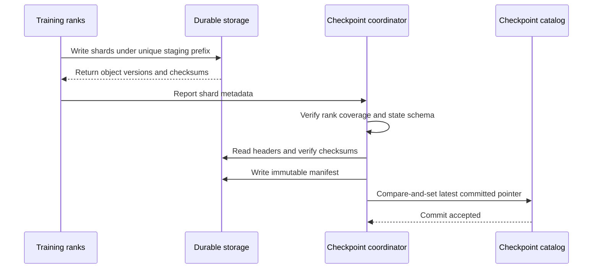
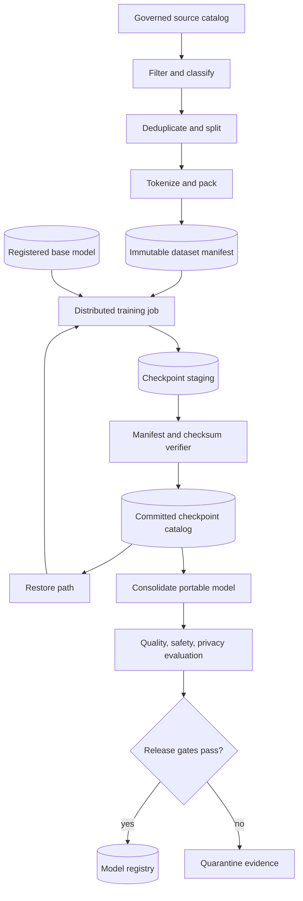

# Continuous pretraining and checkpoints

A pretrained model is not finished merely because one training run ended.

Language, products, policies, and domain knowledge continue to change.

Continuous pretraining updates a base model with additional unlabeled or self-supervised corpus data.

The difficult part is not submitting another GPU job.

It is proving which data changed the model, resuming without skipping or duplicating work, and publishing a coherent checkpoint.

The lifecycle is a chain of evidence. Dataset version and ordering explain what the model saw, training configuration explains how it changed, and a committed checkpoint explains exactly what a later worker can resume. Without that chain, a successful-looking run cannot be reproduced, compared, or safely promoted when a worker fails halfway through a distributed save.

This chapter designs that lifecycle from dataset authority through model registration.

## Learning objectives

After this chapter, you should be able to:

- distinguish continuous pretraining from supervised fine-tuning;
- define authoritative dataset versions and lineage;
- design deduplication, quality filtering, and curriculum stages;
- explain tokenizer compatibility and vocabulary changes;
- represent a deterministic distributed data cursor;
- design sharded checkpoints with manifests and checksums;
- calculate checkpoint bandwidth, storage, and recovery time;
- set retention from recovery and audit requirements;
- create evaluation and release gates;
- secure data, models, and operational metadata;
- map lifecycle records to Azure Machine Learning assets and jobs.

## The costly failure

A team resumes a month-long run from `checkpoint-latest`.

The path contains shards from two save attempts.

The model loads, but optimizer ranks no longer correspond to the parameter shards.

Loss diverges after several hundred steps.

Another team preserves the checkpoint but not the exact data order.

Its resume repeats ten billion tokens and silently changes the learning-rate schedule.

A third team produces a strong model but cannot identify which licensed corpus version it consumed.

It cannot defend or revoke the release.

These are state-management failures, not GPU failures.

## Vocabulary

**Pretraining** optimizes a general prediction objective over a broad corpus.

**Continuous pretraining** continues that objective from an existing model on additional or refreshed corpus data.

**Domain-adaptive pretraining** concentrates continued training on a domain such as law, medicine, or source code.

**Fine-tuning** adapts a model with a narrower task or instruction objective, often using labeled examples.

A **corpus** is the governed collection of source records used to create training sequences.

A **dataset version** is an immutable identity for a specific corpus composition and transformation contract.

A **tokenizer** maps source text to token identifiers consumed by the model.

A **data cursor** records the committed position in a deterministic sample stream.

A **checkpoint shard** is one file holding a partition of distributed training state.

A **manifest** lists the complete set of objects and metadata that form one checkpoint.

**Atomic publication** makes a checkpoint visible as a unit only after every required object is durable.

The **recovery point objective** (RPO) limits acceptable lost progress.

The **recovery time objective** (RTO) limits acceptable restoration time.

## Continuous pretraining versus fine-tuning

Continuous pretraining usually retains the base model's self-supervised next-token objective.

Its input can be enormous and weakly labeled.

It changes broad representations and can alter behavior across many downstream tasks.

Supervised fine-tuning (SFT) learns from input and desired-output pairs.

It targets behavior more directly and often uses fewer tokens.

Continuous pretraining is appropriate when the model lacks domain language, facts, or patterns.

SFT is appropriate when the model knows the domain but needs a response format or task policy.

Retrieval is preferable when knowledge must remain current, attributable, or removable without retraining.

These methods can be composed, but each must have its own dataset and evaluation lineage.

## System invariants

Every released model points to one immutable base model and one immutable training dataset version.

Every source record has a stable identifier before shuffling or tokenization.

No checkpoint is readable as complete until its manifest is committed.

The manifest names every required shard by checksum and byte length.

The data cursor advances only when the corresponding optimizer step commits.

A resume consumes the same next sample sequence as an uninterrupted run, within declared nondeterminism.

Tokenizer identity and vocabulary size match the model embedding tables.

Evaluation uses datasets excluded from training and deduplication leakage checks.

Deleting or quarantining a source record creates a new dataset version and a traceable remediation decision.

No training worker can alter historical source, dataset, or checkpoint versions.

## Measurable requirements

The worked system continues a 20-billion-parameter model for 500 billion tokens.

The aggregate training rate target is 2.5 million tokens per second.

The planned compute time is:

$$
T=\frac{500\times10^9}{2.5\times10^6}=200{,}000\ s\approx55.6\ hours
$$

The checkpoint RPO is 15 minutes.

The restore RTO is 25 minutes after replacement compute is available.

Checkpoint publication may consume at most 3 percent of wall-clock training time.

The dataset manifest must account for 100 percent of consumed token shards.

Every source must carry license, origin, collection time, classification, and retention metadata.

The release requires zero critical policy regressions and predefined quality thresholds.

The security team must be able to trace model, code, environment, data, evaluator, and approver identities.

## Dataset authority

The authoritative object is not a mutable folder called `latest`.

It is a signed or access-controlled manifest whose content determines the dataset.

The manifest references immutable source or derived objects.

Each entry includes a stable record or shard identifier.

Each entry includes a cryptographic checksum.

Each entry identifies transformation code and configuration.

The dataset version is derived from or explicitly bound to this manifest.

Azure Machine Learning data asset versions are immutable and support versioning, auditability, and job lineage ([Microsoft Learn](https://learn.microsoft.com/azure/machine-learning/how-to-create-data-assets)).

An asset is a governed reference, so the underlying storage layout must also prevent untracked mutation.

## Dataset manifest example

```json
{
  "dataset_id": "domain-corpus-2026-08-01",
  "schema_version": 3,
  "created_at": "2026-08-01T18:30:00Z",
  "tokenizer_digest": "sha256:8a5c...",
  "transform_digest": "sha256:31ef...",
  "curriculum": ["general", "domain", "high-quality"],
  "shards": [
    {
      "uri": "corpus/v7/tokens/part-00000.bin",
      "sha256": "d418...",
      "bytes": 4294967296,
      "tokens": 1073741824,
      "classification": "confidential",
      "license_set": ["approved-domain-license"]
    }
  ]
}
```

The manifest must not contain a storage key or shared access token.

The job identity resolves authorized object paths at runtime.

## Source intake and classification

Intake starts before tokenization.

Assign every source a legal basis and permitted use.

Record whether model training, redistribution, and derivative use are allowed.

Classify personal, regulated, confidential, public, and synthetic data.

Quarantine unknown-license records rather than treating absence of metadata as approval.

Scan for secrets and credentials before content reaches durable training storage.

Preserve source-level lineage even when derived records are packed into large binary shards.

This mapping is needed for investigations and removal requests.

## Quality filtering

Filtering rejects malformed, empty, corrupt, or policy-disallowed records.

Language detection can route content to appropriate quality models.

Heuristics can identify repeated navigation, generated spam, or encoding damage.

Model-based filters can help, but their versions and thresholds become part of lineage.

Do not collapse quality into one opaque score.

Retain reason codes such as `duplicate`, `unsupported_license`, `secret`, or `low_language_confidence`.

Measure acceptance rate by source and classification.

Sudden changes indicate source drift or a broken filter.

## Deduplication

Exact deduplication hashes a normalized record or document.

Near-duplicate detection compares fingerprints such as token shingles or locality-sensitive hashes.

Document-level deduplication does not guarantee paragraph-level uniqueness.

Aggressive normalization can merge records whose distinctions matter.

Weak normalization can leave templates and mirrors overrepresented.

Define the equivalence relation explicitly.

Apply leakage checks between training and every evaluation set.

Record the chosen representative and all suppressed record identifiers.

This preserves an audit trail without training on every copy.

## Mixtures and curriculum

A corpus mixture assigns sampling weights to sources or domains.

Weights need not equal raw byte proportions.

High-volume low-quality sources can otherwise dominate the objective.

A curriculum changes the mixture or sequence-length distribution over training phases.

Represent each phase as data, not hidden control flow.

```yaml
phases:
  - name: broad-domain
    start_token: 0
    end_token: 300000000000
    mixture: {general: 0.55, domain: 0.35, code: 0.10}
  - name: quality-upsample
    start_token: 300000000000
    end_token: 500000000000
    mixture: {general: 0.25, domain: 0.60, code: 0.15}
```

The curriculum hash belongs in every checkpoint.

## Tokenization

Tokenization determines sequence boundaries, token counts, and embedding indices.

Changing normalization or tokenizer code changes the training data even if source text is unchanged.

Keep tokenizer model files immutable.

Record tokenizer code version, vocabulary checksum, special-token mapping, and normalization rules.

Sample and decode tokenized records as a quality check.

Verify that reserved control tokens cannot be synthesized unintentionally from source text.

If vocabulary grows, resize embedding and output layers deliberately.

Define initialization for new rows and compatibility for old token IDs.

Treat this as a model-schema migration, not an incidental data change.

## Packing and boundaries

Packing combines shorter records into fixed-length training sequences.

It improves accelerator utilization by reducing padding.

It can also join unrelated records in one context.

Insert explicit end-of-document tokens where the objective requires boundaries.

Record whether attention may cross document boundaries.

Avoid splitting sensitive source identifiers into model-visible metadata.

The packer must be deterministic for a given ordered record stream and configuration.

Its remainder buffer is part of resumable data state.

## The deterministic data cursor

A byte offset alone is insufficient for distributed shuffled training.

The next sample can depend on dataset version, epoch, shard permutation, rank, worker count, and packer state.

A cursor should record the logical stream, not merely a local file position.

```json
{
  "dataset_version": "domain-corpus-2026-08-01",
  "epoch": 2,
  "global_sample_index": 918552576,
  "shuffle_seed": 441903,
  "curriculum_phase": "quality-upsample",
  "consumed_tokens": 340118225920,
  "packer_remainder_digest": "sha256:bb21...",
  "committed_step": 332146
}
```

Store enough state to reconstruct rank-local assignments after a same-size restart.

For elastic restart, define how the global stream is repartitioned without duplication.

The cursor is part of optimizer correctness because samples affect gradients before the step becomes durable. If a worker records a later input position before the distributed update commits, recovery can skip data even though the associated model change never existed. Conversely, replaying the last uncommitted logical batch is acceptable when the cursor and optimizer step advance as one transaction. This distinction separates harmless temporary prefetch from authoritative training progress.

## Commit semantics

An optimizer step reads one logical batch and proposes a model update.

The step becomes committed only after every participating rank completes the update.

The global step, scheduler, and data cursor advance together.

If a rank fails before that boundary, replay the batch.

At-least-once sample processing is acceptable only if the optimizer update is exactly-once at the logical step level.

Do not advance the cursor when samples are prefetched.

Prefetch ownership is temporary and can be discarded after failure.

## Checkpoint state

A continuous-pretraining checkpoint includes model parameters.

It includes optimizer moments and precision master state.

It includes scheduler position and gradient-scaler state.

It includes random number generator state by rank and library.

It includes the deterministic data cursor and packer remainder.

It includes distributed topology and partition metadata.

It includes tokenizer, dataset, curriculum, code, and environment digests.

It includes metric summaries useful for selecting a recovery point.

An inference-only weight file is not a resumable checkpoint.

## Sharded checkpoint architecture


Credits: Hazem Ali

The image separates authoritative data, temporary worker state, durable checkpoint objects, and released models.

Worker failure does not mutate the dataset version.

Restore reads a committed manifest and returns to its data cursor.

Evaluation occurs after artifact consolidation and before registration.

## Checkpoint manifest

```json
{
  "format": "distributed-checkpoint/v2",
  "run_id": "cpt-domain-20260801",
  "global_step": 332146,
  "world_size": 64,
  "dataset_version": "domain-corpus-2026-08-01",
  "cursor_sha256": "8cda...",
  "state_schema_sha256": "413b...",
  "shards": [
    {
      "rank": 0,
      "kind": "model-optimizer",
      "path": "staging/332146/rank-00000.bin",
      "bytes": 9126805504,
      "sha256": "a230..."
    }
  ],
  "status": "complete"
}
```

The manifest schema must identify optional and required shard kinds.

Readers reject unknown required fields or unsupported format versions.

## Atomic publication protocol



The unique prefix prevents two save attempts from mixing files.

The coordinator knows the expected shard set from the topology and checkpoint schema.

The catalog pointer changes only after verification.

A failed compare-and-set leaves both immutable manifests available while preserving one authoritative latest pointer.

The previous committed checkpoint remains untouched.

The manifest acts as the recovery decision point rather than as an inventory file. It binds the shards, topology, cursor, and step number that must be loaded together, so a restorer never combines a new model shard with an older optimizer shard simply because both objects are visible in storage. Keeping the earlier committed manifest also makes a failed save a capacity and time loss rather than a corruption event: recovery selects the latest validated state and replays only the bounded interval allowed by the RPO.

## Checksums and validation

A transport success response does not prove semantic completeness.

Record byte length and a cryptographic checksum for each object.

Validate checksums after upload or through trusted storage metadata with an explicit threat model.

Validate tensor names, shapes, dtypes, and partition coverage before declaring completion.

Validate that the cursor's committed step equals model and scheduler step.

During restore, reject partial or duplicate parameter coverage.

Run a lightweight forward pass after loading.

For high-value checkpoints, run several resumed steps and compare loss against a controlled branch.

## Storage bandwidth calculation

Let checkpoint size be $S$ bytes and allowed save duration be $T_s$ seconds.

Required aggregate sustained write bandwidth is:

$$
B_{write}=\frac{S}{T_s}
$$

For a 1.2 TB sharded checkpoint and a 300-second target:

$$
B_{write}=\frac{1200\ GB}{300\ s}=4\ GB/s
$$

This is payload bandwidth before retries, checksums, metadata operations, and contention.

If 64 ranks write evenly, the ideal average is 62.5 MB/s per rank.

Skew and small files can make the aggregate target fail despite adequate nominal capacity.

Measure the p95 shard completion time and the slowest rank.

## Checkpoint interval

With failure rate $\lambda$ per hour and checkpoint interval $I$ hours, expected lost work per failure is approximately $I/2$ under uniformly timed failures.

Shorter intervals reduce lost work but increase write overhead.

If each save pauses exposed training for $t_s$ seconds, overhead fraction is approximately:

$$
H=\frac{t_s}{I\times3600}
$$

For 45 seconds exposed every 15 minutes:

$$
H=\frac{45}{900}=5\%
$$

That violates the worked system's 3 percent requirement.

The team must improve overlap, bandwidth, or the RPO trade-off.

## Storage layout

Use immutable run and step prefixes.

Separate staging, committed manifests, portable models, and evaluation reports.

```text
training/
  runs/cpt-domain-20260801/
    staging/step-00332146-attempt-02/
    checkpoints/step-00332146/manifest.json
    cursors/step-00332146.json
    evaluations/step-00332146/
    exports/model-00332146/
```

Do not list a large container to discover the latest checkpoint during recovery.

Read a small authoritative catalog record.

Azure Blob versioning creates immutable versions on supported write operations and preserves previous versions, but it does not replace an application-level multi-object commit protocol ([Microsoft Learn](https://learn.microsoft.com/azure/storage/blobs/versioning-overview)).

## Retention policy

Retention serves recovery, comparison, audit, and legal needs.

Keep dense recent checkpoints for operational recovery.

Keep sparse milestone checkpoints for long-term reproducibility.

Keep every released model's source checkpoint for the required audit period.

Delete abandoned staging prefixes after a safety delay.

Never let cleanup infer completion from path names alone.

Protect catalog and manifests more strongly than disposable staging objects.

Azure Blob lifecycle management can move older block blob versions to lower-cost tiers or delete them according to policy ([Microsoft Learn](https://learn.microsoft.com/azure/storage/blobs/versioning-overview)).

Blob versioning adds capacity cost and Microsoft recommends keeping fewer than 1,000 versions per blob to avoid listing latency concerns ([Microsoft Learn](https://learn.microsoft.com/azure/storage/blobs/versioning-overview)).

Use new immutable checkpoint paths rather than repeatedly overwriting one giant blob.

## Restore flow

1. Select a committed checkpoint by policy, not by newest timestamp alone.
2. Fetch the immutable manifest and verify its signature or access-controlled origin.
3. Confirm format, software, model schema, tokenizer, and world-size compatibility.
4. Allocate ranks and reconstruct process groups.
5. Download or stream the shard assigned to each rank.
6. Verify every checksum before deserialization.
7. Restore model, optimizer, scheduler, scaler, and random states.
8. Reconstruct the deterministic sample stream from the cursor.
9. Run a forward validation and optional shadow step.
10. Emit a restore-complete event before committing new work.

## World-size changes

A checkpoint partitioned for 64 ranks may not map directly to 32 ranks.

Repartitioning must reconstruct each logical tensor and divide it under the new topology.

Optimizer state must follow its corresponding parameter elements.

Random streams need a declared remapping policy.

The global batch must remain stable unless the optimization change is intentional.

If data-parallel degree halves, gradient accumulation may need to double.

The data cursor should be based on a global sample stream so ownership can be reassigned.

Test supported source and target sizes before relying on elastic recovery.

## Dataset updates during a run

Do not mutate the active dataset version.

New records form a candidate next version.

Run quality, license, deduplication, and leakage gates on that candidate.

A policy may permit switching only at a checkpoint boundary.

Such a switch creates a new training phase with an explicit manifest reference.

Record the exact committed step where the phase changed.

If mid-run updates are not required, finish against one version and start a new run.

Simplicity improves reproducibility.

## Evaluation gates

Training loss measures the training objective, not release fitness.

Evaluate held-out domain loss and broad capability retention.

Run task suites relevant to the intended use.

Measure memorization and train-test contamination indicators.

Run safety, privacy, bias, and security evaluations.

Compare against the immutable base model and the last released model.

Set thresholds before observing the candidate.

Separate blocking gates from diagnostic metrics.

Store evaluator code, dataset versions, prompts, decoding settings, and raw results.

## Release gate schema

```yaml
candidate: cpt-domain:17
source_checkpoint: step-00332146
baseline: cpt-domain:16
gates:
  - metric: domain_perplexity_delta
    rule: "<= -0.04"
  - metric: broad_capability_regression
    rule: ">= -0.01"
  - metric: critical_safety_failures
    rule: "== 0"
  - metric: canary_restore_success
    rule: "== 1"
approvals:
  required: [model-owner, data-governance, safety-reviewer]
```

An approval records identity, timestamp, candidate digest, evidence digest, and decision.

Changing evidence invalidates the approval.

## Model registration and lineage

Register a model only after consolidation and evaluation pass.

The registered artifact should contain all files required by its loading contract.

Azure Machine Learning model registration stores and versions models, and a registered model can contain multiple files as one logical model ([Microsoft Learn](https://learn.microsoft.com/azure/machine-learning/concept-model-management-and-deployment)).

Registration from an Azure Machine Learning job output URI establishes lineage to the training job ([Microsoft Learn](https://learn.microsoft.com/azure/machine-learning/how-to-manage-models)).

Azure Machine Learning job history can capture code, data, and compute metadata, while model assets can carry additional tags ([Microsoft Learn](https://learn.microsoft.com/azure/machine-learning/concept-model-management-and-deployment)).

Add explicit tags for dataset manifest digest, tokenizer digest, base model, source checkpoint, and evaluation evidence.

Do not use mutable tags such as `approved=true` as the only release record.

## Production architecture



The dataset manifest and base model are immutable job inputs.

Checkpoint staging is not authoritative.

The verifier creates the recovery boundary.

Evaluation receives a portable candidate rather than a live training directory.

The registry is downstream of human and automated gates.

## Azure Machine Learning orchestration

Azure Machine Learning pipelines can represent repeatable data preparation, training, and evaluation steps ([Microsoft Learn](https://learn.microsoft.com/azure/machine-learning/concept-model-management-and-deployment)).

Reusable Azure Machine Learning environments track software dependencies for training and deployment ([Microsoft Learn](https://learn.microsoft.com/azure/machine-learning/concept-model-management-and-deployment)).

Data assets can reference files, folders, or MLTable definitions, and jobs can mount or download them ([Microsoft Learn](https://learn.microsoft.com/azure/machine-learning/how-to-create-data-assets)).

These services record and orchestrate assets.

The training application still owns deterministic sampling and distributed checkpoint semantics.

The storage application still owns its multi-object commit protocol.

## Security and privacy

Use separate identities for ingestion, training, evaluation, registration, and deletion.

The ingestion identity may write candidate data but not approve it.

The training identity reads one approved dataset version and one base model.

It writes only its run and checkpoint prefixes.

The evaluation identity reads portable candidates and governed test sets.

The release identity can register only candidates with immutable evidence.

Keep storage endpoints private where supported and validate private DNS before disabling public paths.

Encrypt data in transit and at rest.

Use customer-managed keys only with a tested key availability and recovery design.

Redact source text, tokens, and secrets from logs.

Treat checkpoints as sensitive because parameters and optimizer state can leak training information.

## Audit events

Audit source approval and quarantine decisions.

Audit dataset version creation and manifest digest.

Audit role assignments and identity changes.

Audit every training job submission and cancellation.

Audit checkpoint commit and deletion.

Audit evaluation execution, overrides, and evidence changes.

Audit model registration, stage promotion, rollback, and retirement.

Send immutable or separately protected audit records to a security-owned destination.

Correlate events with run ID, model digest, dataset version, and principal ID.

## Observability

Track accepted, rejected, and quarantined source bytes by reason.

Track exact and near-duplicate rates by source.

Track token count, token length distribution, packing efficiency, and invalid encoding rate.

Track data-loader wait, storage throughput, and per-rank sample skew.

Track tokens per second, loss, gradient norm, learning rate, and hardware utilization.

Track checkpoint start, shard completion, checksum failures, commit latency, and bytes.

Track time since last committed checkpoint against RPO.

Track restore download, deserialization, validation, and first-step latency.

Track evaluation queue age and release-gate outcomes.

Azure Machine Learning supports logging metrics, parameters, models, and artifacts with MLflow ([Microsoft Learn](https://learn.microsoft.com/azure/machine-learning/how-to-log-view-metrics)).

## Backpressure

Ingestion must stop accepting work when quarantine or validation capacity is exhausted.

Tokenization queues need byte and record limits.

Training prefetch queues need fixed memory budgets.

Checkpoint uploads need bounded concurrency so they do not starve training reads.

Evaluation should not register unlimited candidates faster than reviewers can inspect them.

Use explicit queue age and rejection metrics.

Do not solve backpressure by dropping lineage or validation work.

Admission control preserves the invariant that every consumed token is governed.

## Failure modes and recovery

**Source changed under the same path:** checksum verification fails; quarantine the dataset version.

**Tokenizer mismatch:** reject startup before allocating the full cluster.

**Duplicate evaluation content:** invalidate affected metrics and rebuild the split.

**One checkpoint shard is missing:** ignore the uncommitted attempt and select the prior manifest.

**Manifest points to corrupt bytes:** fail restore, alert on integrity, and fall back according to policy.

**Cursor is ahead of model step:** reject the checkpoint because samples would be skipped.

**Cursor is behind model step:** reject it because updates would be repeated on old samples.

**Storage slows during save:** bound concurrency and preserve training I/O priority.

**Evaluation regression:** quarantine the candidate while preserving evidence.

**Source removal request:** trace affected dataset and model versions, then apply the documented remediation policy.

## Disaster recovery

Keep committed manifests and required objects in the recovery region or replication domain.

Verify that object replication preserves the complete checkpoint set before advertising it as recoverable.

Replicate the dataset manifest, tokenizer, code, environment definition, and evaluation evidence.

Plan replacement compute quota separately from storage durability.

Test DNS, identity, key access, and private endpoints from the recovery network.

Restore to clean compute at a scheduled cadence.

Measure end-to-end RTO, including capacity allocation.

Document whether the recovery region permits the same hardware and software stack.

## Cost model

Training cost is compute hours plus data, checkpoint, evaluation, and operational costs.

For $N$ GPUs at $C_g$ per GPU-hour over $T$ hours:

$$
C_{gpu}=N C_g T
$$

For checkpoint size $S$, recent retained count $R_r$, milestone count $R_m$, and storage rates $C_r$ and $C_m$:

$$
C_{checkpoint}=S(R_rC_r+R_mC_m)
$$

Add secondary-region capacity, read and write operations, retrieval, and transfer.

Blob versioning can add storage charges for unique blocks and full objects when tiers are explicitly changed ([Microsoft Learn](https://learn.microsoft.com/azure/storage/blobs/versioning-overview)).

Frequent full overwrites are therefore a poor checkpoint layout.

The useful optimization target is cost per released model that passes gates.

## Alternatives and trade-offs

Start a fresh pretraining run when the base objective, tokenizer, or architecture changes incompatibly.

Use continuous pretraining when preserving learned state saves compute and the new corpus is compatible.

Use fine-tuning when desired behavior is represented by labeled demonstrations.

Use retrieval when facts need rapid updates, citations, or deletion.

Use full checkpoints for exact continuation.

Use weight-only checkpoints for cheaper evaluation snapshots that are not resume points.

Use synchronous save when simplicity and correctness outweigh pause time.

Use asynchronous save only with immutable snapshots of the state being serialized and bounded memory.

Use storage versioning as defense in depth, not as a substitute for checkpoint manifests.

## Design review checklist

- Is the training dataset an immutable manifest-backed version?
- Can every packed token trace to an approved source?
- Are deduplication and leakage checks versioned?
- Does tokenizer identity match model embeddings?
- Does the cursor reconstruct the next global sample stream?
- Do model, scheduler, and cursor commit together?
- Is every checkpoint shard covered by checksum and schema validation?
- Can incomplete staging data ever appear as latest?
- Does measured write bandwidth meet save duration and overhead targets?
- Does retention satisfy recovery, release, audit, and deletion policy?
- Has same-size and changed-size restoration been tested?
- Are evaluation thresholds declared before candidate results?
- Can a release trace to code, environment, data, checkpoint, and approvals?
- Are duties and identities separated?

## Hands-on exercise

Design continuous pretraining for a 13-billion-parameter model on 200 billion new tokens.

Define source metadata for origin, license, classification, collection time, and stable record ID.

Create a dataset manifest schema with at least three token shards.

Specify exact and near-duplicate policies and explain one false-positive risk.

Create a two-phase curriculum and calculate tokens assigned to each source.

Define tokenizer compatibility checks at job startup.

Write a data cursor for epoch 1, global sample 50 million, and a nonempty packer remainder.

Draw the commit boundary between optimizer state and cursor advancement.

Assume a 780 GB checkpoint and a four-minute save objective.

Calculate required aggregate bandwidth.

Assume 40 seconds of exposed pause every 12 minutes.

Calculate checkpoint overhead and compare it with a 4 percent limit.

Write a manifest for 32 rank shards plus one scheduler shard.

Simulate rank 17 failing before upload completion.

Show why readers select the previous checkpoint.

Design retention for hourly recovery points, daily milestones, and released models.

Create quality, safety, privacy, and restore release gates.

Assign distinct identities to ingestion, training, evaluation, and release.

Finish with a restore drill that proves the next 100 batches contain no gap or duplicate.

## What, why, and how

Continuous pretraining updates a base model by continuing its broad training objective on governed new data.

It is useful when the model needs new domain representation, but it can create irreversible lineage and behavior failures if data and state are mutable.

The safe mechanism binds immutable data, deterministic sample position, distributed state, atomic manifests, evaluation evidence, and release approval.

A checkpoint is complete only when the system can prove what it contains and successfully resume from it.