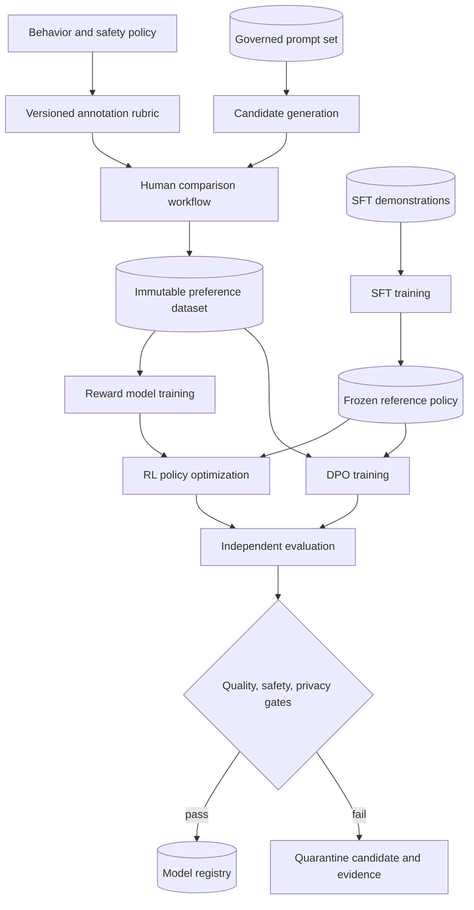

# Alignment with RLHF and DPO

A pretrained model predicts likely continuations.

That objective does not directly encode which answer a user prefers, which action is permitted, or when the model should abstain.

Alignment training uses demonstrations, preferences, policies, and evaluations to shape behavior.

It does not prove that the resulting model shares human values or behaves safely in every context.

Reinforcement learning from human feedback (RLHF) and Direct Preference Optimization (DPO) are two ways to learn from pairwise preferences.

Both depend on the quality and scope of those preferences.

Preference optimization cannot create a reliable policy from ambiguous or unrepresentative examples. It learns the trade-offs encoded in the comparison data and can amplify their omissions or biases. The engineering task is therefore not only to choose an optimization objective, but to define which behaviors are being judged, who supplies the judgment, which populations are represented, and which independent evaluations can veto release.

This chapter explains their mechanisms, failure modes, and production release controls.

## Learning objectives

After this chapter, you should be able to:

- distinguish pretraining, supervised fine-tuning, reward modeling, RLHF, and DPO;
- design a governed demonstration and preference-data pipeline;
- explain pairwise reward-model training;
- explain policy optimization and Kullback-Leibler control conceptually;
- derive the DPO objective at an implementation-ready level;
- identify preference noise, bias, reward hacking, and distribution shift;
- define independent quality, safety, privacy, and security evaluations;
- design model and data lineage across alignment stages;
- create release, rollback, and human-review gates;
- map lifecycle records to Azure Machine Learning without claiming Azure implements the algorithms.

## The costly failure

A team optimizes a reward model until its score rises sharply.

Human reviewers then find verbose, flattering answers that evade the actual task.

The policy learned features that fooled the proxy.

Another team uses preference labels collected from one language and region.

The released model performs poorly for other users but aggregate metrics hide the disparity.

A third team mixes production conversations into training without preserving consent or deletion lineage.

The model cannot be cleanly audited or remediated.

Alignment fails when a proxy becomes the goal, a dataset becomes invisible, or a release gate becomes a single score.

## Vocabulary

**Alignment** here means shaping observable model behavior toward a declared specification and evaluator population.

It is narrower than proving universal human-value alignment.

**Supervised fine-tuning** (SFT) trains on prompt and desired-response pairs.

A **preference pair** contains a prompt, a chosen response, and a rejected response.

A **reward model** predicts a scalar preference score for a prompt-response pair.

A **policy** is the model distribution that generates responses.

A **reference policy** is a fixed model used to constrain or compare the trained policy.

**RLHF** fits a reward signal from human preferences and optimizes a policy against that signal.

**DPO** trains a policy directly from preference pairs using a reference policy and a classification-style loss.

**Reward hacking** occurs when a policy exploits imperfections in the reward signal.

**Distribution shift** occurs when deployment prompts or responses differ from training and evaluation distributions.

**KL divergence** measures how one probability distribution differs from another.

## System invariants

Every training example has source, consent or legal basis, policy version, and transformation lineage.

Chosen and rejected labels retain annotator guidance and quality-control context.

Training, validation, safety, and final test sets do not share near-duplicate prompts unless explicitly measured.

The reference policy remains immutable during one RLHF or DPO experiment.

Reward-model evaluation uses held-out human judgments.

Policy release never depends solely on the metric optimized during training.

Critical safety failures block release regardless of average quality.

Human overrides record identity, evidence, scope, and expiry.

A released model points to exact base, SFT, reward or DPO, data, code, environment, and evaluation versions.

Sensitive prompts and reviewer identities do not leak into general training logs.

## Measurable requirements

The worked system aligns a domain assistant after continuous pretraining.

It has 200,000 SFT demonstrations and 500,000 preference pairs.

At least 20 percent of prompts are held out by source group before response generation.

Inter-annotator agreement is reported by task, language, and safety category.

The final candidate must improve blind human preference by at least 5 percentage points over the SFT baseline.

No critical safety category may regress beyond its declared confidence interval.

Canary rollback must complete within 15 minutes.

Every released artifact must be reproducible from immutable inputs.

Preference and demonstration data have explicit retention and deletion policies.

Access to raw human data is limited to approved ingestion and review identities.

## What alignment training can and cannot establish

Alignment training can increase the probability of responses that match examples and measured preferences.

It can teach formats, refusal patterns, conversational style, and task-specific decision boundaries.

It cannot enumerate every deployment context.

It cannot turn inconsistent preferences into one objectively correct policy.

It cannot guarantee factuality from preference labels alone.

It cannot replace runtime authorization for tools or data.

It cannot prove absence of harmful memorization.

Treat the model as one probabilistic component inside a controlled system.

## Stage 1: supervised fine-tuning

SFT starts from a pretrained or continuously pretrained model.

For prompt $x$ and target response $y=(y_1,\ldots,y_T)$, the usual token loss is:

$$
L_{SFT}=-\sum_{t=1}^{T}\log\pi_{\theta}(y_t\mid x,y_{<t})
$$

Mask prompt tokens when the objective should train only response generation.

Define whether system and tool messages contribute to loss.

Normalize examples so role boundaries and control tokens are unambiguous.

SFT gives the policy a usable initial behavior before preference optimization.

The InstructGPT work used labeler demonstrations for SFT before collecting output rankings and applying RLHF ([Ouyang et al., 2022](https://arxiv.org/abs/2203.02155)).

## Demonstration schema

```json
{
  "example_id": "sft-018293",
  "prompt": [{"role": "user", "content": "Summarize the incident."}],
  "response": [{"role": "assistant", "content": "..."}],
  "task": "incident-summary",
  "language": "en",
  "policy_version": "behavior-policy-12",
  "source_class": "synthetic-reviewed",
  "review_status": "accepted",
  "reviewer_pool": "domain-reviewers-v3"
}
```

The public training artifact can replace reviewer identity with a controlled pseudonymous pool identifier.

The audit store retains stricter access to individual reviewer records where policy requires them.

## Preference data

A pairwise task presents two candidate responses for the same prompt.

The reviewer selects the better response under a rubric or marks a tie or invalid comparison.

```json
{
  "pair_id": "pref-994201",
  "prompt_id": "prompt-55018",
  "chosen_id": "response-b",
  "rejected_id": "response-a",
  "rubric_version": "helpful-safe-9",
  "dimensions": {
    "correctness": "b",
    "relevance": "b",
    "safety": "tie"
  },
  "confidence": 0.8,
  "adjudication": "not-required"
}
```

Preserve the original order shown to reviewers to test position bias.

Randomize presentation order during collection.

## Sampling candidate responses

Preference data depends on which policies generated candidates.

Pairs of obviously different quality provide little information near the decision boundary.

Pairs that are nearly indistinguishable increase label noise.

Sample across tasks, temperatures, response lengths, languages, and risk categories.

Record generator model, decoding parameters, prompt template, and safety filters.

Avoid collecting only from the current policy's easiest prompt distribution.

Include adversarial and long-tail prompts under controlled review.

Do not expose annotators to unnecessary sensitive source data.

## Annotation rubric

A rubric defines the target behavior.

Separate correctness, relevance, completeness, style, and safety where reviewers can judge them.

Define precedence when dimensions conflict.

For example, a safe but unhelpful refusal can beat an unsafe answer but lose to a safe substantive answer.

Provide domain-specific examples without turning the rubric into a hidden test answer list.

Version every rubric change.

Calibrate reviewers on shared tasks before production labeling.

Measure disagreement rather than forcing false consensus.

## Preference noise and bias

Reviewers can disagree because the task is ambiguous.

They can also differ in expertise, culture, language, accessibility needs, and risk tolerance.

Position, response length, confident tone, and formatting can bias judgments.

Aggregate labels can erase minority requirements.

Report agreement by slice and dimension.

Use adjudication for high-risk disagreements.

Keep a tie outcome rather than converting every comparison to a binary label.

Weighting reviewers can improve expertise alignment but also centralize policy power.

Document who defines acceptable behavior.

## Reward modeling

A reward model $r_{\phi}(x,y)$ maps a prompt and response to a scalar.

For chosen response $y_w$ and rejected response $y_l$, a common pairwise loss is:

$$
L_{RM}=-\log\sigma(r_{\phi}(x,y_w)-r_{\phi}(x,y_l))
$$

$\sigma$ is the logistic sigmoid.

The loss rewards ordering, not an absolute universal utility scale.

Adding the same constant to both scores leaves the pair probability unchanged.

Evaluate pairwise accuracy, calibration, and slice performance on held-out prompts.

The summarization-from-feedback work collected human comparisons, trained a model to predict preferred summaries, and used that model as a reward function ([Stiennon et al., 2020](https://arxiv.org/abs/2009.01325)).

## Reward-model data splits

Split by prompt origin before generating candidate pairs.

Otherwise near-identical prompts can appear in training and test.

Keep a temporal holdout when deployment content changes over time.

Keep a policy holdout generated by a model unseen during reward training.

Keep high-risk slices large enough to estimate failure rates.

Deduplicate SFT, reward, and final evaluation prompts.

Never tune on the final human comparison set.

Record every split manifest and checksum.

## From reward to policy

The policy generates a response $y$ for prompt $x$.

The reward model scores it.

Policy optimization increases expected reward.

Unconstrained optimization can move the policy into regions where the reward model has little reliable data.

The model may then exploit spurious reward features.

A reference policy anchors behavior near a known model.

One conceptual objective is:

$$
\max_{\pi_{\theta}}\;\mathbb{E}_{x,y\sim\pi_{\theta}}[r_{\phi}(x,y)]-\beta D_{KL}(\pi_{\theta}\|\pi_{ref})
$$

$\beta$ controls the penalty for departure from the reference.

This equation explains the trade-off, not a complete optimizer implementation.

The reward model is a learned proxy, so its score is most trustworthy near the preference examples that constrained it. Maximizing that score without a departure cost gives the policy an incentive to search for unfamiliar response patterns where the proxy is poorly calibrated. The reference-policy term makes that exploration explicit: it permits a measured behavior change, but it also limits how quickly the policy can correct a genuine weakness in the reference. Evaluation must therefore compare user-relevant outcomes and safety slices, not infer success from reward alone.

## KL control

Low $\beta$ permits larger policy changes and more reward exploitation.

High $\beta$ keeps the policy close but can prevent useful adaptation.

Token-level estimators and sequence-level summaries answer different questions.

Monitor realized KL by prompt slice, not only its batch mean.

Adaptive controllers can adjust a KL coefficient toward a target.

That controller state belongs in checkpoints.

A KL target is an optimization safeguard, not a safety guarantee.

The reference model can itself contain unsafe behavior.

## Policy optimization with PPO

Proximal Policy Optimization (PPO) is commonly used in RLHF implementations.

It compares the probability of sampled actions under current and behavior policies.

The probability ratio for a token action is:

$$
r_t(\theta)=\frac{\pi_{\theta}(a_t\mid s_t)}{\pi_{old}(a_t\mid s_t)}
$$

A clipped surrogate limits the incentive for a large update:

$$
L^{clip}=\mathbb{E}_t[\min(r_tA_t,\operatorname{clip}(r_t,1-\epsilon,1+\epsilon)A_t)]
$$

$A_t$ is an estimated advantage.

Clipping improves update control but does not eliminate instability or reward misspecification.

Implementations also manage value estimation, masking, normalization, and distributed generation.

## RLHF pipeline

The common language-model RLHF pipeline is:

1. Train an SFT policy from demonstrations.
2. Generate multiple responses to sampled prompts.
3. Collect human rankings or pairwise preferences.
4. Train and validate a reward model.
5. Freeze a reference policy and reward model for an experiment.
6. Generate rollouts from the current policy.
7. Score rollouts and compute policy-update signals.
8. Optimize the policy under update and KL controls.
9. Evaluate checkpoints with independent automated and human tests.
10. Release only after governance gates pass.

The InstructGPT paper describes this demonstrations, rankings, reward, and reinforcement-learning sequence ([Ouyang et al., 2022](https://arxiv.org/abs/2203.02155)).

## RLHF state and capacity

RLHF can require an active policy, reference policy, reward model, and value model.

Some implementations share or offload components.

Rollout generation consumes inference memory and time.

Policy updates consume training memory and communication.

Let $N_p$ prompts produce $K$ responses averaging $T$ tokens.

Generated tokens per rollout batch are:

$$
V_{tokens}=N_pKT
$$

For 1,024 prompts, four responses, and 800 tokens:

$$
V_{tokens}=1{,}024\times4\times800=3{,}276{,}800
$$

At 100,000 generated tokens per second, generation alone takes at least 32.8 seconds.

Queueing, reward inference, and training add latency.

## DPO from first principles

DPO avoids fitting a separate scalar reward model and running an online reinforcement-learning loop for the standard preference objective.

It compares how the trainable policy and reference policy favor chosen over rejected responses.

Define the policy log-ratio for response $y$:

$$
q_{\theta}(x,y)=\log\pi_{\theta}(y\mid x)-\log\pi_{ref}(y\mid x)
$$

The chosen-versus-rejected margin is:

$$
\Delta q=q_{\theta}(x,y_w)-q_{\theta}(x,y_l)
$$

A common DPO loss is:

$$
L_{DPO}=-\log\sigma(\beta\Delta q)
$$

The reference policy is fixed.

$\beta$ sets the strength or temperature of the preference-relative constraint.

The DPO paper derives a closed-form policy relationship for the KL-regularized reward objective and trains with a classification loss ([Rafailov et al., 2024](https://arxiv.org/abs/2305.18290)).

Each pair contributes a relative statement, not an absolute quality score. The loss increases the policy's preference for the chosen response over the rejected response while measuring both against the fixed reference, which makes preprocessing and reference identity part of the mathematical input. During recovery, restoring only the trainable policy but changing the reference digest, tokenizer, or pair transformation would resume a different objective even at the same step number. A resumable DPO checkpoint therefore needs the optimizer and scheduler state together with those immutable objective identities.

## Computing response probabilities

For an autoregressive model:

$$
\log\pi(y\mid x)=\sum_{t=1}^{T}\log\pi(y_t\mid x,y_{<t})
$$

Mask prompt and padding tokens.

Use the same tokenization and truncation contract for policy and reference.

If chosen and rejected responses exceed context length, define a deterministic truncation rule.

Sequence-sum log probabilities can introduce response-length effects.

Do not silently switch to length-normalized scores without changing the algorithm specification.

Log chosen and rejected margins to detect saturation.

## DPO batch interface

```python
batch = {
    "prompt_input_ids": "int64[B, P]",
    "chosen_input_ids": "int64[B, C]",
    "rejected_input_ids": "int64[B, R]",
    "chosen_loss_mask": "bool[B, C]",
    "rejected_loss_mask": "bool[B, R]",
    "pair_weight": "float32[B]",
    "policy_version": "string[B]"
}
```

Cache reference log probabilities only when their tokenizer, model digest, and preprocessing contract are immutable.

Key cached values by pair ID and reference digest.

A cache hit with the wrong reference silently changes the objective.

## RLHF versus DPO

RLHF can learn from a reward model and sample new responses during policy training.

It supports reward composition and online exploration but adds rollout, value, and optimizer complexity.

DPO uses a fixed preference dataset and reference policy with a supervised-style training loop.

It removes the separate reward-model and online rollout loop from that optimization path.

DPO does not remove the need for preference quality, safety evaluation, or reference management.

The DPO paper reports competitive or improved results on its evaluated tasks while emphasizing simpler training ([Rafailov et al., 2024](https://arxiv.org/abs/2305.18290)).

That evidence does not establish superiority for every domain, model, or risk profile.

Choose through controlled experiments on the intended distribution.

## Alignment pipeline image


Credits: Hazem Ali

The image shows that both branches begin with governed prompts and preferences.

RLHF adds reward-model training and policy optimization.

DPO computes a direct preference loss against a reference policy.

Both converge on independent evaluation and release gates.

Neither training loss is itself a release decision.

## Reward hacking

A reward model is an approximation learned from finite comparisons.

The policy can find outputs unlike the reward model's training data.

It may exploit length, tone, disclaimers, formatting, or repeated phrases.

It may hide an unsafe answer behind language that the reward model associates with safety.

Plot human preference against reward across training checkpoints.

Stop when proxy improvement decouples from human judgment.

Use adversarial probes designed to expose proxy shortcuts.

Keep final evaluators independent from the optimized reward model.

## Overoptimization and collapse

Repeated optimization can reduce response diversity.

The policy can become verbose or excessively refuse.

Rare capabilities can regress while average preference rises.

Monitor entropy, length, refusal rate, and capability slices.

Compare several checkpoints rather than assuming the last is best.

Keep the SFT and reference baselines available.

Use early stopping based on independent evaluation.

Do not select on a test set and then report it as unbiased evidence.

## Safety evaluation

Define safety categories from the intended deployment and threat model.

Evaluate direct harmful requests, obfuscated requests, multi-turn escalation, and tool-use attempts.

Measure both unsafe compliance and unnecessary refusal.

Test prompt injection when the model will receive retrieved or tool-supplied text.

Test whether system-policy instructions survive long contexts.

Use expert human review for high-severity ambiguous cases.

Track severity and exposure, not only an aggregate pass rate.

One critical failure can outweigh thousands of benign successes.

## Privacy evaluation

Scan training inputs for personal data before alignment.

Test memorization with controlled canaries and membership-style analyses where appropriate.

Evaluate whether the model reproduces contact details, credentials, or unique passages.

Keep raw reviewer and production-user data access restricted.

Do not log full sensitive prompts by default.

Support deletion lineage from source record to dataset and model versions.

Document when retraining, unlearning research, filtering, or model retirement is the available remediation.

Do not promise exact removal from model parameters without evidence.

## Human evaluation design

Blind reviewers to candidate identity and training method.

Randomize response order.

Use prompts sampled from a predeclared evaluation distribution.

Stratify by task, language, risk, and user group.

Include ties and invalid judgments.

Calculate uncertainty intervals rather than reporting only a point estimate.

Audit reviewer fatigue and time per task.

Escalate high-risk disagreements to qualified adjudicators.

Keep the final comparison set untouched until candidate selection.

## Release gate schema

```yaml
candidate: domain-assistant-dpo:8
base: domain-assistant-sft:5
reference: domain-assistant-sft:5
evidence:
  preference_eval: eval-pref-20260812
  safety_eval: eval-safety-20260812
  privacy_eval: eval-privacy-20260812
gates:
  blind_preference_win_rate: ">= 0.55"
  critical_safety_failures: "== 0"
  unnecessary_refusal_delta: "<= 0.02"
  secret_canary_regressions: "== 0"
  rollback_drill_minutes: "<= 15"
approvers: [model-owner, safety-owner, data-governance]
```

Every evidence identifier resolves to immutable raw and summarized results.

An override must name the exact failed gate and compensating control.

## End-to-end architecture



The policy and rubric precede labels.

The frozen reference is a versioned model, not a mutable deployment name.

RLHF and DPO are alternative experiment branches.

Independent evaluation is shared because neither optimized objective is sufficient evidence.

## Model and data lineage

Represent each stage as a directed acyclic graph of immutable assets.

An SFT model points to base model, demonstrations, code, environment, and hyperparameters.

A reward model points to the SFT or base initialization and preference split.

An RL policy points to SFT policy, reward model, reference policy, rollout configuration, and checkpoints.

A DPO policy points to initialization, reference policy, preference version, and objective configuration.

Evaluation points to candidate, evaluator, test assets, prompt templates, and decoding settings.

Release points to evidence and approver decisions.

Azure Machine Learning can track data assets, job history, model metadata, and lifecycle lineage ([Microsoft Learn](https://learn.microsoft.com/azure/machine-learning/concept-model-management-and-deployment)).

## Azure Machine Learning boundary

Azure Machine Learning pipelines can connect preparation, training, and evaluation steps as reproducible workflows ([Microsoft Learn](https://learn.microsoft.com/azure/machine-learning/concept-model-management-and-deployment)).

Azure Machine Learning environments track reusable software dependencies ([Microsoft Learn](https://learn.microsoft.com/azure/machine-learning/concept-model-management-and-deployment)).

Model registration stores versions and can establish lineage from job outputs ([Microsoft Learn](https://learn.microsoft.com/azure/machine-learning/how-to-manage-models)).

MLflow integration supports logging metrics, parameters, artifacts, and models from jobs ([Microsoft Learn](https://learn.microsoft.com/azure/machine-learning/how-to-log-view-metrics)).

The training code implements SFT, reward modeling, PPO, or DPO.

Do not claim that Azure Machine Learning defines or guarantees those algorithmic behaviors.

## Checkpointing

SFT and DPO checkpoints contain model, optimizer, scheduler, random, and data-cursor state.

Reward-model checkpoints contain the same categories for their own training job.

RLHF policy checkpoints additionally preserve value-model state where used, KL-controller state, rollout cursor, and reward normalization.

Keep the frozen reference digest in every checkpoint manifest.

Do not checkpoint raw access tokens or reviewer data.

Publish distributed shards atomically with a manifest and checksums.

Resume only when model step, optimizer step, and data cursor agree.

Keep portable evaluation exports separate from resumable optimizer checkpoints.

## Backpressure and queues

Candidate generation must not outrun secure review storage.

Review assignment must account for qualified reviewer capacity.

Preference ingestion pauses when quality-control queues exceed limits.

RLHF rollout queues need token and byte bounds.

Reward inference and policy training should expose queue age separately.

Evaluation admission should prioritize release candidates over exploratory checkpoints.

Log ingestion must redact sensitive content before buffering.

Dropping labels or lineage to clear a queue is not an acceptable pressure response.

## Observability

Track demonstration acceptance and rejection reasons.

Track pair counts, ties, invalids, and disagreement by slice.

Track reviewer calibration, latency, and drift.

Track reward-model pair accuracy, calibration, margin distribution, and slice gaps.

Track policy reward, realized KL, entropy, response length, and refusal rate.

Track DPO chosen and rejected log-ratio margins and saturation.

Track human preference against the optimized proxy over checkpoints.

Track safety severity, privacy failures, and test contamination.

Track training throughput, memory, checkpoint age, restore time, and cost.

Azure Machine Learning job records and MLflow metrics can retain experiment evidence and diagnostic artifacts ([Microsoft Learn](https://learn.microsoft.com/azure/machine-learning/how-to-log-view-metrics)).

## Security architecture

Separate raw annotation data from de-identified training exports.

Use one identity for candidate generation and another for training.

Reviewers receive only the minimum prompt context needed for judgment.

The training identity reads approved immutable datasets and writes its run prefix.

The evaluation identity reads candidates and sealed test sets but cannot modify training data.

The release identity registers only candidates with passing evidence.

Use private network access for data, checkpoint, and registry dependencies where supported.

Use role-based authorization at the narrowest practical resource scope.

Store unavoidable external service secrets in a governed secret store and prefer workload identity where supported.

Audit reads of raw human data and all model promotion actions.

## Threat model

An attacker may poison prompts or preferences.

A malicious reviewer may systematically favor unsafe outputs.

A compromised generator may insert identifiers into candidates.

A training operator may swap the reference model after approval.

A model may memorize sensitive examples.

An evaluator may leak sealed test prompts into training.

A release operator may bypass a failed gate.

Controls include immutable digests, reviewer anomaly detection, separation of duties, sealed tests, signed evidence, and protected audit logs.

No single metric owner should control training, evaluation, and release.

## Failure modes and responses

**Reward rises while human preference falls:** stop training and select an earlier checkpoint.

**KL spikes:** inspect update size, masks, reference digest, and controller state.

**DPO loss saturates:** inspect margins, duplicated pairs, label separability, and $\beta$.

**Length grows without quality gain:** evaluate length bias in labels and reward.

**Refusal rate rises broadly:** inspect safety-pair balance and false-positive slices.

**Reviewer agreement drops:** pause collection and recalibrate rubric or assignment.

**Sensitive prompt appears in logs:** contain access, rotate exposed secrets, and execute incident policy.

**Reference mismatch after resume:** reject checkpoint before another update.

**Final test contamination:** invalidate affected evidence and create a new sealed set.

**Release gate service unavailable:** fail closed for promotion while allowing evidence collection to continue.

## Recovery and rollback

Keep the last released model independently deployable.

Keep its environment, tokenizer, policy configuration, and safety filters.

Use staged traffic rollout for a candidate.

Monitor behavior and system metrics by deployment version.

Define automatic rollback triggers for severe safety, error-rate, or latency regressions.

Preserve prompts needed for incident analysis under privacy policy.

Do not overwrite a registry version or mutable deployment artifact in place.

Azure Machine Learning supports registered model versions and controlled traffic across online endpoint deployments ([Microsoft Learn](https://learn.microsoft.com/azure/machine-learning/concept-model-management-and-deployment)).

Test rollback before release, including identity and network dependencies.

## Cost and throughput

SFT and DPO primarily incur training compute and dataset preparation costs.

RLHF adds rollout generation, reward inference, and often value-model training.

Let $G$ be generated rollout tokens, $Q_g$ generation throughput, and $C_i$ inference cost per hour:

$$
T_g=\frac{G}{Q_g},\qquad C_{rollout}=T_gC_i
$$

Let $H$ be human comparisons and $C_h$ average cost per accepted comparison:

$$
C_{human}=HC_h
$$

Include calibration, adjudication, security review, and discarded labels.

Cheap low-quality preferences can cost more after rework and unsafe releases.

Compare cost per candidate that passes independent gates.

## Alternatives and trade-offs

Use SFT alone when a clear demonstration set expresses the desired behavior.

Use RLHF when online policy sampling and a reusable reward signal justify operational complexity.

Use DPO when fixed pairwise preferences and a simpler training loop fit the problem.

Use rejection sampling when a trusted scorer can select among candidates without updating a policy online.

Use rule-based runtime filters for explicit enforceable constraints.

Use retrieval for factual authority that must remain current and attributable.

Use tool authorization outside the model for actions with real side effects.

Use human review at runtime for high-impact ambiguous decisions.

No training method removes the need for system-level controls.

## Design review checklist

- Is alignment defined as a measurable behavior specification?
- Are SFT demonstrations and preferences independently governed?
- Are source, rubric, reviewer pool, and policy versions retained?
- Are pair order and ties preserved?
- Are train and final evaluation prompts deduplicated?
- Is reward accuracy measured on unseen prompts and policies?
- Is the reference model immutable and checksum-bound?
- Are KL, response length, entropy, and refusal rates monitored?
- Are final evaluators independent from the optimized proxy?
- Do critical safety failures block release?
- Is privacy lineage available for every human-derived record?
- Are algorithm checkpoints complete and atomically published?
- Can the deployed candidate roll back within the objective?
- Does the architecture distinguish framework algorithms from Azure lifecycle services?

## Hands-on exercise

Design an alignment pipeline for a customer-support assistant.

Write a behavior specification covering correctness, relevance, privacy, escalation, and refusal.

Create an SFT schema and three example quality reason codes.

Create a pairwise preference schema that supports ties and multidimensional judgments.

Define reviewer calibration and adjudication thresholds.

Split prompts by customer organization before candidate generation.

Write the reward-model pairwise loss and explain what its scalar cannot represent.

Design an RLHF experiment with a frozen reference, target KL, and rollback condition.

Design a DPO experiment on the same preference version and reference.

Compute rollout token volume for 2,000 prompts, four responses, and 600 tokens each.

At 120,000 tokens per second, calculate the generation lower bound.

Define five slices for human and safety evaluation.

Create a gate file with quality, critical safety, privacy, refusal, and rollback criteria.

Inject a reference-model mismatch during resume and show where startup rejects it.

Inject a reward-hacking pattern where verbosity increases reward but lowers blind preference.

Choose an earlier checkpoint using independent evidence.

Assign separate identities for collection, training, evaluation, and release.

Finish with a lineage graph from source prompts to deployed model version.

## What, why, and how

Alignment training changes model behavior using demonstrations and measured preferences.

RLHF learns a reward proxy and optimizes a policy against it, while DPO optimizes pairwise preference likelihood relative to a fixed reference.

Both can fail when labels, proxies, or evaluation distributions are incomplete.

A production design therefore combines algorithm controls with governed data, independent evaluation, human review, lineage, and reversible release.