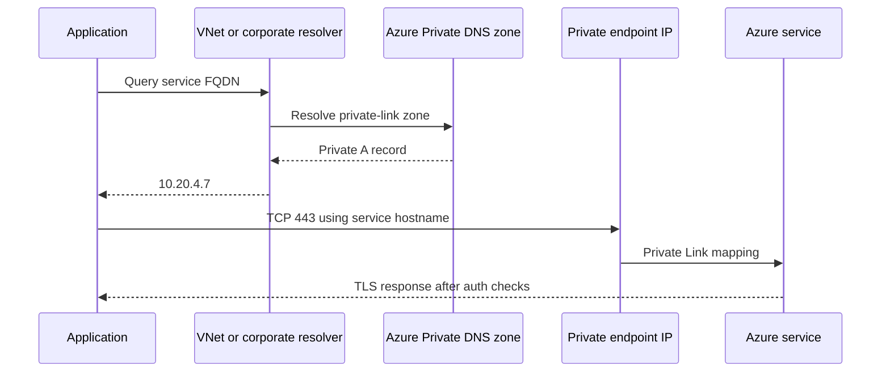
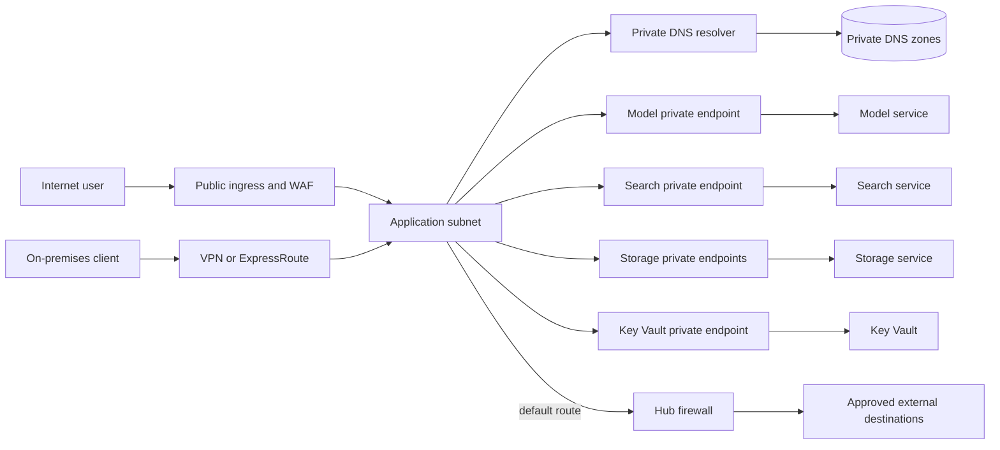

# Private networking and VNet injection

A service name is not a network path.

Before an application reaches an AI model, storage account, search index, or secret store, several systems make independent decisions.

Domain Name System (DNS) resolves a name.

Routing selects a next hop for an Internet Protocol (IP) address.

Network policy evaluates protocol, port, source, and destination.

Transport Layer Security (TLS) protects and authenticates the application connection.

The service then authenticates and authorizes the caller.

Private networking changes the reachable path, but it does not replace identity or authorization.

These layers fail independently. A correct private DNS answer does not prove that a route exists, a reachable endpoint does not prove that TLS is configured correctly, and an encrypted connection does not prove the caller has a data-plane role. Following one request across the layers lets an engineer diagnose the real failing boundary instead of weakening a control to make an error disappear.

This chapter follows one request from name to service and designs that path for an enterprise AI workload.

## Learning objectives

After this chapter, you should be able to:

- explain names, IP addresses, routes, ports, and TLS in one request flow;
- distinguish ingress, egress, and east-west traffic;
- design virtual networks, subnets, NSGs, UDRs, and firewalls;
- explain private endpoint network interfaces and approval;
- configure private DNS and split-horizon resolution;
- design on-premises conditional forwarding;
- distinguish Private Link, service endpoints, and VNet injection;
- disable public access without breaking dependencies;
- reduce data-exfiltration paths;
- build network controls with infrastructure as code;
- diagnose failures in DNS, routing, filtering, TLS, and authorization;
- plan multi-region recovery and network cost.

## The costly failure

A team creates private endpoints for its model and storage services.

It then disables public access.

Training fails because compute still resolves the storage name to a public address.

The team re-enables public access to restore service and leaves it enabled for months.

Another team forces all outbound traffic through a firewall but forgets required identity endpoints.

Token acquisition fails and appears to be an application bug.

A third team trusts a successful private DNS lookup as proof of authorization.

An overprivileged identity then reads data it should not access.

Network security fails when name resolution, reachability, and authorization are treated as one control.

## Vocabulary

A **name** is a human-readable identifier such as `vault.example.net`.

DNS maps a name to records, often including an IP address.

An **IP address** identifies a network interface or service destination for routing.

A **route** maps a destination prefix to a next hop.

A **port** identifies a transport endpoint, such as TCP port 443 for HTTPS.

TLS encrypts application bytes and validates the server identity through certificates.

A **virtual network** (VNet) is an isolated Azure network address space.

A **subnet** is an address prefix within a VNet used as a policy and placement boundary.

A **network security group** (NSG) is a stateful packet filter applied to supported subnets or interfaces.

A **user-defined route** (UDR) overrides selected Azure system routing decisions.

A **private endpoint** is a private network interface that maps to one service resource or subresource.

A **service endpoint** extends subnet identity to a supported service's public endpoint.

**VNet injection** places service-managed or workload resources into a delegated or customer-selected subnet.

**Split-horizon DNS** returns different answers for the same name depending on the querying network.

## System invariants

Approved application names resolve to intended private addresses from every private client network.

Public DNS resolution never grants resource access.

No service public endpoint is accepted after its private path is validated and policy disables public access.

Every permitted flow has an explicit source, destination, protocol, port, and business purpose.

Every denied egress destination remains denied after application or model changes.

Network reachability never implies data-plane authorization.

TLS hostname validation remains enabled on private paths.

On-premises and Azure clients receive consistent private answers for private resources.

Network changes are versioned, reviewed, and reversible.

Recovery networks can resolve, route, authenticate, and authorize before production failover.

## Measurable requirements

The worked AI application serves users through a controlled public ingress.

Model, search, storage, and Key Vault traffic must use private endpoints.

Only HTTPS on TCP 443 is permitted to those dependencies unless a documented service requires another port.

Internet egress is denied except for an approved destination set.

DNS p95 lookup latency must stay below 50 ms inside Azure and 100 ms from on-premises.

Private dependency connection success must exceed 99.95 percent monthly.

Unapproved outbound connection attempts must alert within 5 minutes.

Network flow records are retained for 180 days and security audit records for the policy period.

Regional network failover must complete within a 60-minute RTO.

The design supports a 20 percent annual traffic increase without subnet exhaustion.

## One request from first principles

The client starts with an HTTPS URL.

It asks a configured DNS resolver for the service name.

The resolver follows private-zone, forwarding, and public-resolution rules.

The answer contains a private endpoint IP such as `10.20.4.7`.

The client asks its routing table which next hop covers that destination.

The most specific matching prefix wins.

The packet leaves with a source IP, destination IP, protocol, and destination port.

NSGs, firewalls, and platform policy evaluate the flow at their enforcement points.

TCP establishes a connection.

TLS validates the service certificate against the original hostname, not the private IP.

The application sends an HTTP request containing an access token.

The service validates identity and authorization independently of the network path.

## Names are not addresses

Applications should normally call the service's documented fully qualified domain name (FQDN).

Hard-coding a private IP bypasses normal service DNS behavior and certificate naming.

A private endpoint commonly changes the DNS answer while preserving the application URL.

Microsoft documents that private endpoint clients should resolve the service FQDN to the endpoint's private IP ([Microsoft Learn](https://learn.microsoft.com/azure/private-link/private-endpoint-overview)).

The endpoint network interface exposes the FQDN and private IP information needed for DNS configuration ([Microsoft Learn](https://learn.microsoft.com/azure/private-link/private-endpoint-overview)).

DNS is therefore part of the production data path.

Monitor it like any other dependency.

## IP prefixes and subnet sizing

IPv4 Classless Inter-Domain Routing (CIDR) notation expresses an address prefix.

`10.20.4.0/24` fixes 24 prefix bits and contains 256 addresses before platform reservations and operational policy.

Avoid address overlap with on-premises, peered VNets, containers, and recovery regions.

Overlap prevents unambiguous routing and complicates mergers or partner connectivity.

Allocate separate subnets for application workloads, private endpoints, firewall, DNS resolver endpoints, and delegated services where required.

Reserve growth before deployment because subnet migration can be disruptive.

Azure VNets route between their subnets by default and can connect to on-premises through VPN or ExpressRoute ([Microsoft Learn](https://learn.microsoft.com/azure/virtual-network/virtual-networks-overview)).

## Routing

Azure creates system routes for every subnet.

These include VNet prefixes and a default `0.0.0.0/0` Internet route ([Microsoft Learn](https://learn.microsoft.com/azure/virtual-network/virtual-networks-udr-overview)).

Azure selects outbound routes by longest prefix match ([Microsoft Learn](https://learn.microsoft.com/azure/virtual-network/virtual-networks-udr-overview)).

A `/24` route therefore beats a `/16`, which beats `0.0.0.0/0`.

When equal prefixes compete, route-source priority also matters.

Inspect the effective route table instead of inferring it from the IaC source alone.

Peering, gateways, service endpoints, and BGP can add routes after the initial deployment.

## User-defined routes

A UDR associates a destination prefix with a next-hop type.

Use a `0.0.0.0/0` UDR to send otherwise unmatched egress through a firewall or virtual appliance.

Azure supports a virtual appliance next hop and requires its next-hop IP to be directly reachable ([Microsoft Learn](https://learn.microsoft.com/azure/virtual-network/virtual-networks-udr-overview)).

Do not place a routing appliance in the same subnet whose route forces traffic through that appliance because this can create loops ([Microsoft Learn](https://learn.microsoft.com/azure/virtual-network/virtual-networks-udr-overview)).

Validate return paths and source network address translation (SNAT) behavior.

Asymmetric routing can make a correctly allowed request fail after the first packet.

## Ports and state

A client usually chooses an ephemeral source port and a fixed service destination port.

HTTPS commonly targets TCP 443.

DNS commonly uses UDP or TCP 53 depending on response and operation.

Do not write `allow HTTPS` when the actual policy object requires protocol and port.

NSG rules evaluate the five-tuple of source, source port, destination, destination port, and protocol ([Microsoft Learn](https://learn.microsoft.com/azure/virtual-network/network-security-groups-overview)).

NSGs are stateful, so an allowed outbound connection permits its response without a separate inbound response rule ([Microsoft Learn](https://learn.microsoft.com/azure/virtual-network/network-security-groups-overview)).

New NSG rules affect new connections; removing an allow rule does not necessarily interrupt existing flows immediately ([Microsoft Learn](https://learn.microsoft.com/azure/virtual-network/network-security-groups-overview)).

Incident runbooks must account for connection reuse.

## TLS on private networks

Private IP routing does not encrypt application payloads by itself.

Use HTTPS and validate the certificate chain and hostname.

The application should send the original service hostname through Server Name Indication and HTTP host information.

Do not disable certificate validation because a private endpoint uses an unfamiliar IP.

Private connectivity reduces exposure but does not make every host in the VNet trustworthy.

Mutual TLS can authenticate both endpoints for custom services when justified.

Identity tokens remain necessary for Azure data-plane authorization.

## Ingress, egress, and east-west

**Ingress** is traffic entering the application boundary from users or external systems.

**Egress** is traffic leaving a workload toward dependencies or the internet.

**East-west** is traffic between internal workloads and services.

The controls differ.

Public web ingress might use a web application firewall and reverse proxy.

Egress might use UDRs, Azure Firewall, private endpoints, and destination allowlists.

East-west traffic might use subnet segmentation and NSGs.

Document each direction separately so a broad ingress allow does not become broad egress.

## Hub-and-spoke topology

A hub VNet centralizes shared network functions.

Spoke VNets isolate application environments or teams.

The hub can host firewall, VPN or ExpressRoute gateway, and DNS resolver endpoints.

Peering connects hub and spokes without merging their address spaces.

Azure VNet peering adds routes for the peer address ranges ([Microsoft Learn](https://learn.microsoft.com/azure/virtual-network/virtual-networks-udr-overview)).

Route tables can send spoke egress through the hub firewall.

Peering is not transitive by default as an application assumption; explicitly design forwarded traffic and gateway use.

Keep production, nonproduction, and recovery routing intent separate.

## Network security groups

NSGs filter supported inbound and outbound VNet traffic using ordered allow and deny rules ([Microsoft Learn](https://learn.microsoft.com/azure/virtual-network/network-security-groups-overview)).

Lower numeric priority is evaluated before higher numeric priority, and evaluation stops at the first match ([Microsoft Learn](https://learn.microsoft.com/azure/virtual-network/network-security-groups-overview)).

Azure adds default VNet, load-balancer, Internet, and deny rules that custom higher-priority rules can override ([Microsoft Learn](https://learn.microsoft.com/azure/virtual-network/network-security-groups-overview)).

Use application security groups or stable subnet prefixes where supported instead of individual ephemeral IPs.

Treat service tags as maintained IP groups, not as resource-instance identities.

Use private endpoints when the boundary must identify a specific platform resource.

## Firewall role

A central firewall can inspect and log north-south and selected east-west flows.

Azure Firewall is stateful and supports network and application-layer controls depending on SKU ([Microsoft Learn](https://learn.microsoft.com/azure/firewall/overview)).

Azure Firewall Standard includes L3-L7 filtering and threat-intelligence capabilities ([Microsoft Learn](https://learn.microsoft.com/azure/firewall/overview)).

The firewall needs a route in both directions and capacity for peak throughput.

It can become a shared failure domain if all spokes depend on one regional instance.

Prefer private endpoints for Azure service traffic when the goal is resource-specific private reachability.

Use the firewall for controlled internet egress, approved FQDNs, and inspection needs the private endpoint cannot satisfy.

## Private endpoint mechanics

A private endpoint creates a read-only network interface with a private IP in the selected subnet ([Microsoft Learn](https://learn.microsoft.com/azure/private-link/private-endpoint-overview)).

The endpoint maps traffic to a specified private-link resource and target subresource ([Microsoft Learn](https://learn.microsoft.com/azure/private-link/private-endpoint-overview)).

For Azure Storage, blob, file, queue, table, and DFS can require distinct endpoint subresources ([Microsoft Learn](https://learn.microsoft.com/azure/private-link/private-endpoint-overview)).

The private endpoint and VNet are in the same region, while the target resource can be in another region ([Microsoft Learn](https://learn.microsoft.com/azure/private-link/private-endpoint-overview)).

Only clients initiate through the private endpoint; the service provider cannot use it to initiate into the consumer network ([Microsoft Learn](https://learn.microsoft.com/azure/private-link/private-endpoint-overview)).

## Approval workflow

Private endpoint connections can be automatically or manually approved depending on permissions ([Microsoft Learn](https://learn.microsoft.com/azure/private-link/private-endpoint-overview)).

A manually requested connection begins in `Pending`.

Only an `Approved` private endpoint can send traffic to the resource ([Microsoft Learn](https://learn.microsoft.com/azure/private-link/private-endpoint-overview)).

Separate endpoint creation from resource-owner approval across trust boundaries.

Validate resource ID, subresource, subscription, tenant, requester, and environment before approval.

Alert on unexpected pending or approved connections.

Deleting one side can leave the other side disconnected and requiring cleanup.

Treat approval as an authorization event worthy of audit.

## Public access is separate

Creating a private endpoint does not necessarily disable the service's public network endpoint ([Microsoft Learn](https://learn.microsoft.com/azure/private-link/private-endpoint-overview)).

The private endpoint adds a path.

The service's firewall or public-network-access setting decides whether public traffic remains accepted.

Use a staged migration.

First create endpoint, DNS, routes, and identity permissions.

Then validate from every client network.

Then disable or restrict public access.

Finally prove that an external test client cannot connect.

The ordering matters because each change removes a fallback that can conceal a broken dependency. While public access remains available, a successful request may have used public DNS, an Internet route, or a different firewall rule than the intended private path. Validation from each client network establishes the selected DNS answer, effective route, TLS hostname, and service authorization before the public path is removed. When a check fails, restoring the prior public-access setting is a bounded recovery action rather than an invitation to leave two unverified paths permanently enabled.

## Private DNS

Azure Private DNS hosts DNS records resolvable from linked VNets ([Microsoft Learn](https://learn.microsoft.com/azure/dns/private-dns-overview)).

A VNet must be linked to a private zone to resolve its records ([Microsoft Learn](https://learn.microsoft.com/azure/dns/private-dns-overview)).

Private DNS supports split-horizon designs where private and public zones share a name but return different answers ([Microsoft Learn](https://learn.microsoft.com/azure/dns/private-dns-overview)).

For Private Link, use the service's documented private zone name rather than inventing one.

Azure publishes the required private zone names for services such as Storage, Key Vault, Azure AI Search, Foundry Tools, and Azure Machine Learning ([Microsoft Learn](https://learn.microsoft.com/azure/private-link/private-endpoint-dns)).

Link centralized zones to every VNet that needs resolution.

Avoid duplicate zones with conflicting records.

## DNS query path



The application keeps the documented service hostname.

The resolver supplies the private address.

The route and filters deliver packets to the endpoint NIC.

Private Link maps the connection to the selected resource.

The service still validates TLS, identity, and authorization.

This path separates three decisions that can fail independently. DNS selects an address, routing and filtering decide whether packets can reach that address, and the service decides whether the caller may perform the requested operation. A timeout after a private DNS change therefore does not establish an RBAC problem, while a 403 response establishes that the network and TLS stages already succeeded. Preserving those distinctions in probes and logs prevents a recovery team from weakening authorization to compensate for a name-resolution or route defect.

## Split-horizon failure modes

A client using public DNS can receive a public answer while a VNet client receives a private answer.

That is expected only when public access policy matches the design.

A private zone without a matching record can return `NXDOMAIN` and hide a valid public resource under that namespace ([Microsoft Learn](https://learn.microsoft.com/azure/private-link/private-endpoint-dns)).

Do not copy a current public IP into a private zone as a permanent workaround.

It will not update automatically if the service changes its address ([Microsoft Learn](https://learn.microsoft.com/azure/private-link/private-endpoint-dns)).

Use documented fallback or forwarding behavior where mixed private and public resources must coexist.

Test positive and negative names.

## Hybrid DNS and conditional forwarding

On-premises resolvers cannot query Azure private zones merely because a VPN route exists.

They need a DNS forwarding path.

Azure DNS Private Resolver provides inbound endpoints for queries from on-premises or other private networks ([Microsoft Learn](https://learn.microsoft.com/azure/dns/dns-private-resolver-overview)).

Configure the corporate resolver to conditionally forward relevant Azure private namespaces to the inbound endpoint IP.

The inbound endpoint uses a dedicated delegated subnet ([Microsoft Learn](https://learn.microsoft.com/azure/dns/dns-private-resolver-overview)).

An outbound endpoint and forwarding ruleset can send selected Azure-originated queries to on-premises DNS servers ([Microsoft Learn](https://learn.microsoft.com/azure/dns/dns-private-resolver-overview)).

Ensure UDP and TCP 53 routes and filters work in both directions.

## Service endpoints

A service endpoint adds optimized routing from a subnet to supported Azure service public IPs and extends VNet identity to service firewall rules ([Microsoft Learn](https://learn.microsoft.com/azure/virtual-network/virtual-network-service-endpoints-overview)).

DNS continues to resolve the service to public IP addresses ([Microsoft Learn](https://learn.microsoft.com/azure/virtual-network/virtual-network-service-endpoints-overview)).

The service endpoint is enabled on a subnet, not represented as a private NIC for one resource.

Service firewall rules restrict which VNets or subnets can access the resource.

Service endpoints generally do not provide private on-premises access in the same way as Private Link ([Microsoft Learn](https://learn.microsoft.com/azure/virtual-network/virtual-network-service-endpoints-overview)).

Microsoft recommends Private Link and private endpoints for private access to Azure platform services ([Microsoft Learn](https://learn.microsoft.com/azure/virtual-network/virtual-network-service-endpoints-overview)).

## Private Link versus service endpoints

Choose Private Link when clients need a private IP for a specific resource.

Choose it for hybrid access through VPN or ExpressRoute and resource-specific data-exfiltration reduction.

Private Link adds endpoint and data-processing cost and DNS work.

Choose a service endpoint when a supported service's public endpoint plus subnet identity meets the requirement.

Service endpoints are simpler and have no additional endpoint charge, but DNS remains public and the model is subnet-to-service rather than NIC-to-resource ([Microsoft Learn](https://learn.microsoft.com/azure/virtual-network/virtual-network-service-endpoints-overview)).

Do not describe service endpoints as placing the service inside the VNet.

Always add service-side network rules; enabling the subnet feature alone is incomplete.

## What VNet injection means

VNet injection is not Private Link.

With injection, a managed service deploys service-managed resources or interfaces into a customer-selected, often delegated subnet.

The service documentation defines subnet delegation, size, route, NSG, and outbound requirements.

Private Link instead creates a consumer-side endpoint NIC that maps to a service resource.

Some services call a related outbound-only pattern **VNet integration**.

Do not generalize one product's injection behavior to another product.

For Azure Machine Learning, customer-managed VNet patterns and workspace managed VNet isolation are separate options with different ownership boundaries ([Microsoft Learn](https://learn.microsoft.com/azure/machine-learning/how-to-managed-network)).

## Azure Machine Learning managed VNet

Azure Machine Learning managed VNet isolation creates a workspace-level managed network for managed compute resources ([Microsoft Learn](https://learn.microsoft.com/azure/machine-learning/how-to-managed-network)).

It controls outbound access from the workspace and managed computes, while a customer-created VNet and private endpoint provide private inbound workspace access ([Microsoft Learn](https://learn.microsoft.com/azure/machine-learning/how-to-managed-network)).

Its modes include internet outbound and allow-only-approved outbound ([Microsoft Learn](https://learn.microsoft.com/azure/machine-learning/how-to-managed-network)).

Approved outbound rules can target private endpoints, service tags, or FQDNs under documented constraints ([Microsoft Learn](https://learn.microsoft.com/azure/machine-learning/how-to-managed-network)).

FQDN rules use Azure Firewall and add cost ([Microsoft Learn](https://learn.microsoft.com/azure/machine-learning/how-to-managed-network)).

This is managed network isolation, not proof that every dependency is private.

## Data-exfiltration design

A broad service tag can permit access to resources beyond the intended account.

A private endpoint maps to a specific resource and subresource, reducing that path ([Microsoft Learn](https://learn.microsoft.com/azure/private-link/private-link-overview)).

Still enforce service authorization because an allowed network client might be compromised.

Deny default internet egress.

Use private package mirrors and controlled container registries.

Allow FQDNs only when private endpoints or service-specific controls cannot satisfy the dependency.

Inspect DNS and firewall logs for newly observed destinations.

Prevent users from creating unreviewed private endpoints or network rules.

## Architecture


Credits: Hazem Ali

The public boundary terminates only user ingress.

The application resolves model, search, storage, and Key Vault names privately.

Private endpoint subnets expose resource-specific IPs.

The firewall handles approved nonprivate egress.

On-premises DNS forwards private namespaces into Azure.

The public service path is disabled after validation.

## Detailed architecture



The ingress proxy is the only intended public application entry point.

Private dependencies do not traverse that proxy.

The DNS resolver is shared but its rules are versioned and monitored.

Separate storage endpoints may be required for blob, file, queue, or DFS subresources.

## Bicep subnet and NSG example

```bicep
param location string
param vnetName string

resource appNsg 'Microsoft.Network/networkSecurityGroups@2024-05-01' = {
  name: '${vnetName}-app-nsg'
  location: location
  properties: {
    securityRules: [
      {
        name: 'allow-https-to-private-endpoints'
        properties: {
          priority: 200
          direction: 'Outbound'
          access: 'Allow'
          protocol: 'Tcp'
          sourcePortRange: '*'
          destinationPortRange: '443'
          sourceAddressPrefix: '10.20.1.0/24'
          destinationAddressPrefix: '10.20.4.0/24'
        }
      }
      {
        name: 'deny-other-egress'
        properties: {
          priority: 4096
          direction: 'Outbound'
          access: 'Deny'
          protocol: '*'
          sourcePortRange: '*'
          destinationPortRange: '*'
          sourceAddressPrefix: '*'
          destinationAddressPrefix: '*'
        }
      }
    ]
  }
}
```

API versions are examples and must be validated against the deployment environment.

Add required identity, monitoring, and platform flows before enforcing deny-all.

## Bicep route example

```bicep
param location string
param firewallPrivateIp string

resource routeTable 'Microsoft.Network/routeTables@2024-05-01' = {
  name: 'rt-app-egress'
  location: location
  properties: {
    disableBgpRoutePropagation: false
    routes: [
      {
        name: 'default-via-firewall'
        properties: {
          addressPrefix: '0.0.0.0/0'
          nextHopType: 'VirtualAppliance'
          nextHopIpAddress: firewallPrivateIp
        }
      }
    ]
  }
}
```

Azure permits a `0.0.0.0/0` UDR to a virtual appliance for inspection and forwarding ([Microsoft Learn](https://learn.microsoft.com/azure/virtual-network/virtual-networks-udr-overview)).

Test effective routes after peering, gateway propagation, and service integration.

## Bicep private endpoint example

```bicep
param location string
param subnetId string
param storageId string

resource blobEndpoint 'Microsoft.Network/privateEndpoints@2024-05-01' = {
  name: 'pe-training-blob'
  location: location
  properties: {
    subnet: { id: subnetId }
    privateLinkServiceConnections: [
      {
        name: 'blob-connection'
        properties: {
          privateLinkServiceId: storageId
          groupIds: [ 'blob' ]
        }
      }
    ]
  }
}
```

The `groupIds` value selects the target subresource.

Create separate endpoints for other required storage subresources.

Bind the endpoint to the documented private DNS zone.

## Private DNS IaC example

```bicep
param vnetId string

resource blobZone 'Microsoft.Network/privateDnsZones@2024-06-01' = {
  name: 'privatelink.blob.core.windows.net'
  location: 'global'
}

resource blobZoneLink 'Microsoft.Network/privateDnsZones/virtualNetworkLinks@2024-06-01' = {
  parent: blobZone
  name: 'link-app-vnet'
  location: 'global'
  properties: {
    registrationEnabled: false
    virtualNetwork: { id: vnetId }
  }
}
```

Azure documents `privatelink.blob.core.windows.net` for Blob private endpoints ([Microsoft Learn](https://learn.microsoft.com/azure/private-link/private-endpoint-dns)).

Private endpoint records are normally managed through a private DNS zone group or explicit records.

## Safe rollout sequence

1. Inventory every application and platform dependency.
2. Record FQDN, subresource, protocol, port, identity, and data classification.
3. Allocate nonoverlapping VNet and subnet prefixes.
4. Deploy private endpoints in `Pending` where cross-team approval is required.
5. Approve only verified resource and subresource connections.
6. Create and link documented private DNS zones.
7. Configure on-premises conditional forwarding.
8. Test DNS, route, TCP, TLS, authentication, and authorization separately.
9. Apply egress routes and filtering with required dependencies allowed.
10. Disable service public access.
11. Prove public-path denial from an external probe.
12. Enable alerts and capture a known-good diagnostic bundle.

## Diagnostics by layer

Start with the name.

Query the exact FQDN from the failing client.

Record resolver address, answer chain, TTL, and final IP.

Then inspect the effective route for that IP.

Then test TCP connection to the documented port.

Then inspect NSG, firewall, and flow records.

Then perform TLS handshake with hostname validation.

Then inspect HTTP status and identity token audience.

This order prevents an authorization failure from being mistaken for routing, or an `NXDOMAIN` from being mistaken for firewall denial.

## Diagnostic command set

```shell
nslookup account.blob.core.windows.net
dig account.blob.core.windows.net A
traceroute 10.20.4.7
nc -vz account.blob.core.windows.net 443
openssl s_client -connect account.blob.core.windows.net:443 -servername account.blob.core.windows.net
curl -v https://account.blob.core.windows.net/
```

Run commands only from approved diagnostic hosts.

Do not paste access tokens into shared shell history.

`traceroute` can be incomplete where devices suppress responses.

Use Azure effective-route and next-hop diagnostics as authoritative supplements.

## Logging and observability

Track DNS response code, answer, latency, and resolver path.

Track private endpoint connection state and approval events.

Track NSG and firewall allows and denies by five-tuple.

Track bytes, packets, and connection counts to each dependency.

Track TLS failures and certificate expiry.

Track service-side public and private request acceptance.

Azure Virtual Network flow logs record Layer 4 flows, five-tuples, direction, state, and throughput information ([Microsoft Learn](https://learn.microsoft.com/azure/network-watcher/vnet-flow-logs-overview)).

Private endpoint traffic is captured at the source workload rather than at the endpoint itself ([Microsoft Learn](https://learn.microsoft.com/azure/network-watcher/vnet-flow-logs-overview)).

Resource logs are not collected by default and require diagnostic settings ([Microsoft Learn](https://learn.microsoft.com/azure/azure-monitor/essentials/diagnostic-settings)).

## Failure runbook

**Symptom: name returns public IP.**

Check private-zone name, A record, VNet link, custom DNS forwarder, and client cache.

**Symptom: name returns NXDOMAIN.**

Check whether a private zone shadows public names without matching records.

**Symptom: TCP timeout.**

Check route, endpoint approval, NSG, firewall, peering, and return path.

**Symptom: TLS name error.**

Restore the documented service hostname and remove IP-based URL overrides.

**Symptom: HTTP 401 or 403.**

The network path works; inspect token audience, identity, role, and service authorization.

**Symptom: works in Azure but not on-premises.**

Check conditional forwarding, resolver inbound endpoint reachability, VPN or ExpressRoute route, and TCP/UDP 53.

**Symptom: public access disablement breaks one feature.**

Inventory missing subresources and browser-direct or control-plane dependencies before reverting.

## Multi-region design

Deploy application and private dependency paths in each recovery region.

Use nonoverlapping regional address ranges.

Create regional private endpoints for the intended regional or replicated service instance.

Azure Private Link can connect a consumer VNet to a private-link resource in another region, but latency and failure domains still matter ([Microsoft Learn](https://learn.microsoft.com/azure/private-link/private-link-overview)).

Link private DNS zones to both regional VNets or use separate records selected by failover policy.

Do not point both regions at one endpoint unless that dependency and network path meet the availability objective.

Preprovision routes, firewall rules, resolver endpoints, identity permissions, and certificates.

Test failover from actual recovery subnets.

## Disaster recovery sequence

Confirm regional dependency health.

Promote replicated data according to service-specific consistency rules.

Update the authoritative private DNS record or traffic-routing layer.

Respect DNS TTL and client caches.

Validate route and NSG policy in the recovery VNet.

Validate private endpoint approval and connection state.

Validate token issuance and data-plane authorization.

Shift controlled traffic and monitor errors, latency, and denied flows.

Keep the old path until rollback expires unless the failure requires isolation.

## Capacity and latency

Network latency adds at every serial hop.

Approximate request latency is:

$$
T_{request}=T_{DNS}+T_{route}+T_{TCP}+T_{TLS}+T_{service}+T_{response}
$$

Connection pooling amortizes TCP and TLS setup.

Private DNS resolver and firewall capacity must cover peak queries and flows.

Subnet capacity must cover endpoints, compute growth, upgrades, and platform reservations.

For throughput $R$ requests/s and average payload $S$ bytes in both directions, approximate payload bandwidth is:

$$
B\approx R(S_{request}+S_{response})
$$

Add protocol overhead, retries, streaming, and burst headroom.

## Cost model

VNets themselves do not carry a base usage charge, while connected services and data transfer can ([Microsoft Learn](https://learn.microsoft.com/azure/virtual-network/virtual-networks-overview)).

Private Link pricing includes private endpoint and data-processing dimensions ([Microsoft Learn](https://learn.microsoft.com/azure/private-link/private-link-overview)).

Firewall cost includes deployed capacity and processed data according to SKU.

DNS Private Resolver and private DNS zones add their own resource and query costs.

Peering, gateways, ExpressRoute, VPN, monitoring ingestion, and log retention add cost.

Let endpoint hourly cost be $C_e$, endpoint count $N_e$, and monthly hours $H$:

$$
C_{endpoint}=N_eC_eH+C_{data}
$$

Consolidation can reduce cost but can also enlarge a failure and trust boundary.

## Alternatives and trade-offs

Use public endpoints with identity and service firewall rules for low-risk or transitional workloads where policy permits.

Use service endpoints for supported subnet-to-service access when public DNS and service firewall semantics are acceptable.

Use Private Link for resource-specific private IP access and hybrid connectivity.

Use customer-managed VNets when network teams require direct route, subnet, and appliance control.

Use service-managed VNet isolation when supported capabilities and ownership simplify operations.

Use VNet injection only when the selected service documents and requires that deployment model.

Use a central firewall for controlled external egress and inspection.

Avoid routing private service traffic through extra appliances without a stated inspection or policy need.

## Design review checklist

- Does every dependency have an FQDN, IP path, protocol, port, and identity?
- Are VNet ranges nonoverlapping with peers, on-premises, containers, and DR?
- Are ingress, egress, and east-west rules reviewed separately?
- Does effective routing match the IaC intent?
- Is each private endpoint connected to the correct resource and subresource?
- Are approvals separated across trust boundaries?
- Do all client networks resolve the service FQDN to the intended private IP?
- Is on-premises conditional forwarding tested over TCP and UDP 53?
- Is public access disabled only after private validation?
- Has an external probe confirmed public denial?
- Are identity and RBAC still enforced on the private path?
- Are firewall and DNS dependencies included in regional recovery?
- Do logs expose DNS, flow, firewall, endpoint, and service decisions?
- Is the design explicit about Private Link, service endpoints, and injection differences?

## Hands-on exercise

Design private networking for an AI application with model, search, blob, file, and Key Vault dependencies.

Allocate a `/16` VNet and at least five purpose-specific subnets.

Explain why the private endpoint subnet needs growth headroom.

Write the DNS zone names for blob, file, search, Key Vault, and the model service from current documentation.

Draw the query path from an on-premises client through conditional forwarding to a private endpoint.

Write NSG rules for application-to-private-endpoint HTTPS and deny-other egress.

Write a UDR sending default egress through a hub firewall.

Create a private endpoint IaC fragment for the blob subresource.

Explain why a second endpoint is needed for file access.

List the tests performed before public access is disabled.

Inject a stale public DNS answer and diagnose it layer by layer.

Inject a pending endpoint connection and identify the expected TCP symptom.

Inject a correct private path with a 403 response and explain why networking should not be changed.

Calculate payload bandwidth for 500 requests/s with 20 KB requests and 80 KB responses.

Design a second-region path with DNS failover and a 60-minute RTO.

Finish by comparing Private Link, service endpoints, and a managed VNet for this workload.

## What, why, and how

Private networking controls which network paths can reach a workload and its dependencies.

It is needed to reduce public exposure, constrain egress, and create explicit trust boundaries.

It works only when DNS, routes, filters, TLS, service public-access policy, identity, and authorization agree.

A private endpoint is one part of that chain, not the entire security architecture.