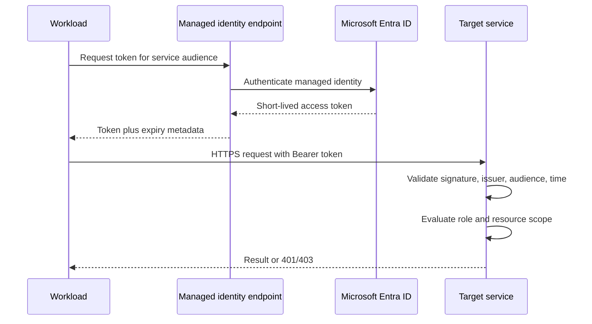
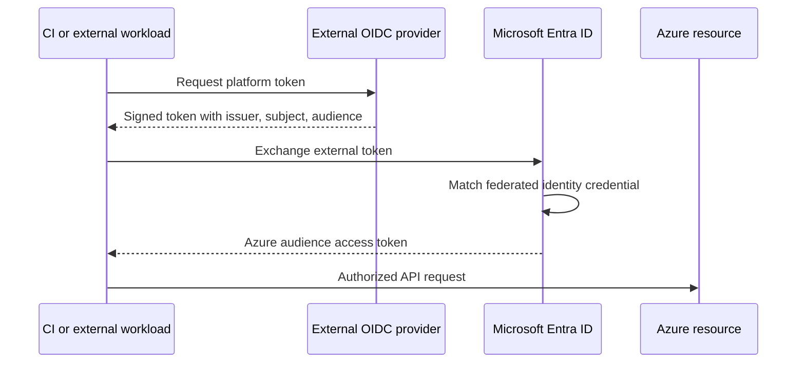

# Passwordless identity and secrets

A passwordless workload still has an identity.

It still requests a credential, presents that credential to a service, and receives an authorization decision.

The difference is that application operators do not create, copy, store, and rotate a long-lived password or client secret.

Managed identities and workload identity federation move credential issuance to trusted platforms.

This changes credential custody, not the authorization question. The workload still receives a bearer token for a specific audience, and the target service still evaluates roles, scopes, and network reachability. A passwordless design is safer because operators no longer distribute a long-lived secret, but its effectiveness depends on narrow permissions and a deterministic identity-selection rule.

Azure role-based access control (RBAC) still decides what the identity may do.

Private networking still decides whether the service is reachable.

This chapter designs the complete service-to-service path and the fallback secret lifecycle when passwordless access is unavailable.

## Learning objectives

After this chapter, you should be able to:

- distinguish authentication from authorization;
- explain OAuth access tokens, audiences, scopes, and roles;
- distinguish application objects, service principals, and managed identities;
- choose system-assigned or user-assigned managed identity;
- design workload identity federation for external workloads and CI/CD;
- apply Azure RBAC scope inheritance and least privilege;
- acquire and cache tokens without logging them;
- use Key Vault as a fallback secret system;
- design rotation, expiry, revocation, and break-glass access;
- support local development without production secrets;
- audit sign-ins, role changes, and data-plane access;
- diagnose network, token, and authorization failures separately.

## The costly failure

A team stores a client secret in a deployment variable.

The secret expires during a holiday and every model request fails.

Another team moves the value to Key Vault but leaves a bootstrap secret in application settings.

The location changed, but rotation and theft risk remain.

A third team enables managed identity and assigns `Owner` at subscription scope because the first request returned 403.

The application works, but a compromise now permits broad resource control.

Passwordless identity solves credential custody.

It does not solve excessive authorization, weak network controls, or missing audit evidence.

## Vocabulary

**Authentication** establishes which principal is making a request.

**Authorization** decides whether that principal may perform an operation on a resource.

A **security principal** represents a user, group, service principal, or managed identity.

An **application object** is the global definition of an application in its home Microsoft Entra tenant.

A **service principal** is the tenant-local identity instance used for access decisions.

A **managed identity** is a service principal whose credential lifecycle is managed by Azure.

An **access token** is a short-lived bearer credential intended for one resource audience.

An **audience** identifies the API expected to accept a token.

A **scope** can represent a delegated permission requested from an API.

An **application role** can represent an application permission included in an app-only token.

An **Azure role assignment** binds a principal, role definition, and Azure resource scope.

**Workload identity federation** exchanges a trusted external token for a Microsoft Entra access token without a stored client secret.

## System invariants

Every production workload has one explicit runtime identity.

Production code never falls back silently from managed identity to a developer credential.

Every token is requested for the exact target audience.

Every service validates issuer, signature, time, audience, and required authorization claims.

Every role assignment has a named business purpose and narrowest practical scope.

Deleting a workload removes or reviews all role assignments associated with its identity.

No access token, client secret, certificate private key, or storage key appears in logs.

Network reachability and authorization remain independent controls.

Break-glass access is time-bound, approved, monitored, and tested.

Credential and role changes produce auditable events outside the workload's control.

## Measurable requirements

The worked AI application reads prompts from Storage, retrieves documents from Search, calls a model, and reads one fallback API key from Key Vault.

Every supported Azure dependency uses Microsoft Entra token authentication.

No production client secret is stored in source, pipeline variables, images, or application configuration.

Runtime identities receive no subscription-wide data-plane roles.

Token acquisition p99 remains below 500 ms when a cache miss occurs.

Cached-token use adds less than 5 ms p99 to a dependency call.

Unauthorized role-assignment changes alert within 5 minutes.

Fallback secrets rotate without application downtime.

Emergency access activation expires within 60 minutes.

Access and audit logs are retained according to the organization's evidence policy.

## Authentication versus authorization

Authentication answers: which principal presented this token?

Authorization answers: may that principal read this blob, invoke this model, or retrieve this secret?

A valid token can still receive 403 because the principal lacks a required role.

A principal with the right role can still fail because it requested a token for the wrong audience.

A correct token and role can still fail because a firewall blocks the network path.

Diagnose these layers in order.

Key Vault explicitly requires both authentication and authorization before access ([Microsoft Learn](https://learn.microsoft.com/azure/key-vault/general/overview)).

Passwordless never means authorization-free.

## OAuth service-to-service flow



The workload does not send a client secret.

It requests a token from its trusted hosting environment.

The target validates the token and authorization.

The bearer token is still sensitive until it expires.

## Access tokens

Microsoft Entra access tokens carry claims used by a resource to make authorization decisions.

The intended resource appears in the `aud` claim ([Microsoft Learn](https://learn.microsoft.com/entra/identity-platform/access-tokens)).

Client applications should treat access tokens as opaque strings and use response metadata for expiry and scopes ([Microsoft Learn](https://learn.microsoft.com/entra/identity-platform/access-tokens)).

The resource API, not the client, validates the token ([Microsoft Learn](https://learn.microsoft.com/entra/identity-platform/access-tokens)).

A web API must reject a token whose audience does not identify that API ([Microsoft Learn](https://learn.microsoft.com/entra/identity-platform/access-tokens)).

Accepting another resource's token creates a confused-deputy risk.

Use supported authentication middleware rather than hand-written token parsing.

## Token validation

A resource validates the token signature against trusted published keys.

It validates issuer and tenant according to its single-tenant or multitenant policy.

It validates audience.

It validates `not before` and expiration times with a controlled clock skew.

It validates delegated scopes or application roles required by the operation.

It can apply resource-specific policy after those checks.

Microsoft Entra publishes signing keys through OpenID Connect metadata and rotates them, so validators must refresh keys automatically ([Microsoft Learn](https://learn.microsoft.com/entra/identity-platform/access-tokens)).

Do not authorize a caller merely because a token decodes as JSON.

## Scopes, roles, and Azure RBAC

OAuth scopes and application roles belong to an API's authorization model.

Azure RBAC applies role definitions and assignments to Azure resource scopes.

These concepts can both appear in one system but are not interchangeable.

An Azure role assignment has three elements: security principal, role definition, and scope ([Microsoft Learn](https://learn.microsoft.com/azure/role-based-access-control/overview)).

Azure scopes form a hierarchy of management group, subscription, resource group, and resource ([Microsoft Learn](https://learn.microsoft.com/azure/role-based-access-control/overview)).

A role assigned at a parent scope applies to child resources.

Azure RBAC permissions are additive across overlapping role assignments ([Microsoft Learn](https://learn.microsoft.com/azure/role-based-access-control/overview)).

A narrow role cannot subtract a broader inherited role.

## Control plane and data plane

The control plane creates and configures a resource.

The data plane reads or modifies the resource's content.

Do not grant a management role when the workload only needs data access.

For Key Vault, control-plane operations and secret, key, or certificate data-plane operations use independent authorization paths ([Microsoft Learn](https://learn.microsoft.com/azure/key-vault/general/rbac-guide)).

`Key Vault Contributor` manages the vault but does not read keys, secrets, or certificates ([Microsoft Learn](https://learn.microsoft.com/azure/key-vault/general/rbac-guide)).

`Key Vault Secrets User` can read secret contents under the Azure RBAC permission model ([Microsoft Learn](https://learn.microsoft.com/azure/key-vault/general/rbac-guide)).

Select the data-plane role that contains the required operation and nothing broader.

## Managed identities

Managed identities let Azure-hosted code obtain Microsoft Entra tokens without application-managed credentials ([Microsoft Learn](https://learn.microsoft.com/entra/identity/managed-identities-azure-resources/overview)).

The credentials are not exposed to operators or code ([Microsoft Learn](https://learn.microsoft.com/entra/identity/managed-identities-azure-resources/overview)).

The workload still receives a bearer access token and must protect it in memory and transit.

Managed identity works only with target services that support Microsoft Entra authentication ([Microsoft Learn](https://learn.microsoft.com/entra/identity/managed-identities-azure-resources/overview)).

Assign roles to the managed identity before use.

Do not confuse attaching an identity with granting it permission.

At runtime, the hosting environment proves the workload's identity to the token issuer, then the workload presents the resulting token to the target service. The identity attachment establishes who can request a token; the role assignment establishes which operation the target may accept. Keeping these records separate makes recovery precise: a token-acquisition failure points to identity availability or audience selection, whereas a valid-token 403 points to the resource authorization decision instead of a missing credential.

## System-assigned identity

A system-assigned managed identity is enabled on one Azure resource.

Azure creates a service principal tied to that resource's lifecycle ([Microsoft Learn](https://learn.microsoft.com/entra/identity/managed-identities-azure-resources/overview)).

Deleting the resource deletes the system-assigned identity ([Microsoft Learn](https://learn.microsoft.com/entra/identity/managed-identities-azure-resources/overview)).

Only that resource can request tokens as the identity ([Microsoft Learn](https://learn.microsoft.com/entra/identity/managed-identities-azure-resources/overview)).

Use it when identity and workload should share a lifecycle.

It reduces accidental sharing between workloads.

Recreating the resource can create a new principal ID, so deterministic deployment must update role assignments.

## User-assigned identity

A user-assigned managed identity is an independent Azure resource ([Microsoft Learn](https://learn.microsoft.com/entra/identity/managed-identities-azure-resources/overview)).

It can attach to multiple supported Azure resources and survives their deletion ([Microsoft Learn](https://learn.microsoft.com/entra/identity/managed-identities-azure-resources/overview)).

Use it when permissions must exist before compute, when compute is frequently replaced, or when several instances intentionally share one identity.

Sharing increases blast radius and makes per-instance attribution less precise.

Do not share one identity merely to reduce role-assignment work.

Track attachment and role membership as separate lifecycle records.

Delete unused user-assigned identities explicitly.

## Choosing identity type

Choose system-assigned for one workload resource with coupled lifecycle.

Choose user-assigned for blue-green deployments that need stable preauthorization.

Choose separate user-assigned identities for workloads with different permissions.

Do not assign both types without an explicit selection rule.

When several user-assigned identities are attached, code must identify the intended one.

The managed identity token interface supports selecting a user-assigned identity by client ID, object ID, or resource ID in documented contexts ([Microsoft Learn](https://learn.microsoft.com/entra/identity/managed-identities-azure-resources/how-to-use-vm-token)).

Record client ID and principal object ID separately because they serve different APIs.

## Compute is the identity boundary

All code running with equivalent access to a host can often request tokens for identities attached to that host.

Microsoft states that all code or scripts running on a VM can request tokens for managed identities available on it ([Microsoft Learn](https://learn.microsoft.com/entra/identity/managed-identities-azure-resources/how-to-use-vm-token)).

Do not colocate mutually untrusted workloads on one identity-capable host without stronger isolation.

Restrict arbitrary code execution, shell access, extensions, and metadata-service proxying.

Use separate compute boundaries for different trust levels.

Managed identity prevents credential extraction from configuration.

It does not make a compromised workload harmless.

## Token acquisition

On a VM, the Azure Instance Metadata Service exposes a local managed-identity token endpoint at `169.254.169.254` ([Microsoft Learn](https://learn.microsoft.com/entra/identity/managed-identities-azure-resources/how-to-use-vm-token)).

The request names the target resource, which becomes the token audience ([Microsoft Learn](https://learn.microsoft.com/entra/identity/managed-identities-azure-resources/how-to-use-vm-token)).

The required `Metadata: true` header helps mitigate server-side request forgery against the endpoint ([Microsoft Learn](https://learn.microsoft.com/entra/identity/managed-identities-azure-resources/how-to-use-vm-token)).

Prefer the Azure Identity library and service SDK over direct metadata calls ([Microsoft Learn](https://learn.microsoft.com/entra/identity/managed-identities-azure-resources/how-to-use-vm-token)).

SDKs handle platform differences, token requests, and refresh behavior.

Never expose a generic internal URL fetcher that can reach the metadata endpoint.

## Python example

```python
from azure.identity import ManagedIdentityCredential
from azure.keyvault.secrets import SecretClient

credential = ManagedIdentityCredential(client_id="<user-assigned-client-id>")
client = SecretClient(
    vault_url="https://example-vault.vault.azure.net",
    credential=credential,
)

secret = client.get_secret("fallback-api-key")
```

The code selects one user-assigned identity explicitly.

It gives the credential object to the Key Vault client instead of manually constructing authorization headers.

The secret value must not be logged.

Azure recommends managed identity for Azure-hosted Python applications and token-based authentication over connection strings ([Microsoft Learn](https://learn.microsoft.com/azure/developer/python/sdk/authentication/overview)).

## Credential reuse and caching

Create a long-lived credential and service client per process where the SDK is designed for reuse.

Do not request a new token for every application operation.

Reusing credential instances enables underlying token caching and reduces Microsoft Entra request volume ([Microsoft Learn](https://learn.microsoft.com/dotnet/azure/sdk/authentication/best-practices)).

High-volume applications that fail to reuse credentials can encounter throttling ([Microsoft Learn](https://learn.microsoft.com/dotnet/azure/sdk/authentication/best-practices)).

Use token response expiry or SDK refresh metadata rather than parsing client-side token claims ([Microsoft Learn](https://learn.microsoft.com/entra/identity-platform/access-tokens)).

Refresh before expiry with jitter to avoid a fleet-wide surge.

Never persist access tokens in a shared disk cache unless the library's threat model supports it.

## Retry behavior

Differentiate configuration errors from transient identity-service errors.

Do not retry an invalid audience indefinitely.

Retry temporary metadata-service failures and throttling with bounded exponential backoff.

Microsoft documents retryable 404, 429, and 5xx conditions for the VM managed-identity endpoint and treats malformed 4xx requests as design errors ([Microsoft Learn](https://learn.microsoft.com/entra/identity/managed-identities-azure-resources/how-to-use-vm-token)).

Bound retry duration below the caller's latency budget.

Use circuit and queue controls so an identity outage does not create unbounded waiting requests.

Continue using a valid cached token until its safe refresh boundary.

## Production credential determinism

Developer credential chains are convenient locally.

They can be dangerous in production if a failed managed identity silently falls through to a logged-in operator.

Microsoft recommends a deterministic credential such as `ManagedIdentityCredential` for production rather than an unconstrained `DefaultAzureCredential` chain ([Microsoft Learn](https://learn.microsoft.com/dotnet/azure/sdk/authentication/best-practices)).

Select credential type from an immutable environment mode.

Fail startup when the required production identity is unavailable.

Log the credential type and principal ID, never the token.

Alert if a production host gains unexpected developer tooling or interactive login state.

## Workload identity federation

Federation creates trust between an external identity provider and a Microsoft Entra application or user-assigned managed identity.

The external workload obtains a signed token from its platform.

It exchanges that token for a Microsoft Entra access token.

No long-lived Microsoft Entra client secret is stored in the external platform.

Microsoft documents GitHub Actions, Kubernetes, other clouds, and external compute as supported federation scenarios ([Microsoft Learn](https://learn.microsoft.com/entra/workload-id/workload-identity-federation)).

Issuer, subject, and audience values must match case-sensitively ([Microsoft Learn](https://learn.microsoft.com/entra/workload-id/workload-identity-federation)).

Constrain subjects to an exact repository, branch, environment, service account, or workload identity.

## Federation flow



The trust rule is the credential.

An overly broad subject is equivalent to giving many workloads access.

Review federation changes like secret changes.

Expire or remove stale trust records when repositories, branches, or clusters change.

## CI/CD identities

Use separate identities for build, infrastructure deployment, model registration, and production promotion.

Do not grant every pipeline one shared subscription Owner identity.

GitHub Actions supports OpenID Connect sign-in through an Entra application or user-assigned managed identity; service-principal secret sign-in is not recommended ([Microsoft Learn](https://learn.microsoft.com/azure/developer/github/connect-from-azure)).

Azure Pipelines recommends workload identity federation for Azure Resource Manager service connections ([Microsoft Learn](https://learn.microsoft.com/azure/devops/pipelines/library/connect-to-azure)).

Authorize Azure Pipelines service connections to individual pipelines instead of granting all pipelines by default ([Microsoft Learn](https://learn.microsoft.com/azure/devops/pipelines/library/connect-to-azure)).

Bind production federation to protected environments and approval policy.

## Local development

Local developers do not have managed identity endpoints on ordinary workstations.

Use developer account credentials, a broker, or a dedicated development service principal according to policy.

Microsoft recommends developer credentials only for local development and managed identity for Azure-hosted Python applications ([Microsoft Learn](https://learn.microsoft.com/azure/developer/python/sdk/authentication/overview)).

Give developers access only to development resources.

Do not grant local identities read access to production Key Vault merely to simplify testing.

Use dependency injection so local and hosted credential providers share the same service client interface.

Integration tests in Azure should use a test managed identity.

## RBAC least privilege

Start from the operation, resource, and environment.

Map the operation to required data actions.

Select the narrowest built-in role that contains them.

Assign at the resource or resource-group scope that matches ownership.

Avoid subscription scope for one application dependency.

Avoid wildcard custom roles unless each wildcard is justified.

Do not grant role-assignment write permissions to ordinary runtime identities.

Role assignment itself is a privileged control-plane action.

Review inherited roles before concluding the direct assignment is least privilege.

## RBAC example matrix

| Identity | Target | Required operation | Candidate scope |
| --- | --- | --- | --- |
| API runtime | Blob container | Read prompt objects | Storage account or narrower supported scope |
| Retrieval worker | Search service | Query indexes | Search service |
| API runtime | Key Vault | Read fallback secret | Application vault |
| Deployment pipeline | Model endpoint | Update deployment | Specific endpoint resource |
| Auditor | Logs | Read evidence | Security log workspace |

Validate exact current role definitions before deployment.

Role names can obscure management versus data-plane differences.

Use role definition IDs in automation where practical.

## Bicep role assignment

```bicep
param principalId string
param keyVaultId string
param keyVaultSecretsUserRoleId string

resource secretReader 'Microsoft.Authorization/roleAssignments@2022-04-01' = {
  name: guid(keyVaultId, principalId, keyVaultSecretsUserRoleId)
  scope: resourceGroup()
  properties: {
    principalId: principalId
    principalType: 'ServicePrincipal'
    roleDefinitionId: keyVaultSecretsUserRoleId
  }
}
```

In a real template, set the deployment scope to the actual Key Vault resource rather than a broader placeholder resource group.

Use a deterministic GUID from scope, principal ID, and role definition ID.

Microsoft recommends deterministic unique role-assignment names and setting `principalType` when creating a new principal to reduce replication-related failures ([Microsoft Learn](https://learn.microsoft.com/azure/role-based-access-control/troubleshooting)).

## RBAC propagation

Role changes are distributed state, not instant local variables.

Azure RBAC changes can take up to 10 minutes to take effect in documented scenarios, and refreshing the access token can refresh observed permissions ([Microsoft Learn](https://learn.microsoft.com/azure/role-based-access-control/troubleshooting)).

Managed identity group membership can take longer because backend caches are involved ([Microsoft Learn](https://learn.microsoft.com/azure/role-based-access-control/troubleshooting)).

Do not add broad permissions while waiting for propagation.

Deployment health checks should retry a narrow authorization probe for a bounded period.

Log assignment ID, scope, principal ID, and role ID.

Avoid group-based managed-identity authorization where immediate revocation is required.

## Passwordless flow image


Credits: Hazem Ali

The image separates token issuance from target-service authorization.

The private endpoint constrains network reachability.

RBAC constrains permitted operations.

Audit records capture both identity and resource decisions.

The crossed-out embedded secret represents the credential class removed from application custody.

## Key Vault as secret fallback

Some external APIs still require an API key or client credential.

Store that unavoidable secret in Key Vault rather than source, images, or ordinary configuration.

Key Vault centralizes secrets and lets applications retrieve specific secret versions by URI ([Microsoft Learn](https://learn.microsoft.com/azure/key-vault/general/overview)).

Key Vault authentication uses Microsoft Entra ID, and data access uses Azure RBAC or legacy access policy depending on vault configuration ([Microsoft Learn](https://learn.microsoft.com/azure/key-vault/general/overview)).

Use managed identity to authenticate the application to Key Vault.

This creates a passwordless bootstrap even when the downstream protocol is not passwordless.

Keep each application's secret boundary narrow.

## Key Vault request path

Key Vault evaluates network reachability, token validity, and operation permission as separate stages.

Its documented flow checks firewall or private-link access, validates the token, and then checks operation authorization ([Microsoft Learn](https://learn.microsoft.com/azure/key-vault/general/authentication)).

A private endpoint without `Key Vault Secrets User` still returns forbidden.

The right role over a blocked public network still cannot connect.

Control-plane `Reader` does not reveal secret values.

Data-plane metadata reader and secret-value reader are also distinct roles ([Microsoft Learn](https://learn.microsoft.com/azure/key-vault/general/rbac-guide)).

Use private DNS and preserve TLS hostname validation.

The secret retrieval path is deliberately a sequence of gates rather than one trust decision. Network policy prevents an unapproved source from reaching the vault, token validation binds the request to a principal and audience, and data-plane authorization binds that principal to a secret operation. A failure at one gate should not be worked around by broadening another: temporarily bypassing a private endpoint to address a role failure, for example, changes exposure without repairing the denied operation. The request identifier, principal ID, secret name reference, and decision code provide enough evidence to recover the failed stage without collecting the secret value.

## Secret versioning contract

```json
{
  "logical_name": "partner-api-key",
  "active_version": "9f0c1a...",
  "created_at": "2026-08-01T10:00:00Z",
  "not_after": "2026-11-01T10:00:00Z",
  "owner": "integration-platform",
  "rotation_runbook": "RB-SEC-014",
  "consumer": "document-enrichment-worker",
  "classification": "credential"
}
```

Keep metadata in governance records and supported secret tags without exposing the value.

The application normally requests the current enabled version by logical name.

Emergency rollback can pin a previous still-valid version for a bounded period.

## Rotation without downtime

First create the new downstream credential.

Store it as a new Key Vault secret version.

Validate it from a canary identity and network path.

Switch consumers by cache expiry, configuration pointer, or controlled restart.

Observe successful use of the new version.

Revoke the old downstream credential.

Disable the old Key Vault version after rollback expires.

Delete or purge only under retention and recovery policy.

Never overwrite evidence that identifies which version served an incident.

## Secret caching

Fetching Key Vault on every business request increases latency and dependency load.

Cache the secret in process memory for a bounded period shorter than the rotation overlap.

Do not write it to disk, crash dumps, telemetry, or exception messages.

Refresh asynchronously before expiry.

Keep the last valid value only while policy allows stale use.

If revocation must be immediate, reduce cache lifetime or add a revocation channel.

Separate token cache lifetime from secret cache lifetime.

They protect different credentials and have different revocation semantics.

## Break-glass access

Break-glass is an emergency authorization path, not a shared permanent password.

Use a dedicated identity protected by strong authentication and monitored activation.

Keep it outside ordinary automation.

Require incident ID, approver, reason, target scope, and expiration.

Grant the minimum temporary role.

Alert security immediately on activation and use.

Record all operations and review them after the incident.

Test the process without exposing the credential or normalizing routine use.

## Private networking

Managed identity token issuance and target-service data paths have different endpoints.

Allow the identity platform and required metadata-service path.

Resolve Storage, Search, model, and Key Vault FQDNs to private endpoints where required.

Private Link does not grant RBAC permission.

RBAC does not create a network route.

Key Vault can restrict access by private endpoint, VNet, service endpoint, or IP firewall according to configuration ([Microsoft Learn](https://learn.microsoft.com/azure/key-vault/general/authentication)).

Test DNS, TCP, TLS, token, and role independently.

Never route the link-local metadata endpoint through an HTTP proxy; Microsoft documents proxy use with IMDS as unsupported ([Microsoft Learn](https://learn.microsoft.com/entra/identity/managed-identities-azure-resources/how-to-use-vm-token)).

## Threat model

An attacker may read a secret from source history.

Federation and managed identity remove that stored secret class.

An attacker may execute code on identity-enabled compute.

Host isolation and least privilege limit that path.

An attacker may request a token for an unintended resource.

Audience validation and attached-identity controls limit acceptance.

An attacker may assign themselves a broad role.

Separation of role-administration duties and audit alerts address that path.

An attacker may exploit server-side request forgery to reach metadata.

URL egress controls, metadata headers, and application input validation reduce that risk.

An insider may read Key Vault values.

Data-plane least privilege and audit logging expose and constrain access.

## Audit architecture

Record managed identity creation, deletion, and attachment.

Record app registration and federated credential changes.

Record role definition and role assignment changes.

Record Key Vault network and permission-model changes.

Record token acquisition failures without recording token contents.

Record target-service authorization failures by principal and operation.

Record secret get, set, disable, delete, recover, and purge operations.

Record break-glass activation and every operation under it.

Send logs to a security-owned destination that the workload cannot alter.

## Sign-in and resource logs

Microsoft Entra sign-in logs include separate service-principal and managed-identity sign-in categories ([Microsoft Learn](https://learn.microsoft.com/entra/identity/monitoring-health/concept-sign-ins)).

They help identify which identity accessed which resource and through which application context ([Microsoft Learn](https://learn.microsoft.com/entra/identity/monitoring-health/concept-sign-ins)).

Key Vault `AuditEvent` logs include operation, result, caller IP, correlation ID, and token identity information ([Microsoft Learn](https://learn.microsoft.com/azure/key-vault/general/logging)).

Key Vault logging must be enabled and its destination access must be governed ([Microsoft Learn](https://learn.microsoft.com/azure/key-vault/general/logging)).

Correlate application request ID, identity principal ID, target resource ID, and service correlation ID.

Alert on new principals, unusual audiences, denied secret reads, and role changes.

## Observability

Track token cache hit rate.

Track token acquisition latency and status by credential type and audience.

Track 401 separately from 403.

Track RBAC propagation wait during deployment.

Track secret-cache age and active version.

Track calls per identity, resource, operation, and environment.

Track federation exchanges by issuer and subject.

Track unused identities and stale role assignments.

Track secret expiry lead time and rotation drill success.

Never use the access token or secret value as a metric dimension.

## Failure diagnosis ladder

**DNS or connection timeout:** inspect private DNS, route, firewall, and service endpoint state.

**Metadata endpoint unavailable:** confirm the workload supports managed identity, identity attachment, local endpoint, and proxy bypass.

**Token request 400:** inspect tenant, audience or resource, selected identity, and request format.

**Token request 429 or 5xx:** reuse cached credentials and apply bounded backoff.

**Target returns 401:** inspect token expiry, audience, issuer, signature validation, and authorization header.

**Target returns 403:** inspect principal object ID, role data actions, assignment scope, deny conditions, network firewall semantics, and propagation.

**Works locally but not in Azure:** verify production explicitly selected managed identity and that the role is assigned to its principal, not the developer.

**Works in Azure but not locally:** verify the developer identity has development-only roles and the local credential chain selected it.

## Common identity mistakes

Assigning a role to the managed identity client ID where an API expects principal object ID.

Requesting a management-plane token for a data-plane API.

Assigning `Contributor` and expecting data read access.

Assigning a data role at subscription scope for one storage account.

Creating a user-assigned identity but not attaching it to compute.

Attaching several identities but not selecting one in code.

Using `DefaultAzureCredential` in production without constraining its chain.

Creating a private endpoint but forgetting public-access policy or private DNS.

Rotating a secret without an overlap period.

Logging full exception objects that contain authorization headers.

## Backpressure and identity outages

An identity outage should not create unlimited waiting work.

Bound incoming queues by request count, bytes, and age.

Use valid cached tokens until their safe expiry.

Reject or degrade nonessential work when no valid credential remains.

Do not bypass authorization or switch to an embedded emergency secret automatically.

Apply retry budgets below upstream deadlines.

Use jitter so a fleet does not refresh simultaneously.

Separate target-service throttling from identity-service throttling in metrics.

## Recovery and disaster planning

Managed identities and role assignments are configuration state that must be recreated or preprovisioned in recovery environments.

User-assigned identities can provide stable lifecycle separation, but regional and service support must be verified.

Precreate recovery role assignments at narrow scopes.

Validate federation trust for recovery pipelines.

Replicate or recover Key Vault content according to service and organizational policy.

Test private DNS and endpoint paths from recovery compute.

Test token audience and target roles before traffic failover.

Keep break-glass access independent of the failed application path.

## Cost and capacity

Managed identities themselves are available without extra managed-identity usage cost according to the service overview ([Microsoft Learn](https://learn.microsoft.com/entra/identity/managed-identities-azure-resources/overview)).

Identity engineering still has operational cost.

Key Vault operations, private endpoints, logs, retention, and security monitoring add service cost.

Token caching reduces identity-platform call load and latency.

Let request rate be $R$, token lifetime be $T$, and process count be $N$.

With one independently cached token per process and ideal refresh, token request rate is approximately:

$$
Q_{token}\approx\frac{N}{T}
$$

Without caching it approaches business request rate $R$.

At 1,000 application requests/s, 100 processes, and one-hour token reuse, ideal token requests average about $100/3600=0.028$ per second rather than 1,000 per second.

## Alternatives and trade-offs

Use system-assigned identity for isolated workloads with coupled lifecycle.

Use user-assigned identity for preauthorization, replacement, or intentional sharing.

Use workload identity federation for external platforms and CI/CD.

Use a service principal with certificate only when managed identity or federation is unavailable and the certificate lifecycle is governed.

Use a client secret only as a last-compatible option with short lifetime, Key Vault storage, rotation, and monitoring.

Use per-application vaults when that boundary simplifies authorization and operations.

Use shared vaults only with clear ownership and access isolation.

Use custom roles only when built-in roles are materially too broad or lack required operations.

## Design review checklist

- Is authentication distinct from authorization in the design?
- Does every production workload select one deterministic identity?
- Is the identity type matched to workload lifecycle?
- Is every token requested for the exact target audience?
- Does each target validate issuer, signature, time, audience, and permission?
- Are data-plane roles used instead of broad management roles?
- Are role assignments at the narrowest practical scope?
- Are inherited and group-derived permissions included in review?
- Are credential and service-client instances reused safely?
- Does CI/CD use federation with constrained issuer, subject, and audience?
- Are local developer roles isolated from production?
- Are unavoidable secrets stored, cached, rotated, and revoked safely?
- Is break-glass access time-bound and audited?
- Are private networking and RBAC both tested?
- Can logs correlate principal, token audience, operation, and target resource?

## Hands-on exercise

Design identity for an AI application that reads Blob Storage, queries Search, calls a model endpoint, and reads one partner API key.

Choose system-assigned or user-assigned identity and defend the lifecycle decision.

List the exact data operations required for each Azure dependency.

Select candidate built-in roles and assign each at a resource-level scope.

Draw the token request and target authorization sequence.

Explain the audience error produced by using an Azure Resource Manager token against Key Vault.

Write Python code using an explicit managed identity credential.

Define one reusable credential and client lifecycle per process.

Calculate ideal token request rate for 250 processes with 75-minute token reuse.

Create a GitHub or Azure Pipelines federation rule constrained to one production environment.

Define separate build, deployment, and runtime identities.

Design a Key Vault secret rotation with 24-hour overlap and rollback.

Inject a private DNS failure and identify why RBAC changes cannot fix it.

Inject a 401 wrong-audience failure and identify why role changes cannot fix it.

Inject a 403 after a new role assignment and define a bounded propagation check.

Create alerts for new role assignment, unusual managed-identity sign-in, and secret read denial.

Run a break-glass exercise with timed activation and post-incident review.

Finish with a threat model for code execution on identity-enabled compute.

## What, why, and how

Passwordless identity replaces application-managed long-lived credentials with platform-issued short-lived tokens.

It reduces secret theft, expiry, and rotation failures but does not remove authorization or network controls.

Managed identity serves Azure-hosted workloads, while workload identity federation serves trusted external platforms and CI/CD.

The secure system combines exact token audiences, least-privilege roles, private paths, governed fallback secrets, complete audit, and tested recovery.