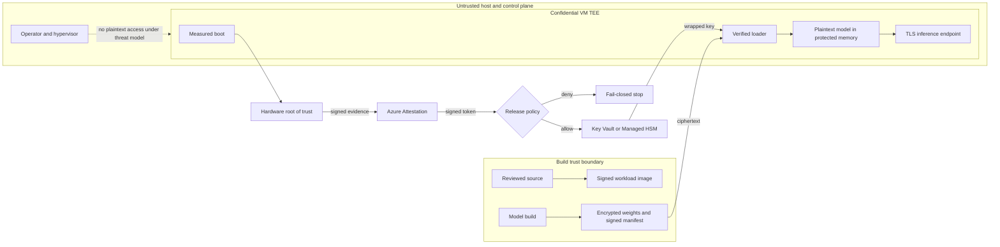
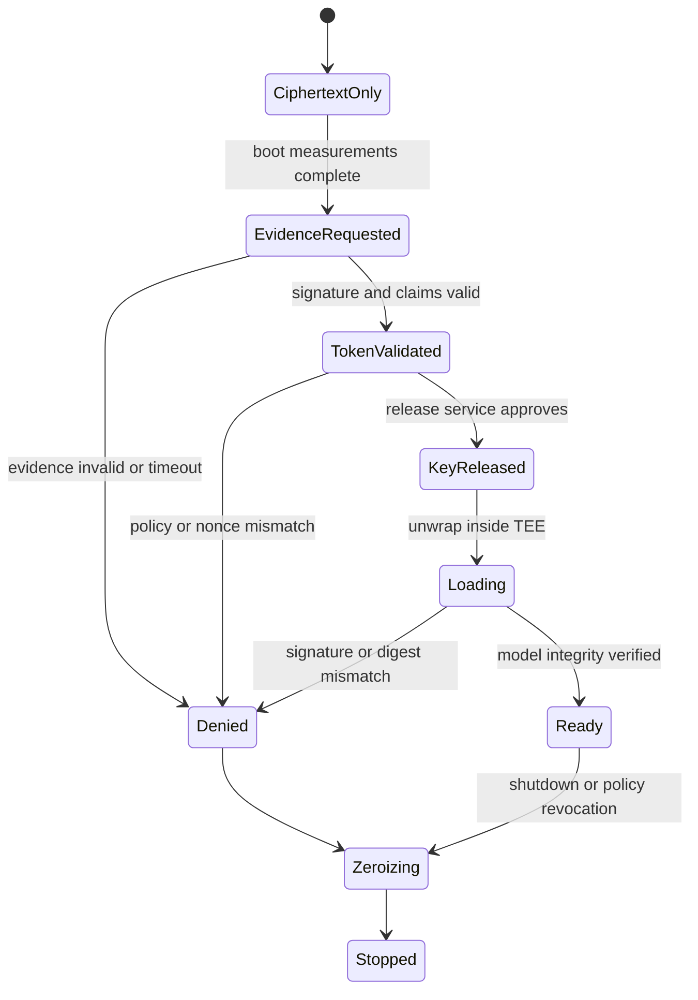

# Confidential compute and model protection

Encryption at rest protects stored bytes.

Transport Layer Security (TLS) protects bytes moving between endpoints.

Neither control automatically protects plaintext while a processor uses it.

Confidential computing addresses that third state: data in use.

It runs code and data inside a hardware-enforced, attested Trusted Execution Environment (TEE).

The protection claim is conditional rather than magical. Hardware can isolate approved in-use memory from parts of the host boundary, but the key-release system must first establish which workload actually started and whether its measured configuration satisfies policy. Encrypting an artifact without binding key release to that evidence merely moves the plaintext boundary to an ordinary process.

This chapter designs a model-serving system in which plaintext weights and release keys exist only inside an approved TEE.

## Learning objectives

After this chapter, you should be able to:

- distinguish protection at rest, in transit, and in use;
- explain hardware roots of trust, measurements, evidence, and attestation;
- define an attestation policy and relying party;
- bind key release to measured workload identity;
- distinguish confidential VM memory and disk controls;
- explain virtual Trusted Platform Module (vTPM) and Secure Boot roles;
- choose platform-managed or customer-managed disk keys;
- design encrypted model artifacts and signed manifests;
- validate attestation tokens without trusting decoded JSON;
- operate a fail-closed startup state machine;
- state excluded threats and residual risks;
- calculate loading, memory, latency, and recovery budgets.

## The costly failure

A team encrypts model weights in object storage.

Its startup script downloads the ciphertext and retrieves a key with ordinary workload identity.

A compromised host administrator snapshots process memory after decryption.

The storage encryption worked, but the valuable state was plaintext during use.

Another team deploys a confidential VM but releases keys before checking its measurement.

The TEE then protects an altered loader just as effectively as the intended loader.

A third team enables confidential OS disk encryption but leaves swap on an unprotected temporary disk.

Prompt fragments and model pages cross the intended boundary.

Confidential hardware is useful only when artifact identity, measured startup, key release, memory use, and egress policy form one chain.

## Vocabulary

**Data at rest** is persisted data such as model blobs, disks, snapshots, and backups.

**Data in transit** is data moving through a network connection.

**Data in use** is plaintext in registers, caches, accelerator memory, or main memory during computation.

A **TEE** is a hardware-enforced execution boundary that isolates code and data from specified privileged software.

A **hardware root of trust** is hardware-backed key material and logic used to sign trustworthy evidence.

A **measurement** is a cryptographic digest representing code, configuration, or boot state.

**Evidence** is a signed hardware report containing measurements and security claims.

**Attestation** validates evidence and evaluates it against policy.

An **attestation policy** states which hardware, firmware, measurements, and settings are acceptable.

An **attestation token** is a signed claims document issued after successful policy evaluation.

An **attester** is the workload presenting evidence.

A **relying party** validates the token before making a security decision.

**Secure key release** permits key export only when attestation claims satisfy a release policy.

A **vTPM** is a VM-specific virtualized Trusted Platform Module used for protected keys and measurements.

**Secure Boot** verifies signatures on boot components before execution.

## The controlling invariant

Plaintext model weights and release keys are released only to a measured workload satisfying the approved attestation policy.

The invariant has four proof obligations.

The artifact store must contain only encrypted weights plus a signed manifest.

The hardware must produce evidence bound to the running environment.

The relying party must validate token signature, issuer, audience, freshness, nonce, and required claims.

The key service must enforce the same policy at release time.

This establishes a conditional release decision.

It does not prove that application code is bug-free.

It does not prevent an authorized application from returning model-derived information.

It does not prevent denial of service by the host.

It does not eliminate all side channels.

It does not protect against a compromised guest administrator already authorized inside the VM.

## Additional invariants

Every model artifact has a content digest, signature, owner, and version.

Every accepted measurement maps to reviewed source and build provenance.

No fallback path returns an unwrapped key after attestation failure.

An expired token never authorizes a new release.

The attestation nonce is unique to one startup attempt.

TLS terminates inside the approved workload boundary where the design requires confidential requests.

Plaintext weights never enter persistent logs, crash dumps, snapshots, or unencrypted swap.

Egress destinations and operations are independent of model output.

Policy changes require review, versioning, and an expiry for transitional measurements.

Audit records cannot be modified by the workload identity.

## Measurable requirements

The worked service loads a 140 GB encrypted model.

Artifact signature verification must fail closed.

Attestation plus key release p99 must complete within 5 seconds.

Model-ready startup p95 must complete within 180 seconds.

No plaintext weight page may be written to persistent storage.

At least two approved measurements may coexist for a 24-hour rolling deployment.

Revoked measurements must stop receiving new keys within 10 minutes.

Attestation and key-release failures must alert within 5 minutes.

Recovery capacity must support the model in a second approved region.

The service must retain release evidence for the audit policy period.

The runtime identity may read ciphertext but cannot change release policy.

The policy identity may change policy but cannot invoke inference.

## Threat model

The design includes a malicious or compromised host operator.

It includes a compromised hypervisor or host management stack.

It includes a neighboring tenant attempting memory access.

It includes stolen disks, snapshots, and object-storage copies.

It includes a network observer.

It includes an insider with storage or infrastructure access.

It includes a substituted model artifact or workload image.

It includes rollback to an old but vulnerable measured image.

The design qualifies side-channel resistance by hardware generation and workload behavior.

It excludes availability against an operator who can stop or starve the VM.

It excludes application vulnerabilities that reveal data through approved interfaces.

It excludes authorized output leakage unless separate output policy blocks it.

It excludes a guest administrator with legitimate access to plaintext process memory.

It excludes compromised source, build, or signing systems unless provenance controls detect them.

## Data-state model

Weights at rest are encrypted with a data-encryption key.

The data-encryption key is wrapped by a release key held in a governed key service.

The manifest signs the ciphertext digest, model identity, loader identity, and expected policy.

TLS protects ciphertext downloads and inference connections.

The TEE protects plaintext memory from the declared host boundary.

Zeroization shortens plaintext lifetime after shutdown or failed loading.

Each state needs its own control.

Confidential computing complements storage and transport encryption rather than replacing them.

Azure describes confidential computing as hardware-based, attested TEE processing that protects data in use from unauthorized access, including cloud operators when configured correctly ([Microsoft Learn](https://learn.microsoft.com/azure/confidential-computing/overview)).

## Confidential VM boundary

An Azure confidential VM creates a hardware-enforced boundary between guest state and the virtualization stack ([Microsoft Learn](https://learn.microsoft.com/azure/confidential-computing/confidential-vm-overview)).

The exact boundary depends on processor family, VM size, image, and enabled disk settings.

Do not reduce the claim to "the VM is confidential."

State whether CPU memory, vTPM state, OS disk, temporary disk, and accelerator memory are protected.

Azure confidential VMs expose dedicated vTPM and Secure Boot capabilities ([Microsoft Learn](https://learn.microsoft.com/azure/confidential-computing/confidential-vm-overview)).

The vTPM stores measurements and protects secrets used by the guest.

Secure Boot verifies signed boot loaders, kernels, and drivers.

Neither mechanism identifies an application artifact unless its measurement reaches the policy.

## Disk protection

Confidential OS disk encryption binds disk keys to the VM vTPM and can keep keys from Azure host components ([Microsoft Learn](https://learn.microsoft.com/azure/confidential-computing/confidential-vm-overview)).

The option is selected at deployment and cannot be changed afterward ([Microsoft Learn](https://learn.microsoft.com/azure/confidential-computing/confidential-vm-overview)).

Platform-managed keys simplify operations.

Customer-managed keys improve customer control but add key availability, rotation, and recovery dependencies.

Azure currently supports offline rather than automatic key rotation for this confidential disk path ([Microsoft Learn](https://learn.microsoft.com/azure/confidential-computing/confidential-vm-overview)).

Temporary disks require a separate opt-in encryption control ([Microsoft Learn](https://learn.microsoft.com/azure/confidential-computing/confidential-vm-overview)).

This matters because swap, caches, logs, and temporary checkpoints can contain plaintext.

Disable swap or prove temporary disk encryption before loading weights.

## GPU qualification

Do not infer GPU confidentiality from confidential CPU memory.

Azure lists an H100 confidential VM series among supported sizes, while older confidential AI guidance also describes some accelerator offerings as limited preview ([Microsoft Learn](https://learn.microsoft.com/azure/confidential-computing/confidential-vm-overview), [Microsoft Learn](https://learn.microsoft.com/azure/confidential-computing/confidential-ai)).

Verify the current SKU, region, driver, guest, interconnect, and attestation path before design approval.

State whether CPU-to-GPU links are protected.

State whether accelerator memory is encrypted.

State which measurements identify firmware and drivers.

State whether multi-GPU communication remains inside the claimed boundary.

If any answer is unknown, qualify the design rather than claiming end-to-end confidential inference.

## Measurement and evidence

Measured boot extends digests through each boot stage.

The final values summarize what loaded, not why it is safe.

Hardware signs evidence containing measurements and security settings.

The verifier validates that signature against trusted hardware roots.

Azure confidential VM reports include platform settings, firmware measurements, and OS measurements ([Microsoft Learn](https://learn.microsoft.com/azure/confidential-computing/confidential-vm-overview)).

Application measurement must also cover the loader, policy agent, and configuration that control decryption.

If configuration arrives after measurement, bind its digest into evidence or validate a signed manifest before release.

## Attestation policy

Policy converts validated claims into an allow or deny decision.

Azure Attestation validates evidence, evaluates customer-defined policy, and signs a token for relying parties ([Microsoft Learn](https://learn.microsoft.com/azure/attestation/overview)).

Failure to pass policy results in no attestation token ([Microsoft Learn](https://learn.microsoft.com/azure/attestation/basic-concepts)).

Policy should constrain hardware security version.

Policy should constrain debug state.

Policy should constrain workload measurement.

Policy should constrain signer or image digest.

Policy should constrain minimum security version to prevent rollback.

Policy should emit a policy-version claim.

Policy should never accept a missing claim as a wildcard.

Attestation is useful because the release decision is bound to observed state rather than to a deployment label supplied by an operator. The verifier compares signed evidence with a policy that names acceptable measurements and security properties, then the key-release service evaluates the resulting claims before returning protected key material. A changed image, disabled protection feature, or rolled-back component produces a different or insufficient claim set, so startup stops before plaintext weights are loaded. This failure is recoverable through a reviewed policy or artifact update, not through a generic override that would detach key release from measured state.

## Architecture



The build boundary establishes artifact identity.

The hardware boundary establishes measured execution state.

The attestation service converts evidence into signed claims.

The key service remains the final release enforcement point.

The untrusted host can block progress but cannot receive plaintext through this path.

## Instructional figure


Credits: Hazem Ali

The figure separates control-plane placement from data-plane key use.

Its deny path matters as much as its successful path.

The operator and hypervisor remain outside the TEE boundary.

Application defects and output leakage remain inside the residual-risk box.

## Startup state machine



No transition bypasses `TokenValidated`.

No transition from `Denied` reaches `Ready`.

Retries create a new nonce and bounded attempt.

The service publishes readiness only after model digest verification.

## Detailed startup flow

1. Boot the confidential VM with Secure Boot and required disk controls.
2. Measure firmware, boot chain, loader, and release-relevant configuration.
3. Generate a fresh cryptographic nonce.
4. Request hardware-signed evidence bound to that nonce.
5. Send evidence to the configured attestation provider over TLS.
6. Let the provider validate hardware evidence and evaluate policy.
7. Reject absence, timeout, malformed response, or policy denial.
8. Retrieve current signing metadata through the documented metadata endpoint.
9. Validate token signature and algorithm.
10. Validate exact issuer and expected audience.
11. Validate issued-at, not-before, expiry, and bounded clock skew.
12. Validate nonce, hardware claims, debug state, measurement, and policy version.
13. Present validated claims to the key-release service.
14. Let release policy independently constrain accepted claims.
15. Return only a wrapped key to the attested workload.
16. Unwrap the key inside the TEE.
17. Download encrypted weights and signed manifest.
18. Verify manifest signer, artifact digest, loader version, and anti-rollback version.
19. Decrypt directly into protected memory with bounded buffers.
20. Zeroize temporary keys and publish readiness.

## Token validation contract

Azure Attestation returns a signed JSON Web Token and exposes signing metadata through OpenID configuration ([Microsoft Learn](https://learn.microsoft.com/azure/attestation/basic-concepts)).

```json
{
  "iss": "https://attest.example.attest.azure.net",
  "aud": "model-key-release",
  "iat": 1786550400,
  "nbf": 1786550400,
  "exp": 1786550700,
  "nonce": "base64url-random-256-bit-value",
  "tee": "expected-hardware-family",
  "debug": false,
  "measurement": "sha256:approved-workload-digest",
  "security_version": 17,
  "policy_version": "model-release-12"
}
```

Claim names vary by attestation type and current service contract.

Treat the schema as an application normalization layer, not a copied Azure token.

## Validation pseudocode

```python
def authorize_release(token, expected, metadata):
    header = parse_header_without_trusting_claims(token)
    require(header["alg"] in expected.allowed_algorithms)
    key = metadata.key_for(header["kid"])
    claims = verify_signature(token, key)
    require(claims["iss"] == expected.issuer)
    require(claims["aud"] == expected.audience)
    require_fresh(claims["nbf"], claims["exp"], expected.clock_skew)
    require(constant_time_equal(claims["nonce"], expected.nonce))
    require(claims["debug"] is False)
    require(claims["measurement"] in expected.measurements)
    require(claims["security_version"] >= expected.minimum_security_version)
    require(claims["policy_version"] == expected.policy_version)
    return short_lived_release_context(claims)
```

Decoding a token is not validation.

Reject unknown algorithms and keys.

Refresh signing metadata with bounded caching and rotation overlap.

Azure documents additional checks for the attestation service TEE and signing-key binding where that assurance is required ([Microsoft Learn](https://learn.microsoft.com/azure/attestation/overview)).

## Artifact contract

```json
{
  "model_id": "assistant-70b",
  "model_version": "2026-08-12.3",
  "ciphertext_uri": "https://storage.example/models/assistant-70b.enc",
  "ciphertext_sha256": "...",
  "plaintext_sha256": "...",
  "encryption": "AES-256-GCM",
  "wrapped_key_id": "model-release-key/42",
  "loader_measurement": "sha256:...",
  "minimum_security_version": 17,
  "manifest_signer": "model-release-signing-3",
  "signature": "base64url-signature"
}
```

The ciphertext digest detects storage corruption before decryption.

The authenticated-encryption tag detects ciphertext modification.

The plaintext digest verifies the loaded model after decryption.

The loader measurement prevents an arbitrary approved VM from receiving the key.

The minimum version prevents rollback to a known-vulnerable loader.

## Component responsibilities

The build pipeline produces reproducible signed workload images.

The model pipeline encrypts weights and signs immutable manifests.

The artifact store serves ciphertext and cannot release keys.

The hardware produces signed evidence.

Azure Attestation validates evidence and evaluates policy ([Microsoft Learn](https://learn.microsoft.com/azure/attestation/overview)).

The relying party validates the resulting token.

The key service enforces release policy and records release events.

The loader verifies artifacts, decrypts memory, and zeroizes keys.

The inference server terminates TLS and applies authorization and egress policy.

The audit store correlates artifact, measurement, policy, key, and deployment versions.

## Identity and authorization

Use separate managed identities for artifact read, attestation policy, key policy, and audit read.

The runtime identity reads only its model ciphertext and requests release of one key.

It cannot update attestation or release policy.

The deployment identity can select approved manifests but cannot unwrap keys.

The policy administrator cannot invoke inference.

Require time-bound approval for emergency policy changes.

Use resource-level scopes where the services support them.

Record principal, operation, resource, policy version, and result.

## Network and data controls

Use private service paths where required and supported.

Private connectivity does not replace token or release-policy validation.

Restrict egress to attestation, key, artifact, identity, monitoring, and approved response destinations.

Do not let model-generated URLs alter the egress allowlist.

Classify model weights as intellectual property.

Classify prompts and responses according to source data.

Redact secrets before telemetry export.

Disable core dumps or encrypt and tightly govern them.

Protect debugging interfaces and guest administrator access.

## Key lifecycle

Generate a distinct data-encryption key per model version or bounded artifact set.

Wrap it under a governed release key.

Keep release policy versioned with the key version.

Permit old and new measurements during controlled rollout.

Remove the old measurement after rollback expires.

Rewrap ciphertext keys instead of re-encrypting 140 GB where policy permits.

Rotate a compromised data key by re-encrypting affected artifacts.

Revoke release before deleting evidence.

Test recovery with the secondary key and attestation endpoint.

## Memory lifecycle

Allocate protected buffers only after release succeeds.

Use authenticated streaming decryption to avoid a second full plaintext copy.

Pin or lock sensitive pages only when the operating system and capacity model support it.

Disable unencrypted swap.

Avoid plaintext temporary checkpoints.

Scrub staging buffers after each shard.

Zeroize keys before process exit.

Treat zeroization as defense in depth because compilers and runtimes can copy values.

Use process isolation so unrelated guest code cannot inspect model memory.

## Capacity and latency

Let encrypted model size be $S=140$ GB.

At sustained storage throughput $B_s=2.5$ GB/s, the transfer lower bound is:

$$
T_{read}=\frac{S}{B_s}=\frac{140}{2.5}=56\text{ s}
$$

At decryption throughput $B_d=4$ GB/s, the compute lower bound is 35 seconds.

If streaming overlaps the stages, the ideal lower bound is near the slower 56-second stage.

If stages are serial, the lower bound is 91 seconds.

Add signature checks, allocation, page faults, framework initialization, and retries.

For one ciphertext buffer and one plaintext copy, memory is approximately:

$$
M\approx S_{plain}+M_{runtime}+M_{buffer}
$$

Avoid a full ciphertext memory copy or required memory can approach $2S$ before runtime overhead.

Budget attestation and key release separately from model loading.

Measure p50, p95, and p99 startup by SKU and region.

## Cost model

Confidential VM price depends on specialized size and region ([Microsoft Learn](https://learn.microsoft.com/azure/confidential-computing/confidential-vm-overview)).

Add managed-disk, VM guest state, key operations, attestation, storage reads, private endpoints, and logs.

Confidential OS disk choices can add creation time and storage cost ([Microsoft Learn](https://learn.microsoft.com/azure/confidential-computing/confidential-vm-overview)).

Let hourly compute cost be $C_h$, ready instances be $N$, and monthly hours be $H$:

$$
C_{compute}=C_hNH
$$

Warm capacity reduces startup exposure but increases idle cost.

Compare cost per ready confidential inference replica, not raw VM price.

## Availability and recovery

Specialized confidential hardware is available only in selected regions and sizes ([Microsoft Learn](https://learn.microsoft.com/azure/confidential-computing/confidential-vm-overview)).

Azure confidential VM feature support currently excludes services including Azure Backup, Site Recovery, live migration, and Accelerated Networking in the documented path ([Microsoft Learn](https://learn.microsoft.com/azure/confidential-computing/confidential-vm-overview)).

Design recovery without assuming those features.

Prestage encrypted artifacts in a second approved region.

Precreate attestation and release policy there.

Validate an independently deployable approved image.

Keep key recovery under separation of duties.

Run periodic cold-start and policy-rotation drills.

Treat attestation outage as unavailable, not as permission to bypass it.

Azure Attestation documents paired-region data-plane failover while existing calls can fail and control-plane operations can be blocked during regional failure ([Microsoft Learn](https://learn.microsoft.com/azure/attestation/overview)).

## Retry and backpressure

Retry transport timeouts with exponential backoff and jitter.

Do not retry a policy denial until configuration changes.

Generate a new nonce for each complete attempt.

Bound retries below the startup objective.

Limit concurrent cold starts so artifact and key services do not overload.

Queue by model version and region with maximum age.

Cancel work when deployment version becomes obsolete.

Keep the last healthy replica until new measurements are proven.

Never reuse a release context across workloads.

## Observability

Track startup state and duration by measurement and model version.

Track evidence generation, attestation, token validation, release, download, decrypt, and load latency separately.

Track denial reason without logging tokens or keys.

Track accepted measurement count and expiry.

Track key release by principal, key version, policy version, and attestation digest.

Track plaintext buffer count and zeroization completion as internal counters.

Track egress destinations and denied attempts.

Track crash, core-dump, swap, and guest-admin events.

Alert on release outside an approved deployment window.

## Audit record

```json
{
  "event_id": "release-0193",
  "time": "2026-08-12T20:00:00Z",
  "principal_id": "runtime-object-id",
  "model_version": "2026-08-12.3",
  "ciphertext_sha256": "...",
  "measurement": "sha256:...",
  "attestation_issuer": "https://attest.example.attest.azure.net",
  "policy_version": "model-release-12",
  "key_version": "42",
  "decision": "allow",
  "deployment_id": "prod-eastus2-17"
}
```

Do not store the attestation token when normalized nonsecret claims satisfy evidence needs.

Hashing a secret token does not make unsafe collection necessary.

## Failure modes

**Evidence cannot be generated:** stop before key request and alert platform operations.

**Attestation times out:** retry within budget, then remain unavailable.

**Token signature fails:** reject and refresh trusted metadata through the approved path.

**Nonce mismatches:** treat the token as replayed or misbound.

**Measurement is unknown:** quarantine the deployment and compare build provenance.

**Release policy is unavailable:** retain ciphertext-only state and fail readiness.

**Manifest signature fails:** zeroize keys and quarantine the artifact.

**Plaintext digest fails:** zeroize memory, preserve ciphertext evidence, and alert.

**Temporary disk is unprotected:** block startup before loading.

**Capacity is unavailable:** route only to already approved healthy regions.

**Guest compromise is suspected:** revoke measurement and key release, then rebuild from trusted artifacts.

These failures have different containment scopes. A transient attestation timeout can preserve ciphertext-only state and retry within the readiness budget, while an unknown measurement is evidence that the trusted startup chain no longer matches the approved release set. Treating both as the same availability incident would encourage unsafe fail-open behavior. Keeping the model unready, retaining nonsecret decision evidence, and routing only to already approved capacity preserves the controlling invariant while operators determine whether the fault is platform availability, configuration drift, or an artifact-integrity event.

## Alternatives and trade-offs

Use standard VMs with encryption at rest and in transit when the cloud-operator threat is out of scope.

Use confidential VMs for broad guest compatibility and VM-level isolation.

Use confidential containers when a smaller policy-defined container boundary fits the workload.

Use process enclaves when the smallest trusted computing base justifies application changes.

Use hardware security modules for key custody, not bulk model computation.

Use fully homomorphic encryption when computation without plaintext is required and supported operations and cost are acceptable.

Use secure multiparty computation for joint computation across distrustful parties when its protocol cost is acceptable.

Use differential privacy to limit information leakage from outputs.

Combine controls when they address different threats.

## Design review checklist

- Are at-rest, in-transit, and in-use states mapped separately?
- Is the exact TEE boundary documented by CPU, GPU, disk, and network path?
- Does policy bind release to workload measurement and security version?
- Does the relying party validate signature, issuer, audience, time, and nonce?
- Can any failure path reach a plaintext key?
- Are artifact signatures and digests checked before readiness?
- Are swap, temporary disks, dumps, and logs controlled?
- Are policy and runtime identities separated?
- Is egress independent of model-generated content?
- Are excluded threats and side-channel assumptions explicit?
- Are specialized SKU and regional constraints tested?
- Does recovery work without unsupported backup or migration features?
- Are old measurements removed after rollback expires?
- Can audit correlate release to exact artifact and deployment versions?

## Hands-on exercise

Design confidential serving for a 70-billion-parameter model.

Classify weights, prompts, responses, keys, manifests, and logs.

Write the controlling invariant in one sentence.

List included and excluded threat actors.

Choose a confidential VM or confidential container boundary.

Document CPU, accelerator, disk, temporary storage, and TLS termination boundaries.

Create a manifest with ciphertext, plaintext, loader, and policy digests.

Define two accepted measurements for blue-green deployment.

Write token-validation pseudocode with nonce and anti-rollback checks.

Draw the startup state machine and prove no deny transition reaches ready.

Calculate transfer time for 140 GB at 2.5 GB/s.

Calculate serial and overlapped decryption time at 4 GB/s.

Estimate memory with 140 GB weights, 24 GB runtime state, and two 1 GB buffers.

Define a 180-second startup budget by stage.

Inject a stale token and show the rejected claim.

Inject a valid VM measurement with an invalid model signature.

Inject an attestation outage and define bounded retries.

Design measurement revocation and a 24-hour rollback window.

Assign separate identities for deployment, runtime, policy, and audit.

Design a second-region drill without assuming Site Recovery.

Finish with evidence that proves the invariant and a list of what remains unproven.

## What, why, and how

Confidential computing protects selected code and data while processors use them.

It matters when host operators, hypervisors, neighboring tenants, and infrastructure insiders are in the threat model.

It works through hardware isolation, measured execution, signed evidence, policy evaluation, validated tokens, and attestation-bound key release.

The design is complete only when encrypted artifacts, memory lifecycle, egress, audit, capacity, and recovery preserve the same invariant.
