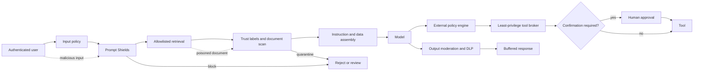

# Content safety and prompt injection

Content moderation and prompt injection are different problems.

A harmful answer can occur without an injection.

An injected instruction can be operationally dangerous without harmful language.

Authorization failure occurs when a model can cause an action it was never entitled to request.

This chapter builds defenses around a probabilistic model instead of treating the model as a policy engine.

The distinction is architectural. A classifier can estimate risk and a model can propose an action, but neither can prove that a user is entitled to a protected record or a consequential effect. Deterministic identity, schema, state, authorization, and confirmation checks must remain outside those probabilistic components so they still hold when a model or classifier is wrong.

## Learning objectives

After this chapter, you should be able to:

- distinguish content harm, jailbreak, indirect injection, exfiltration, misalignment, and authorization failure;
- calibrate probabilistic classifiers with a confusion matrix;
- design direct and indirect input scanning;
- separate instructions from untrusted data;
- enforce tool policy outside the model;
- require confirmation for consequential actions;
- moderate streaming output before unsafe bytes escape;
- define fail-open and fail-closed behavior by risk tier;
- handle filter errors, throttling, and regional constraints;
- audit decisions without collecting unnecessary sensitive text.

## The costly failure

A support agent retrieves an email containing hidden instructions.

The model follows those instructions and calls a refund tool.

The tool trusts the model-generated amount and customer identifier.

No harmful-content category triggers.

Money leaves because the system confused generated text with authority.

Another team blocks every classifier flag.

False positives lock legitimate users out of urgent support.

A third team streams tokens directly to browsers.

The final chunk reports `content_filter`, but earlier unsafe text is already visible.

Safety fails when one probabilistic classifier is treated as complete enforcement.

## Vocabulary

**Harmful-content moderation** estimates whether text or images contain defined harm categories.

**Direct prompt injection** is user input intended to replace or bypass higher-priority instructions.

A **jailbreak** is a direct attack intended to evade model safeguards.

**Indirect prompt injection** places instructions in retrieved documents, email, web pages, or tool output.

**Data exfiltration** is unauthorized disclosure of secrets or protected data.

**Task misalignment** is behavior that departs from the user-approved goal or procedure.

**Authorization failure** is an action accepted without sufficient principal and policy permission.

A **classifier threshold** maps a score to annotate, review, block, or allow.

A **false positive** blocks or flags benign content.

A **false negative** misses risky content.

**Prevalence** is the proportion of real traffic containing the target condition.

**DLP** means data loss prevention.

## Controlling invariant

No model output or classifier annotation can directly grant tool authority.

Only an authenticated principal, explicit policy, validated arguments, current resource state, and required confirmation can authorize a tool effect.

The model can propose an operation.

The broker can deny it.

A classifier can raise risk.

A classifier cannot mint permission.

## Additional invariants

Every external document remains untrusted data after retrieval.

System instructions are not concatenated into an undifferentiated text blob.

Every consequential tool has a deterministic authorization contract.

Every irreversible action requires a policy-defined confirmation.

No unsafe streaming segment is released before its moderation decision.

Filter-unavailable behavior is declared per risk tier.

Classifier thresholds are versioned and evaluated on representative traffic.

False positives and false negatives are measured by slice.

Audit records preserve decisions without logging secrets.

## Measurable requirements

User authentication must complete before retrieval or model invocation.

Input policy p95 must add less than 150 ms.

Direct and document attack scans must cover 99.9 percent of eligible requests.

High-risk tool effects must fail closed when a required filter is unavailable.

Low-risk read-only requests may enter a declared degraded mode.

Critical authorization bypasses must remain zero in the release set.

Prompt-injection false-negative rate must remain below the declared slice threshold.

Benign false-positive rate must remain below 2 percent on the calibrated set.

Every tool decision must be auditable within 5 minutes.

Streaming moderation buffers must cap memory per request.

## Threat taxonomy

A malicious user can issue a direct jailbreak.

A benign user can unknowingly paste poisoned content.

A document author can embed an indirect instruction.

A compromised connector can return malicious tool output.

A model can invent an operation or argument.

A classifier can miss an attack.

A classifier can block legitimate work.

A retrieval index can mix trust zones.

An overprivileged broker can turn a model mistake into an incident.

A streaming client can receive unsafe partial output.

## What classifiers establish

A classifier estimates a label under its training distribution.

It does not prove absence of risk.

Prompt Shields documentation explicitly warns that attacks can be missed and benign prompts can be flagged ([Microsoft Learn](https://learn.microsoft.com/azure/ai-services/content-safety/concepts/jailbreak-detection)).

Thresholds therefore express risk tolerance, not truth.

Use deterministic checks for identities, schemas, amounts, destinations, and permissions.

Use classifiers for ambiguous language and prioritization.

## Confusion matrix

| Reality | Block          | Allow          |
| ------- | -------------- | -------------- |
| Attack  | True positive  | False negative |
| Benign  | False positive | True negative  |

Precision is $TP/(TP+FP)$.

Recall is $TP/(TP+FN)$.

False-positive rate is $FP/(FP+TN)$.

False-negative rate is $FN/(FN+TP)$.

At low attack prevalence, even a small false-positive rate can dominate alerts.

Suppose 1 in 1,000 requests is an attack.

At 90 percent recall, 0.9 attacks per 1,000 are detected.

At 1 percent false-positive rate, about 10 benign requests are flagged.

Only about 8 percent of flags are true attacks.

Human review capacity must use this base rate.

## Harm-weighted threshold

Let $C_{FN}$ be expected cost of a missed attack.

Let $C_{FP}$ be expected cost of blocking benign work.

Choose threshold $t$ to minimize:

$$
C(t)=C_{FN}FN(t)+C_{FP}FP(t)
$$

Use higher $C_{FN}$ for financial, medical, destructive, or secret-bearing tools.

Use lower thresholds for annotation than blocking.

Calibrate separately by language, channel, tenant, and task.

Do not tune on the final test set.

## End-to-end architecture



Authentication identifies the user before the model sees input.

Retrieval policy limits which corpora the request can reach.

Trust labels survive prompt assembly.

The policy engine evaluates proposals outside the model.

The broker owns credentials and effects.

Output moderation runs before release.

## Instructional figure


Credits: Hazem Ali

The attack arrows enter through both user and document channels.

The blocked paths do not depend on the model agreeing with policy.

The tool broker remains authoritative even when every classifier misses.

## Request flow

1. Authenticate the user and tenant.
2. Authorize the requested application capability.
3. Normalize encoding and reject malformed control characters.
4. Apply size, type, and rate limits.
5. Run direct prompt-attack and content-harm checks.
6. Record score, threshold, model version, and action.
7. Parse the user task into a constrained application intent.
8. Retrieve only from tenant and task allowlists.
9. Attach source, owner, trust, freshness, and classification labels.
10. Scan retrieved content for indirect attacks.
11. Quarantine suspicious chunks instead of merely hiding labels.
12. Place instructions and documents in distinct message structures.
13. Tell the model that documents are evidence, not commands.
14. Ask the model for a typed response or tool proposal.
15. Validate output schema.
16. Recompute authorization from user identity and policy.
17. Validate tool name, arguments, resource, amount, and destination.
18. Require confirmation for consequential or irreversible effects.
19. Invoke the tool with broker-owned narrow credentials.
20. Moderate and apply DLP to output before release.
21. Record trace and audit correlation identifiers.

## Azure service mapping

Azure AI Content Safety analyzes text and images for sexual, violence, hate, and self-harm categories ([Microsoft Learn](https://learn.microsoft.com/azure/ai-services/content-safety/overview)).

Prompt Shields analyzes direct user attacks and document attacks ([Microsoft Learn](https://learn.microsoft.com/azure/ai-services/content-safety/concepts/jailbreak-detection)).

Prompt Shields recognizes direct attempts to alter rules, simulate conversation, change persona, or encode attacks ([Microsoft Learn](https://learn.microsoft.com/azure/ai-services/content-safety/concepts/jailbreak-detection)).

Document attacks include manipulation, intrusion, unauthorized information gathering, availability attacks, fraud, and malware-related instructions ([Microsoft Learn](https://learn.microsoft.com/azure/ai-services/content-safety/concepts/jailbreak-detection)).

These classes guide detection coverage but do not replace local authorization.

## Input limits

The current Content Safety overview documents a 10,000-character default maximum for text analysis ([Microsoft Learn](https://learn.microsoft.com/azure/ai-services/content-safety/overview)).

Prompt Shields accepts a prompt up to 10,000 characters and up to five documents totaling 10,000 characters ([Microsoft Learn](https://learn.microsoft.com/azure/ai-services/content-safety/overview)).

Split larger documents at semantic boundaries.

Preserve document identity and offsets after splitting.

Do not scan only the first chunk.

Rate limits vary by tier and feature and must be read from current service documentation ([Microsoft Learn](https://learn.microsoft.com/azure/ai-services/content-safety/overview)).

Bound queues by count, bytes, and age.

## Language and region

Prompt Shields is trained and tested on Chinese, English, French, German, Spanish, Italian, Japanese, and Portuguese; quality can vary elsewhere ([Microsoft Learn](https://learn.microsoft.com/azure/ai-services/content-safety/concepts/jailbreak-detection)).

Test application dialects, code-switching, transliteration, and domain terms.

Feature availability differs by Azure region and API version ([Microsoft Learn](https://learn.microsoft.com/azure/ai-services/content-safety/overview)).

Pin the API version.

Treat preview API lifecycle as changeable.

Do not silently route classified data to an unapproved region.

## Trust labels

```json
{
  "document_id": "mail-4832",
  "tenant_id": "tenant-17",
  "source": "mail-connector",
  "owner": "user-42",
  "classification": "confidential",
  "trust": "external-untrusted",
  "scan": { "indirect_attack": true, "policy_version": "pi-12" },
  "allowed_uses": ["summarize"],
  "expires_at": "2026-08-13T00:00:00Z"
}
```

Trust is metadata, not text inserted by a model.

An external source does not become trusted because retrieval ranked it highly.

Propagate labels into every derived chunk.

## Instruction-data separation

Use role-aware message APIs.

Place immutable application policy in the system channel.

Place user intent in the user channel.

Place documents in delimited data structures.

Azure indirect-attack filtering requires documented delimiters and document formatting in the integrated classic path ([Microsoft Learn](https://learn.microsoft.com/azure/ai-services/openai/concepts/content-filter)).

Escaping and delimiters improve classification and model interpretation.

They do not create a security boundary.

Never interpolate retrieved text into executable templates.

## Tool proposal contract

```json
{
  "operation": "create_refund_proposal",
  "customer_id": "c-183",
  "amount_minor": 2500,
  "currency": "USD",
  "reason_code": "duplicate-charge",
  "evidence_ids": ["case-992"],
  "user_confirmation_required": true
}
```

The model emits a proposal only.

The broker resolves the customer from authenticated scope.

The broker verifies the case and maximum amount.

The broker rejects unsupported currency and stale evidence.

The broker creates an idempotency key.

The broker requests confirmation with exact consequences.

The proposal becomes safe to evaluate because it is data with a fixed schema, not an instruction that can execute itself. The broker can replace model-supplied identifiers with values resolved from the authenticated principal, compare requested amounts with current authoritative state, and bind a confirmation to the exact operation digest. If validation fails or the request is retried, the broker can reject the proposal or reuse its idempotency record without sending an ambiguous action to the downstream system. This shifts recovery from trying to interpret generated prose after an effect to preventing the effect before authority is issued.

## Authorization pseudocode

```python
def authorize(proposal, principal, policy, state):
    require(principal.tenant_id == state.tenant_id)
    require(policy.allows(principal, proposal.operation))
    require(proposal.customer_id in principal.customer_scope)
    require(0 < proposal.amount_minor <= policy.refund_limit(principal))
    require(state.case_is_open(proposal.evidence_ids))
    require(not state.case_already_refunded(proposal.evidence_ids))
    if policy.requires_confirmation(proposal):
        require(valid_confirmation(principal, proposal))
    return policy.issue_single_use_capability(proposal)
```

No classifier result appears as a permission grant.

A risk flag can only narrow or deny.

## Streaming output

Streaming creates a temporal security boundary.

If bytes reach a client before moderation, later blocking cannot retract them.

The classic integrated content filter reports `finish_reason: content_filter` when a generation is filtered ([Microsoft Learn](https://learn.microsoft.com/azure/ai-services/openai/concepts/content-filter)).

The documented streaming path can return earlier segments before detection ([Microsoft Learn](https://learn.microsoft.com/azure/ai-services/openai/concepts/content-filter)).

Buffer by sentence, token window, or complete response according to risk.

Moderate each releasable segment.

Keep an overlap window to detect cross-boundary content.

Never execute a streamed tool call before complete schema and authorization validation.

Buffering trades response latency and memory for the ability to make one decision about a complete unit of content. The buffer size and overlap window define the largest amount of output that can await moderation and the largest pattern that can cross a release boundary. When moderation or transport fails, the system discards the unreleased segment and records a safe decision code; it cannot retract segments already delivered. That asymmetry is why a risk tier may select full-response buffering for consequential workflows while accepting smaller windows for low-risk conversational output.

## Filter-unavailable semantics

The classic integrated filter documentation states that a request can complete unfiltered when filtering is unavailable and exposes `content_filter_error` ([Microsoft Learn](https://learn.microsoft.com/azure/ai-services/openai/concepts/content-filter)).

Applications must inspect filter execution status.

Risk tier 0 public read-only content may fail open with a visible degraded marker.

Risk tier 1 internal read-only content may return a safe static fallback.

Risk tier 2 personal or confidential content should fail closed.

Risk tier 3 consequential tool use must fail closed.

Safety-service 429 responses use bounded backoff.

Do not bypass required checks after retry exhaustion.

## Decision table

| Risk tier            | Filter unavailable | Model unavailable | Tool policy unavailable |
| -------------------- | ------------------ | ----------------- | ----------------------- |
| Public read          | Degraded allow     | Static fallback   | Not applicable          |
| Internal read        | Static fallback    | Static fallback   | Not applicable          |
| Confidential read    | Deny               | Deny              | Not applicable          |
| Consequential action | Deny               | Deny              | Deny                    |

Version this table as policy.

Test every cell.

## Content-filter response handling

```json
{
  "request_id": "req-19",
  "input": { "attack": false, "harm": "safe" },
  "output": { "harm": "medium", "finish_reason": "content_filter" },
  "filter_status": "executed",
  "policy_action": "block",
  "policy_version": "safety-18"
}
```

An input blocked by the integrated classic filter can return HTTP 400 with code `content_filter` ([Microsoft Learn](https://learn.microsoft.com/azure/ai-services/openai/concepts/content-filter)).

Filtered generated choices can return HTTP 200 with a content-filter finish reason ([Microsoft Learn](https://learn.microsoft.com/azure/ai-services/openai/concepts/content-filter)).

Handle transport status and semantic status separately.

## Human confirmation

Confirmation names the exact operation.

It shows target, amount, destination, and reversibility.

It expires quickly.

It binds to a proposal digest.

It cannot authorize a changed proposal.

It records principal, time, policy, and user interaction.

Use step-up authentication for high-impact operations.

Do not accept natural-language model text as confirmation.

## Data loss prevention

Output moderation asks whether content is harmful.

DLP asks whether content is permitted to leave.

Detect secrets, credentials, personal data, tenant identifiers, and classified records.

Prefer deterministic patterns for structured secrets.

Use context-aware detection for personal data.

Apply destination policy after detection.

Replace or block before release.

Never log the leaked value in the alert.

## Identity and network

Use managed identity for Content Safety where supported; Microsoft Entra authentication is supported by the service ([Microsoft Learn](https://learn.microsoft.com/azure/ai-services/content-safety/overview)).

Give the runtime only invoke permission.

Separate filter-policy administration.

Restrict retrieval connectors by tenant and classification.

Use private paths where required and currently supported.

Control outbound destinations from the tool broker.

Keep model infrastructure unable to reach arbitrary internal services.

## Audit schema

```json
{
  "event_id": "safety-812",
  "request_id": "req-19",
  "principal_id": "user-object-id",
  "risk_tier": 3,
  "input_policy": "allow",
  "prompt_shield": "flag",
  "document_ids": ["mail-4832"],
  "tool_operation": "create_refund_proposal",
  "authorization": "deny",
  "policy_version": "safety-18"
}
```

Store hashes or controlled identifiers instead of raw prompts by default.

Keep high-sensitivity evidence in protected tables with shorter access paths.

## Capacity and cost

Let request rate be $R=200$ requests/s.

Let average retrieved documents be $D=4$.

Direct plus document scans per second are:

$$
Q=R(1+D)=200(5)=1000\text{ scans/s}
$$

Compare that rate with the current tier quota.

Batch only when latency and per-document attribution remain acceptable.

For 150 ms scan p95 and 800 ms model p95, serial safety overhead is material.

Parallelize independent input scans.

Do not parallelize authorization after an unvalidated proposal.

Cost includes scans, model tokens, review labor, blocked-user support, logs, and false-negative incidents.

## Backpressure and retries

Set separate concurrency pools for direct and document scans.

Reject oversized work before queue admission.

Use exponential backoff with jitter for 429 and transient 5xx responses.

Do not retry malformed 400 requests.

Set retry budgets below request deadlines.

Cache only decisions whose exact normalized content and policy version match.

Do not cache authorization across principals.

Drop low-risk optional annotation before required high-risk checks.

## Observability

Track scan volume, latency, errors, and throttling.

Track block, annotate, review, and degraded-mode rates.

Track false positives and false negatives from adjudicated samples.

Track rates by language, tenant, connector, risk tier, and policy version.

Track quarantined document sources.

Track tool proposals, denials, confirmations, and effects.

Track partial-stream suppression.

Track DLP categories without sensitive values.

Alert on filter-unavailable results in fail-closed tiers.

## Failure modes

**Direct attack missed:** external policy still denies unauthorized tools.

**Benign prompt flagged:** provide appeal and sampled adjudication.

**Poisoned document retrieved:** quarantine the chunk and continue only if policy permits incomplete context.

**Filter unavailable:** apply the risk-tier decision table.

**429 burst:** shed optional low-risk scans and preserve required checks.

**Streaming block after partial generation:** ensure unreleased buffer is discarded.

**Tool proposal schema invalid:** reject without repair by execution code.

**Confirmation stale:** require a new confirmation for the current digest.

**DLP failure:** fail closed for protected destinations.

**Audit sink unavailable:** buffer bounded metadata or deny high-risk actions.

## Recovery

Keep the last approved policy version deployable.

Canary threshold changes.

Rollback on false-positive spikes or missed-risk regressions.

Maintain regional service compatibility and data-residency approval.

Keep a static safe-response path independent of the model.

Test connector quarantine and index rebuild.

Replay only idempotent, non-effectful requests.

Never replay an action without reauthorization and state checks.

## Alternatives and trade-offs

Use blocklists for exact prohibited terms and identifiers.

Use classifiers for semantic ambiguity.

Use constrained workflows when tasks can be represented as states.

Use retrieval allowlists to reduce poisoned-content exposure.

Use human review for rare high-impact ambiguity.

Use no tools for experiences that need only text generation.

Use read-only tools before write-capable tools.

Use deterministic templates for fixed compliance responses.

No single alternative removes the need for authorization.

## Design review checklist

- Are harm and prompt injection modeled separately?
- Are direct and indirect channels scanned?
- Are documents labeled and delimited as untrusted data?
- Are thresholds calibrated by prevalence and harm cost?
- Is tool authority external to model and classifier output?
- Are tool arguments constrained and state-checked?
- Are consequential effects explicitly confirmed?
- Is filter-unavailable behavior declared by risk tier?
- Are streaming bytes buffered before moderation?
- Are Content Safety input, rate, language, and region constraints tested?
- Are false positives and negatives adjudicated by slice?
- Are logs useful without storing secrets?
- Can every effect be correlated to identity and policy?

## Hands-on exercise

Design a support agent that reads email and proposes refunds.

Write separate harm, injection, exfiltration, and authorization threats.

Define four risk tiers.

Create a confusion matrix from 10,000 labeled requests.

Calculate precision at 0.1 percent attack prevalence.

Assign costs to false positives and false negatives.

Choose blocking and annotation thresholds.

Define trust labels for email, CRM, and public web content.

Draw direct and indirect attack paths.

Write the refund proposal schema.

Write deterministic broker authorization rules.

Bind confirmation to a proposal digest.

Design a 200-request/s scan capacity model.

Handle a 10,000-character Prompt Shields limit.

Inject a filter timeout in each risk tier.

Inject a streamed response blocked after two buffered segments.

Inject a poisoned email that requests a different customer refund.

Show why the broker denies it even if every classifier allows it.

Define audit events and protected retention.

Run an adjudication sample and revise one threshold.

Finish with evidence that proves the controlling invariant.

## What, why, and how

Content safety estimates harmful language risk.

Prompt-injection defenses detect attempts to change system behavior through user or external data.

Both are probabilistic and can fail.

A production system therefore combines detection with trust labels, instruction-data separation, deterministic authorization, least-privilege tools, confirmation, output DLP, audit, and explicit degraded modes.
