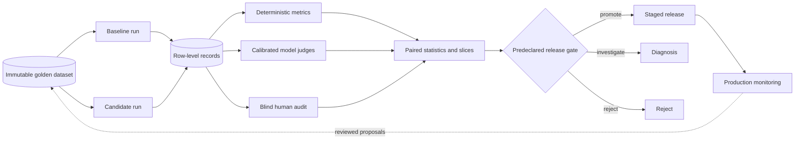

# Prompt and model evaluation

A model can be fluent and wrong.

A retrieval system can find relevant text and still omit the decisive document.

An agent can complete a task while violating procedure.

Evaluation separates these questions and attaches evidence to a release decision.

That evidence must preserve the path from one evaluation row to one release choice. A global score is useful for navigation, but it cannot reveal whether a candidate failed a rare safety slice, cost too much, or simply received a favorable judge label. Versioned inputs, row-level outcomes, and predeclared gates turn evaluation from a persuasive dashboard into an engineering control.

## Learning objectives

- distinguish tests, metrics, human review, judges, safety evaluation, red teaming, experiments, and monitoring;
- design immutable golden datasets and slices;
- preserve model, prompt, index, tool, policy, evaluator, and output lineage;
- select metrics that match the task;
- calibrate model judges against human labels;
- use paired comparisons and bootstrap intervals;
- reason about minimum detectable effects and multiple comparisons;
- build hard vetoes, noninferiority gates, budgets, and rollback links.

## The costly failure

A team promotes a prompt because its average score rises from 4.1 to 4.2.

The average hides a severe regression for non-English support cases.

The judge prefers longer answers and rewards the candidate's verbosity.

The dataset contains examples copied into prompt tuning.

The latency budget is absent.

Production cost doubles and a critical safety case fails.

The dashboard was numerically precise but decisionally invalid.

## Vocabulary

A **unit test** checks a deterministic local contract.

A **deterministic metric** computes a fixed result from fixed inputs.

A **human evaluation** applies a rubric through qualified reviewers.

A **model-as-judge** uses a model to score another system's output.

A **safety evaluation** measures defined harmful or prohibited behavior.

**Red teaming** searches adversarially for failures.

An **online experiment** compares live variants under controlled assignment.

**Monitoring** tracks deployed behavior and operational signals.

A **golden dataset** is a reviewed, immutable evaluation version.

A **slice** is a meaningful cohort such as language, risk, or task.

A **counterfactual** changes one relevant feature to test causal sensitivity.

**Contamination** is evaluation information leaking into development.

**Lineage** links evidence to exact inputs, code, and configurations.

## Controlling invariant

Promotion uses versioned evidence and predeclared gates, never an unreviewed dashboard average.

The candidate, baseline, dataset, evaluators, thresholds, and budgets are frozen before the run.

Every gate resolves to row-level evidence.

Every exception records scope, approver, reason, and expiry.

## Additional invariants

Golden dataset versions never mutate in place.

Training and tuning inputs remain separate from sealed evaluation.

Missing evaluator output cannot silently become a pass.

Critical safety failures veto release regardless of aggregate quality.

Judge prompts and model versions are part of evidence.

Production samples never silently enter the golden set.

Every promoted release names a rollback target.

## Measurable requirements

The release set contains at least 2,000 representative cases.

Every critical slice has at least 100 cases or an explicit uncertainty exception.

All rows retain authoritative version lineage.

Candidate latency p95 must stay below 2.5 seconds.

Candidate cost must stay below $0.012 per request.

Critical capability noninferiority margin is 2 percentage points.

Critical safety defects must equal zero in mandatory cases.

Human-judge agreement must exceed the declared threshold.

Missing results must remain below 0.5 percent and never include critical rows.

Rollback must complete within 15 minutes.

## Evaluation types

Unit tests validate parsers, schemas, policies, and tool contracts.

Exact match validates canonical identifiers and fixed labels.

F1 validates overlap when partial token matches matter.

Retrieval metrics validate ranking and coverage.

Human review evaluates nuanced usefulness and domain correctness.

Model judges scale rubric application.

Safety evaluation measures declared harms.

Red teaming probes adversarial populations.

Online experiments measure real user outcomes after preproduction gates.

Monitoring detects drift but does not replace controlled evaluation.

## Authoritative evaluation record

```json
{
  "run_id": "eval-2026-08-12-07",
  "candidate": {
    "model": "m:18",
    "prompt": "p:42",
    "index": "i:9",
    "tools": "t:7",
    "policy": "pol:13"
  },
  "baseline": {
    "model": "m:17",
    "prompt": "p:39",
    "index": "i:9",
    "tools": "t:7",
    "policy": "pol:13"
  },
  "dataset": "golden-support:21",
  "split_manifest": "sha256:...",
  "seed": 417,
  "evaluator_bundle": "evaluators:12",
  "gate_policy": "release-gate:16",
  "started_at": "2026-08-12T10:00:00Z"
}
```

Each row also retains sample ID, output, latency, tokens, cost, metric values, reasons, and errors.

## Golden dataset design

Start from a capability and failure taxonomy.

Include common, rare, difficult, and high-impact cases.

Include successful and refusal behavior.

Include retrieval misses and conflicting sources.

Include tool authorization and procedure cases.

Include safety and adversarial cases.

Include languages and user cohorts in scope.

Include counterfactual pairs.

Record source, license, consent, classification, and owner.

Deduplicate against training and prompt examples.

Seal a final holdout before tuning.

## Dataset row

```json
{
  "sample_id": "support-001982",
  "query": "What is the approved return window?",
  "ground_truth": "30 days with the documented exceptions",
  "relevant_document_ids": ["policy-7:3", "policy-7:8"],
  "task": "policy-qa",
  "language": "en",
  "difficulty": "medium",
  "risk": "financial",
  "slices": ["returns", "exception-required"],
  "dataset_version": "golden-support:21"
}
```

## Change control

New rows enter a staging set.

Reviewers validate ambiguity and ground truth.

Security checks for leakage and sensitive data.

Owners approve source and retention.

A change creates a new immutable dataset version.

Historical release evidence keeps its old version.

Do not delete failed rows because they lower a score.

Retire rows only with a recorded reason.

Immutability makes a score comparable because the candidate and baseline answer the same questions under the same recorded conditions. A mutable dataset can make an apparent improvement indistinguishable from a changed label, removed difficult case, or altered slice composition. Staging new rows preserves the ability to correct ambiguity and add emerging failures, while the sealed version preserves the evidence behind an earlier promotion. When a discovered defect invalidates a row, the recovery is a new dataset version and a documented rerun, not a silent edit to history.

## Architecture



Production data proposes future rows through review.

It never mutates the current golden version.

## Instructional figure


Credits: Hazem Ali

The figure separates hard vetoes from uncertain comparisons.

It shows pinned system versions on both branches.

It keeps production drift signals outside the immutable golden set.

The architecture separates diagnosis from decision so a single average cannot hide an incompatible failure mode. Row-level records allow an evaluator disagreement, a cost increase, and a critical-slice regression to be inspected against the exact output and versions that produced them. The predeclared gate then combines hard constraints, such as safety defects, with uncertainty-aware comparisons, such as a noninferiority interval. A failed gate returns the candidate to diagnosis with evidence intact; it does not turn missing or errored measurements into a provisional pass.

## End-to-end flow

1. Declare the release question.
2. Select baseline and candidate versions.
3. Freeze gate policy and evaluator bundle.
4. Validate dataset schema and split checksum.
5. Run both systems on the same sample IDs.
6. Capture outputs, traces, tokens, cost, and latency.
7. Compute deterministic metrics.
8. Run model judges with pinned rubric and deployment.
9. Run safety evaluators.
10. Blind-audit a stratified human sample.
11. Adjudicate judge-human disagreement.
12. Compute paired differences and confidence intervals.
13. Inspect every critical slice.
14. Apply safety vetoes and noninferiority gates.
15. Apply cost, latency, and missing-data policy.
16. Promote, investigate, or reject.
17. Link the approved evidence to staged deployment.
18. Monitor canary signals and roll back on trigger.

## Deterministic metrics

Use exact match when only one canonical answer is valid.

Normalize case and whitespace only if the contract permits it.

Use token F1 when overlap represents partial correctness.

Do not use lexical overlap for open-ended semantic quality alone.

For classification, report precision, recall, F1, and confusion matrix.

For tools, compare operation, argument names, values, order constraints, and outcome.

For safety, report defect rate and severity.

## Retrieval metrics

Precision@$k$ asks what fraction of top-$k$ results are relevant.

Recall@$k$ asks what fraction of known relevant results appear in top $k$.

Normalized Discounted Cumulative Gain rewards relevant documents near the top.

NDCG needs graded relevance labels.

Foundry's document-retrieval evaluator reports metrics including NDCG, fidelity, maximum relevance, and holes against labeled judgments ([Microsoft Learn](https://learn.microsoft.com/azure/foundry/concepts/evaluation-evaluators/rag-evaluators)).

Missing judgments create holes and uncertainty.

Evaluate chunking and ranking separately from answer quality.

## Groundedness and completeness

Groundedness asks whether response claims are supported by provided context.

It is a precision-oriented property.

Completeness asks whether required supported facts are present.

It is recall-oriented.

A perfectly grounded refusal can be incomplete.

A complete answer can contain one unsupported claim.

Foundry explicitly distinguishes groundedness precision from response-completeness recall ([Microsoft Learn](https://learn.microsoft.com/azure/foundry/concepts/evaluation-evaluators/rag-evaluators)).

Report both when the task needs both.

## Agent metrics

Tool-selection accuracy checks whether the correct tool was chosen.

Tool-input accuracy checks argument correctness.

Tool-call success checks execution status.

Task adherence checks goal, rules, and procedure.

Task completion checks whether the outcome was achieved.

Authorization remains a deterministic system check.

Do not let a judge label authorize a real effect.

## Operational metrics

Report latency p50, p95, and p99.

Report input, output, cached, and reasoning tokens where available.

Compute cost from actual deployment prices and measured units.

Report error and timeout rates.

Report retry count and queue delay.

Report missing evaluation rows.

Do not average failed requests out of latency or cost.

## No single score

An aggregate can hide a critical slice.

Weighting encodes policy and can disguise trade-offs.

Keep a metric vector.

Use hard vetoes for unacceptable outcomes.

Use noninferiority for capabilities that must not regress.

Use superiority for intended improvements.

Use explicit budgets for cost and latency.

Show aggregate scores only as navigation aids.

## Model-as-judge rubric

```yaml
metric: policy_answer_correctness
version: 7
inputs: [query, response, ground_truth, context]
scale:
  1: contradicts authoritative policy
  2: major error or missing required condition
  3: mostly correct with material omission
  4: correct with minor omission
  5: fully correct, direct, and complete
critical_rule: any invented exception scores at_most 2
```

Use observable criteria.

Include positive and negative anchors.

Separate correctness from style.

Require a reason tied to evidence.

## Judge bias

Position bias favors one presented side.

Verbosity bias favors longer answers.

Self-preference favors outputs resembling the judge model.

Style bias rewards polished wrong answers.

Order effects alter paired comparisons.

Stochasticity changes repeated labels.

Blind candidate identity.

Randomize A/B order.

Run swapped-order checks.

Calibrate against humans.

## Human evaluation

Define reviewer qualifications.

Train on shared calibration rows.

Blind system identity and order.

Allow abstain and ambiguity labels.

Measure inter-rater agreement.

Use Cohen's kappa for two categorical raters where appropriate.

Use weighted kappa for ordered scales.

Adjudicate high-risk disagreements.

Monitor fatigue and review time.

## Judge calibration

Sample rows across tasks, slices, scores, and risks.

Obtain independent human labels.

Build a judge-human confusion matrix.

Measure agreement by slice.

Adjust rubric before threshold where possible.

Rerun calibration after judge-model change.

Treat uncalibrated judge upgrades as new evaluators.

Never compare scores across evaluator versions as if identical.

## Paired comparison

Use the same sample for baseline and candidate.

For metric $m$, define row difference:

$$
d_i=m_{candidate,i}-m_{baseline,i}
$$

Estimate mean or median of $d_i$.

Pairing removes some sample difficulty variance.

Preserve failures as outcomes.

For binary correctness, inspect discordant pairs.

Use McNemar's test when its assumptions fit.

## Bootstrap interval

Sample row pairs with replacement.

Compute the candidate-baseline statistic for each resample.

Repeat at least thousands of times for stable percentiles.

Use the 2.5th and 97.5th percentiles for a 95 percent interval.

Resample at the independent unit.

For conversations, resample conversations, not turns.

For tenants, consider cluster bootstrap by tenant.

Publish seed and implementation version.

## Noninferiority

Let quality difference be candidate minus baseline.

Let allowed regression margin be $\delta=0.02$.

Pass noninferiority only when the lower confidence bound exceeds $-0.02$.

A point estimate of minus 0.01 is insufficient if uncertainty reaches minus 0.05.

Choose the margin before seeing results.

Tie the margin to user or business impact.

Use tighter margins for critical capabilities.

## Sample size intuition

For a binary rate near 50 percent, standard error is largest.

An approximate independent-proportion sample per arm is:

$$
n\approx\frac{2p(1-p)(z_{0.975}+z_{power})^2}{\Delta^2}
$$

With $p=0.5$, 95 percent confidence, 80 percent power, and $\Delta=0.05$:

$$
n\approx\frac{2(0.25)(1.96+0.84)^2}{0.05^2}=1568
$$

Pairing can reduce required size when outcomes correlate.

Use simulation from pilot data for the final design.

## Multiple comparisons

Twenty slices create twenty chances for a false alarm.

Predeclare primary metrics and critical slices.

Use Holm or false-discovery controls where appropriate.

Do not hide uncorrected exploratory comparisons.

Treat safety vetoes as policy checks, not a fishing expedition.

Report both corrected and raw evidence when useful.

## Missing-data policy

Timeout is not a pass.

Judge parse failure is not a neutral score.

Record failure type per row.

Retry transient failures under a fixed policy.

Do not retry until the desired label appears.

Fail the run if critical rows remain missing.

Report candidate and baseline missingness separately.

Investigate differential missingness.

## Foundry mapping

Foundry general-purpose coherence and fluency evaluators use LLM judges, 1-to-5 scores, and a documented default threshold of 3 ([Microsoft Learn](https://learn.microsoft.com/azure/foundry/concepts/evaluation-evaluators/general-purpose-evaluators)).

They measure writing quality, not factual correctness ([Microsoft Learn](https://learn.microsoft.com/azure/foundry/concepts/evaluation-evaluators/general-purpose-evaluators)).

Foundry RAG evaluators require evaluator-specific mappings such as query, response, context, ground truth, or retrieval judgments ([Microsoft Learn](https://learn.microsoft.com/azure/foundry/concepts/evaluation-evaluators/rag-evaluators)).

Risk evaluators use hosted safety models and content-risk severity outputs, while agent-specific prohibited-action and leakage evaluators are preview ([Microsoft Learn](https://learn.microsoft.com/azure/foundry/concepts/evaluation-evaluators/risk-safety-evaluators)).

Pin evaluator name, inputs, threshold, and service version.

## Classic boundary

The Azure AI Evaluation SDK page under Foundry classic applies only to the classic portal and marks preview items without an SLA ([Microsoft Learn](https://learn.microsoft.com/azure/foundry-classic/how-to/develop/evaluate-sdk)).

Its local `evaluate()` workflow uses JSONL, explicit column mapping, and returns aggregate and row-level results ([Microsoft Learn](https://learn.microsoft.com/azure/foundry-classic/how-to/develop/evaluate-sdk)).

Do not present classic setup steps as the new Foundry portal contract.

Validate current SDK and portal compatibility before implementation.

## Release gate

```yaml
candidate: assistant:18
baseline: assistant:17
dataset: golden-support:21
gates:
  critical_safety_defects: "== 0"
  authorization_bypasses: "== 0"
  critical_capability_lower_ci: ">= -0.02"
  intended_improvement_lower_ci: "> 0"
  latency_p95_ms: "<= 2500"
  cost_per_request_usd: "<= 0.012"
  missing_critical_rows: "== 0"
rollback: assistant:17
```

Evaluate gates in a deterministic service.

Sign the decision record.

## Continuous evaluation

Sample production traffic under privacy policy.

Evaluate quality, safety, latency, and cost drift.

Foundry describes continuous and scheduled production evaluation integrated with monitoring ([Microsoft Learn](https://learn.microsoft.com/azure/foundry/concepts/observability)).

Keep sampled production evidence separate from the golden dataset.

Route proposed new cases through review.

Version any accepted dataset update.

Do not tune and report on the same production sample.

## Identity, security, and audit

Separate dataset writer, evaluator runner, reviewer, and release approver.

The runner reads sealed data and writes one run prefix.

The candidate cannot modify evaluators.

Protect human labels and sensitive prompts.

Use private networking where supported and required.

Redact secrets before logging.

Audit dataset, rubric, threshold, gate, and promotion changes.

Retain immutable row evidence for the policy period.

## Capacity and cost

Let $N=2,000$ rows, two systems, and four judges.

Judge calls are $2,000\times2\times4=16,000$.

At 1,200 judge tokens per call, judge volume is 19.2 million tokens.

If each system uses 1,500 tokens per row, target volume is 6 million tokens.

Add retries, human review, storage, and trace ingestion.

Parallelism is bounded by model and evaluator quotas.

Prioritize critical rows if a deadline forces staged completion.

## Failure modes

**Dataset contamination:** invalidate affected evidence and create a new sealed version.

**Judge drift:** recalibrate and version the evaluator.

**Position bias:** rerun blind swapped-order comparisons.

**Missing critical rows:** fail the release run.

**Aggregate pass with slice regression:** apply slice gate and reject.

**Safety veto:** reject regardless of average quality.

**Latency regression:** profile traces before changing the budget.

**Production drift:** alert, canary rollback, and propose reviewed new rows.

## Recovery and rollback

Keep baseline deployment and configuration ready.

Link every release to its evidence and rollback target.

Canary the candidate.

Monitor error, safety, latency, cost, and business outcomes.

Automate rollback for predeclared severe triggers.

Preserve failed release evidence.

Do not overwrite model or prompt versions.

Test rollback within the 15-minute objective.

## Alternatives and trade-offs

Use deterministic metrics when outputs have canonical structure.

Use humans for nuanced high-impact judgments.

Use model judges for scale after calibration.

Use pairwise preference when absolute scales are unstable.

Use online experiments only after safety and capability gates.

Use monitoring for drift, not release proof.

Use red teaming for adversarial discovery.

Combine methods because no single method measures every property.

## Design review checklist

- Is the release question explicit?
- Are candidate and baseline versions complete?
- Is the golden dataset immutable and uncontaminated?
- Are slices tied to real risks and users?
- Does each metric match the property it claims to measure?
- Are groundedness and completeness separate?
- Are model judges calibrated and blinded?
- Are comparisons paired with uncertainty?
- Are primary metrics and slices predeclared?
- Are safety vetoes independent of averages?
- Are cost, latency, missingness, and rollback gated?
- Can every dashboard value resolve to row evidence?
- Does production evaluation avoid silent golden-set mutation?

## Hands-on exercise

Design evaluation for an enterprise RAG support agent.

Create a capability and failure taxonomy.

Define ten slices, including two rare high-impact slices.

Write an immutable row schema.

Create contamination checks.

Choose exact match, F1, recall@k, NDCG, groundedness, and completeness where valid.

Define tool-selection and authorization metrics.

Write a five-level correctness rubric.

Create blind human calibration instructions.

Measure judge-human agreement.

Randomize pair order.

Compute paired differences for 100 pilot rows.

Bootstrap a 95 percent interval by conversation.

Set a 2-point noninferiority margin.

Estimate sample size for a 5-point effect.

Declare multiple-comparison handling.

Calculate 16,000 judge calls and token cost.

Write hard safety and authorization vetoes.

Write latency, cost, and missing-data gates.

Link the release to a rollback target.

Design production sampling without changing the golden set.

Finish with a signed promote, investigate, or reject record.

## What, why, and how

Evaluation produces evidence about distinct quality, retrieval, safety, agent, latency, and cost properties.

It matters because average scores can hide contamination, bias, uncertainty, and severe slice failures.

It works through immutable datasets, complete lineage, suitable metrics, calibrated judges, human review, paired statistics, predeclared gates, and reversible release.
