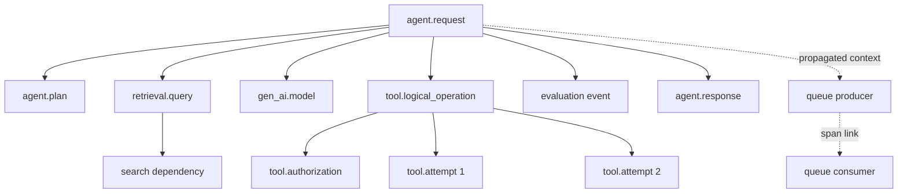

# Tracing agent and tool loops

Logs describe events.

Metrics summarize behavior.

Traces connect work across one request.

Agent systems need all three because one user request can branch through models, retrieval, tools, queues, retries, and other agents.

The signals answer different operational questions. Metrics show whether a population is degrading, logs record a component event, and traces reconstruct how one request crossed dependencies. The trace must connect observable decisions and effects without collecting hidden reasoning or raw secrets, otherwise observability becomes either insufficient for incident response or a new sensitive-data store.

This chapter traces those effects without storing private reasoning or raw secrets.

## Learning objectives

- distinguish logs, metrics, and traces;
- explain trace IDs, span IDs, parents, links, events, attributes, resources, and baggage;
- propagate W3C trace context across HTTP and queues;
- model planning, retrieval, model, authorization, tool, retry, and response spans;
- define a versioned agent span contract;
- correlate effects without recording chain-of-thought;
- redact sensitive content before export;
- calculate sampling volume and cost;
- query incidents with Kusto Query Language (KQL);
- operate collector backlog, partial traces, and disaster recovery.

## The costly failure

An agent deletes a synthetic test record unexpectedly.

Application logs show the HTTP request.

Tool logs show the delete.

No shared identifier connects the user, policy decision, model proposal, retry, and effect.

The team cannot tell whether the delete was authorized or duplicated.

Another team enables full prompt capture globally.

Secrets and personal data enter a broad telemetry workspace.

A third team samples one percent of requests randomly.

The rare safety event disappears while dashboards remain green.

Observability fails when correlation is absent or collection becomes a new data leak.

## Vocabulary

A **log** is a timestamped event record.

A **metric** is a numeric time series with dimensions.

A **trace** represents one distributed operation.

A **span** represents one timed operation inside a trace.

A **trace ID** identifies the whole trace.

A **span ID** identifies one span.

A **parent span ID** forms a hierarchy.

A **link** relates spans without parent-child ownership.

An **event** marks a point-in-time occurrence on a span.

An **attribute** is typed metadata attached to telemetry.

A **resource** describes the emitting service and environment.

**Context propagation** carries identifiers across boundaries.

**Baggage** carries selected key-value context to downstream code.

**Sampling** chooses which traces are recorded or exported.

**Head sampling** decides near trace start.

**Tail sampling** decides after observing more of the trace.

## Controlling invariant

Every consequential tool effect can be correlated to an authenticated request, authorization decision, policy version, and result without exposing raw secrets.

The effect record contains trace, operation, principal, policy, and idempotency identifiers.

Sensitive arguments remain in the authoritative tool system or protected evidence store.

The trace contains only safe references and redaction status.

## Additional invariants

All spans in one trace share one trace ID.

Every span has a unique span ID.

Retries are separate attempts under one logical operation.

Queue continuations use propagated context or explicit links.

No private chain-of-thought is stored.

Prompt and tool content capture is disabled by default.

Redaction occurs before telemetry export.

Secrets never enter baggage.

Metrics remain available even when traces are sampled.

## Measurable requirements

At least 99.9 percent of consequential effects have complete correlation fields.

Trace propagation succeeds across 99.95 percent of supported boundaries.

Exporter drop rate remains below 0.1 percent.

Collector queue age p99 remains below 30 seconds.

Errors, high latency, and safety events receive enhanced retention where technically possible.

Normal trace ingestion remains within the monthly budget.

Incident queries return within 30 seconds for 24-hour windows.

Sensitive-content violations alert within 5 minutes.

## Signals together

Metrics answer how often and how much.

Logs answer what event happened in one component.

Traces answer how a request moved between components.

Metrics detect elevated tool latency.

Traces isolate the slow dependency.

Logs explain the dependency error.

Do not turn every log field into a metric dimension.

Do not expect traces to replace durable audit records.

## W3C trace context

The `traceparent` header carries version, trace ID, parent span ID, and trace flags.

A service extracts the incoming context.

It creates a child span.

It injects the resulting context into the next request.

The trace ID stays constant.

The span ID changes at every operation.

Reject malformed context.

Do not trust baggage as authorization input.

Use W3C Trace Context for interoperable multi-service propagation ([W3C](https://www.w3.org/TR/trace-context/)).

## Span tree



The logical operation contains attempts.

Authorization is a distinct child.

The queue consumer may be temporally detached and use a link.

The evaluation is an event when it has no independent duration.

## Instructional figure


Credits: Hazem Ali

The figure distinguishes shared trace ID from unique span IDs.

It shows redaction before collection.

It keeps unsampled-trace metrics visible.

## Request flow

1. Authenticate the request.
2. Extract or create W3C trace context.
3. Start the agent request root span.
4. Attach safe principal and conversation references.
5. Record model, prompt, tool, and policy versions.
6. Start retrieval and dependency spans.
7. Record result counts and latency, not raw documents.
8. Start a model span with token counts and status.
9. Record observable tool proposal metadata.
10. Start one logical tool-operation span.
11. Start a child authorization span.
12. Record decision, policy version, and reason code.
13. Start one attempt span per external invocation.
14. Carry idempotency key and operation ID.
15. Record retry reason and attempt number.
16. Add evaluation events with evaluator version.
17. Inject context into queue messages.
18. Link asynchronous consumers where parentage is misleading.
19. End response and root spans with status.
20. Export only after redaction.

## Do not trace private reasoning

Private chain-of-thought is not an operational contract.

Do not request or store it for observability.

Trace observable decisions instead.

Record selected tool name.

Record policy reason code.

Record retrieved document identifiers.

Record structured plan step labels when explicitly produced for users or control flow.

Record state transitions.

Do not label hidden model reasoning as authoritative evidence.

## Versioned span contract

```json
{
  "contract.version": "agent-trace/3",
  "trace_id": "32-hex",
  "span_id": "16-hex",
  "operation.name": "tool.execute",
  "operation.id": "op-918",
  "idempotency.key_hash": "sha256:...",
  "conversation.id_hash": "hmac:...",
  "principal.id_hash": "hmac:...",
  "model.version": "model:18",
  "prompt.version": "prompt:42",
  "tool.version": "refund:7",
  "policy.version": "policy:13",
  "retry.attempt": 2,
  "redaction.status": "metadata-only"
}
```

Contract changes require compatibility review.

Use stable enumerations for operation and error types.

## Root span

Name the root by operation, not raw URL.

Attach service, environment, deployment, and region resource attributes.

Attach authenticated principal reference after redaction.

Attach request and conversation references.

Attach risk tier and policy version.

Set error status only for operational failure.

A policy denial can be successful enforcement with a decision attribute.

## Model span

Record provider, model, deployment, operation, and response ID.

Record input, output, cached, and total token counts where available.

Record time to first token and total duration.

Record finish reason and error taxonomy.

Record prompt-template version.

Do not record raw prompts by default.

Use content length and classification metadata.

## Retrieval span

Record index and query-template versions.

Record top-k, result count, filter use, and latency.

Record safe document identifiers and scores.

Record tenant-filter enforcement.

Record cache hit.

Do not export retrieved text by default.

Use a protected evidence pointer for incident-approved content.

## Tool authorization span

Record principal reference.

Record proposed operation and resource class.

Record policy version and decision.

Record deterministic reason code.

Record confirmation requirement and confirmation reference.

Record input-schema validation result.

Do not record secrets or full arguments.

The authorization span ends before execution starts.

## Tool execution span

Record logical operation ID.

Record idempotency-key hash.

Record tool name and version.

Record dependency target class.

Record attempt number and timeout budget.

Record status and safe result code.

Record effect identifier returned by the authoritative tool.

The audit store retains the full governed effect record.

## Retries

One logical operation owns multiple attempt spans.

Attempt one can time out after creating an effect.

Attempt two must reuse the idempotency key.

The parent records final logical status.

Each attempt records start, duration, endpoint, and reason.

Do not overwrite the first attempt span.

Link provider request IDs where available.

## Fan-out and fan-in

Create child spans for concurrent retrieval or agents.

Use links when work joins multiple causes.

The fan-in span records expected and completed branch counts.

Record cancellation of losing speculative branches.

Avoid one span with hundreds of events when independent branches need timing.

Cap span count to prevent telemetry amplification.

## Queue propagation

Inject trace context into message metadata.

Keep business idempotency keys separate.

Do not place secrets in baggage.

The producer span records queue and message reference.

The consumer extracts context.

Use a child when the queue operation is one causal continuation.

Use a link for batch consumers or delayed independent processing.

Record queue age separately from processing latency.

## Multi-agent links

Delegation is not authorization inheritance.

Record source agent, target agent, task reference, and policy.

Create a child span for direct synchronous invocation.

Use links for peer collaboration or shared tasks.

Record authority revalidation at the target.

Foundry describes OpenTelemetry and W3C-based multi-agent conventions for agent interactions, planning, tools, and evaluation events ([Microsoft Learn](https://learn.microsoft.com/azure/foundry/observability/concepts/trace-agent-concept)).

## Error taxonomy

Use `authentication_failed` for caller identity failure.

Use `authorization_denied` for policy denial.

Use `validation_failed` for schema failure.

Use `dependency_timeout` for deadline expiry.

Use `dependency_throttled` for 429 or equivalent.

Use `model_content_filtered` for blocked generation.

Use `tool_effect_unknown` when timeout leaves outcome uncertain.

Use `cancelled` for propagated cancellation.

Keep raw exception messages out of low-trust attributes.

## Broken context diagnosis

Compare incoming `traceparent` with created root context.

Inspect proxies and gateways that strip headers.

Inspect queue metadata limits.

Check whether asynchronous code lost current context.

Check mixed SDK propagator configuration.

Check duplicate instrumentation.

Search by operation ID when trace ID breaks.

Track propagation success as a metric.

## Clock skew and partial traces

Span duration uses local monotonic time where SDKs support it.

Cross-host wall-clock skew can misorder visual timelines.

Do not infer causality from timestamps alone.

Use parentage, links, and message metadata.

Partial traces arise from sampling, exporter loss, crash, or propagation failure.

Duplicate spans arise from retries or double instrumentation.

Record service instance and SDK version for diagnosis.

## Foundry and Azure mapping

Foundry uses OpenTelemetry semantic conventions and stores connected trace telemetry in Application Insights ([Microsoft Learn](https://learn.microsoft.com/azure/foundry/observability/how-to/trace-agent-setup)).

Tracing is generally available for prompt and hosted agents, while workflow and external agents are preview in current documentation ([Microsoft Learn](https://learn.microsoft.com/azure/foundry/observability/concepts/trace-agent-concept)).

Server-side Foundry tracing captures hosted-agent activity after an Application Insights connection ([Microsoft Learn](https://learn.microsoft.com/azure/foundry/observability/how-to/trace-agent-setup)).

Client instrumentation covers application code around managed calls.

Application Insights provides trace investigation and application views.

Log Analytics stores queryable telemetry tables behind workspace-based Application Insights.

Foundry provides agent-centered trace views.

These are views over telemetry, not substitutes for application audit state.

## OpenTelemetry Python example

The Azure Monitor OpenTelemetry distro for Python is installed with `azure-monitor-opentelemetry` ([Microsoft Learn](https://learn.microsoft.com/azure/azure-monitor/app/opentelemetry-enable)).

```python
from azure.monitor.opentelemetry import configure_azure_monitor
from opentelemetry import trace

configure_azure_monitor()
tracer = trace.get_tracer("support-agent", "3.0.0")

def run_tool(proposal, principal, policy):
    with tracer.start_as_current_span("tool.logical_operation") as operation:
        operation.set_attribute("contract.version", "agent-trace/3")
        operation.set_attribute("operation.id", proposal.operation_id)
        operation.set_attribute("policy.version", policy.version)
        with tracer.start_as_current_span("tool.authorization") as authorization:
            decision = policy.authorize(principal, proposal)
            authorization.set_attribute("authorization.decision", decision.code)
        if not decision.allowed:
            return {"status": "denied"}
        with tracer.start_as_current_span("tool.attempt") as attempt:
            attempt.set_attribute("retry.attempt", 1)
            return invoke_with_idempotency(proposal)
```

Set the Application Insights connection string through the production environment, not source code ([Microsoft Learn](https://learn.microsoft.com/azure/azure-monitor/app/opentelemetry-enable)).

Add redaction before any attribute assignment that can contain content.

## Privacy classification

Trace IDs are operational metadata.

Principal and conversation IDs can be personal or linkable.

Prompts can contain personal data, secrets, contracts, or health records.

Tool arguments can contain credentials and account numbers.

Tool results can contain authoritative sensitive records.

System prompts can contain proprietary policy.

Classify each attribute before adoption.

Default to metadata-only capture.

## Redaction pipeline

Drop authorization headers, cookies, tokens, passwords, and keys.

Drop raw tool arguments and results by default.

Replace approved identifiers with keyed HMACs.

Use different keys by environment and purpose.

Do not use unsalted hashes for low-entropy identifiers.

Truncate free text only after secret detection.

Record redaction policy and status.

Run redaction in process before exporter queues.

Do not rely only on backend transformations.

Redaction must precede exporter queues because every later component is another place where an unredacted value can be buffered, retried, indexed, or accessed under a broader operational role. The instrumentation boundary can replace a permitted identifier with a stable reference while leaving the authoritative system able to resolve the value under its own controls. When a redaction rule fails, the recovery path is containment and policy-guided cleanup of the affected telemetry, followed by a corrected pre-export rule; adding a downstream dashboard filter does not remove copies already emitted.

## Controlled content capture

Require explicit policy, incident, scope, and expiry.

Capture only selected operations or traces.

Route sensitive content to protected tables.

Apply stricter role-based access control (RBAC).

Set shorter retention unless legal requirements differ.

Audit every query against protected content.

Disable capture automatically at expiry.

Foundry warns that traces can contain prompts, outputs, arguments, and results and recommends redaction and production-grade access controls ([Microsoft Learn](https://learn.microsoft.com/azure/foundry/observability/concepts/trace-agent-concept)).

## Baggage rules

Allow low-sensitivity routing labels only.

Allow tenant pseudonym only if every downstream service needs it.

Never include access tokens.

Never include raw user or conversation text.

Never authorize from baggage.

Bound item count and bytes.

Sanitize incoming external baggage.

Document every allowed key.

## Sampling

Head sampling reduces cost early.

It cannot know a later error or safety event.

Tail sampling can inspect completed traces but needs collector state and memory.

Parent-based decisions preserve trace consistency.

Rate limiting controls burst volume.

Keep errors and rare events through explicit policies where supported.

Be honest when head sampling prevents guaranteed retention.

Sampling is a decision about evidence availability, not merely a storage optimization. Head sampling can preserve a consistent fraction of normal traffic but cannot retain a trace because of an error that has not yet happened, whereas tail sampling can make that decision after observing outcome at the cost of collector memory and delay. Metrics and durable audit records therefore carry the minimum operational evidence when a trace is absent. During a collector backlog, shedding ordinary traces while preserving those lower-volume signals gives recovery teams a bounded view of consequential effects without letting telemetry failure become an application outage.

## Sampling math

Let request rate be $R=500$ requests/s.

Let average spans be $S=18$.

Let average exported span size be $B=1.8$ KB.

Let trace sample ratio be $p=0.1$.

Daily trace volume is:

$$
V=R\times86400\times p\times S\times B
$$

$$
V=500\times86400\times0.1\times18\times1.8\text{ KB}\approx140\text{ GB/day}
$$

Add logs and indexes.

Compression and backend representation change billed volume.

Measure actual ingestion before final budget.

## Metrics and sampling

Application Insights documents that metrics are not sampled ([Microsoft Learn](https://learn.microsoft.com/azure/azure-monitor/app/opentelemetry-sampling)).

Use metrics for reliable alerting on request, error, latency, token, tool, and propagation rates.

Use traces for examples and causal diagnosis.

Do not estimate rare-event counts from sampled traces when an unsampled counter exists.

Keep metric dimensions bounded.

Never use user ID, conversation ID, or trace ID as a metric dimension.

## Sampling strategy

Keep 100 percent of audit events in the audit system.

Keep 100 percent of aggregate metrics.

Sample normal traces at a cost-controlled rate.

Apply supported overrides for errors and selected operations.

Increase sampling temporarily during incidents under budget control.

Use a daily cap only as last resort because it creates telemetry gaps ([Microsoft Learn](https://learn.microsoft.com/azure/azure-monitor/app/opentelemetry-sampling)).

Validate retained percentage with the documented Log Analytics approach ([Microsoft Learn](https://learn.microsoft.com/azure/azure-monitor/app/opentelemetry-sampling)).

## Kusto incident queries

```kusto
dependencies
| where timestamp > ago(1h)
| where customDimensions["operation.id"] == "op-918"
| project timestamp, operation_Id, id, name, target, resultCode, duration,
          policy=tostring(customDimensions["policy.version"]),
          attempt=toint(customDimensions["retry.attempt"])
| order by timestamp asc
```

This query follows one logical tool operation across attempts.

```kusto
traces
| where timestamp > ago(24h)
| where customDimensions["authorization.decision"] == "deny"
| summarize Denials=count() by
    policy=tostring(customDimensions["policy.version"]),
    reason=tostring(customDimensions["authorization.reason"]),
    bin(timestamp, 15m)
```

Use safe enumerations rather than raw messages.

## Trace-based SLOs

Define retrieval p95 below 250 ms.

Define model time-to-first-token p95 below 800 ms.

Define tool authorization p99 below 100 ms.

Define tool logical-operation p95 below 2 seconds.

Define context propagation above 99.95 percent.

Define consequential-effect correlation above 99.9 percent.

Compute user SLOs from metrics.

Use traces to attribute budget consumption.

## Collector and exporter

Use bounded memory queues.

Batch spans within latency limits.

Retry transient ingestion failures with jitter.

Persist to disk only if encrypted and policy permits sensitive telemetry.

Drop low-priority normal traces before errors when pressure rises.

Expose queue size, age, exports, retries, and drops.

Application Insights surfaces SDK statistics including exporter successes, retries, drops, and reasons ([Microsoft Learn](https://learn.microsoft.com/azure/azure-monitor/app/app-insights-overview)).

## Backlog behavior

When ingestion is unavailable, continue serving if telemetry is not an authorization dependency.

Keep audit effects in their authoritative durable path.

Buffer telemetry within byte and age limits.

Emit local unsampled exporter health metrics.

Do not block consequential tools indefinitely on trace export.

Do not silently allocate unbounded memory.

After recovery, drain with rate limits to avoid ingestion spikes.

## Retention, legal hold, and deletion

Application Insights and Log Analytics retention settings control stored trace duration ([Microsoft Learn](https://learn.microsoft.com/azure/foundry/observability/how-to/trace-agent-setup)).

Set retention by classification and investigation need.

Archive only when policy requires it.

Legal hold can conflict with ordinary deletion schedules.

Pseudonymization does not guarantee data is anonymous.

Document how subject deletion requests affect trace identifiers and protected content.

Keep durable business records outside volatile traces.

## Identity and access

Use managed identity or supported Entra authentication for ingestion where approved.

Separate telemetry writers from readers.

Foundry trace queries require appropriate Application Insights and Log Analytics roles; protected tables can require Privileged Monitoring Data Reader ([Microsoft Learn](https://learn.microsoft.com/azure/foundry/observability/how-to/trace-agent-setup)).

Give developers access to nonproduction traces by default.

Use time-bound production access.

Audit protected-table queries.

Restrict workspace export and shared keys.

## Failure modes

**No traces:** verify connection, traffic, instrumentation, and ingestion delay.

**Broken trace:** inspect propagation at the first new root.

**Duplicate spans:** remove overlapping auto and manual instrumentation.

**Missing child:** inspect sampling and process crash.

**Clock inversion:** use parentage rather than wall-clock ordering.

**Unknown tool effect:** query authoritative tool by idempotency key.

**Sensitive attribute:** contain access, purge under policy, and fix pre-export redaction.

**Exporter backlog:** shed normal traces and preserve metrics and audit.

**Cardinality explosion:** remove identifiers from metric dimensions.

## Incident runbook

1. Identify alert, time, deployment, and operation class.
2. Query metrics for scope and onset.
3. Find representative trace IDs.
4. Reconstruct parent, links, retries, and queue age.
5. Resolve authorization and effect identifiers.
6. Query the authoritative tool audit record.
7. Check policy, prompt, model, tool, and deployment versions.
8. Check exporter loss and sampling.
9. Contain the affected capability.
10. Preserve permitted evidence.
11. Remediate and add a regression trace assertion.
12. Restore and monitor canary traffic.

## Disaster recovery

Deploy collectors in each region.

Keep regional buffers bounded.

Route to approved regional ingestion endpoints.

Replicate dashboards, queries, alerts, and span contracts as code.

Test Application Insights and workspace access in recovery.

Preserve trace ID continuity only when context survives failover.

Use operation IDs to bridge broken traces.

Keep audit systems independently recoverable.

## Cost controls

Set span and attribute budgets per operation.

Drop redundant framework spans.

Avoid raw content.

Use bounded sampling and retention.

Track GB/day by service and environment.

Alert on sudden span-count or payload growth.

Review high-cardinality fields.

Compare diagnostic value per ingested GB.

## Alternatives and trade-offs

Use logs alone for simple single-process services.

Use traces when causality crosses services or queues.

Use metrics for complete aggregate alerting.

Use durable audit records for consequential effects.

Use head sampling for simple early cost control.

Use tail sampling when collector complexity is justified by late decisions.

Use metadata-only tracing by default.

Enable controlled content capture only for scoped investigations.

## Design review checklist

- Does every effect correlate to request, principal, policy, and result?
- Is W3C context propagated across HTTP and queues?
- Are retries separate attempts under one operation?
- Are fan-out, fan-in, and multi-agent links modeled?
- Is hidden chain-of-thought excluded?
- Is the span contract versioned?
- Are prompts, arguments, and results metadata-only by default?
- Does redaction occur before export?
- Are baggage keys allowlisted and nonauthoritative?
- Are sampling limitations explicit?
- Are metrics retained independently of trace sampling?
- Are exporter queues bounded and observable?
- Are RBAC, retention, legal hold, and deletion defined?
- Can the incident runbook resolve an unknown tool effect?

## Hands-on exercise

Instrument a support agent with retrieval and a refund mock tool.

Draw root, retrieval, model, authorization, attempt, and response spans.

Define `agent-trace/3` attributes.

Propagate W3C context through one queue.

Use a link for a batch consumer.

Model two retry attempts under one operation.

Add operation and idempotency identifiers.

Exclude chain-of-thought.

Create a metadata-only redaction policy.

Classify every proposed attribute.

Hash principal IDs with a keyed HMAC.

Calculate daily volume for 500 requests/s, 18 spans, 1.8 KB, and 10 percent sampling.

Set error, latency, and safety-event retention policy.

Write a KQL query for one operation.

Write a KQL query for authorization denials.

Define five trace-based attribution objectives.

Simulate a stripped `traceparent` header.

Simulate duplicate instrumentation.

Simulate exporter outage and bounded backlog.

Recover and verify no business effect depended on telemetry export.

Finish by proving the controlling invariant from trace and audit evidence.

## What, why, and how

Tracing connects the timed operations that implement an agent request.

It matters because models, tools, retries, queues, and agents distribute causality across services.

It works through W3C context, versioned OpenTelemetry spans, safe attributes, links, redaction, sampling, Application Insights storage, Log Analytics queries, metrics, and authoritative audit correlation.
