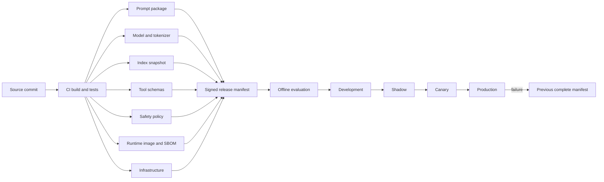
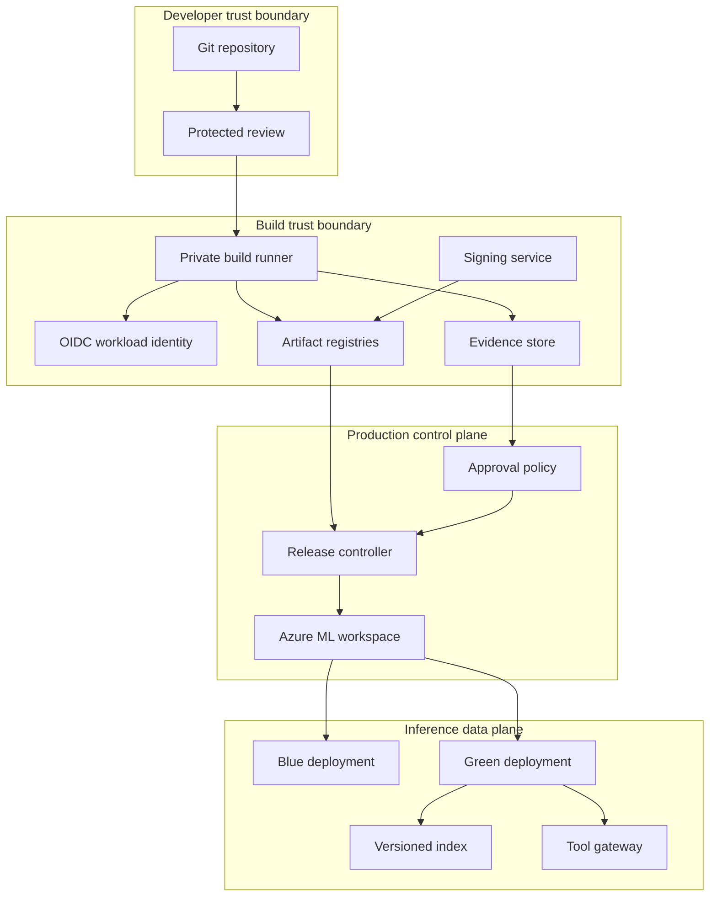

# CI/CD for AI assets

An AI release is not one model file. It is a compatibility-tested graph of code, data, prompts, policies, interfaces, and infrastructure.

That distinction changes how a team builds, approves, deploys, observes, and rolls back production AI. A pipeline that promotes only model weights can reproduce neither the behavior nor the failure of the running system.

## Learning objectives

- Explain why an AI release is a graph rather than a binary.
- Separate authoritative, derived, and runtime state.
- Design an immutable, signed release manifest.
- Distinguish continuous integration, delivery, and deployment.
- Build once and promote the same content digests.
- Use federated workload identity and least privilege.
- Gate a release with deterministic, quality, safety, and operational evidence.
- Roll through shadow, canary, production, and complete rollback.
- Calculate evaluation, rollout, storage, and duplicate-capacity costs.
- Operate retries, idempotency, backpressure, audit, and recovery.

## The costly failure

A customer-support assistant starts returning obsolete warranty instructions after an apparently harmless prompt release. The model version is unchanged, so the deployment dashboard reports a routine configuration update.

The new prompt asks the retriever for a `policy_effective_date` filter, but the production index lacks that field. The retriever silently drops the filter and ranks an older document above the current policy.

The same prompt also emits a new `lookup_order_v2` tool call. One production pod still loads the v1 tool schema, rejects the call, and retries the model without the tool result.

Operators roll back the model weights, yet behavior remains broken because the prompt, index, tool contract, and policy bundle stay new. A model-only rollback has restored nothing that caused the incident.

The direct cost is support rework and incorrect commitments. The deeper cost is that the team cannot prove what configuration answered any affected request.

## Controlling invariant

Production runs one approved release manifest, and every request records its manifest identifier. A rollback restores the complete previous compatible graph, not only model weights.

No mutable label such as `latest` is sufficient authority for production. Human-friendly labels may point to immutable versions, but deployment resolves and records the content digest.

## Additional invariants

Every manifest is immutable after approval.

Every referenced asset has a version and a cryptographic content digest.

Every compatibility edge is tested before promotion.

The artifact built in continuous integration is the artifact promoted through environments.

No production deployment rebuilds dependencies from an unlocked source.

Missing gate evidence is a failure, not a pass.

Production mutation requires an authenticated principal and an auditable approval path.

Rollback remains possible while the new release receives traffic.

Secrets are references resolved at runtime, never manifest values.

## Measurable requirements

- One hundred percent of production requests expose a release manifest ID in safe telemetry.
- One hundred percent of manifest assets pass digest verification before startup readiness succeeds.
- Deterministic contract tests finish within 15 minutes at p95.
- Required offline evaluation finishes within 90 minutes at p95.
- A canary receives at least 10,000 representative requests before automatic promotion is considered.
- Critical safety cases permit zero failures.
- Candidate error rate must remain within 0.2 percentage points of the baseline.
- Candidate latency p95 must remain below 2.5 seconds and within 10 percent of baseline.
- Rollback traffic switching must finish within 10 minutes.
- The prior two approved release graphs remain deployable for at least 30 days.

## Vocabulary

**Continuous integration**, or CI, validates each change and produces immutable evidence and artifacts. CI does not imply that a successful build is allowed to reach production.

**Continuous delivery** keeps an approved candidate deployable but retains a deliberate production decision. The decision can be a human approval, a change window, or a policy gate.

**Continuous deployment** automatically promotes every candidate that satisfies all declared gates. It is suitable only when the gates and rollback controls match the consequence of failure.

An **artifact** is a stored build output such as a model, image, prompt package, index snapshot, or policy bundle. A version names it; a digest identifies its bytes.

A **release manifest** is the authoritative record that binds exact artifacts, compatibility relationships, evidence, and rollback target. It is a small control-plane document whose references determine data-plane behavior.

**Provenance** records where an artifact came from and which process produced it. **Lineage** connects inputs, transformations, outputs, and releases across time.

A **software bill of materials**, or SBOM, inventories packages in a software artifact. It supports vulnerability investigation but does not by itself prove that an artifact is safe.

A **signature** binds an identity to content. Verification proves that signed bytes have not changed and that the signer chains to a trusted key or workload identity.

**Shadow traffic** copies requests to a candidate without returning candidate responses to clients. **Canary traffic** returns candidate responses for a controlled fraction of live requests.

## Authoritative state and derived state

The prompt template is authoritative because changing it can alter instructions, tool selection, and output shape. Its compiled token sequence is derived and can be regenerated only if the tokenizer and template engine are also pinned.

Model weights and model configuration are authoritative. A runtime cache of weights is derived because a node may discard and reconstruct it from the verified model artifact.

The tokenizer is authoritative even when packaged beside the model. A tokenizer mismatch changes token IDs, context accounting, stop behavior, and sometimes model output without changing the model file.

The retrieval corpus snapshot is authoritative input data. The chunk store, embeddings, and search index are derived artifacts, but production must pin their build recipe and exact snapshot because rebuilding can change ranking.

The embedding model is authoritative for an index build. Query and document vectors inhabit the same coordinate system only when compatible preprocessing and embedding versions are used.

Tool contracts are authoritative interfaces. A tool implementation may be backward compatible, but the schema, authorization semantics, idempotency behavior, and error vocabulary must still be versioned.

The safety policy bundle is authoritative because it determines allowed inputs, outputs, and actions. A provider-side policy name without a captured version leaves historical behavior ambiguous.

The runtime environment is authoritative because libraries control serialization, tokenization, TLS, numerical kernels, and request handling. Azure Machine Learning environments track reusable software dependencies for training and deployment ([Microsoft Learn](https://learn.microsoft.com/azure/machine-learning/concept-model-management-and-deployment)).

Infrastructure is authoritative when instance type, network policy, identity, autoscaling, timeout, or concurrency can change behavior. Capacity configuration therefore belongs beside application assets in the release graph.

Evaluation data and gate policy are authoritative release controls. A score has no decision meaning unless the dataset, evaluator, threshold, baseline, missing-result rule, and exception policy are pinned.

## The compatibility graph

Consider a graph whose vertices are immutable assets and whose edges state required compatibility. The graph, rather than any vertex, is the releasable unit.

The prompt has an edge to the tokenizer because token budgets depend on tokenization. It has another edge to the tool schema because the model is instructed to emit arguments that the schema accepts.

The index has an edge to the embedding model and chunk schema. The runtime has edges to the model format, tokenizer library, scoring contract, and hardware instruction set.

An edge must name a test, not merely assert `compatible: true`. Examples include JSON Schema validation, tokenizer golden vectors, retrieval recall evaluation, image startup, and policy conformance tests.



The diagram separates construction from promotion. CI creates assets once, the manifest binds them, and every later stage changes only deployment state and evidence.


Credits: Hazem Ali

The figure makes the hardest mechanism visible: promotion moves a complete manifest through gates while the inference data plane consumes only approved references. A failed gate stops movement rather than modifying the candidate in place.

## Release manifest design

The manifest needs a stable identifier computed from canonical serialized content. If whitespace or key order changes the identifier, two systems may disagree about equivalent content, so the organization must define canonicalization.

Each asset entry needs a logical role, immutable URI, digest algorithm and value, media type, producer, source revision, and signature reference. The URI is a locator; the digest remains the identity check.

Compatibility edges name a consumer, provider, contract version, and evidence result. This structure exposes why two independently valid assets can still be invalid together.

The gate section records policy rather than mutable results. Evidence records are separate signed objects referenced by digest, preventing a pipeline from rewriting the approved criteria after seeing scores.

```json
{
  "$schema": "https://example.invalid/schemas/ai-release-manifest-1.json",
  "manifestVersion": "1.0",
  "releaseId": "support-rag/2026.08.12.4",
  "source": {
    "repository": "support-assistant",
    "commit": "8d7b4f0",
    "workflowRun": "github:run/4815162342"
  },
  "assets": {
    "prompt": {
      "uri": "oci://registry/prompts/support@sha256:111...",
      "digest": "sha256:111...",
      "signature": "rekor://entry/901"
    },
    "model": {
      "uri": "azureml:support-model:17",
      "digest": "sha256:222...",
      "format": "mlflow"
    },
    "tokenizer": {
      "uri": "oci://registry/tokenizers/support@sha256:333...",
      "digest": "sha256:333..."
    },
    "retrievalIndex": {
      "uri": "https://storage/indexes/support/42/manifest.json",
      "digest": "sha256:444...",
      "corpusSnapshot": "support-corpus/2026-08-11"
    },
    "embeddingModel": {
      "uri": "registry://embedding/customer-support/8",
      "digest": "sha256:555..."
    },
    "tools": {
      "uri": "oci://registry/contracts/tools@sha256:666...",
      "digest": "sha256:666..."
    },
    "policy": {
      "uri": "oci://registry/policy/support@sha256:777...",
      "digest": "sha256:777..."
    },
    "runtime": {
      "image": "registry.azurecr.io/support@sha256:888...",
      "sbom": "oci://registry/sbom/support@sha256:999..."
    },
    "infrastructure": {
      "uri": "oci://registry/iac/support@sha256:aaa...",
      "digest": "sha256:aaa..."
    },
    "evaluationData": {
      "uri": "azureml:support-release-set:23",
      "digest": "sha256:bbb..."
    }
  },
  "compatibility": [
    {
      "from": "prompt",
      "to": "tools",
      "contract": "tool-call-v2",
      "testEvidence": "sha256:ccc..."
    },
    {
      "from": "retrievalIndex",
      "to": "embeddingModel",
      "contract": "vector-space-v8",
      "testEvidence": "sha256:ddd..."
    }
  ],
  "gates": {
    "policy": "release-gates/12",
    "evidence": "sha256:eee...",
    "approval": "change/CHG-2041"
  },
  "rollbackTo": "support-rag/2026.08.05.2"
}
```

Azure Machine Learning model assets can be referenced by `azureml:<name>:<version>`, and model versions retain immutable model properties while description and tags remain editable ([Microsoft Learn](https://learn.microsoft.com/azure/machine-learning/how-to-manage-models)). The external digest protects against treating mutable metadata as artifact identity.

## Manifest validation

Validation begins with syntax but cannot end there. JSON Schema proves shape and basic types, while a resolver proves that every immutable URI exists and that downloaded bytes match each digest.

Signature validation checks the signer, certificate chain, workload identity, repository, branch, and workflow claims. Trusting any valid organization signature would let an unrelated pipeline publish a production release.

Compatibility validation executes edge tests against materialized artifacts. A startup smoke test then loads the same runtime image, model, tokenizer, policy, and index client configuration expected in production.

```python
def verify_release(manifest, resolver, trust_policy):
    canonical = canonical_json(manifest)
    verify_manifest_signature(canonical, manifest["signature"], trust_policy)
    for role, asset in manifest["assets"].items():
        content = resolver.read(asset_uri(asset))
        if sha256(content) != digest_value(asset):
            raise ValueError(f"digest mismatch: {role}")
        verify_asset_signature(asset, trust_policy)
    for edge in manifest["compatibility"]:
        run_contract_test(edge["contract"], edge["from"], edge["to"])
    return manifest["releaseId"]
```

The verifier fails closed before readiness. A pod that cannot fetch evidence or validate a digest must not accept requests, because partial startup would violate the production invariant.

## CI, delivery, and deployment boundaries

CI begins at an reviewed source revision and ends with immutable artifacts plus evidence. It compiles prompts, resolves dependencies, builds the index, creates the image and SBOM, scans them, signs digests, and evaluates the graph.

Continuous delivery imports the signed graph into an environment and proves deployability. It may deploy to development automatically while requiring an approval bound to the manifest digest before production.

Continuous deployment removes the manual approval but not policy. The release still needs deterministic vetoes, quality and safety thresholds, capacity checks, staged exposure, and automatic rollback authority.

Environment separation means development and production use different identities, network boundaries, quotas, and data. It does not mean rebuilding a production image with production-specific dependencies.

Environment-specific values belong in a signed deployment binding. That binding maps a release digest to an endpoint, identity, secret references, network, capacity, and rollout policy without changing application bytes.

## Build once and promote by digest

Rebuilding in production creates a new artifact even when source code is unchanged. Package repositories may resolve different transitive dependencies, base tags may move, and compilers may emit different bytes.

The pipeline therefore pushes content-addressed assets once and records their digests. Development, staging, and production pull those same digests from an approved registry path or replication process.

Azure Machine Learning supports registered model and environment versions, and Microsoft recommends registering both for production reuse and traceability ([Microsoft Learn](https://learn.microsoft.com/azure/machine-learning/how-to-deploy-online-endpoints)). A release controller should still verify their resolved identities against its broader manifest.

## Scenario: customer-support RAG release

Release `2026.08.12.4` changes the system prompt so agents must quote the policy effective date. The change seems textual, but design review discovers two compatibility edges.

First, the prompt requires retrieval metadata named `policy_effective_date`. The existing chunk schema stores dates only inside text, so the index builder must create schema v4 and rebuild from a pinned corpus snapshot.

Second, the prompt calls `lookup_order_v2` with a `tenant_id` field. The tool gateway must publish contract v2, authorize tenant scope from identity rather than model arguments, and preserve the v1 endpoint during rollback.

The commit updates the prompt, index schema, tool schema, and evaluation cases together. CI rejects a partial pull request because the manifest compiler cannot resolve the declared compatibility edges.

Unit tests validate templates, JSON schemas, policy rules, and parsers. Contract tests issue generated tool calls, prove v2 accepts valid requests, and prove tenant spoofing is rejected.

The index job reads corpus snapshot `2026-08-11`, emits chunks, vectors, metadata, and a build manifest. A retrieval evaluation compares recall, ranking, date filtering, and stale-document rate against the previous index.

Offline end-to-end evaluation runs representative support conversations. It measures answer correctness, citation entailment, tool success, safety, refusal behavior, latency, and token cost by slice.

Red-team cases exercise malicious documents, prompt injection, cross-tenant order IDs, and stale policy text. One successful cross-tenant tool call is a hard veto regardless of average quality.

After all evidence passes, the pipeline registers the model and environment, stores other assets in content-addressed registries, and signs the manifest. Registration is not promotion; approval remains bound to the manifest digest.

The candidate deploys as `green` with zero live traffic. Direct smoke requests verify startup, private dependency access, secret resolution, and expected manifest telemetry.

Ten percent mirrored traffic exposes production-shaped inputs without returning candidate responses. Azure Machine Learning managed online endpoints can mirror traffic to one deployment, up to 50 percent, and mirroring is not supported for Kubernetes online endpoints ([Microsoft Learn](https://learn.microsoft.com/azure/machine-learning/how-to-safely-rollout-online-endpoints)).

The controller disables mirroring before assigning 5 percent live canary traffic. Candidate responses now affect users, so the canary gate watches errors, latency, quality samples, tool effects, and support escalation slices.

Promotion changes the endpoint to `green=100` only after minimum sample and observation-time requirements pass. Azure Machine Learning endpoints route requests among deployments according to configured traffic percentages ([Microsoft Learn](https://learn.microsoft.com/azure/machine-learning/how-to-safely-rollout-online-endpoints)).

If stale-policy rate rises, rollback sets traffic to the previous deployment and reasserts the previous manifest binding. The old prompt, index, tool v1 compatibility path, policy, image, and capacity return as one graph.

## Scenario two: regulated document classification

A regulated intake system changes its optical-character-recognition library and classifier together. The classifier model is unchanged, but the new parser rotates some pages incorrectly and alters the text presented to the model.

The release graph binds parser image, language packs, model, label taxonomy, confidence policy, evaluation corpus, and human-review threshold. Contract tests prove page orientation and character normalization before classification quality is measured by document type and language.

Shadow processing compares candidate labels without changing case routing. Canary traffic is limited to low-risk document classes, and rollback restores parser plus classifier policy because reverting only model weights would leave the changed input distribution active.

This scenario shows why non-model preprocessing belongs in the manifest. A compatibility-tested graph captures behavioral inputs that a model registry alone cannot represent.

## Release architecture



The build runner has write access only to candidate namespaces and evidence destinations. The release controller, not the build job, owns production traffic mutation.

The inference identity can pull approved artifacts and read runtime secrets but cannot sign manifests or approve itself. This separation prevents a compromised serving pod from manufacturing release authority.

## Federated workload identity

Long-lived client secrets create a copy, storage, rotation, and leakage problem. OpenID Connect (OIDC) federation lets the workflow exchange a short-lived signed GitHub identity token for Azure access under constrained claims.

The Azure Login action supports OIDC with a Microsoft Entra application or user-assigned managed identity, while service-principal secrets are not recommended ([Microsoft Learn](https://learn.microsoft.com/azure/developer/github/connect-from-azure)). The federated credential should restrict repository, branch or environment, and intended audience.

```yaml
name: release-ai-graph
on:
  push:
    branches: [main]
permissions:
  contents: read
  id-token: write
jobs:
  build-evaluate:
    runs-on: [self-hosted, private-ai-build]
    environment: candidate
    steps:
      - uses: actions/checkout@v4
      - uses: azure/login@v2
        with:
          client-id: ${{ vars.AZURE_CLIENT_ID }}
          tenant-id: ${{ vars.AZURE_TENANT_ID }}
          subscription-id: ${{ vars.AZURE_SUBSCRIPTION_ID }}
      - name: Build immutable assets
        run: ./release/build-assets.sh --commit "$GITHUB_SHA"
      - name: Register model version
        run: az ml model create --file out/model.yml --version "$GITHUB_SHA"
      - name: Evaluate frozen graph
        run: python release/evaluate.py --manifest out/manifest.json --policy gates/12.json
      - name: Sign candidate manifest
        run: ./release/sign.sh out/manifest.json
```

`id-token: write` permits token issuance but does not itself grant Azure permissions. Azure role-based access control (RBAC) on the federated principal defines which workspace and registry operations succeed.

The self-hosted label is appropriate only when private endpoints make hosted runners unable to reach dependencies. The runner must be ephemeral or strongly isolated because arbitrary build code executes inside its network boundary.

## Least privilege and approvals

Use one identity to build and register candidate assets, another to deploy nonproduction, and a narrowly scoped release identity to mutate production endpoints. A single subscription-wide Contributor identity collapses all control boundaries.

Azure ML endpoint operations require workspace permissions such as `Microsoft.MachineLearningServices/workspaces/onlineEndpoints/*`; custom roles can scope the exact operations ([Microsoft Learn](https://learn.microsoft.com/azure/machine-learning/how-to-deploy-online-endpoints)). Registry pull, storage read, Key Vault read, and endpoint update permissions should remain separate where practical.

An approval record includes approver identity, manifest digest, evidence digest, environment, reason, time, and expiry. Approval of `release 17` is insufficient if the manifest can later change under that label.

Break-glass access must be time-bound, strongly authenticated, alerted, and reviewed. Its purpose is restoring a known manifest during control-plane failure, not bypassing evidence for a new candidate.

## Supply-chain controls

Pin source actions and build tools to reviewed versions or digests. A trusted repository cannot compensate for an untrusted action that can alter output or steal an identity token.

Generate an SBOM for the runtime image and scan both operating-system and language packages. Store scan policy, database timestamp, exceptions, and artifact digest with evidence because vulnerability results change over time.

Sign the image, prompt bundle, index manifest, policy bundle, and release manifest. Admission verifies signatures before deployment, while runtime startup verifies local bytes before readiness.

Provenance should identify source revision, builder identity, workflow definition, inputs, outputs, and invocation. A reproducible build strengthens investigation, but promotion still uses the already-tested digest rather than rebuilding to check reproducibility.

## Secrets and private networking

The manifest stores a secret name and expected purpose, never a secret value. Runtime identity retrieves the value from an approved secret store and prevents it from entering logs, evidence, or model context.

Private runners need explicit Domain Name System (DNS), routing, firewall, and private endpoint paths to storage, registries, Azure ML, package mirrors, and signing services. A blocked path should fail the build rather than trigger public fallback.

Azure ML deployment uses managed identities to pull images and mount model or code artifacts; a user-assigned endpoint identity needs appropriate Blob reader and registry pull roles ([Microsoft Learn](https://learn.microsoft.com/azure/machine-learning/how-to-troubleshoot-online-endpoints)). That identity is a runtime principal, not a release approver.

## Evaluation gate

The gate script consumes immutable candidate and baseline outputs. It returns a machine-readable decision plus row-level references instead of printing a persuasive average.

```python
import json
import sys

evidence = json.load(open(sys.argv[1], encoding="utf-8"))
policy = json.load(open(sys.argv[2], encoding="utf-8"))

failures = []
if evidence["missing_rate"] > policy["max_missing_rate"]:
    failures.append("missing evaluation rows")
if evidence["critical_safety_failures"] != 0:
    failures.append("critical safety veto")
if evidence["quality_delta_lcb"] < -policy["quality_noninferiority_margin"]:
    failures.append("quality lower confidence bound")
if evidence["latency_p95_ms"] > policy["latency_p95_ms"]:
    failures.append("latency budget")
if evidence["cost_per_request_usd"] > policy["cost_per_request_usd"]:
    failures.append("cost budget")

print(json.dumps({"pass": not failures, "failures": failures}))
raise SystemExit(1 if failures else 0)
```

The lower confidence bound prevents a noisy positive mean from hiding uncertainty. Critical safety cases bypass aggregation because a rare severe failure must not be averaged away.

## Idempotent deployment

Deployment retries are inevitable when a client times out before learning whether Azure accepted an operation. The controller must reconcile desired state by release ID instead of generating a new deployment name on every attempt.

Azure ML create-or-update operations are declarative, and a deployment can reference registered model and environment versions ([Microsoft Learn](https://learn.microsoft.com/azure/machine-learning/how-to-deploy-online-endpoints)). The controller first reads actual state, compares manifest annotations, and mutates only when they differ.

```bash
set -euo pipefail
release_id=$(jq -r .releaseId release.json)
deployment=$(printf '%s' "$release_id" | tr './' '-' | tr -cd '[:alnum:]-')

current=$(az ml online-deployment show \
  --endpoint-name "$ENDPOINT" \
  --name "$deployment" \
  --query tags.manifest_digest -o tsv 2>/dev/null || true)

if [[ "$current" != "$MANIFEST_DIGEST" ]]; then
  az ml online-deployment create \
    --endpoint-name "$ENDPOINT" \
    --name "$deployment" \
    --file deployment.yml
fi

az ml online-deployment show \
  --endpoint-name "$ENDPOINT" \
  --name "$deployment" \
  --query '{state:provisioning_state,digest:tags.manifest_digest}'
```

The deployment name is deterministic and the manifest digest is checked before mutation. A conflict or timeout leads to another read, not blind creation.

## Shadow and canary progression

Direct candidate invocation proves basic function but not production input shape. Shadowing supplies real request distributions while preserving baseline responses, although side-effecting tools must be disabled or redirected.

A shadow must carry a `dry_run` authority boundary enforced by the tool gateway. Prompt instructions alone cannot prevent a candidate from proposing a real action.

```bash
az ml online-endpoint update --name "$ENDPOINT" --mirror-traffic "green=10"
./observe.sh --deployment green --minimum-requests 10000 --minutes 60
az ml online-endpoint update --name "$ENDPOINT" --mirror-traffic "green=0"
az ml online-endpoint update --name "$ENDPOINT" --traffic "blue=95 green=5"
./observe.sh --deployment green --minimum-requests 10000 --minutes 120
az ml online-endpoint update --name "$ENDPOINT" --traffic "blue=0 green=100"
```

Azure ML requires enabled traffic percentages to total 100, while mirrored traffic is configured separately ([Microsoft Learn](https://learn.microsoft.com/azure/machine-learning/how-to-safely-rollout-online-endpoints)). The controller records each traffic change as release evidence.

Canary assignment should be stable for conversational workloads. Randomly moving turns between releases produces mixed state and makes both user experience and attribution invalid.

## Full-manifest rollback

Rollback is a forward control-plane operation that selects the prior approved manifest. It should not depend on reconstructing yesterday's state from Git branches, mutable tags, or operator memory.

The controller verifies that the previous deployment is healthy, restores its external bindings, switches traffic, and then verifies request telemetry. Only after the rollback observation window may it remove or quarantine the failed candidate.

```json
{
  "operation": "rollback",
  "from": "support-rag/2026.08.12.4",
  "to": "support-rag/2026.08.05.2",
  "reason": "stale_policy_rate",
  "restore": [
    "prompt",
    "model",
    "tokenizer",
    "retrievalIndex",
    "embeddingModel",
    "tools",
    "policy",
    "runtime",
    "infrastructure"
  ]
}
```

If a shared database or tool contract received an irreversible migration, deployment rollback may be impossible. Compatibility design therefore uses expand-migrate-contract sequencing and retains old readers until the rollback window closes.

## Capacity and latency math

Suppose baseline needs 12 GPU instances at peak and the candidate needs 12 more for blue-green testing. Azure ML can reserve an extra 20 percent of compute quota for upgrades on some VM versions, so quota planning must follow current SKU guidance ([Microsoft Learn](https://learn.microsoft.com/azure/machine-learning/how-to-deploy-online-endpoints)).

If each deployment requests 12 instances, duplicate serving capacity is 24 instances before service reserve. For a 20 percent reserve assumption, quota planning becomes $24 \times 1.2 = 28.8$, rounded to 29 instance equivalents.

If one instance costs $6.20 per hour and overlap lasts 4 hours, incremental blue-green compute is $12 \times 6.20 \times 4 = \$297.60$. That amount is an explicit release-control cost, not unexplained infrastructure waste.

An 18 GiB image plus a 42 GiB model requires 60 GiB per cold node. At an effective 1.2 GiB/s pull rate, transfer alone takes $60 / 1.2 = 50$ seconds before extraction, initialization, and readiness tests.

Twelve cold nodes transfer $12 \times 60 = 720$ GiB. If registry or network throughput is shared, assuming all nodes complete in 50 seconds is unsafe; staged prewarming and measured p95 pull time determine rollout lead time.

## Evaluation token cost

Assume 20,000 cases, 2,200 input tokens per case, 500 candidate output tokens, and 800 judge tokens. Candidate generation consumes 44 million input and 10 million output tokens.

If illustrative prices are $2 per million input tokens and $8 per million output tokens, generation costs $44 \times 2 + 10 \times 8 = \$168$. Prices are assumptions and must be replaced by the contracted rates for the selected deployments.

If judging reads 3,500 tokens and emits 300 tokens per case at the same illustrative rates, judge cost is $70 \times 2 + 6 \times 8 = \$188$. Repeating all evaluation three times raises this portion to $564$, so deterministic caching by input and evaluator digest matters.

Cache reuse is valid only when all evaluator inputs match. A changed rubric, judge model, prompt, or candidate output invalidates the key even if the case ID stays constant.

## Canary sample time

Suppose production receives 25 requests per second and the canary gets 5 percent. The expected candidate rate is $25 \times 0.05 = 1.25$ requests per second.

Collecting 10,000 requests takes $10{,}000 / 1.25 = 8{,}000$ seconds, or about 2.22 hours. A 30-minute canary would produce only about 2,250 requests and violate the declared sample requirement.

A minimum count does not replace a minimum time. Two hours may miss daily seasonality, so the gate can require both 10,000 requests and one complete business cycle.

## Failure modes

A build can succeed while artifact upload fails. The manifest compiler must publish only after every referenced object is durable and digest-verifiable.

A registry can accept an upload while signing fails. Unsigned artifacts remain candidates but are ineligible for manifest inclusion.

An evaluation worker can disappear after producing partial rows. The reducer compares expected case IDs with observed IDs and fails when required rows are absent.

A deployment command can time out after server acceptance. Reconciliation reads provisioning state and the manifest tag before deciding whether to retry.

Azure ML exposes container and storage-initializer logs for deployment diagnosis, and failed deployment operations do not emit a successful `ModelDeployed` Event Grid event ([Microsoft Learn](https://learn.microsoft.com/azure/machine-learning/how-to-troubleshoot-online-endpoints), [Microsoft Learn](https://learn.microsoft.com/azure/machine-learning/how-to-use-event-grid)). Absence of an event is therefore never proof of failure or success.

A candidate can pass shadow checks but fail under returned-response load. Shadowing does not test user reactions, conversation continuity, or side effects, which is why canary remains a distinct gate.

A canary can overload the baseline if duplicated shadow work consumes shared quotas. Capacity tests include model quota, search throughput, tool limits, registry bandwidth, and telemetry ingestion.

A rollback can fail because the old image was deleted or its tool endpoint retired. Periodic rollback drills prove deployability rather than trusting retention policy documents.

## Retry and backpressure

CI fans out expensive evaluation and index tasks, but downstream quotas are finite. A bounded queue and concurrency limit prevent one release from starving production or every other candidate.

Retries use exponential backoff with jitter for transient transport, throttling, and service errors. Validation failures, authentication denials, digest mismatches, and schema errors are terminal until the input changes.

Every job carries candidate digest and operation ID. Workers upsert evidence by that key, making duplicate delivery harmless and conflicting results visible.

Event handlers validate source and event type because multiple subscriptions can target one handler. Azure ML Event Grid events may arrive late or out of order, and consumers should use object sequencing information where available ([Microsoft Learn](https://learn.microsoft.com/azure/machine-learning/how-to-use-event-grid)).

## Observability contract

Every deployment emits release ID, manifest digest, deployment name, model version, prompt digest, index version, tool contract, policy version, and environment. High-cardinality values belong in traces or logs rather than metric dimensions.

Metrics compare baseline and candidate by route, tenant class, language, task, and risk slice. They include request rate, errors, latency, token use, retrieval quality proxies, tool outcomes, safety blocks, queue age, and cost.

Logs capture lifecycle transitions and reason codes without prompt bodies or secrets. Traces connect release identity to retrieval, model, and tool effects while respecting data classification rules.

An audit record differs from telemetry. It is durable evidence of who approved which digest, which controller changed traffic, what result it observed, and which rollback target existed.

## Event-driven integration

Azure Machine Learning publishes run completion, model registration, model deployment, and run-status events through Event Grid ([Microsoft Learn](https://learn.microsoft.com/azure/machine-learning/how-to-use-event-grid)). These events can wake a reconciler, but they do not replace polling authoritative state after ambiguous failures.

```json
{
  "eventType": "Microsoft.MachineLearningServices.ModelRegistered",
  "subject": "models/support-model:17",
  "data": {
    "ModelName": "support-model",
    "ModelVersion": "17"
  }
}
```

The handler checks workspace topic, event type, subject, and current model metadata. It then finds candidate manifests waiting for that exact version rather than promoting the model independently.

## Recovery runbook

1. Freeze further promotion for the affected endpoint.
2. Capture endpoint traffic, deployment state, manifest IDs, logs, and request identifiers.
3. Determine whether the failure is control-plane, startup, capacity, dependency, or behavioral.
4. If user impact exceeds the rollback threshold, select the prior approved manifest.
5. Verify old deployment health and all external compatibility bindings.
6. Switch traffic to the prior deployment and confirm manifest telemetry.
7. Drain candidate side effects and reconcile asynchronous work by idempotency key.
8. Preserve evidence, revoke compromised identities if relevant, and open an incident record.
9. Repair through a new manifest; never edit the failed approved manifest.
10. Re-run the full gate sequence before another promotion.

The runbook chooses rollback from impact and evidence rather than waiting for root cause. Diagnosis continues after service restoration because the immutable release identity preserves the failed graph.

## Stage-by-stage release walkthrough

### Change intake

The release begins when a protected branch accepts a reviewed commit. The pull request describes behavioral intent and names affected manifest roles, so reviewers can challenge a supposedly isolated prompt edit that also changes retrieval or tools.

The intake job computes the dependency closure from changed files to asset roles. This is a planning aid rather than authority; the manifest compiler still resolves the complete graph so a missed path cannot omit an asset.

The pipeline assigns one candidate ID before fan-out. Every build, evaluation, scan, and deployment record uses that ID and the source commit, which prevents evidence from parallel candidates being combined accidentally.

### Deterministic validation

Template parsing, schema validation, policy compilation, and tool contract tests run before expensive model calls. Fast failure conserves compute and gives developers a precise defect instead of a late aggregate gate failure.

Golden tokenizer tests map representative strings to expected token IDs and counts. They catch library or vocabulary changes that would otherwise appear as mysterious context truncation after deployment.

Index schema tests create a tiny corpus, build the index, query required filters, and inspect returned metadata. This test proves the requested field is stored and filterable, not merely present in source documents.

Tool tests separate syntactic validity from authorization. A request can satisfy JSON Schema and still be forbidden because the authenticated tenant does not own the requested order.

### Artifact construction

Each builder writes to a candidate-scoped temporary location, calculates a digest, then atomically publishes to a content-addressed location. Readers never observe a directory while files are still arriving.

The model registration points to a completed job output or verified upload. Azure ML can establish lineage from job output URIs, but the release evidence also records the source and digest used by the broader graph ([Microsoft Learn](https://learn.microsoft.com/azure/machine-learning/how-to-manage-models)).

The index builder emits row counts, rejected-document counts, chunk statistics, embedding version, schema version, and source watermark. These values make a later ranking change diagnosable without retaining prohibited document content in build logs.

The image builder resolves a lock file, pins its base image digest, generates the SBOM, and runs the same startup command as serving. A successful package installation is not proof that the scoring process can load all assets within its readiness budget.

### Evidence reduction

Parallel evaluators produce row-level immutable fragments. A reducer verifies expected partitions, deduplicates by case and attempt, and refuses conflicting outputs for the same evaluator digest.

The reducer computes aggregate and slice statistics only after completeness checks. Otherwise, a worker failure concentrated in hard cases could improve the apparent score by deleting unfavorable evidence.

Every threshold evaluation records observed value, comparator, threshold, uncertainty interval, sample count, and result. This structure lets an approver inspect causality instead of reading a bare `passed: true` field.

Exceptions are new signed evidence objects with owner and expiry. They do not modify the policy or erase the failed observation, preserving what was known when the release decision occurred.

### Candidate publication

Publication verifies that all artifact stores have retention and access policies compatible with the rollback window. A manifest is not deployable when one referenced object will expire before the release does.

The signing identity receives only digests and provenance after required builders succeed. It cannot alter artifacts, and builders cannot sign their own output as production-approved.

The published manifest receives an immutable release ID and canonical digest. A friendly channel such as `candidate` may point to it, but consumers record the resolved digest rather than the channel.

### Nonproduction deployment

The nonproduction controller resolves the manifest with its own read identity and verifies every signature again. Trust is checked at each boundary because a registry compromise between build and deployment remains possible.

Startup probes validate local artifact digests and dependency reachability. Readiness waits for model load, tokenizer test vectors, policy compilation, and index schema negotiation.

Smoke requests cover success, refusal, malformed input, unavailable dependency, and unauthorized tool access. A happy-path answer alone does not establish that production failure behavior is bounded.

### Approval

The approval view presents the candidate against its declared baseline. It highlights changed graph vertices, failed-but-excepted gates, critical slices, capacity delta, rollback target, and irreversible migrations.

The approver signs the manifest digest and evidence digest, not a pipeline run number. Re-running a failed job can create new evidence, which requires a new approval even when source is unchanged.

Two-person approval can reduce unilateral risk for high-impact releases. Independence matters: two clicks by accounts controlled through the same compromised build identity do not create two controls.

### Production preparation

Before candidate creation, the controller checks quota for overlap, registry reachability, secret references, private DNS, and old deployment health. Discovering missing duplicate capacity after traffic movement turns a controlled rollout into an incident.

The controller prewarms the candidate and records pull, initialization, and readiness durations. These measurements update the rollback and future rollout time budgets.

Production smoke tests target the deployment directly at zero traffic. Their test principal has tightly limited data and tool authority so verification cannot create real customer side effects.

### Shadow observation

The gateway removes or tokenizes sensitive fields according to the candidate's approved data contract before mirroring. A shadow is another processor of production data and must satisfy the same classification and retention rules.

Responses from baseline and candidate are joined by a safe correlation ID. The comparison pipeline measures disagreement, citation changes, tool proposals, latency, and errors without returning the shadow answer.

Shared downstream services tag shadow work and enforce separate budgets. Without isolation, mirrored load can degrade the baseline and falsely suggest that both releases are unhealthy.

### Canary observation

Assignment uses a stable hash over an eligible subject so a conversation remains on one release. Eligibility can exclude high-risk operations until the candidate has accumulated lower-risk evidence.

The canary gate evaluates both absolute budgets and baseline-relative changes. A candidate under its latency limit can still be suspicious when latency doubles during an otherwise quiet period.

Hysteresis prevents rapid traffic oscillation around a threshold. A hard safety veto rolls back immediately, while a noisy operational warning may require several consecutive windows.

### Promotion and retention

Promotion changes traffic authority but does not delete blue. The previous graph remains warm through the declared rollback observation period unless capacity cost outweighs recovery objectives and an approved cold-rollback plan exists.

The controller writes the active manifest digest to an authoritative deployment-status record. Dashboards derive from that record and endpoint state rather than becoming the source of truth themselves.

After the rollback window, cleanup removes unreferenced deployments while retaining manifests, evidence, audit, and required artifacts. Garbage collection starts from all approved and legally held manifests, then deletes only objects outside their transitive closure.

### Audit reconstruction

An investigator starts with a request ID and resolves its manifest digest. The manifest identifies every asset, while evidence explains why the graph was approved and deployment records show when it received traffic.

The reconstruction also checks external tool audit by release ID and idempotency key. This connects a model proposal to an authorized effect without storing hidden reasoning.

If any referenced evidence is missing or its signature fails, the audit is incomplete. The organization treats that as a governance defect even when the original response appears correct.

## Alternatives and tradeoffs

A model-only registry is simple and useful for model lineage, but it cannot bind prompts, indexes, tools, policies, and infrastructure. It remains a component registry beneath the release manifest.

A monolithic container can package model, tokenizer, prompt, and policy together. It simplifies byte identity but makes large index snapshots, frequently changed prompts, and secrets awkward, and it still needs external tool and infrastructure compatibility.

Mutable environment configuration enables fast edits. It also bypasses evaluation and makes historical reconstruction unreliable, so emergency edits should produce a small new signed manifest instead.

In-place rolling update uses less duplicate capacity. Azure ML updates managed deployments incrementally, but Microsoft recommends blue-green deployment for safer production rollout ([Microsoft Learn](https://learn.microsoft.com/azure/machine-learning/how-to-deploy-online-endpoints)).

Blue-green deployment costs more during overlap but retains an immediately addressable rollback target. The choice depends on consequence, quota, startup time, state compatibility, and recovery objective.

Manual production approval catches organizational context that automated tests may miss. It also adds delay and can become ceremonial unless the approval displays immutable evidence and explicit exceptions.

Continuous deployment reduces lead time when tests are strong and changes are reversible. High-consequence tool authority, sparse safety evidence, or irreversible migrations usually justify continuous delivery with approval.

## Design review questions

- What exact document authorizes production behavior?
- Can every request be mapped to that document?
- Which assets are authoritative and which are reproducible derivatives?
- Does every compatibility edge name an executable test?
- Can an artifact change without changing its digest?
- Does production rebuild anything already evaluated?
- Can the build identity mutate production traffic?
- What prevents a shadow from executing side effects?
- What sample count and observation time govern canary promotion?
- Can rollback restore the index, prompt, policy, tools, and runtime together?
- Are old contracts retained through the rollback window?
- Has rollback been exercised from stored artifacts?

## Hands-on exercise

Design a release pipeline for the customer-support RAG system in this chapter. Use a development Azure ML workspace and a disposable endpoint; do not use customer content or production secrets.

Create two prompt versions, two tool schemas, and two small index snapshots. Make the second prompt depend on a metadata field and tool argument absent from version one.

Write a JSON Schema for the release manifest. Include immutable URIs, SHA-256 digests, signatures or local signature placeholders, provenance, compatibility edges, gate evidence, and rollback target.

Build a verifier that rejects a modified asset, missing evidence, an unsupported edge, and an untrusted signer. Capture test output for each rejected case.

Register a sample model and environment as explicit Azure ML versions. Azure ML supports model creation from local files, datastore paths, or job outputs, including lineage-preserving job URIs ([Microsoft Learn](https://learn.microsoft.com/azure/machine-learning/how-to-manage-models)).

Deploy blue with the first manifest and green with the second. Invoke green directly, mirror traffic if the chosen endpoint supports it, then assign a small live percentage.

Inject a regression into the v2 index ranking. Demonstrate that the gate or canary detects it and that rollback restores the complete v1 graph.

Calculate duplicate compute cost, artifact transfer time, evaluation token cost, and time to the minimum canary sample. State every measured value and pricing assumption.

Implement a simulated duplicate deployment request. Show that reconciliation produces one deployment identity and one evidence record rather than duplicate releases.

## Expected evidence

- A manifest schema and two immutable example manifests.
- Digest verification output for every asset.
- Compatibility tests for prompt-tool and index-embedding edges.
- A workflow using OIDC federation without a stored Azure client secret.
- Azure RBAC scopes for build, nonproduction deploy, and production release identities.
- An SBOM, vulnerability result, signature record, and provenance record.
- Frozen evaluation policy and row-level result references.
- Direct, shadow, canary, promotion, and rollback transition logs.
- Request telemetry containing the manifest ID.
- Cost and timing calculations with units.
- A failure narrative proving why model-only rollback would not recover the system.

## Chapter summary

## Completion criterion

A release is complete only when its immutable graph, evidence, approval, active deployment state, and tested rollback target agree. A green dashboard without that agreement is operational observation, not release proof.

The release owner can demonstrate reconstruction from one request to one manifest and every consequential effect. The operator can restore the prior graph without rebuilding or inventing missing configuration.

An AI release is a compatibility-tested graph because behavior emerges from the interaction of model, prompt, tokenizer, retrieval, tools, policy, runtime, and infrastructure. Versioning each asset separately is necessary but insufficient.

The release manifest binds immutable identities, provenance, signatures, compatibility evidence, gate policy, and rollback target. CI builds and evaluates it once; delivery and deployment promote that same digest.

Federated workload identity, least privilege, private build paths, SBOMs, and signatures protect the supply chain. Shadow and canary stages then test production conditions without confusing exposure with approval.

The controlling invariant makes recovery precise: production runs one approved manifest, and rollback restores the entire prior graph. That is the difference between changing a model and operating an AI system.