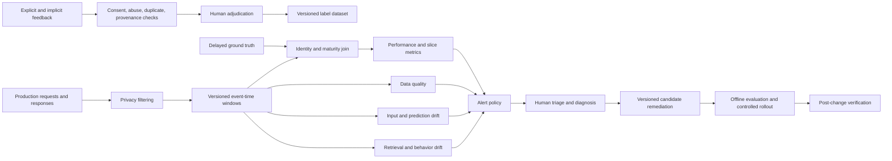

# Drift detection and feedback

Production behavior changes even when code and model files do not. Customers change, sensors age, fraud strategies adapt, documents are replaced, and the meaning of a label can move.

Drift monitoring turns those changes into evidence. It does not identify cause automatically, and it must never become unreviewed authority to retrain or deploy.

## Learning objectives

- Distinguish data quality, input, label, concept, prediction, retrieval, behavior, and operational drift.
- Design fixed and rolling reference windows with offsets and seasonal controls.
- Require sample sufficiency, slice coverage, and delayed-label maturity.
- Calculate PSI, Jensen-Shannon distance, KS statistics, and control-chart signals.
- Explain uncertainty, multiple testing, hysteresis, and alert deduplication.
- Operate feedback collection without turning abuse or selection bias into labels.
- Configure Azure Machine Learning monitoring and Event Grid response.
- Query production evidence with Kusto Query Language.
- Move from alert to diagnosis, evaluated remediation, rollout, and verification.

## The costly failure

A fraud team sees the positive prediction rate rise from 0.8 percent to 1.4 percent during a holiday weekend. An automated job interprets prediction drift as model decay and retrains immediately on recent investigator decisions.

Holiday traffic contains more international purchases, while investigators review only high-score cases. Their labels are delayed, selectively observed, and influenced by the deployed model.

The retrained model learns the review policy rather than fraud. It suppresses a new low-value fraud pattern, increases false declines for travelers, and reaches production before chargebacks reveal the damage.

At the same time, an enterprise retrieval-augmented generation system receives unchanged user questions but starts citing obsolete procedures. Its query distribution is stable, so a generic input-drift dashboard stays green.

The actual change is in the corpus and ranking path: a bulk document migration removed effective-date metadata and rebuilt embeddings. Monitoring the wrong boundary hid a costly failure.

## Controlling invariant

No drift signal or raw feedback automatically changes production. Every response becomes a versioned candidate that passes the release gates defined in the previous chapter.

Drift evidence may open an incident, schedule diagnosis, or propose remediation. Training, index rebuilding, prompt changes, and deployment remain separate authorized transitions.

## Additional invariants

Every metric names its production window, reference window, population, and versioned computation.

Reference and comparison windows do not overlap unless the analysis explicitly models that dependence.

Every alert records sample count and missingness.

Delayed labels are joined by stable event identity and label maturity.

Aggregate health cannot hide a failed protected slice.

Release changes are recorded as possible confounders.

Raw user feedback never enters a training set directly.

Duplicate, abusive, and unconsented feedback is quarantined.

Every remediation preserves the evidence that motivated it.

## Measurable requirements

- Monitoring windows close within 30 minutes of their declared event-time watermark.
- At least 99.5 percent of eligible predictions carry release and correlation identifiers.
- Schema and missingness failures alert within 15 minutes.
- Statistical drift requires at least 1,000 observations overall and 200 per critical slice unless a documented exact method applies.
- Ground-truth performance uses only labels past the declared 45-day maturity horizon.
- High-severity alerts reach an on-call route within 5 minutes of monitor completion.
- Duplicate alerts for one cause collapse into one incident within a 60-minute suppression window.
- Feedback provenance completeness exceeds 99 percent.
- No production update occurs without a candidate version and evaluation evidence.
- Post-change verification spans at least one complete seasonal cycle relevant to the system.

## Vocabulary

**Data quality drift** is a change in validity rather than distribution: missing fields, type errors, impossible values, truncated payloads, or broken joins. It often indicates pipeline failure before model failure.

**Covariate drift**, also called input drift, means $P(X)$ changes. The relationship between inputs and the target may remain stable, so input drift is not equivalent to degraded accuracy.

**Label drift** means $P(Y)$ changes. A fraud prevalence increase is label drift even if the feature distribution appears similar.

**Concept drift** means $P(Y\mid X)$ changes. The same transaction pattern now implies a different fraud risk because attacker behavior or business rules changed.

**Prediction drift** means the distribution of model outputs changes. It is observable without labels but can arise from inputs, model versions, thresholds, or serving defects.

**Quality drift** is a change in task success, correctness, groundedness, safety, or human acceptance. For generative systems it usually requires sampled evaluation rather than one deterministic target.

**Operational drift** is a change in latency, errors, token use, cost, queueing, cache behavior, or dependency health. It can alter user outcomes even while model quality is stable.

**Retrieval drift** covers changes in corpus, chunking, embeddings, index, query mix, filters, ranking, freshness, or evidence coverage. It must be decomposed because one retrieval score cannot locate the changed stage.

**Feedback drift** is a change in who provides feedback, how often, under which interface, and for what motivation. A new thumbs-down button placement can change feedback rate without changing quality.

A **reference window** represents expected behavior. A **production window** contains recent observations being compared.

A **lookback size** defines window duration. An **offset** moves the window end backward from monitor execution time to accommodate ingestion or label delay.

**Censoring** occurs when the outcome is not yet observable or never becomes observable. Treating censored cases as negative labels creates bias.

**Confounding** occurs when another change explains both the monitored signal and apparent outcome. Releases, campaigns, outages, seasonality, and policy changes are common confounders.

## Signal map

| Signal | Changed object | Example measure | Likely questions |
| --- | --- | --- | --- |
| Schema quality | payload contract | null/type/error rate | Did ingestion break? |
| Input drift | feature distribution | PSI, JS, KS | Did population change? |
| Label drift | outcome prevalence | mature positive rate | Did base rate change? |
| Concept drift | input-outcome relation | slice error change | Does old mapping still hold? |
| Prediction drift | score/output distribution | JS, class rate | Did model behavior move? |
| Corpus drift | authoritative documents | add/remove/freshness rate | Did knowledge change? |
| Embedding drift | vector representation | neighbor overlap | Did vector space change? |
| Ranking drift | ordered evidence | NDCG, recall, MRR | Did retrieval quality move? |
| Prompt/tool drift | agent behavior | tool/error/policy rates | Did control behavior move? |
| Quality/safety drift | evaluated response | rubric score, defect rate | Are outcomes worse? |
| Operational drift | serving path | p95 latency, cost | Is the system degrading? |
| Feedback drift | observation process | response/provenance rate | Did measurement change? |

The table is a diagnostic map, not an alert catalog. Several signals often move together, and the investigation must follow the causal path through releases, data, and dependencies.

## Architecture



The architecture keeps measurement, diagnosis, and change authority separate. Privacy filtering occurs before broad analytical storage, while delayed labels follow a controlled join rather than being guessed from absence.


Credits: Hazem Ali

The figure emphasizes that drift is evidence. The path from alert to production loops through diagnosis, versioned remediation, evaluation, and controlled rollout rather than directly into retraining.

## Reference windows

A fixed training reference answers whether production still resembles the population used to build the model. It detects long-term movement but may alert continuously after a legitimate business expansion.

A recent-production reference answers whether the system changed from its recent operating regime. It adapts to accepted movement but can normalize slow harmful drift until the new behavior becomes baseline.

Use both when consequences justify it. The fixed reference protects original assumptions, while the rolling reference detects abrupt change around the current regime.

Azure Machine Learning monitoring supports training, validation, ground-truth, or recent production references and configurable rolling or fixed windows ([Microsoft Learn](https://learn.microsoft.com/azure/machine-learning/concept-model-monitoring)). The reference choice remains a system-design decision rather than a service default.

Suppose a daily monitor runs at 03:00 UTC with production size `P1D` and offset `P1D`. It examines the complete day ending 24 hours earlier, allowing late events to arrive before computation.

If the reference uses size `P28D` and offset `P2D`, it ends before production begins and covers four earlier weeks. Azure ML defines offsets from monitor time and recommends nonoverlapping windows for independent comparison ([Microsoft Learn](https://learn.microsoft.com/azure/machine-learning/concept-model-monitoring)).

## Seasonality

Comparing holiday traffic with an ordinary October week confuses predictable seasonality with drift. A seasonal reference can compare the same weekday, hour, campaign phase, or annual event from prior periods.

Seasonal matching needs enough history and stable definitions. If Black Friday promotion strategy changed, last year's day is useful context but not a causal control.

Maintain calendar annotations beside windows: holidays, campaigns, incidents, releases, pricing changes, and upstream migrations. These annotations help triage explain a signal without altering its measured value.

## Sample sufficiency

Small windows produce unstable proportions and empty categories. Large windows make tiny irrelevant differences statistically significant and delay detection.

Every detector therefore declares minimum sample size, minimum category expectation, and minimum practical effect. A p-value alone answers neither operational importance nor cost of action.

Slices need their own counts. Ten thousand global requests do not validate a language slice with twelve observations.

For a binomial defect rate $p$, an approximate standard error is $\sqrt{p(1-p)/n}$. With $p=0.02$ and $n=200$, it is about 0.0099, so a one-point observed change is mostly noise.

With $n=20{,}000$, the same standard error is about 0.001. The detector becomes sensitive enough that practical thresholds and multiple-testing control matter.

## Population Stability Index

Population Stability Index (PSI) compares proportions in aligned bins. For reference proportions $r_i$ and production proportions $p_i$,

$$
\operatorname{PSI}=\sum_i (p_i-r_i)\ln\left(\frac{p_i}{r_i}\right)
$$

Assume three transaction-amount bins have reference proportions $(0.50,0.30,0.20)$ and production proportions $(0.40,0.35,0.25)$. The first contribution is $(0.40-0.50)\ln(0.40/0.50)\approx0.0223$.

The second is $0.05\ln(0.35/0.30)\approx0.0077$, and the third is $0.05\ln(0.25/0.20)\approx0.0112$. Total PSI is approximately $0.0412$.

PSI depends on bin boundaries and needs smoothing when a proportion is zero. A threshold copied from another industry is not evidence that this movement matters to this model.

## Jensen-Shannon distance

Jensen-Shannon divergence symmetrizes and bounds a comparison derived from Kullback-Leibler divergence. Let $M=(P+Q)/2$; then

$$
\operatorname{JSD}(P,Q)=\frac{1}{2}D_{KL}(P\Vert M)+\frac{1}{2}D_{KL}(Q\Vert M)
$$

It remains finite when one distribution assigns zero probability where the other does not, provided the mixture is used. Some tools report the square root as Jensen-Shannon distance, so the metric definition must state which form it stores.

For reference $(0.5,0.5)$ and production $(0.75,0.25)$ using base-2 logarithms, $M=(0.625,0.375)$. The divergence is about 0.0488 bits and the distance is about 0.221.

Azure ML includes Jensen-Shannon distance among data and prediction drift metrics ([Microsoft Learn](https://learn.microsoft.com/azure/machine-learning/concept-model-monitoring)). Thresholds should be calibrated against historical benign and harmful periods.

## KS and chi-square caveats

The two-sample Kolmogorov-Smirnov statistic is the largest distance between two empirical cumulative distribution functions:

$$
D_{n,m}=\sup_x|F_n(x)-G_m(x)|
$$

It is intuitive for one-dimensional continuous values and sensitive to location and shape. Standard null distributions need care for discrete values, ties, estimated parameters, dependence, and repeated monitoring ([KS references](https://www.itl.nist.gov/div898/handbook/eda/section3/eda35g.htm)).

Pearson's chi-square test compares categorical observed and expected counts. Sparse categories violate approximations, so combine only semantically defensible categories or use exact and simulation methods.

Neither test explains business consequence. A huge sample can reject equality for a distribution change too small to alter any decision.

## Retrieval metrics

Corpus monitoring begins with document identity, owner, classification, effective date, checksum, and lifecycle state. Counts of additions and removals are useful, but a one-document change can still be decisive.

Chunk monitoring tracks chunks per document, size distribution, overlap, parser failures, language, and lost metadata. An unchanged corpus can yield a different index after parser or chunker changes.

Embedding monitoring compares model and preprocessing versions, vector norms, invalid vectors, and nearest-neighbor overlap on stable probes. Coordinate-level distance across different embedding spaces is usually meaningless without alignment.

Ranking monitoring uses labeled or weakly labeled probes. Recall@$k$ asks whether required evidence appears; mean reciprocal rank emphasizes first relevant position; normalized discounted cumulative gain handles graded relevance.

For ten stable probes, suppose old top-5 retrieval contains required evidence for nine and new retrieval for six. Recall@$5$ falls from 0.90 to 0.60 even though query distribution is unchanged.

Freshness monitoring measures whether the latest effective document outranks superseded versions. Citation entailment then checks whether the generated claim is supported by retrieved evidence rather than merely sharing words.

## Quality evaluator uncertainty

Model-based evaluators are measurements with prompt, model, calibration, and sampling error. Their versions belong in every observation.

Estimate uncertainty by repeated judging where cost permits, bootstrap intervals over cases, and periodic comparison with qualified human labels. A one-tenth score change is not actionable when evaluator disagreement is larger.

Microsoft Foundry combines evaluation, monitoring, and tracing and supports sampled production evaluation through its observability surfaces ([Microsoft Learn](https://learn.microsoft.com/azure/foundry/concepts/observability)). Region, rate, virtual-network, evaluator, and pricing support must be checked for the current project.

The older continuous-agent-evaluation article applies only to Foundry classic and describes a preview without a service-level agreement ([Microsoft Learn](https://learn.microsoft.com/azure/foundry-classic/how-to/continuous-evaluation-agents)). Do not present its portal steps or limits as universal current production guarantees.

## EWMA and control charts

An exponentially weighted moving average (EWMA) emphasizes recent observations while retaining history:

$$
z_t=\lambda x_t+(1-\lambda)z_{t-1}
$$

With $\lambda=0.2$, previous smoothed defect rate 0.03, and current rate 0.08, the new EWMA is $0.2(0.08)+0.8(0.03)=0.04$. One spike moves the signal without replacing all historical context.

Control limits should reflect baseline variability, sample size, autocorrelation, and desired detection delay. Consecutive points and run rules can detect sustained movement that one threshold crossing misses.

## Multiple testing

Monitoring 100 features at a 5 percent significance level produces false alerts even under stable behavior. Repeating the tests every hour compounds the problem.

False discovery rate procedures can control the expected proportion of false discoveries among flagged tests. Family-wise controls are stricter and may suit a small set of safety-critical hypotheses.

Practical systems also reduce hypotheses: monitor decision-relevant features, predeclare slices, group correlated symptoms, and require effect size plus persistence. Statistical correction does not replace system knowledge.

## Hysteresis and deduplication

An alert can open after three consecutive bad windows and close after five healthy windows below a lower threshold. Separate open and close thresholds prevent flapping.

Deduplication keys combine monitor, release, signal, feature or slice, and time bucket. Related symptoms can attach to one incident while retaining raw metric evidence.

Suppression is not deletion. The system records repeated breaches and uses them to update severity without paging the same operator every minute.

## Scenario one: delayed fraud labels

The fraud model scores transactions immediately, but confirmed chargebacks arrive between 7 and 45 days later. Investigator decisions arrive sooner but cover only selected high-risk cases.

Input windows compare amount, country, merchant class, device age, and channel by seasonal cohort. Prediction monitoring tracks score distribution and review volume, while operational monitoring tracks latency and feature lookup failures.

The label join uses transaction ID and an as-of rule. A transaction enters performance metrics only after 45 days or an authoritative confirmed outcome, preventing recent unlabeled cases from being treated as legitimate.

The monitor reports label coverage by score decile and slice. Low-score transactions with sparse labels are explicitly censored, exposing the blind spot rather than manufacturing confidence.

During the holiday weekend, country and amount drift, prediction rate rises, and review queues lengthen. Mature performance is not yet available, so the alert states distribution evidence and uncertainty instead of declaring concept drift.

Triage compares the same holiday period last year, recent release history, merchant campaigns, and feature service health. Stable shadow performance on a held-out seasonal set suggests a population shift rather than immediate model failure.

Two weeks later, early chargebacks reveal a new fraud pattern concentrated in one merchant slice. The team creates a versioned candidate with new features and labels, evaluates historical and holiday slices, then canaries it.

## Scenario two: enterprise RAG corpus change

User query vocabulary and volume remain stable after a document migration. Generic input-drift signals therefore do not fire.

Corpus telemetry shows 18 percent of policy documents changed checksum, but migration was expected. The decisive signal is that effective-date metadata null rate rises from 0.2 percent to 31 percent.

Stable probes show recall@$5 falling from 0.92 to 0.68 for superseded-policy cases. Citation freshness falls while generation fluency stays constant, locating the defect before the model stage.

Trace comparison confirms the new index ignores an effective-date filter because the field is absent. The remediation fixes parser mapping and rebuilds a candidate index from the same corpus snapshot.

Offline retrieval and end-to-end evaluation pass before shadow comparison. Controlled rollout verifies freshness and latency, then the index manifest is promoted through the full AI release graph.

## Feedback is an observation process

Explicit feedback includes ratings, thumbs, corrections, and complaints. Implicit feedback includes abandonment, retries, escalation, edits, dwell time, and downstream reversal.

Neither form is truth by itself. A user may downvote a correct refusal, abandon because a phone rang, or repeatedly submit feedback to manipulate future behavior.

Selection bias appears because only some users respond. Interface placement, latency, language, customer value, and outcome severity all affect response probability.

Feedback therefore stores exposure context: what was shown, release ID, eligibility, interface version, consent, user cohort, timestamp, and provenance. Without exposure counts, a feedback rate denominator is unknown.

## Feedback schema

```json
{
  "feedback_id": "fb_01J5...",
  "request_id": "req_01J5...",
  "release_id": "support-rag/2026.08.12.4",
  "actor_hash": "rotating-pseudonym",
  "feedback_type": "thumb_down",
  "reason_code": "stale_policy",
  "free_text_ref": "protected://feedback/fb_01J5...",
  "consent": "quality_improvement",
  "interface_version": "web/14",
  "provenance": "authenticated-user",
  "received_at": "2026-08-12T15:12:00Z",
  "duplicate_cluster": null,
  "abuse_score": 0.03,
  "adjudication": null,
  "label_dataset_version": null
}
```

Free text remains in a protected store because it can contain personal or confidential information. Analytical tables use a reference and classified reason codes after privacy filtering.

## Feedback curation flow

The collector authenticates where appropriate, rate-limits abuse, validates consent, and assigns an immutable feedback ID. It does not infer that authenticated feedback is honest.

Deduplication groups repeated submissions by request, actor, content similarity, and time while preserving counts. A group can represent legitimate severity or coordinated manipulation, so grouping does not automatically discard it.

Privacy processing removes or protects personal data before broad review. Data classification determines retention, access, residency, and whether content can be used for model improvement.

Human adjudicators apply a versioned rubric and can mark correct system behavior, system defect, ambiguous case, policy disagreement, or unusable evidence. Inter-rater disagreement becomes data rather than being silently resolved.

Curated labels enter a new immutable dataset version with provenance links. Training and release evaluation use that version only after contamination, consent, slice, and quality review.

## Azure Machine Learning monitor

Azure ML built-in monitoring can compare production and reference data for data drift, prediction drift, and data quality; performance monitoring requires matching production outputs with ground truth ([Microsoft Learn](https://learn.microsoft.com/azure/machine-learning/concept-model-monitoring), [Microsoft Learn](https://learn.microsoft.com/azure/machine-learning/how-to-monitor-model-performance)).

```yaml
$schema: http://azureml/sdk-2-0/Schedule.json
name: fraud-governed-monitor
trigger:
  type: recurrence
  frequency: day
  interval: 1
  schedule:
    hours: 3
    minutes: 15
create_monitor:
  compute:
    instance_type: standard_e4s_v3
    runtime_version: "3.4"
  monitoring_target:
    ml_task: classification
    endpoint_deployment_id: azureml:fraud-endpoint:blue
  monitoring_signals:
    input_drift:
      type: data_drift
      reference_data:
        input_data:
          path: azureml:fraud-seasonal-reference:7
          type: mltable
        data_context: training
      alert_enabled: true
      metric_thresholds:
        numerical:
          jensen_shannon_distance: 0.05
        categorical:
          pearsons_chi_squared_test: 0.01
    input_quality:
      type: data_quality
      reference_data:
        input_data:
          path: azureml:fraud-seasonal-reference:7
          type: mltable
        data_context: training
      alert_enabled: true
      metric_thresholds:
        numerical:
          null_value_rate: 0.01
        categorical:
          out_of_bounds_rate: 0.02
  alert_notification:
    emails:
      - model-operations@example.invalid
```

The numerical values are illustrative policy choices, not Microsoft defaults. Calibrate them with historical windows, incident cost, minimum samples, and protected slices before production use.

Azure ML schedules monitoring jobs on supported serverless Spark compute and allows custom signals through registered components; current limitations and network settings must be checked before architecture commitment ([Microsoft Learn](https://learn.microsoft.com/azure/machine-learning/how-to-monitor-model-performance), [Microsoft Learn](https://learn.microsoft.com/azure/machine-learning/concept-model-monitoring)).

## Event Grid response

Azure ML monitoring can integrate through run-status events and advanced filters on monitor threshold tags ([Microsoft Learn](https://learn.microsoft.com/azure/machine-learning/how-to-monitor-model-performance)). The handler should open or update an incident, not retrain directly.

```python
def handle_monitor_event(event, incident_store):
    if event["eventType"] != "Microsoft.MachineLearningServices.RunStatusChanged":
        return
    tags = event.get("data", {}).get("RunTags", {})
    breach = tags.get("azureml_modelmonitor_threshold_breached")
    if not breach:
        return
    key = incident_key(event["topic"], breach, event["eventTime"])
    incident_store.upsert(
        key=key,
        evidence_ref=event["id"],
        status="needs-triage",
        production_mutation_allowed=False,
    )
```

Event delivery can duplicate or reorder, so the event ID and incident key make processing idempotent. The handler retrieves authoritative monitor output before making a severity decision.

## Kusto investigation

```kusto
let start = ago(7d);
let releases = dynamic(["fraud/2026.08.01", "fraud/2026.08.08"]);
customEvents
| where timestamp >= start
| where name == "model_observation"
| extend release=tostring(customDimensions.release_id),
         slice=tostring(customDimensions.country_group),
         score=todouble(customMeasurements.score),
         latency_ms=todouble(customMeasurements.latency_ms),
         label_mature=tobool(customDimensions.label_mature)
| where release in (releases)
| summarize requests=count(),
            avg_score=avg(score),
            p95_latency=percentile(latency_ms, 95),
            mature_labels=countif(label_mature)
  by bin(timestamp, 1d), release, slice
| order by timestamp asc
```

The query keeps release and slice in the result so a deployment change cannot masquerade as unexplained drift. It also reports mature-label count instead of joining immature outcomes silently.

## Capacity, storage, and cost

Assume 50 million requests per day and a privacy-filtered observation size of 1.2 KiB. Raw daily monitoring volume is $50{,}000{,}000\times1.2\text{ KiB}\approx55.9\text{ GiB}$.

Thirty hot days require about $1.64$ TiB before compression and indexes. If columnar compression reduces storage to 35 percent, the payload portion is about 574 GiB, excluding replicas and derived tables.

Sampling one percent of generative responses yields 500,000 evaluations daily. At an illustrative $0.0018 per evaluation, judge cost is $900 per day, so stratified risk sampling and evaluator budgets are operational requirements.

A monitor reading 60 GiB daily at an effective 250 MiB/s needs at least $60\times1024/250\approx246$ seconds of scan time before shuffle and computation. Partitioning by event date, release, and bounded slices reduces unnecessary reads.

Ground-truth joins retain prediction identity for at least the maximum label horizon plus lateness. A 45-day horizon with 7-day lateness requires 52 days of joinable keys even if detailed payload retention is shorter.

## Security and privacy

Monitoring data can be more sensitive than ordinary logs because it combines inputs, outputs, identities, feedback, and labels. Minimize collection before storage and separate operational metadata from protected content.

Use managed identity and least-privilege data roles for monitor compute. Azure ML monitoring supports identity-based datastore access through a user-assigned managed identity and workspace configuration ([Microsoft Learn](https://learn.microsoft.com/azure/machine-learning/concept-model-monitoring)).

Network isolation must account for current service limitations. The Azure ML monitoring documentation currently states that `AllowOnlyApprovedOutbound` managed-network isolation is not supported, which may require another design for restricted environments ([Microsoft Learn](https://learn.microsoft.com/azure/machine-learning/concept-model-monitoring)).

Audit who created monitors, changed thresholds, viewed protected feedback, adjudicated labels, approved datasets, and initiated remediation. Threshold changes are production control changes even when model bytes stay fixed.

## Failure and recovery

Late telemetry can make a complete window appear healthy or unhealthy. Watermarks and correction runs distinguish preliminary from final results.

A schema change can break preprocessing and suppress every metric. Monitor the monitor with freshness, expected row count, join coverage, job status, and alert-delivery health.

Ground-truth identity collisions can attach one outcome to several predictions. Enforce uniqueness and quarantine conflicts before performance computation.

Evaluator service failure can produce missing generative scores. Missingness is reported separately and never interpreted as good quality.

Reference contamination occurs when production incidents enter a rolling baseline. Preserve fixed references and annotate excluded periods so slow adaptation does not erase evidence.

During disaster recovery, recompute from immutable window manifests rather than mutable latest tables. Each manifest records source partitions, watermark, code digest, reference, and metric policy.

## Runbook from alert to remediation

1. Validate monitor freshness, sample size, missingness, and reference identity.
2. Correlate the alert with releases, incidents, campaigns, and upstream changes.
3. Reproduce the signal by slice and with at least one alternate diagnostic measure.
4. Determine whether evidence points to data quality, population, concept, retrieval, behavior, or operations.
5. Estimate user impact and decide mitigation urgency.
6. Roll back a recent release when evidence and impact justify it.
7. Create a versioned candidate for parser repair, index rebuild, prompt change, model change, or policy update.
8. Evaluate the candidate offline against current, historical, seasonal, and protected slices.
9. Use shadow and canary rollout with explicit success and rollback thresholds.
10. Verify post-change metrics over a sufficient window and retain the original incident evidence.

The runbook does not require certainty before mitigating severe impact. It does require that mitigation and permanent remediation remain auditable, reversible transitions.

## Diagnostic walkthrough

### Establish observation integrity

Before interpreting drift, the operator verifies that the observation path itself is healthy. Expected partition count, event watermark, parser version, privacy-filter version, and row count must agree with the window manifest.

A sudden zero defect rate is suspicious when telemetry volume also falls to zero. Monitoring must distinguish no observed failures from no observations.

Join coverage receives the same treatment. If only 40 percent of mature fraud outcomes join to predictions, reported precision describes that joined subset rather than the deployed population.

### Pin the comparison

The investigator stores immutable IDs for production and reference partitions, metric code, feature mapping, and threshold policy. Re-running against a moving table would make the incident impossible to reproduce.

The comparison states event time and ingestion time separately. A backlog can make yesterday's events arrive today, creating apparent behavioral change in an ingestion-time window.

Window membership follows event time after allowed lateness. Correction runs supersede earlier metric versions while retaining both results and the reason for revision.

### Overlay system changes

Release manifests, feature pipeline versions, index builds, policy updates, and dependency incidents are joined to the signal timeline. This does not prove causation, but it narrows candidate explanations.

For a canary, baseline and candidate are compared concurrently within eligible cohorts. Concurrent controls reduce weather, campaign, and seasonality confounding better than a distant historical average.

If assignment is not random, the analysis records eligibility rules. A candidate serving only low-risk traffic cannot be compared directly with a baseline serving every risk class.

### Move from aggregate to slice

The investigator decomposes by model-relevant and harm-relevant slices rather than searching every available dimension. Country, language, device, merchant class, document owner, and tool route are examples when they match the decision path.

Each slice reports numerator, denominator, missingness, and uncertainty. A bright chart without counts encourages confident stories about random variation.

Intersectional slices can reveal harm hidden in every single dimension. They also shrink samples quickly, so predeclared critical intersections receive priority over unrestricted fishing.

### Compare related signals

Input drift with stable prediction and performance suggests model insensitivity or movement in unused features. Prediction drift without input drift points toward a release, feature transformation, threshold, or serving change.

Performance degradation without marginal input drift can indicate concept drift or a narrow slice hidden by aggregates. It can also indicate label-process change, so label provenance is examined before model diagnosis.

Retrieval freshness decline with stable recall indicates that relevant but superseded evidence is still found. Recall decline with stable corpus identity points toward parsing, embeddings, filters, or ranking.

Operational latency drift can cause behavioral drift when clients retry, abandon, or truncate requests. The system therefore correlates quality with timeout, queue, cache, and dependency spans.

### Test candidate explanations

Diagnosis turns each explanation into a falsifiable check. If a parser migration removed effective dates, rebuilding the old corpus with the old parser should preserve metadata while the new parser reproduces the loss.

If holiday traffic explains fraud score drift, reweighting historical observations to the holiday feature mix should reproduce much of the output shift. Residual degradation after reweighting motivates a concept or implementation investigation.

Counterfactual replay helps isolate release components. The same frozen inputs can run through old and new model, prompt, index, and policy combinations, subject to data-use and side-effect constraints.

Replay cannot reproduce changing external tools or human reactions automatically. The evidence records which dependencies were simulated and which remained live.

### Choose a response

A data-quality defect may require stopping ingestion, falling back to a prior feature, or rejecting unsafe requests. Retraining on corrupted observations would preserve the defect in a new model.

A legitimate population expansion may require no model change if mature slice performance remains acceptable. Monitoring thresholds or references can be revised only through review, with the old alert retained.

Confirmed concept drift may justify new labels, features, training, or decision policy. The candidate still competes against baseline on historical, current, rare, and protected slices.

A retrieval defect usually points to corpus, parser, chunker, embedding, filter, or ranker repair. Updating the language model because citations are stale changes the wrong component.

### Verify the response

Post-change verification compares the candidate with both the incident window and normal reference windows. Passing only the incident cases can overfit remediation to one episode.

The verification plan declares expected leading indicators and delayed outcomes. Fraud input and prediction signals arrive immediately, while mature chargeback performance arrives weeks later.

Release gates can promote based on bounded early evidence only when rollback remains available and delayed verification is scheduled. The decision explicitly states residual uncertainty.

When delayed evidence arrives, it closes or reopens the incident. The new period does not silently overwrite the provisional decision.

### Learn without normalizing failure

After resolution, the team updates detectors only when the new threshold better separates benign and harmful periods. Raising a threshold merely because an incident was noisy hides future evidence.

The incident contributes synthetic or consented curated cases to evaluation datasets through versioned review. Production payloads do not enter training or evaluation by default.

The final record links alert, diagnosis, remediation manifest, release evidence, rollout, delayed outcomes, and detector changes. This chain lets future operators understand both the system change and the monitoring change.

## Alternatives and tradeoffs

Fixed thresholds are easy to explain but ignore changing variance and sample size. Adaptive thresholds reduce noise but can normalize slow degradation.

Full capture improves rare-event diagnosis but increases privacy, storage, and access risk. Stratified sampling lowers cost but requires known inclusion probabilities for unbiased population estimates.

Model retraining can address concept change but cannot repair a broken parser, stale corpus, missing feature, or overloaded dependency. Diagnosis determines the changed component.

Recent production is a realistic baseline but may contain incidents. Training data is stable but can become irrelevant as the business evolves.

Human feedback adds context unavailable in implicit signals. It is expensive, selective, and vulnerable to manipulation, so it complements rather than replaces measured outcomes.

## Review questions

- What exact population does each window represent?
- Are windows separated by event time and watermark?
- Which labels are mature, censored, or missing?
- What release or business event can confound the signal?
- Does the detector report effect size and uncertainty?
- How many simultaneous hypotheses are tested?
- Which slices can fail while the aggregate passes?
- Can corpus or ranking drift occur with stable queries?
- Who can change thresholds and reference versions?
- What prevents raw feedback from training a model?
- Does an alert create evidence or production authority?
- How is post-change verification distinguished from baseline adaptation?

## Hands-on exercise

Build a small monitoring pipeline for both chapter scenarios. Use synthetic transactions and synthetic policy documents; do not collect real customer or user content.

Create fixed, rolling, and seasonal references. Generate windows with ordinary movement, a schema break, holiday covariate shift, delayed concept change, and a corpus metadata loss.

Implement PSI, Jensen-Shannon distance, a two-sample KS statistic, null rate, EWMA, and minimum-sample checks. Show one case where a statistically significant result is operationally irrelevant.

Create a label table with 45-day maturity, censoring, and selective investigator review. Prove that naive unlabeled-as-negative evaluation differs from mature-label evaluation.

Build retrieval probes with expected document IDs and effective dates. Measure recall@$5, reciprocal rank, and freshness before and after the migration defect.

Configure an Azure ML monitor or validate the YAML offline against the current schema. Record current feature, region, networking, compute, and preview caveats from Microsoft Learn.

Send a simulated threshold event through an idempotent handler. Demonstrate that duplicate events create one incident and no training or deployment action.

Create synthetic thumbs-down records containing duplicates, an abusive actor, missing consent, and conflicting adjudicators. Produce a versioned curated dataset and a rejection report.

Write a Kusto query that compares release and slice metrics, then calculate daily storage, evaluation cost, scan time, and label-key retention.

## Expected evidence

- Versioned window manifests with event-time boundaries and watermarks.
- Fixed, rolling, and seasonal reference rationale.
- Metric implementations and worked numeric checks.
- Sample-size, missingness, multiple-testing, and hysteresis policies.
- Mature-label join coverage by score and slice.
- Retrieval corpus, index, and ranking drift results.
- Azure ML monitor configuration with current citations and caveats.
- Event handler logs proving idempotency and no mutation authority.
- Feedback provenance, consent, deduplication, abuse, and adjudication records.
- A candidate remediation evaluated and rolled out through release gates.
- Post-change verification and retained incident evidence.

## Chapter summary

## Completion criterion

Monitoring is complete when the team can reproduce a signal, state its uncertainty and population, trace it to governed evidence, and prove that no detector bypasses release authority.

Drift is not one condition. Data quality, covariates, labels, concepts, predictions, retrieval, prompts, tools, safety, operations, and feedback can change independently or together.

Useful monitoring binds every metric to a population, reference, window, sample, release, slice, and uncertainty statement. Delayed labels and changing observation processes must be modeled rather than filled with convenient assumptions.

Feedback becomes trustworthy only after provenance, consent, privacy, abuse, duplicate, and adjudication controls. A thumbs-down is an observation to investigate, not a training label.

The invariant closes the loop safely: no drift signal changes production. It creates a versioned, diagnosed candidate that must pass evaluation, controlled rollout, and post-change verification.