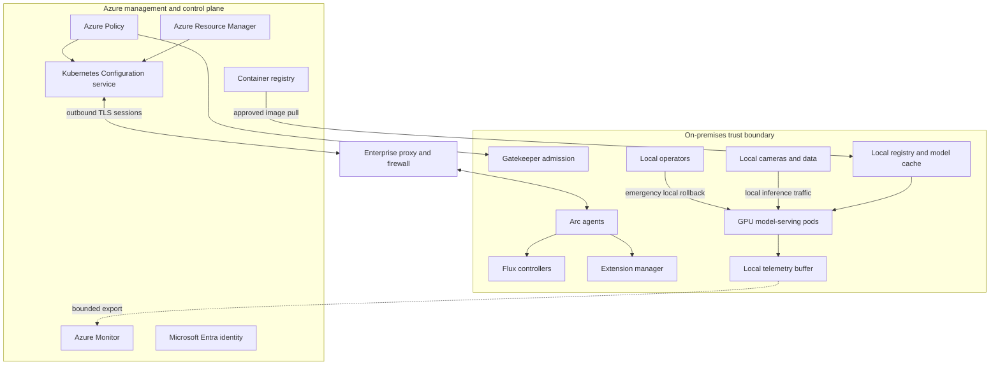
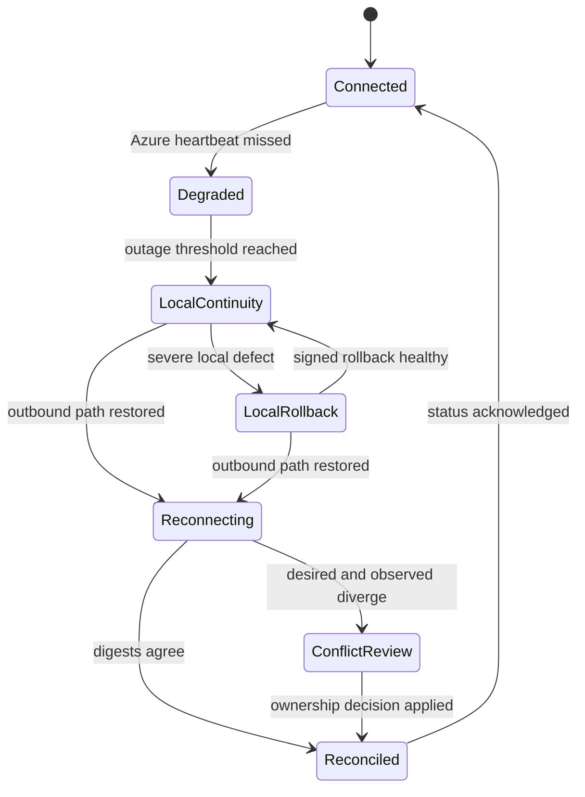

# Azure Arc and hybrid AI

Hybrid AI places computation near data or equipment while retaining central governance. The design succeeds only when local runtime authority and remote management authority remain explicit.

Azure Arc projects an existing Kubernetes cluster into Azure Resource Manager. It does not move that cluster, its data, or its inference traffic into Azure ([Microsoft Learn](https://learn.microsoft.com/azure/azure-arc/kubernetes/overview)).

## Learning objectives

- Separate local workload and data planes from Azure management and control planes.
- Explain outbound agent connectivity, desired state, reported state, and eventual reconciliation.
- Trace Kubernetes admission, GitOps pull reconciliation, extensions, and Azure Policy.
- Design local AI operation during wide-area network loss.
- Interpret the current 48-hour timeout boundaries correctly.
- Secure bootstrap, identity, Git credentials, images, egress, and break-glass access.
- Calculate local capacity, agent overhead, buffering, and recovery time.
- Compare Arc with plain Kubernetes, IoT Edge, direct configuration, and fully managed Azure.

## The costly failure

A factory sends camera frames to a cloud endpoint because its architecture diagram labels Azure as the control plane. A wide-area network outage then stops defect detection on the assembly line.

The design confused management traffic with inference traffic. Model serving and camera data never needed to leave the plant, but no local data-plane boundary was defined.

A second team assumes Arc means disconnected management. It schedules a Flux configuration and extension update during a four-day outage, then expects every queued request to apply on reconnection.

The requests time out, status in Azure becomes stale, and operators cannot tell whether Git, Azure, or the cluster is authoritative. A rushed local edit restores service but Flux later reverses it.

The expensive outcome is not merely downtime. It is loss of state ownership: several controllers believe they own the same resource, while no audit can explain the active model.

## Controlling invariant

Local inference continues from the last committed compatible state during wide-area network loss, while Azure-originated mutations wait and reconcile safely after connectivity returns.

This invariant requires local model artifacts, runtime dependencies, policy, state, and recovery procedures. Arc connectivity cannot be a hidden runtime dependency of each inference request.

## Additional invariants

Inference data remains on the declared local path unless an explicit policy authorizes egress.

Every desired state is versioned and immutable by digest.

Every cluster reports the observed digest when connectivity permits.

Only one controller owns each Kubernetes field.

GitOps changes are pull-reconciled by in-cluster controllers.

Admission policy applies locally after it is installed.

Local queues are bounded and survive expected outages.

Break-glass changes are time-bound, audited, and reconciled deliberately.

Reconnection never promotes a model merely because it is newer.

## Measurable requirements

- Local inference availability is 99.95 percent excluding declared plant shutdowns.
- Inference p95 remains below 120 milliseconds without Azure connectivity.
- The cluster retains 72 hours of required images, models, configuration, and telemetry buffer.
- Desired-state convergence completes within 20 minutes after ordinary reconnection.
- Every running AI pod reports a release manifest digest locally.
- Zero raw frames or regulated documents cross the WAN without explicit authorization.
- Policy admission p99 adds less than 100 milliseconds under planned load.
- Break-glass activation alerts central and local security within 5 minutes when connectivity exists.
- Emergency rollback finishes within 10 minutes without Azure.
- Reconnection backlog cannot exceed local storage or overwhelm Azure ingestion.

## Vocabulary

The **workload plane** contains application pods, services, jobs, and local dependencies. It performs the business computation.

The **data plane** carries inference inputs, outputs, local retrieval, tool calls, and operational effects. It can remain entirely local.

The **management plane** contains Azure Resource Manager resources, role assignments, policy assignments, extension resources, and configuration APIs. It describes and governs resources.

The **control plane** computes and reconciles desired state. In this design, parts live in Azure and parts run as Kubernetes controllers inside the cluster.

**Desired state** states what should exist. **Reported state** states what an agent or controller observed.

**Reconciliation** repeatedly compares desired and observed state and acts to reduce the difference. It is eventual because networks, controllers, registries, and admission can delay convergence.

An **admission controller** evaluates Kubernetes API requests before objects are persisted. It can allow, deny, warn, or mutate according to configured policy.

An **extension** installs and manages software on a connected cluster through an Azure resource. Extension state in Azure and Helm or controller state in Kubernetes must be correlated.

**GitOps** stores desired Kubernetes state in version control and uses in-cluster controllers to pull and apply it. Git is the source of desired application state, while the Kubernetes API stores observed objects.

**Break glass** is emergency local authority used when normal control paths cannot restore service in time. It is not routine cluster administration.

## Current connectivity model

Arc agents run as pods in the cluster and establish secure outbound connections to Azure ([Microsoft Learn](https://learn.microsoft.com/azure/azure-arc/kubernetes/overview)). The cluster does not require unsolicited inbound management connections for ordinary Arc agent communication.

The public-cloud network requirements describe outbound HTTPS/TLS endpoints for Resource Manager, regional Kubernetes configuration, identity certificates, container images, and optional features ([Microsoft Learn](https://learn.microsoft.com/azure/azure-arc/kubernetes/network-requirements)). Cluster Connect additionally requires its documented service endpoints and outbound WebSocket support.

As of September 2025, Azure Arc indirectly connected mode is retired ([Microsoft Learn](https://learn.microsoft.com/azure/azure-arc/overview)). A design that depends on periodic manual export/import as an Arc connectivity mode is therefore stale.

Directly connected does not mean continuously available. It means the supported management model expects the agents to connect; workload design must still define what happens during temporary loss.

## Architecture



The bold conceptual boundary is the site. Azure carries desired state and status, while local cameras, documents, retrieval, and inference remain inside the local data plane.


Credits: Hazem Ali

The figure shows the essential asymmetry: local agents initiate management connectivity, but local inference does not traverse that path. During an outage, already committed local resources continue while new Azure mutations and reports wait.

## Scenario one: factory vision

A factory has eight GPU nodes processing 60 camera streams. Frames enter a local message bus, preprocessing pods create tensors, and model-serving pods return defect classes to a programmable logic controller.

The control response must arrive within 120 milliseconds. Sending frames through Azure would add network dependence, consume bandwidth, and violate the local continuity objective.

Arc provides inventory and a management projection. Flux pulls approved deployment manifests, Azure Policy governs pod configuration, and Azure Monitor receives filtered metrics when the WAN is available.

The local registry caches the current and previous signed images and models. The inference deployment mounts only a manifest whose digest passed representative hardware tests.

When the WAN fails, camera ingress, queueing, inference, local alerts, and the programmable logic controller continue. Azure status becomes stale, central dashboards stop receiving fresh telemetry, and no new Azure-originated extension or configuration change can reach the cluster.

Local operators can roll back from model B to model A using a signed emergency bundle. They record the operation in a local append-only audit queue for later synchronization.

## Scenario two: regulated branch retrieval

A regulated branch runs a retrieval-augmented assistant over documents that must remain on site. The local data plane includes document storage, parsing, embeddings, search, inference, and authorization.

Azure stores neither raw documents nor prompts. It governs release manifests, image policy, extension configuration, fleet inventory, and privacy-filtered health signals.

Each branch reports model, prompt, index, and policy digests. Central operators can see drift without reading document content.

During disconnection, employees continue querying the last approved graph. Requests for a new prompt or index binding wait because the branch cannot prove receipt or readiness to Azure.

After reconnection, the branch does not jump to every intermediate version. It resolves the current approved desired state, validates compatibility and signatures, then reconciles once.

## Request path

1. A camera or user sends a request to a local ingress service.
2. Local identity and authorization establish tenant, device, or operator authority.
3. The service reads the active local release manifest.
4. Retrieval or preprocessing accesses local data stores.
5. A local GPU or CPU pod runs inference.
6. Local policy filters the output and tool authority.
7. The response returns over the site network.
8. Safe metrics enter a bounded local buffer.
9. Export sends permitted aggregates when Azure Monitor is reachable.

No Arc hop appears between steps one and seven. Arc governs what is deployed, while Kubernetes and local services execute the request.

## Desired and reported state

Azure Resource Manager stores a connected-cluster resource and child resources such as extensions and Flux configurations. These are management representations, not copies of all Kubernetes objects.

Agents poll or maintain outbound communication to fetch configuration and push status. The cluster's Kubernetes API remains authoritative for actual objects currently running.

Reported state is evidence, not instant truth. During a partition, Azure can show the last report even as local pods restart or an emergency rollback occurs.

Every status contract therefore includes `observed_at`, `desired_digest`, `observed_digest`, `connectivity`, `health`, and `last_error`. Consumers display staleness explicitly.

```json
{
  "cluster": "factory-east-07",
  "observed_at": "2026-08-12T16:05:22Z",
  "connectivity": "connected",
  "desired_digest": "sha256:aaa",
  "observed_digest": "sha256:aaa",
  "inference_health": "ready",
  "telemetry_backlog_bytes": 188743680,
  "last_error": null
}
```

## GitOps pull reconciliation

Flux controllers run in the cluster and pull from Git, Helm repositories, buckets, or Azure Blob sources. Source, Kustomize, Helm, and notification controllers have distinct responsibilities ([Microsoft Learn](https://learn.microsoft.com/azure/azure-arc/kubernetes/conceptual-gitops-flux2)).

Azure's Flux configuration agent watches Azure configuration resources, creates corresponding custom resources in the cluster, and reports status back. The Flux source controller then needs network reachability to the configured source.

Azure connectivity and source connectivity are separate failure domains. The cluster can reach Azure but fail to reach private Git, or reach a local Git mirror while Azure is unavailable.

```yaml
apiVersion: source.toolkit.fluxcd.io/v1
kind: GitRepository
metadata:
  name: ai-platform
  namespace: ai-platform
spec:
  interval: 5m
  url: ssh://git@git.branch.local/ai/platform.git
  ref:
    branch: production
  secretRef:
    name: git-readonly
---
apiVersion: kustomize.toolkit.fluxcd.io/v1
kind: Kustomization
metadata:
  name: model-serving
  namespace: ai-platform
spec:
  interval: 5m
  path: ./clusters/factory-east-07
  prune: true
  wait: true
  timeout: 10m
  sourceRef:
    kind: GitRepository
    name: ai-platform
  healthChecks:
    - apiVersion: apps/v1
      kind: Deployment
      name: vision-serving
      namespace: inference
```

The source is a local protected mirror so normal WAN loss does not prevent Flux from maintaining current state. Updating that mirror is itself a governed replication process.

`prune: true` makes removed desired resources candidates for deletion. Break-glass resources must use an explicit ownership and suspension procedure or Flux can remove them on the next reconciliation.

## Helm release

```yaml
apiVersion: helm.toolkit.fluxcd.io/v2
kind: HelmRelease
metadata:
  name: vision-serving
  namespace: ai-platform
spec:
  interval: 10m
  targetNamespace: inference
  chart:
    spec:
      chart: vision-serving
      version: 4.3.1
      sourceRef:
        kind: HelmRepository
        name: local-approved-charts
        namespace: ai-platform
  install:
    remediation:
      retries: 2
  upgrade:
    remediation:
      retries: 2
      remediateLastFailure: true
  values:
    image:
      repository: registry.branch.local/vision-serving
      digest: sha256:0123456789abcdef
    releaseManifest: vision/2026.08.12.3
    replicas: 4
```

The chart and image are pinned rather than addressed by `latest`. The local registry allows restart and rollback without depending on WAN pulls.

## Model deployment manifest

```yaml
apiVersion: apps/v1
kind: Deployment
metadata:
  name: vision-serving
  namespace: inference
  labels:
    app: vision-serving
    ai.release: "2026.08.12.3"
spec:
  replicas: 4
  selector:
    matchLabels:
      app: vision-serving
  template:
    metadata:
      labels:
        app: vision-serving
        ai.release: "2026.08.12.3"
    spec:
      serviceAccountName: vision-runtime
      nodeSelector:
        accelerator: gpu-a10
      containers:
        - name: server
          image: registry.branch.local/vision-serving@sha256:0123456789abcdef
          args: ["--manifest", "/models/release.json"]
          resources:
            requests: {cpu: "2", memory: 8Gi, nvidia.com/gpu: "1"}
            limits: {cpu: "4", memory: 12Gi, nvidia.com/gpu: "1"}
          readinessProbe:
            httpGet: {path: /ready, port: 8080}
          volumeMounts:
            - {name: models, mountPath: /models, readOnly: true}
      volumes:
        - name: models
          persistentVolumeClaim: {claimName: approved-model-slot-a}
```

Readiness verifies model digest, runtime compatibility, GPU availability, and local dependency health. Kubernetes pod readiness does not by itself prove model quality, so the release graph carries separate evidence.

## Extensions

Arc cluster extensions install Azure-related capabilities through extension resources and in-cluster managers. Current documentation distinguishes stable or preview release trains, optional version pinning, and automatic minor upgrades ([Microsoft Learn](https://learn.microsoft.com/azure/azure-arc/kubernetes/extensions)).

```bash
az connectedk8s connect \
  --name factory-east-07 \
  --resource-group hybrid-ai-prod \
  --proxy-http https://proxy.branch.local:8443

az k8s-extension create \
  --cluster-type connectedClusters \
  --cluster-name factory-east-07 \
  --resource-group hybrid-ai-prod \
  --name azurepolicy \
  --extension-type Microsoft.PolicyInsights \
  --release-train Stable
```

Onboarding requires substantial local privilege because agents and cluster-scoped resources are installed. Microsoft troubleshooting guidance identifies `cluster-admin` as required when the supplied kubeconfig lacks sufficient permissions ([Microsoft Learn](https://learn.microsoft.com/azure/azure-arc/kubernetes/troubleshooting)).

That bootstrap credential should be short-lived, independently approved, and removed after installation. Day-two agents receive only the permissions their controllers require.

## The 48-hour caveat

If Arc agents cannot reach Azure for more than 48 hours, creating an extension can fail and require the extension create operation to be run again ([Microsoft Learn](https://learn.microsoft.com/azure/azure-arc/kubernetes/extensions)). This statement concerns the queued management operation, not the survival of unrelated application pods.

For Flux configurations, Azure-originated changes wait for agent connectivity; after more than 48 hours the request times out and must be reapplied. Sensitive configuration inputs are retained by the service for less than 48 hours ([Microsoft Learn](https://learn.microsoft.com/azure/azure-arc/kubernetes/conceptual-gitops-flux2)).

Do not translate this into "the cluster stops after 48 hours." Existing Kubernetes workloads and already-installed local controllers have their own dependencies and continue according to local state and resources.

Local Flux may continue reconciling a reachable source already configured in the cluster. A new Azure Flux configuration cannot arrive until Azure connectivity returns and may need reapplication after timeout.

## Azure Policy and admission

The Azure Policy extension fetches assignments, creates Gatekeeper constraint templates and constraints, evaluates admission, and reports compliance to Azure ([Microsoft Learn](https://learn.microsoft.com/azure/governance/policy/concepts/policy-for-kubernetes)).

Once policy artifacts exist locally, Gatekeeper participates in Kubernetes admission locally. Reporting and new assignment delivery still depend on connectivity.

```yaml
apiVersion: constraints.gatekeeper.sh/v1beta1
kind: K8sAllowedRepos
metadata:
  name: approved-ai-registries
spec:
  enforcementAction: deny
  match:
    namespaces: ["inference"]
    kinds:
      - apiGroups: [""]
        kinds: ["Pod"]
  parameters:
    repos:
      - "registry.branch.local/"
```

The illustrative constraint blocks unapproved image repositories. Signature and digest admission should be a separate verified control, because repository allowlisting does not prove artifact integrity.

New deny policy should begin in audit where feasible. Existing noncompliant pods can continue until recreated, at which point admission may deny them ([Microsoft Learn](https://learn.microsoft.com/azure/governance/policy/concepts/policy-for-kubernetes)).

## Reconnection state machine



Connectivity recovery does not immediately enable mutation. The reconnection gate first refreshes identity, time, policy, desired state, source reachability, and backlog capacity.

If local break-glass state differs from central desired state, the controller pauses. An operator chooses whether to codify the local fix in Git, restore central desired state, or hold the cluster isolated.

## Reconnection runbook

1. Confirm DNS, TLS, proxy, time synchronization, and required outbound endpoints.
2. Check all Arc agent pods and certificates in the `azure-arc` namespace.
3. Record local active release, policy, extension, and Flux digests.
4. Export the local break-glass audit before reconciliation.
5. Read Azure desired state and identify requests older than 48 hours.
6. Reapply timed-out Flux or extension requests only after verifying current intent.
7. Resume configuration one controller at a time.
8. Compare desired and observed state before enabling pruning.
9. Rate-limit telemetry and status backlog export.
10. Verify inference health, then close the connectivity incident.

Microsoft troubleshooting guidance begins with agent pod health, network requirements, proxy configuration, image registry access, and certificate presence ([Microsoft Learn](https://learn.microsoft.com/azure/azure-arc/kubernetes/troubleshooting)). The runbook adds application-state protection around those platform checks.

## Security boundaries

The onboarding operator is highly privileged and can install agents across the cluster. Use a dedicated ceremony, temporary credentials, command review, and recorded cluster identity.

Arc's system-assigned identity authenticates the connected resource to Azure services. It does not replace Kubernetes service accounts for local workload authorization.

Git credentials should be read-only deploy keys or workload identities scoped to one source. Azure Flux configuration can create authentication secrets, including protected inputs, but secret rotation still needs the 48-hour connectivity constraint ([Microsoft Learn](https://learn.microsoft.com/azure/azure-arc/kubernetes/conceptual-gitops-flux2)).

Protected extension settings are not returned by GET operations, but operators must supply all protected settings when updating or omitted values are deleted ([Microsoft Learn](https://learn.microsoft.com/azure/azure-arc/kubernetes/extensions)). Treat update generation as a complete secret-set transaction.

Images and model bundles need digest pinning, signatures, provenance, and local admission verification. A private registry prevents anonymous public pull but does not prove the publisher.

The egress allowlist includes Arc, identity, approved registries, Git or Blob sources, monitoring, and time services needed by the selected features. Optional feature endpoints are opened only when that feature is enabled.

Local inference authorization remains local. A WAN outage must not turn an Azure token refresh failure into anonymous access.

Break-glass credentials belong in protected local custody with dual control, expiry, and use alerts. Their actions write to an append-only local log that later joins central audit.

## Availability math

Suppose WAN availability is 98 percent, while required local inference availability is 99.95 percent. A cloud-dependent request path cannot meet the target because $0.98 < 0.9995$ before considering any application failures.

Local service availability depends on power, cluster, registry/cache, storage, and application. If independent illustrative availabilities are 0.9999, 0.9998, 0.9999, and 0.9998, the series product is about 0.9994, below target.

Redundancy and repair must therefore reduce correlated failure and improve component availability. Multiplying optimistic independent numbers is not a substitute for site failure analysis.

## Buffer math

Assume safe telemetry is 2 KiB per request at 150 requests per second. The buffer grows at $2\times150=300$ KiB/s, about 25.3 GiB per day.

A 72-hour outage needs about 75.9 GiB before filesystem overhead and safety margin. Provisioning 120 GiB permits headroom, but a retention policy must drop or aggregate low-priority telemetry before filling the disk.

At reconnection, exporting 76 GiB over a reserved 20 Mbit/s path takes at least $76\times8\times1024/20\approx31{,}130$ seconds, or 8.65 hours. Backlog export must coexist with current telemetry and management traffic.

## Resource overhead

Arc agents, Flux, policy, monitoring, registry, and telemetry buffers consume local resources even when inference is the business workload. Capacity planning reserves CPU, memory, storage, and pod slots for management components.

Azure Policy documentation estimates component resources based on pod and constraint scale, including higher CPU and memory as counts grow ([Microsoft Learn](https://learn.microsoft.com/azure/governance/policy/concepts/policy-for-kubernetes)). Measure the actual distribution and policy set on representative clusters.

If platform agents reserve 6 vCPU and 3 GiB, policy components reserve 10 vCPU and 3 GiB, and local observability reserves 8 vCPU and 12 GiB, management overhead is 24 vCPU and 18 GiB before inference.

On a four-node cluster with 32 vCPU and 128 GiB per node, CPU overhead is $24/(4\times32)=18.75$ percent. Losing one node raises pressure and may evict management or inference pods unless priorities and requests are designed.

## Cost reasoning

Arc-enabled Kubernetes itself is a management projection, while enabled Azure services such as Monitor or Defender have their own charges ([Microsoft Learn](https://learn.microsoft.com/azure/azure-arc/overview)). Current pricing must be checked for region, service, ingestion, retention, and connected distribution.

Flux pricing has distribution and vCPU-specific terms, including a documented free allowance for some Arc-connected Kubernetes use ([Microsoft Learn](https://learn.microsoft.com/azure/azure-arc/kubernetes/conceptual-gitops-flux2)). Treat pricing text as date-sensitive input rather than a permanent architecture invariant.

Local costs include GPU underutilization, registry storage, spare nodes, site operations, power, and replacement hardware. Avoided WAN transfer and cloud inference can offset them, but locality is usually selected first for latency, privacy, or continuity.

## Failure modes

A proxy can allow HTTPS but block required WebSockets for Cluster Connect. Ordinary Arc management may appear healthy while interactive cluster access fails.

DNS can resolve public endpoints incorrectly from the site. Validate the exact names and certificates from agent pods, not only an administrator laptop.

Git can be reachable while an image registry is not. Flux applies a deployment that then enters `ImagePullBackOff`, so source readiness is not workload readiness.

A model may be in the local cache but its runtime base image may not. Cache the complete compatible graph, not one large artifact.

Admission can deny a new pod during rescheduling while an old noncompliant pod had continued running. This turns a node failure into an unexpected policy outage.

Clock drift can invalidate certificates, signatures, tokens, and event ordering. Local time service is a production dependency.

Telemetry replay can saturate WAN and delay Arc recovery. Priority queues reserve bandwidth for identity, desired state, and health before bulk logs.

Two reconcilers can fight over replicas or image fields. Kubernetes managed fields and repository ownership rules prevent overlapping mutation.

## Control ownership in detail

### Resource Manager ownership

Azure Resource Manager owns the connected-cluster resource, Azure role assignments, policy assignments, extension resources, and Flux configuration resources. Deleting an Azure representation does not necessarily erase in-cluster software immediately when agents cannot connect.

This lag matters during incident response. An operator must inspect both Azure state and Kubernetes state before concluding that an extension or configuration no longer exists.

Resource locks and policy can protect Azure objects from casual deletion. They do not prevent a local cluster administrator from changing Kubernetes objects, which is why local privilege remains a separate trust boundary.

### Kubernetes API ownership

The Kubernetes API server owns persisted workload objects and mediates admission. Controllers observe those objects and update fields or status according to their reconciliation loops.

An Arc resource cannot make an unhealthy local API server healthy. Site operations still need etcd backup, certificate renewal, node recovery, and Kubernetes upgrade procedures.

Local inference should tolerate temporary API unavailability when existing pods and networking continue. It still needs recovery objectives for pod loss because replacement scheduling requires the control plane.

### Git ownership

Git owns the intended declarative application state at a reviewed revision. Branch protection, signed commits, review rules, and repository availability therefore become production controls.

Git does not own mutable runtime status. Writing replica readiness, queue depth, or generated credentials back into desired-state files creates noisy conflicts and can leak secrets.

The cluster records the applied source revision in Flux status. The AI release manifest records content digests, allowing operators to prove that a Git revision resolved to specific runtime bytes.

### Flux ownership

Flux owns fields described by its Kustomizations and Helm releases. Manual edits to those fields are temporary unless reconciliation is suspended or the desired source changes.

Suspension is an explicit state transition with owner, reason, expiry, and scope. Leaving reconciliation suspended after an emergency converts a controlled exception into unmanaged drift.

Dependencies between Kustomizations express ordering, such as namespace and policy before application, or storage before model serving. Readiness waits for dependency health instead of relying on timing.

### Extension ownership

The extension manager owns installation and lifecycle of extension software represented in Azure. Installing the same component independently with Helm creates overlapping ownership and unsupported upgrade paths.

Extension auto-upgrade can reduce patch lag but introduces a change stream outside the application repository. Regulated or latency-sensitive fleets may pin versions and schedule representative-cluster qualification.

Major extension versions require deliberate upgrades according to current extension guidance ([Microsoft Learn](https://learn.microsoft.com/azure/azure-arc/kubernetes/extensions)). The fleet records extension version beside workload health to expose correlation.

### Policy ownership

Azure Policy owns constraints and templates it installs through the extension. Manual edits can be overwritten during reconciliation and should not be used as a durable fix ([Microsoft Learn](https://learn.microsoft.com/azure/governance/policy/concepts/policy-for-kubernetes)).

Gatekeeper owns admission evaluation for installed constraints. If its webhook is unavailable, failure policy determines whether matching admission fails open or closed, so recovery behavior must be tested.

Policy exceptions belong in governed assignment parameters or exemptions where supported, not arbitrary labels added during an outage. The exception must preserve scope, owner, reason, and expiry.

## Outage phases

### Detection phase

One missed heartbeat does not prove a WAN outage. Agents, proxy, DNS, identity, and Azure service health can fail independently, so the local monitor classifies symptoms before escalating.

The site records the last successful Azure contact and last successful source, registry, and monitoring contact separately. A single `offline` flag would hide which control paths remain usable.

Central monitoring treats stale status as unknown rather than unhealthy or healthy. This prevents a disconnected but functioning factory from being shown as failed and a failed disconnected factory from being shown as green.

### Stabilization phase

After the outage threshold, operators freeze nonessential desired-state changes for the affected site. Continuing to enqueue changes creates ambiguity and may exceed the service's queued-operation lifetime.

Local systems reserve storage and bandwidth for inference, audit, and high-priority telemetry. Debug logs can be sampled or rotated before they consume model or queue capacity.

The site verifies that current and rollback artifacts are readable. Discovering corrupted local cache during an incident removes the intended independence from Azure.

### Continuity phase

Existing Flux controllers continue reconciling reachable configured sources. Operators avoid source changes that require unavailable external dependencies.

Autoscaling based on local metrics can continue if its metrics path is local. Scaling that depends on Azure-hosted metrics becomes unavailable and needs a conservative local fallback.

Certificate and token lifetimes can outlast or undercut the intended outage duration. Local identities should not require frequent Azure refresh for ordinary inference, while management identities fail closed when expired.

### Emergency phase

A local rollback is justified by inference harm, not merely by lost management connectivity. The operator selects a previously approved bundle and verifies its signature and hardware compatibility offline.

The rollback procedure suspends only the reconciler that would reverse the change. Broadly disabling Flux, admission, or audit removes unrelated protections and increases recovery work.

The local audit captures before and after digests, operator identities, reason, commands, and observed health. Sensitive command output is protected while hashes and timestamps remain broadly reviewable.

### Recovery phase

Network restoration begins a cautious recovery window. Time synchronization, certificate validity, DNS, proxy behavior, and endpoint reachability are verified before state mutation.

The site sends a small current-status record before bulk telemetry. Central operators need accurate active state before receiving hours of historical metrics.

Timed-out operations are not replayed blindly. Their original intent is compared with current desired state because a newer release or revoked extension may supersede them.

### Reconciliation phase

If no local exception occurred, the controller compares desired and observed digests and resumes normal reconciliation. Intermediate obsolete revisions need not be applied.

If break glass occurred, the conflict enters review. Codifying the local fix in Git makes it new desired state; rejecting it restores the centrally approved graph after local impact is understood.

Pruning resumes last because it can delete local emergency resources. A dry inventory identifies what would be removed before destructive convergence.

### Verification phase

Verification covers inference, admission, source synchronization, extension health, status reporting, and telemetry export. A green Arc resource alone does not prove the AI workload recovered.

Backlog replay is rate-limited and deduplicated by event ID. Current alerts receive priority over historical informational events.

The incident closes only after desired and observed digests agree or an approved exception remains. Connectivity without state agreement is partial recovery.

## Local artifact lifecycle

### Intake

A central release pipeline signs an AI graph and publishes images, models, prompts, policies, and index metadata. Site replication verifies signatures before admitting objects to the local registry and cache.

Replication writes to an inactive slot and records byte count, digest, source, and completion time. A partially copied model never becomes a runnable candidate.

The site can prefetch while the old release runs. Prefetch reduces rollout time and proves that egress and storage paths work before change approval.

### Qualification

Representative local hardware runs startup, latency, memory, thermal, and dependency checks. A graph approved centrally can still fail on one GPU driver or storage class.

Qualification evidence is attached to site and hardware cohort. Fleet promotion excludes cohorts lacking compatible evidence rather than assuming all Kubernetes nodes are equivalent.

The model server performs a local smoke test with synthetic inputs. Real camera frames or regulated documents are unnecessary for artifact integrity checks.

### Activation

Activation changes one local pointer from approved slot A to approved slot B through a Kubernetes deployment revision or volume binding. It does not copy large bytes during the critical switch.

Readiness keeps traffic on old replicas until new replicas load the complete graph. Service routing changes only after enough candidate capacity is healthy.

The active status reports both desired and loaded digest. A pod advertising the desired value before verifying loaded bytes would make drift invisible.

### Retention

The current release, previous release, and one emergency baseline remain local when storage permits. Retention policy accounts for shared layers so apparent image size does not equal incremental storage.

Garbage collection starts from active, rollback, legal-hold, and staged manifests. It removes only blobs outside every retained graph.

Periodic offline restore drills read the retained graph without registry egress. A cached artifact that has never been reloaded is an assumption, not a recovery capability.

## Fleet rollout

Clusters are grouped by hardware, Kubernetes distribution, region, network profile, and business consequence. A single global wave would correlate failures across unlike sites.

The first wave uses representative noncritical clusters, not only laboratory clusters with perfect connectivity. It tests the management path and local workload behavior together.

Each wave requires minimum observation time, request volume, and site count. Promotion pauses automatically when unavailable sites would make evidence unrepresentative.

Fleet state distinguishes pending, prefetched, qualified, active, held, failed, rolled back, disconnected, and unknown. Reducing these to compliant or noncompliant loses operational meaning.

Disconnected sites do not block unrelated fleet progress indefinitely, but they retain their previous approved graph. Their pending desired version and expiry policy remain visible.

When a site reconnects after several fleet waves, it targets the current approved version compatible with its cohort. Applying every missed intermediate version adds risk without value.

## Data classification path

Raw frames and documents are restricted local data. Derived embeddings can still reveal source information and remain restricted unless classification analysis proves otherwise.

Prompts and responses may contain regulated content. Local privacy filtering extracts operational metrics such as latency, token count, error code, and manifest digest before export.

Model weights can be confidential intellectual property. Local storage encryption, node access control, image policy, and audit protect them from site and workload threats.

Central inventory stores metadata needed for governance, including site, cohort, versions, health, and timestamps. It does not need raw inference payloads to prove release compliance.

## Disaster recovery

Cluster disaster recovery starts with infrastructure, Kubernetes state, local registry, release manifests, and protected data stores. Arc registration alone cannot recreate local data or hardware configuration.

Git reconstructs declarative resources, while backups restore stateful local indexes, queues, and audit. Recovery procedures state which state is authoritative and which can be regenerated.

A replacement cluster receives a new or deliberately restored identity according to policy. Reusing stale certificates or names can let two clusters report as one resource.

The recovered cluster first serves synthetic checks, then limited local traffic, then full production. Central compliance and monitoring are reattached after local safety is established.

## Observability

Local dashboards show inference availability, latency, queue depth, GPU health, active release, policy denies, Flux readiness, registry capacity, and telemetry backlog even without Azure.

Central observability adds fleet inventory, last contact, desired-observed digest, extension status, compliance, and summarized workload health. Every central panel displays observation age.

Arc agent health includes pod readiness, restarts, certificate expiry, proxy errors, and status age. Flux health includes source readiness, revision, Kustomization and HelmRelease readiness, reconciliation duration, and failure reason.

Audit links Azure Resource Manager mutations, Git commits, policy assignments, extension operations, Kubernetes admission, local break-glass actions, and AI release manifests.

## Alternatives

Plain Kubernetes plus upstream Flux offers local pull reconciliation without Azure projection. It can be preferable when Azure governance is unnecessary, but the organization must build fleet inventory, identity integration, policy reporting, and extension lifecycle itself.

Azure IoT Edge is oriented around device or gateway modules, IoT Hub management, and store-and-forward behavior. It can fit smaller device fleets better than a general Kubernetes platform.

Direct SSH and configuration scripts provide immediate control and minimal platform overhead. They scale poorly, expose powerful credentials, drift easily, and lack continuous reconciliation.

Fully managed Azure reduces site platform operations and provides cloud elasticity. It cannot satisfy a request path that must remain local through WAN loss or data-residency restrictions.

Arc is appropriate when Kubernetes already fits the workload and Azure-centered inventory, policy, GitOps, monitoring, or extension management adds value. It does not eliminate responsibility for the local cluster, hardware, storage, network, registry, and incident response.

## Review questions

- Which request bytes remain local?
- Which Azure services are runtime dependencies and which are management dependencies?
- What state continues without WAN connectivity?
- What becomes stale or unavailable?
- Which operations can time out after 48 hours?
- Can the site restart every required pod from local artifacts?
- Who owns each Kubernetes field?
- Can admission policy block recovery after node loss?
- How is local break glass reconciled with GitOps?
- Does central status display its age?
- Can backlog export starve management recovery?
- What current pricing and feature limitations apply?

## Hands-on exercise

Create a disposable Kubernetes cluster and connect it to a nonproduction Arc resource. Record the cluster-admin bootstrap, agent namespace, identity, and outbound endpoints used.

Install Flux through an Arc configuration and deploy a small signed or digest-pinned inference mock. Use a local Git and registry endpoint that remain reachable when simulated Azure egress is blocked.

Install the Azure Policy extension in audit mode, then test a repository allowlist. Move to deny only after proving system namespaces and recovery workloads remain deployable.

Implement the status JSON contract and local dashboard. Show desired and observed release digests, contact age, Flux revision, policy state, inference health, and backlog bytes.

Block Arc outbound connectivity while preserving the local source and registry. Demonstrate continued inference, local pod restart, bounded telemetry buffering, and stale central status.

Attempt a new Azure Flux or extension change during the simulated partition. Do not wait 48 hours; document the sourced timeout semantics and model the expected state transitions.

Perform a signed local rollback and append a local audit event. Restore connectivity, pause pruning, compare desired and observed state, and codify or reverse the emergency change deliberately.

Calculate management resource overhead, 72-hour buffer size, replay duration, duplicate artifact storage, and expected recovery time. Include measured and assumed units.

## Expected evidence

- A data-flow diagram proving local inference independence.
- Arc onboarding and extension commands with current source links.
- Flux source, Kustomization, HelmRelease, and model deployment manifests.
- Azure Policy audit and deny evidence.
- Outbound DNS, port, TLS, proxy, and WebSocket test results.
- Local cache inventory for current and previous release graphs.
- Outage evidence showing inference continues and central status ages.
- A local rollback record and reconnection conflict decision.
- Calculations for resources, storage, bandwidth, availability, and cost.
- A runbook distinguishing timed-out management requests from running workloads.

## Chapter summary

Arc extends Azure management and governance to Kubernetes clusters without moving their local data plane into Azure. Agents create outbound connections, while local controllers and workloads continue to use the Kubernetes API and site resources.

Desired state, reported state, and reconciliation are different things. During a partition, Azure state becomes stale and new Azure mutations wait; after the documented 48-hour boundary, some configuration or extension requests can require reapplication.

GitOps, extensions, and policy add controllers and resource cost. Security depends on controlled bootstrap, scoped identities, protected credentials, signed artifacts, admission, egress allowlists, and audited break glass.

The invariant is operationally testable: local inference continues from the last committed compatible graph, and reconnection reconciles safely instead of blindly overwriting local reality.