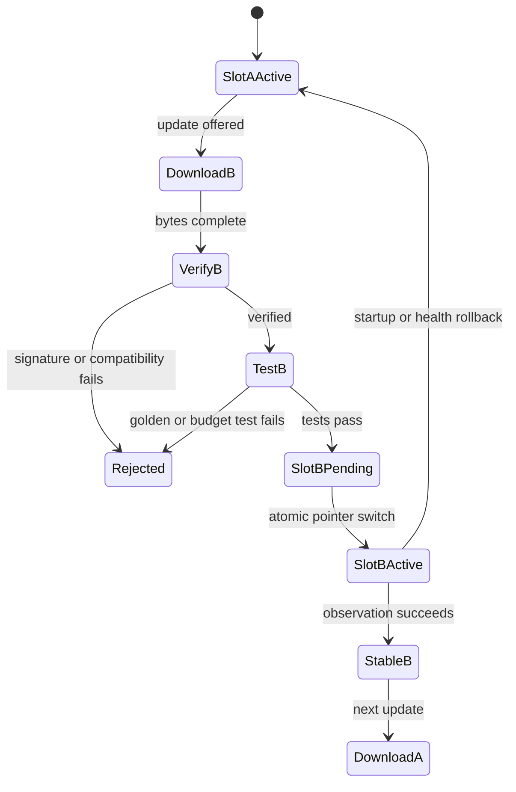

# Small language models at the edge

A small language model is small only relative to another model. On a device, a few billion parameters can dominate memory, storage, startup time, energy, and thermal budget.

Edge design begins with the device and task rather than a model leaderboard. The right system may combine a local model, deterministic rules, and an optional cloud model under explicit policy.

## Learning objectives

- Translate CPU, GPU, NPU, memory, flash, battery, thermal, and bandwidth limits into model budgets.
- Calculate parameter, key-value cache, activation, workspace, storage, and transfer requirements.
- Measure time to first token, tokens per second, latency, energy, and quality.
- Select and convert models for task, license, language, tokenizer, schema, safety, and operators.
- Explain quantization calibration and quality regression.
- Map ONNX models to execution providers and Windows ML with current caveats.
- Design offline queues, signed updates, A/B slots, fleet rollout, and rollback.
- Threat-model physical access, extraction, malicious updates, local prompt injection, and telemetry privacy.

## The costly failure

A field-service company chooses a 7-billion-parameter assistant because it performs well on a cloud GPU. The target tablet has 8 GiB shared memory, and the team counts only 4-bit weights.

At startup, runtime workspace and key-value cache push the process into memory pressure. The operating system kills it after the technician has waited forty seconds.

The fallback silently sends the maintenance manual and user question to a cloud model. The technician is offline at the actual repair site, and the unexpected data transfer violates customer policy when connectivity returns.

In a factory, another team updates a gateway summarizer by replacing one model file. The new tokenizer and hardware-compiled graph are incompatible, but the old runtime remains active.

Half the gateways crash; the remainder fall back to CPU and thermally throttle. A model update became an unversioned runtime change with no atomic rollback.

## Controlling invariant

The device executes only a signed, compatible model-runtime bundle that passed representative hardware tests and can atomically roll back offline.

The bundle includes model, tokenizer, prompt, policy, runtime, execution-provider requirements, compiled artifacts, configuration, and hashes. Compatibility is evaluated as a graph, not inferred from one filename.

## Additional invariants

Local inference remains functional without cloud connectivity.

Cloud fallback requires explicit policy, consent, and network eligibility.

Deterministic safety rules remain available if model inference fails.

The inactive update slot is fully verified before activation.

Startup self-test runs before user traffic.

Telemetry is minimized before leaving the device.

Queued data has bounded size and retention.

Every response records the local bundle version.

No update can erase the last known-good slot.

## Measurable requirements

- Cold startup p95 is below 8 seconds on every supported device cohort.
- Time to first token p95 is below 900 milliseconds for the field assistant.
- Sustained generation exceeds 12 tokens per second after a 20-minute thermal soak.
- Peak resident memory stays below 70 percent of available application memory.
- A typical query consumes less than 8 joules on battery devices.
- Bundle storage plus rollback uses less than 40 percent of writable flash.
- Offline queue growth cannot exhaust disk during a 7-day outage.
- Critical structured-output validity exceeds 99.5 percent.
- Signed update verification covers 100 percent of bundle files.
- Offline rollback completes within 30 seconds after failed self-test.

## Device vocabulary

A **central processing unit** (CPU) is the universal compute fallback. It offers broad operator support but may deliver lower throughput and energy efficiency for matrix-heavy inference.

A **graphics processing unit** (GPU) provides high parallel throughput. Discrete GPUs have dedicated video memory, while integrated GPUs often share system memory.

A **neural processing unit** (NPU) targets energy-efficient neural inference. Operator, shape, precision, compiler, and driver support determine whether a model actually runs there.

**RAM** is general system memory. **VRAM** is GPU-accessible memory, and on shared-memory systems the distinction is an allocation policy rather than separate physical capacity.

**Flash** or local persistent storage holds bundles, caches, queues, and logs. Write endurance and update amplification matter on embedded devices.

**Thermal throttling** reduces clock speed when heat exceeds limits. A fast one-minute benchmark can hide failure during a full shift.

**Time to first token** measures delay before generation begins. **Tokens per second** measures decode throughput after that point.

An **execution provider** connects ONNX Runtime to a hardware acceleration library. Providers claim supported graph nodes, and unsupported nodes can fall back according to provider order.

**Quantization** represents weights or activations with fewer bits. It reduces memory and often increases speed, but approximation and unsupported kernels can reduce quality or negate acceleration.

## Hardware-first architecture

```mermaid
flowchart LR
    T[Task and privacy requirements] --> S[Model selection]
    D[Device cohort inventory] --> S
    S --> B[Measured baseline]
    B --> O[Prune, distill, or quantize]
    O --> X[ONNX conversion]
    X --> C[Hardware-specific compile]
    C --> V[Representative-device validation]
    V --> M[Signed bundle manifest]
    M --> R[Staged fleet rollout]
    R --> A[A/B slots and startup self-test]
    A --> I[Local inference]
    I --> Q[Bounded offline queue]
    Q -.-> CL[Minimal cloud telemetry]
    I -->|failure| F[Deterministic rules]
    F -->|consent and connectivity| CM[Optional cloud model]
    R --> RB[Offline rollback]
```



The architecture delays optimization until after a measured baseline. Without baseline quality, memory, latency, energy, and heat, the team cannot know what conversion improved or broke.


Credits: Hazem Ali

The figure places the fallback hierarchy and budgets beside the release lifecycle. Edge operation is the combination of model behavior, device behavior, update behavior, and offline recovery.

## Scenario one: field technician

A technician repairs industrial equipment in locations with intermittent connectivity. The tablet stores approved manuals and work orders encrypted locally.

The assistant retrieves local passages, summarizes procedures, and emits a structured checklist. It cannot execute maintenance commands or invent safety tolerances.

The target cohort has an 8-core CPU, integrated GPU, optional NPU, 8 GiB shared RAM, 64 GiB free flash, and a 45 Wh battery. The application receives a 5.5 GiB memory budget after operating-system and foreground application reserve.

The model answers within an 8,000-token context because retrieved evidence and chat history are bounded. Long manuals are searched locally rather than inserted whole.

If the model fails, deterministic rules show retrieved passages and approved checklists. Cloud fallback is disabled for restricted customers and requires consent for others.

## Scenario two: factory gateway

An IoT Edge gateway receives anomaly events from local sensors and generates a short shift summary. Raw high-frequency telemetry remains on site.

The gateway has a discrete GPU, 16 GiB RAM, mains power, and constrained uplink. Energy is less restrictive than latency, storage, and thermal stability inside an enclosure.

IoT Edge packages the summarizer as a container module and routes local messages between modules. Azure IoT Edge modules execute locally, while the runtime manages lifecycle and communication ([Microsoft Learn](https://learn.microsoft.com/azure/iot-edge/about-iot-edge)).

During disconnection, events enter a bounded local store and summaries continue. On reconnection, only approved aggregates and health telemetry are forwarded.

## Parameter memory

For $N$ parameters stored at $b$ bits per parameter, ideal weight memory is

$$
M_{weights}=\frac{N\times b}{8}
$$

A 3.8-billion-parameter model at 16 bits needs $3.8\times10^9\times16/8=7.6$ GB in decimal units before metadata. At 4 bits, the ideal payload is 1.9 GB.

Real formats add scales, zero points, tensor alignment, metadata, and sometimes unquantized layers. File size and loaded resident size must be measured rather than assumed from the ideal equation.

If quantization groups 128 weights with one 16-bit scale and one 16-bit zero point, overhead is 32 bits per 128 weights, or 0.25 additional bits per weight. Effective storage becomes about 4.25 bits per weight before other metadata.

## Key-value cache

Autoregressive attention stores keys and values for prior tokens. A simplified cache estimate is

$$
M_{KV}=2\times L\times T\times H_{kv}\times D\times B\times S
$$

Here $L$ is layer count, $T$ context tokens, $H_{kv}$ key-value heads, $D$ head dimension, $B$ bytes per cache element, and $S$ concurrent sequences. The leading two represents keys and values.

For 32 layers, 8,192 tokens, 8 key-value heads, 128 dimensions, 2-byte cache values, and one sequence, cache is $2\times32\times8192\times8\times128\times2$, exactly 1 GiB.

Four concurrent sequences would require about 4 GiB for that cache alone. Grouped-query attention reduces key-value heads, but long context and concurrency can still dominate quantized weights.

## Runtime workspace

Activation and runtime workspace depend on graph, kernels, batch, sequence, provider, and compilation. Represent the measured peak as

$$
M_{peak}=M_{weights}+M_{KV}+M_{workspace}+M_{runtime}+M_{input}+M_{safety}
$$

Assume 2.1 GiB loaded weights, 1 GiB cache, 1.2 GiB provider workspace, 0.5 GiB runtime, 0.2 GiB inputs, and 0.8 GiB safety margin. Peak is 5.8 GiB, which exceeds the tablet's 5.5 GiB application budget.

Reducing context to 6,144 tokens makes cache about 0.75 GiB and peak about 5.55 GiB, still too close. A smaller workspace, model, or safety target is required.

## Storage and transfer

The device needs active and rollback bundles plus temporary download space. If each compressed bundle is 3.4 GiB and extraction needs 4.2 GiB, a safe update can require $3.4+3.4+4.2=11$ GiB before logs and queues.

Downloading 3.4 GiB over an effective 8 Mbit/s link takes at least $3.4\times8\times1024/8\approx3482$ seconds, or 58 minutes. Staging must tolerate interruption and resume by verified chunk.

For 50,000 devices, full rollout transfers about 166 TiB from distribution infrastructure before retries and caching. Cohort scheduling and local content caches can change both cost and completion time.

## Latency and throughput

End-to-end latency separates retrieval, prompt processing, first-token generation, decode, safety checks, and rendering. A single average hides the stage that violates experience.

For 300 generated tokens at 15 tokens/s, decode takes 20 seconds. If the use case needs a 5-second answer, output limits or task design must change; faster startup alone cannot meet it.

Streaming can improve perceived responsiveness but not total energy or completion time. Structured short answers often fit edge constraints better than open-ended prose.

## Energy and thermal budget

Energy per query is power integrated over time. A device drawing 18 W for 12 seconds consumes $18\times12=216$ joules, or 0.06 Wh.

A 45 Wh battery would support at most 750 such queries if inference were the only load. Screen, radios, storage, operating system, and battery reserve reduce the real count substantially.

Thermal soak runs representative workloads for the expected duty cycle. Record skin or enclosure temperature, clock, power, latency, token rate, and throttling events over time.

## Model selection

Task fit comes before parameter count. A smaller model tuned for extraction can beat a larger general model on schema validity, latency, and energy.

Language coverage must be measured on field vocabulary, abbreviations, code switching, and optical-character-recognition errors. Generic multilingual claims do not prove domain performance.

License terms govern redistribution, modification, acceptable use, attribution, and commercial operation. The release manifest stores the reviewed license identity and source.

Context length must fit both task and memory. Retrieval reduces prompt size only when the local index can find authoritative evidence reliably.

Tokenizer compatibility affects model input IDs, stop conditions, memory estimates, and streaming. Model and tokenizer are one compatibility edge.

Structured output needs a versioned JSON Schema and repair policy. Repeated free-form retries can consume more energy than constrained decoding or deterministic validation.

Safety design combines model behavior, input filtering, output validation, local authorization, and deterministic boundaries. A language model is not authority to operate machinery.

Operator support matters. A model that converts to ONNX but falls back mostly to CPU can miss the device budget despite producing correct output.

## Quantization

Post-training quantization maps trained values into lower precision without full retraining. Calibration selects representative ranges for weights or activations where the format requires them.

Calibration data should represent device inputs, languages, prompt lengths, and outliers without containing prohibited production data. Poor calibration can clip rare but important activations.

Weight-only quantization reduces model storage and bandwidth. Activation quantization can accelerate kernels but may be more sensitive to distribution and operator support.

Quality regression must be measured by slice: correctness, schema validity, refusal, hallucination, retrieval use, and long-context behavior. A stable average can hide damage to rare safety prompts.

Quantization-aware training simulates lower precision during training and can recover quality. It adds pipeline complexity and does not guarantee a target provider has efficient kernels.

## Distillation and pruning

Distillation trains a smaller student from teacher outputs or representations. It can specialize the student but transfers teacher errors and requires governed data generation.

Pruning removes parameters, channels, or structures. Unstructured sparsity saves storage only when runtime kernels exploit it; otherwise zeros still consume compute.

Neither technique replaces evaluation. They create new model artifacts with new failure surfaces, licenses, provenance, and calibration needs.

## ONNX conversion

ONNX expresses a computation graph and tensors through standardized operators. Conversion preserves semantics only if exporter, opset, dynamic shapes, tokenizer path, and custom operations are compatible.

Windows ML is the Windows-supported ONNX Runtime distribution and can run ONNX models through CPU, GPU, and NPU execution providers ([Microsoft Learn](https://learn.microsoft.com/windows/ai/new-windows-ml/overview)). Hardware-specific NPU and GPU providers have current operating-system and device requirements that must be checked.

Windows ML documentation requires models compatible with the ONNX Runtime version in the selected Windows ML version ([Microsoft Learn](https://learn.microsoft.com/windows/ai/new-windows-ml/models)). Conversion success does not prove provider coverage or performance.

## Execution providers

ONNX Runtime asks providers which nodes or subgraphs they support and assigns execution accordingly. Provider order defines preference, while unsupported nodes can fall back to later providers ([ONNX Runtime](https://onnxruntime.ai/docs/execution-providers/)).

A model may cross device boundaries between accelerated and CPU nodes. Tensor copies and synchronization can erase accelerator gains, so profiling must report provider assignment per node.

```python
import onnxruntime as ort

available = ort.get_available_providers()
preferred = [
    name for name in (
        "QNNExecutionProvider",
        "DmlExecutionProvider",
        "CUDAExecutionProvider",
        "CPUExecutionProvider",
    )
    if name in available
]

session = ort.InferenceSession(
    "bundle/model.onnx",
    providers=preferred,
)
print({"available": available, "active": session.get_providers()})
```

The exact provider names and packages vary by platform and build. The bundle manifest names tested provider, version, driver, operating system, architecture, and compiled-context requirements.

## Windows technology mapping

Windows AI APIs provide ready-to-use local capabilities, mostly for supported Copilot+ PC scenarios. Foundry Local offers ready-to-use local language and speech models, while Windows ML supports custom ONNX models ([Microsoft Learn](https://learn.microsoft.com/windows/ai/overview)).

Foundry Local model availability and performance vary by hardware. It is a managed local-model path, not a promise that every model runs on every device.

Windows ML can use a system-shared or self-contained runtime and dynamically acquire supported execution providers ([Microsoft Learn](https://learn.microsoft.com/windows/ai/new-windows-ml/overview)). Fleet governance must decide whether evergreen runtime updates are acceptable or runtime versions must remain pinned with the bundle.

For a regulated fleet, provider and runtime updates receive representative testing before broad activation. Convenience of dynamic acquisition does not override compatibility evidence.

## Capability probe

```text
probe_device():
  read OS version, architecture, runtime, drivers
  enumerate CPU features, GPU adapters, and NPU providers
  measure available RAM, accelerator memory, flash, battery, and thermal state
  compare values with signed bundle compatibility constraints
  select the highest-priority fully qualified provider
  load inactive slot and run deterministic golden vectors
  measure peak memory, first-token time, and provider assignment
  return QUALIFIED only if every mandatory check passes
```

The probe chooses from evidence, not marketing device names. Two units sold under one family can have different RAM, accelerators, drivers, and thermal envelopes.

## Bundle manifest

```json
{
  "bundle": "field-assistant/2026.08.12.2",
  "files": {
    "model.onnx": "sha256:111...",
    "tokenizer.json": "sha256:222...",
    "prompt.json": "sha256:333...",
    "policy.json": "sha256:444..."
  },
  "compatibility": {
    "architectures": ["x64", "arm64"],
    "min_ram_bytes": 8589934592,
    "min_free_storage_bytes": 12884901888,
    "runtime": "onnxruntime/1.x-tested",
    "providers": ["QNN", "DirectML", "CPU"],
    "max_context_tokens": 6144
  },
  "budgets": {
    "peak_memory_bytes": 5368709120,
    "ttft_p95_ms": 900,
    "tokens_per_second_min": 12,
    "energy_joules_p95": 8
  },
  "rollback": "field-assistant/2026.08.01.5",
  "signature": "jws:eyJ..."
}
```

The illustrative runtime string must be replaced by an exact tested version or allowed set. Broad `1.x` compatibility is usually too weak for a production manifest.

## A/B update lifecycle



Download resumes into the inactive slot and verifies chunks. Activation changes a small durable boot or application pointer, then startup self-test confirms the new slot before declaring success.

Power loss during download leaves the active slot untouched. Power loss during pointer update requires an atomic filesystem or bootloader mechanism whose recovery behavior is tested.

## Device Update mapping

Device Update for IoT Hub supports package-based and image-based updates, fleet grouping, staged deployment, and A/B rollback patterns ([Microsoft Learn](https://learn.microsoft.com/azure/iot-hub-device-update/understand-device-update)). Suitability depends on the operating system, agent integration, and chosen update handler.

Its service generates a signed update manifest containing file hashes, and the agent validates signature and downloaded hashes before installer handoff ([Microsoft Learn](https://learn.microsoft.com/azure/iot-hub-device-update/device-update-security)). The application still must validate model-runtime compatibility and post-install behavior.

Device root keys and agent code are high-value assets. Microsoft guidance describes protecting roots with hardware or code-integrity mechanisms and maintaining root-key rotation support ([Microsoft Learn](https://learn.microsoft.com/azure/iot-hub-device-update/device-update-security)).

## IoT Edge deployment

```json
{
  "modulesContent": {
    "$edgeAgent": {
      "properties.desired": {
        "modules": {
          "summarizer": {
            "type": "docker",
            "settings": {
              "image": "registry.local/summarizer@sha256:abc..."
            },
            "env": {
              "BUNDLE_SLOT": {"value": "/models/slot-b"},
              "MAX_QUEUE_BYTES": {"value": "10737418240"}
            }
          }
        }
      }
    },
    "$edgeHub": {
      "properties.desired": {
        "routes": {
          "anomalies": "FROM /messages/modules/sensor/* INTO BrokeredEndpoint('/modules/summarizer/inputs/events')",
          "summaries": "FROM /messages/modules/summarizer/* INTO $upstream"
        },
        "storeAndForwardConfiguration": {
          "timeToLiveSecs": 604800
        }
      }
    }
  }
}
```

IoT Edge offline operation stores upstream messages locally, authenticates modules through edgeHub, and resynchronizes after reconnection ([Microsoft Learn](https://learn.microsoft.com/azure/iot-edge/offline-capabilities)). Time to live and available disk bound actual retention.

The current documentation identifies IoT Edge 1.6 LTS as supported and states older lifecycle dates ([Microsoft Learn](https://learn.microsoft.com/azure/iot-edge/offline-capabilities)). Re-check support before selecting a fleet baseline.

## Offline queue math

Assume 20 anomaly summaries per minute at 3 KiB each. Daily growth is $20\times60\times24\times3\text{ KiB}\approx84.4$ MiB.

Seven days need about 591 MiB before metadata and filesystem overhead. A 2 GiB quota provides margin, while raw sensor retention would require a separate calculation.

Queue policy prioritizes safety and audit events over routine metrics. When full, it aggregates or drops declared low-priority classes rather than corrupting the active model slot.

## Fallback hierarchy

The local SLM is primary when its bundle is qualified and the request fits policy. A deterministic validator checks authorization, requested action, schema, evidence, and safety limits.

If inference is unavailable, deterministic retrieval and rules present source passages or safe checklists. This fallback is less fluent but predictable and offline.

An optional cloud model is last. It requires eligible data classification, user or tenant consent, connectivity, cloud identity, cost budget, and a visible indication that processing location changed.

Cloud fallback never receives a queued restricted request later merely because connectivity returns. The decision is made for the request under its original consent and policy context.

## Security threats

A physical attacker can copy flash, inspect memory, replace binaries, or attach a debugger. Secure boot, measured boot, disk encryption, hardware-backed keys, code integrity, and locked debug interfaces reduce but do not erase risk.

Model extraction is still possible through filesystem or query access. Rate limits, local authorization, encryption at rest, process isolation, and legal controls protect different layers.

A malicious update is more dangerous than a malicious prompt because it can replace the policy and verifier. Root of trust must sit outside the replaceable bundle.

Local documents can contain prompt injection. Retrieval treats them as untrusted content, separates instructions from evidence, constrains tool authority, and cites the local source.

Local users need authorization independent of network availability. Cached credentials have bounded lifetime and scope, while emergency access is audited.

Telemetry can leak prompts, filenames, model outputs, or device identity. Export only needed aggregates and protected references after consent and classification checks.

## Fleet heterogeneity

| Cohort | Memory | Accelerator | Primary provider | Context | Rollout evidence |
| --- | ---: | --- | --- | ---: | --- |
| Field-A | 8 GiB shared | NPU | hardware NPU EP | 4,096 | battery and thermal |
| Field-B | 16 GiB shared | integrated GPU | DirectML | 6,144 | driver matrix |
| Factory-G | 16 GiB + 8 GiB VRAM | discrete GPU | CUDA/TensorRT | 8,192 | enclosure soak |
| Fallback-C | 8 GiB | CPU only | CPU | 2,048 | reduced model |

One bundle can contain provider-specific compiled artifacts, or the fleet can publish cohort bundles sharing one logical model. Either way, the manifest must prevent a compiled context from loading on incompatible hardware.

## Representative validation

Laboratory validation includes the oldest supported device, low free disk, low battery, thermal enclosure, driver versions, and interrupted update paths. Testing only the fastest developer workstation proves little.

Golden vectors verify deterministic tokenization and selected logits or outputs within tolerance. Task suites verify quality at the application level.

Memory is measured at cold start, prompt ingestion, maximum context, generation, concurrency, and rollback. Provider profiling confirms the intended accelerator executes the expensive graph portions.

Thermal soak follows real duty cycle, including idle and burst. A stable token rate after thirty minutes matters more than the first ten seconds.

## Observability and drift

Local metrics include bundle, provider, fallback nodes, startup, time to first token, token rate, peak memory, energy, temperature, throttle events, schema failures, queue depth, and rollback reason.

Fleet dashboards compare by hardware cohort and bundle. Aggregating unlike devices can make a regression on one NPU disappear under GPU performance.

Quality drift uses consented sampled cases or synthetic probes, not unrestricted prompt capture. Device telemetry reports enough lineage to reproduce the local graph without uploading private content.

## Failure and recovery

Unsupported operators can trigger CPU fallback and latency collapse. Qualification fails when mandatory provider coverage falls below threshold.

Disk exhaustion can corrupt download or queue state. Reserved partitions, quotas, and preflight checks protect both active and rollback slots.

Driver updates can change provider behavior without model change. Runtime, driver, and operating-system versions belong in telemetry and cohort gates.

Power loss can interrupt installation. A/B slots and atomic activation keep one bootable or runnable bundle.

Thermal throttling can appear hours after rollout. Fleet progression includes soak time before moving beyond early cohorts.

A bad prompt or policy can produce harmful output even when model bytes are valid. Rollback restores the complete bundle.

## End-to-end lifecycle walkthrough

### Frame the task

The field assistant first defines what a successful answer contains: cited steps, required warnings, bounded length, and a valid checklist schema. "Helpful answer" is too vague for optimization.

The team also defines prohibited authority. The model may summarize a lockout procedure but cannot decide that equipment is safe to energize.

The factory summarizer has a different loss function. Missing one critical anomaly is more costly than repetitive prose, so evaluation weights event coverage above style.

### Establish data authority

Local manuals and event records are authoritative inputs, while embeddings and generated summaries are derivatives. The lifecycle states when derived state can be discarded and rebuilt.

Document versions carry effective dates and equipment scope. Retrieval refuses to mix a manual for one machine revision with another simply because text is similar.

Synthetic and licensed evaluation data stays separate from private field content. Production telemetry contributes only through consented, curated, versioned processes.

### Inventory the fleet

The inventory reads actual hardware identifiers, memory, operating system, driver, runtime, battery health, free storage, and thermal sensors. Procurement model names are not precise enough.

Devices are grouped only when one tested bundle can meet the same compatibility and budget contract. Too many cohorts increase release cost, while overly broad cohorts hide incompatibility.

The oldest supported operating-system build often constrains runtime and provider choice. Supporting it is a measurable cost rather than a free compatibility promise.

### Set budgets

Memory budget subtracts operating system, foreground app, other services, graphics reservation, and safety margin from physical memory. It does not allocate every remaining byte to model weights.

Latency budget decomposes retrieval, prompt processing, prefill, first token, decode, validation, and rendering. Each stage receives a target and measured percentile.

Energy budget states queries per shift and battery reserve. Thermal budget states ambient temperature, enclosure, duty cycle, and acceptable throttling.

Storage budget includes two bundles, temporary download, local index, queue, logs, and update journal. Garbage collection cannot consume the rollback slot.

### Measure baseline

Baseline runs the unoptimized model on representative devices when feasible, or on a development accelerator while recording that device evidence is absent. This prevents simulated numbers becoming fleet claims.

The same fixed cases and prompt settings run across every candidate. Random seeds, sampling, tokenizer, context, and output limit belong in the result manifest.

Measurements include distributions, not only means. Cold-start p95 and memory peak reveal failures hidden by warm average throughput.

### Choose the optimization

If weights exceed storage and memory, weight quantization directly targets the bottleneck. If KV cache dominates, shorter context, fewer concurrent sequences, lower cache precision, or another architecture is more relevant.

If the model lacks task accuracy, further compression is premature. Distillation or task-specific fine-tuning may improve the quality-to-size ratio before deployment optimization.

If operator fallback dominates latency, changing model graph or provider can matter more than bit width. Profiling determines the next experiment.

### Calibrate quantization

Calibration samples cover short and long prompts, common and rare languages, structured output, retrieval context, and safety cases. A narrow calibration set optimizes only the easiest operating region.

Calibration records preprocessing and exact tensors. Reusing calibration artifacts after tokenizer or prompt-template change is unsafe unless compatibility is proven.

The team examines per-layer sensitivity where tooling permits. Keeping sensitive layers at higher precision can recover quality with modest memory cost.

### Validate conversion

Converted output is compared with source-framework output on golden vectors. Tolerances are selected from task behavior, not adjusted until tests pass.

Dynamic axes are tested at minimum, typical, and maximum lengths. A graph that works for one fixed sequence shape can fail on real prompts.

Tokenizer and postprocessing execute through the production path. Testing only the ONNX graph misses decoding and schema defects.

### Inspect provider partitioning

Provider logs or profiling show which graph nodes run on accelerator and which run on CPU. The team records expensive boundaries and copy operations.

An available provider is not an active provider. Session creation can reject options, compile slowly, or fall back while still returning correct output.

Compilation artifacts are keyed by model digest, provider, driver, architecture, and compiler. Reusing a context across incompatible versions can crash or produce incorrect output.

### Test thermal behavior

The device starts at controlled ambient temperature and runs the expected burst and idle pattern. Continuous maximum load is tested separately as a fault envelope.

Measurements align temperature, frequency, power, token rate, latency, and errors over time. A falling token rate correlated with frequency reduction identifies throttling.

The acceptable design may lower concurrency or output length before hardware throttles. Predictable bounded performance is more useful than a faster unstable peak.

### Build the bundle

The bundle compiler canonicalizes a manifest, calculates every file digest, records provenance, and signs the manifest. Files are immutable after signing.

Runtime code reads only files listed in the verified manifest. An extra unverified adapter or prompt file cannot override approved behavior.

Secrets remain outside the bundle and are resolved through device identity or protected local storage. A bundle can be replicated broadly without carrying fleet credentials.

### Stage the update

The downloader checks free space before starting and reserves the inactive slot. It uses chunk hashes or resumable transport so interruption does not restart a multi-gigabyte transfer.

After download, full-file hashes and manifest signature are verified before extraction. Extraction writes only inside the inactive slot.

Compatibility probe and golden tests run from the inactive slot with network disabled where possible. This proves local startup rather than accidental cloud fallback.

### Activate atomically

Activation writes a small pointer or boot variable through an atomic mechanism, then records pending status. The old slot remains intact.

On restart, a watchdog waits for self-test and health within a deadline. Missing acknowledgment reverts the pointer to the prior slot.

Application state migrations use forward-and-backward-compatible formats through the rollback window. Irreversible migration would make model rollback incomplete.

### Roll through the fleet

The first cohort includes real low-end and high-temperature devices, not only engineering samples. It receives enough requests and time to exercise memory and thermal budgets.

Rollout gates compare candidate with baseline within hardware cohort. A fleet-wide average cannot approve an NPU-specific regression.

Devices that are offline retain the old bundle and report pending status later. Update expiry prevents a long-disconnected device from installing an obsolete candidate on reconnection.

### Operate offline

Local identity, model, tokenizer, index, policy, and rules remain available. The application does not block waiting for cloud feature flags.

Queues separate must-deliver audit from best-effort analytics. Each class has byte quota, retention, and overflow behavior.

The user interface exposes when content is stale or cloud enrichment is unavailable. It does not imply that local inference is current beyond its bundle and knowledge timestamps.

### Reconnect safely

Current status and security commands synchronize before bulk telemetry. A revoked bundle can then stop serving before low-priority backlog export.

Queued events preserve original event time, bundle, consent, and classification. Reconnection does not grant permission to upload data that was restricted when created.

Backlog replay is throttled so current device operations and update checks retain bandwidth. Idempotency IDs prevent duplicate cloud ingestion.

### Investigate drift

Fleet drift begins with cohort composition and runtime versions. A driver rollout can move latency without any model update.

Synthetic local probes detect tokenizer, provider, and output regressions without capturing user prompts. Their stable inputs make cross-device comparison meaningful.

Quality incidents produce curated cases only after privacy and consent review. Raw thumbs-down events never become automatic fine-tuning data.

### Retire a bundle

Retirement first prevents new activation, then waits until rollback policy no longer references the bundle. Emergency baselines follow a longer retention rule.

Devices report deletion by digest when online. The fleet treats disconnected devices as unknown rather than assuming removal.

Cryptographic revocation can block a compromised bundle even if its ordinary retention period has not ended. Devices need a protected and available revocation path with defined offline behavior.

## Data flow and interfaces

The field request enters a local application process under an authenticated user. Retrieval returns document IDs, versions, classifications, and bounded passages rather than an unrestricted filesystem path.

The prompt builder separates system policy, user request, and untrusted retrieved text. The model receives no credentials and cannot open arbitrary local files.

The validator parses the structured answer, checks citations against retrieved IDs, enforces action policy, and either returns the answer or uses deterministic fallback.

The factory sensor module emits a versioned event schema. The summarizer consumes only validated fields and writes a summary plus the covered event IDs.

The IoT Edge route sends approved summaries upstream when available. Raw events remain local according to retention and incident policy.

## Local authorization

User authentication can use cached enterprise credentials, device-bound accounts, or local roles according to outage requirements. Cache lifetime balances continuity against revoked-user risk.

Authorization is checked before retrieval and again before any consequential tool. The model's generated claim about user role is never trusted.

Document-level access filters execute in local search using the authenticated principal's entitlements. Post-filtering generated answers is too late because unauthorized text already entered model context.

## Privacy accounting

The system classifies prompts, retrieved passages, responses, telemetry, and feedback separately. Derived text can remain as sensitive as its source.

Operational metrics use buckets and counters where exact content is unnecessary. Device identifiers can be pseudonymized with rotation while preserving fleet-cohort analysis.

Consent records state purpose and expiry. Consent for cloud fallback does not automatically permit training or human review.

## Reliability budgets

Startup reliability is measured across clean boot, low disk, low battery, unavailable accelerator, corrupted inactive slot, and stale compiled context. Each case has a deterministic fallback.

Inference reliability separates model error, runtime error, provider error, invalid output, and policy rejection. Combining them into one failure rate hides repair ownership.

Update reliability reports offered, downloaded, verified, qualified, activated, stable, rolled back, and unknown counts. A downloaded update is not a successful deployment.

## Alternatives

Deterministic rules use little memory and are easy to audit. They fail on language variability and open-ended summarization, so they remain a fallback or authority boundary.

A cloud LLM offers larger capacity and centralized updates. It adds network, privacy, latency, cost, regional, and outage dependencies.

A local SLM protects locality and offline function but moves lifecycle, security, capacity, and heterogeneity responsibility onto the fleet operator.

Hybrid routing can select among all three. It is useful only when policy makes processing location and authority explicit rather than silently changing behavior.

## Review questions

- What exact task justifies generative inference?
- What memory remains after operating-system reserve?
- How large is KV cache at maximum context and concurrency?
- Which nodes execute on the intended provider?
- What quality changed after quantization?
- Can every supported cohort load and sustain the bundle?
- What happens at thermal equilibrium?
- Can the device restart and roll back offline?
- Where is the update root of trust?
- What local files can inject instructions?
- What telemetry leaves the device?
- Under what policy can cloud fallback occur?

## Hands-on exercise

Choose a 2-to-4-billion-parameter open model with a license suitable for your exercise. Define a field-assistant task and a factory-summary task using synthetic content.

Inventory two representative devices. Record CPU, GPU, NPU, RAM, accelerator memory, flash, operating system, drivers, battery, and thermal envelope.

Measure a floating-point baseline for quality, schema validity, startup, memory, first token, token rate, energy, and temperature. State prompt and output lengths.

Export or obtain a compatible ONNX model, then test at least two quantization choices. Profile provider assignment and identify fallback nodes.

Calculate weight, KV-cache, workspace, storage, transfer, battery, and offline queue budgets. Compare equations with measured peak values.

Create a signed bundle manifest and A/B directory layout. Inject digest mismatch, incompatible provider, low disk, power interruption, self-test failure, and thermal regression.

Build the fallback hierarchy with deterministic retrieval and a disabled-by-default cloud route. Demonstrate consent and classification checks before cloud use.

Create an IoT Edge-style deployment or equivalent local container configuration with persistent store-and-forward. Demonstrate offline operation and bounded replay.

Roll out to two synthetic cohorts, fail one cohort, and prove the other can continue. Record rollback evidence and minimal telemetry.

## Expected evidence

- Device cohort inventory and supported matrix.
- Model, tokenizer, license, task, and safety rationale.
- Baseline and quantized quality by slice.
- Weight, cache, workspace, storage, bandwidth, energy, and thermal calculations.
- ONNX conversion and execution-provider profile.
- Signed bundle, compatibility constraints, and verifier output.
- A/B activation and offline rollback state transitions.
- Store-and-forward limits and disk-pressure behavior.
- Physical, update, extraction, injection, identity, and privacy threat controls.
- Fleet rollout, soak, failure, rollback, and drift evidence.

## Chapter summary

An edge SLM is a device system, not a compressed cloud model. Weight memory is only one term beside cache, workspace, runtime, storage, energy, and heat.

Selection follows task, language, license, schema, safety, and operator support. Conversion and quantization create new artifacts whose quality and provider coverage require representative validation.

Windows ML maps custom ONNX models to CPU, GPU, and NPU providers, while Foundry Local and Windows AI APIs offer different managed local paths with device-specific support. IoT Edge and Device Update can contribute offline runtime and update mechanisms, but application compatibility remains the release owner's responsibility.

The invariant makes fleet operation defensible: every device executes a signed compatible bundle, retains a known-good slot, and can roll back without the cloud.