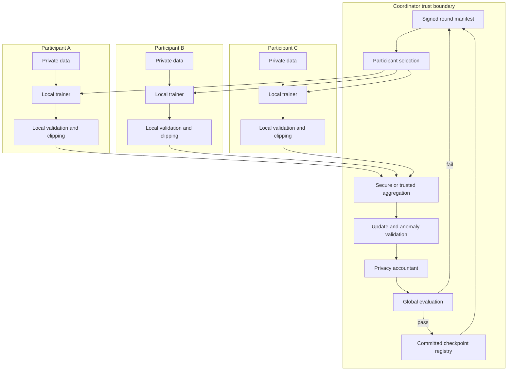
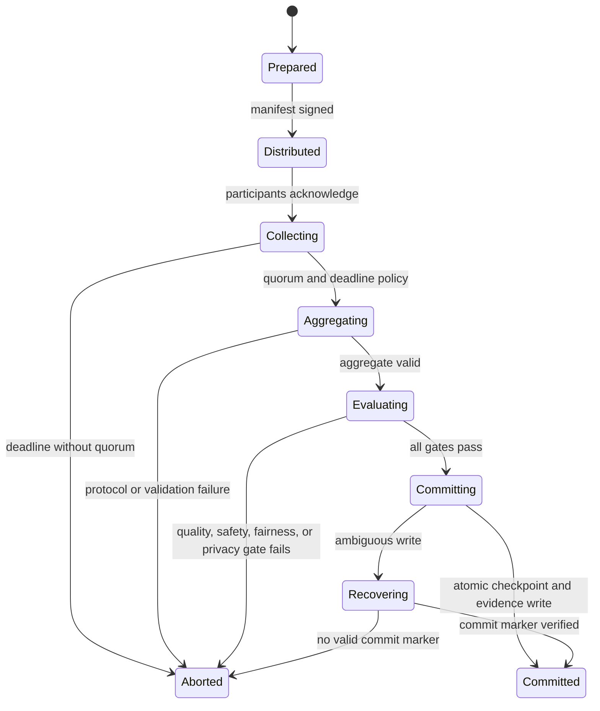

# Federated learning

Federated learning trains a shared model from updates computed where data resides. It changes the movement of training information, but it does not make the system private or trustworthy by definition.

The design problem spans optimization, distributed protocols, identity, privacy, security, networking, governance, and failure recovery. A weighted average is only one line inside that system.

## Learning objectives

- Distinguish centralized, distributed data-parallel, split, and federated learning.
- Compare horizontal and vertical federation and cross-device and cross-silo operation.
- Trace a complete round from signed manifest to committed checkpoint.
- Derive and calculate Federated Averaging with unequal sample counts.
- Handle non-independent data, partial participation, stragglers, dropout, stale updates, and replay.
- Explain update leakage, secure aggregation, differential privacy, poisoning, Sybil, and trusted execution.
- Design participant identity, network isolation, audit, and model-release boundaries.
- Map Azure Machine Learning jobs and components without overstating native federated capability.
- Calculate bandwidth, time, quorum availability, memory, storage, and cost.

## The costly failure

Four hospitals agree to train a diagnostic model without centralizing records. The coordinator accepts any signed update from a registered hospital and averages by reported sample count.

One participant accidentally replays an update from the prior round. Another reports every local encounter, including duplicates, and a compromised participant scales its update to implant a backdoor.

The average completes and global accuracy improves. A rare-device slice fails, but the aggregate dashboard hides it.

Investigators later discover that raw records never left the hospitals, yet individual updates leaked membership information and the coordinator stored them indefinitely. The privacy claim was false and the checkpoint lineage cannot be reconstructed.

The expensive failure combines safety, privacy, and governance. Data locality was treated as a complete security property when it was only one architectural constraint.

## Controlling invariant

Only authenticated, round-bound, validated updates meeting quorum and policy influence a committed global checkpoint; no raw participant records enter coordinator storage.

The invariant does not claim that updates are harmless. Secure aggregation, differential privacy, retention, access control, and evaluation address additional leakage and integrity risks.

## Additional invariants

Every round pins one global checkpoint and one signed round manifest.

Each participant contributes at most one accepted update per round.

Stale and future round IDs are rejected.

Raw participant records remain inside the participant boundary.

Sample counts follow an agreed counting policy.

Aggregation is deterministic for a fixed accepted update set.

Quorum and deadlines are declared before selection.

Failed safety or privacy checks abort checkpoint commit.

Every committed checkpoint names its accepted contribution set and evaluation evidence.

## Measurable requirements

- One hundred percent of accepted updates authenticate participant, round, manifest, and nonce.
- Zero raw records appear in coordinator storage, logs, traces, or support bundles.
- At least four of five selected cross-silo participants must contribute before the deadline.
- Update validation finishes within 10 minutes of receipt.
- Round completion p95 remains below 6 hours for the hospital scenario.
- Global and every critical local slice must satisfy predeclared noninferiority gates.
- Privacy accounting halts training before the approved budget is exceeded.
- Replay and stale-update tests reject 100 percent of injected cases.
- A failed round leaves the prior committed checkpoint authoritative.
- Audit reconstructs each committed checkpoint from signed evidence.

## Training architectures

**Centralized training** copies raw training data into one environment. It simplifies optimization and global analysis but concentrates data-access and residency risk.

**Distributed data-parallel training** copies one model across tightly coordinated workers, partitions a centrally governed dataset, and synchronizes gradients frequently. Azure Machine Learning describes workers synchronizing model changes at batch boundaries in this pattern ([Microsoft Learn](https://learn.microsoft.com/azure/machine-learning/concept-distributed-training)).

**Model-parallel training** partitions model computation across workers because one model does not fit or compute efficiently on one worker. It does not imply data-owner separation.

**Split learning** divides a model at a cut layer. Participants send intermediate activations and receive gradients, which changes leakage and communication but requires online coordination for each training step.

**Federated learning** sends a checkpoint or model state to participants, performs local training, and aggregates participant updates over rounds. Participants can have different data distributions, compute, and availability.

Federated learning is not ordinary Azure ML distributed training. The latter manages a coordinated job and process group, while federation requires participant selection, round protocol, update exchange, privacy, and adversarial controls across ownership boundaries.

## Federation types

**Horizontal federation** has participants with similar feature schemas but different entities. Hospitals with the same clinical fields and different patients are a cross-silo example.

**Vertical federation** has overlapping entities but different features. It requires privacy-preserving entity alignment and a different training protocol; ordinary Federated Averaging does not solve it.

**Cross-silo federation** has a small number of relatively stable organizations. Strong identity, contracts, reliable compute, and human governance are practical.

**Cross-device federation** has many intermittently available devices. Selection, dropout, limited bandwidth, battery, and secure aggregation at large scale dominate design.

## Architecture



Raw data terminates inside each participant boundary. Updates cross the boundary through authenticated, encrypted, round-specific interfaces and are not assumed to be private merely because they are gradients or deltas.


Credits: Hazem Ali

The figure separates ordinary data parallelism from federation and shows that quorum, secure aggregation, anomaly checks, privacy accounting, and global evaluation are distinct gates.

## Scenario one: hospitals

Five hospitals train a risk model from local records under a common feature and label contract. Each hospital controls its own storage, trainer, validation, and audit.

The coordinator distributes a signed global checkpoint and round manifest. It never receives patient rows, identifiers, feature tables, or local evaluation examples.

Each hospital trains for two local epochs, clips its update, validates schema and finite values, signs a round-bound envelope, and uploads over a private authenticated channel.

Four hospitals form quorum. If only three arrive by the deadline, the round aborts and the previous checkpoint remains current.

Global evaluation uses an approved coordinator dataset, while each hospital evaluates local protected slices and returns signed aggregate metrics with minimum-count suppression.

The new checkpoint commits only if global quality, all mandatory local gates, privacy budget, and contribution policy pass. Deployment is a later release decision, not an automatic result of training.

## Scenario two: mobile devices

A mobile keyboard selects a small random subset of eligible devices each round. Eligibility includes charging state, unmetered network, idle state, current app version, and consent.

Devices train on locally generated examples under retention and minimization policy. Many selected devices never finish because users disconnect or resume activity.

Secure aggregation hides individual updates from the server while allowing an aggregate after sufficient survivors. The protocol must handle dropout without revealing masks or accepting too few participants.

The cross-device design uses shorter deadlines, aggressive compression, large selection pools, and cohort-aware evaluation. It cannot reuse hospital identity and availability assumptions unchanged.

## Round manifest

```json
{
  "protocol": "federated-round/1",
  "round_id": "risk-model/0042",
  "base_checkpoint": "sha256:111...",
  "model_schema": "sha256:222...",
  "optimizer": {"name": "sgd", "learning_rate": 0.01},
  "local_epochs": 2,
  "selection": {
    "eligible": ["hospital-a", "hospital-b", "hospital-c", "hospital-d", "hospital-e"],
    "selected": ["hospital-a", "hospital-b", "hospital-c", "hospital-d", "hospital-e"]
  },
  "deadline": "2026-08-12T22:00:00Z",
  "quorum": 4,
  "clip_norm": 2.0,
  "aggregation": "weighted-fedavg-v1",
  "secure_aggregation": "protocol-profile/3",
  "privacy_policy": "rdp-accountant/8",
  "validation_policy": "update-policy/12",
  "nonce": "b64:...",
  "coordinator_signature": "jws:..."
}
```

The manifest prevents a participant from choosing optimizer, epochs, clipping, base checkpoint, or deadline independently. A participant signs the manifest digest with its update.

## Full round

1. The coordinator reads the last committed checkpoint.
2. It creates and signs a unique round manifest.
3. Eligibility policy selects participants before outcomes are known.
4. Participants authenticate and verify coordinator signature.
5. Each participant verifies base checkpoint and model schema hashes.
6. Local training reads only approved local data.
7. The trainer computes a delta from the pinned base.
8. Local validation checks finite values, shape, norm, metrics, and policy.
9. The participant clips, protects, and signs the update envelope.
10. The coordinator rejects duplicate, stale, malformed, or unauthorized envelopes.
11. Secure or trusted aggregation begins after quorum and deadline policy permit.
12. Aggregate validation, privacy accounting, and evaluation run.
13. A new checkpoint commits atomically or the round aborts.
14. Participants and auditors receive the signed round result.

Every transition has an idempotency key. Repeating `submit update` for one participant and round returns the existing receipt rather than counting twice.

## Federated Averaging

Let selected successful participants be $S_t$. Participant $k$ has $n_k$ eligible local examples and produces parameters $w_{t+1}^{(k)}$ after local training from global $w_t$.

$$
w_{t+1}=\sum_{k\in S_t}\frac{n_k}{\sum_{j\in S_t}n_j}w_{t+1}^{(k)}
$$

The equivalent update form averages deltas $\Delta_k=w_{t+1}^{(k)}-w_t$. Federated Averaging was introduced as iterative model averaging over decentralized, often unbalanced and non-independent data ([McMahan et al.](https://proceedings.mlr.press/v54/mcmahan17a.html)).

Suppose hospitals contribute 100, 300, and 600 eligible examples. Their scalar candidate parameter values are 1.2, 1.5, and 1.1.

The weighted result is $(100\times1.2+300\times1.5+600\times1.1)/1000=1.23$. An unweighted mean would be about 1.267 and answer a different policy question.

Sample weighting approximates pooled empirical risk only when counts and objective definitions are comparable. Capping weights may improve fairness or robustness but changes the objective and must be explicit.

## Local trainer

```python
def train_local(model, loader, round_spec, device):
    model.load_state_dict(verify_checkpoint(round_spec.base_checkpoint))
    before = clone_parameters(model)
    optimizer = make_optimizer(model, round_spec.optimizer)
    eligible_count = 0

    for _ in range(round_spec.local_epochs):
        for features, labels in loader:
            optimizer.zero_grad()
            loss = model.loss(features.to(device), labels.to(device))
            loss.backward()
            optimizer.step()
            eligible_count += len(labels)

    delta = subtract_parameters(model, before)
    assert finite_and_expected_shape(delta, round_spec.model_schema)
    clipped = clip_l2(delta, round_spec.clip_norm)
    return clipped, eligible_count
```

The example omits production privacy and secure-aggregation encoding for clarity. Counting policy must avoid repeated epochs multiplying `eligible_count`; in real code the count is the unique eligible dataset size, not batches processed.

## Participant API

```http
POST /v1/rounds/risk-model%2F0042/updates HTTP/1.1
Authorization: Bearer <participant-bound-token>
Content-Type: application/octet-stream
Idempotency-Key: risk-model/0042:hospital-a
X-Round-Manifest-Digest: sha256:abc...
X-Participant-Signature: jws:...

<encrypted or secure-aggregation update envelope>
```

The token authenticates transport authority, while the participant signature binds content to round and participant. The idempotency key prevents retry duplication.

The response returns accepted, duplicate, rejected-stale, rejected-policy, or pending-secure-aggregation. It never reveals other participants' individual updates.

## Coordinator pseudocode

```text
start_round(previous_checkpoint, policy):
  manifest = sign(pin_inputs(previous_checkpoint, policy))
  selected = select_eligible_participants(manifest)
  publish(manifest, selected)
  until deadline:
    envelope = receive_update()
    authenticate_participant(envelope)
    reject_wrong_round_nonce_or_manifest(envelope)
    idempotently_store_receipt(envelope)
    validate_shape_finite_norm_and_signature(envelope)
  if accepted_count < quorum: abort("quorum")
  aggregate = secure_or_trusted_aggregate(accepted_updates)
  validate_aggregate(aggregate)
  privacy_accountant.consume(manifest, accepted_count)
  candidate = apply(previous_checkpoint, aggregate)
  evidence = evaluate_global_and_local_slices(candidate)
  if not gates_pass(evidence): abort("evaluation")
  atomically_commit(candidate, manifest, evidence)
```

The coordinator stores receipts and aggregate evidence according to retention policy. With secure aggregation it should not obtain individual plaintext updates in the first place.

## Non-independent data

Federated data is often non-independent and non-identically distributed, or non-IID. One hospital sees older patients, one device uses another language, and participation itself depends on connectivity and power.

Multiple local epochs reduce communication but move local models toward different local optima. More local work can therefore increase client drift and destabilize global convergence.

Measure update norm, direction similarity, loss before and after local training, and local-global evaluation gaps. These diagnostics do not justify reading raw participant data.

Techniques such as proximal objectives, control variates, server momentum, personalization, and clustered federation address different forms of heterogeneity. Each changes optimization assumptions and requires evaluation.

## Partial participation and stragglers

Waiting for every participant makes one unavailable silo stop the federation. A deadline and quorum trade completeness against availability and representation.

Fast participants can dominate if selection repeatedly favors availability. Track selection, acceptance, and contribution rates by cohort and impose coverage policy.

Late updates are rejected for the closed round. Applying them to the next checkpoint would mix deltas computed from different bases.

Cross-device systems can overselect because many devices drop. Secure aggregation survivor thresholds and privacy assumptions must match the expected dropout distribution.

## Stale and replay handling

An update envelope includes round ID, manifest digest, base checkpoint digest, participant ID, nonce, sequence, and signature. Any mismatch is terminal.

The coordinator keeps an accepted-key index for `(round, participant)`. Retries return the existing receipt and conflicting second payloads trigger investigation.

Round nonces prevent a captured signed update from being replayed into a new round with the same base checkpoint. Expiry and channel binding narrow replay windows further.

## Compression

Quantization, sparsification, low-rank updates, sketching, and periodic participation reduce bytes. They can introduce bias, information leakage changes, and incompatibility with secure aggregation.

Error feedback can accumulate compression residuals locally across rounds. It creates participant state that must be versioned and erased under withdrawal or reset policy.

Compression is evaluated on convergence per transmitted byte, not only one-round size. A 10-fold smaller update that needs 20-fold more rounds loses.

## Updates can leak

Gradients and parameter deltas can reveal features, labels, membership, or examples under attack. Data staying local does not imply that transmitted updates are anonymous.

Transport encryption protects updates in transit but exposes them to endpoints. Access control and retention reduce exposure but do not change information content.

Secure aggregation hides each participant update from the coordinator and reveals an aggregate under its threat model. It does not prevent a malicious participant from submitting a harmful update.

## Secure aggregation

Practical secure aggregation protocols combine masked updates so masks cancel only in the aggregate and can tolerate participant dropout under declared thresholds. The Bonawitz protocol provides a concrete failure-robust design and reports communication expansion for evaluated vector sizes ([Bonawitz et al.](https://research.google/pubs/practical-secure-aggregation-for-privacy-preserving-machine-learning/)).

The protocol needs participant key agreement, commitments or shares, dropout recovery, survivor threshold, transcript validation, and authenticated channels. Calling one encrypted upload "secure aggregation" omits the multi-party property.

Cross-silo deployments may instead use a trusted aggregator under contractual and technical controls. That is a different threat model and should be named plainly.

## Differential privacy

Differential privacy bounds how much one individual's inclusion can change output distribution under a defined neighboring-dataset relation. It is a property of a randomized mechanism and accountant, not of adding arbitrary noise.

Participant-side clipping bounds sensitivity. Noise calibrated to clipping, sampling, mechanism, and target privacy parameters is added at participant or aggregate level according to the threat model.

For local update $u_k$ and clip norm $C$,

$$
\bar{u}_k=u_k\min\left(1,\frac{C}{\lVert u_k\rVert_2}\right)
$$

A Gaussian mechanism adds noise related to $C$ and noise multiplier $\sigma$. Repeated rounds compose privacy loss, so an accountant tracks cumulative $(\varepsilon,\delta)$ or a compatible intermediate representation.

Smaller epsilon generally indicates a stronger bound under the same definition, but epsilon is meaningless without adjacency, sampling, delta, accounting method, and unit of protection. Hospital-level and patient-level privacy are different.

The system stops or changes policy before budget exhaustion. It never computes privacy loss after training and then decides whether the number looks acceptable.

## Poisoning, backdoors, and Sybil attacks

A participant can scale, shape, or target an update to degrade global behavior or implant a backdoor. Valid signature proves origin, not honesty.

A Sybil attacker creates or controls many participant identities to gain aggregate influence. Strong enrollment, per-organization identity, hardware or organizational attestation, and contribution caps reduce this risk.

Update validation checks schema, finite values, norm, claimed count, training attestation where used, and consistency with policy. Statistical anomaly checks compare direction, norm, and effect on held-out probes.

Coordinate median, trimmed mean, Krum-like selection, clipping, and robust statistics tolerate specific Byzantine assumptions. Non-IID honest updates can resemble attacks, and high-dimensional backdoors can evade simple distance checks.

Robust aggregation is therefore not a universal defense. Combine identity, eligibility, secure software, clipping, anomaly analysis, validation, global and local evaluation, rate limits, and rollback.

## Trusted execution

A trusted execution environment (TEE) can isolate aggregation code and keys from parts of the host and produce attestation evidence. It changes whom participants must trust but does not repair flawed aggregation code or malicious inputs.

Azure Confidential AI documentation describes confidential federated learning patterns where an aggregator runs in a TEE and participants may attest local training processes ([Microsoft Learn](https://learn.microsoft.com/azure/confidential-computing/confidential-ai)). Actual hardware, region, preview, attestation, and GPU support must be verified for the deployment date.

Attestation policy pins measurement, signer, configuration, and allowed debug state. Key release occurs only after evidence passes and remains bound to that enclave instance or policy.

## Evaluation and fairness

Global evaluation measures the intended aggregate population. Local evaluation reveals participant-specific regressions that pooled data would hide.

Each silo reports metrics with sample counts and uncertainty under a signed evaluation contract. Small cells are suppressed or combined according to privacy policy.

Fairness analysis compares clinically or operationally meaningful slices across silos without exporting raw rows. Metric aggregation must account for denominator and cannot average percentages blindly.

Stopping criteria include global validation plateau, local noninferiority, fairness bounds, privacy budget, round budget, and no improvement per communication cost. Any hard safety gate can stop earlier.

Rollback selects a prior committed checkpoint and matching inference release. Training rollback does not erase privacy already spent or information already disclosed.

## Capacity math

Assume a dense update has 100 million parameters at 16 bits. One update is $100{,}000{,}000\times2=200$ MB decimal.

Five hospitals upload 1 GB per round before protocol overhead. On a 100 Mbit/s effective uplink, one 200 MB upload takes at least $200\times8/100=16$ seconds.

With 1.8-times secure-aggregation and transport overhead as an illustrative assumption, each participant sends 360 MB and needs at least 28.8 seconds. Actual protocol stages, latency, and retries add time.

For 10,000 mobile participants at a compressed 4 MB each, ingress is about 39.1 GiB per round. Coordinator network and temporary storage must handle peak concurrency rather than only total bytes.

## Quorum probability

Suppose five selected hospitals independently succeed with probability 0.9 and quorum is four. Round success probability is

$$
P(X\ge4)=\binom{5}{4}(0.9)^4(0.1)+(0.9)^5\approx0.91854
$$

Independence is optimistic when hospitals share network, software, or coordinator dependencies. Correlated outages reduce actual availability.

Raising quorum to five lowers success to $0.9^5\approx0.59049$. Lowering quorum improves availability but changes representation, privacy threshold, and attack tolerance.

## Aggregator memory and storage

Naively holding five 200 MB updates plus model, aggregate, and validation copies can exceed 2 GB. Framework overhead and higher precision can multiply that number.

Streaming aggregation reduces memory but limits anomaly checks requiring the full set. Secure aggregation has its own transcript and mask-recovery state.

If a 400 MB checkpoint is retained for 200 rounds, raw checkpoint storage is about 78.1 GiB before replicas and evidence. Delta checkpoints save space but complicate independent recovery.

At an illustrative $0.02 per GiB-month, 78.1 GiB costs about $1.56 monthly for one copy; security, transaction, egress, and replication costs are separate. Compute and communication usually dominate this simple checkpoint figure.

## Failure state machine



The checkpoint becomes authoritative only with an atomic commit marker referencing manifest and evidence. Temporary artifacts from aborted rounds cannot be selected for inference.

## Azure Machine Learning mapping

Azure ML components can package self-contained steps with versioned interfaces, code, command, and environment, then compose them into pipelines ([Microsoft Learn](https://learn.microsoft.com/azure/machine-learning/how-to-create-component-pipeline-python)). These capabilities can orchestrate coordinator-side preparation, evaluation, and checkpoint publication.

Azure ML distributed jobs launch tightly coordinated PyTorch or TensorFlow workers and set process-group variables for ordinary distributed training ([Microsoft Learn](https://learn.microsoft.com/azure/machine-learning/how-to-train-distributed-gpu)). That mechanism is not a cross-owner federated protocol.

Azure Machine Learning can orchestrate jobs and components, but federated participant protocol, aggregation, secure aggregation, privacy accounting, poisoning defenses, and silo-local execution remain application or selected-framework responsibilities unless a current official product source explicitly provides them.

## Azure component boundary

```yaml
$schema: https://azuremlschemas.azureedge.net/latest/commandComponent.schema.json
type: command
name: federated_round_coordinator
version: 1.0.0
inputs:
  round_manifest:
    type: uri_file
  prior_checkpoint:
    type: custom_model
outputs:
  candidate_checkpoint:
    type: custom_model
  round_evidence:
    type: uri_folder
code: ./coordinator
environment: azureml:federated-coordinator-env:7
command: >-
  python run_round.py
  --manifest ${{inputs.round_manifest}}
  --checkpoint ${{inputs.prior_checkpoint}}
  --candidate ${{outputs.candidate_checkpoint}}
  --evidence ${{outputs.round_evidence}}
```

The component is an orchestration wrapper. Its code must implement or call the actual federation protocol and must not mount participant raw data.

## Identity and network design

Every silo receives a distinct participant identity, certificate, allowed round scope, and revocation path. Transport identity maps to the contractual participant registry.

The coordinator uses managed identity for Azure storage, registry, Key Vault, and job resources. Azure ML documents managed identities for workspace and compute access and the minimum data and registry roles ([Microsoft Learn](https://learn.microsoft.com/azure/machine-learning/how-to-identity-based-service-authentication)).

Participant storage is not registered as a coordinator datastore. Local trainer access remains under the silo's identity and network boundary.

Coordinator compute can run without public IP in an Azure virtual network with private endpoints and required outbound paths. Azure ML networking requires explicit subnet capacity, DNS, storage, registry, Key Vault, and service connectivity ([Microsoft Learn](https://learn.microsoft.com/azure/machine-learning/how-to-secure-training-vnet)).

Silo egress allows only coordinator, identity, time, revocation, and approved artifact endpoints. The coordinator cannot initiate broad inbound access to participant records.

## Audit lineage

Round audit records manifest, selection policy, eligible and selected IDs, acknowledgments, receipts, rejections, quorum, secure-aggregation transcript digest, privacy-accountant state, aggregate digest, evaluation, and commit marker.

Participant audit records local data version, counting policy, trainer image, code, environment, base checkpoint, local metrics, clipping result, update digest, signature, and receipt. It excludes raw rows.

The two audit streams meet at participant, round, manifest, and update-envelope digest. Neither party needs the other's private details to prove protocol transitions.

## Failure and recovery

A participant can disappear after mask exchange but before update completion. The secure-aggregation protocol handles dropout only within its declared threshold.

The coordinator can crash after receiving quorum. Durable idempotent receipts and round state let a replacement resume or abort without counting submissions twice.

An ambiguous checkpoint write is resolved through a commit marker and digest. Never infer commit from the presence of a large model file.

Privacy-accountant state commits atomically with checkpoint state. A crash cannot produce a model without recording its consumed privacy budget.

Participant withdrawal affects future eligibility and retention according to policy. It cannot generally remove learned influence from an already committed model without an approved unlearning or retraining process.

## Protocol walkthrough

### Define the federation contract

The hospitals first agree on feature meaning, units, missing-value handling, label maturity, exclusions, and model output. Matching column names without matching semantics would create silent training error.

The contract also defines the privacy unit. Protecting one encounter, one patient, and one hospital requires different clipping, sampling, and accounting.

Each institution documents lawful purpose, local retention, permitted model use, withdrawal, incident handling, and checkpoint ownership. Cryptography cannot substitute for this governance layer.

### Enroll participants

Enrollment binds an organizational identity to signing keys, network endpoints, approved trainer measurements, and contractual status. The coordinator maintains validity intervals and revocation state.

Key rotation overlaps old and new keys for a bounded period. An update identifies the exact key version, preventing ambiguity during audit.

One legal participant can operate several trainers, but contribution policy prevents those workers from becoming several voting identities. Worker parallelism stays inside the silo boundary.

### Determine eligibility

Eligibility checks software version, data-contract version, checkpoint access, privacy status, recent health, and required local evaluation capability. It is evaluated before participant results are visible.

Cross-device eligibility also checks power, network, idle state, storage, consent, and application version. These conditions make participation nonrandom and must be considered in evaluation.

The coordinator records eligible and selected sets. Recording only successful contributors hides dropout and selection bias.

### Count examples

The counting contract states whether one patient, encounter, sequence, or event contributes weight. It also defines deduplication and maximum contribution per privacy unit.

Local epochs do not multiply the aggregation weight. A hospital training twice over 300 unique eligible records still reports 300, not 600.

Counts can leak participant size and influence weighting. Secure aggregation can include protected weighted sums, or policy can use capped or uniform weights with an explicit objective tradeoff.

### Distribute the round

Participants fetch the manifest and checkpoint through authenticated channels, then verify signatures and hashes before local load. A transport success is not checkpoint authenticity.

The participant refuses a manifest whose feature contract, trainer version, privacy policy, or deadline it cannot satisfy. Silent local substitution would make aggregated updates incomparable.

Acknowledgment states readiness but does not count toward update quorum. Selection, acknowledgment, secure-aggregation setup, and accepted update are separate states.

### Train locally

The trainer opens only the approved local data version under a silo identity. Coordinator credentials have no path to that store.

Preprocessing, sampling, seed, optimizer, epochs, and clipping policy are recorded with the update. Reproducibility may still be bounded by nondeterministic hardware kernels.

Local validation catches obvious divergence before transmission. It does not let a participant self-certify global safety.

### Clip and protect updates

Clipping bounds one update's norm before noise or secure-aggregation encoding. Clipping after aggregation does not provide the same sensitivity bound.

Participant-level differential privacy clips one participant contribution, while record-level privacy usually requires controlling per-record gradients or influence locally. The implementation must match the stated adjacency.

Secure aggregation protects confidentiality of individual accepted updates under its protocol assumptions. It does not validate their semantics or truthfulness.

### Execute secure aggregation phases

Setup establishes authenticated ephemeral material and secret shares needed for dropout recovery. The coordinator commits the participant set used by the protocol.

Masked upload accepts only the expected tensor schema and finite encoded range. Participant signatures bind uploads to setup transcript and round.

Unmasking reconstructs only masks needed for declared dropouts and aggregate recovery. Falling below the survivor threshold aborts rather than exposing an under-protected aggregate.

Transcript digests capture setup, survivor set, dropout set, and result without retaining secret material longer than required. Recovery data follows strict deletion policy.

### Validate integrity

When individual plaintext updates are visible to a trusted aggregator, per-update checks can inspect norm, direction, and probe effect. Secure aggregation deliberately removes some of that visibility.

Secure-aggregation designs can use participant-side attested validation, bounded encoding, aggregate-level checks, multiple aggregates, or privacy-preserving validation. Each option changes threat and leakage assumptions.

An anomaly is evidence, not automatic proof of malice. Honest non-IID silos can produce updates far from the majority.

### Account for privacy

The accountant consumes actual sampling rate, survivor count, clipping, noise, and mechanism for the completed round. Planned values are insufficient when dropout changes participation.

Aborted rounds can still consume privacy if participants computed and disclosed protected information. The policy defines which phase incurs accounting rather than assuming no checkpoint means no loss.

Accountant state is monotonic and signed. Rolling back a model does not roll back cumulative privacy loss.

### Evaluate the candidate

The coordinator applies the aggregate to the pinned base in a clean environment and calculates a candidate digest. It never updates the committed checkpoint in place.

Global evaluation tests common utility and safety. Local evaluations test each silo's protected distribution without exporting cases.

Missing mandatory local evidence is a gate failure. Treating a nonreporting silo as a pass would reward the least observable participant.

### Decide contribution policy

Sample-count weighting can let the largest hospital dominate. Uniform silo weighting gives small institutions equal influence but changes the empirical objective.

Capped weighting limits concentration while retaining some size information. Fairness-aware objectives can prioritize worst-silo performance at a possible global-average cost.

The selected policy is declared before updates arrive. Choosing weights after seeing who benefits invalidates governance and evaluation.

### Commit atomically

The commit transaction writes candidate checkpoint, round evidence, accountant state, lineage, and a final marker. Readers follow only markers whose referenced digests verify.

If storage cannot provide one multi-object transaction, the coordinator writes immutable objects first and publishes one small authoritative pointer last. Recovery can then distinguish complete from orphaned artifacts.

Notification occurs after commit. A participant hearing that evaluation passed must not infer that publication completed.

### Hand off to release management

The committed checkpoint becomes a candidate model asset. It still needs inference packaging, safety evaluation, deployment capacity, approval, canary, and rollback through the AI release manifest.

Training provenance binds the model to rounds and privacy evidence. Inference telemetry records the deployed release, not only the final training round.

A rollback may select the prior model while retaining the failed checkpoint for investigation under access and retention policy. It does not rerun federation automatically.

### Operate incidents

A leaked participant key triggers revocation, contribution review, and checkpoint impact analysis. Signature verification alone cannot distinguish old legitimate use from compromise before revocation.

A suspected backdoor pauses later rounds and model release, evaluates trigger families and silo effects, and reviews accepted contribution history. Deleting one update from an average is not always equivalent to retraining.

A privacy-budget defect blocks publication even if quality is high. The organization cannot approve away a mathematical claim after violating its own mechanism assumptions.

### End the collaboration

Federation retirement revokes participant credentials, stops selection, finalizes retention, and archives manifests, checkpoint lineage, privacy accounting, and audits. Raw records remain under local policy.

Participant software removes ephemeral keys and unused checkpoints. Retained global models follow the collaboration agreement and applicable withdrawal obligations.

The final report states what data never left, what updates did leave, what protections applied, and what residual risks remain. This avoids the misleading shorthand that federation alone guaranteed privacy.

## Alternatives

Centralized training is simpler and often statistically efficient when lawful, secure data centralization is possible. It concentrates sensitive records and may violate residency or contractual constraints.

Ordinary distributed training accelerates one centrally governed job. It is preferable when the issue is compute scale rather than data-owner boundaries.

Split learning keeps raw inputs local but transmits activations frequently and introduces different leakage and availability concerns. It can fit vertically partitioned settings better than FedAvg.

Federated learning preserves data locality but adds communication rounds, heterogeneity, partial participation, leakage through updates, adversarial participants, and complex governance.

Secure aggregation reduces coordinator visibility into individual updates but also makes individual anomaly inspection harder. Trusted aggregation enables inspection but asks participants to trust the operator or attested environment.

Differential privacy offers a formal leakage bound at utility cost. Confidential computing protects data in use under an attestation and hardware threat model, but does not provide the same mathematical output guarantee.

## Review questions

- Is the problem data ownership or merely compute scale?
- Is federation horizontal, vertical, cross-device, or cross-silo?
- What exactly is the protected unit in privacy accounting?
- How are participants enrolled, selected, and revoked?
- What binds an update to one round and checkpoint?
- What quorum balances availability, privacy, and representation?
- Can secure aggregation tolerate expected dropout?
- Which poisoning assumptions do robust defenses make?
- How are local and global slices evaluated?
- What commits atomically with the checkpoint?
- Can Azure orchestration access participant raw data accidentally?
- What release process deploys the committed model?

## Hands-on exercise

Simulate five hospital silos with synthetic, deliberately non-IID data. Give each silo different sample count, prevalence, and one protected evaluation slice.

Implement a signed round manifest, participant registry, update envelope, one-update idempotency key, deadline, and four-of-five quorum. Inject duplicate, stale, wrong-base, wrong-shape, nonfinite, and oversized updates.

Implement weighted FedAvg and verify the worked example. Add clipping and demonstrate how one scaled malicious update changes unclipped and clipped aggregates.

Use a secure-aggregation library or construct a clearly labeled educational mask simulation that does not claim production security. Inject dropout before and after the supported phase.

Add a differential-privacy accountant from a maintained library. Declare adjacency, clipping, noise, sampling, epsilon, delta, and stopping policy.

Measure global and per-silo quality, fairness, and uncertainty. Create a candidate that improves global accuracy but fails one mandatory silo slice and prove commit aborts.

Package coordinator preparation, aggregation, evaluation, and publication as versioned Azure ML components, or validate equivalent YAML offline. Keep silo raw data outside Azure ML coordinator inputs.

Design managed identities, RBAC, private endpoints, DNS, egress, certificates, and revocation. Cite the current Azure networking and identity constraints used.

Calculate update bytes, protocol overhead, round time, quorum probability, aggregator memory, checkpoint storage, and illustrative cost. State where independence or pricing assumptions are weak.

Crash the coordinator before and during commit. Demonstrate recovery through durable receipts, accountant state, and commit marker without duplicate contribution.

## Expected evidence

- A signed round manifest and participant registry.
- Participant API with authenticated, round-bound, idempotent updates.
- FedAvg calculation and automated aggregation tests.
- Non-IID convergence and local/global slice results.
- Quorum, deadline, straggler, dropout, stale, and replay tests.
- Secure-aggregation threat model and transcript evidence.
- Differential-privacy definition, accountant state, and budget stop.
- Poisoning, Sybil, clipping, anomaly, and robust-aggregation analysis.
- Azure ML component mapping with explicit responsibility boundary.
- Network, identity, data classification, retention, and audit design.
- Capacity, bandwidth, probability, memory, storage, and cost calculations.
- Atomic commit, abort, recovery, and deployment-release evidence.

## Chapter summary

Federated learning changes where training computation occurs and what crosses organizational boundaries. It differs fundamentally from ordinary distributed data-parallel training and does not make updates private by default.

A defensible round pins a checkpoint and manifest, authenticates participants, validates one round-bound update each, enforces quorum and deadline, aggregates under a declared threat model, accounts for privacy, evaluates global and local slices, and commits atomically.

Secure aggregation, differential privacy, trusted execution, clipping, anomaly checks, and robust aggregation solve different problems and carry different assumptions. No single control provides confidentiality, integrity, fairness, and availability together.

Azure Machine Learning can orchestrate components, jobs, identities, networks, evaluation, and checkpoint assets. The federation protocol and its security and privacy mechanisms remain application or framework responsibilities unless a current official service explicitly states otherwise.

The invariant makes the system auditable: only authenticated, valid, quorum-qualified contributions affect a committed checkpoint, and raw participant records never become coordinator data.